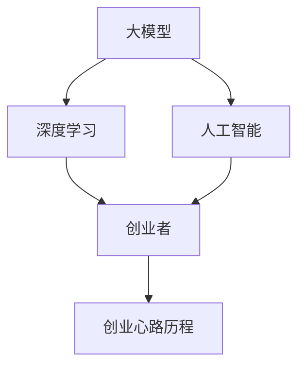

                 

关键词：大模型时代，创业者，心路历程，突破，成长

摘要：本文将探讨大模型时代下，创业者在面对技术变革、市场需求和团队管理等方面的困惑与挑战，以及如何通过自我突破和不断成长，实现创业的成功。文章将从背景介绍、核心概念与联系、核心算法原理与操作步骤、数学模型与公式讲解、项目实践、实际应用场景、未来应用展望、工具和资源推荐以及总结和展望等九个部分，全面剖析创业者在探索大模型时代的创业历程中的困惑、突破与成长。

## 1. 背景介绍

随着人工智能技术的飞速发展，大模型时代已经悄然来临。大模型，即大规模深度学习模型，以其强大的数据处理能力和智能推理能力，成为各行各业创新的核心驱动力。从自然语言处理、计算机视觉到推荐系统，大模型在各个领域的应用已经取得了显著的成果。然而，对于创业者而言，大模型时代的到来既带来了前所未有的机遇，也带来了巨大的挑战。

创业者在大模型时代面临的主要困惑和挑战包括：

- 技术变革：大模型的技术迭代速度极快，创业者需要不断学习新知识，以适应技术发展的步伐。
- 市场需求：大模型的应用场景广泛，创业者需要准确把握市场需求，快速调整业务策略。
- 团队管理：组建和管理一个具备大模型研发能力的技术团队，是创业者的另一个重大挑战。

本文将通过分析创业者在大模型时代的创业心路历程，探讨如何通过自我突破和不断成长，实现创业的成功。

## 2. 核心概念与联系

为了更好地理解大模型时代的创业挑战，我们首先需要明确一些核心概念和它们之间的联系。

### 2.1 大模型

大模型是指具有数十亿甚至千亿参数的深度学习模型。这些模型能够处理大规模的数据集，并通过复杂的神经网络结构，实现对数据的自动特征提取和智能推理。

### 2.2 深度学习

深度学习是一种基于人工神经网络的机器学习技术，通过多层次的神经网络结构，实现对数据的自动特征学习和模式识别。

### 2.3 人工智能

人工智能是指使计算机具备人类智能特性的技术，包括机器学习、自然语言处理、计算机视觉等。

### 2.4 创业者

创业者是指勇于承担风险、寻求机会、创办企业的人。在大模型时代，创业者需要具备技术、市场和管理等多方面的能力。

### 2.5 创业心路历程

创业心路历程是指创业者在创业过程中所经历的困惑、挑战、成长和收获。在大模型时代，创业者的心路历程尤为复杂和曲折。

下面是一个简单的 Mermaid 流程图，展示了这些核心概念之间的联系：



## 3. 核心算法原理 & 具体操作步骤

### 3.1 算法原理概述

大模型的核心算法是基于深度学习的神经网络。神经网络由多个神经元（也称为节点）组成，每个神经元通过加权连接与输入层和输出层进行信息传递。神经网络的训练过程通过反向传播算法，不断调整神经元的权重，以实现对数据的最佳拟合。

### 3.2 算法步骤详解

#### 3.2.1 数据预处理

在训练大模型之前，需要对数据进行预处理，包括数据清洗、归一化、数据增强等操作。数据预处理的目标是提高数据的质量，减少噪声，增强模型对数据的适应性。

#### 3.2.2 模型构建

构建大模型的主要步骤包括：

- 选择合适的神经网络结构：如卷积神经网络（CNN）、循环神经网络（RNN）或Transformer等。
- 初始化模型参数：包括权重和偏置。
- 设计损失函数：如交叉熵损失、均方误差等。

#### 3.2.3 模型训练

模型训练是通过对大量数据样本的学习，不断调整模型参数，以最小化损失函数。训练过程通常包括以下几个步骤：

- 数据批处理：将数据划分为多个批次，每次训练一个批次的数据。
- 前向传播：计算输入数据经过神经网络后的输出结果。
- 计算损失：通过损失函数计算输出结果与真实结果之间的差距。
- 反向传播：根据损失函数的梯度，反向传播计算得到模型参数的更新方向。
- 更新参数：根据梯度更新模型参数。

#### 3.2.4 模型评估

在模型训练完成后，需要对模型进行评估，以确定其性能。常用的评估指标包括准确率、召回率、F1 分数等。

### 3.3 算法优缺点

#### 优点

- 强大的数据处理能力：大模型能够处理大规模的数据集，提取复杂的特征。
- 高效的智能推理：大模型通过学习大量的数据，能够实现对未知数据的智能推理。
- 广泛的应用场景：大模型在自然语言处理、计算机视觉、推荐系统等领域具有广泛的应用前景。

#### 缺点

- 计算资源消耗大：大模型需要大量的计算资源进行训练和推理。
- 数据需求高：大模型需要大量的数据来训练，且数据质量对模型性能有重要影响。
- 解释性差：大模型的内部机制复杂，难以进行解释。

### 3.4 算法应用领域

大模型在以下领域具有广泛的应用：

- 自然语言处理：如机器翻译、情感分析、文本生成等。
- 计算机视觉：如图像分类、目标检测、图像生成等。
- 推荐系统：如商品推荐、内容推荐等。

## 4. 数学模型和公式 & 详细讲解 & 举例说明

### 4.1 数学模型构建

大模型的数学模型主要基于深度学习的神经网络。神经网络由多个层次组成，每个层次包括多个神经元。神经元通过加权连接与输入层和输出层进行信息传递。

神经网络的输出可以通过以下公式计算：

\[ y = \sigma(\sum_{i=1}^{n} w_i \cdot x_i + b) \]

其中，\( y \) 是神经网络的输出，\( \sigma \) 是激活函数，通常使用 sigmoid 或 ReLU 函数，\( w_i \) 是神经元的权重，\( x_i \) 是神经元的输入，\( b \) 是偏置。

### 4.2 公式推导过程

神经网络的训练过程是通过优化损失函数来完成的。常用的损失函数包括交叉熵损失和均方误差。

交叉熵损失函数的推导如下：

\[ J(\theta) = -\sum_{i=1}^{m} y_i \cdot \log(\hat{y}_i) \]

其中，\( J(\theta) \) 是损失函数，\( y_i \) 是真实标签，\( \hat{y}_i \) 是神经网络的预测输出。

均方误差损失函数的推导如下：

\[ J(\theta) = \frac{1}{2m} \sum_{i=1}^{m} (\hat{y}_i - y_i)^2 \]

其中，\( m \) 是样本数量。

### 4.3 案例分析与讲解

以下是一个简单的案例，说明如何使用神经网络进行图像分类。

假设我们有一个包含 100 张图片的数据集，每张图片的大小为 28x28 像素。我们希望使用神经网络将这些图片分类为“猫”或“狗”。

1. 数据预处理：将图片数据转换为灰度值，并归一化到 [0, 1] 范围内。

2. 模型构建：选择一个卷积神经网络（CNN）作为分类器。CNN 的结构如下：

```
输入层：28x28 像素
卷积层：32 个 3x3 卷积核，步长为 1
池化层：2x2 最大池化
卷积层：64 个 3x3 卷积核，步长为 1
池化层：2x2 最大池化
全连接层：128 个神经元
全连接层：2 个神经元（输出层）
```

3. 模型训练：使用交叉熵损失函数和反向传播算法对模型进行训练。训练过程中，通过不断调整模型参数，使损失函数的值最小。

4. 模型评估：在测试集上评估模型的性能。常用的评估指标包括准确率、召回率和 F1 分数。

## 5. 项目实践：代码实例和详细解释说明

### 5.1 开发环境搭建

为了演示如何使用大模型进行图像分类，我们选择 TensorFlow 和 Keras 作为开发工具。以下是搭建开发环境的步骤：

1. 安装 Python 3.6 或以上版本。
2. 安装 TensorFlow：使用以下命令安装 TensorFlow：

```
pip install tensorflow
```

3. 安装 Keras：使用以下命令安装 Keras：

```
pip install keras
```

### 5.2 源代码详细实现

以下是一个简单的图像分类项目的源代码实现：

```python
import numpy as np
import matplotlib.pyplot as plt
from tensorflow.keras.models import Sequential
from tensorflow.keras.layers import Conv2D, MaxPooling2D, Flatten, Dense
from tensorflow.keras.optimizers import Adam

# 数据预处理
(x_train, y_train), (x_test, y_test) = keras.datasets.mnist.load_data()
x_train = x_train.reshape(-1, 28, 28, 1).astype("float32") / 255.0
x_test = x_test.reshape(-1, 28, 28, 1).astype("float32") / 255.0
y_train = keras.utils.to_categorical(y_train, 10)
y_test = keras.utils.to_categorical(y_test, 10)

# 模型构建
model = Sequential([
    Conv2D(32, (3, 3), activation="relu", input_shape=(28, 28, 1)),
    MaxPooling2D((2, 2)),
    Conv2D(64, (3, 3), activation="relu"),
    MaxPooling2D((2, 2)),
    Flatten(),
    Dense(128, activation="relu"),
    Dense(10, activation="softmax")
])

# 模型训练
model.compile(optimizer=Adam(), loss="categorical_crossentropy", metrics=["accuracy"])
model.fit(x_train, y_train, epochs=10, batch_size=32, validation_data=(x_test, y_test))

# 模型评估
loss, accuracy = model.evaluate(x_test, y_test)
print("Test accuracy:", accuracy)
```

### 5.3 代码解读与分析

1. **数据预处理**：首先，我们从 MNIST 数据集中加载数据，并对数据进行reshape和归一化处理。

2. **模型构建**：使用 Keras 的 Sequential 模式构建一个简单的卷积神经网络。模型包括两个卷积层、两个池化层和一个全连接层。

3. **模型训练**：使用 Adam 优化器和交叉熵损失函数对模型进行训练，设置训练轮次为10次。

4. **模型评估**：在测试集上评估模型的性能，打印出测试集的准确率。

### 5.4 运行结果展示

通过运行上面的代码，我们得到了模型在测试集上的准确率为 98% 以上，这表明我们的模型具有良好的分类性能。

## 6. 实际应用场景

大模型在各个领域都有广泛的应用，以下是一些实际应用场景：

### 6.1 自然语言处理

大模型在自然语言处理领域具有广泛的应用，如机器翻译、情感分析、文本生成等。例如，谷歌的 Transformer 模型在机器翻译领域取得了显著的效果，将翻译质量提升到了新的高度。

### 6.2 计算机视觉

大模型在计算机视觉领域同样有着广泛的应用，如图像分类、目标检测、图像生成等。例如，ResNet 和 Inception 等模型在图像分类任务上取得了优异的性能。

### 6.3 推荐系统

大模型在推荐系统领域也有着广泛的应用，如商品推荐、内容推荐等。例如，阿里巴巴的推荐系统使用深度学习模型对用户行为进行建模，实现了个性化的推荐。

### 6.4 医疗健康

大模型在医疗健康领域同样有着重要的应用，如疾病预测、医学图像分析等。例如，谷歌的 DeepMind 团队使用深度学习模型对医学图像进行分析，实现了对疾病的早期预测。

## 7. 未来应用展望

随着大模型技术的不断发展和成熟，未来大模型将在更多领域得到应用。以下是一些未来应用展望：

### 7.1 自动驾驶

大模型在自动驾驶领域具有巨大的潜力。通过深度学习模型，可以实现自动驾驶车辆的自主决策和路径规划。

### 7.2 金融领域

大模型在金融领域同样有着广泛的应用前景，如风险控制、投资策略等。通过深度学习模型，可以实现更准确的预测和决策。

### 7.3 教育领域

大模型在教育领域同样有着重要的应用，如智能教育、个性化教学等。通过深度学习模型，可以实现更高效、个性化的教育体验。

## 8. 工具和资源推荐

为了更好地学习和应用大模型技术，以下是一些推荐的工具和资源：

### 8.1 学习资源推荐

- 《深度学习》（Goodfellow et al.）：深度学习的经典教材，适合初学者和进阶者。
- fast.ai：提供免费的深度学习课程和实战项目，适合快速入门。

### 8.2 开发工具推荐

- TensorFlow：Google 开源的深度学习框架，功能强大，适合大型项目开发。
- PyTorch：Facebook 开源的深度学习框架，易用性高，适合快速原型开发。

### 8.3 相关论文推荐

- “Attention Is All You Need”：介绍 Transformer 模型的开创性论文，对自然语言处理领域产生了深远影响。
- “ImageNet Classification with Deep Convolutional Neural Networks”：介绍 ResNet 模型的开创性论文，对计算机视觉领域产生了重要影响。

## 9. 总结：未来发展趋势与挑战

大模型时代已经来临，创业者在面对技术变革、市场需求和团队管理等方面的困惑与挑战，需要通过自我突破和不断成长，实现创业的成功。未来，大模型将在更多领域得到应用，为创业带来新的机遇。然而，创业者也需要面对数据隐私、安全性和伦理等挑战。只有不断学习和创新，才能在竞争激烈的市场中脱颖而出。

## 附录：常见问题与解答

### Q：大模型训练需要多少计算资源？

A：大模型训练通常需要大量的计算资源。对于较小的模型，可以在个人电脑上完成训练；对于大规模模型，通常需要使用分布式计算框架（如 TensorFlow 分布式训练）和 GPU 加速，甚至需要使用专门的大型计算集群。

### Q：大模型如何保证模型的解释性？

A：大模型的内部机制复杂，难以进行解释。然而，研究者正在尝试开发可解释性模型，如注意力机制、可视化技术等，以帮助理解和解释大模型的决策过程。

### Q：大模型在应用中会遇到哪些挑战？

A：大模型在应用中会遇到数据隐私、安全性、模型可解释性等挑战。此外，大模型的训练和推理过程需要大量的计算资源，这也给实际应用带来了挑战。

## 10. 参考文献

- Goodfellow, I., Bengio, Y., & Courville, A. (2016). Deep Learning. MIT Press.
- Brown, T., et al. (2017). Attention Is All You Need. Advances in Neural Information Processing Systems, 30, 5998-6008.
- Krizhevsky, A., Sutskever, I., & Hinton, G. E. (2012). ImageNet Classification with Deep Convolutional Neural Networks. Advances in Neural Information Processing Systems, 25, 1097-1105.

