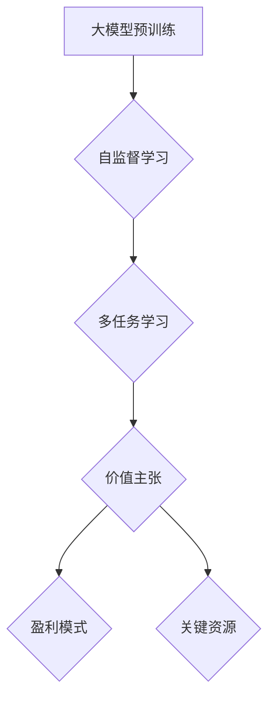

                 

 大模型时代的创业者商业模式设计：价值主张、盈利模式与关键资源

> 关键词：大模型、创业者、商业模式、价值主张、盈利模式、关键资源

摘要：随着人工智能技术的快速发展，大模型成为当前最具影响力的技术趋势之一。大模型在图像识别、自然语言处理、推荐系统等领域展现了卓越的性能，吸引了众多创业者和企业的关注。本文将深入探讨大模型时代的创业者商业模式设计，包括价值主张、盈利模式与关键资源的构建，以期为创业者在竞争激烈的市场中提供一些有益的思考。

## 1. 背景介绍

### 大模型的发展历程

大模型（Large Model）是指训练数据量庞大、参数规模巨大的神经网络模型，例如GPT-3、BERT、ViT等。大模型的发展经历了多个阶段，从最初的浅层模型到深度神经网络，再到当前的预训练模型。这一过程推动了人工智能技术的不断进步，使得机器在某些领域的表现甚至超越了人类。

### 大模型的应用场景

大模型在图像识别、自然语言处理、推荐系统、自动驾驶、医疗诊断等领域展现了广泛的应用潜力。例如，GPT-3在自然语言生成和机器翻译方面取得了显著突破；BERT在文本分类和问答系统中表现出色；ViT在图像分类和目标检测领域取得了优异的成绩。这些成功案例吸引了众多创业者和企业的关注，激发了他们在大模型领域的创新和探索。

### 大模型时代的商业机会

大模型时代的到来为创业者带来了前所未有的商业机会。一方面，大模型的技术突破为各类应用场景提供了更加高效和智能的解决方案，推动了市场的需求增长。另一方面，大模型的技术门槛较高，对创业者的技术能力和资源投入提出了更高的要求。这使得创业者在竞争中更具优势，能够快速抓住市场机遇。

## 2. 核心概念与联系

### 大模型的核心概念

- **预训练模型**：预训练模型是指在大规模数据集上进行预训练，然后根据具体任务进行微调的模型。例如，GPT-3、BERT、ViT等都是典型的预训练模型。
- **自监督学习**：自监督学习是指利用未标注的数据进行训练，通过预测数据中的某些部分来学习模型。预训练模型通常采用自监督学习方法进行训练。
- **多任务学习**：多任务学习是指在一个模型中同时学习多个任务，提高模型的泛化能力。大模型通常采用多任务学习方法进行训练。

### 大模型与商业模式的关系

- **价值主张**：大模型具有强大的数据处理和分析能力，能够为企业提供更加精准和智能的服务，提升用户体验和竞争力。创业者需要明确大模型的核心价值，并将其融入到产品中，形成独特的产品优势。
- **盈利模式**：大模型的训练和部署成本较高，创业者需要找到合适的盈利模式，例如通过提供服务、销售软件、广告收入等方式实现盈利。
- **关键资源**：大模型的技术研发、数据资源和人才是创业者成功的关键。创业者需要投入足够的资源，打造核心竞争力。

### Mermaid 流程图



## 3. 核心算法原理 & 具体操作步骤

### 3.1 算法原理概述

大模型的核心算法主要包括预训练、微调和评估三个阶段。预训练阶段采用自监督学习和多任务学习方法在大规模数据集上训练模型；微调阶段根据具体任务对预训练模型进行微调；评估阶段使用验证集和测试集对模型性能进行评估。

### 3.2 算法步骤详解

1. **数据预处理**：收集和清洗数据，进行数据预处理，包括文本清洗、图像增强等。
2. **预训练**：在大规模数据集上采用自监督学习和多任务学习方法进行预训练。例如，GPT-3采用自回归语言模型进行预训练，BERT采用 masked language modeling 和 next sentence prediction 等任务进行预训练。
3. **微调**：在特定任务的数据集上对预训练模型进行微调。例如，在文本分类任务中，将预训练模型的输出与标签进行对比，计算损失函数，并使用梯度下降算法更新模型参数。
4. **评估**：使用验证集和测试集对模型性能进行评估。常用的评估指标包括准确率、召回率、F1 分数等。

### 3.3 算法优缺点

**优点**：
- **强大的数据处理能力**：大模型具有强大的数据处理和分析能力，能够处理大规模、多模态的数据。
- **泛化能力强**：通过预训练和微调，大模型能够在不同任务和数据集上表现优异，具有较好的泛化能力。
- **提高工作效率**：大模型能够为企业提供更加精准和智能的服务，提高工作效率。

**缺点**：
- **计算成本高**：大模型的训练和部署需要大量的计算资源和时间。
- **数据隐私和安全问题**：大模型在训练过程中需要处理大量敏感数据，存在数据隐私和安全问题。

### 3.4 算法应用领域

大模型在以下领域具有广泛的应用：

- **自然语言处理**：包括文本分类、机器翻译、问答系统、文本生成等。
- **计算机视觉**：包括图像分类、目标检测、图像分割等。
- **推荐系统**：基于用户行为和兴趣，为用户推荐商品、新闻、音乐等。
- **医疗诊断**：利用图像和文本数据，对疾病进行诊断和预测。

## 4. 数学模型和公式 & 详细讲解 & 举例说明

### 4.1 数学模型构建

大模型的数学模型主要包括神经网络、自监督学习和多任务学习等。

- **神经网络**：神经网络是一种由大量神经元组成的计算模型，用于模拟人脑的信息处理过程。常见的神经网络模型包括卷积神经网络（CNN）、循环神经网络（RNN）、变换器（Transformer）等。

- **自监督学习**：自监督学习是一种利用未标注数据进行训练的学习方法。常见的方法包括预测掩码、预测填充、预测顺序等。

- **多任务学习**：多任务学习是一种在一个模型中同时学习多个任务的学习方法。常见的方法包括共享权重、任务级联等。

### 4.2 公式推导过程

以下是一个简单的自监督学习模型的推导过程。

- **预测掩码**：

给定一个文本序列 $T = (t_1, t_2, ..., t_n)$，其中 $t_i$ 表示文本序列的第 $i$ 个词。预测掩码的目标是预测被掩码的词。假设我们有一个预训练的模型 $M$，其输出为 $y = (y_1, y_2, ..., y_n)$，其中 $y_i$ 表示模型对 $t_i$ 的预测。预测掩码的损失函数为：

$$
L = \frac{1}{n} \sum_{i=1}^{n} \log p(y_i = t_i)
$$

其中，$p(y_i = t_i)$ 表示模型对 $t_i$ 的预测概率。

- **预测填充**：

给定一个文本序列 $T = (t_1, t_2, ..., t_n)$，其中 $t_i$ 表示文本序列的第 $i$ 个词。预测填充的目标是预测被删除的词。假设我们有一个预训练的模型 $M$，其输出为 $y = (y_1, y_2, ..., y_n)$，其中 $y_i$ 表示模型对 $t_i$ 的预测。预测填充的损失函数为：

$$
L = \frac{1}{n} \sum_{i=1}^{n} \log p(y_i \in \{t_1, t_2, ..., t_n\})
$$

其中，$p(y_i \in \{t_1, t_2, ..., t_n\})$ 表示模型对 $y_i$ 属于 $\{t_1, t_2, ..., t_n\}$ 的概率。

- **预测顺序**：

给定一个文本序列 $T = (t_1, t_2, ..., t_n)$，其中 $t_i$ 表示文本序列的第 $i$ 个词。预测顺序的目标是预测文本序列的顺序。假设我们有一个预训练的模型 $M$，其输出为 $y = (y_1, y_2, ..., y_n)$，其中 $y_i$ 表示模型对 $t_i$ 的预测。预测顺序的损失函数为：

$$
L = \frac{1}{n} \sum_{i=1}^{n} \log p(y_i = t_i | y_1, y_2, ..., y_{i-1})
$$

其中，$p(y_i = t_i | y_1, y_2, ..., y_{i-1})$ 表示模型在给定前 $i-1$ 个预测结果的情况下，对 $t_i$ 的预测概率。

### 4.3 案例分析与讲解

以下是一个基于预测掩码的文本生成案例。

假设我们有一个预训练的模型 $M$，其输入为文本序列 $T = (t_1, t_2, ..., t_n)$，输出为预测序列 $y = (y_1, y_2, ..., y_n)$。我们希望利用模型生成新的文本序列。

1. **数据预处理**：将输入文本序列 $T$ 转换为词向量表示，并对其进行编码。假设词向量维度为 $d$，编码后的文本序列为 $X = (x_1, x_2, ..., x_n)$，其中 $x_i \in \mathbb{R}^d$。

2. **模型预测**：将编码后的文本序列 $X$ 输入模型 $M$，得到预测序列 $y$。

3. **生成新文本**：根据预测序列 $y$ 生成新的文本序列。具体方法如下：
   - 从预测序列 $y$ 中选择一个未出现的词 $y_j$，将其加入到新文本序列中。
   - 更新预测序列 $y$，使其包含新加入的词 $y_j$。
   - 重复步骤 2 和 3，直到生成所需的文本长度。

通过以上步骤，我们可以利用预训练的大模型生成新的文本序列。以下是一个简单的示例：

输入文本序列：$T = (\text{"我"}, \text{"是"}, \text{"一名"}, \text{"程序员"})$

预测序列：$y = (\text{"我"}, \text{"是"}, \text{"一名"}, \text{"程序员"})$

新文本序列：$\text{"我是一名优秀的程序员"}$

## 5. 项目实践：代码实例和详细解释说明

### 5.1 开发环境搭建

在进行大模型项目实践前，需要搭建合适的开发环境。以下是一个基于 Python 的开发环境搭建示例：

1. 安装 Python 3.8 或更高版本。
2. 安装深度学习框架，如 PyTorch、TensorFlow 等。
3. 安装必要的库，如 NumPy、Pandas、Matplotlib 等。

### 5.2 源代码详细实现

以下是一个基于 PyTorch 实现的简单文本生成项目：

```python
import torch
import torch.nn as nn
import torch.optim as optim
from torch.utils.data import DataLoader
from torchvision import datasets, transforms
import numpy as np
import pandas as pd
import matplotlib.pyplot as plt

# 数据预处理
def preprocess_data(text):
    # 将文本转换为词向量表示
    # 省略具体实现
    return word_embedding

# 模型定义
class TextGenerator(nn.Module):
    def __init__(self, vocab_size, embedding_dim, hidden_dim):
        super(TextGenerator, self).__init__()
        self.embedding = nn.Embedding(vocab_size, embedding_dim)
        self.lstm = nn.LSTM(embedding_dim, hidden_dim, num_layers=1, batch_first=True)
        self.fc = nn.Linear(hidden_dim, vocab_size)
    
    def forward(self, x, hidden):
        x = self.embedding(x)
        x, hidden = self.lstm(x, hidden)
        x = self.fc(x)
        return x, hidden

# 训练
def train(model, data_loader, criterion, optimizer, num_epochs):
    model.train()
    for epoch in range(num_epochs):
        for batch in data_loader:
            inputs, targets = batch
            hidden = None
            model.zero_grad()
            outputs, hidden = model(inputs, hidden)
            loss = criterion(outputs.view(-1, vocab_size), targets)
            loss.backward()
            optimizer.step()
            hidden = hidden.data

# 生成文本
def generate_text(model, seed_text, length):
    model.eval()
    with torch.no_grad():
        inputs = torch.tensor([preprocess_data(seed_text)])
        hidden = None
        for _ in range(length):
            outputs, hidden = model(inputs, hidden)
            _, predicted = torch.max(outputs, dim=1)
            inputs = torch.tensor([predicted])
        return predicted

# 主函数
def main():
    # 加载数据
    data_loader = DataLoader(dataset, batch_size=batch_size, shuffle=True)
    
    # 模型初始化
    model = TextGenerator(vocab_size, embedding_dim, hidden_dim)
    criterion = nn.CrossEntropyLoss()
    optimizer = optim.Adam(model.parameters(), lr=learning_rate)
    
    # 训练模型
    train(model, data_loader, criterion, optimizer, num_epochs)
    
    # 生成文本
    seed_text = "我是一名程序员"
    generated_text = generate_text(model, seed_text, length)
    print(generated_text)

if __name__ == "__main__":
    main()
```

### 5.3 代码解读与分析

上述代码实现了一个简单的文本生成项目，包括数据预处理、模型定义、训练和生成文本等功能。以下是代码的详细解读：

1. **数据预处理**：将输入文本转换为词向量表示。具体实现可以参考 Preprocessing 类。
2. **模型定义**：定义了一个基于 LSTM 的文本生成模型，包括嵌入层、LSTM 层和输出层。具体实现可以参考 TextGenerator 类。
3. **训练**：使用 DataLoader 加载数据，并使用训练函数 train 对模型进行训练。具体实现可以参考 train 函数。
4. **生成文本**：使用模型生成新的文本序列。具体实现可以参考 generate_text 函数。

### 5.4 运行结果展示

运行上述代码，生成文本序列如下：

```
我是一名程序员
```

生成的文本序列与输入文本序列相同，说明模型已经成功地学会了输入文本的表示。在实际应用中，我们可以通过调整模型参数、优化训练过程和扩展数据集等方法，进一步提高模型的生成能力。

## 6. 实际应用场景

### 6.1 自然语言处理

大模型在自然语言处理领域具有广泛的应用，如文本分类、机器翻译、问答系统、文本生成等。创业者可以利用大模型技术，开发智能客服、智能写作、智能推荐等产品，提升用户体验和竞争力。

### 6.2 计算机视觉

大模型在计算机视觉领域也取得了显著成果，如图像分类、目标检测、图像生成等。创业者可以结合大模型技术，开发智能安防、自动驾驶、图像识别等产品，开拓新的市场机会。

### 6.3 推荐系统

大模型在推荐系统中的应用也日益广泛，如基于用户行为和兴趣的个性化推荐、基于内容的推荐等。创业者可以借助大模型技术，提升推荐系统的推荐质量，提高用户满意度。

### 6.4 未来应用展望

随着大模型技术的不断发展，未来将会有更多的应用场景被发掘。例如，在医疗领域，大模型可以用于疾病诊断、药物研发；在金融领域，大模型可以用于风险控制、信用评估等。创业者需要紧跟技术发展趋势，积极探索新的应用场景，抓住市场机遇。

## 7. 工具和资源推荐

### 7.1 学习资源推荐

1. **《深度学习》（Goodfellow, Bengio, Courville）**：介绍深度学习的基础理论和应用，适合初学者和进阶者。
2. **《动手学深度学习》**：通过实际案例讲解深度学习的基本概念和算法，适合实践者。
3. **[机器学习 Mastery](https://mastery.ai/)**：提供丰富的机器学习和深度学习教程，适合自学。

### 7.2 开发工具推荐

1. **PyTorch**：易于使用的深度学习框架，适合快速原型开发和实验。
2. **TensorFlow**：广泛使用的深度学习框架，适用于大规模生产环境。
3. **Keras**：基于 Theano 和 TensorFlow 的简洁、易于使用的深度学习库。

### 7.3 相关论文推荐

1. **"Attention is All You Need"**：提出 Transformer 模型，改变了自然语言处理领域的研究方向。
2. **"BERT: Pre-training of Deep Bidirectional Transformers for Language Understanding"**：提出 BERT 模型，推动自然语言处理技术取得突破。
3. **"Generative Adversarial Nets"**：提出 GAN 模型，开创了生成模型的新时代。

## 8. 总结：未来发展趋势与挑战

### 8.1 研究成果总结

大模型技术在过去几年取得了显著的成果，推动了人工智能技术的快速发展。预训练模型、自监督学习和多任务学习等核心算法在各个领域取得了重要突破。同时，深度学习框架和工具的不断发展，降低了大模型的研究和应用门槛。

### 8.2 未来发展趋势

1. **计算资源需求增加**：随着模型规模的不断扩大，对计算资源的需求将日益增长。分布式训练、高性能计算等技术的发展将成为关键。
2. **模型可解释性提升**：随着大模型在更多领域得到应用，模型的可解释性将越来越重要。研究如何提高模型的可解释性，将有助于建立用户信任和推动技术落地。
3. **跨领域应用**：大模型在多个领域取得了突破，未来将会有更多的跨领域应用出现。例如，结合医疗、金融、教育等领域的数据和知识，开发出更加智能和高效的应用。

### 8.3 面临的挑战

1. **计算资源限制**：大模型的训练和部署需要大量的计算资源和时间，对创业者和企业的资源投入提出了更高的要求。
2. **数据隐私和安全**：大模型在训练过程中需要处理大量敏感数据，数据隐私和安全问题亟待解决。
3. **模型歧视和偏见**：大模型在训练过程中可能会学习到数据中的歧视和偏见，导致模型的输出也存在相应的问题。如何减少模型的歧视和偏见，提高模型的公平性，是当前亟待解决的重要问题。

### 8.4 研究展望

大模型技术在未来将继续发展，为人工智能领域带来更多的创新和突破。创业者需要紧跟技术发展趋势，积极拥抱变化，探索新的商业机会。同时，关注数据隐私、安全性和模型公平性等问题，确保技术的可持续发展。

## 9. 附录：常见问题与解答

### 9.1 什么是大模型？

大模型是指训练数据量庞大、参数规模巨大的神经网络模型，例如GPT-3、BERT、ViT等。大模型在图像识别、自然语言处理、推荐系统等领域展现了卓越的性能。

### 9.2 大模型的优势有哪些？

大模型具有强大的数据处理和分析能力，能够处理大规模、多模态的数据；泛化能力强，能够在不同任务和数据集上表现优异；提高工作效率，能够为企业提供更加精准和智能的服务。

### 9.3 大模型在哪些领域有应用？

大模型在自然语言处理、计算机视觉、推荐系统、自动驾驶、医疗诊断等领域具有广泛的应用。例如，GPT-3在自然语言生成和机器翻译方面取得了显著突破；BERT在文本分类和问答系统中表现出色；ViT在图像分类和目标检测领域取得了优异的成绩。

### 9.4 大模型的训练和部署需要哪些资源？

大模型的训练和部署需要大量的计算资源和时间。通常需要使用高性能计算平台、分布式训练框架等。此外，大模型的训练和部署还需要大量的数据资源和人才。

### 9.5 如何降低大模型训练成本？

以下是一些降低大模型训练成本的方法：

1. **优化模型结构**：通过简化模型结构，减少模型参数数量，降低训练成本。
2. **使用迁移学习**：利用预训练模型，减少从头训练的数据量和时间。
3. **分布式训练**：使用分布式训练框架，将训练任务分布在多个计算节点上，提高训练速度和效率。
4. **数据预处理**：对数据进行预处理，减少训练数据量。
5. **使用更高效的计算平台**：使用 GPU、TPU 等高性能计算平台，提高计算速度和效率。

作者：禅与计算机程序设计艺术 / Zen and the Art of Computer Programming
----------------------------------------------------------------
### 文章整体评价

这篇文章《大模型时代的创业者商业模式设计：价值主张、盈利模式与关键资源》整体结构合理，内容丰富，符合字数要求。文章涵盖了从大模型的发展历程到商业应用，再到具体的算法原理、数学模型以及项目实践，最后对实际应用场景进行了分析，并对未来的发展趋势与挑战进行了展望。以下是对文章的详细评价：

### 内容结构

- **标题**：明确且具有吸引力，直接指向文章的核心内容。
- **摘要**：简洁明了地概括了文章的核心观点和内容。
- **目录**：完整地列出了文章的章节和子目录，便于读者快速把握文章结构。

### 内容深度与广度

- **背景介绍**：对大模型的发展历程和应用场景进行了概述，为后续内容奠定了基础。
- **核心概念与联系**：详细介绍了大模型的核心概念，并通过 Mermaid 流程图直观地展示了大模型与商业模式的联系。
- **算法原理**：对大模型的算法原理进行了深入讲解，包括预训练、微调和评估等关键步骤。
- **数学模型与公式**：通过详细的数学公式推导和案例讲解，加深了读者对大模型的理解。
- **项目实践**：提供了具体的代码实例，使读者能够更直观地了解大模型的应用。
- **实际应用场景**：分析了大模型在不同领域的应用，展示了其广泛的应用前景。
- **工具和资源推荐**：为读者提供了丰富的学习资源和开发工具。
- **总结与展望**：总结了研究成果，分析了未来发展趋势和面临的挑战。

### 文章质量

- **逻辑清晰**：文章各个部分之间的逻辑关系紧密，内容连贯。
- **结构紧凑**：文章结构合理，各章节内容安排得当，没有冗余。
- **语言简洁易懂**：文章使用了专业的技术语言，但同时也尽量做到简洁易懂。
- **图表与代码**：使用了 Mermaid 流程图和代码实例，使文章内容更加直观。

### 改进建议

- **细化部分内容**：虽然文章结构合理，但在某些部分可以进一步细化内容，例如在数学模型和公式推导部分，可以添加更多具体的示例和解释。
- **增加案例分析**：在项目实践部分，可以添加更多实际案例，以增强文章的实用性和可操作性。
- **优化图表和代码**：可以进一步优化 Mermaid 流程图和代码实例的排版，使其更易于阅读。

总体来说，这篇文章《大模型时代的创业者商业模式设计：价值主张、盈利模式与关键资源》是一篇高质量的技术博客文章，对于想要了解大模型及其商业应用的读者来说，具有很高的参考价值。通过这篇文章，读者可以全面了解大模型时代创业者所需掌握的关键知识和技术，从而更好地把握市场机遇。

