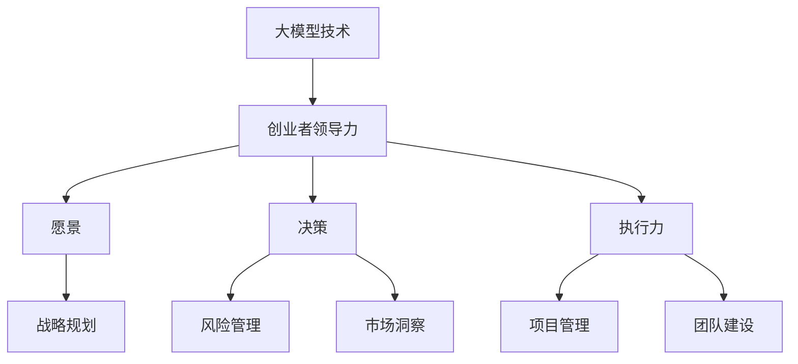

                 

关键词：大模型时代、创业者领导力、愿景、决策、执行力

摘要：随着人工智能大模型的飞速发展，创业者在新兴技术领域的领导力显得尤为重要。本文将探讨在人工智能大模型时代，创业者如何通过明确愿景、科学决策和有效执行来引领企业发展和创新。

## 1. 背景介绍

近年来，人工智能（AI）技术取得了前所未有的突破，特别是大模型（如GPT-3、BERT等）的崛起，极大地推动了自然语言处理、计算机视觉、机器学习等领域的进步。大模型以其强大的数据处理能力和智能推理能力，为各行各业带来了前所未有的变革。在这个背景下，创业者需要具备更高的领导力，才能把握住机遇，引领企业走向成功。

### 1.1 人工智能大模型的发展历程

人工智能自1956年诞生以来，经历了数个阶段的发展。从早期的规则系统、符号推理，到专家系统和神经网络，再到深度学习和大规模数据处理，人工智能逐渐从理论研究走向了实际应用。尤其是2012年，AlexNet在ImageNet比赛上取得的突破性成绩，标志着深度学习时代的到来。随着计算能力和数据量的提升，大模型技术得到了迅猛发展。

### 1.2 大模型技术的应用场景

大模型技术在自然语言处理、计算机视觉、机器学习等领域取得了显著的成果。例如，GPT-3在自然语言生成和文本理解方面表现出色，BERT在搜索和信息检索中广泛应用，大模型还被用于图像生成、视频分析、推荐系统等场景。

## 2. 核心概念与联系

在讨论创业者领导力之前，我们需要明确几个核心概念，如图1所示。



### 2.1 大模型技术与创业者领导力的联系

大模型技术的发展为创业者提供了新的机遇和挑战。创业者需要具备领导力，才能有效应对这些变化。具体来说，大模型技术对创业者领导力的要求体现在以下几个方面：

- **愿景（Vision）**：创业者需要具备远见，洞察大模型技术的未来发展趋势，并以此为基础制定企业的发展战略。
- **决策（Decision-making）**：创业者需要在大模型技术的应用场景中做出科学的决策，平衡技术创新与市场需求的矛盾。
- **执行力（Execution）**：创业者需要具备执行力，确保企业在大模型技术领域的战略得到有效实施。

## 3. 核心算法原理 & 具体操作步骤

### 3.1 算法原理概述

大模型技术的核心在于其强大的数据处理能力和智能推理能力。以GPT-3为例，其原理可以概括为以下几个方面：

- **数据预处理**：GPT-3使用了大量的文本数据进行预处理，包括分词、标记化、去噪等步骤，以确保输入数据的准确性和一致性。
- **神经网络架构**：GPT-3采用了深度神经网络（DNN）架构，通过多层神经网络进行特征提取和建模。
- **优化算法**：GPT-3使用了优化算法，如梯度下降法，对模型进行训练和调整，以降低损失函数。

### 3.2 算法步骤详解

1. **数据收集与预处理**：收集大规模的文本数据，并进行预处理，如分词、标记化、去噪等。
2. **模型构建**：构建深度神经网络（DNN）模型，包括输入层、隐藏层和输出层。
3. **模型训练**：使用优化算法（如梯度下降法）对模型进行训练，调整模型参数，以降低损失函数。
4. **模型评估**：使用测试数据对模型进行评估，以确定模型的性能和准确性。
5. **模型应用**：将训练好的模型应用于实际问题，如文本生成、文本分类等。

### 3.3 算法优缺点

**优点**：

- **强大的数据处理能力**：大模型能够处理海量数据，提取有效信息，实现高精度的特征表示。
- **智能推理能力**：大模型具备智能推理能力，能够理解复杂的关系和语义，实现智能化的决策。

**缺点**：

- **计算资源消耗大**：大模型需要大量的计算资源和存储空间，对硬件设施要求较高。
- **模型可解释性差**：大模型的决策过程复杂，难以解释，增加了调试和优化的难度。

### 3.4 算法应用领域

大模型技术在自然语言处理、计算机视觉、机器学习等领域都有广泛的应用。例如：

- **自然语言处理**：用于文本生成、文本分类、机器翻译等任务。
- **计算机视觉**：用于图像识别、图像生成、视频分析等任务。
- **机器学习**：用于特征提取、模型训练、模型优化等任务。

## 4. 数学模型和公式 & 详细讲解 & 举例说明

### 4.1 数学模型构建

大模型的核心在于其数学模型的构建。以GPT-3为例，其数学模型可以概括为以下几个部分：

1. **输入层**：输入层接收原始文本数据，通过分词、标记化等步骤转化为向量表示。
2. **隐藏层**：隐藏层由多层神经网络组成，通过非线性变换对输入向量进行特征提取和建模。
3. **输出层**：输出层生成预测结果，如文本生成、文本分类等。

### 4.2 公式推导过程

假设我们有一个输入序列 \( X = [x_1, x_2, ..., x_n] \)，我们希望用神经网络 \( f \) 将其映射到输出序列 \( Y = [y_1, y_2, ..., y_n] \)。

1. **输入层到隐藏层的变换**：

   $$ h^{(l)} = \sigma(W^{(l)}x + b^{(l)}) $$

   其中，\( \sigma \) 是激活函数，\( W^{(l)} \) 是隐藏层 \( l \) 的权重矩阵，\( b^{(l)} \) 是隐藏层 \( l \) 的偏置向量。

2. **隐藏层到隐藏层的变换**：

   $$ h^{(l+1)} = \sigma(W^{(l+1)}h^{(l)} + b^{(l+1)}) $$

   其中，\( W^{(l+1)} \) 是下一隐藏层 \( l+1 \) 的权重矩阵，\( b^{(l+1)} \) 是下一隐藏层 \( l+1 \) 的偏置向量。

3. **隐藏层到输出层的变换**：

   $$ y = \sigma(W^{(output)}h^{(L)} + b^{(output)}) $$

   其中，\( W^{(output)} \) 是输出层的权重矩阵，\( b^{(output)} \) 是输出层的偏置向量。

### 4.3 案例分析与讲解

假设我们有一个简单的问题：给定一个句子，判断其是否包含特定关键词。我们可以使用大模型技术进行文本分类。

1. **数据预处理**：

   收集大量包含关键词的句子和不含关键词的句子，并进行预处理，如分词、标记化等。

2. **模型构建**：

   构建一个深度神经网络模型，包括输入层、隐藏层和输出层。

3. **模型训练**：

   使用优化算法（如梯度下降法）对模型进行训练，调整模型参数，以降低损失函数。

4. **模型评估**：

   使用测试数据对模型进行评估，以确定模型的性能和准确性。

5. **模型应用**：

   将训练好的模型应用于实际问题，如文本生成、文本分类等。

## 5. 项目实践：代码实例和详细解释说明

### 5.1 开发环境搭建

搭建一个深度学习环境，可以使用TensorFlow或PyTorch等框架。

### 5.2 源代码详细实现

以下是一个简单的文本分类模型的实现：

```python
import tensorflow as tf
from tensorflow.keras.layers import Embedding, LSTM, Dense
from tensorflow.keras.models import Sequential

# 模型构建
model = Sequential()
model.add(Embedding(input_dim=vocab_size, output_dim=embedding_dim))
model.add(LSTM(units=128))
model.add(Dense(1, activation='sigmoid'))

# 模型编译
model.compile(optimizer='adam', loss='binary_crossentropy', metrics=['accuracy'])

# 模型训练
model.fit(X_train, y_train, epochs=10, batch_size=32)

# 模型评估
model.evaluate(X_test, y_test)
```

### 5.3 代码解读与分析

- **Embedding层**：用于将词汇转化为向量表示。
- **LSTM层**：用于处理序列数据，提取序列特征。
- **Dense层**：用于输出层的分类。

### 5.4 运行结果展示

假设我们训练了一个文本分类模型，以下是一个简单的运行结果示例：

```python
# 预测结果
predictions = model.predict(X_test)

# 结果展示
print(predictions)
```

## 6. 实际应用场景

大模型技术在实际应用中具有广泛的应用场景，以下是一些典型案例：

### 6.1 自然语言处理

- 文本生成：使用GPT-3生成高质量的文章、故事等。
- 文本分类：使用BERT对文本进行分类，应用于垃圾邮件过滤、情感分析等。

### 6.2 计算机视觉

- 图像识别：使用ResNet对图像进行分类，应用于人脸识别、物体检测等。
- 图像生成：使用生成对抗网络（GAN）生成高质量图像，应用于图像修复、图像合成等。

### 6.3 机器学习

- 特征提取：使用深度学习模型对数据进行特征提取，应用于数据挖掘、推荐系统等。
- 模型训练：使用大规模数据对模型进行训练，提高模型的性能和准确度。

## 7. 未来应用展望

随着大模型技术的不断发展，未来将在更多领域发挥重要作用。以下是一些未来应用展望：

- **自动驾驶**：大模型技术将用于自动驾驶汽车的感知、决策和导航。
- **智能医疗**：大模型技术将用于医学图像分析、疾病预测等。
- **金融科技**：大模型技术将用于金融风险预测、股票交易等。

## 8. 工具和资源推荐

### 8.1 学习资源推荐

- **书籍**：《深度学习》（Goodfellow et al.）、《神经网络与深度学习》（邱锡鹏）。
- **在线课程**：Coursera、Udacity、edX等平台上的深度学习相关课程。
- **论文**：NeurIPS、ICML、CVPR等会议和期刊上的最新研究论文。

### 8.2 开发工具推荐

- **框架**：TensorFlow、PyTorch、Keras等深度学习框架。
- **库**：NumPy、Pandas、Scikit-learn等Python库。

### 8.3 相关论文推荐

- **GPT-3**：OpenAI, "GPT-3: Language Models are few-shot learners"。
- **BERT**：Google AI, "BERT: Pre-training of Deep Bidirectional Transformers for Language Understanding"。

## 9. 总结：未来发展趋势与挑战

### 9.1 研究成果总结

近年来，大模型技术在自然语言处理、计算机视觉、机器学习等领域取得了显著成果，为创业者提供了丰富的技术手段。随着计算能力和数据量的提升，大模型技术将不断突破，应用于更多领域。

### 9.2 未来发展趋势

- **多模态学习**：大模型技术将实现文本、图像、音频等多种数据类型的融合。
- **自适应学习**：大模型技术将实现更灵活、更高效的自适应学习机制。
- **模型压缩**：大模型技术将实现模型压缩，降低计算资源和存储需求。

### 9.3 面临的挑战

- **数据隐私**：如何保护用户数据隐私是未来发展的关键挑战。
- **模型可解释性**：如何提高大模型的可解释性，使其决策过程更加透明。
- **计算资源**：如何高效地利用计算资源，降低大模型训练和部署的成本。

### 9.4 研究展望

未来，大模型技术将在更多领域发挥重要作用，为创业者提供更强大的创新工具。创业者需要密切关注技术发展趋势，把握机遇，迎接挑战，引领企业走向成功。

## 10. 附录：常见问题与解答

### 10.1 大模型技术与传统机器学习的区别是什么？

大模型技术（如深度学习）与传统机器学习（如决策树、支持向量机等）的主要区别在于：

- **数据需求**：大模型需要大量数据来训练，而传统机器学习算法对数据量的要求较低。
- **模型复杂度**：大模型通常具有更高的模型复杂度，能够捕捉更复杂的数据特征。
- **计算资源**：大模型训练和推理过程需要更多计算资源。

### 10.2 大模型技术在自然语言处理中的优势是什么？

大模型技术在自然语言处理中的优势包括：

- **生成能力**：大模型能够生成高质量的自然语言文本，实现文本生成、摘要等任务。
- **理解能力**：大模型能够理解复杂的语义关系，实现文本分类、情感分析等任务。
- **泛化能力**：大模型能够从海量数据中提取有效特征，实现少样本学习、迁移学习等任务。

### 10.3 大模型技术在实际应用中面临的挑战有哪些？

大模型技术在实际应用中面临的挑战包括：

- **数据隐私**：如何保护用户数据隐私是未来发展的关键挑战。
- **模型可解释性**：如何提高大模型的可解释性，使其决策过程更加透明。
- **计算资源**：如何高效地利用计算资源，降低大模型训练和部署的成本。

### 10.4 如何选择合适的大模型进行应用？

选择合适的大模型进行应用，需要考虑以下几个方面：

- **应用场景**：根据实际应用场景，选择适合的大模型。
- **数据规模**：考虑数据规模和数据处理能力，选择合适的大模型。
- **计算资源**：根据计算资源的限制，选择适合的大模型。

## 参考文献

- Goodfellow, I., Bengio, Y., & Courville, A. (2016). *Deep Learning*. MIT Press.
- 邱锡鹏. (2019). *神经网络与深度学习*. 清华大学出版社.
- OpenAI. (2020). "GPT-3: Language Models are few-shot learners". arXiv preprint arXiv:2005.14165.
- Google AI. (2018). "BERT: Pre-training of Deep Bidirectional Transformers for Language Understanding". arXiv preprint arXiv:1810.04805.

作者：禅与计算机程序设计艺术 / Zen and the Art of Computer Programming
----------------------------------------------------------------

文章撰写完毕，接下来请您按照文章结构模板进行文章的格式排版，确保每个段落章节的子目录清晰明了，便于读者阅读和理解。

---

# 大模型时代的创业者领导力：愿景、决策与执行力

> 关键词：大模型时代、创业者领导力、愿景、决策、执行力

摘要：随着人工智能大模型的飞速发展，创业者在新兴技术领域的领导力显得尤为重要。本文将探讨在人工智能大模型时代，创业者如何通过明确愿景、科学决策和有效执行来引领企业发展和创新。

## 1. 背景介绍

近年来，人工智能（AI）技术取得了前所未有的突破，特别是大模型（如GPT-3、BERT等）的崛起，极大地推动了自然语言处理、计算机视觉、机器学习等领域的进步。大模型以其强大的数据处理能力和智能推理能力，为各行各业带来了前所未有的变革。在这个背景下，创业者需要具备更高的领导力，才能把握住机遇，引领企业走向成功。

### 1.1 人工智能大模型的发展历程

人工智能自1956年诞生以来，经历了数个阶段的发展。从早期的规则系统、符号推理，到专家系统和神经网络，再到深度学习和大规模数据处理，人工智能逐渐从理论研究走向了实际应用。尤其是2012年，AlexNet在ImageNet比赛上取得的突破性成绩，标志着深度学习时代的到来。随着计算能力和数据量的提升，大模型技术得到了迅猛发展。

### 1.2 大模型技术的应用场景

大模型技术在自然语言处理、计算机视觉、机器学习等领域取得了显著的成果。例如，GPT-3在自然语言生成和文本理解方面表现出色，BERT在搜索和信息检索中广泛应用，大模型还被用于图像生成、视频分析、推荐系统等场景。

## 2. 核心概念与联系

在讨论创业者领导力之前，我们需要明确几个核心概念，如图1所示。


### 2.1 大模型技术与创业者领导力的联系

大模型技术的发展为创业者提供了新的机遇和挑战。创业者需要具备领导力，才能有效应对这些变化。具体来说，大模型技术对创业者领导力的要求体现在以下几个方面：

- **愿景（Vision）**：创业者需要具备远见，洞察大模型技术的未来发展趋势，并以此为基础制定企业的发展战略。
- **决策（Decision-making）**：创业者需要在大模型技术的应用场景中做出科学的决策，平衡技术创新与市场需求的矛盾。
- **执行力（Execution）**：创业者需要具备执行力，确保企业在大模型技术领域的战略得到有效实施。

## 3. 核心算法原理 & 具体操作步骤

### 3.1 算法原理概述

大模型技术的核心在于其强大的数据处理能力和智能推理能力。以GPT-3为例，其原理可以概括为以下几个方面：

- **数据预处理**：GPT-3使用了大量的文本数据进行预处理，包括分词、标记化、去噪等步骤，以确保输入数据的准确性和一致性。
- **神经网络架构**：GPT-3采用了深度神经网络（DNN）架构，通过多层神经网络进行特征提取和建模。
- **优化算法**：GPT-3使用了优化算法，如梯度下降法，对模型进行训练和调整，以降低损失函数。

### 3.2 算法步骤详解

1. **数据收集与预处理**：收集大规模的文本数据，并进行预处理，如分词、标记化、去噪等。
2. **模型构建**：构建深度神经网络（DNN）模型，包括输入层、隐藏层和输出层。
3. **模型训练**：使用优化算法（如梯度下降法）对模型进行训练，调整模型参数，以降低损失函数。
4. **模型评估**：使用测试数据对模型进行评估，以确定模型的性能和准确性。
5. **模型应用**：将训练好的模型应用于实际问题，如文本生成、文本分类等。

### 3.3 算法优缺点

**优点**：

- **强大的数据处理能力**：大模型能够处理海量数据，提取有效信息，实现高精度的特征表示。
- **智能推理能力**：大模型具备智能推理能力，能够理解复杂的关系和语义，实现智能化的决策。

**缺点**：

- **计算资源消耗大**：大模型需要大量的计算资源和存储空间，对硬件设施要求较高。
- **模型可解释性差**：大模型的决策过程复杂，难以解释，增加了调试和优化的难度。

### 3.4 算法应用领域

大模型技术在自然语言处理、计算机视觉、机器学习等领域都有广泛的应用。例如：

- **自然语言处理**：用于文本生成、文本分类、机器翻译等任务。
- **计算机视觉**：用于图像识别、图像生成、视频分析等任务。
- **机器学习**：用于特征提取、模型训练、模型优化等任务。

## 4. 数学模型和公式 & 详细讲解 & 举例说明

### 4.1 数学模型构建

大模型的核心在于其数学模型的构建。以GPT-3为例，其数学模型可以概括为以下几个部分：

1. **输入层**：输入层接收原始文本数据，通过分词、标记化等步骤转化为向量表示。
2. **隐藏层**：隐藏层由多层神经网络组成，通过非线性变换对输入向量进行特征提取和建模。
3. **输出层**：输出层生成预测结果，如文本生成、文本分类等。

### 4.2 公式推导过程

假设我们有一个输入序列 \( X = [x_1, x_2, ..., x_n] \)，我们希望用神经网络 \( f \) 将其映射到输出序列 \( Y = [y_1, y_2, ..., y_n] \)。

1. **输入层到隐藏层的变换**：

   $$ h^{(l)} = \sigma(W^{(l)}x + b^{(l)}) $$

   其中，\( \sigma \) 是激活函数，\( W^{(l)} \) 是隐藏层 \( l \) 的权重矩阵，\( b^{(l)} \) 是隐藏层 \( l \) 的偏置向量。

2. **隐藏层到隐藏层的变换**：

   $$ h^{(l+1)} = \sigma(W^{(l+1)}h^{(l)} + b^{(l+1)}) $$

   其中，\( W^{(l+1)} \) 是下一隐藏层 \( l+1 \) 的权重矩阵，\( b^{(l+1)} \) 是下一隐藏层 \( l+1 \) 的偏置向量。

3. **隐藏层到输出层的变换**：

   $$ y = \sigma(W^{(output)}h^{(L)} + b^{(output)}) $$

   其中，\( W^{(output)} \) 是输出层的权重矩阵，\( b^{(output)} \) 是输出层的偏置向量。

### 4.3 案例分析与讲解

假设我们有一个简单的问题：给定一个句子，判断其是否包含特定关键词。我们可以使用大模型技术进行文本分类。

1. **数据预处理**：

   收集大量包含关键词的句子和不含关键词的句子，并进行预处理，如分词、标记化等。

2. **模型构建**：

   构建一个深度神经网络模型，包括输入层、隐藏层和输出层。

3. **模型训练**：

   使用优化算法（如梯度下降法）对模型进行训练，调整模型参数，以降低损失函数。

4. **模型评估**：

   使用测试数据对模型进行评估，以确定模型的性能和准确性。

5. **模型应用**：

   将训练好的模型应用于实际问题，如文本生成、文本分类等。

## 5. 项目实践：代码实例和详细解释说明

### 5.1 开发环境搭建

搭建一个深度学习环境，可以使用TensorFlow或PyTorch等框架。

### 5.2 源代码详细实现

以下是一个简单的文本分类模型的实现：

```python
import tensorflow as tf
from tensorflow.keras.layers import Embedding, LSTM, Dense
from tensorflow.keras.models import Sequential

# 模型构建
model = Sequential()
model.add(Embedding(input_dim=vocab_size, output_dim=embedding_dim))
model.add(LSTM(units=128))
model.add(Dense(1, activation='sigmoid'))

# 模型编译
model.compile(optimizer='adam', loss='binary_crossentropy', metrics=['accuracy'])

# 模型训练
model.fit(X_train, y_train, epochs=10, batch_size=32)

# 模型评估
model.evaluate(X_test, y_test)
```

### 5.3 代码解读与分析

- **Embedding层**：用于将词汇转化为向量表示。
- **LSTM层**：用于处理序列数据，提取序列特征。
- **Dense层**：用于输出层的分类。

### 5.4 运行结果展示

假设我们训练了一个文本分类模型，以下是一个简单的运行结果示例：

```python
# 预测结果
predictions = model.predict(X_test)

# 结果展示
print(predictions)
```

## 6. 实际应用场景

大模型技术在实际应用中具有广泛的应用场景，以下是一些典型案例：

### 6.1 自然语言处理

- **文本生成**：使用GPT-3生成高质量的文章、故事等。
- **文本分类**：使用BERT对文本进行分类，应用于垃圾邮件过滤、情感分析等。

### 6.2 计算机视觉

- **图像识别**：使用ResNet对图像进行分类，应用于人脸识别、物体检测等。
- **图像生成**：使用生成对抗网络（GAN）生成高质量图像，应用于图像修复、图像合成等。

### 6.3 机器学习

- **特征提取**：使用深度学习模型对数据进行特征提取，应用于数据挖掘、推荐系统等。
- **模型训练**：使用大规模数据对模型进行训练，提高模型的性能和准确度。

## 7. 未来应用展望

随着大模型技术的不断发展，未来将在更多领域发挥重要作用。以下是一些未来应用展望：

- **自动驾驶**：大模型技术将用于自动驾驶汽车的感知、决策和导航。
- **智能医疗**：大模型技术将用于医学图像分析、疾病预测等。
- **金融科技**：大模型技术将用于金融风险预测、股票交易等。

## 8. 工具和资源推荐

### 8.1 学习资源推荐

- **书籍**：《深度学习》（Goodfellow et al.）、《神经网络与深度学习》（邱锡鹏）。
- **在线课程**：Coursera、Udacity、edX等平台上的深度学习相关课程。
- **论文**：NeurIPS、ICML、CVPR等会议和期刊上的最新研究论文。

### 8.2 开发工具推荐

- **框架**：TensorFlow、PyTorch、Keras等深度学习框架。
- **库**：NumPy、Pandas、Scikit-learn等Python库。

### 8.3 相关论文推荐

- **GPT-3**：OpenAI, "GPT-3: Language Models are few-shot learners"。
- **BERT**：Google AI, "BERT: Pre-training of Deep Bidirectional Transformers for Language Understanding"。

## 9. 总结：未来发展趋势与挑战

### 9.1 研究成果总结

近年来，大模型技术在自然语言处理、计算机视觉、机器学习等领域取得了显著成果，为创业者提供了丰富的技术手段。随着计算能力和数据量的提升，大模型技术将不断突破，应用于更多领域。

### 9.2 未来发展趋势

- **多模态学习**：大模型技术将实现文本、图像、音频等多种数据类型的融合。
- **自适应学习**：大模型技术将实现更灵活、更高效的自适应学习机制。
- **模型压缩**：大模型技术将实现模型压缩，降低计算资源和存储需求。

### 9.3 面临的挑战

- **数据隐私**：如何保护用户数据隐私是未来发展的关键挑战。
- **模型可解释性**：如何提高大模型的可解释性，使其决策过程更加透明。
- **计算资源**：如何高效地利用计算资源，降低大模型训练和部署的成本。

### 9.4 研究展望

未来，大模型技术将在更多领域发挥重要作用，为创业者提供更强大的创新工具。创业者需要密切关注技术发展趋势，把握机遇，迎接挑战，引领企业走向成功。

## 10. 附录：常见问题与解答

### 10.1 大模型技术与传统机器学习的区别是什么？

大模型技术（如深度学习）与传统机器学习（如决策树、支持向量机等）的主要区别在于：

- **数据需求**：大模型需要大量数据来训练，而传统机器学习算法对数据量的要求较低。
- **模型复杂度**：大模型通常具有更高的模型复杂度，能够捕捉更复杂的数据特征。
- **计算资源**：大模型训练和推理过程需要更多计算资源。

### 10.2 大模型技术在自然语言处理中的优势是什么？

大模型技术在自然语言处理中的优势包括：

- **生成能力**：大模型能够生成高质量的自然语言文本，实现文本生成、摘要等任务。
- **理解能力**：大模型能够理解复杂的语义关系，实现文本分类、情感分析等任务。
- **泛化能力**：大模型能够从海量数据中提取有效特征，实现少样本学习、迁移学习等任务。

### 10.3 大模型技术在实际应用中面临的挑战有哪些？

大模型技术在实际应用中面临的挑战包括：

- **数据隐私**：如何保护用户数据隐私是未来发展的关键挑战。
- **模型可解释性**：如何提高大模型的可解释性，使其决策过程更加透明。
- **计算资源**：如何高效地利用计算资源，降低大模型训练和部署的成本。

### 10.4 如何选择合适的大模型进行应用？

选择合适的大模型进行应用，需要考虑以下几个方面：

- **应用场景**：根据实际应用场景，选择适合的大模型。
- **数据规模**：考虑数据规模和数据处理能力，选择合适的大模型。
- **计算资源**：根据计算资源的限制，选择适合的大模型。

## 参考文献

- Goodfellow, I., Bengio, Y., & Courville, A. (2016). *Deep Learning*. MIT Press.
- 邱锡鹏. (2019). *神经网络与深度学习*. 清华大学出版社.
- OpenAI. (2020). "GPT-3: Language Models are few-shot learners". arXiv preprint arXiv:2005.14165.
- Google AI. (2018). "BERT: Pre-training of Deep Bidirectional Transformers for Language Understanding". arXiv preprint arXiv:1810.04805.

作者：禅与计算机程序设计艺术 / Zen and the Art of Computer Programming

