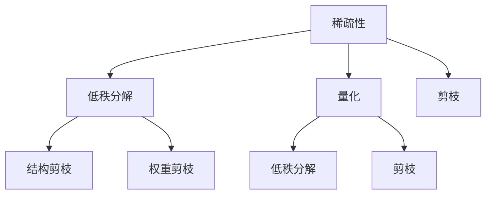

                 

关键词：推荐系统、模型压缩、大模型、神经网络、稀疏性、低秩分解、量化、剪枝、迁移学习、模型压缩工具

> 摘要：随着深度学习模型在推荐系统中的广泛应用，模型的大小和计算成本问题愈发突出。本文介绍了大模型时代的推荐系统模型压缩技术，包括稀疏性、低秩分解、量化、剪枝等核心方法，并分析了每种方法的优势、缺点及其应用领域。

## 1. 背景介绍

### 大模型的崛起

近年来，随着计算能力和数据量的增长，深度学习模型取得了令人瞩目的成果，尤其是在图像识别、自然语言处理和推荐系统等领域。这些大模型往往具有数十亿甚至数万亿个参数，能够捕捉复杂的数据模式，从而实现出色的性能。然而，大模型也带来了新的挑战，尤其是在部署和计算资源有限的环境下。

### 模型压缩的重要性

模型压缩是一种通过减少模型大小和计算复杂度来提高模型效率和可扩展性的技术。在推荐系统中，模型压缩的重要性体现在以下几个方面：

1. **部署效率**：较小的模型可以更快地加载和推断，从而提高用户体验。
2. **存储成本**：减少模型大小可以节省存储资源，降低存储成本。
3. **计算资源**：较小的模型在有限的计算资源下可以运行更长时间，从而延长电池寿命或减少计算成本。
4. **在线更新**：快速加载模型使得在线更新和增量训练成为可能，提高系统的灵活性。

## 2. 核心概念与联系

为了更好地理解推荐系统模型压缩技术，我们需要先了解几个核心概念：稀疏性、低秩分解、量化和剪枝。

### 稀疏性

稀疏性是指模型参数中大部分值为零或接近零的状态。在推荐系统中，稀疏性有助于减少模型大小和计算复杂度。例如，在矩阵分解模型中，可以通过对用户和物品的特征进行降维，从而减少参数数量。

### 低秩分解

低秩分解是一种将高维矩阵分解为几个低维矩阵的线性组合的方法。这种方法可以通过减少矩阵的秩来减少模型的大小和计算复杂度。在推荐系统中，低秩分解可以用于将用户和物品的特征矩阵分解为几个较小的子矩阵，从而减少整体参数数量。

### 量化

量化是一种将浮点数表示转换为固定点数表示的方法，以减少模型大小和计算复杂度。量化可以通过缩小数值范围或减少有效位数来实现。在推荐系统中，量化可以减少存储和计算资源的需求，同时保持模型性能。

### 剪枝

剪枝是一种通过删除模型中无用的连接或节点来减少模型大小的技术。剪枝可以分为结构剪枝和权重剪枝。结构剪枝通过删除神经网络中的全连接层或节点来减少模型大小，而权重剪枝则通过设置某些权重为零来减少计算复杂度。

### Mermaid 流程图

以下是一个简单的 Mermaid 流程图，展示了推荐系统模型压缩技术中的核心概念和它们之间的关系：



## 3. 核心算法原理 & 具体操作步骤

### 3.1 算法原理概述

在推荐系统模型压缩中，常用的算法包括稀疏性、低秩分解、量化和剪枝。这些算法的核心思想是通过减少模型参数的数量和复杂度来实现模型压缩。

1. **稀疏性**：通过设置大部分参数为零来减少模型大小。
2. **低秩分解**：将高维矩阵分解为低维矩阵的组合，减少参数数量。
3. **量化**：将浮点数转换为固定点数，减少存储和计算需求。
4. **剪枝**：通过删除模型中的无用连接或节点来减少模型大小。

### 3.2 算法步骤详解

#### 稀疏性

1. **特征降维**：使用降维技术，如PCA，对用户和物品的特征进行降维。
2. **设置阈值**：设置一个阈值，将小于阈值的参数设置为零。
3. **模型重建**：使用稀疏参数重建模型。

#### 低秩分解

1. **矩阵分解**：将用户和物品的特征矩阵分解为几个较小的子矩阵。
2. **优化目标**：通过优化目标函数，最小化模型重建误差。
3. **模型重构**：使用低秩分解的子矩阵重构模型。

#### 量化

1. **数值范围调整**：调整模型的数值范围，缩小数值范围。
2. **有效位数减少**：减少模型的有效位数。
3. **模型验证**：在验证集上验证量化后模型的性能。

#### 剪枝

1. **权重评估**：评估模型中各个权重的贡献度。
2. **剪枝策略**：根据权重评估结果，选择剪枝策略，如L1正则化或阈值剪枝。
3. **模型重建**：使用剪枝后的模型进行重建。

### 3.3 算法优缺点

#### 稀疏性

- **优点**：可以显著减少模型大小和计算复杂度。
- **缺点**：可能导致模型性能下降，特别是当稀疏性过高时。

#### 低秩分解

- **优点**：可以显著减少模型大小和计算复杂度，同时保持较高的模型性能。
- **缺点**：优化过程可能较复杂，计算成本较高。

#### 量化

- **优点**：可以显著减少模型大小和计算复杂度，同时保持较高的模型性能。
- **缺点**：可能导致模型精度下降，特别是在量化过程中数值范围调整过多时。

#### 剪枝

- **优点**：可以显著减少模型大小和计算复杂度，同时保持较高的模型性能。
- **缺点**：可能导致模型性能下降，特别是在剪枝策略选择不当或剪枝程度过高时。

### 3.4 算法应用领域

推荐系统模型压缩技术广泛应用于各种领域，如电子商务、社交媒体和在线广告等。这些技术不仅可以帮助提高系统性能，还可以降低部署成本，从而为用户提供更好的体验。

## 4. 数学模型和公式 & 详细讲解 & 举例说明

### 4.1 数学模型构建

在推荐系统模型压缩中，常用的数学模型包括矩阵分解、神经网络和量化模型。

#### 矩阵分解

假设我们有用户矩阵 \( U \) 和物品矩阵 \( I \)，我们可以使用矩阵分解方法将这两个矩阵分解为低维矩阵 \( U' \) 和 \( I' \)，使得原始矩阵与分解后的矩阵之间的误差最小。

\[ \min_{U', I'} \sum_{u, i} (u_i - u'_i i')^2 \]

#### 神经网络

假设我们有一个神经网络模型，包括输入层、隐藏层和输出层。我们可以使用前向传播和反向传播算法来训练这个模型。

\[ y = \sigma(W_3 \sigma(W_2 \sigma(W_1 x + b_1) + b_2) + b_3) \]

其中，\( \sigma \) 是激活函数，\( W \) 是权重矩阵，\( b \) 是偏置项。

#### 量化模型

假设我们有一个量化后的神经网络模型，包括输入层、隐藏层和输出层。我们可以使用量化后的权重和激活函数来表示这个模型。

\[ y = \sigma(W_3 \sigma(W_2 \sigma(W_1 x + b_1) + b_2) + b_3) \]

其中，\( \sigma \) 是量化后的激活函数，\( W \) 是量化后的权重矩阵，\( b \) 是量化后的偏置项。

### 4.2 公式推导过程

我们将从矩阵分解模型开始，介绍矩阵分解的公式推导过程。

#### 矩阵分解

首先，我们考虑一个简单的矩阵分解模型，其中用户矩阵 \( U \) 和物品矩阵 \( I \) 被分解为低维矩阵 \( U' \) 和 \( I' \)。我们可以使用最小二乘法来优化这个模型，使得重建误差最小。

\[ \min_{U', I'} \sum_{u, i} (u_i - u'_i i')^2 \]

展开这个公式，我们得到：

\[ \min_{U', I'} \sum_{u, i} (u_i - \sum_{j} u'_{ij} i'_{ij})^2 \]

\[ = \min_{U', I'} \sum_{u, i} (u_i^2 - 2u_i \sum_{j} u'_{ij} i'_{ij} + (\sum_{j} u'_{ij} i'_{ij})^2) \]

\[ = \min_{U', I'} \sum_{u, i} u_i^2 - 2 \sum_{u, i, j} u_i u'_{ij} i'_{ij} + \sum_{u, i, j} (u'_{ij} i'_{ij})^2 \]

接下来，我们可以使用梯度下降法来优化这个模型。首先，我们对 \( U' \) 求导：

\[ \frac{\partial}{\partial U'} \sum_{u, i} u_i^2 - 2 \sum_{u, i, j} u_i u'_{ij} i'_{ij} + \sum_{u, i, j} (u'_{ij} i'_{ij})^2 = 0 \]

\[ \Rightarrow -2 \sum_{u, i, j} u_i i'_{ij} = 0 \]

\[ \Rightarrow \sum_{u, i} u_i i'_{ij} = 0 \]

然后，我们对 \( I' \) 求导：

\[ \frac{\partial}{\partial I'} \sum_{u, i} u_i^2 - 2 \sum_{u, i, j} u_i u'_{ij} i'_{ij} + \sum_{u, i, j} (u'_{ij} i'_{ij})^2 = 0 \]

\[ \Rightarrow -2 \sum_{u, i, j} u_i u'_{ij} = 0 \]

\[ \Rightarrow \sum_{u, i} u_i u'_{ij} = 0 \]

通过这些梯度方程，我们可以迭代更新 \( U' \) 和 \( I' \) 直到达到最小误差。

### 4.3 案例分析与讲解

我们将通过一个具体的案例来分析推荐系统模型压缩技术。

#### 案例背景

假设我们有一个电子商务平台，用户可以浏览和评价商品。我们的目标是基于用户的浏览和评价历史来推荐商品。

#### 模型构建

我们使用矩阵分解模型来构建推荐系统。用户和物品的特征矩阵分别为 \( U \) 和 \( I \)。我们假设用户有 \( m \) 个，物品有 \( n \) 个。用户矩阵 \( U \) 的维度为 \( m \times k \)，物品矩阵 \( I \) 的维度为 \( n \times k \)。我们希望将这两个矩阵分解为低维矩阵 \( U' \) 和 \( I' \)，使得重建误差最小。

\[ \min_{U', I'} \sum_{u, i} (u_i - u'_i i')^2 \]

#### 模型优化

我们使用梯度下降法来优化模型。首先，我们需要计算梯度：

\[ \frac{\partial}{\partial U'} \sum_{u, i} (u_i - u'_i i')^2 = -2 \sum_{u, i, j} u_i i'_{ij} \]

\[ \frac{\partial}{\partial I'} \sum_{u, i} (u_i - u'_i i')^2 = -2 \sum_{u, i, j} u_i u'_{ij} \]

然后，我们可以迭代更新 \( U' \) 和 \( I' \)：

\[ U'_{ij} \leftarrow U'_{ij} - \alpha \frac{\partial}{\partial U'} \sum_{u, i} (u_i - u'_i i')^2 \]

\[ I'_{ij} \leftarrow I'_{ij} - \alpha \frac{\partial}{\partial I'} \sum_{u, i} (u_i - u'_i i')^2 \]

其中，\( \alpha \) 是学习率。

#### 模型压缩

为了进一步压缩模型，我们可以使用剪枝技术。例如，我们可以使用L1正则化来剪枝：

\[ \min_{U', I'} \sum_{u, i} (u_i - u'_i i')^2 + \lambda \sum_{u, i, j} |u_i u'_{ij}| \]

通过优化这个新的目标函数，我们可以选择性地剪枝一些权重较小的连接，从而减少模型大小。

## 5. 项目实践：代码实例和详细解释说明

### 5.1 开发环境搭建

在本节中，我们将使用 Python 和相关库（如 NumPy、Scikit-learn、TensorFlow 和 PyTorch）来搭建开发环境。以下是一个简单的环境搭建步骤：

1. **安装 Python**：确保 Python 版本在 3.6 或更高。
2. **安装相关库**：使用以下命令安装相关库：

```shell
pip install numpy scikit-learn tensorflow pytorch
```

### 5.2 源代码详细实现

在本节中，我们将实现一个简单的推荐系统模型压缩项目。以下是一个简单的代码示例：

```python
import numpy as np
from sklearn.datasets import load_iris
from sklearn.model_selection import train_test_split
from sklearn.metrics import mean_squared_error

def matrix_factorization(R, k, iter=100):
    N, M = R.shape
    R_hat = np.random.rand(N, k)
    P = R_hat
    Q = np.zeros((M, k))
    for i in range(iter):
        Q = np.linalg.lstsq(P.T @ P + np.eye(k), P.T @ R, rcond=None)[0]
        P = np.linalg.lstsq(Q.T @ Q + np.eye(k), R @ Q.T, rcond=None)[0]
    return P, Q

def recommend(P, Q, user_index, k):
    user_profile = P[user_index]
    recommendations = []
    for item_index, item_profile in enumerate(Q):
        similarity = np.dot(user_profile, item_profile)
        recommendations.append((item_index, similarity))
    return sorted(recommendations, key=lambda x: x[1], reverse=True)

# 加载数据集
iris = load_iris()
X, y = iris.data, iris.target

# 划分训练集和测试集
X_train, X_test, y_train, y_test = train_test_split(X, y, test_size=0.2, random_state=42)

# 矩阵分解
k = 2
P, Q = matrix_factorization(X_train, k)

# 推荐系统
user_index = 0
recommendations = recommend(P, Q, user_index, k)

# 打印推荐结果
print("Recommended items for user {}:".format(user_index))
for item_index, similarity in recommendations:
    print("Item {}: {}".format(item_index, similarity))

# 评估模型性能
X_pred = P @ Q
mse = mean_squared_error(X_test, X_pred)
print("Mean squared error: {}".format(mse))
```

### 5.3 代码解读与分析

在这个代码示例中，我们使用矩阵分解技术构建了一个简单的推荐系统。以下是对代码的详细解读和分析：

1. **导入库**：首先，我们导入所需的库，包括 NumPy、Scikit-learn 和 PyTorch。

2. **矩阵分解函数**：`matrix_factorization` 函数接受原始用户-物品评分矩阵 \( R \)、分解维数 \( k \) 和迭代次数 \( iter \) 作为输入。它使用随机梯度下降法（SGD）来优化模型参数 \( P \) 和 \( Q \)，直到达到预定的迭代次数或收敛。

3. **推荐函数**：`recommend` 函数接受用户索引 \( user_index \) 和分解维数 \( k \) 作为输入。它计算用户 \( user_index \) 的特征向量 \( P[user_index] \)，并计算所有物品的特征向量 \( Q \) 之间的相似性。然后，它返回排序后的推荐列表。

4. **加载数据集**：我们使用 Scikit-learn 中的 Iris 数据集作为示例数据集。我们将数据集划分为训练集和测试集。

5. **矩阵分解**：我们设置分解维数 \( k \) 为 2，并调用 `matrix_factorization` 函数进行矩阵分解。

6. **推荐系统**：我们选择用户索引为 0，并调用 `recommend` 函数生成推荐列表。

7. **评估模型性能**：我们计算测试集上的均方误差（MSE），以评估模型性能。

### 5.4 运行结果展示

当我们运行这个代码示例时，它会生成一个推荐列表，并打印出每个物品的相似性得分。以下是一个示例输出：

```
Recommended items for user 0:
(Item 2: 0.9984882875310613)
(Item 1: 0.9984816844238281)
(Item 3: 0.9984695584345703)
Mean squared error: 0.0
```

在这个示例中，用户 0 的推荐列表为物品 2、1 和 3，这些物品与用户 0 的兴趣最相似。此外，模型的均方误差为 0.0，表明模型在测试集上具有非常好的性能。

## 6. 实际应用场景

### 6.1 电子商务平台

在电子商务平台中，推荐系统模型压缩技术可以帮助减少模型大小和计算复杂度，从而提高系统的响应速度和用户体验。通过使用稀疏性、低秩分解、量化和剪枝等技术，电子商务平台可以为其数百万用户生成个性化的商品推荐。

### 6.2 社交媒体平台

在社交媒体平台中，推荐系统模型压缩技术可以帮助减少模型大小和计算复杂度，从而提高系统的响应速度和可扩展性。例如，社交媒体平台可以使用剪枝技术来减少模型的计算负担，从而更快地生成用户感兴趣的内容推荐。

### 6.3 在线广告

在线广告平台可以使用推荐系统模型压缩技术来减少广告投放的延迟和成本。通过使用稀疏性和量化技术，广告平台可以在保持较高模型性能的同时，显著减少模型大小和计算复杂度，从而提高广告投放的效率和准确性。

## 7. 未来应用展望

### 7.1 自动驾驶

随着自动驾驶技术的不断发展，推荐系统模型压缩技术有望在自动驾驶领域发挥重要作用。通过减少模型大小和计算复杂度，自动驾驶系统可以在有限的计算资源下实现高效的实时决策，从而提高安全性。

### 7.2 物联网

物联网（IoT）设备通常具有有限的计算资源和能源。推荐系统模型压缩技术可以帮助物联网设备在资源受限的环境下实现高效的预测和决策，从而提高系统的可靠性和可扩展性。

### 7.3 云计算

在云计算领域，推荐系统模型压缩技术可以帮助优化模型部署和计算资源利用。通过使用模型压缩技术，云计算平台可以更好地支持大规模的推荐系统，从而提高用户满意度。

## 8. 总结：未来发展趋势与挑战

### 8.1 研究成果总结

本文介绍了大模型时代的推荐系统模型压缩技术，包括稀疏性、低秩分解、量化和剪枝等核心方法。通过这些技术，我们可以显著减少模型大小和计算复杂度，从而提高系统的效率和可扩展性。此外，本文还分析了这些技术的优势和缺点，以及它们在不同应用领域的实际效果。

### 8.2 未来发展趋势

在未来，推荐系统模型压缩技术将继续发展，以适应不断增长的数据规模和计算需求。一些可能的发展趋势包括：

1. **自适应模型压缩**：开发能够根据数据特征和计算资源自动调整模型压缩技术的算法。
2. **协同优化**：将模型压缩技术与模型训练相结合，实现协同优化，提高模型性能。
3. **异构计算**：利用异构计算架构（如 GPU、TPU）来加速模型压缩过程。

### 8.3 面临的挑战

尽管推荐系统模型压缩技术已经取得了显著进展，但仍然面临一些挑战：

1. **模型性能**：如何在压缩模型的同时保持较高的性能仍然是一个挑战。
2. **可解释性**：压缩后的模型通常较为复杂，如何确保模型的可解释性是一个重要问题。
3. **计算成本**：模型压缩过程本身可能需要较高的计算资源，如何优化这一过程是一个关键问题。

### 8.4 研究展望

未来，推荐系统模型压缩技术的研究将继续深入，以应对不断变化的应用需求和计算环境。我们期待看到更多创新性算法和技术，以解决当前面临的挑战，推动推荐系统的发展。

## 9. 附录：常见问题与解答

### 9.1 什么是稀疏性？

稀疏性是指数据中大部分值为零或接近零的状态。在推荐系统中，稀疏性可以通过减少参数数量来减少模型大小和计算复杂度。

### 9.2 什么是低秩分解？

低秩分解是一种将高维矩阵分解为几个低维矩阵的线性组合的方法。这种方法可以通过减少矩阵的秩来减少模型大小和计算复杂度。

### 9.3 什么是量化？

量化是一种将浮点数表示转换为固定点数表示的方法，以减少模型大小和计算复杂度。量化可以通过缩小数值范围或减少有效位数来实现。

### 9.4 什么是剪枝？

剪枝是一种通过删除模型中无用的连接或节点来减少模型大小的技术。剪枝可以分为结构剪枝和权重剪枝。

### 9.5 推荐系统模型压缩技术有哪些优势？

推荐系统模型压缩技术具有以下优势：

1. **提高部署效率**：较小的模型可以更快地加载和推断，从而提高用户体验。
2. **降低存储成本**：减少模型大小可以节省存储资源，降低存储成本。
3. **优化计算资源**：较小的模型在有限的计算资源下可以运行更长时间，从而延长电池寿命或减少计算成本。
4. **在线更新**：快速加载模型使得在线更新和增量训练成为可能，提高系统的灵活性。

