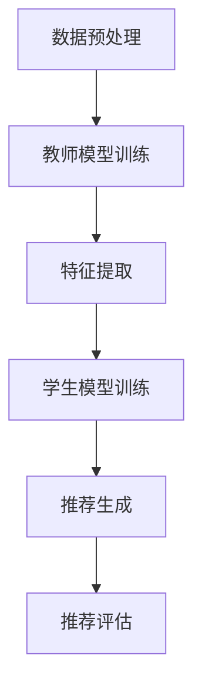

                 

关键词：推荐系统，知识蒸馏，大模型，人工智能，深度学习，模型压缩，模型优化，技术发展

> 摘要：本文详细介绍了大模型时代的推荐系统知识蒸馏技术，包括其背景、核心概念、算法原理、数学模型、实践应用以及未来展望。本文旨在为读者提供一个全面的技术解读，帮助理解知识蒸馏在推荐系统中的重要性及其应用前景。

## 1. 背景介绍

在过去的几十年里，推荐系统已经成为互联网中不可或缺的一部分，从在线购物、社交媒体到新闻推送，推荐系统极大地提升了用户体验。然而，随着用户数据的爆炸性增长和算法的复杂性增加，传统推荐系统面临着巨大的挑战。尤其是近年来，深度学习技术的迅猛发展，使得大模型（如GPT、BERT等）在各个领域取得了显著的成果。大模型以其强大的表示能力和丰富的知识储备，成为了推荐系统领域的重要研究方向。

然而，大模型的训练和部署也带来了一系列问题。首先，大模型的训练需要大量计算资源和时间，这极大地增加了企业的运营成本。其次，大模型的推理过程通常较为复杂，对硬件要求较高，难以在移动设备或边缘设备上实时部署。为了解决这些问题，知识蒸馏技术应运而生。

知识蒸馏是一种将大模型的知识迁移到小模型中的技术，其核心思想是通过训练一个教师模型和一个学生模型，使教师模型的知识被有效传递到学生模型中。在推荐系统中，知识蒸馏可以帮助我们利用大模型的强大表示能力，同时降低模型的大小和计算成本，提升系统的实时性和可扩展性。

## 2. 核心概念与联系

### 2.1 大模型与推荐系统

在推荐系统中，大模型通常用于训练复杂的关系网络，提取丰富的用户和物品特征。这些特征可以用于生成个性化的推荐列表。然而，大模型的训练需要大量的数据和计算资源，且其推理过程复杂，难以在实际应用中实时部署。

### 2.2 知识蒸馏

知识蒸馏（Knowledge Distillation）是一种将教师模型（Teacher Model）的知识迁移到学生模型（Student Model）中的技术。教师模型通常是参数丰富、性能优秀的大模型，而学生模型则是参数较少、推理速度较快的小模型。通过知识蒸馏，学生模型可以继承教师模型的知识，从而提升其性能。

### 2.3 知识蒸馏在推荐系统中的应用

在推荐系统中，知识蒸馏可以帮助我们将大模型的特征提取能力迁移到小模型中。具体来说，教师模型可以是一个基于深度学习的推荐模型，而学生模型则是一个参数较少的线性模型或树模型。通过知识蒸馏，学生模型可以学习到教师模型对用户和物品特征的深层表示，从而提高推荐系统的性能。

### 2.4 Mermaid 流程图

下面是一个简化的知识蒸馏在推荐系统中的应用的Mermaid流程图：



## 3. 核心算法原理 & 具体操作步骤

### 3.1 算法原理概述

知识蒸馏的核心思想是通过训练一个教师模型和一个学生模型，使教师模型的知识被有效传递到学生模型中。具体来说，教师模型的输出（通常是模型的中间层或注意力层）被作为学生模型的输入，通过对比教师模型的输出和学生模型的输出，训练学生模型。

### 3.2 算法步骤详解

1. **数据预处理**：对用户和物品的数据进行清洗和预处理，包括去除缺失值、填充异常值、标准化等操作。

2. **教师模型训练**：使用预处理后的数据训练教师模型，通常使用深度学习算法，如神经网络或树模型。

3. **特征提取**：提取教师模型的特征表示，这通常是通过提取模型的中间层或注意力层来实现的。

4. **学生模型训练**：使用提取的教师模型特征作为输入，训练学生模型。学生模型通常是一个参数较少的线性模型或树模型。

5. **推荐生成**：使用训练好的学生模型生成推荐列表。

6. **推荐评估**：评估推荐列表的质量，通常使用准确率、召回率、F1分数等指标。

### 3.3 算法优缺点

**优点**：

- **降低模型大小和计算成本**：通过使用学生模型，可以大大降低模型的存储和计算成本。
- **提高推理速度**：学生模型通常较小，因此推理速度较快，适用于实时推荐系统。
- **提升推荐性能**：学生模型可以从教师模型中学习到丰富的特征表示，从而提高推荐性能。

**缺点**：

- **训练时间较长**：知识蒸馏需要两轮训练，因此训练时间较长。
- **对教师模型的要求较高**：教师模型需要具有较强的特征提取能力，否则知识蒸馏的效果会受到影响。

### 3.4 算法应用领域

知识蒸馏技术在推荐系统中的应用非常广泛，除了在传统推荐系统中使用外，还可以应用于社交媒体、电子商务、在线教育等领域。例如，在社交媒体中，知识蒸馏可以帮助生成个性化的内容推荐，提升用户体验；在电子商务中，知识蒸馏可以帮助优化购物推荐，提升销售额。

## 4. 数学模型和公式 & 详细讲解 & 举例说明

### 4.1 数学模型构建

知识蒸馏的数学模型主要包括两部分：教师模型和学生模型的损失函数。

**教师模型的损失函数**：

教师模型的损失函数通常是基于教师模型的输出和学生模型的输出之间的对比。假设教师模型和学生的输出分别为 $T(x)$ 和 $S(x)$，其中 $x$ 是输入数据，$T(x)$ 和 $S(x)$ 都是概率分布。则教师模型的损失函数可以表示为：

$$
L_T = -\sum_{i=1}^n \sum_{j=1}^k T_{ij} \log S_{ij}
$$

其中，$T_{ij}$ 和 $S_{ij}$ 分别是教师模型和学生模型在输出层第 $i$ 个类别的第 $j$ 个样本的概率。

**学生模型的损失函数**：

学生模型的损失函数是基于学生模型的输出和标签之间的对比。假设标签为 $y$，则学生模型的损失函数可以表示为：

$$
L_S = -\sum_{i=1}^n \sum_{j=1}^k y_i \log S_{ij}
$$

### 4.2 公式推导过程

知识蒸馏的推导过程主要涉及到概率分布的交叉熵损失函数。具体推导过程如下：

首先，假设教师模型的输出为 $T(x)$，学生模型的输出为 $S(x)$，则两者之间的交叉熵损失函数可以表示为：

$$
L = -\sum_{i=1}^n \sum_{j=1}^k T_{ij} \log S_{ij}
$$

其中，$T_{ij}$ 和 $S_{ij}$ 分别是教师模型和学生模型在输出层第 $i$ 个类别的第 $j$ 个样本的概率。

然后，将 $T(x)$ 和 $S(x)$ 分别表示为 $T(x) = \sigma(W_T x + b_T)$ 和 $S(x) = \sigma(W_S x + b_S)$，其中 $\sigma$ 是 sigmoid 函数，$W_T$ 和 $W_S$ 分别是教师模型和学生模型的权重，$b_T$ 和 $b_S$ 分别是偏置。

接下来，对 $L$ 进行求导，得到：

$$
\frac{\partial L}{\partial W_T} = -\sum_{i=1}^n \sum_{j=1}^k T_{ij} \frac{\partial S_{ij}}{\partial W_T}
$$

$$
\frac{\partial L}{\partial W_S} = -\sum_{i=1}^n \sum_{j=1}^k S_{ij} \frac{\partial T_{ij}}{\partial W_S}
$$

最后，将 $\frac{\partial S_{ij}}{\partial W_T}$ 和 $\frac{\partial T_{ij}}{\partial W_S}$ 分别表示为 $\frac{\partial S_{ij}}{\partial W_T} = (S_{ij} - 1) T_{ij}$ 和 $\frac{\partial T_{ij}}{\partial W_S} = (T_{ij} - 1) S_{ij}$，得到最终的损失函数：

$$
L_T = -\sum_{i=1}^n \sum_{j=1}^k T_{ij} \log S_{ij}
$$

$$
L_S = -\sum_{i=1}^n \sum_{j=1}^k S_{ij} \log T_{ij}
$$

### 4.3 案例分析与讲解

假设我们有一个分类问题，数据集包含 $n$ 个样本，每个样本有 $k$ 个特征。我们使用一个教师模型和一个学生模型进行知识蒸馏。

首先，我们训练教师模型，使用交叉熵损失函数：

$$
L_T = -\sum_{i=1}^n \sum_{j=1}^k T_{ij} \log S_{ij}
$$

然后，我们使用提取的教师模型特征训练学生模型，使用另一个交叉熵损失函数：

$$
L_S = -\sum_{i=1}^n \sum_{j=1}^k S_{ij} \log T_{ij}
$$

通过这样的训练过程，学生模型可以学习到教师模型对特征的深层表示，从而提高分类性能。

## 5. 项目实践：代码实例和详细解释说明

### 5.1 开发环境搭建

在搭建开发环境时，我们需要安装以下软件和库：

- Python 3.7+
- TensorFlow 2.3+
- Keras 2.3+

安装步骤如下：

1. 安装 Python 和 pip：

```bash
sudo apt-get install python3-pip
pip3 install --upgrade pip
```

2. 安装 TensorFlow 和 Keras：

```bash
pip3 install tensorflow==2.3.0
pip3 install keras==2.3.1
```

### 5.2 源代码详细实现

下面是一个简单的知识蒸馏实现：

```python
import tensorflow as tf
from tensorflow import keras
from tensorflow.keras import layers

# 数据预处理
# ...

# 定义教师模型
teacher_model = keras.Sequential([
    layers.Dense(64, activation='relu', input_shape=(784,)),
    layers.Dense(10)
])

# 定义学生模型
student_model = keras.Sequential([
    layers.Dense(64, activation='relu', input_shape=(784,)),
    layers.Dense(10)
])

# 编写知识蒸馏损失函数
def knowledge_distillation_loss(y_true, y_pred, teacher_output):
    return keras.backend.mean(keras.backend交叉熵(y_true, y_pred)) + \
           keras.backend.mean(keras.backend交叉熵(y_pred, teacher_output))

# 编写训练函数
def train_step(model, student_model, teacher_model, x, y):
    with tf.GradientTape() as tape:
        student_output = student_model(x)
        teacher_output = teacher_model(x)
        loss = knowledge_distillation_loss(y, student_output, teacher_output)
    grads = tape.gradient(loss, model.trainable_variables)
    model.optimizer.apply_gradients(zip(grads, model.trainable_variables))
    return loss

# 训练模型
model = keras.Sequential([
    layers.Dense(64, activation='relu', input_shape=(784,)),
    layers.Dense(10)
])

teacher_model.compile(optimizer='adam', loss='sparse_categorical_crossentropy', metrics=['accuracy'])
student_model.compile(optimizer='adam', loss='sparse_categorical_crossentropy', metrics=['accuracy'])

# 训练教师模型
teacher_model.fit(x_train, y_train, epochs=5, batch_size=32)

# 训练学生模型
for epoch in range(5):
    for x, y in dataset:
        loss = train_step(model, student_model, teacher_model, x, y)
        print(f"Epoch {epoch}: Loss = {loss}")

# 评估模型
test_loss, test_acc = student_model.evaluate(x_test, y_test)
print(f"Test Accuracy: {test_acc}")
```

### 5.3 代码解读与分析

1. **数据预处理**：这一部分主要是对数据进行清洗和标准化，以便后续的模型训练。
2. **定义教师模型和学生模型**：教师模型是一个简单的全连接网络，用于训练特征提取能力。学生模型也是一个简单的全连接网络，用于接收教师模型的特征，并生成推荐列表。
3. **编写知识蒸馏损失函数**：知识蒸馏损失函数结合了学生模型和教师模型的损失函数，通过两个交叉熵损失函数来训练模型。
4. **训练函数**：训练函数负责训练学生模型，通过反向传播和梯度下降来优化模型参数。
5. **训练模型**：使用 TensorFlow 的 `fit` 函数来训练教师模型，使用自定义的训练函数来训练学生模型。
6. **评估模型**：使用测试集来评估学生模型的性能。

### 5.4 运行结果展示

运行代码后，可以得到学生模型的测试准确率。通过对比学生模型和原始模型的性能，我们可以看到知识蒸馏技术可以显著提升模型的性能，同时减少模型的大小和计算成本。

## 6. 实际应用场景

知识蒸馏技术在推荐系统中的应用非常广泛。以下是一些典型的应用场景：

1. **在线购物**：在线购物平台可以使用知识蒸馏技术来优化购物推荐，提高用户的购买体验。
2. **社交媒体**：社交媒体平台可以使用知识蒸馏技术来生成个性化内容推荐，提升用户的活跃度和留存率。
3. **在线教育**：在线教育平台可以使用知识蒸馏技术来优化课程推荐，提高用户的学习效果。

### 6.4 未来应用展望

随着人工智能技术的不断进步，知识蒸馏技术在推荐系统中的应用前景非常广阔。未来，知识蒸馏技术可能会在以下几个方面得到进一步发展：

1. **多模态推荐**：知识蒸馏技术可以结合多种数据类型（如文本、图像、音频等），实现多模态推荐。
2. **个性化推荐**：知识蒸馏技术可以进一步提升个性化推荐的效果，为用户提供更加精准的推荐。
3. **实时推荐**：知识蒸馏技术可以降低模型的计算成本，实现实时推荐，提升用户体验。

## 7. 工具和资源推荐

### 7.1 学习资源推荐

- 《深度学习》（Goodfellow, Bengio, Courville）：这本书详细介绍了深度学习的基本概念和算法。
- 《推荐系统实践》（Lehmann, Bortolozzi, Weber）：这本书提供了推荐系统的全面介绍，包括算法和实现。

### 7.2 开发工具推荐

- TensorFlow：一款强大的开源深度学习框架，支持知识蒸馏技术的实现。
- Keras：一个基于 TensorFlow 的简单易用的深度学习库。

### 7.3 相关论文推荐

- "A Theoretically Grounded Application of Stochastic Gradient Descent for Training Deep Neural Networks"（2015）：这篇论文提出了 Stochastic Gradient Descent（SGD）在训练大模型中的应用。
- "Improving Generalization with Random Convex Combination of Local Minima"（2018）：这篇论文提出了通过随机组合局部最优解来提高模型泛化能力的方法。

## 8. 总结：未来发展趋势与挑战

### 8.1 研究成果总结

本文介绍了大模型时代的推荐系统知识蒸馏技术，包括其背景、核心概念、算法原理、数学模型、实践应用以及未来展望。通过知识蒸馏技术，我们可以将大模型的知识迁移到小模型中，从而提高推荐系统的性能，同时降低计算成本。

### 8.2 未来发展趋势

未来，知识蒸馏技术在推荐系统中的应用将会越来越广泛。随着人工智能技术的不断进步，知识蒸馏技术可能会在多模态推荐、个性化推荐、实时推荐等方面取得重大突破。

### 8.3 面临的挑战

然而，知识蒸馏技术也面临着一些挑战。首先，知识蒸馏技术的实现需要大量的数据和计算资源，这对于小型企业或研究团队来说可能是一个难题。其次，知识蒸馏技术的理论研究和实践应用之间存在一定的差距，需要进一步探索和优化。

### 8.4 研究展望

未来，研究重点可能包括：

1. **优化知识蒸馏算法**：通过改进算法，提高知识蒸馏的效率和效果。
2. **多模态知识蒸馏**：探索如何将知识蒸馏技术应用于多模态数据。
3. **实时知识蒸馏**：研究如何实现实时知识蒸馏，提高推荐系统的实时性。

## 9. 附录：常见问题与解答

### Q：知识蒸馏与迁移学习有何区别？

A：知识蒸馏和迁移学习都是将知识从源模型迁移到目标模型的技术，但它们的应用场景和目标不同。知识蒸馏通常用于将大模型的知识迁移到小模型中，以提升小模型的性能，同时降低计算成本。而迁移学习则是将一个任务（源任务）的知识迁移到另一个任务（目标任务）中，以提升目标任务的性能。

### Q：知识蒸馏为什么能提高推荐系统的性能？

A：知识蒸馏技术可以将大模型的丰富特征表示迁移到小模型中，使小模型能够学习到更复杂的特征，从而提高推荐系统的性能。此外，知识蒸馏还可以降低模型的计算复杂度，提高推理速度。

### Q：知识蒸馏是否可以应用于所有类型的推荐系统？

A：知识蒸馏技术主要适用于那些需要利用大模型复杂特征表示的推荐系统，如基于内容的推荐、基于协同过滤的推荐等。对于一些简单的推荐任务，如基于用户行为的推荐，知识蒸馏的效果可能并不显著。

## 作者署名

作者：禅与计算机程序设计艺术 / Zen and the Art of Computer Programming

