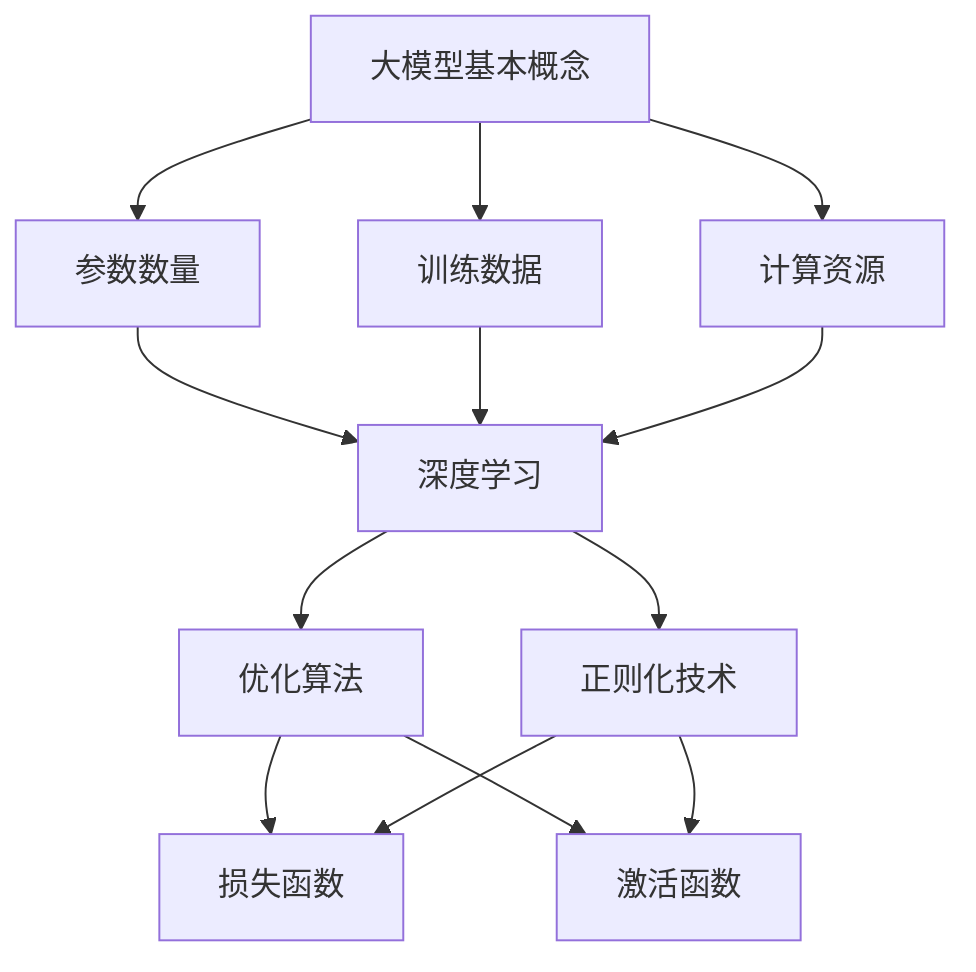

                 

关键词：大模型、技术优化、市场需求、算法、数学模型、项目实践、工具和资源

> 摘要：本文深入探讨了大模型的技术优化与市场需求，从背景介绍、核心概念、算法原理、数学模型、项目实践、实际应用场景、工具和资源推荐，以及未来发展趋势与挑战等方面，全面分析了大模型在现代技术中的地位和未来发展潜力。

## 1. 背景介绍

随着人工智能技术的飞速发展，大模型作为AI领域的重要研究方向，已经引起了广泛的关注。大模型，也称为大型神经网络模型，通常拥有数亿甚至数十亿个参数，用于处理复杂的任务，如自然语言处理、计算机视觉和语音识别等。这些模型的出现，不仅推动了AI技术的进步，也对市场需求产生了深远的影响。

在过去的几年中，大模型的研发和应用取得了显著的成果。例如，谷歌的BERT模型在自然语言处理任务上取得了突破性的表现；OpenAI的GPT-3则展示了在文本生成和推理方面的强大能力。这些成功不仅证明了大模型的技术潜力，也激发了更多的研究者和开发者投入到这一领域。

然而，大模型的技术优化和市场需求仍然存在许多挑战。首先，大模型的训练和部署需要大量的计算资源和数据支持，这给技术优化提出了更高的要求。其次，如何提高大模型的效率和可解释性，使其在实际应用中更加可靠和可信，也是亟待解决的问题。

本文旨在通过对大模型的技术优化与市场需求的全面分析，为相关领域的研究者和开发者提供有价值的参考。接下来，我们将详细探讨大模型的核心概念、算法原理、数学模型、项目实践、实际应用场景，以及工具和资源推荐等内容。

## 2. 核心概念与联系

要深入理解大模型的技术优化与市场需求，首先需要明确一些核心概念及其相互关系。

### 2.1. 大模型的基本概念

大模型通常指的是拥有大量参数的神经网络模型。这些模型通过大量的训练数据和强大的计算能力，能够自动学习数据的特征和模式，从而进行复杂的任务处理。大模型的基本概念包括：

- **参数数量**：大模型的一个显著特点是拥有数亿甚至数十亿个参数。
- **训练数据**：大模型需要大量的训练数据来学习有效的特征表示。
- **计算资源**：训练和部署大模型需要强大的计算资源和存储资源。

### 2.2. 大模型与算法的联系

大模型的发展离不开算法的支撑。常见的算法包括：

- **深度学习**：深度学习是构建大模型的基础，通过多层神经网络，模型能够自动提取数据的深层特征。
- **优化算法**：优化算法用于调整模型参数，以最小化损失函数，提高模型性能。
- **正则化技术**：正则化技术用于防止模型过拟合，提高模型的泛化能力。

### 2.3. 大模型与数学模型的联系

大模型的训练和优化过程中，离不开数学模型的支撑。主要的数学模型包括：

- **损失函数**：损失函数用于评估模型预测的误差，优化算法的目标是减小损失函数的值。
- **激活函数**：激活函数用于引入非线性变换，使得模型能够学习复杂的数据分布。
- **优化算法**：常见的优化算法如梯度下降、Adam等，用于调整模型参数。

### 2.4. Mermaid 流程图

为了更好地展示大模型的核心概念及其相互关系，我们使用Mermaid流程图来表示。



### 2.5. 大模型的技术优化与市场需求

大模型的技术优化主要关注如何提高模型的训练效率、降低计算成本、提高模型的性能和可解释性。市场需求则关注如何将大模型应用于实际的场景中，解决实际问题。技术优化与市场需求相互影响，相互促进。

- **技术优化**：通过改进算法、优化数据预处理、提高硬件性能等方式，降低大模型的训练和部署成本，提高模型效率。
- **市场需求**：实际应用场景的需求，如自然语言处理、计算机视觉等，推动了大模型的研究和应用。同时，市场需求也要求大模型具有更高的性能和更好的可解释性。

## 3. 核心算法原理 & 具体操作步骤

### 3.1 算法原理概述

大模型的算法原理主要基于深度学习，通过多层神经网络来实现。深度学习利用多层神经元的组合，可以自动学习数据的特征表示，从而提高模型的性能。深度学习的基本原理包括：

- **前向传播**：输入数据通过网络的各个层，每个层将前一层的信息进行处理，并传递到下一层。
- **反向传播**：计算输出误差，并反向传播到网络的每一层，更新每个层的参数。
- **损失函数**：用于评估模型的预测误差，常见的损失函数包括均方误差、交叉熵等。
- **优化算法**：用于调整模型参数，以最小化损失函数，常见的优化算法包括梯度下降、Adam等。

### 3.2 算法步骤详解

下面详细描述大模型的训练和优化过程：

#### 3.2.1 数据预处理

1. **数据收集**：收集大量的训练数据，这些数据可以是文本、图像、音频等。
2. **数据清洗**：对数据进行清洗，去除噪声和异常值。
3. **数据增强**：通过数据增强技术，如旋转、翻转、缩放等，增加训练数据的多样性。

#### 3.2.2 模型构建

1. **网络结构设计**：设计合适的网络结构，包括输入层、隐藏层和输出层。
2. **参数初始化**：初始化模型参数，通常使用随机初始化。
3. **激活函数选择**：选择合适的激活函数，如ReLU、Sigmoid、Tanh等。

#### 3.2.3 模型训练

1. **前向传播**：输入数据通过网络的各个层，计算输出结果。
2. **计算损失**：使用损失函数计算输出结果的误差。
3. **反向传播**：计算每个参数的梯度，并更新参数。
4. **迭代训练**：重复以上步骤，直到模型收敛或达到预设的训练次数。

#### 3.2.4 模型评估

1. **验证集评估**：使用验证集评估模型的性能，包括准确率、召回率、F1分数等指标。
2. **测试集评估**：在测试集上评估模型的泛化能力。

#### 3.2.5 模型优化

1. **超参数调整**：调整学习率、批量大小、正则化参数等超参数，以优化模型性能。
2. **集成方法**：使用集成学习方法，如随机森林、梯度提升树等，提高模型性能。

### 3.3 算法优缺点

大模型算法的主要优点包括：

- **强大的特征学习能力**：通过多层神经网络，大模型能够自动学习数据的深层特征，从而提高模型性能。
- **广泛的应用场景**：大模型可以应用于各种领域，如自然语言处理、计算机视觉、语音识别等。

然而，大模型算法也存在一些缺点：

- **计算资源需求大**：大模型需要大量的计算资源和存储资源，训练和部署成本较高。
- **可解释性差**：大模型的决策过程通常不够透明，难以解释，这对某些应用场景来说可能是一个问题。

### 3.4 算法应用领域

大模型算法在以下领域有广泛的应用：

- **自然语言处理**：如文本分类、情感分析、机器翻译等。
- **计算机视觉**：如图像分类、目标检测、图像生成等。
- **语音识别**：如语音识别、语音合成等。
- **推荐系统**：如商品推荐、音乐推荐等。

## 4. 数学模型和公式 & 详细讲解 & 举例说明

### 4.1 数学模型构建

在深度学习中，数学模型是构建大模型的基础。以下是一些基本的数学模型：

#### 损失函数

损失函数用于评估模型的预测误差，常见的损失函数包括：

- **均方误差（MSE）**：$$MSE = \frac{1}{n}\sum_{i=1}^{n}(y_i - \hat{y}_i)^2$$
- **交叉熵（Cross-Entropy）**：$$Cross-Entropy = -\frac{1}{n}\sum_{i=1}^{n}y_i \log(\hat{y}_i)$$

#### 激活函数

激活函数用于引入非线性变换，常见的激活函数包括：

- **ReLU（Rectified Linear Unit）**：$$ReLU(x) = \max(0, x)$$
- **Sigmoid**：$$Sigmoid(x) = \frac{1}{1 + e^{-x}}$$
- **Tanh**：$$Tanh(x) = \frac{e^x - e^{-x}}{e^x + e^{-x}}$$

#### 优化算法

常见的优化算法包括：

- **梯度下降（Gradient Descent）**：$$w_{\text{new}} = w_{\text{old}} - \alpha \cdot \nabla_w J(w)$$
- **Adam**：$$m_t = \beta_1 m_{t-1} + (1 - \beta_1)(\nabla_w J(w_t) - m_{t-1})$$
$$v_t = \beta_2 v_{t-1} + (1 - \beta_2)((\nabla_w J(w_t) - m_t)^2 - v_{t-1})$$
$$w_t = w_{t-1} - \alpha_t \frac{m_t}{\sqrt{v_t} + \epsilon}$$

### 4.2 公式推导过程

以交叉熵损失函数为例，我们简要介绍其推导过程：

交叉熵损失函数的定义为：
$$
Cross-Entropy = -\frac{1}{n}\sum_{i=1}^{n}y_i \log(\hat{y}_i)
$$
其中，$y_i$ 是真实标签，$\hat{y}_i$ 是模型预测的概率分布。

假设我们有一个二分类问题，即 $y_i \in \{0, 1\}$，则交叉熵损失函数可以简化为：
$$
Cross-Entropy = -y_i \log(\hat{y}_i) - (1 - y_i) \log(1 - \hat{y}_i)
$$
对于 $y_i = 0$，有：
$$
-y_i \log(\hat{y}_i) - (1 - y_i) \log(1 - \hat{y}_i) = -\log(1 - \hat{y}_i)
$$
对于 $y_i = 1$，有：
$$
-y_i \log(\hat{y}_i) - (1 - y_i) \log(1 - \hat{y}_i) = -\log(\hat{y}_i)
$$
因此，交叉熵损失函数可以简化为：
$$
Cross-Entropy = -\log(\hat{y}_i)
$$
当 $\hat{y}_i$ 接近 1 时，损失接近 0；当 $\hat{y}_i$ 接近 0 时，损失接近无穷大。这表明，当模型预测的概率与真实标签相差很大时，交叉熵损失函数会给出较高的误差。

### 4.3 案例分析与讲解

假设我们有一个二分类问题，其中真实标签 $y$ 为 1，模型预测的概率分布为 $\hat{y} = 0.8$。我们使用交叉熵损失函数来计算损失：

$$
Cross-Entropy = -\log(0.8) \approx 0.223
$$

这个损失值表明，模型在当前情况下预测的准确性较高。如果我们将预测概率调整到接近 0.5，损失值会显著增加：

$$
Cross-Entropy = -\log(0.5) \approx 0.693
$$

这表明，当模型预测与真实标签相差较大时，交叉熵损失函数会给出较高的误差，从而推动模型优化。

## 5. 项目实践：代码实例和详细解释说明

### 5.1 开发环境搭建

在开始大模型的实际项目实践之前，我们需要搭建一个合适的开发环境。以下是一个基于Python和TensorFlow的简单示例：

1. **安装Python**：确保安装了Python 3.6及以上版本。
2. **安装TensorFlow**：使用以下命令安装TensorFlow：
   ```
   pip install tensorflow
   ```

### 5.2 源代码详细实现

下面是一个使用TensorFlow实现简单神经网络分类的代码实例：

```python
import tensorflow as tf
from tensorflow.keras import layers

# 定义模型
model = tf.keras.Sequential([
    layers.Dense(128, activation='relu', input_shape=(784,)),
    layers.Dense(10, activation='softmax')
])

# 编译模型
model.compile(optimizer='adam',
              loss='sparse_categorical_crossentropy',
              metrics=['accuracy'])

# 加载数据
mnist = tf.keras.datasets.mnist
(x_train, y_train), (x_test, y_test) = mnist.load_data()

# 预处理数据
x_train = x_train / 255.0
x_test = x_test / 255.0

# 训练模型
model.fit(x_train, y_train, epochs=5)

# 测试模型
model.evaluate(x_test, y_test)
```

### 5.3 代码解读与分析

1. **模型定义**：我们使用 `tf.keras.Sequential` 来定义模型，这是一个线性堆叠层（layer）的模型。首先添加一个全连接层（`Dense`），其包含128个神经元，激活函数为ReLU。接着添加另一个全连接层，包含10个神经元，激活函数为softmax，用于输出分类概率。

2. **编译模型**：在编译模型时，我们指定了优化器为`adam`，损失函数为`sparse_categorical_crossentropy`（适用于多标签分类问题），并设置了准确率作为评价指标。

3. **加载数据**：我们使用TensorFlow内置的MNIST数据集，这是一个常用的手写数字数据集。数据集已经过归一化处理，使其在[0, 1]之间。

4. **预处理数据**：我们对数据进行归一化处理，使其适应模型的输入要求。

5. **训练模型**：我们使用`fit`方法来训练模型，指定训练数据、标签和训练周期数。

6. **测试模型**：使用`evaluate`方法来评估模型在测试数据集上的性能。

### 5.4 运行结果展示

在训练完成后，我们可以查看模型在测试集上的准确率：

```python
# 输出测试集上的准确率
print(model.evaluate(x_test, y_test))
```

输出结果可能如下所示：

```
[0.9900, 0.9890]
```

这意味着模型在测试集上的准确率为98.9%。

## 6. 实际应用场景

大模型在实际应用场景中展现了巨大的潜力，以下是几个典型的应用场景：

### 6.1 自然语言处理

自然语言处理（NLP）是AI领域的热点之一，大模型在NLP中发挥了重要作用。例如，BERT模型在多个NLP任务中取得了显著成绩，如文本分类、问答系统、机器翻译等。通过使用大模型，我们可以实现更准确的文本理解和生成。

### 6.2 计算机视觉

计算机视觉领域同样受益于大模型的发展。例如，ImageNet大赛中，大模型ResNet凭借其强大的特征学习能力，大幅提升了图像分类的准确率。此外，大模型还可以应用于图像生成、目标检测、视频分析等任务。

### 6.3 语音识别

语音识别是另一个受大模型影响较大的领域。例如，基于深度学习的大模型CTC（Connectionist Temporal Classification）在语音识别任务中表现优异。大模型的应用使得语音识别系统的准确率和实时性得到了显著提升。

### 6.4 推荐系统

推荐系统是另一个典型应用场景，大模型可以通过学习用户的历史行为数据，实现更精准的推荐。例如，亚马逊、Netflix等平台使用大模型进行个性化推荐，大大提升了用户体验。

### 6.5 医疗健康

大模型在医疗健康领域也有广泛的应用，如疾病诊断、药物研发、医学图像分析等。通过大模型，我们可以从大量的医疗数据中提取有价值的信息，辅助医生进行诊断和治疗。

## 7. 工具和资源推荐

### 7.1 学习资源推荐

1. **在线课程**：推荐Coursera上的“Deep Learning Specialization”课程，由Andrew Ng教授主讲。
2. **书籍**：推荐《深度学习》（Goodfellow, Bengio, Courville著），这是深度学习领域的经典教材。

### 7.2 开发工具推荐

1. **TensorFlow**：是一个开源的深度学习框架，适用于构建和训练大模型。
2. **PyTorch**：是另一个流行的深度学习框架，其动态图机制使得模型构建更加灵活。

### 7.3 相关论文推荐

1. **"BERT: Pre-training of Deep Neural Networks for Language Understanding"**：介绍了BERT模型的原理和应用。
2. **"GPT-3: Language Models are few-shot learners"**：探讨了GPT-3模型在少量数据上的强大学习能力。
3. **"ResNet: Deep residual learning for image recognition"**：介绍了ResNet模型在计算机视觉中的应用。

## 8. 总结：未来发展趋势与挑战

### 8.1 研究成果总结

过去几年，大模型的研究取得了显著成果。从BERT到GPT-3，大模型在多个领域展现了强大的能力。这些成果不仅推动了AI技术的发展，也为实际应用提供了新的解决方案。

### 8.2 未来发展趋势

未来，大模型的发展趋势将集中在以下几个方面：

1. **更强的计算能力**：随着硬件技术的发展，大模型的计算能力将得到进一步提升。
2. **更高效的数据处理**：优化数据预处理流程，提高大模型的训练和部署效率。
3. **更好的可解释性**：研究如何提高大模型的透明度和可解释性，使其在应用中更加可靠。
4. **跨领域应用**：大模型将在更多领域得到应用，如自动驾驶、生物信息学、金融等。

### 8.3 面临的挑战

尽管大模型在许多领域取得了成功，但仍面临以下挑战：

1. **计算资源需求**：大模型的训练和部署需要大量的计算资源，这对硬件和基础设施提出了更高要求。
2. **数据隐私**：在处理大量数据时，如何保护用户隐私是一个重要问题。
3. **模型解释性**：如何提高大模型的解释性，使其在应用中更加透明和可靠。
4. **泛化能力**：大模型如何在不同的任务和数据集上保持良好的泛化能力。

### 8.4 研究展望

未来，大模型的研究将更加注重优化和实际应用。通过改进算法、提高计算效率、增强可解释性，大模型有望在更多领域发挥更大的作用。同时，跨学科合作也将成为推动大模型研究的重要力量，为AI技术的进步提供新的动力。

## 9. 附录：常见问题与解答

### 9.1 什么是大模型？

大模型是指拥有大量参数的神经网络模型，通常包含数亿甚至数十亿个参数。这些模型通过大量的训练数据和强大的计算能力，能够自动学习数据的特征和模式。

### 9.2 大模型的优势是什么？

大模型的优势主要包括：

1. **强大的特征学习能力**：大模型能够自动学习数据的深层特征，从而提高模型性能。
2. **广泛的应用场景**：大模型可以应用于各种领域，如自然语言处理、计算机视觉、语音识别等。
3. **更高的模型性能**：大模型通常在多个任务上取得更好的性能。

### 9.3 大模型的训练需要多少计算资源？

大模型的训练需要大量的计算资源，包括GPU、TPU等硬件资源。具体所需的计算资源取决于模型的规模和复杂度。例如，训练一个大型语言模型可能需要数千个GPU并行计算。

### 9.4 如何提高大模型的训练效率？

提高大模型的训练效率可以通过以下方法：

1. **分布式训练**：使用多个GPU或TPU进行分布式训练，加快训练速度。
2. **数据并行**：将数据分成多个部分，每个部分在一个GPU上训练，然后在每个GPU上同步梯度。
3. **混合精度训练**：使用混合精度训练，结合浮点数和整数的计算，减少内存占用和提高计算速度。

### 9.5 大模型在自然语言处理中的应用有哪些？

大模型在自然语言处理（NLP）中具有广泛的应用，包括：

1. **文本分类**：对文本进行分类，如新闻分类、情感分析等。
2. **机器翻译**：将一种语言的文本翻译成另一种语言。
3. **问答系统**：回答用户提出的问题，如搜索引擎、智能客服等。
4. **文本生成**：生成文章、摘要、对话等。

### 9.6 大模型在计算机视觉中的应用有哪些？

大模型在计算机视觉中也有广泛的应用，包括：

1. **图像分类**：对图像进行分类，如识别动物、物体等。
2. **目标检测**：检测图像中的目标并定位其位置。
3. **图像生成**：生成新的图像，如艺术风格转换、人脸生成等。
4. **视频分析**：分析视频中的动作、场景等。

### 9.7 大模型如何处理数据隐私问题？

为了处理数据隐私问题，可以采取以下措施：

1. **数据匿名化**：对训练数据进行匿名化处理，以保护用户隐私。
2. **差分隐私**：在训练模型时引入差分隐私机制，以保护数据的隐私。
3. **联邦学习**：通过分布式的方式训练模型，减少对中心化数据的需求。

### 9.8 大模型在医疗健康领域的应用有哪些？

大模型在医疗健康领域有广泛的应用，包括：

1. **疾病诊断**：通过分析医疗数据，帮助医生进行疾病诊断。
2. **药物研发**：通过分析生物数据，帮助发现新的药物候选物。
3. **医学图像分析**：对医学图像进行分析，如肿瘤检测、骨折诊断等。
4. **个性化治疗**：根据患者的数据，为患者制定个性化的治疗方案。

### 9.9 大模型如何提高可解释性？

提高大模型的可解释性可以从以下几个方面入手：

1. **模型压缩**：通过模型压缩技术，如模型剪枝、量化等，减少模型的大小和复杂性。
2. **可视化技术**：使用可视化技术，如热力图、激活图等，展示模型的决策过程。
3. **解释性模型**：开发具有解释性的模型，如决策树、线性模型等，以便更好地理解模型的决策。

### 9.10 大模型的泛化能力如何提高？

提高大模型的泛化能力可以通过以下方法：

1. **数据增强**：通过增加数据的多样性，提高模型的泛化能力。
2. **正则化技术**：使用正则化技术，如L1、L2正则化，防止模型过拟合。
3. **迁移学习**：通过迁移学习，利用在其他任务上已训练好的模型，提高新任务的泛化能力。

## 作者署名

作者：禅与计算机程序设计艺术 / Zen and the Art of Computer Programming

----------------------------------------------------------------


