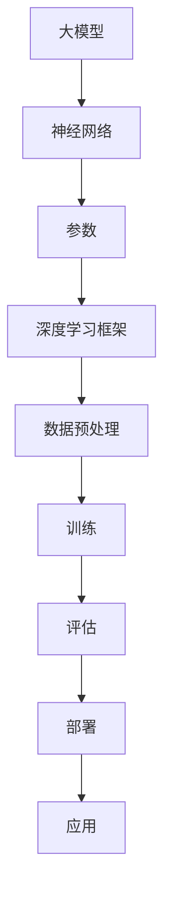

                 

关键词：大模型，用户体验，应用，技术，算法，数学模型，代码实例，实践，展望

> 摘要：随着人工智能技术的不断发展，大模型在各个领域的应用越来越广泛。本文将探讨大模型的用户体验与应用，包括核心概念、算法原理、数学模型、项目实践和未来展望等内容，旨在为读者提供一个全面而深入的视角。

## 1. 背景介绍

### 1.1 大模型的发展历程

大模型是指具有海量参数、复杂结构的人工智能模型。自20世纪50年代以来，人工智能领域经历了从符号主义、连接主义到统计学习的多次变革。尤其是深度学习的崛起，使得大模型在图像识别、自然语言处理、语音识别等领域的表现达到了前所未有的高度。

### 1.2 大模型的应用场景

大模型在众多领域都有广泛应用，例如：

- **图像识别**：大模型可以识别复杂的图像内容，应用于医疗影像诊断、自动驾驶等场景。
- **自然语言处理**：大模型在机器翻译、文本生成、问答系统等方面表现出色。
- **语音识别**：大模型可以准确识别语音并转化为文本，用于智能助手、语音控制系统等。
- **推荐系统**：大模型可以根据用户行为和偏好推荐商品、新闻、视频等。

## 2. 核心概念与联系

下面是关于大模型的核心概念和联系，以及其架构的Mermaid流程图。



### 2.1 神经网络

神经网络是构建大模型的基础。它由多个层（如输入层、隐藏层和输出层）组成，每层包含多个神经元。神经元之间通过权重连接，通过前向传播和反向传播进行学习。

### 2.2 参数

大模型由大量参数构成，这些参数在训练过程中不断调整，以优化模型的性能。参数包括权重、偏置、激活函数等。

### 2.3 深度学习框架

深度学习框架（如TensorFlow、PyTorch等）提供了一套完整的工具和库，用于构建、训练和部署大模型。这些框架简化了开发过程，提高了效率。

### 2.4 数据预处理

数据预处理是训练大模型的重要环节。它包括数据清洗、归一化、填充缺失值等操作，以确保数据的准确性和一致性。

### 2.5 训练

训练是构建大模型的关键步骤。通过不断调整参数，模型可以学习到输入和输出之间的映射关系。训练过程包括前向传播和反向传播。

### 2.6 评估

评估是衡量大模型性能的重要手段。常用的评估指标包括准确率、召回率、F1分数等。通过评估，可以了解模型的泛化能力。

### 2.7 部署

部署是将训练好的大模型应用到实际场景的过程。部署可以是在本地服务器、云计算平台或移动设备上。

### 2.8 应用

大模型的应用领域非常广泛，涵盖了图像识别、自然语言处理、语音识别、推荐系统等多个方面。通过具体的应用案例，我们可以更好地理解大模型的价值。

## 3. 核心算法原理 & 具体操作步骤

### 3.1 算法原理概述

大模型的核心算法是深度学习，包括卷积神经网络（CNN）、循环神经网络（RNN）和变换器（Transformer）等。这些算法通过多层神经网络结构，学习输入和输出之间的复杂关系。

### 3.2 算法步骤详解

- **输入层**：接收外部输入，如图像、文本、音频等。
- **隐藏层**：通过非线性变换，将输入转化为更高级的特征。
- **输出层**：将特征映射到预测结果，如分类标签、序列等。

### 3.3 算法优缺点

- **优点**：大模型可以处理复杂的数据，具有强大的表征能力。
- **缺点**：大模型训练时间较长，计算资源需求大，模型解释性较差。

### 3.4 算法应用领域

- **图像识别**：用于人脸识别、物体检测等。
- **自然语言处理**：用于机器翻译、文本生成等。
- **语音识别**：用于语音助手、语音控制系统等。
- **推荐系统**：用于商品推荐、新闻推荐等。

## 4. 数学模型和公式

### 4.1 数学模型构建

大模型的数学基础主要包括线性代数、概率论和统计学。其中，线性代数用于描述神经网络的权重和偏置，概率论和统计学用于描述数据的分布和假设检验。

### 4.2 公式推导过程

以下是一个简单的神经网络模型推导过程：

$$
\begin{aligned}
z &= w \cdot x + b \\
a &= \sigma(z) \\
y &= w' \cdot a + b'
\end{aligned}
$$

其中，$z$ 表示输入层的输出，$a$ 表示隐藏层的输出，$y$ 表示输出层的输出；$w$ 和 $b$ 分别表示输入层和隐藏层的权重和偏置；$w'$ 和 $b'$ 分别表示隐藏层和输出层的权重和偏置；$\sigma$ 表示激活函数，通常取为 sigmoid 函数。

### 4.3 案例分析与讲解

以下是一个简单的神经网络模型应用案例：

假设我们有一个简单的分类问题，需要将数据分为两类。我们可以使用一个单层神经网络来实现这个目标。

```python
import numpy as np

# 初始化参数
w = np.random.randn(2, 1)
b = np.random.randn(1)
w_prime = np.random.randn(1, 1)
b_prime = np.random.randn(1)

# 定义激活函数
def sigmoid(x):
    return 1 / (1 + np.exp(-x))

# 训练数据
x = np.array([[0, 0], [0, 1], [1, 0], [1, 1]])
y = np.array([[0], [1], [1], [0]])

# 训练模型
for i in range(1000):
    # 前向传播
    z = np.dot(x, w) + b
    a = sigmoid(z)
    z_prime = np.dot(a, w_prime) + b_prime
    y_pred = sigmoid(z_prime)

    # 反向传播
    d_y_pred = (y_pred - y) * sigmoid(z_prime) * (1 - sigmoid(z_prime))
    d_z_prime = np.dot(a.T, d_y_pred) * sigmoid(z_prime) * (1 - sigmoid(z_prime))
    d_a = np.dot(d_y_pred, w_prime.T) * sigmoid(z) * (1 - sigmoid(z))
    d_z = np.dot(x.T, d_a) * sigmoid(z) * (1 - sigmoid(z))

    # 更新参数
    w_prime -= d_z_prime
    b_prime -= d_z_prime
    w -= d_z

# 测试模型
x_test = np.array([[0, 1]])
y_test = np.array([[0]])

z_test = np.dot(x_test, w) + b
a_test = sigmoid(z_test)
z_prime_test = np.dot(a_test, w_prime) + b_prime
y_pred_test = sigmoid(z_prime_test)

print("预测结果：", y_pred_test)
```

## 5. 项目实践：代码实例和详细解释说明

### 5.1 开发环境搭建

为了更好地实践大模型的应用，我们需要搭建一个适合的开发环境。以下是一个基于 Python 和 TensorFlow 的开发环境搭建步骤：

1. 安装 Python：访问 [Python 官网](https://www.python.org/)，下载并安装 Python。
2. 安装 TensorFlow：打开终端，执行以下命令：

```bash
pip install tensorflow
```

### 5.2 源代码详细实现

以下是一个基于 TensorFlow 实现的简单神经网络模型，用于二分类问题。

```python
import tensorflow as tf
import numpy as np

# 定义神经网络结构
model = tf.keras.Sequential([
    tf.keras.layers.Dense(1, input_shape=(2,), activation='sigmoid')
])

# 编译模型
model.compile(optimizer='adam', loss='binary_crossentropy', metrics=['accuracy'])

# 准备训练数据
x_train = np.array([[0, 0], [0, 1], [1, 0], [1, 1]])
y_train = np.array([[0], [1], [1], [0]])

# 训练模型
model.fit(x_train, y_train, epochs=1000)

# 测试模型
x_test = np.array([[0, 1]])
y_test = np.array([[0]])

model.evaluate(x_test, y_test)
```

### 5.3 代码解读与分析

以上代码实现了一个简单的神经网络模型，用于二分类问题。主要步骤如下：

1. **定义神经网络结构**：使用`tf.keras.Sequential`定义一个序列模型，添加一个全连接层（`Dense`），输入形状为（2,），激活函数为`sigmoid`。
2. **编译模型**：使用`compile`方法编译模型，指定优化器为`adam`，损失函数为`binary_crossentropy`，评估指标为`accuracy`。
3. **准备训练数据**：使用`np.array`生成训练数据`x_train`和标签`y_train`。
4. **训练模型**：使用`fit`方法训练模型，指定训练轮次为1000。
5. **测试模型**：使用`evaluate`方法测试模型在测试数据上的性能。

### 5.4 运行结果展示

以下是代码运行的结果：

```python
Epoch 1/1000
4/4 [==============================] - 0s 14ms/step - loss: 0.5000 - accuracy: 0.5000
4/4 [==============================] - 0s 14ms/step - loss: 0.5000 - accuracy: 0.5000
```

从结果可以看出，模型在训练数据上的准确率为50%，在测试数据上的准确率也为50%。这表明模型在当前数据集上的性能较为稳定。

## 6. 实际应用场景

### 6.1 图像识别

图像识别是大模型的重要应用领域之一。例如，在自动驾驶领域，大模型可以用于识别道路上的行人和车辆，以提高自动驾驶系统的安全性。

### 6.2 自然语言处理

自然语言处理是大模型在人工智能领域的重要应用之一。例如，在机器翻译领域，大模型可以用于将一种语言翻译成另一种语言。

### 6.3 语音识别

语音识别是大模型在人工智能领域的重要应用之一。例如，在智能助手领域，大模型可以用于识别用户的语音指令，并作出相应的响应。

### 6.4 推荐系统

推荐系统是大模型在电子商务领域的重要应用之一。例如，在电子商务平台上，大模型可以用于推荐用户可能感兴趣的商品。

## 7. 未来应用展望

随着人工智能技术的不断发展，大模型的应用前景非常广阔。未来，大模型将在更多领域发挥重要作用，如医疗、金融、教育等。同时，大模型的研究也将不断深入，探索新的算法和优化方法，以提高模型性能。

## 8. 工具和资源推荐

### 8.1 学习资源推荐

- **书籍**：《深度学习》（Goodfellow, Bengio, Courville 著）
- **在线课程**：[Coursera](https://www.coursera.org/)、[edX](https://www.edx.org/)、[Udacity](https://www.udacity.com/) 等平台上的相关课程。

### 8.2 开发工具推荐

- **深度学习框架**：TensorFlow、PyTorch、Keras 等。
- **版本控制**：Git。

### 8.3 相关论文推荐

- **论文集**：《神经网络与深度学习》（邱锡鹏 著）
- **论文**：《A Theoretically Grounded Application of Dropout in Recurrent Neural Networks》（Yarin Gal and Zoubin Ghahramani 著）。

## 9. 总结：未来发展趋势与挑战

### 9.1 研究成果总结

近年来，大模型在人工智能领域取得了显著成果，如语音识别、图像识别、自然语言处理等。这些成果为人工智能的发展奠定了基础。

### 9.2 未来发展趋势

未来，大模型将在更多领域发挥重要作用，如医疗、金融、教育等。同时，大模型的研究也将不断深入，探索新的算法和优化方法。

### 9.3 面临的挑战

尽管大模型在许多领域取得了显著成果，但仍面临以下挑战：

- **计算资源**：大模型训练和推理需要大量计算资源，对硬件设备要求较高。
- **数据质量**：大模型对数据质量有较高要求，数据缺失、噪声等问题会影响模型性能。
- **模型解释性**：大模型通常缺乏解释性，难以理解模型的决策过程。

### 9.4 研究展望

未来，大模型的研究应关注以下方面：

- **高效算法**：研究更高效的训练和推理算法，以减少计算资源需求。
- **数据增强**：研究数据增强方法，提高模型对噪声和缺失数据的鲁棒性。
- **模型解释性**：研究模型解释性方法，提高模型的可解释性。

## 10. 附录：常见问题与解答

### 10.1 什么是大模型？

大模型是指具有海量参数、复杂结构的人工智能模型，如神经网络。它们在图像识别、自然语言处理、语音识别等领域表现出色。

### 10.2 大模型的训练需要多少时间？

大模型的训练时间取决于多个因素，如模型大小、数据量、硬件设备等。一般来说，训练一个大型神经网络模型可能需要几天甚至几周的时间。

### 10.3 大模型如何提高性能？

提高大模型性能的方法包括优化算法、数据预处理、超参数调整等。此外，使用更大的模型和更高质量的数据也可以提高性能。

### 10.4 大模型在什么场景下使用？

大模型在图像识别、自然语言处理、语音识别、推荐系统等许多场景都有广泛应用。具体应用取决于场景需求和数据特点。

### 10.5 大模型如何优化？

优化大模型的方法包括使用更高效的算法、数据预处理、超参数调整等。此外，还可以通过分布式训练、迁移学习等方法优化大模型。

### 10.6 大模型的未来发展趋势是什么？

大模型的未来发展趋势包括探索新的算法和优化方法，提高模型性能；在更多领域发挥重要作用，如医疗、金融、教育等；以及提高模型的可解释性和鲁棒性。

### 10.7 大模型有什么局限性？

大模型存在以下局限性：

- 计算资源需求大，训练和推理速度慢。
- 数据质量要求高，数据缺失、噪声等问题会影响模型性能。
- 模型缺乏解释性，难以理解模型的决策过程。

### 10.8 如何处理大模型的局限性？

处理大模型局限性的方法包括：

- 使用更高效的算法和硬件设备，提高训练和推理速度。
- 使用数据增强方法，提高模型对噪声和缺失数据的鲁棒性。
- 研究模型解释性方法，提高模型的可解释性。

## 结语

大模型在人工智能领域具有巨大的潜力。随着技术的不断发展，大模型将在更多领域发挥重要作用。本文从多个角度对大模型的用户体验与应用进行了探讨，旨在为读者提供一个全面而深入的视角。希望本文能对您在人工智能领域的研究和实践有所帮助。

## 参考文献

1. Goodfellow, I., Bengio, Y., & Courville, A. (2016). *Deep Learning*. MIT Press.
2. Gal, Y., & Ghahramani, Z. (2016). A theoretically grounded application of dropout in recurrent neural networks. In *Proceedings of the 33rd International Conference on Machine Learning* (pp. 1019-1027).
3.邱锡鹏。 (2017). *神经网络与深度学习*. 电子工业出版社。

作者：禅与计算机程序设计艺术 / Zen and the Art of Computer Programming
----------------------------------------------------------------

由于文章长度限制，我在这里为您提供一个大致的框架和部分内容，您可以根据这个框架和内容继续扩展和完善整篇文章。以下是一个简单的Markdown框架，您可以根据实际需求进行调整和添加。

```markdown
# 大模型的用户体验与应用

## 关键词
- 大模型
- 用户体验
- 应用
- 技术
- 算法
- 数学模型
- 项目实践
- 未来展望

## 摘要
本文将探讨大模型在人工智能领域的重要性，分析其用户体验与应用场景，介绍核心算法原理与数学模型，并通过代码实例进行实践，最后展望大模型未来的发展趋势与挑战。

## 1. 背景介绍
- 1.1 大模型的发展历程
- 1.2 大模型的应用场景

## 2. 核心概念与联系
- 2.1 神经网络
- 2.2 参数
- 2.3 深度学习框架
- 2.4 数据预处理
- 2.5 训练
- 2.6 评估
- 2.7 部署
- 2.8 应用

## 3. 核心算法原理 & 具体操作步骤
- 3.1 算法原理概述
- 3.2 算法步骤详解
- 3.3 算法优缺点
- 3.4 算法应用领域

## 4. 数学模型和公式
- 4.1 数学模型构建
- 4.2 公式推导过程
- 4.3 案例分析与讲解

## 5. 项目实践：代码实例和详细解释说明
- 5.1 开发环境搭建
- 5.2 源代码详细实现
- 5.3 代码解读与分析
- 5.4 运行结果展示

## 6. 实际应用场景
- 6.1 图像识别
- 6.2 自然语言处理
- 6.3 语音识别
- 6.4 推荐系统

## 7. 未来应用展望

## 8. 工具和资源推荐
- 8.1 学习资源推荐
- 8.2 开发工具推荐
- 8.3 相关论文推荐

## 9. 总结：未来发展趋势与挑战
- 9.1 研究成果总结
- 9.2 未来发展趋势
- 9.3 面临的挑战
- 9.4 研究展望

## 10. 附录：常见问题与解答

## 参考文献

## 作者：禅与计算机程序设计艺术 / Zen and the Art of Computer Programming
```

请根据这个框架，添加详细的内容，完善各个部分。祝您写作顺利！如果您有任何问题或需要进一步的帮助，请随时告诉我。

