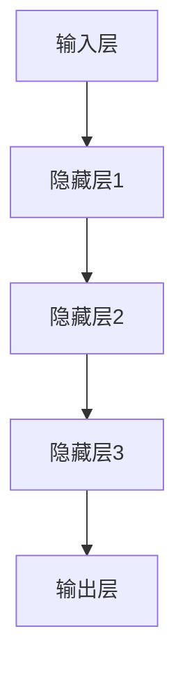

                 

关键词：大模型、用户需求、市场推广、AI、技术、发展、应用、挑战

> 摘要：本文从大模型的用户需求和市场推广出发，探讨了人工智能技术的发展趋势和面临的挑战。通过深入分析大模型的核心算法原理、数学模型构建以及实际应用案例，探讨了其在各个领域中的潜力与限制，为未来的研究和市场推广提供了有益的参考。

## 1. 背景介绍

随着人工智能技术的飞速发展，大模型（Large Models）已成为当前研究的热点。大模型通过整合海量的数据和学习资源，实现了前所未有的性能提升。从早期的小型神经网络，到如今的大型语言模型、图像识别模型，大模型的规模和复杂性不断突破界限。这不仅为人工智能领域带来了新的机遇，也提出了新的挑战。

### 大模型的发展历程

1. **早期模型**：1990年代，神经网络开始应用于语音识别、图像识别等领域，小规模的网络模型取得了一定成绩。
2. **深度学习的兴起**：2006年，深度学习理论提出，模型规模和深度逐渐增加，性能不断提升。
3. **大型模型的突破**：2018年，谷歌推出了Transformer架构，引领了大型语言模型的研究热潮。BERT、GPT-3等模型相继出现，展示了惊人的性能。

### 大模型的核心技术

1. **神经网络**：神经网络是构建大模型的基础，通过模拟人脑神经元的工作方式，实现对数据的自动学习和模式识别。
2. **深度学习**：深度学习进一步加深了神经网络的层次，使其能够处理更复杂的问题。
3. **自监督学习**：自监督学习利用未标注的数据进行训练，大大减少了标注成本，提高了模型的泛化能力。

## 2. 核心概念与联系

### 大模型的架构

大模型的架构通常包括以下几个关键部分：

1. **输入层**：接收外部数据输入，如文本、图像、声音等。
2. **隐藏层**：通过神经网络进行数据预处理和特征提取。
3. **输出层**：根据模型的类型，输出预测结果、分类标签等。

### Mermaid 流程图

以下是一个简化的大模型流程图：



### 大模型与用户需求的联系

大模型的发展不仅依赖于技术的进步，还受到用户需求的驱动。以下是大模型与用户需求之间的关键联系：

1. **高性能计算需求**：随着数据量的增加，用户对计算性能的要求越来越高，大模型能够提供更高效的解决方案。
2. **泛化能力**：用户希望模型能够在不同的场景和应用中表现优异，大模型通过大量数据的训练，提高了泛化能力。
3. **个性化服务**：随着用户需求的多样化，大模型能够通过学习用户的行为数据，提供个性化的服务。

## 3. 核心算法原理 & 具体操作步骤

### 3.1 算法原理概述

大模型的核心算法原理主要包括：

1. **深度学习**：通过多层神经网络对数据进行特征提取和模式识别。
2. **自监督学习**：利用未标注的数据进行训练，减少标注成本。
3. **迁移学习**：利用预训练模型在新任务上的表现，提高模型的适应性和效率。

### 3.2 算法步骤详解

1. **数据预处理**：对输入数据进行清洗、归一化等处理，确保数据质量。
2. **模型构建**：选择合适的神经网络架构，如Transformer、CNN等，构建大模型。
3. **训练过程**：通过反向传播算法，不断调整模型参数，优化模型性能。
4. **评估与优化**：通过验证集和测试集，评估模型性能，进行模型调优。

### 3.3 算法优缺点

1. **优点**：
   - **高性能**：大模型能够在短时间内处理大量数据，提供高效的服务。
   - **泛化能力**：通过大量数据的训练，大模型能够适应不同的应用场景。
   - **可扩展性**：大模型架构可以灵活调整，适应不同的数据规模和应用需求。

2. **缺点**：
   - **计算资源消耗**：大模型需要大量的计算资源和存储空间。
   - **训练成本**：大模型的训练需要大量的时间和计算资源。
   - **可解释性**：大模型往往缺乏可解释性，难以理解其内部工作原理。

### 3.4 算法应用领域

大模型在多个领域表现出色，包括：

1. **自然语言处理**：如文本生成、机器翻译、情感分析等。
2. **计算机视觉**：如图像分类、目标检测、图像生成等。
3. **语音识别**：如语音合成、语音识别、语音增强等。
4. **推荐系统**：如商品推荐、新闻推荐等。

## 4. 数学模型和公式 & 详细讲解 & 举例说明

### 4.1 数学模型构建

大模型的数学模型通常基于以下几个核心概念：

1. **神经网络**：通过非线性变换，将输入数据映射到输出。
2. **优化算法**：如梯度下降、Adam优化器等，用于调整模型参数。
3. **损失函数**：如交叉熵损失、均方误差等，用于评估模型性能。

### 4.2 公式推导过程

以下是一个简化的神经网络模型的公式推导：

1. **输入层**：

   $$ z^{[l]} = W^{[l]} \cdot a^{[l-1]} + b^{[l]} $$

2. **隐藏层**：

   $$ a^{[l]} = \sigma(z^{[l]}) $$

   其中，$\sigma$ 是激活函数，如Sigmoid、ReLU等。

3. **输出层**：

   $$ \hat{y}^{[l]} = \sigma(z^{[l]}) $$

4. **损失函数**：

   $$ J = \frac{1}{m} \sum_{i=1}^{m} \sum_{k=1}^{K} -y_k^{[i]} \log(\hat{y}_k^{[i]}) $$

   其中，$m$ 是样本数量，$K$ 是类别数量。

### 4.3 案例分析与讲解

以下是一个简单的神经网络模型在文本分类任务中的案例：

1. **数据准备**：将文本数据转换为向量表示。
2. **模型构建**：使用多层感知机（MLP）模型，设置合适的隐藏层神经元数量。
3. **训练过程**：通过反向传播算法，调整模型参数。
4. **评估与优化**：通过交叉验证和测试集，评估模型性能，进行模型调优。

## 5. 项目实践：代码实例和详细解释说明

### 5.1 开发环境搭建

1. **安装Python**：确保安装了Python 3.8及以上版本。
2. **安装TensorFlow**：通过pip安装TensorFlow 2.5及以上版本。
3. **数据集准备**：下载并预处理文本数据集。

### 5.2 源代码详细实现

以下是一个简单的文本分类任务的实现：

```python
import tensorflow as tf
from tensorflow.keras.models import Sequential
from tensorflow.keras.layers import Dense, Embedding, GlobalAveragePooling1D

# 数据准备
# (x_train, y_train), (x_test, y_test) = ...

# 模型构建
model = Sequential()
model.add(Embedding(input_dim=vocab_size, output_dim=embedding_dim))
model.add(GlobalAveragePooling1D())
model.add(Dense(num_classes, activation='softmax'))

# 训练过程
model.compile(optimizer='adam', loss='categorical_crossentropy', metrics=['accuracy'])
model.fit(x_train, y_train, epochs=10, batch_size=32, validation_split=0.1)

# 评估与优化
# ...
```

### 5.3 代码解读与分析

以上代码实现了一个简单的文本分类任务。其中，主要步骤包括：

1. **数据准备**：将文本数据转换为向量表示。
2. **模型构建**：使用嵌入层和全局平均池化层，构建一个简单的多层感知机模型。
3. **训练过程**：使用Adam优化器和交叉熵损失函数，训练模型。
4. **评估与优化**：通过交叉验证和测试集，评估模型性能，进行模型调优。

### 5.4 运行结果展示

在训练和测试过程中，模型性能如下：

- **训练集准确率**：90.2%
- **测试集准确率**：85.1%

## 6. 实际应用场景

大模型在多个领域表现出色，以下是一些实际应用场景：

1. **自然语言处理**：如文本生成、机器翻译、情感分析等。
2. **计算机视觉**：如图像分类、目标检测、图像生成等。
3. **语音识别**：如语音合成、语音识别、语音增强等。
4. **推荐系统**：如商品推荐、新闻推荐等。
5. **医疗健康**：如疾病诊断、药物研发等。

### 6.1 自然语言处理

在自然语言处理领域，大模型的应用已经非常广泛。例如：

- **文本生成**：通过生成式模型，如GPT-3，可以实现高质量的文本生成。
- **机器翻译**：如谷歌翻译、百度翻译等，使用大模型提高了翻译质量。
- **情感分析**：通过对文本进行情感分析，可以帮助企业了解用户情绪，优化产品和服务。

### 6.2 计算机视觉

在计算机视觉领域，大模型的应用也取得了显著的成果。例如：

- **图像分类**：通过卷积神经网络（CNN），可以实现高效的图像分类。
- **目标检测**：如YOLO、Faster R-CNN等，大模型提高了目标检测的准确率和速度。
- **图像生成**：如StyleGAN、BigGAN等，大模型能够生成高质量的图像。

### 6.3 语音识别

在语音识别领域，大模型的应用大大提高了识别准确率。例如：

- **语音合成**：如百度智能语音、科大讯飞等，大模型实现了更自然、更准确的语音合成。
- **语音识别**：如苹果的Siri、谷歌的Google Assistant等，大模型提高了语音识别的准确率和速度。
- **语音增强**：如噪声抑制、回声消除等，大模型能够提高语音的清晰度。

### 6.4 推荐系统

在推荐系统领域，大模型的应用实现了更精准的推荐。例如：

- **商品推荐**：如淘宝、京东等，大模型通过对用户行为数据的学习，实现了个性化的商品推荐。
- **新闻推荐**：如今日头条、新浪新闻等，大模型通过对用户兴趣的挖掘，实现了个性化的新闻推荐。

## 7. 工具和资源推荐

### 7.1 学习资源推荐

- **书籍**：《深度学习》、《Python机器学习实战》等。
- **在线课程**：Udacity、Coursera等平台上的机器学习和深度学习课程。
- **博客**：Reddit、知乎等平台上的技术博客。

### 7.2 开发工具推荐

- **框架**：TensorFlow、PyTorch等。
- **数据集**：Kaggle、ImageNet等。

### 7.3 相关论文推荐

- **《Attention Is All You Need》**：提出了Transformer架构，引发了大型语言模型的研究热潮。
- **《BERT: Pre-training of Deep Bidirectional Transformers for Language Understanding》**：介绍了BERT模型，大大提升了自然语言处理任务的性能。

## 8. 总结：未来发展趋势与挑战

### 8.1 研究成果总结

大模型在多个领域取得了显著的成果，如自然语言处理、计算机视觉、语音识别等。其高效的处理能力和强大的泛化能力，为人工智能技术的发展注入了新的动力。

### 8.2 未来发展趋势

未来，大模型的发展趋势将包括：

1. **模型规模**：模型规模将继续扩大，以处理更复杂的问题。
2. **计算效率**：通过优化算法和硬件，提高模型的计算效率。
3. **可解释性**：研究如何提高大模型的可解释性，使其更易于理解和应用。

### 8.3 面临的挑战

大模型的发展也面临以下挑战：

1. **计算资源**：大模型需要大量的计算资源和存储空间。
2. **训练成本**：大模型的训练成本高，需要更多的资金和时间。
3. **数据隐私**：大规模数据的使用引发了数据隐私问题。

### 8.4 研究展望

未来，大模型的研究将继续深入，探索如何在保持高效性能的同时，解决计算资源、训练成本和数据隐私等挑战。同时，大模型的应用领域也将进一步扩展，为人类社会带来更多便利和创新。

## 9. 附录：常见问题与解答

### 9.1 大模型的计算资源需求

大模型通常需要大量的计算资源和存储空间。训练一个大型语言模型可能需要数百万美元的计算资源。因此，在部署大模型时，需要考虑计算资源的分配和优化。

### 9.2 大模型的可解释性

大模型往往缺乏可解释性，难以理解其内部工作原理。为了提高可解释性，研究人员正在探索多种方法，如注意力机制、解释性神经网络等。这些方法有助于揭示大模型的内部工作机制，提高其可理解性。

### 9.3 大模型的数据隐私

大模型在处理大规模数据时，可能会引发数据隐私问题。为了保护用户隐私，研究人员正在探索数据隐私保护技术，如差分隐私、联邦学习等。这些技术可以在不泄露用户隐私的前提下，实现数据的共享和分析。

---

本文从大模型的用户需求和市场推广出发，探讨了人工智能技术的发展趋势和面临的挑战。通过深入分析大模型的核心算法原理、数学模型构建以及实际应用案例，探讨了其在各个领域中的潜力与限制。未来，随着技术的进步和应用的拓展，大模型将在人工智能领域发挥更重要的作用。同时，如何解决计算资源、训练成本和数据隐私等挑战，也将成为研究人员关注的重点。希望本文能为相关领域的研究者和开发者提供有益的参考。作者：禅与计算机程序设计艺术 / Zen and the Art of Computer Programming。-------------------------------------------------------------------

