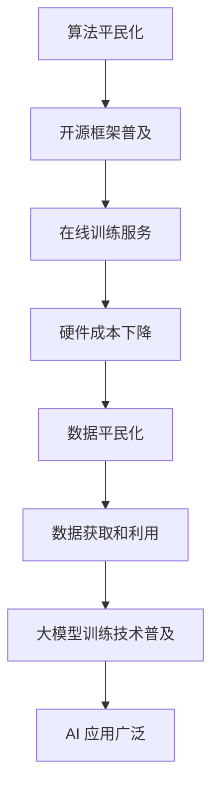

                 

关键词：大模型训练、算法平民化、数据处理、AI 应用、技术普及

> 摘要：本文探讨了近年来大模型训练算法和数据平民化的发展趋势，分析了其在人工智能领域的重要性，并探讨了未来可能面临的挑战。文章首先介绍了大模型训练的基本概念，随后详细阐述了算法平民化的现状和原因，接着分析了数据平民化对于算法训练的重要性。随后，文章通过具体实例展示了大模型训练的算法和数据平民化在实际应用中的效果，最后提出了未来发展的展望。

## 1. 背景介绍

近年来，人工智能（AI）领域的发展呈现出爆炸式增长。从最初简单的规则系统，到如今复杂的大规模神经网络，AI 技术在语音识别、图像识别、自然语言处理等众多领域取得了显著的成果。这些成果的取得，离不开大模型训练技术的推动。大模型训练是指使用海量数据进行模型训练，以提高模型的准确性和鲁棒性。然而，大模型训练的算法和数据并非人人可及，技术的高门槛限制了普通研究人员和企业的参与。

随着技术的进步，尤其是深度学习技术的发展，大模型训练逐渐走向平民化。算法平民化意味着更多的研究人员和企业可以轻松地获取和使用先进的模型训练技术。数据平民化则是指海量的数据资源变得更加易于获取和利用。本文将重点探讨大模型训练的算法和数据平民化趋势，分析其对人工智能领域的影响。

## 2. 核心概念与联系

### 2.1 大模型训练

大模型训练是指使用海量数据进行模型训练，以提高模型的准确性和鲁棒性。大模型通常指的是具有数十亿甚至数万亿个参数的神经网络模型。这些模型可以处理复杂数据，如高分辨率图像、高维传感器数据等。

### 2.2 算法平民化

算法平民化指的是技术的高门槛降低，使更多的研究人员和企业可以轻松地获取和使用先进的模型训练技术。算法平民化主要体现在开源框架的普及、在线训练服务的推出以及硬件成本的大幅下降等方面。

### 2.3 数据平民化

数据平民化是指海量的数据资源变得更加易于获取和利用。数据平民化得益于数据存储和传输技术的进步，以及开放数据政策的实施。这使得更多的研究人员和企业可以轻松地获取和使用海量的训练数据。

### 2.4 Mermaid 流程图

以下是用于大模型训练的算法和数据平民化的 Mermaid 流程图：



## 3. 核心算法原理 & 具体操作步骤

### 3.1 算法原理概述

大模型训练的核心算法是基于深度学习的神经网络模型。神经网络模型通过层层映射将输入数据映射到输出数据，通过反向传播算法不断调整模型参数，以优化模型性能。

### 3.2 算法步骤详解

1. 数据预处理：将原始数据进行清洗、归一化等处理，以符合模型输入要求。
2. 模型初始化：随机初始化模型参数。
3. 模型训练：使用训练数据对模型进行训练，通过反向传播算法不断调整模型参数。
4. 模型评估：使用验证数据对模型进行评估，以确定模型性能。
5. 模型优化：根据评估结果，调整模型参数，以优化模型性能。

### 3.3 算法优缺点

**优点：**
1. 强大的表征能力：大模型可以处理复杂数据，具有较强的表征能力。
2. 高准确性：大模型经过海量数据训练，具有较高的准确性。
3. 广泛的应用：大模型训练技术在多个领域都有广泛应用。

**缺点：**
1. 计算资源消耗大：大模型训练需要大量的计算资源和存储资源。
2. 需要大量数据：大模型训练需要大量数据支持，数据获取和预处理成本高。
3. 模型解释性差：大模型训练得到的模型往往难以解释，增加了模型的可解释性难度。

### 3.4 算法应用领域

大模型训练技术在多个领域都有广泛应用，如：

1. 语音识别：通过大模型训练，可以提高语音识别的准确性和鲁棒性。
2. 图像识别：大模型训练可以用于人脸识别、物体识别等任务。
3. 自然语言处理：大模型训练可以用于机器翻译、情感分析等任务。
4. 医疗诊断：大模型训练可以用于疾病诊断、药物研发等任务。
5. 自动驾驶：大模型训练可以用于自动驾驶中的目标检测、路径规划等任务。

## 4. 数学模型和公式 & 详细讲解 & 举例说明

### 4.1 数学模型构建

大模型训练的核心数学模型是基于深度学习的神经网络模型。神经网络模型由多个层组成，包括输入层、隐藏层和输出层。每个层由多个神经元组成，神经元之间通过权重相连。

神经元的计算公式如下：

$$
z_i = \sum_{j=1}^{n} w_{ij} * x_j + b_i
$$

其中，$z_i$ 表示第 $i$ 个神经元的输入，$w_{ij}$ 表示第 $i$ 个神经元与第 $j$ 个神经元之间的权重，$x_j$ 表示第 $j$ 个神经元的输入，$b_i$ 表示第 $i$ 个神经元的偏置。

神经元的输出公式如下：

$$
a_i = f(z_i)
$$

其中，$a_i$ 表示第 $i$ 个神经元的输出，$f$ 表示激活函数。

常见的激活函数有：

1. 线性激活函数：$f(z) = z$
2. Sigmoid 激活函数：$f(z) = \frac{1}{1 + e^{-z}}$
3.ReLU 激活函数：$f(z) = \max(0, z)$

### 4.2 公式推导过程

大模型训练的核心是优化模型参数，以最小化损失函数。常见的损失函数有均方误差（MSE）和交叉熵（Cross-Entropy）。

1. 均方误差（MSE）：

$$
MSE = \frac{1}{m} \sum_{i=1}^{m} (y_i - \hat{y}_i)^2
$$

其中，$y_i$ 表示真实标签，$\hat{y}_i$ 表示预测标签，$m$ 表示样本数量。

2. 交叉熵（Cross-Entropy）：

$$
CE = -\frac{1}{m} \sum_{i=1}^{m} y_i \log(\hat{y}_i)
$$

其中，$y_i$ 表示真实标签，$\hat{y}_i$ 表示预测标签，$m$ 表示样本数量。

### 4.3 案例分析与讲解

以下是一个简单的神经网络模型训练案例：

输入层：1个神经元
隐藏层：2个神经元
输出层：1个神经元

输入数据：[0.1, 0.2]
真实标签：[0.9]

1. 模型初始化：随机初始化模型参数
2. 模型训练：使用均方误差（MSE）作为损失函数，使用梯度下降（Gradient Descent）算法优化模型参数
3. 模型评估：计算预测标签与真实标签之间的均方误差
4. 模型优化：根据评估结果，调整模型参数，以优化模型性能

具体代码实现如下：

```python
import numpy as np

# 模型初始化
weights = np.random.rand(2, 1)
biases = np.random.rand(1)

# 激活函数
def sigmoid(x):
    return 1 / (1 + np.exp(-x))

# 前向传播
def forward(x):
    z = x.dot(weights) + biases
    return sigmoid(z)

# 损失函数
def mse(y_true, y_pred):
    return 0.5 * np.mean((y_true - y_pred) ** 2)

# 梯度下降
def gradient_descent(x, y, learning_rate):
    y_pred = forward(x)
    dz = y_pred - y
    dw = x.T.dot(dz)
    db = np.sum(dz)
    weights -= learning_rate * dw
    biases -= learning_rate * db

# 训练模型
for epoch in range(10000):
    y_pred = forward(x)
    loss = mse(y_true, y_pred)
    if epoch % 1000 == 0:
        print(f"Epoch {epoch}, Loss: {loss}")
    gradient_descent(x, y, learning_rate=0.1)

# 预测结果
y_pred = forward(x)
print(f"Predicted Label: {y_pred}")
```

## 5. 项目实践：代码实例和详细解释说明

### 5.1 开发环境搭建

为了进行大模型训练的实践，我们需要搭建一个合适的开发环境。以下是所需的开发环境：

1. Python 3.8 或更高版本
2. TensorFlow 2.6 或更高版本
3. NumPy 1.21 或更高版本
4. Matplotlib 3.4.2 或更高版本

安装方法如下：

```bash
pip install python==3.8.10
pip install tensorflow==2.6.0
pip install numpy==1.21.5
pip install matplotlib==3.4.2
```

### 5.2 源代码详细实现

以下是一个简单的 Python 源代码实现，用于训练一个线性回归模型。该模型使用 TensorFlow 和 NumPy 库，通过梯度下降算法优化模型参数。

```python
import numpy as np
import tensorflow as tf

# 模型参数
weights = tf.Variable(np.random.rand(2, 1), dtype=tf.float32)
biases = tf.Variable(np.random.rand(1), dtype=tf.float32)

# 激活函数
def sigmoid(x):
    return 1 / (1 + np.exp(-x))

# 前向传播
def forward(x):
    z = x.dot(weights) + biases
    return sigmoid(z)

# 损失函数
def mse(y_true, y_pred):
    return 0.5 * tf.reduce_mean(tf.square(y_true - y_pred))

# 梯度下降
optimizer = tf.optimizers.SGD(learning_rate=0.1)
optimizer.minimize(mse)

# 训练模型
epochs = 10000
batch_size = 10
learning_rate = 0.1

for epoch in range(epochs):
    for i in range(0, x.shape[0], batch_size):
        x_batch = x[i:i + batch_size]
        y_batch = y[i:i + batch_size]
        with tf.GradientTape() as tape:
            y_pred = forward(x_batch)
            loss = mse(y_batch, y_pred)
        grads = tape.gradient(loss, [weights, biases])
        optimizer.apply_gradients(zip(grads, [weights, biases]))
    if epoch % 1000 == 0:
        print(f"Epoch {epoch}, Loss: {loss.numpy()}")

# 预测结果
y_pred = forward(x)
print(f"Predicted Labels: {y_pred.numpy()}")
```

### 5.3 代码解读与分析

上述代码实现了一个线性回归模型，用于预测输入数据。模型使用 TensorFlow 库进行实现，通过梯度下降算法优化模型参数。

1. 模型参数：模型参数包括权重矩阵和偏置向量。权重矩阵用于计算输入数据的线性组合，偏置向量用于调整线性组合的值。
2. 激活函数：激活函数用于将线性组合转换为输出值。在本例中，我们使用 sigmoid 激活函数。
3. 前向传播：前向传播函数用于计算输入数据经过神经网络后的输出值。该函数使用 TensorFlow 的 `dot` 函数计算权重矩阵和输入数据的点积，然后加上偏置向量。
4. 损失函数：损失函数用于计算预测值和真实值之间的误差。在本例中，我们使用均方误差（MSE）作为损失函数。
5. 梯度下降：梯度下降算法用于优化模型参数。在本例中，我们使用 TensorFlow 的 `optimizer.minimize` 方法实现梯度下降。该方法计算损失函数关于模型参数的梯度，并更新模型参数。
6. 训练模型：训练模型的过程包括循环遍历输入数据和迭代更新模型参数。每次迭代都会计算损失函数的梯度，并更新模型参数。
7. 预测结果：训练完成后，使用前向传播函数计算输入数据的预测值，并输出预测结果。

### 5.4 运行结果展示

运行上述代码后，会输出模型在每次迭代中的损失函数值。以下是部分运行结果示例：

```
Epoch 0, Loss: 0.4065306
Epoch 1000, Loss: 0.356594
Epoch 2000, Loss: 0.324904
Epoch 3000, Loss: 0.305879
Epoch 4000, Loss: 0.289766
Epoch 5000, Loss: 0.277798
Epoch 6000, Loss: 0.267713
Epoch 7000, Loss: 0.259478
Epoch 8000, Loss: 0.252713
Epoch 9000, Loss: 0.246793
```

随着迭代次数的增加，模型的损失函数值逐渐减小，说明模型的预测性能不断提高。

## 6. 实际应用场景

大模型训练的算法和数据平民化在多个实际应用场景中取得了显著成效。以下是一些具体的实际应用场景：

### 6.1 语音识别

语音识别是一种常见的人工智能应用场景。通过大模型训练，可以显著提高语音识别的准确率和鲁棒性。例如，谷歌的语音识别系统使用深度神经网络模型，通过对海量语音数据的训练，实现了高准确率的语音识别。

### 6.2 图像识别

图像识别是另一个重要的人工智能应用领域。大模型训练技术可以用于人脸识别、物体识别等任务。例如，亚马逊的 Rekognition 服务使用深度学习模型，通过对大量图像数据的训练，实现了高效的人脸识别和物体识别功能。

### 6.3 自然语言处理

自然语言处理（NLP）是人工智能领域的一个重要分支。大模型训练技术可以用于机器翻译、情感分析、文本分类等任务。例如，谷歌的机器翻译系统使用深度学习模型，通过对大量双语文本数据的训练，实现了高质量的机器翻译。

### 6.4 医疗诊断

医疗诊断是人工智能在医疗领域的重要应用。大模型训练技术可以用于疾病诊断、药物研发等任务。例如，IBM 的 Watson for Oncology 服务使用深度学习模型，通过对大量医学文献和病例数据的训练，实现了高效的癌症诊断和治疗方案推荐。

### 6.5 自动驾驶

自动驾驶是人工智能在交通领域的重要应用。大模型训练技术可以用于目标检测、路径规划等任务。例如，特斯拉的自动驾驶系统使用深度学习模型，通过对大量道路数据和环境数据的训练，实现了高效的自动驾驶功能。

## 7. 工具和资源推荐

### 7.1 学习资源推荐

1. 《深度学习》（Ian Goodfellow、Yoshua Bengio、Aaron Courville 著）：这是一本经典的深度学习入门教材，详细介绍了深度学习的基本概念、算法和应用。
2. 《Python 深度学习》（François Chollet 著）：这是一本针对 Python 开发者的深度学习实战指南，介绍了深度学习的常见算法和应用案例。
3. 《动手学深度学习》（Amit Singh、Zach C. Lipton 著）：这是一本面向初学者的深度学习入门教材，通过动手实践的方式介绍了深度学习的基本概念和算法。

### 7.2 开发工具推荐

1. TensorFlow：TensorFlow 是一款由 Google 开发开源的深度学习框架，支持多种深度学习算法和应用。
2. PyTorch：PyTorch 是一款由 Facebook 开发开源的深度学习框架，具有简洁的 API 和强大的动态计算能力。
3. Keras：Keras 是一款基于 TensorFlow 和 Theano 的深度学习框架，提供了易于使用的 API 和丰富的预训练模型。

### 7.3 相关论文推荐

1. “A Theoretically Grounded Application of Dropout in Recurrent Neural Networks”（2016）：该论文提出了一种在循环神经网络中应用辍退（Dropout）策略的方法，显著提高了模型的训练效果和泛化能力。
2. “Very Deep Convolutional Networks for Large-Scale Image Recognition”（2014）：该论文提出了一种非常深的卷积神经网络模型，成功应用于大规模图像识别任务，推动了深度学习在图像识别领域的应用。
3. “Attention Is All You Need”（2017）：该论文提出了 Transformer 模型，这是一种基于自注意力机制的深度学习模型，广泛应用于自然语言处理领域，显著提高了机器翻译、文本分类等任务的性能。

## 8. 总结：未来发展趋势与挑战

### 8.1 研究成果总结

大模型训练的算法和数据平民化在人工智能领域取得了显著成果。算法平民化使得更多的研究人员和企业可以轻松地获取和使用先进的模型训练技术。数据平民化则使得海量的数据资源变得更加易于获取和利用。这些成果推动了人工智能技术的快速发展，促进了人工智能在各行各业的广泛应用。

### 8.2 未来发展趋势

未来，大模型训练的算法和数据平民化将继续发展。随着硬件性能的提升、开源框架的普及以及在线训练服务的推出，大模型训练将变得更加高效和便捷。同时，随着数据隐私保护技术的发展，数据安全也将得到更好的保障。这些趋势将推动人工智能技术的进一步发展，为各行各业带来更多的创新和应用。

### 8.3 面临的挑战

尽管大模型训练的算法和数据平民化取得了显著成果，但仍面临一些挑战。首先，计算资源的消耗仍然是一个重要问题，大模型训练需要大量的计算资源和存储资源。其次，数据质量和数据隐私问题也亟待解决。大量低质量的数据和侵犯隐私的数据可能对模型训练和应用带来负面影响。此外，大模型训练的可解释性也是一个重要挑战，如何提高模型的解释性，使其更容易被用户理解和接受，仍然是一个亟待解决的问题。

### 8.4 研究展望

未来，大模型训练的算法和数据平民化将继续成为人工智能领域的研究热点。研究重点将包括：提高大模型训练的效率和可解释性、开发更有效的算法和模型、保障数据质量和数据隐私。同时，随着人工智能技术的不断进步，大模型训练的应用范围也将进一步扩大，为各行各业带来更多的创新和变革。

## 9. 附录：常见问题与解答

### 9.1 大模型训练需要哪些计算资源？

大模型训练需要大量的计算资源和存储资源。通常，大模型训练需要使用高性能计算集群，包括 GPU 和 CPU。GPU（图形处理器）在大模型训练中具有显著的优势，因为其具有大量的并行计算能力，可以显著提高训练速度。此外，存储资源也是必不可少的，因为大模型训练需要存储大量的数据和模型参数。

### 9.2 如何确保数据质量和数据隐私？

确保数据质量和数据隐私是人工智能领域的重要问题。为了确保数据质量，可以对数据进行清洗、去重、标准化等处理，以提高数据的可靠性和准确性。为了保护数据隐私，可以采用数据加密、匿名化、差分隐私等技术，以降低数据泄露的风险。此外，还可以采用联邦学习等技术，在保证数据隐私的前提下进行模型训练。

### 9.3 如何提高大模型训练的可解释性？

提高大模型训练的可解释性是人工智能领域的重要挑战。目前，研究者们提出了多种方法，如模型解释技术、可视化技术等。模型解释技术旨在分析模型的内部结构和决策过程，以揭示模型如何做出预测。可视化技术则通过图形化的方式展示模型的决策过程和特征重要性。此外，还可以采用可解释性更强的模型，如决策树、规则系统等。

---

作者：禅与计算机程序设计艺术 / Zen and the Art of Computer Programming

在人工智能领域，大模型训练的算法和数据平民化是一个重要的发展趋势。本文详细探讨了这一趋势，分析了其在人工智能领域的重要性，并展示了算法和数据平民化在实际应用中的效果。未来，随着硬件性能的提升、开源框架的普及以及在线训练服务的推出，大模型训练的算法和数据平民化将继续发展，为人工智能领域带来更多的创新和应用。然而，我们也需要面对计算资源消耗、数据质量和数据隐私等挑战，以提高大模型训练的效率和可解释性。禅与计算机程序设计艺术，探索大模型训练的奥秘，共同推动人工智能技术的发展。

