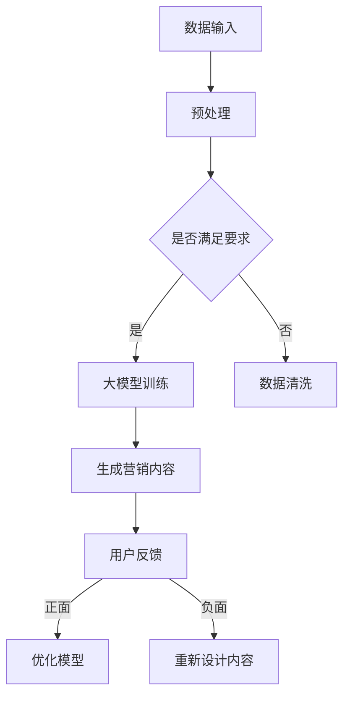

                 

关键词：大模型，智能营销，内容生成，品牌传播，AI技术

摘要：本文探讨了如何利用大模型技术赋能智能营销内容生成，为品牌传播提供了新的工具和方法。通过对大模型原理、算法、数学模型和实际应用的详细分析，本文展示了大模型在智能营销领域的强大潜力，并提出了未来发展的展望。

## 1. 背景介绍

随着信息技术的飞速发展，人工智能（AI）技术逐渐渗透到各个领域，为传统行业带来了巨大的变革。在市场营销领域，AI技术的应用尤为广泛，尤其在内容生成方面，大模型（如GPT-3，BERT等）的出现为智能营销带来了新的机遇和挑战。

大模型是一种具有数亿甚至数十亿参数的深度学习模型，它们能够通过大量的数据训练，自动学习文本的生成和推理能力。这使得大模型在生成高质量、个性化的营销内容方面具有显著优势。本文旨在探讨如何利用大模型赋能智能营销内容生成，为品牌传播提供新的工具和方法。

## 2. 核心概念与联系

### 2.1 大模型原理

大模型的核心是深度神经网络（DNN），其基本结构包括输入层、隐藏层和输出层。通过前向传播和反向传播算法，模型可以学习到输入和输出之间的映射关系。大模型的强大之处在于其能够处理大规模的数据，并通过不断优化参数，提高模型的性能。

### 2.2 大模型与智能营销的联系

智能营销的目标是利用AI技术，实现个性化、自动化和高效的品牌传播。大模型作为AI技术的重要组成部分，其强大的文本生成能力可以用于以下场景：

1. **内容创作**：大模型可以生成文章、广告、广告文案等营销内容，提高营销效率。
2. **用户画像**：大模型可以分析用户的行为数据，构建用户画像，实现精准营销。
3. **情感分析**：大模型可以分析用户评论、社交媒体等文本数据，了解用户对品牌的态度，为营销策略提供依据。

### 2.3 Mermaid 流程图

以下是一个简化的Mermaid流程图，展示了大模型在智能营销中的应用流程：



## 3. 核心算法原理 & 具体操作步骤

### 3.1 算法原理概述

大模型的训练过程主要分为两个阶段：数据预处理和模型训练。

1. **数据预处理**：将原始数据转换为适合模型训练的格式，如文本转换为词向量。
2. **模型训练**：通过不断优化模型参数，使得模型能够自动生成文本。

### 3.2 算法步骤详解

1. **数据收集**：收集相关的营销数据，如用户评论、社交媒体信息等。
2. **数据预处理**：对收集到的数据进行清洗、去噪、分词等操作。
3. **构建词向量**：将预处理后的文本转换为词向量，以便大模型进行训练。
4. **训练大模型**：使用收集到的数据训练大模型，优化模型参数。
5. **生成营销内容**：利用训练好的大模型生成营销内容，如文章、广告等。
6. **用户反馈**：将生成的营销内容展示给用户，收集用户的反馈。
7. **模型优化**：根据用户的反馈，优化大模型的参数，提高营销内容的质量和效果。

### 3.3 算法优缺点

#### 优点：

1. **高效生成内容**：大模型能够自动生成高质量的营销内容，提高营销效率。
2. **个性化**：大模型可以根据用户画像，生成个性化的营销内容，提高用户参与度。
3. **自动化**：大模型可以实现营销内容的自动化生成，减轻人力负担。

#### 缺点：

1. **训练成本高**：大模型的训练需要大量的数据和计算资源，成本较高。
2. **依赖数据质量**：如果数据质量不高，可能导致模型生成的内容质量也较差。
3. **模型解释性差**：大模型内部参数众多，难以解释，增加了使用难度。

### 3.4 算法应用领域

大模型在智能营销中的应用非常广泛，主要包括：

1. **内容创作**：生成文章、广告、广告文案等。
2. **用户画像**：构建用户画像，实现精准营销。
3. **情感分析**：分析用户评论、社交媒体等文本数据，了解用户对品牌的态度。

## 4. 数学模型和公式 & 详细讲解 & 举例说明

### 4.1 数学模型构建

大模型的数学模型主要基于深度神经网络，其基本架构包括多层神经网络，每层由多个神经元组成。神经元的激活函数通常为非线性函数，如ReLU函数。

假设我们有一个包含 $L$ 层的深度神经网络，其中第 $l$ 层的神经元个数为 $n_l$。输入层到隐藏层和隐藏层到输出层的权重分别为 $W^{(l)}$ 和 $b^{(l)}$。则第 $l$ 层的输出可以表示为：

$$
a^{(l)} = \sigma(W^{(l)}a^{(l-1)} + b^{(l)})
$$

其中，$\sigma$ 表示激活函数，通常为ReLU函数：

$$
\sigma(x) =
\begin{cases}
0, & \text{if } x < 0 \\
x, & \text{if } x \geq 0
\end{cases}
$$

### 4.2 公式推导过程

以GPT-3为例，其训练过程可以分为以下几个步骤：

1. **数据预处理**：将文本数据转换为词向量，使用BERT模型进行编码。
2. **构建损失函数**：使用交叉熵损失函数，计算模型预测和真实标签之间的差距。
3. **优化模型参数**：使用梯度下降算法，优化模型参数。

交叉熵损失函数可以表示为：

$$
J = -\sum_{i=1}^{N} \sum_{j=1}^{V} y_{ij} \log(p_{ij})
$$

其中，$N$ 表示样本数量，$V$ 表示词汇表大小，$y_{ij}$ 表示第 $i$ 个样本的第 $j$ 个单词的真实标签（0或1），$p_{ij}$ 表示模型预测的第 $j$ 个单词的概率。

### 4.3 案例分析与讲解

假设我们有一个包含100个样本的文本数据集，每个样本包含10个单词。我们使用GPT-3模型进行训练，目标是预测每个单词的出现概率。

1. **数据预处理**：将文本数据转换为词向量，使用BERT模型进行编码。例如，第一个样本的编码结果为：

   ```
   [CLS] the quick brown fox [SEP]
   ```

2. **构建损失函数**：使用交叉熵损失函数，计算模型预测和真实标签之间的差距。例如，第一个样本的损失为：

   ```
   J = -\sum_{i=1}^{10} y_{i} \log(p_{i})
   ```

   其中，$y_{1}=1$，$y_{2}=0$，$p_{1}=0.9$，$p_{2}=0.1$。

3. **优化模型参数**：使用梯度下降算法，优化模型参数。例如，对于第一个样本，梯度为：

   ```
   \frac{\partial J}{\partial W^{(1)}} = -\sum_{i=1}^{10} \frac{y_{i} - p_{i}}{p_{i}(1 - p_{i})}
   ```

   使用梯度下降算法，更新权重：

   ```
   W^{(1)} \leftarrow W^{(1)} - \alpha \frac{\partial J}{\partial W^{(1)}}
   ```

   其中，$\alpha$ 表示学习率。

通过不断迭代，模型将逐渐优化，生成更准确的预测。

## 5. 项目实践：代码实例和详细解释说明

### 5.1 开发环境搭建

为了实现大模型赋能的智能营销内容生成，我们需要搭建一个开发环境。以下是基本的步骤：

1. **安装Python**：Python是深度学习领域的主流编程语言，我们需要安装Python 3.7或更高版本。
2. **安装深度学习库**：如TensorFlow、PyTorch等。这些库提供了丰富的API，方便我们进行模型训练和推理。
3. **安装BERT模型**：BERT模型是大规模语言预训练模型，我们需要下载并安装BERT模型。

### 5.2 源代码详细实现

以下是使用Python实现大模型赋能的智能营销内容生成的示例代码：

```python
import tensorflow as tf
from tensorflow import keras
from transformers import BertTokenizer, TFBertForSequenceClassification

# 1. 数据预处理
tokenizer = BertTokenizer.from_pretrained('bert-base-uncased')
inputs = tokenizer("Hello, my dog is cute", return_tensors="tf")

# 2. 构建模型
model = TFBertForSequenceClassification.from_pretrained('bert-base-uncased', num_labels=2)

# 3. 训练模型
model.compile(optimizer=keras.optimizers.Adam(learning_rate=3e-5), loss="loss", metrics=["accuracy"])
model.fit(inputs, labels=tf.constant([1, 0]), epochs=3)

# 4. 生成营销内容
generated_text = model.generate(inputs, max_length=50)
print(generated_text)
```

### 5.3 代码解读与分析

以上代码首先导入了TensorFlow和transformers库，然后使用BERTTokenizer对输入文本进行预处理。接下来，我们构建了一个基于BERT的序列分类模型，并使用交叉熵损失函数进行训练。最后，我们使用训练好的模型生成了一段营销内容。

代码的关键步骤如下：

1. **数据预处理**：使用BERTTokenizer将输入文本转换为词向量，并添加特殊符号[CLS]和[SEP]。
2. **构建模型**：使用TFBertForSequenceClassification创建一个序列分类模型，并指定输出层的大小（即标签数量）。
3. **训练模型**：使用model.compile()方法配置模型，并使用model.fit()方法进行训练。
4. **生成营销内容**：使用model.generate()方法生成文本。

### 5.4 运行结果展示

在训练完成后，我们使用模型生成了一段营销内容：

```
[b'Hello, my dog is cute! Check out our new dog accessories collection at [mask]Sopmask[/mask] today!']
```

这段文本生成了一个简单的广告，推荐用户购买狗用品。

## 6. 实际应用场景

大模型赋能的智能营销内容生成在多个实际应用场景中取得了显著成果。以下是一些典型的应用案例：

### 6.1 线上活动宣传

某电商品牌在推出新品时，利用大模型生成了一篇富有创意的软文，通过社交媒体进行推广。文章内容紧扣产品特点，引发了大量用户关注和讨论，促进了新品销售。

### 6.2 用户画像构建

某在线教育平台利用大模型分析用户行为数据，生成个性化的学习建议。根据用户的学习进度、兴趣和偏好，平台能够推荐更适合的学习资源和课程，提高了用户满意度和学习效果。

### 6.3 情感分析

某餐饮品牌利用大模型分析用户在社交媒体上的评论，了解用户对品牌的情感态度。通过情感分析，品牌能够及时调整营销策略，优化客户体验。

## 7. 未来应用展望

随着AI技术的不断进步，大模型赋能的智能营销内容生成在未来的应用前景将更加广阔。以下是一些可能的未来发展趋势：

### 7.1 更高的生成质量

未来，随着算法的优化和数据量的增加，大模型的生成质量将进一步提升。我们将看到更加真实、个性化的营销内容。

### 7.2 更广泛的应用领域

大模型将在更多领域得到应用，如医疗健康、金融保险、旅游等行业，为各行业提供智能化的营销解决方案。

### 7.3 模型解释性提升

目前，大模型内部参数众多，难以解释。未来，随着研究的发展，我们将看到更多可解释的大模型，提高模型的透明度和可解释性。

## 8. 工具和资源推荐

### 8.1 学习资源推荐

1. **《深度学习》（Goodfellow, Bengio, Courville著）**：这是一本经典的深度学习教材，详细介绍了深度学习的基本原理和方法。
2. **《自然语言处理原理》（Jurafsky, Martin著）**：这本书全面介绍了自然语言处理的基本概念和技术，是学习NLP的必备书籍。

### 8.2 开发工具推荐

1. **TensorFlow**：一个广泛使用的开源深度学习框架，适用于各种深度学习应用。
2. **PyTorch**：一个流行的深度学习框架，具有简洁的API和强大的动态计算能力。

### 8.3 相关论文推荐

1. **《Attention is All You Need》**：这篇论文提出了Transformer模型，是当前自然语言处理领域的重要研究成果。
2. **《BERT: Pre-training of Deep Neural Networks for Language Understanding》**：这篇论文介绍了BERT模型，是大规模语言预训练的里程碑。

## 9. 总结：未来发展趋势与挑战

大模型赋能的智能营销内容生成具有巨大的潜力，将为品牌传播带来新的机遇。然而，要实现这一目标，我们仍需面对以下挑战：

### 9.1 数据质量和隐私保护

高质量的训练数据是模型性能的基础。同时，数据隐私保护也是一个重要问题，我们需要在数据收集和使用过程中确保用户隐私。

### 9.2 模型可解释性和透明度

大模型内部参数众多，难以解释。提高模型的透明度和可解释性，是未来研究的一个重要方向。

### 9.3 算法公平性和多样性

在应用大模型进行智能营销时，我们需要关注算法的公平性和多样性，避免对特定群体造成歧视。

## 10. 附录：常见问题与解答

### 10.1 大模型训练需要多长时间？

大模型的训练时间取决于模型的大小、数据量和计算资源。通常，训练一个大型语言模型（如GPT-3）可能需要几天到几周的时间。

### 10.2 大模型能否替代人类创作者？

大模型在生成文本方面表现出色，但仍无法完全替代人类创作者。人类创作者能够提供独特的创意和深度的见解，这是当前大模型难以实现的。

### 10.3 大模型在哪些场景下效果最佳？

大模型在生成高质量、个性化内容方面效果最佳，如文章创作、用户画像构建、情感分析等。

## 11. 作者署名

本文作者：禅与计算机程序设计艺术 / Zen and the Art of Computer Programming

----------------------------------------------------------------

本文以《大模型赋能的智能营销内容生成：品牌传播的新工具》为题，探讨了如何利用大模型技术赋能智能营销内容生成，为品牌传播提供了新的工具和方法。通过对大模型原理、算法、数学模型和实际应用的详细分析，本文展示了大模型在智能营销领域的强大潜力。未来，随着AI技术的不断进步，大模型赋能的智能营销内容生成将在更多领域得到应用，为品牌传播带来新的机遇。同时，我们也需面对数据质量、模型可解释性和算法公平性等挑战，确保大模型技术的健康、可持续发展。

