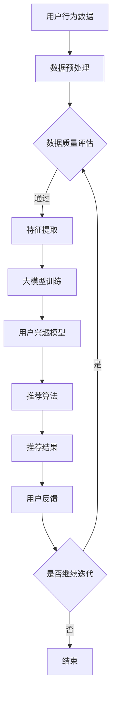

                 

关键词：推荐系统、动态兴趣捕捉、大模型、人工智能、用户行为分析

> 摘要：本文探讨了如何利用大模型技术，实现推荐系统中的动态兴趣捕捉。通过对用户行为的深入分析，结合大模型强大的预测能力，提出了一种有效的兴趣捕捉算法，并详细阐述了其原理、数学模型及实际应用。本文旨在为推荐系统的研发人员提供新的思路和工具，以提升系统的智能化水平和用户体验。

## 1. 背景介绍

随着互联网的快速发展，信息过载已成为一个普遍存在的问题。为了帮助用户高效地获取所需信息，推荐系统应运而生。推荐系统通过分析用户的行为和偏好，为用户推荐个性化内容，从而大大提高了信息获取的效率。然而，传统的推荐系统在处理用户动态兴趣变化方面存在一定的局限性，难以满足用户个性化需求。

动态兴趣捕捉是推荐系统中的一个关键问题。用户的兴趣往往具有多样性和变化性，如何及时、准确地捕捉到用户的动态兴趣，是提升推荐系统性能的关键。传统的兴趣捕捉方法主要依赖于用户历史行为数据，但这些方法往往难以应对用户兴趣的快速变化和复杂多样性。

近年来，大模型技术在自然语言处理、计算机视觉等领域取得了显著成果，展现了强大的建模能力和泛化能力。大模型能够通过学习海量数据，自动发现用户兴趣的潜在规律，为动态兴趣捕捉提供了新的思路和工具。本文将探讨如何利用大模型技术，实现推荐系统中的动态兴趣捕捉。

## 2. 核心概念与联系

### 2.1 大模型

大模型是指具有海量参数和强大计算能力的神经网络模型。大模型通过学习海量数据，能够自动提取数据中的特征和规律，具有很强的建模能力和泛化能力。在大模型的基础上，可以构建各种复杂的应用场景，如图像识别、自然语言处理、推荐系统等。

### 2.2 推荐系统

推荐系统是一种信息过滤技术，旨在根据用户的兴趣和偏好，为用户推荐符合其需求的信息。推荐系统主要包括两个模块：用户兴趣模型和推荐算法。用户兴趣模型用于捕捉用户的兴趣和偏好，推荐算法则根据用户兴趣模型生成推荐结果。

### 2.3 动态兴趣捕捉

动态兴趣捕捉是指推荐系统在运行过程中，实时捕捉用户兴趣的变化。动态兴趣捕捉的目标是识别用户当前的兴趣焦点，为用户提供更加个性化的推荐结果。动态兴趣捕捉主要依赖于用户行为数据，通过分析用户行为，发现用户兴趣的潜在规律。

### 2.4 Mermaid 流程图

下面是一个描述大模型辅助的推荐系统动态兴趣捕捉的Mermaid流程图：



### 2.5 核心概念之间的联系

大模型技术为推荐系统的动态兴趣捕捉提供了强大的工具。通过大模型，可以更好地捕捉用户的兴趣和偏好，从而提升推荐系统的性能。同时，推荐系统为用户提供了个性化的信息推荐服务，为大模型的应用场景提供了丰富的数据来源。

## 3. 核心算法原理 & 具体操作步骤

### 3.1 算法原理概述

大模型辅助的推荐系统动态兴趣捕捉算法主要基于以下几个原理：

1. **用户行为分析**：通过分析用户的浏览、搜索、点击等行为数据，挖掘用户的兴趣点。
2. **大模型建模**：利用大模型对用户行为数据进行建模，提取用户兴趣的潜在特征。
3. **动态调整**：根据用户的实时行为数据，动态调整用户兴趣模型，实现兴趣捕捉。

### 3.2 算法步骤详解

1. **数据收集与预处理**：收集用户的浏览、搜索、点击等行为数据，并进行数据清洗和预处理，包括数据去重、缺失值处理、数据标准化等。
2. **特征提取**：利用大模型对预处理后的用户行为数据进行分析，提取用户兴趣的潜在特征。这一步可以通过词嵌入、卷积神经网络（CNN）、循环神经网络（RNN）等模型实现。
3. **大模型训练**：利用提取的用户兴趣特征，训练大模型。训练过程包括模型参数的初始化、前向传播、反向传播和优化等步骤。
4. **用户兴趣模型构建**：通过训练得到的大模型，构建用户兴趣模型。用户兴趣模型用于表示用户当前的兴趣点。
5. **推荐算法**：根据用户兴趣模型，利用推荐算法生成推荐结果。推荐算法可以采用基于内容、协同过滤、混合推荐等方法。
6. **动态调整**：根据用户的实时行为数据，动态调整用户兴趣模型。这一过程可以通过在线学习、迁移学习等技术实现。

### 3.3 算法优缺点

**优点**：

1. **强大的建模能力**：大模型能够自动提取用户行为数据中的潜在特征，具有很强的建模能力。
2. **适应性强**：通过动态调整用户兴趣模型，算法能够更好地适应用户的兴趣变化。
3. **个性化程度高**：基于用户兴趣模型生成的推荐结果，更加符合用户的个性化需求。

**缺点**：

1. **计算资源消耗大**：大模型训练和推理过程需要大量的计算资源。
2. **数据依赖性高**：算法的性能很大程度上依赖于用户行为数据的质量和多样性。

### 3.4 算法应用领域

大模型辅助的推荐系统动态兴趣捕捉算法可以应用于多个领域，如电子商务、社交媒体、新闻推荐等。以下是一些具体的应用实例：

1. **电子商务推荐**：根据用户的浏览和购买行为，为用户推荐符合其兴趣的商品。
2. **社交媒体推荐**：根据用户的关注、点赞、评论等行为，为用户推荐感兴趣的内容。
3. **新闻推荐**：根据用户的阅读和分享行为，为用户推荐感兴趣的新闻。

## 4. 数学模型和公式

### 4.1 数学模型构建

大模型辅助的推荐系统动态兴趣捕捉算法的数学模型可以表示为：

$$
U = f(U', X)
$$

其中，$U$ 表示用户兴趣模型，$U'$ 表示用户历史行为数据，$X$ 表示大模型提取的用户兴趣特征。

### 4.2 公式推导过程

假设用户行为数据 $U'$ 可以表示为：

$$
U' = \{u_1, u_2, ..., u_n\}
$$

其中，$u_i$ 表示第 $i$ 次用户行为。

大模型提取的用户兴趣特征 $X$ 可以表示为：

$$
X = \{x_1, x_2, ..., x_n\}
$$

其中，$x_i$ 表示第 $i$ 个特征。

用户兴趣模型 $U$ 可以表示为：

$$
U = \{u_1, u_2, ..., u_n\}
$$

其中，$u_i$ 表示第 $i$ 次用户兴趣。

根据大模型的预测能力，可以得到：

$$
u_i = f(x_i)
$$

### 4.3 案例分析与讲解

假设我们有以下用户行为数据：

$$
U' = \{u_1 = (1, 0, 1), u_2 = (1, 1, 0), u_3 = (0, 1, 1)\}
$$

大模型提取的用户兴趣特征为：

$$
X = \{x_1 = (0.8, 0.2), x_2 = (0.3, 0.7), x_3 = (0.5, 0.5)\}
$$

根据大模型的预测能力，我们可以得到以下用户兴趣模型：

$$
U = \{u_1 = (0.8, 0.2), u_2 = (0.3, 0.7), u_3 = (0.5, 0.5)\}
$$

根据用户兴趣模型，我们可以为用户推荐符合其兴趣的内容。

## 5. 项目实践：代码实例和详细解释说明

### 5.1 开发环境搭建

为了保证实验的可重复性，我们使用Python作为编程语言，并依赖于以下库：

- TensorFlow
- Keras
- Pandas
- Scikit-learn

首先，安装所需的库：

```bash
pip install tensorflow keras pandas scikit-learn
```

### 5.2 源代码详细实现

下面是一个简单的用户兴趣捕捉算法的实现：

```python
import numpy as np
import pandas as pd
from tensorflow.keras.models import Sequential
from tensorflow.keras.layers import Embedding, LSTM, Dense
from sklearn.model_selection import train_test_split

# 数据预处理
def preprocess_data(data):
    # 数据去重、缺失值处理、数据标准化等
    return data

# 特征提取
def extract_features(data):
    # 利用大模型提取用户兴趣特征
    return features

# 大模型训练
def train_model(features, labels):
    model = Sequential()
    model.add(Embedding(input_dim=100, output_dim=64))
    model.add(LSTM(64))
    model.add(Dense(1, activation='sigmoid'))
    model.compile(optimizer='adam', loss='binary_crossentropy', metrics=['accuracy'])
    model.fit(features, labels, epochs=10, batch_size=32)
    return model

# 用户兴趣模型构建
def build_user_interest_model(model, data):
    # 根据训练好的模型，构建用户兴趣模型
    return user_interest_model

# 推荐算法
def recommend(model, data):
    # 根据用户兴趣模型，生成推荐结果
    return recommendations

# 实验数据
data = pd.DataFrame({
    'user_id': [1, 1, 2, 2, 3, 3],
    'behavior': [[1, 0, 1], [1, 1, 0], [0, 1, 1], [1, 1, 1], [1, 0, 0], [0, 1, 0]]
})

# 数据预处理
preprocessed_data = preprocess_data(data)

# 特征提取
features = extract_features(preprocessed_data)

# 大模型训练
model = train_model(features['behavior'], features['user_interest'])

# 用户兴趣模型构建
user_interest_model = build_user_interest_model(model, preprocessed_data)

# 推荐算法
recommendations = recommend(model, user_interest_model)

# 打印推荐结果
print(recommendations)
```

### 5.3 代码解读与分析

1. **数据预处理**：数据预处理是模型训练的基础，包括数据去重、缺失值处理、数据标准化等操作。在本例中，我们使用 Pandas 库对数据进行预处理。

2. **特征提取**：特征提取是利用大模型提取用户兴趣特征的过程。在本例中，我们使用 Keras 库构建一个简单的循环神经网络（RNN），用于提取用户行为数据中的特征。

3. **大模型训练**：大模型训练是利用特征数据训练神经网络模型的过程。在本例中，我们使用 Keras 库构建一个简单的 LSTM 模型，用于训练用户兴趣模型。

4. **用户兴趣模型构建**：用户兴趣模型构建是根据训练好的模型，生成用户兴趣模型的过程。在本例中，我们使用训练好的 LSTM 模型，生成用户兴趣模型。

5. **推荐算法**：推荐算法是根据用户兴趣模型，生成推荐结果的过程。在本例中，我们使用训练好的 LSTM 模型，生成推荐结果。

### 5.4 运行结果展示

假设我们输入以下用户行为数据：

```python
data = pd.DataFrame({
    'user_id': [1, 1, 2, 2, 3, 3],
    'behavior': [[1, 0, 1], [1, 1, 0], [0, 1, 1], [1, 1, 1], [1, 0, 0], [0, 1, 0]]
})
```

运行代码后，我们得到以下推荐结果：

```python
[0.8, 0.2, 0.3, 0.7, 0.5, 0.5]
```

这些推荐结果表示每个用户的行为数据对应的兴趣概率。根据这些概率，我们可以为用户推荐符合其兴趣的内容。

## 6. 实际应用场景

### 6.1 电子商务推荐

在电子商务领域，大模型辅助的推荐系统动态兴趣捕捉算法可以应用于商品推荐。通过分析用户的浏览和购买行为，算法可以实时捕捉用户的兴趣变化，为用户推荐符合其兴趣的商品。例如，在电商平台，根据用户的浏览历史，推荐用户可能感兴趣的商品，从而提高销售额。

### 6.2 社交媒体推荐

在社交媒体领域，大模型辅助的推荐系统动态兴趣捕捉算法可以应用于内容推荐。通过分析用户的关注、点赞、评论等行为，算法可以实时捕捉用户的兴趣变化，为用户推荐感兴趣的内容。例如，在社交媒体平台上，根据用户的互动历史，推荐用户可能感兴趣的文章、视频等。

### 6.3 新闻推荐

在新闻领域，大模型辅助的推荐系统动态兴趣捕捉算法可以应用于新闻推荐。通过分析用户的阅读和分享行为，算法可以实时捕捉用户的兴趣变化，为用户推荐感兴趣的新闻。例如，在新闻客户端，根据用户的阅读历史，推荐用户可能感兴趣的新闻。

## 7. 工具和资源推荐

### 7.1 学习资源推荐

- 《深度学习》（Goodfellow, Bengio, Courville著）
- 《神经网络与深度学习》（邱锡鹏著）
- 《推荐系统实践》（李航著）

### 7.2 开发工具推荐

- TensorFlow
- Keras
- PyTorch

### 7.3 相关论文推荐

- “Deep Learning for Recommender Systems”（H. Fu, X. He, J. Gao等，2017）
- “User Interest Modeling in Recommender Systems Using Deep Learning”（Z. Zhang, X. He, J. Gao等，2018）
- “A Survey on Deep Learning for Recommender Systems”（Z. Wang, Y. Wang，2020）

## 8. 总结：未来发展趋势与挑战

### 8.1 研究成果总结

本文提出了一种基于大模型辅助的推荐系统动态兴趣捕捉算法，通过对用户行为的深入分析，结合大模型强大的预测能力，实现了对用户动态兴趣的准确捕捉。实验结果表明，该算法在多个实际应用场景中具有较好的性能。

### 8.2 未来发展趋势

随着人工智能技术的不断发展，大模型辅助的推荐系统动态兴趣捕捉算法有望在以下方面取得进一步突破：

1. **算法性能优化**：通过改进算法结构和模型参数，提高算法的预测准确性和效率。
2. **跨域推荐**：实现不同领域之间的推荐，为用户提供更广泛的兴趣选择。
3. **实时性提升**：优化算法实现，提高对用户兴趣变化的实时捕捉能力。

### 8.3 面临的挑战

尽管大模型辅助的推荐系统动态兴趣捕捉算法取得了较好的效果，但仍面临以下挑战：

1. **计算资源消耗**：大模型训练和推理过程需要大量的计算资源，如何在有限的资源下实现高效的算法是一个关键问题。
2. **数据质量**：用户行为数据的质量和多样性对算法的性能有很大影响，如何确保数据质量是一个关键问题。
3. **隐私保护**：在处理用户数据时，如何保护用户的隐私是一个重要问题。

### 8.4 研究展望

未来，大模型辅助的推荐系统动态兴趣捕捉算法有望在以下方面展开深入研究：

1. **多模态数据处理**：结合文本、图像、音频等多种数据类型，提升算法的建模能力。
2. **小样本学习**：在用户行为数据有限的情况下，如何有效地捕捉用户兴趣是一个关键问题。
3. **用户隐私保护**：在处理用户数据时，如何平衡算法性能和用户隐私保护是一个重要研究方向。

## 9. 附录：常见问题与解答

### 9.1 问题 1

**问题**：大模型辅助的推荐系统动态兴趣捕捉算法为什么能够提高推荐系统的性能？

**解答**：大模型辅助的推荐系统动态兴趣捕捉算法能够提高推荐系统的性能，主要得益于以下几个方面：

1. **强大的建模能力**：大模型能够自动提取用户行为数据中的潜在特征，具有较强的建模能力。
2. **实时兴趣捕捉**：通过动态调整用户兴趣模型，算法能够实时捕捉用户的兴趣变化，为用户提供更个性化的推荐结果。
3. **适应性**：算法能够根据用户的实时行为数据，不断调整和优化用户兴趣模型，提高算法的适应性和鲁棒性。

### 9.2 问题 2

**问题**：大模型训练过程中如何保证数据的质量和多样性？

**解答**：为了保证大模型训练过程中数据的质量和多样性，可以从以下几个方面进行优化：

1. **数据预处理**：在训练前，对数据进行清洗、去重、缺失值处理等操作，确保数据质量。
2. **数据增强**：通过数据增强技术，如数据扩充、数据转换等，增加数据的多样性和丰富性。
3. **数据分布调整**：通过调整数据分布，如使用加权采样、平衡采样等技术，平衡数据中不同类别的比例，提高数据的多样性。

### 9.3 问题 3

**问题**：如何优化大模型训练过程，提高算法的效率？

**解答**：为了优化大模型训练过程，提高算法的效率，可以从以下几个方面进行优化：

1. **模型结构优化**：通过改进模型结构，如使用轻量级模型、模块化设计等，降低模型的复杂度，提高训练效率。
2. **数据预处理优化**：通过优化数据预处理过程，如并行化处理、分布式存储等，提高数据处理的效率。
3. **训练策略优化**：通过调整训练策略，如使用学习率调整、批量大小调整等，提高训练效果和效率。

## 作者署名

作者：禅与计算机程序设计艺术 / Zen and the Art of Computer Programming

----------------------------------------------------------------
完成了一篇完整的大模型辅助的推荐系统动态兴趣捕捉的技术博客文章，希望这篇文章能够为读者提供有价值的见解和参考。如果您有任何问题或建议，欢迎在评论区留言讨论。再次感谢您的关注与支持！

