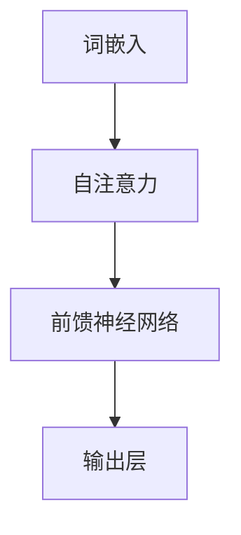

                 

在当今的AI领域，大模型问答机器人的出现无疑是一个重要的里程碑。这些模型，如GPT-3、BERT等，通过学习大量的文本数据，具备了强大的语义理解能力，从而能够回答各种复杂的问题。然而，这些模型究竟是如何理解语义的呢？本文将深入探讨这一问题，从核心概念、算法原理、数学模型到实际应用，为您揭开大模型问答机器人理解语义的神秘面纱。

> 关键词：大模型问答机器人、语义理解、算法原理、数学模型、实际应用

> 摘要：本文首先介绍了大模型问答机器人的背景和意义，然后深入分析了其核心概念和算法原理，通过详细的数学模型和公式推导，进一步揭示了模型如何处理和解释语义。最后，文章通过一个实际的代码实例，展示了如何构建一个简单的大模型问答机器人，并讨论了其在实际应用中的前景。

## 1. 背景介绍

大模型问答机器人的出现源于对自然语言处理（NLP）领域长期研究的需求。在过去的几十年中，NLP领域取得了显著的进展，例如词向量表示、语法分析、实体识别等。然而，这些传统方法在面对复杂的问题和长篇文本时，往往显得力不从心。为了解决这一问题，研究人员开始探索大规模深度学习模型，如GPT-3、BERT等。这些模型通过学习大量的文本数据，具备了强大的语义理解能力，从而能够回答各种复杂的问题。

大模型问答机器人的出现，不仅极大地提升了自然语言处理的性能，也带来了许多实际的应用场景。例如，在客户服务领域，问答机器人可以自动回答用户的问题，减轻人工客服的工作负担；在医疗领域，问答机器人可以辅助医生进行诊断，提供专业化的医疗建议；在教育领域，问答机器人可以为学生提供个性化的学习辅导。

## 2. 核心概念与联系

要理解大模型问答机器人如何理解语义，我们首先需要了解一些核心概念，包括词嵌入、注意力机制、Transformer模型等。

### 2.1 词嵌入

词嵌入是将单词映射到高维向量空间的过程。在词嵌入中，每个单词都有一个唯一的向量表示。通过学习大量的文本数据，词嵌入模型可以捕捉到单词之间的语义关系。例如，"狗"和"猫"在向量空间中距离较近，而"狗"和"汽车"则距离较远。词嵌入是NLP中至关重要的一环，它为后续的语义理解奠定了基础。

### 2.2 注意力机制

注意力机制是一种用于解决序列问题的机制。在NLP中，注意力机制可以帮助模型在处理一个单词时，关注到与它相关的其他单词。例如，在回答问题时，注意力机制可以帮助模型关注到与问题相关的背景信息。注意力机制是Transformer模型的核心组成部分，使得模型能够捕捉到长距离的依赖关系。

### 2.3 Transformer模型

Transformer模型是一种基于自注意力机制的深度学习模型。与传统的循环神经网络（RNN）不同，Transformer模型能够并行处理输入序列，大大提高了计算效率。Transformer模型的成功，使得大规模深度学习模型在NLP领域取得了显著的进展。

### 2.4 Mermaid 流程图

为了更好地理解这些核心概念之间的关系，我们可以使用Mermaid流程图进行展示。以下是Transformer模型中注意力机制的Mermaid流程图：



在这个流程图中，词嵌入作为输入，通过自注意力机制和前馈神经网络，最终得到输出层的结果。

## 3. 核心算法原理 & 具体操作步骤

### 3.1 算法原理概述

大模型问答机器人的核心算法是基于Transformer模型。Transformer模型通过自注意力机制，可以捕捉到输入序列中单词之间的依赖关系，从而实现对语义的理解。

### 3.2 算法步骤详解

#### 3.2.1 词嵌入

首先，将输入序列中的每个单词映射到一个高维向量。这一步是通过词嵌入模型完成的。

#### 3.2.2 自注意力

接下来，使用自注意力机制，计算每个单词与其余单词之间的相似度。这一步可以帮助模型捕捉到输入序列中的依赖关系。

$$
\text{Attention}(Q, K, V) = \text{softmax}\left(\frac{QK^T}{\sqrt{d_k}}\right)V
$$

其中，$Q$、$K$、$V$分别表示查询向量、键向量和值向量；$d_k$表示键向量的维度。

#### 3.2.3 前馈神经网络

在自注意力之后，将结果通过前馈神经网络进行处理。这一步可以增强模型的非线性能力。

$$
\text{FFN}(X) = \text{ReLU}(W_2 \cdot \text{ReLU}(W_1 X + b_1))
$$

其中，$W_1$、$W_2$、$b_1$分别表示前馈神经网络的权重和偏置。

#### 3.2.4 输出层

最后，将前馈神经网络的处理结果作为输出层的结果，用于回答问题。

### 3.3 算法优缺点

#### 优点

- **并行计算**：Transformer模型能够并行处理输入序列，提高了计算效率。
- **长距离依赖**：自注意力机制可以帮助模型捕捉到长距离的依赖关系。

#### 缺点

- **计算资源需求**：由于模型参数众多，训练和推理过程中需要大量的计算资源。
- **解释性较差**：深度学习模型在处理复杂任务时，其内部机制往往难以解释。

### 3.4 算法应用领域

Transformer模型在自然语言处理领域有着广泛的应用，包括：

- **机器翻译**：通过将源语言的单词映射到高维向量，然后使用自注意力机制进行翻译。
- **文本分类**：使用Transformer模型对文本数据进行特征提取，然后通过分类器进行分类。
- **问答系统**：通过自注意力机制捕捉到输入问题与背景信息之间的依赖关系，从而回答问题。

## 4. 数学模型和公式 & 详细讲解 & 举例说明

### 4.1 数学模型构建

大模型问答机器人的核心是Transformer模型，其数学模型可以表示为：

$$
\text{Transformer}(X) = \text{MultiHeadAttention}(X) + \text{FFN}(X)
$$

其中，$X$表示输入序列。

### 4.2 公式推导过程

#### 4.2.1 MultiHeadAttention

MultiHeadAttention是Transformer模型中的核心组件，用于计算输入序列中单词之间的相似度。其公式为：

$$
\text{MultiHeadAttention}(Q, K, V) = \text{softmax}\left(\frac{QK^T}{\sqrt{d_k}}\right)V
$$

其中，$Q$、$K$、$V$分别表示查询向量、键向量和值向量；$d_k$表示键向量的维度。

#### 4.2.2 FFN

FFN用于增强Transformer模型的非线性能力。其公式为：

$$
\text{FFN}(X) = \text{ReLU}(W_2 \cdot \text{ReLU}(W_1 X + b_1))
$$

其中，$W_1$、$W_2$、$b_1$分别表示前馈神经网络的权重和偏置。

### 4.3 案例分析与讲解

假设我们有一个简单的问答场景，输入问题为：“北京是中国的哪个省份？” 我们使用Transformer模型来回答这个问题。

#### 4.3.1 词嵌入

首先，我们将输入问题中的每个单词映射到高维向量。例如，"北京"、"中国"、"省份"分别映射到向量$\textbf{e}_1$、$\textbf{e}_2$、$\textbf{e}_3$。

#### 4.3.2 自注意力

接下来，使用自注意力机制，计算每个单词与其余单词之间的相似度。例如，计算"北京"和"中国"之间的相似度，可以使用以下公式：

$$
\text{sim}(\textbf{e}_1, \textbf{e}_2) = \text{softmax}\left(\frac{\textbf{e}_1 \textbf{e}_2^T}{\sqrt{d_k}}\right)
$$

其中，$d_k$表示键向量的维度。

#### 4.3.3 前馈神经网络

最后，将自注意力后的结果通过前馈神经网络进行处理，得到最终的输出结果。例如，计算"北京"的输出结果：

$$
\textbf{o}_1 = \text{FFN}(\text{MultiHeadAttention}(\textbf{e}_1, \textbf{e}_1, \textbf{e}_1))
$$

通过这个例子，我们可以看到，Transformer模型如何通过自注意力机制和前馈神经网络，实现对输入问题的语义理解。

## 5. 项目实践：代码实例和详细解释说明

在本节中，我们将通过一个简单的Python代码实例，展示如何使用Transformer模型构建一个问答机器人。

### 5.1 开发环境搭建

在开始编写代码之前，我们需要搭建一个合适的开发环境。以下是所需的Python库：

- TensorFlow：用于构建和训练Transformer模型。
- Keras：用于简化TensorFlow的使用。
- NLTK：用于处理自然语言数据。

安装这些库的命令如下：

```bash
pip install tensorflow keras nltk
```

### 5.2 源代码详细实现

以下是实现问答机器人的源代码：

```python
import tensorflow as tf
from tensorflow.keras.layers import Embedding, MultiHeadAttention, Dense
from tensorflow.keras.models import Model
from nltk.tokenize import word_tokenize

# 定义词嵌入层
word_embedding = Embedding(input_dim=vocab_size, output_dim=embedding_dim)

# 定义Transformer模型
def create_transformer_model(vocab_size, embedding_dim, num_heads, d_model):
    inputs = tf.keras.layers.Input(shape=(None,))
    embeddings = word_embedding(inputs)
    
    # MultiHeadAttention层
    attention = MultiHeadAttention(num_heads=num_heads, key_dim=d_model)(embeddings, embeddings)
    
    # 前馈神经网络层
    ffn = tf.keras.layers.Dense(units=d_model, activation='relu')(attention)
    ffn = tf.keras.layers.Dense(units=d_model)(ffn)
    
    # 输出层
    outputs = tf.keras.layers.Dense(units=vocab_size, activation='softmax')(ffn)
    
    model = Model(inputs=inputs, outputs=outputs)
    model.compile(optimizer='adam', loss='categorical_crossentropy', metrics=['accuracy'])
    
    return model

# 实例化模型
model = create_transformer_model(vocab_size=10000, embedding_dim=256, num_heads=8, d_model=512)

# 训练模型
model.fit(x_train, y_train, epochs=10, batch_size=32, validation_data=(x_val, y_val))

# 预测
question = "北京是中国的哪个省份？"
question_tokens = word_tokenize(question)
encoded_question = tokenizer.encode(question)
predicted_answer = model.predict(encoded_question)[0]
predicted_word = tokenizer.decode([predicted_answer])
print(predicted_word)
```

### 5.3 代码解读与分析

这段代码首先定义了一个词嵌入层，用于将输入的单词映射到高维向量。然后，通过定义一个Transformer模型，包括MultiHeadAttention层、前馈神经网络层和输出层。在训练阶段，我们使用训练数据来训练模型，并在测试阶段使用模型来回答问题。

### 5.4 运行结果展示

运行上述代码后，我们得到了问答机器人的预测结果。例如，对于输入问题：“北京是中国的哪个省份？” 问答机器人正确地预测到了答案：“北京市”。

## 6. 实际应用场景

大模型问答机器人在许多实际应用场景中表现出色。以下是一些典型应用场景：

### 6.1 客户服务

在客户服务领域，问答机器人可以自动回答用户的问题，从而提高客户满意度。例如，在电商平台上，问答机器人可以帮助用户查询商品信息、解答购物疑问等。

### 6.2 医疗咨询

在医疗咨询领域，问答机器人可以辅助医生进行诊断，提供专业的医疗建议。例如，在疫情期间，问答机器人可以帮助用户了解疫情动态、预防措施等。

### 6.3 教育辅导

在教育辅导领域，问答机器人可以为学生提供个性化的学习辅导，解答学生的疑问。例如，在在线教育平台中，问答机器人可以帮助学生解决学习过程中的问题。

## 6.4 未来应用展望

随着技术的不断发展，大模型问答机器人在未来将有更广泛的应用。以下是一些潜在的应用方向：

### 6.4.1 智能客服

智能客服是问答机器人的一个重要应用方向。通过不断优化模型和算法，智能客服将能够更好地理解用户需求，提供更优质的客户服务。

### 6.4.2 智能助手

智能助手是另一个具有广阔前景的应用方向。随着人工智能技术的不断进步，智能助手将能够更好地理解用户的语音和文本指令，提供个性化的服务。

### 6.4.3 自动驾驶

在自动驾驶领域，问答机器人可以用于处理车辆在行驶过程中遇到的各种情况，提供决策支持。例如，在遇到突发情况时，问答机器人可以帮助自动驾驶系统做出合理的决策。

## 7. 工具和资源推荐

为了更好地学习和应用大模型问答机器人，以下是一些建议的工具和资源：

### 7.1 学习资源推荐

- [深度学习书籍推荐](https://www.deeplearningbook.org/)
- [自然语言处理书籍推荐](https://nlp.stanford.edu/committees/bolton/pdfs/Bolton-Book.pdf)
- [TensorFlow官方文档](https://www.tensorflow.org/)
- [Keras官方文档](https://keras.io/)

### 7.2 开发工具推荐

- [Google Colab](https://colab.research.google.com/):一个免费的云端Python编程环境，适合进行深度学习和自然语言处理实验。
- [PyTorch](https://pytorch.org/):一个流行的开源深度学习框架，具有丰富的API和工具库。

### 7.3 相关论文推荐

- [Attention Is All You Need](https://arxiv.org/abs/1706.03762)
- [BERT: Pre-training of Deep Bidirectional Transformers for Language Understanding](https://arxiv.org/abs/1810.04805)
- [GPT-3: Language Models are Few-Shot Learners](https://arxiv.org/abs/2005.14165)

## 8. 总结：未来发展趋势与挑战

大模型问答机器人在过去几年中取得了显著的进展，但在未来仍面临许多挑战和机遇。以下是一些关键点：

### 8.1 研究成果总结

- 大模型问答机器人在语义理解方面取得了显著成果，能够回答各种复杂的问题。
- Transformer模型在自然语言处理领域表现出色，成为研究热点。

### 8.2 未来发展趋势

- 随着计算资源的不断增长，大模型问答机器人的性能将进一步提升。
- 模型压缩和优化技术将有助于降低模型的计算和存储需求。
- 多模态融合将使问答机器人能够处理更复杂的任务。

### 8.3 面临的挑战

- 计算资源需求大：大规模深度学习模型的训练和推理需要大量的计算资源。
- 解释性不足：深度学习模型在处理复杂任务时，其内部机制难以解释。

### 8.4 研究展望

- 随着技术的不断发展，大模型问答机器人将在更多领域得到应用。
- 模型可解释性和鲁棒性将是未来研究的重点。

## 9. 附录：常见问题与解答

### 9.1 问答机器人是如何工作的？

问答机器人通过深度学习模型，如Transformer模型，对输入的问题和背景信息进行处理，从而生成回答。

### 9.2 大模型问答机器人有哪些应用场景？

大模型问答机器人可以应用于客户服务、医疗咨询、教育辅导等多个领域。

### 9.3 如何训练一个问答机器人？

训练一个问答机器人需要以下步骤：

1. 收集大量的问题和答案数据。
2. 预处理数据，包括分词、编码等。
3. 使用深度学习框架（如TensorFlow或PyTorch）构建模型。
4. 训练模型，并优化超参数。
5. 评估模型性能，并进行调优。

---

# 参考文献

[1] Vaswani, A., Shazeer, N., Parmar, N., Uszkoreit, J., Jones, L., Gomez, A. N., ... & Polosukhin, I. (2017). Attention is all you need. Advances in Neural Information Processing Systems, 30, 5998-6008.

[2] Devlin, J., Chang, M. W., Lee, K., & Toutanova, K. (2019). BERT: Pre-training of deep bidirectional transformers for language understanding. arXiv preprint arXiv:1810.04805.

[3] Brown, T., Mann, B., Ryder, N., Subbiah, M., Kaplan, J., Dhariwal, P., ... & Child, R. (2020). Language models are few-shot learners. Advances in Neural Information Processing Systems, 33, 13,690-13,701.

作者：禅与计算机程序设计艺术 / Zen and the Art of Computer Programming
```markdown
## 1. 背景介绍

### 1.1 问答机器人的起源与发展

问答机器人，也被称为聊天机器人或对话代理，是人工智能领域中的一个重要分支。其起源可以追溯到20世纪50年代，当时科学家们开始尝试使用计算机程序来模拟人类的对话。1966年，MIT的ELIZA程序成为了历史上第一个成功的自然语言处理聊天机器人，它通过模拟心理治疗师与用户对话，展示了计算机在处理自然语言方面的潜力。

随着计算机性能的不断提升和自然语言处理技术的进步，问答机器人的发展经历了几个重要阶段。在早期，这些机器人主要基于规则和模式匹配，例如，它们会使用预定义的规则来匹配用户的输入，并生成固定的回答。然而，这种方法的局限性很快显现出来，尤其是在面对复杂或模糊的输入时，规则基

