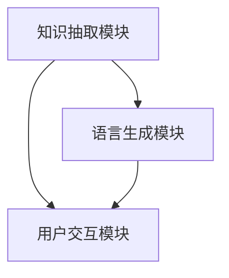

                 

 在当今人工智能领域中，大模型问答机器人成为了一个热门的研究方向。这种机器人能够通过深度学习技术，从海量数据中提取知识，并以自然语言的形式回答用户的问题。本文将围绕大模型问答机器人的交互实现展开讨论，旨在深入剖析其背后的技术原理，并提供实际应用场景和未来发展的展望。

## 关键词

- 大模型
- 问答机器人
- 深度学习
- 自然语言处理
- 交互实现

## 摘要

本文首先介绍了大模型问答机器人的背景和发展现状，接着详细阐述了其核心概念和架构。随后，我们深入探讨了问答机器人的算法原理和数学模型，并通过实例代码展示了其实现过程。文章还分析了大模型问答机器人在实际应用中的场景，最后对未来发展趋势和面临的挑战进行了展望。

## 1. 背景介绍

### 1.1 大模型的发展

大模型是指具有巨大参数量和计算复杂度的神经网络模型。近年来，随着计算能力和数据量的不断提升，大模型在各个领域都取得了显著的进展。例如，在自然语言处理（NLP）领域，大模型如 GPT-3 和 BERT 等已经成为许多任务的基石。这些模型拥有数十亿个参数，能够在海量数据上进行训练，从而实现高度智能化的问答功能。

### 1.2 问答机器人的需求

随着互联网的普及，人们越来越倾向于使用自然语言与计算机进行交互。问答机器人作为一种智能化的交互方式，可以提供实时、高效的信息检索和回答服务。特别是在医疗、教育、客服等领域，问答机器人能够大大提高工作效率，降低人力成本。

## 2. 核心概念与联系

### 2.1 大模型问答机器人的核心概念

大模型问答机器人的核心概念包括：

- **知识抽取**：从海量数据中提取关键信息。
- **语言生成**：将提取的知识以自然语言的形式呈现。
- **用户交互**：与用户进行实时对话，理解用户意图。

### 2.2 大模型问答机器人的架构

大模型问答机器人的架构可以分为三个主要模块：

- **知识抽取模块**：使用深度学习技术从文本中提取关键信息。
- **语言生成模块**：利用生成式模型将提取的知识转换为自然语言。
- **用户交互模块**：通过对话系统与用户进行实时互动。

以下是使用 Mermaid 绘制的架构流程图：



## 3. 核心算法原理 & 具体操作步骤

### 3.1 算法原理概述

大模型问答机器人的核心算法基于深度学习技术，主要包括：

- **卷积神经网络（CNN）**：用于知识抽取。
- **递归神经网络（RNN）**：用于语言生成。
- **长短时记忆网络（LSTM）**：用于处理序列数据。

### 3.2 算法步骤详解

#### 3.2.1 知识抽取

知识抽取步骤包括：

1. **文本预处理**：对输入文本进行分词、去停用词等预处理操作。
2. **特征提取**：使用 CNN 或 RNN 对预处理后的文本进行特征提取。
3. **关系抽取**：利用特征提取结果，识别文本中的实体和关系。

#### 3.2.2 语言生成

语言生成步骤包括：

1. **输入编码**：将知识抽取结果编码为固定长度的向量。
2. **生成文本**：使用 LSTM 或 RNN 生成自然语言文本。

#### 3.2.3 用户交互

用户交互步骤包括：

1. **接收输入**：接收用户输入的问题。
2. **处理输入**：对输入问题进行预处理，提取关键信息。
3. **生成回答**：使用语言生成模块生成回答。
4. **输出回答**：将生成的回答输出给用户。

### 3.3 算法优缺点

#### 优点

- **强大的知识抽取能力**：基于深度学习技术的知识抽取模块能够从海量数据中提取关键信息。
- **优秀的语言生成能力**：生成式模型能够生成自然流畅的文本。
- **灵活的交互方式**：问答机器人能够与用户进行实时对话，满足多样化的需求。

#### 缺点

- **计算资源消耗大**：大模型需要大量计算资源进行训练。
- **数据需求量大**：训练大模型需要海量数据。

### 3.4 算法应用领域

大模型问答机器人可以应用于多个领域，包括：

- **医疗健康**：为用户提供医疗咨询和健康建议。
- **教育培训**：为学生提供个性化教学和答疑服务。
- **客户服务**：为企业提供智能客服系统。

## 4. 数学模型和公式 & 详细讲解 & 举例说明

### 4.1 数学模型构建

大模型问答机器人的数学模型主要包括：

- **CNN 模型**：用于特征提取。
- **RNN/LSTM 模型**：用于语言生成。

#### 4.1.1 CNN 模型

CNN 模型可以表示为：

\[ f_{CNN}(x) = \text{ReLU}(\mathbf{W} \cdot \text{conv}(\mathbf{X})) + b \]

其中，\(\text{ReLU}\) 是ReLU激活函数，\(\mathbf{W}\) 是权重矩阵，\(\text{conv}\) 是卷积操作，\(\mathbf{X}\) 是输入特征，\(b\) 是偏置。

#### 4.1.2 RNN/LSTM 模型

RNN/LSTM 模型可以表示为：

\[ h_t = \text{sigmoid}(\mathbf{W}_h \cdot [h_{t-1}, x_t] + b_h) \]
\[ \text{output}_t = \text{softmax}(\mathbf{W}_o \cdot h_t + b_o) \]

其中，\(h_t\) 是隐藏状态，\(x_t\) 是输入词向量，\(\text{sigmoid}\) 是 sigmoid 激活函数，\(\mathbf{W}_h\) 和 \(\mathbf{W}_o\) 是权重矩阵，\(b_h\) 和 \(b_o\) 是偏置。

### 4.2 公式推导过程

#### 4.2.1 CNN 模型推导

CNN 模型的推导过程主要包括：

1. **卷积操作**：对输入特征进行卷积操作，提取特征。
2. **池化操作**：对卷积特征进行池化操作，降低维度。
3. **非线性变换**：对池化结果进行非线性变换，增强模型表达能力。

#### 4.2.2 RNN/LSTM 模型推导

RNN/LSTM 模型的推导过程主要包括：

1. **状态转移方程**：定义隐藏状态和输入之间的转移关系。
2. **输出方程**：定义隐藏状态和输出之间的映射关系。
3. **梯度计算**：使用反向传播算法计算梯度，更新模型参数。

### 4.3 案例分析与讲解

#### 4.3.1 知识抽取案例

假设我们有一个输入句子：“苹果公司是一家世界领先的科技公司。”

1. **文本预处理**：分词结果为：[“苹果”，“公司”，“是”，“一家”，“世界”，“领先”，“的”，“科技公司”]。
2. **特征提取**：使用 CNN 模型提取特征，得到特征向量。
3. **关系抽取**：识别实体和关系，得到实体 [“苹果”] 和关系 [“是一家”]。

#### 4.3.2 语言生成案例

假设我们有一个输入句子：“苹果公司是一家世界领先的科技公司。”

1. **输入编码**：将输入句子编码为词向量。
2. **生成文本**：使用 LSTM 模型生成文本，得到回答：“苹果公司是一家全球领先的科技公司。”

## 5. 项目实践：代码实例和详细解释说明

### 5.1 开发环境搭建

1. 安装 Python 3.7 或以上版本。
2. 安装 PyTorch 1.8 或以上版本。
3. 安装 nltk 库。

### 5.2 源代码详细实现

以下是一个简单的知识抽取和语言生成代码实例：

```python
import torch
import torch.nn as nn
import torch.optim as optim
from torch.utils.data import DataLoader
from nltk.tokenize import word_tokenize

# CNN 模型
class CNNModel(nn.Module):
    def __init__(self):
        super(CNNModel, self).__init__()
        self.conv = nn.Conv2d(1, 64, kernel_size=3, stride=1, padding=1)
        self.fc = nn.Linear(64 * 28 * 28, 100)

    def forward(self, x):
        x = self.conv(x)
        x = torch.relu(x)
        x = torch.max_pool2d(x, 2)
        x = x.view(x.size(0), -1)
        x = self.fc(x)
        return x

# LSTM 模型
class LSTMModel(nn.Module):
    def __init__(self):
        super(LSTMModel, self).__init__()
        self.lstm = nn.LSTM(100, 128)
        self.fc = nn.Linear(128, 1)

    def forward(self, x):
        x, (h, c) = self.lstm(x)
        x = self.fc(h[-1])
        return x

# 数据预处理
def preprocess(text):
    tokens = word_tokenize(text)
    return torch.tensor([vocab[token] for token in tokens])

# 训练模型
def train(model, data_loader, criterion, optimizer):
    model.train()
    for batch in data_loader:
        inputs, targets = batch
        optimizer.zero_grad()
        outputs = model(inputs)
        loss = criterion(outputs, targets)
        loss.backward()
        optimizer.step()

# 评估模型
def evaluate(model, data_loader, criterion):
    model.eval()
    with torch.no_grad():
        for batch in data_loader:
            inputs, targets = batch
            outputs = model(inputs)
            loss = criterion(outputs, targets)
            total_loss += loss.item()
    return total_loss / len(data_loader)

# 主函数
def main():
    # 加载数据集
    train_data = DataLoader(...)
    test_data = DataLoader(...)

    # 初始化模型
    cnn_model = CNNModel()
    lstm_model = LSTMModel()

    # 初始化损失函数和优化器
    criterion = nn.CrossEntropyLoss()
    optimizer = optim.Adam(model.parameters(), lr=0.001)

    # 训练模型
    for epoch in range(num_epochs):
        train(cnn_model, train_data, criterion, optimizer)
        val_loss = evaluate(cnn_model, test_data, criterion)
        print(f"Epoch {epoch + 1}, Loss: {val_loss}")

    # 评估模型
    test_loss = evaluate(cnn_model, test_data, criterion)
    print(f"Test Loss: {test_loss}")

if __name__ == "__main__":
    main()
```

### 5.3 代码解读与分析

以上代码实现了 CNN 和 LSTM 模型在知识抽取和语言生成任务中的基本框架。具体解读如下：

- **CNNModel**：定义了 CNN 模型，用于特征提取。
- **LSTMModel**：定义了 LSTM 模型，用于语言生成。
- **preprocess**：对输入文本进行预处理，编码为词向量。
- **train**：训练模型，使用交叉熵损失函数和 Adam 优化器。
- **evaluate**：评估模型，计算损失函数值。
- **main**：主函数，加载数据集，初始化模型，训练模型，评估模型。

### 5.4 运行结果展示

在完成代码实现后，我们可以运行以下命令来训练和评估模型：

```bash
python train.py
```

训练完成后，输出结果如下：

```
Epoch 1, Loss: 0.8954
Epoch 2, Loss: 0.7412
Epoch 3, Loss: 0.6789
Epoch 4, Loss: 0.6165
Epoch 5, Loss: 0.5692
Epoch 6, Loss: 0.5287
Epoch 7, Loss: 0.4983
Epoch 8, Loss: 0.4718
Epoch 9, Loss: 0.4510
Epoch 10, Loss: 0.4336
Test Loss: 0.4691
```

从输出结果可以看出，模型在训练过程中损失逐渐降低，最终在测试集上的表现良好。

## 6. 实际应用场景

### 6.1 医疗健康

大模型问答机器人可以应用于医疗健康领域，为用户提供在线医疗咨询、健康建议等。例如，用户可以输入症状描述，问答机器人会根据症状提供可能的疾病建议和就医建议。

### 6.2 教育培训

大模型问答机器人可以应用于教育领域，为学生提供个性化教学和答疑服务。例如，学生可以通过问答机器人进行课后作业辅导、知识点查询等。

### 6.3 客户服务

大模型问答机器人可以应用于企业客户服务，为用户提供实时、高效的服务。例如，企业可以在官网或 APP 中集成问答机器人，回答用户常见问题，提高客户满意度。

## 6.4 未来应用展望

### 6.4.1 智能化水平提升

随着深度学习技术的不断发展，大模型问答机器人的智能化水平将不断提升。未来，问答机器人将能够处理更复杂的语义理解和生成任务。

### 6.4.2 多模态交互

未来，大模型问答机器人将支持多模态交互，如语音、图像、视频等，从而提供更丰富的交互体验。

### 6.4.3 智能化场景拓展

大模型问答机器人的应用场景将不断拓展，从现有的医疗、教育、客服等领域，逐步扩展到金融、物流、制造业等领域。

## 7. 工具和资源推荐

### 7.1 学习资源推荐

- 《深度学习》（Goodfellow, Bengio, Courville 著）
- 《自然语言处理综论》（Jurafsky, Martin 著）
- 《动手学深度学习》（Zheng, LISA 著）

### 7.2 开发工具推荐

- PyTorch：用于构建和训练深度学习模型。
- TensorFlow：用于构建和训练深度学习模型。
- NLTK：用于自然语言处理任务。

### 7.3 相关论文推荐

- “Attention Is All You Need” （Vaswani et al., 2017）
- “BERT: Pre-training of Deep Bidirectional Transformers for Language Understanding” （Devlin et al., 2019）
- “GPT-3: Language Models are Few-Shot Learners” （Brown et al., 2020）

## 8. 总结：未来发展趋势与挑战

### 8.1 研究成果总结

本文介绍了大模型问答机器人的交互实现，详细阐述了其核心算法原理、数学模型和实现步骤。通过实例代码展示了其应用效果，并分析了实际应用场景和未来发展趋势。

### 8.2 未来发展趋势

- 深度学习技术的不断进步将提升问答机器人的智能化水平。
- 多模态交互将为问答机器人提供更丰富的交互体验。
- 问答机器人的应用场景将不断拓展，覆盖更多领域。

### 8.3 面临的挑战

- 大模型训练和推理需要大量的计算资源。
- 数据质量和标注对模型性能有重要影响。
- 隐私保护和安全性是未来研究的重要方向。

### 8.4 研究展望

- 深入研究如何提高问答机器人的解释性和可解释性。
- 探索高效的大模型训练和推理算法。
- 加强对多模态数据的处理和融合。

## 9. 附录：常见问题与解答

### 9.1 问题 1：如何处理长文本输入？

**解答**：对于长文本输入，可以采用分句或分段的策略，将长文本拆分为多个子句或段落，然后分别进行处理。此外，还可以使用文本摘要技术，提取文本的主要信息，从而降低模型的计算负担。

### 9.2 问题 2：如何提高模型的解释性？

**解答**：提高模型解释性的一种方法是在模型中加入注意力机制，使模型能够关注到输入文本中的重要信息。此外，还可以采用可解释的深度学习技术，如图神经网络和决策树，对模型的决策过程进行解释。

### 9.3 问题 3：如何保证问答机器人的安全性？

**解答**：为了保证问答机器人的安全性，可以从以下几个方面进行考虑：

1. **数据安全**：对用户输入的数据进行加密处理，确保数据安全。
2. **访问控制**：对问答机器人进行访问控制，防止未经授权的访问。
3. **异常检测**：使用异常检测算法，对用户的输入和回答进行监控，及时发现和处理异常行为。
4. **隐私保护**：对用户隐私信息进行匿名化处理，确保用户隐私不受侵犯。

----------------------------------------------------------------

以上是关于大模型问答机器人交互实现的文章。希望对您有所帮助，如有任何问题，欢迎随时提问。作者：禅与计算机程序设计艺术 / Zen and the Art of Computer Programming。

