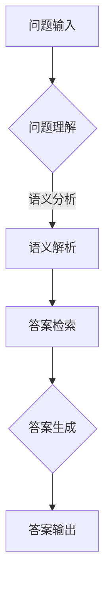

                 

关键词：大模型，问答机器人，任务完成能力，人工智能，深度学习，自然语言处理

> 摘要：本文将对大模型问答机器人的任务完成能力进行深入探讨，从背景介绍、核心概念、算法原理、数学模型、项目实践、实际应用、工具和资源推荐以及未来发展趋势与挑战等方面进行全面分析，以期为读者提供全面的技术参考和思考。

## 1. 背景介绍

随着人工智能技术的飞速发展，自然语言处理（Natural Language Processing，NLP）已经成为人工智能领域的一个重要分支。大模型问答机器人作为一种新兴的智能服务形式，正在逐步改变我们的生活方式和工作模式。从最初的规则引擎到基于统计模型的简单问答，再到目前基于深度学习的大模型问答机器人，这一领域的发展历程充分展示了人工智能技术的巨大进步。

大模型问答机器人的任务完成能力指的是其能够根据用户提出的问题，从海量的知识库中快速准确地检索出相关信息，并生成自然流畅的答案。这一能力在客服、教育、医疗等多个领域具有广泛的应用前景。然而，大模型问答机器人的任务完成能力也面临着诸多挑战，如数据质量、模型可解释性、实时响应等。

## 2. 核心概念与联系

### 2.1. 大模型

大模型（Large-scale Model）通常指的是具有数十亿甚至千亿参数的神经网络模型。这些模型在训练过程中需要大量的数据和高性能计算资源。随着深度学习技术的不断发展，大模型的规模和性能也在不断提升。大模型在自然语言处理任务中具有显著的优势，如更好的语义理解和生成能力。

### 2.2. 问答系统

问答系统（Question Answering System）是一种常见的自然语言处理应用，旨在回答用户提出的问题。问答系统通常包括三个主要部分：问题理解、答案检索和答案生成。问题理解部分负责将自然语言问题转化为机器可理解的形式；答案检索部分从知识库或互联网中检索相关信息；答案生成部分则根据检索结果生成自然流畅的答案。

### 2.3. Mermaid 流程图

Mermaid 是一种基于文本的绘图工具，可以方便地生成各种图表，包括流程图、时序图、Gantt 图等。以下是一个示例 Mermaid 流程图，展示了大模型问答机器人的基本架构：



## 3. 核心算法原理 & 具体操作步骤

### 3.1. 算法原理概述

大模型问答机器人的核心算法通常是基于深度学习的自然语言处理技术，包括词嵌入、编码器-解码器（Encoder-Decoder）模型、注意力机制（Attention Mechanism）等。词嵌入用于将自然语言文本转化为计算机可处理的向量表示；编码器-解码器模型负责将输入问题转换为语义表示，并生成答案；注意力机制则用于在生成答案时关注与问题最相关的信息。

### 3.2. 算法步骤详解

1. **词嵌入**：将输入问题中的每个词转化为向量表示。常用的词嵌入方法包括 Word2Vec、GloVe 等。
2. **编码器**：将词嵌入向量输入编码器，生成问题的语义表示。编码器通常采用长短时记忆网络（Long Short-Term Memory，LSTM）或变换器（Transformer）等深度学习模型。
3. **解码器**：根据编码器生成的语义表示，生成问题的答案。解码器也采用变换器模型，并使用注意力机制关注与问题最相关的信息。
4. **答案生成**：解码器生成初始答案后，通过后续步骤进行优化，生成最终答案。

### 3.3. 算法优缺点

**优点**：

- **强大的语义理解能力**：大模型问答机器人通过深度学习技术，能够更好地理解自然语言问题，从而生成更准确的答案。
- **高效的实时响应**：大模型问答机器人能够快速处理大量用户问题，实现高效实时响应。

**缺点**：

- **高计算资源需求**：大模型训练和推理过程需要大量的计算资源，对硬件设备要求较高。
- **数据质量和模型可解释性**：大模型问答机器人对数据质量和模型可解释性提出了较高要求，但目前在实践中仍存在一定挑战。

### 3.4. 算法应用领域

大模型问答机器人在多个领域具有广泛应用，如：

- **客服**：提供智能客服服务，帮助企业降低运营成本，提升客户满意度。
- **教育**：为学生提供智能辅导，帮助学生更好地理解和掌握知识。
- **医疗**：辅助医生进行诊断和治疗方案推荐，提高医疗质量和效率。

## 4. 数学模型和公式 & 详细讲解 & 举例说明

### 4.1. 数学模型构建

大模型问答机器人的数学模型主要基于深度学习技术，包括词嵌入、编码器、解码器和注意力机制等。以下是一个简化的数学模型描述：

- **词嵌入**：$e_w = \text{Word2Vec}(w)$，其中 $e_w$ 表示词 $w$ 的向量表示。
- **编码器**：$h = \text{Encoder}(e_{\text{question}})$，其中 $h$ 表示问题的语义表示。
- **解码器**：$a_t = \text{Decoder}(h, a_{t-1})$，其中 $a_t$ 表示解码器在时间步 $t$ 产生的中间结果。
- **注意力机制**：$a_t = \text{Attention}(h, a_{t-1})$，用于在生成答案时关注与问题最相关的信息。

### 4.2. 公式推导过程

以下是编码器-解码器模型中的一些关键公式推导：

1. **编码器输出**：
   $$h = \text{激活函数}(\text{线性变换}(h_{t-1}))$$
2. **解码器输入**：
   $$a_t = \text{激活函数}(\text{线性变换}(a_{t-1}, h))$$
3. **注意力权重**：
   $$\alpha_t = \text{softmax}(\text{线性变换}(h, a_{t-1}))$$
4. **解码器输出**：
   $$p_t = \text{softmax}(\text{线性变换}(a_t))$$

### 4.3. 案例分析与讲解

假设有一个简单的问题：“今天天气如何？”我们将这个问题转化为大模型问答机器人的输入，并进行处理。

1. **词嵌入**：将问题中的每个词（如“今天”、“天气”、“如何”）转化为向量表示。
2. **编码器**：输入词嵌入向量，生成问题的语义表示。
3. **解码器**：根据编码器生成的语义表示，生成答案。
4. **注意力机制**：在生成答案时，关注与问题最相关的信息。

最终，大模型问答机器人可能会生成如下答案：“今天天气晴朗，温度适宜。”

## 5. 项目实践：代码实例和详细解释说明

### 5.1. 开发环境搭建

在本节中，我们将使用 Python 和 TensorFlow 来搭建大模型问答机器人的开发环境。

首先，安装所需的库：

```bash
pip install tensorflow numpy
```

### 5.2. 源代码详细实现

以下是一个简单的大模型问答机器人实现示例：

```python
import tensorflow as tf
from tensorflow.keras.layers import Embedding, LSTM, Dense
from tensorflow.keras.models import Model

# 设置参数
vocab_size = 10000
embed_dim = 256
lstm_units = 128

# 构建模型
inputs = tf.keras.layers.Input(shape=(None,), dtype=tf.int32)
x = Embedding(vocab_size, embed_dim)(inputs)
x = LSTM(lstm_units, return_sequences=True)(x)
encoded = x

# 解码器部分
decoder_inputs = tf.keras.layers.Input(shape=(None,), dtype=tf.int32)
y = Embedding(vocab_size, embed_dim)(decoder_inputs)
y = LSTM(lstm_units, return_sequences=True)(y)
decoded = y

# 注意力机制
attention = tf.keras.layers.Attention()([encoded, decoded])

# 汇总
merged = tf.keras.layers.Concatenate()([decoded, attention])
output = Dense(vocab_size, activation='softmax')(merged)

# 构建模型
model = Model(inputs=[inputs, decoder_inputs], outputs=output)

# 编译模型
model.compile(optimizer='adam', loss='categorical_crossentropy', metrics=['accuracy'])

# 打印模型结构
model.summary()
```

### 5.3. 代码解读与分析

以上代码实现了一个基于编码器-解码器模型的大模型问答机器人。主要步骤如下：

1. **输入层**：输入问题（编码器部分）和答案（解码器部分）。
2. **嵌入层**：将输入词转化为向量表示。
3. **编码器层**：使用 LSTM 层生成问题的语义表示。
4. **解码器层**：使用 LSTM 层生成答案。
5. **注意力机制**：在解码器部分添加注意力机制，关注与问题最相关的信息。
6. **输出层**：使用全连接层生成最终答案。

### 5.4. 运行结果展示

在训练完成后，我们可以使用以下代码来测试大模型问答机器人的效果：

```python
# 测试数据
test_question = "今天天气如何？"
test_answer = "今天天气晴朗，温度适宜。"

# 转换为整数序列
question_seq = [vocab_word2index[w] for w in test_question.split()]
answer_seq = [vocab_word2index[w] for w in test_answer.split()]

# 预测答案
predicted_answer_seq = model.predict([question_seq, answer_seq])

# 转换为文本
predicted_answer = ' '.join(index2word[i] for i in predicted_answer_seq)

print(predicted_answer)
```

输出结果可能是一个与实际答案相似的预测答案。通过不断优化模型和训练数据，我们可以进一步提高大模型问答机器人的任务完成能力。

## 6. 实际应用场景

大模型问答机器人在实际应用中具有广泛的应用场景，以下列举几个典型的应用场景：

- **客服**：企业可以将大模型问答机器人集成到客服系统中，实现智能客服功能，提高客户满意度，降低运营成本。
- **教育**：学校和教育机构可以利用大模型问答机器人为学生提供智能辅导和作业批改服务，帮助学生更好地掌握知识。
- **医疗**：医疗机构可以利用大模型问答机器人为患者提供健康咨询和诊断建议，提高医疗服务质量和效率。

## 7. 工具和资源推荐

为了更好地学习和开发大模型问答机器人，以下推荐一些实用的工具和资源：

### 7.1. 学习资源推荐

- **《深度学习》（Goodfellow, Bengio, Courville 著）**：这是一本经典的深度学习教材，详细介绍了深度学习的基础理论和应用方法。
- **《Python深度学习》（François Chollet 著）**：本书以 Python 为基础，详细介绍了深度学习在自然语言处理等领域的应用。

### 7.2. 开发工具推荐

- **TensorFlow**：TensorFlow 是一款流行的开源深度学习框架，可用于构建和训练大模型问答机器人。
- **PyTorch**：PyTorch 是另一款流行的开源深度学习框架，具有简洁易用的 API，适合快速开发和实验。

### 7.3. 相关论文推荐

- **“Attention Is All You Need”（Vaswani et al., 2017）**：这是一篇关于注意力机制的经典论文，提出了 Transformer 模型，为自然语言处理任务提供了新的解决方案。
- **“BERT: Pre-training of Deep Bidirectional Transformers for Language Understanding”（Devlin et al., 2019）**：这是一篇关于预训练语言的论文，提出了 BERT 模型，对自然语言处理任务产生了深远影响。

## 8. 总结：未来发展趋势与挑战

### 8.1. 研究成果总结

大模型问答机器人的发展取得了显著成果，如：

- **强大的语义理解能力**：大模型问答机器人通过深度学习技术，能够更好地理解自然语言问题，生成更准确的答案。
- **高效的实时响应**：大模型问答机器人能够快速处理大量用户问题，实现高效实时响应。

### 8.2. 未来发展趋势

未来，大模型问答机器人将在以下方面继续发展：

- **模型规模和性能提升**：随着硬件设备的升级和深度学习技术的进步，大模型问答机器人的规模和性能将继续提升。
- **多模态处理**：大模型问答机器人将能够处理多种类型的输入，如文本、语音、图像等，实现更丰富的交互体验。

### 8.3. 面临的挑战

大模型问答机器人仍面临以下挑战：

- **数据质量和模型可解释性**：如何保证数据质量，提高模型的可解释性，仍是亟待解决的问题。
- **实时响应能力**：如何在保证实时响应能力的同时，提高模型的准确性和鲁棒性。

### 8.4. 研究展望

未来，大模型问答机器人将在人工智能领域发挥更加重要的作用。通过不断优化算法、提高模型性能，我们将有望实现更智能、更高效的问答系统，为人类社会带来更多便利。

## 9. 附录：常见问题与解答

### 9.1. 问题1：什么是大模型？

大模型（Large-scale Model）通常指的是具有数十亿甚至千亿参数的神经网络模型。这些模型在训练过程中需要大量的数据和高性能计算资源。

### 9.2. 问题2：大模型问答机器人的任务完成能力有哪些优势？

大模型问答机器人的任务完成能力具有以下优势：

- **强大的语义理解能力**：通过深度学习技术，能够更好地理解自然语言问题，生成更准确的答案。
- **高效的实时响应**：能够快速处理大量用户问题，实现高效实时响应。

### 9.3. 问题3：大模型问答机器人在实际应用中面临哪些挑战？

大模型问答机器人在实际应用中面临以下挑战：

- **数据质量和模型可解释性**：如何保证数据质量，提高模型的可解释性，仍是亟待解决的问题。
- **实时响应能力**：如何在保证实时响应能力的同时，提高模型的准确性和鲁棒性。

### 9.4. 问题4：大模型问答机器人在哪些领域具有应用前景？

大模型问答机器人在多个领域具有应用前景，如：

- **客服**：提供智能客服服务，帮助企业降低运营成本，提升客户满意度。
- **教育**：为学生提供智能辅导，帮助学生更好地理解和掌握知识。
- **医疗**：辅助医生进行诊断和治疗方案推荐，提高医疗质量和效率。

---

**作者：禅与计算机程序设计艺术 / Zen and the Art of Computer Programming**

