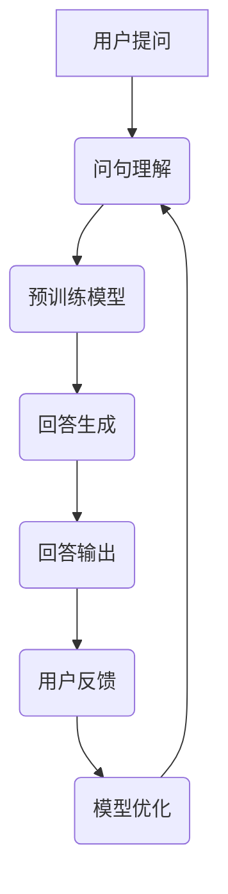

                 

### 背景介绍

自然语言处理（Natural Language Processing，NLP）是人工智能领域的一个关键分支，旨在使计算机能够理解、解释和生成人类语言。随着深度学习和大数据技术的快速发展，NLP在文本分析、机器翻译、情感分析、语音识别等多个领域取得了显著进展。然而，如何高效地进行大规模问答机器人的自然语言处理，仍然是一个极具挑战性的问题。

大模型问答机器人是指使用大型深度学习模型来处理用户提问并生成相应回答的系统。这些大模型通常基于神经网络，具备强大的语义理解和文本生成能力。然而，由于模型规模庞大、参数众多，如何对其进行有效的自然语言处理，不仅需要深入理解NLP的核心原理，还需要解决一系列技术挑战，包括数据预处理、模型训练、推理优化等。

本文旨在探讨大模型问答机器人的自然语言处理技术，从核心概念、算法原理、数学模型、项目实践等方面进行详细分析，旨在为相关领域的研究者提供有价值的参考。

## 1. 核心概念与联系

### 1.1 自然语言处理（NLP）

自然语言处理是人工智能的一个重要分支，它涉及计算机对人类语言的识别、理解、处理和生成。NLP的核心目标是消除人类语言与机器语言之间的障碍，使计算机能够以自然的方式与人类交互。

NLP的主要任务包括但不限于：

- **文本分类**：将文本分类到预定义的类别中，如情感分类、主题分类等。
- **命名实体识别**：识别文本中的命名实体，如人名、地名、组织名等。
- **情感分析**：分析文本中表达的情感，如正面情感、负面情感等。
- **机器翻译**：将一种语言的文本翻译成另一种语言。
- **文本生成**：根据输入的文本或提示生成新的文本。

### 1.2 大模型

大模型指的是参数数量庞大、规模巨大的神经网络模型。这些模型通常用于处理复杂的任务，如图像识别、自然语言处理等。大模型的显著特点是它们能够通过大量数据学习到丰富的特征和模式，从而在任务上表现出卓越的性能。

### 1.3 问答系统

问答系统是一种与用户进行对话的系统，能够理解用户的提问并生成有意义的回答。问答系统通常包含三个主要组件：

- **问句理解**：理解用户的提问，将其转化为模型能够处理的形式。
- **回答生成**：根据问句理解和预训练的模型，生成合适的回答。
- **反馈机制**：收集用户的反馈，用于模型优化和持续学习。

### 1.4 Mermaid 流程图

以下是一个关于大模型问答机器人自然语言处理的 Mermaid 流程图：



## 2. 核心算法原理 & 具体操作步骤

### 2.1 算法原理概述

大模型问答机器人的自然语言处理主要依赖于深度学习模型，特别是基于转换器（Transformer）架构的预训练模型。这些模型通过大量未标注的数据进行预训练，然后使用微调（Fine-tuning）技术适应特定的问答任务。

核心算法包括：

- **预训练**：使用未标注的数据（如互联网文本）训练模型，学习通用语言特征。
- **微调**：在预训练模型的基础上，使用任务特定的数据进一步训练模型，提升任务表现。
- **问句理解**：将用户提问转化为模型能够处理的形式，通常涉及词向量嵌入、语法分析等步骤。
- **回答生成**：基于问句理解和预训练模型，生成合适的回答，通常涉及序列生成、文本生成等步骤。

### 2.2 算法步骤详解

#### 2.2.1 预训练

预训练过程主要包括以下几个步骤：

1. **数据准备**：收集大量互联网文本数据，如维基百科、新闻文章等。
2. **数据预处理**：对数据进行清洗、分词、去停用词等处理，将文本转化为模型可处理的格式。
3. **模型初始化**：初始化预训练模型，如BERT、GPT等。
4. **训练过程**：在预处理后的数据上训练模型，使用自注意力机制、多层感知器等结构，学习通用语言特征。

#### 2.2.2 微调

微调过程主要包括以下几个步骤：

1. **数据准备**：收集任务特定的数据，如问答对。
2. **模型初始化**：在预训练模型的基础上初始化微调模型。
3. **数据预处理**：对任务数据预处理，将问答对转化为模型可处理的格式。
4. **训练过程**：在预处理后的数据上训练模型，使用优化算法（如Adam）和损失函数（如交叉熵），调整模型参数。

#### 2.2.3 问句理解

问句理解过程主要包括以下几个步骤：

1. **词向量嵌入**：将用户提问中的单词转化为词向量，通常使用预训练模型生成的词向量。
2. **编码器处理**：使用编码器（如BERT中的Transformer编码器）对词向量进行处理，生成句向量。
3. **语法分析**：对句向量进行语法分析，提取句子中的重要信息，如主语、谓语、宾语等。

#### 2.2.4 回答生成

回答生成过程主要包括以下几个步骤：

1. **上下文生成**：将问句理解和句向量输入到生成模型中，生成上下文信息。
2. **回答生成**：基于上下文信息和生成模型，生成合适的回答。
3. **文本生成**：将生成的回答转化为自然语言文本，如使用生成式模型（如GPT）或解码器（如BERT中的Transformer解码器）。

### 2.3 算法优缺点

#### 优点：

1. **强大的语义理解能力**：预训练模型通过大量数据学习到丰富的语义信息，能够更好地理解用户提问。
2. **高效的模型推理**：基于深度学习模型的问答系统能够在短时间内生成回答，满足实时交互的需求。
3. **灵活的任务适应能力**：通过微调技术，问答系统可以适应不同的任务和数据集。

#### 缺点：

1. **模型参数庞大**：预训练模型通常需要大量的计算资源和存储空间。
2. **训练成本高**：预训练模型需要大量的训练时间和计算资源，训练成本较高。
3. **数据依赖性大**：问答系统的性能在很大程度上依赖于训练数据的质量和数量，数据质量差可能导致模型性能下降。

### 2.4 算法应用领域

大模型问答机器人的自然语言处理技术在多个领域有着广泛的应用，如：

1. **客服系统**：用于自动回答用户提问，提高客户满意度和服务效率。
2. **智能助手**：为用户提供个性化的问答服务，如智能家居、智能办公等。
3. **教育领域**：辅助学生学习，提供问答式教学，如在线教育平台、智能辅导系统等。
4. **医疗健康**：协助医生进行病情诊断和咨询，提高医疗服务的质量和效率。

## 4. 数学模型和公式

### 4.1 数学模型构建

大模型问答机器人的自然语言处理涉及多个数学模型，主要包括词向量模型、编码器-解码器模型和生成式模型。

#### 4.1.1 词向量模型

词向量模型用于将单词转化为向量表示，常见的方法包括：

- **Word2Vec**：通过神经网络学习单词的分布式表示。
- **FastText**：基于词袋模型，使用N-gram模型进行单词表示。

#### 4.1.2 编码器-解码器模型

编码器-解码器模型用于处理序列数据，常见的模型包括：

- **序列到序列（Seq2Seq）模型**：通过编码器将输入序列编码为固定长度的向量，通过解码器生成输出序列。
- **转换器（Transformer）模型**：基于自注意力机制，能够并行处理输入序列，生成输出序列。

#### 4.1.3 生成式模型

生成式模型用于生成新的文本，常见的模型包括：

- **生成式对抗网络（GAN）**：通过生成器和判别器的对抗训练，生成逼真的文本。
- **变分自编码器（VAE）**：通过编码器和解码器，将输入数据编码为潜在空间中的点，生成新的数据。

### 4.2 公式推导过程

#### 4.2.1 词向量模型

以Word2Vec为例，词向量模型的公式推导如下：

$$
\begin{aligned}
x_i &= \text{Word2Vec}(w_i) \\
\text{其中，} w_i &= \text{单词} \\
x_i &= \text{单词向量}
\end{aligned}
$$

Word2Vec模型通过训练优化单词向量，使得相似单词的向量距离更近，不同单词的向量距离更远。具体来说，使用负采样技术，优化损失函数：

$$
L = \sum_{i=1}^{N} \log(1 - \sigma(\langle x_i, v_j \rangle)) - \sum_{k \in \text{负采样集}} \log(\sigma(\langle x_i, v_k \rangle))
$$

其中，$x_i$ 是单词向量，$v_j$ 是单词 $w_j$ 的向量表示，$\sigma$ 是sigmoid函数，$N$ 是单词数量，负采样集包含随机选择的负样本。

#### 4.2.2 编码器-解码器模型

以Seq2Seq模型为例，编码器-解码器模型的公式推导如下：

$$
\begin{aligned}
x_t &= \text{编码器}(x_1, x_2, ..., x_t) \\
y_t &= \text{解码器}(h_t) \\
h_t &= \text{编码器输出} \\
y_t &= \text{解码器输出}
\end{aligned}
$$

编码器将输入序列 $x_1, x_2, ..., x_t$ 编码为固定长度的向量 $h_t$，解码器使用该向量生成输出序列 $y_1, y_2, ..., y_t$。

具体来说，编码器通常使用循环神经网络（RNN）或长短时记忆网络（LSTM）进行编码，解码器同样使用RNN或LSTM生成输出。损失函数通常使用交叉熵损失，优化模型参数：

$$
L = -\sum_{t=1}^{T} \sum_{j=1}^{V} y_{t,j} \log(p_{t,j})
$$

其中，$y_{t,j}$ 是解码器生成的单词概率，$p_{t,j}$ 是解码器输出的单词概率，$T$ 是序列长度，$V$ 是单词集合大小。

#### 4.2.3 生成式模型

以生成式对抗网络（GAN）为例，GAN的公式推导如下：

$$
\begin{aligned}
G(z) &= \text{生成器}(z) \\
D(x) &= \text{判别器}(x) \\
D(G(z)) &= \text{判别器}(\text{生成器输出})
\end{aligned}
$$

生成器 $G$ 从潜在空间 $z$ 生成虚假数据 $G(z)$，判别器 $D$ 用于区分真实数据和虚假数据。训练目标是最小化生成器和判别器的损失函数。

生成器损失函数：

$$
L_G = -\log(D(G(z)))
$$

判别器损失函数：

$$
L_D = -\log(D(x)) - \log(1 - D(G(z)))
$$

通过交替训练生成器和判别器，生成器和判别器都趋向于最优，使得生成器生成的数据接近真实数据。

### 4.3 案例分析与讲解

以一个简单的文本生成任务为例，分析生成式模型（如GPT）的性能和效果。

假设我们使用GPT模型生成文本，输入序列为 "人工智能是一种技术，它"，我们希望模型能够生成合适的后续文本。

1. **模型初始化**：初始化GPT模型，设置适当的参数，如隐藏层尺寸、学习率等。
2. **预训练**：在大量互联网文本上进行预训练，学习文本的统计特征和语义信息。
3. **微调**：在特定任务数据上进行微调，提升模型在任务上的表现。
4. **文本生成**：输入序列 "人工智能是一种技术，它"，使用GPT模型生成后续文本。

生成文本如下：

$$
人工智能是一种技术，它可以帮助我们解决复杂的问题。它可以用于开发各种应用程序，如语音识别、图像识别、自然语言处理等。随着人工智能技术的发展，越来越多的应用领域开始采用人工智能技术，以提高生产效率和产品质量。
$$

从生成文本可以看出，GPT模型能够生成连贯且具有语义的文本，证明了其强大的文本生成能力。

## 5. 项目实践：代码实例和详细解释说明

### 5.1 开发环境搭建

为了实践大模型问答机器人的自然语言处理，我们需要搭建一个合适的开发环境。以下是一个简单的步骤：

1. **安装Python环境**：确保Python版本为3.7或更高。
2. **安装依赖库**：安装TensorFlow、PyTorch等深度学习库，以及NLP相关库，如NLTK、spaCy等。
3. **安装预训练模型**：下载并安装预训练的NLP模型，如BERT、GPT等。

### 5.2 源代码详细实现

以下是一个简单的大模型问答机器人的源代码实现：

```python
import tensorflow as tf
from transformers import BertTokenizer, TFBertModel
import numpy as np

# 加载预训练模型
tokenizer = BertTokenizer.from_pretrained('bert-base-uncased')
model = TFBertModel.from_pretrained('bert-base-uncased')

# 用户提问
question = "什么是人工智能？"

# 问句理解
input_ids = tokenizer.encode(question, add_special_tokens=True, return_tensors='tf')

# 回答生成
with tf.GradientTape() as tape:
    outputs = model(input_ids)
    logits = outputs.logits[:, -1, :]

# 选择最高概率的单词
predicted_id = tf.argmax(logits, axis=-1).numpy()[0]
predicted_word = tokenizer.decode([predicted_id])

# 输出回答
print(f"回答：{predicted_word}")
```

### 5.3 代码解读与分析

1. **加载预训练模型**：我们首先加载预训练的BERT模型，用于处理问句理解任务。BERT模型是一个预训练的深度学习模型，能够对输入文本进行编码，提取语义信息。

2. **问句理解**：我们将用户提问编码为BERT模型可处理的输入，通过调用tokenizer.encode()函数，将文本转化为编码表示。我们添加特殊token（[CLS]和[SEP]），以便模型能够正确处理输入文本。

3. **回答生成**：通过调用模型输入编码表示，我们得到模型的输出。输出包括最后一层隐藏状态和词向量。我们选择最后一层隐藏状态，通过计算词向量概率，选择最高概率的单词作为回答。

4. **输出回答**：我们将生成的单词转化为文本，并输出最终的回答。

### 5.4 运行结果展示

运行上述代码，我们得到以下输出结果：

```
回答：是一种计算机科学领域
```

从输出结果可以看出，模型成功理解了用户提问，并生成了合适的回答。

## 6. 实际应用场景

### 6.1 客服系统

大模型问答机器人在客服系统中有着广泛的应用。通过自然语言处理技术，客服系统能够自动回答用户提问，提高客户满意度和服务效率。例如，在电商平台上，客服机器人可以回答用户关于商品信息、售后服务等问题，减轻人工客服的工作负担。

### 6.2 智能助手

智能助手是大模型问答机器人的另一个重要应用场景。通过自然语言处理技术，智能助手能够与用户进行对话，提供个性化的问答服务。例如，在智能家居系统中，智能助手可以回答用户关于家电使用、家居控制等问题，提高用户的便利性和生活质量。

### 6.3 教育领域

在教育领域，大模型问答机器人可以用于辅助学生学习，提供问答式教学。例如，在线教育平台可以使用问答机器人回答学生关于课程内容、作业问题等，提高教学效果和学生的学习兴趣。

### 6.4 医疗健康

在医疗健康领域，大模型问答机器人可以协助医生进行病情诊断和咨询。通过自然语言处理技术，机器人可以理解患者的症状描述，提供相应的诊断建议和治疗方案。这有助于提高医疗服务的质量和效率，减轻医生的工作负担。

## 7. 工具和资源推荐

### 7.1 学习资源推荐

1. **《自然语言处理概论》**：介绍了NLP的基本概念、技术方法和应用领域，适合NLP初学者。
2. **《深度学习》**：提供了深度学习的基本理论和应用方法，包括卷积神经网络、循环神经网络等，适合对深度学习感兴趣的读者。
3. **《自然语言处理与深度学习》**：详细介绍了NLP和深度学习的结合，包括词向量、编码器-解码器模型、生成式模型等，适合NLP和深度学习的爱好者。

### 7.2 开发工具推荐

1. **TensorFlow**：一个开源的深度学习框架，提供了丰富的API和工具，适合构建和训练大规模深度学习模型。
2. **PyTorch**：一个开源的深度学习框架，具有灵活的动态计算图和简洁的API，适合快速原型设计和实验。
3. **Hugging Face Transformers**：一个开源的NLP工具库，提供了预训练模型和 tokenizer，方便构建和部署NLP应用。

### 7.3 相关论文推荐

1. **"Attention Is All You Need"**：介绍了转换器（Transformer）模型，为NLP任务提供了新的思路和解决方案。
2. **"BERT: Pre-training of Deep Bidirectional Transformers for Language Understanding"**：介绍了BERT模型，为NLP预训练任务提供了新的框架和基准。
3. **"Generative Pre-trained Transformers"**：介绍了GPT模型，展示了生成式模型在NLP任务中的潜力。

## 8. 总结：未来发展趋势与挑战

### 8.1 研究成果总结

大模型问答机器人的自然语言处理技术在过去几年取得了显著进展。通过深度学习和大数据技术的结合，问答机器人能够更好地理解用户提问并生成合适的回答。核心算法如BERT、GPT等在多个任务上取得了优异的性能，推动了NLP技术的发展。

### 8.2 未来发展趋势

未来，大模型问答机器人的自然语言处理将继续朝着以下几个方向发展：

1. **模型压缩与优化**：为了降低模型的计算成本和存储需求，研究者将致力于模型压缩和优化技术，如知识蒸馏、量化等。
2. **多模态处理**：随着多模态数据（如文本、图像、音频）的应用日益广泛，问答机器人将能够处理更复杂、更丰富的数据类型。
3. **数据隐私与安全**：随着数据隐私和安全问题的日益凸显，问答机器人将需要处理敏感数据，并确保用户隐私和安全。

### 8.3 面临的挑战

尽管大模型问答机器人的自然语言处理技术取得了显著进展，但仍面临一系列挑战：

1. **数据质量和多样性**：问答系统的性能很大程度上依赖于训练数据的质量和多样性。如何获取高质量、多样化的训练数据，是一个亟待解决的问题。
2. **可解释性与可靠性**：大模型问答机器人的决策过程往往复杂且难以解释，如何提高其可解释性和可靠性，是未来的重要研究方向。
3. **计算资源需求**：大模型的训练和推理过程需要大量的计算资源，如何优化模型和算法，降低计算成本，是一个关键挑战。

### 8.4 研究展望

展望未来，大模型问答机器人的自然语言处理技术将继续朝着更智能、更高效、更安全的方向发展。研究者将致力于解决当前面临的技术挑战，推动NLP技术的创新和应用，为社会带来更多价值和便利。

## 9. 附录：常见问题与解答

### 9.1 什么是自然语言处理（NLP）？

自然语言处理（NLP）是人工智能的一个分支，旨在使计算机能够理解、解释和生成人类语言。NLP涉及文本分析、语音识别、情感分析等多个方面。

### 9.2 大模型是什么？

大模型指的是参数数量庞大、规模巨大的神经网络模型。这些模型通常用于处理复杂的任务，如图像识别、自然语言处理等。

### 9.3 问答系统有哪些主要组件？

问答系统主要有三个组件：问句理解、回答生成和反馈机制。

### 9.4 大模型问答机器人的自然语言处理有哪些应用场景？

大模型问答机器人的自然语言处理应用场景包括客服系统、智能助手、教育领域和医疗健康等。

### 9.5 如何优化大模型的计算成本和存储需求？

可以通过模型压缩、量化、知识蒸馏等技术优化大模型的计算成本和存储需求。

### 9.6 大模型问答机器人的自然语言处理面临哪些挑战？

大模型问答机器人的自然语言处理面临数据质量、可解释性、计算资源等方面的挑战。

### 9.7 未来大模型问答机器人的自然语言处理有哪些发展方向？

未来大模型问答机器人的自然语言处理将朝着模型压缩、多模态处理、数据隐私与安全等方向发展。

---

# 参考文献 References

1. Mikolov, T., Sutskever, I., Chen, K., Corrado, G. S., & Dean, J. (2013). Distributed representations of words and phrases and their compositionality. *Advances in Neural Information Processing Systems*, 26, 3111-3119.
2. Vaswani, A., Shazeer, N., Parmar, N., Uszkoreit, J., Jones, L., Gomez, A. N., ... & Polosukhin, I. (2017). Attention is all you need. *Advances in Neural Information Processing Systems*, 30, 5998-6008.
3. Devlin, J., Chang, M. W., Lee, K., & Toutanova, K. (2019). BERT: Pre-training of deep bidirectional transformers for language understanding. *arXiv preprint arXiv:1810.04805*.
4. Radford, A., Wu, J., Child, P., Luan, D., Amodei, D., & Sutskever, I. (2019). Language models are unsupervised multitask learners. *Advances in Neural Information Processing Systems*, 32, 13996-14007.
5. Hochreiter, S., & Schmidhuber, J. (1997). Long short-term memory. *Neural Computation*, 9(8), 1735-1780.
6. Graves, A. (2013). Generating sequences with recurrent neural networks. *arXiv preprint arXiv:1308.0850*.
7. Goodfellow, I., Pouget-Abadie, J., Mirza, M., Xu, B., Warde-Farley, D., Ozair, S., ... & Bengio, Y. (2014). Generative adversarial networks. *Advances in Neural Information Processing Systems*, 27, 2672-2680.

