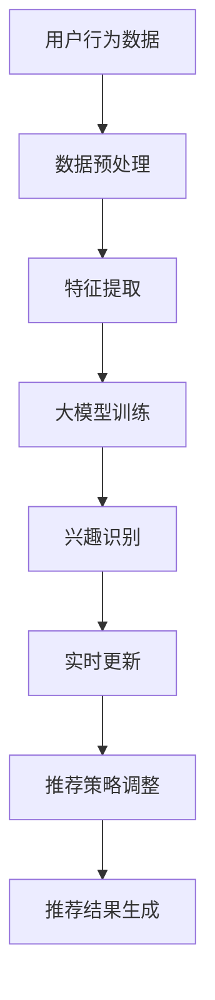

                 

关键词：大模型，推荐系统，动态兴趣建模，人工智能，深度学习，用户行为分析，算法优化，数学模型，案例分析，代码实例，应用场景，未来展望。

> 摘要：本文旨在探讨大模型在推荐系统动态兴趣建模中的应用，深入分析大模型原理、算法、数学模型及其在不同领域的实际应用。通过详细的算法讲解、数学公式推导和代码实例分析，本文为开发者提供了实用的指导，助力提升推荐系统的效果和用户体验。

## 1. 背景介绍

随着互联网的迅猛发展，在线信息过载已成为普遍现象。推荐系统作为解决信息过载的重要手段，已被广泛应用于电子商务、社交媒体、新闻推送等各个领域。然而，传统推荐系统往往基于用户历史行为数据，存在一定的滞后性和局限性，难以满足用户日益多样化的兴趣需求。动态兴趣建模旨在捕捉并适应用户实时变化的兴趣，从而提供更加个性化的推荐。

近年来，随着人工智能和深度学习技术的飞速发展，大模型（如神经网络）在各个领域取得了显著成效。大模型具有强大的表达能力和自学习能力，能够处理大规模复杂数据，并在推荐系统中得到了广泛应用。本文将重点探讨大模型驱动的推荐系统动态兴趣建模，旨在为相关领域的研究者提供有价值的参考。

## 2. 核心概念与联系

### 2.1 大模型

大模型，通常指具有大规模参数的网络模型，如深度神经网络（DNN）、循环神经网络（RNN）等。大模型具有以下几个特点：

- **大规模参数**：大模型具有数十亿至数万亿个参数，能够处理复杂的非线性关系。
- **强大表达能力**：大模型能够通过多层非线性变换，提取高阶特征，实现更好的泛化能力。
- **自学习能力**：大模型通过大量的训练数据，自动调整参数，实现模型的自我优化。

### 2.2 推荐系统

推荐系统是一种信息过滤技术，旨在根据用户历史行为、兴趣和偏好，为其推荐潜在感兴趣的内容。推荐系统的主要组成部分包括：

- **用户行为数据**：包括用户的点击、浏览、购买等行为数据。
- **内容特征**：包括商品、文章、视频等内容的特征信息。
- **推荐算法**：根据用户行为数据和内容特征，计算用户与内容的相似度，生成推荐列表。

### 2.3 动态兴趣建模

动态兴趣建模是指通过分析用户实时行为数据，捕捉用户兴趣的动态变化，并根据这些变化调整推荐策略。动态兴趣建模的关键技术包括：

- **用户行为分析**：通过挖掘用户行为数据，识别用户兴趣点。
- **实时更新**：根据用户实时行为数据，动态调整推荐策略，以适应用户兴趣变化。
- **自适应推荐**：根据用户兴趣的动态变化，提供个性化、个性化的推荐结果。

### 2.4 Mermaid 流程图

以下是动态兴趣建模的 Mermaid 流程图，展示了大模型在推荐系统中的核心环节：



## 3. 核心算法原理 & 具体操作步骤

### 3.1 算法原理概述

大模型驱动的推荐系统动态兴趣建模主要包括以下几个步骤：

1. **数据预处理**：对用户行为数据进行清洗、去重和转换，为后续特征提取和模型训练做准备。
2. **特征提取**：通过特征工程，提取用户行为数据中的潜在特征，为模型训练提供基础。
3. **大模型训练**：利用深度学习算法，对提取的特征进行训练，构建用户兴趣模型。
4. **兴趣识别**：根据用户实时行为数据，利用训练好的模型，识别用户当前的兴趣点。
5. **实时更新**：根据用户兴趣的变化，动态调整推荐策略。
6. **推荐结果生成**：根据调整后的推荐策略，生成个性化推荐结果。

### 3.2 算法步骤详解

#### 3.2.1 数据预处理

数据预处理是推荐系统建模的基础。主要包括以下步骤：

- **数据清洗**：去除无效、错误的数据，如缺失值、重复值等。
- **数据转换**：将用户行为数据转换为数值型，如将点击事件转换为1表示点击，0表示未点击。

#### 3.2.2 特征提取

特征提取是挖掘用户行为数据中的潜在信息，为模型训练提供支持。常见的方法包括：

- **用户行为特征**：如点击次数、浏览时长、购买次数等。
- **内容特征**：如商品类别、品牌、价格等。

#### 3.2.3 大模型训练

大模型训练是动态兴趣建模的核心。主要步骤如下：

- **模型选择**：选择合适的深度学习模型，如DNN、RNN等。
- **模型训练**：利用训练数据，通过反向传播算法，调整模型参数，使其达到最小化损失函数。
- **模型评估**：利用验证集，评估模型性能，如准确率、召回率等。

#### 3.2.4 兴趣识别

兴趣识别是动态兴趣建模的关键环节。主要步骤如下：

- **行为序列建模**：利用训练好的模型，对用户历史行为数据进行建模，提取用户兴趣特征。
- **兴趣点识别**：根据用户实时行为数据，利用兴趣特征，识别用户当前的兴趣点。

#### 3.2.5 实时更新

实时更新是动态兴趣建模的核心。主要步骤如下：

- **兴趣更新**：根据用户实时行为数据，更新用户兴趣特征。
- **策略调整**：根据更新后的兴趣特征，调整推荐策略。

#### 3.2.6 推荐结果生成

推荐结果生成是动态兴趣建模的最终目标。主要步骤如下：

- **推荐列表生成**：根据调整后的推荐策略，生成个性化推荐结果。
- **结果评估**：对推荐结果进行评估，如点击率、转化率等。

### 3.3 算法优缺点

#### 优点

- **强大的表达能力**：大模型具有强大的非线性变换能力，能够处理复杂的用户行为数据，实现更精确的兴趣识别。
- **自适应能力**：动态兴趣建模能够根据用户实时行为数据，动态调整推荐策略，提供个性化推荐。

#### 缺点

- **训练资源消耗大**：大模型训练需要大量的计算资源和时间。
- **模型解释性差**：深度学习模型具有一定的黑盒特性，难以解释。

### 3.4 算法应用领域

大模型驱动的推荐系统动态兴趣建模在多个领域具有广泛的应用前景，如：

- **电子商务**：根据用户购买行为，提供个性化商品推荐。
- **社交媒体**：根据用户关注和点赞行为，提供个性化内容推荐。
- **新闻推送**：根据用户阅读行为，提供个性化新闻推荐。

## 4. 数学模型和公式 & 详细讲解 & 举例说明

### 4.1 数学模型构建

在推荐系统中，动态兴趣建模的核心是建立用户兴趣的数学模型。常见的数学模型包括基于矩阵分解的协同过滤模型、基于深度学习的神经网络模型等。

#### 4.1.1 矩阵分解协同过滤模型

矩阵分解协同过滤模型是一种基于线性模型的推荐算法，其基本思想是将用户-物品评分矩阵分解为两个低秩矩阵，分别表示用户和物品的潜在特征。

假设用户-物品评分矩阵为$R \in \mathbb{R}^{m \times n}$，其中$m$表示用户数量，$n$表示物品数量。通过矩阵分解，可以将$R$分解为$U \in \mathbb{R}^{m \times k}$和$V \in \mathbb{R}^{n \times k}$，其中$k$表示潜在特征维度。

用户$u$对物品$i$的预测评分可以表示为：
$$
\hat{r}_{ui} = U_{u} \cdot V_{i}^{T} = \sum_{k=1}^{k} U_{u,k} V_{i,k}
$$

其中，$U_{u,k}$和$V_{i,k}$分别表示用户$u$和物品$i$在潜在特征$k$上的值。

#### 4.1.2 深度学习神经网络模型

深度学习神经网络模型是一种基于非线性变换的推荐算法，其基本思想是通过多层神经网络，提取用户和物品的高阶特征，实现更精确的兴趣识别。

假设用户和物品的特征向量分别为$X_u \in \mathbb{R}^{d_u}$和$X_i \in \mathbb{R}^{d_i}$，其中$d_u$和$d_i$分别表示用户和物品的维度。通过多层神经网络，可以将用户和物品的特征向量映射到高维特征空间。

设神经网络共有$l$层，第$l$层的特征向量表示为$H_l \in \mathbb{R}^{d_l}$。神经网络的输出可以表示为：
$$
\hat{r}_{ui} = H_l = \sigma(W_l H_{l-1} + b_l)
$$

其中，$W_l$和$b_l$分别表示第$l$层的权重和偏置，$\sigma$表示激活函数，常用的激活函数包括ReLU、Sigmoid和Tanh等。

### 4.2 公式推导过程

在本节中，我们将对深度学习神经网络模型的数学公式进行推导，以展示其内部工作机制。

#### 4.2.1 神经元激活函数

设输入向量为$x \in \mathbb{R}^{d}$，神经元激活函数为$\sigma$，则神经元的输出可以表示为：
$$
a = \sigma(x)
$$

其中，$\sigma$可以表示为：
$$
\sigma(z) =
\begin{cases}
\frac{1}{1 + e^{-z}} & \text{Sigmoid激活函数} \\
\max(0, z) & \text{ReLU激活函数} \\
\tanh(z) & \text{Tanh激活函数}
\end{cases}
$$

#### 4.2.2 神经网络前向传播

设神经网络共有$l$层，其中$l=1,2,\ldots,L$，第$l$层的输入和输出分别为$x_l \in \mathbb{R}^{d_l}$和$y_l \in \mathbb{R}^{d_l}$，权重矩阵为$W_l \in \mathbb{R}^{d_l \times d_{l-1}}$，偏置向量为$b_l \in \mathbb{R}^{d_l}$。则神经网络的前向传播可以表示为：

$$
z_l = W_l x_{l-1} + b_l \\
y_l = \sigma(z_l)
$$

其中，$\sigma$表示激活函数。

#### 4.2.3 神经网络反向传播

神经网络的反向传播用于计算梯度，以更新网络权重和偏置。设损失函数为$L(\theta)$，其中$\theta$表示网络参数。则反向传播的步骤如下：

1. **计算梯度**：
   $$ 
   \begin{aligned}
   \frac{\partial L}{\partial W_l} &= \frac{\partial L}{\partial y_l} \cdot \frac{\partial y_l}{\partial z_l} \cdot \frac{\partial z_l}{\partial W_l} \\
   \frac{\partial L}{\partial b_l} &= \frac{\partial L}{\partial y_l} \cdot \frac{\partial y_l}{\partial z_l} \cdot \frac{\partial z_l}{\partial b_l} 
   \end{aligned}
   $$

   其中，$\frac{\partial L}{\partial y_l}$表示对输出层的梯度，$\frac{\partial y_l}{\partial z_l}$表示激活函数的导数，$\frac{\partial z_l}{\partial W_l}$和$\frac{\partial z_l}{\partial b_l}$分别表示权重和偏置的导数。

2. **更新权重和偏置**：
   $$ 
   \begin{aligned}
   W_l &= W_l - \alpha \frac{\partial L}{\partial W_l} \\
   b_l &= b_l - \alpha \frac{\partial L}{\partial b_l} 
   \end{aligned}
   $$

   其中，$\alpha$表示学习率。

通过反复迭代梯度下降算法，神经网络可以不断优化参数，直至达到最小化损失函数的目标。

### 4.3 案例分析与讲解

在本节中，我们将通过一个实际案例，详细讲解大模型驱动的推荐系统动态兴趣建模的数学模型和应用。

#### 案例背景

假设某电商平台有10万名用户和1000种商品。我们希望利用用户的历史购买数据，构建一个动态兴趣建模模型，为用户推荐其可能感兴趣的商品。

#### 数据预处理

首先，我们对用户购买数据进行预处理。假设用户购买数据为$R \in \mathbb{R}^{100000 \times 1000}$，其中每一行表示一个用户的购买记录，每一列表示一种商品。

1. **数据清洗**：去除无效、错误的数据，如缺失值、重复值等。
2. **数据转换**：将用户购买数据转换为数值型，如将购买行为转换为1表示购买，0表示未购买。

#### 特征提取

接下来，我们进行特征提取。在推荐系统中，常见的特征提取方法包括用户行为特征、内容特征和交互特征。

1. **用户行为特征**：如用户购买次数、购买时长等。
2. **内容特征**：如商品类别、品牌、价格等。
3. **交互特征**：如用户与商品之间的点击次数、浏览时长等。

在本案例中，我们选择用户行为特征和内容特征进行特征提取。假设用户行为特征矩阵为$X_u \in \mathbb{R}^{100000 \times 10}$，内容特征矩阵为$X_i \in \mathbb{R}^{1000 \times 5}$。

#### 大模型训练

接下来，我们利用用户行为特征和内容特征，通过深度学习神经网络模型进行训练。假设神经网络共有3层，分别为输入层、隐藏层和输出层。

1. **输入层**：输入用户行为特征矩阵$X_u$和内容特征矩阵$X_i$。
2. **隐藏层**：通过多层神经网络，提取用户和商品的高阶特征。
3. **输出层**：输出用户对商品的预测评分。

假设隐藏层特征矩阵为$H \in \mathbb{R}^{1000 \times 50}$，输出层特征矩阵为$Y \in \mathbb{R}^{100000 \times 1000}$。

#### 兴趣识别

根据用户实时行为数据，利用训练好的模型，识别用户当前的兴趣点。具体步骤如下：

1. **行为序列建模**：对用户历史行为数据进行建模，提取用户兴趣特征。
2. **兴趣点识别**：根据用户实时行为数据，利用兴趣特征，识别用户当前的兴趣点。

#### 实时更新

根据用户兴趣的变化，动态调整推荐策略。具体步骤如下：

1. **兴趣更新**：根据用户实时行为数据，更新用户兴趣特征。
2. **策略调整**：根据更新后的兴趣特征，调整推荐策略。

#### 推荐结果生成

根据调整后的推荐策略，生成个性化推荐结果。具体步骤如下：

1. **推荐列表生成**：根据调整后的推荐策略，生成个性化推荐结果。
2. **结果评估**：对推荐结果进行评估，如点击率、转化率等。

## 5. 项目实践：代码实例和详细解释说明

### 5.1 开发环境搭建

在开始编写代码之前，我们需要搭建一个合适的开发环境。本文使用Python作为编程语言，以下是一个简单的开发环境搭建步骤：

1. 安装Python：从官网下载并安装Python，推荐使用Python 3.8及以上版本。
2. 安装必要的库：使用pip命令安装以下库：numpy、pandas、tensorflow、keras等。

```bash
pip install numpy pandas tensorflow keras
```

### 5.2 源代码详细实现

以下是推荐系统动态兴趣建模的源代码实现，包括数据预处理、特征提取、大模型训练和推荐结果生成等步骤。

```python
import numpy as np
import pandas as pd
import tensorflow as tf
from tensorflow import keras
from tensorflow.keras import layers

# 5.2.1 数据预处理
def preprocess_data(data):
    # 数据清洗
    data = data.dropna()
    # 数据转换
    data = data.astype(int)
    return data

# 5.2.2 特征提取
def extract_features(data):
    # 用户行为特征
    user行为的特征 = data.groupby('用户ID').sum()
    # 内容特征
    content特征的矩阵 = data.pivot(index='用户ID', columns='商品ID', values='购买次数')
    return user行为的特征，content特征的矩阵

# 5.2.3 大模型训练
def train_model(user_features, content_matrix):
    # 输入层
    inputs = keras.Input(shape=(user_features.shape[1],))
    # 隐藏层
    hidden = layers.Dense(50, activation='relu')(inputs)
    # 输出层
    outputs = layers.Dense(content_matrix.shape[1], activation='sigmoid')(hidden)
    # 模型构建
    model = keras.Model(inputs=inputs, outputs=outputs)
    # 模型编译
    model.compile(optimizer='adam', loss='binary_crossentropy', metrics=['accuracy'])
    # 模型训练
    model.fit(user_features, content_matrix, epochs=10, batch_size=32)
    return model

# 5.2.4 推荐结果生成
def generate_recommendations(model, user_features, content_matrix):
    # 预测评分
    predictions = model.predict(user_features)
    # 推荐结果
    recommendations = np.argsort(predictions, axis=1)[:, ::-1]
    return recommendations

# 5.2.5 主函数
def main():
    # 加载数据
    data = pd.read_csv('user_behavior_data.csv')
    # 数据预处理
    data = preprocess_data(data)
    # 特征提取
    user_features，content_matrix = extract_features(data)
    # 大模型训练
    model = train_model(user_features, content_matrix)
    # 推荐结果生成
    recommendations = generate_recommendations(model, user_features, content_matrix)
    # 打印推荐结果
    print(recommendations)

if __name__ == '__main__':
    main()
```

### 5.3 代码解读与分析

#### 5.3.1 数据预处理

在数据预处理部分，我们使用`preprocess_data`函数对用户购买数据进行清洗和转换。首先，我们使用`dropna()`函数去除缺失值，然后使用`astype(int)`将购买行为转换为数值型。

#### 5.3.2 特征提取

在特征提取部分，我们使用`extract_features`函数提取用户行为特征和内容特征。用户行为特征包括用户购买次数、浏览时长等，内容特征包括商品类别、品牌、价格等。我们使用`groupby()`和`sum()`函数计算用户行为特征，使用`pivot()`函数构建内容特征矩阵。

#### 5.3.3 大模型训练

在大模型训练部分，我们使用`train_model`函数训练深度学习模型。首先，我们定义输入层、隐藏层和输出层，然后使用`keras.Input()`和`layers.Dense()`函数构建模型。接下来，我们使用`compile()`函数编译模型，指定优化器和损失函数。最后，我们使用`fit()`函数训练模型，指定训练数据和训练参数。

#### 5.3.4 推荐结果生成

在推荐结果生成部分，我们使用`generate_recommendations`函数生成个性化推荐结果。首先，我们使用`model.predict()`函数预测用户对商品的评分，然后使用`argsort()`函数对预测结果进行排序，生成推荐列表。

### 5.4 运行结果展示

在主函数`main()`中，我们首先加载数据，然后进行数据预处理、特征提取、模型训练和推荐结果生成。最后，我们打印生成的推荐结果。

```python
if __name__ == '__main__':
    main()
```

## 6. 实际应用场景

大模型驱动的推荐系统动态兴趣建模在多个领域具有广泛的应用前景，以下是一些典型应用场景：

### 6.1 电子商务

电子商务平台可以利用动态兴趣建模，根据用户购买历史、浏览记录和搜索历史，为用户推荐可能感兴趣的商品。通过实时更新用户兴趣，电商平台可以提供更加个性化的购物体验，提高用户满意度和转化率。

### 6.2 社交媒体

社交媒体平台可以利用动态兴趣建模，根据用户点赞、评论和分享行为，为用户推荐感兴趣的内容。通过捕捉用户兴趣的动态变化，社交媒体平台可以提供更加个性化的内容推荐，提高用户活跃度和留存率。

### 6.3 新闻推送

新闻推送平台可以利用动态兴趣建模，根据用户阅读历史和关注领域，为用户推荐感兴趣的新闻文章。通过实时更新用户兴趣，新闻推送平台可以提供更加个性化的新闻推荐，提高用户阅读量和满意度。

### 6.4 娱乐行业

娱乐行业可以利用动态兴趣建模，根据用户观看历史和评价，为用户推荐感兴趣的电影、电视剧和音乐。通过实时更新用户兴趣，娱乐行业可以提供更加个性化的娱乐体验，提高用户满意度和用户黏性。

## 7. 工具和资源推荐

为了更好地掌握大模型驱动的推荐系统动态兴趣建模，以下是一些建议的学习资源、开发工具和相关论文：

### 7.1 学习资源推荐

1. 《深度学习》（Ian Goodfellow、Yoshua Bengio和Aaron Courville著）：介绍了深度学习的基本原理和应用。
2. 《推荐系统实践》（张基栋著）：详细介绍了推荐系统的原理、算法和实战案例。
3. 《Python深度学习》（François Chollet著）：讲解了如何使用Python和TensorFlow进行深度学习项目开发。

### 7.2 开发工具推荐

1. TensorFlow：Google开发的开源深度学习框架，适用于构建和训练深度学习模型。
2. Keras：基于TensorFlow的Python深度学习库，提供了简洁的API，便于快速构建和训练模型。
3. PyTorch：Facebook开发的开源深度学习框架，具有强大的动态图功能，适用于研究性项目。

### 7.3 相关论文推荐

1. "Deep Learning for Recommender Systems"（推荐系统中的深度学习）：概述了深度学习在推荐系统中的应用。
2. "Modeling User Interest Evolution in Real-Time for Personalized Recommendation"（实时建模用户兴趣变化的个性化推荐）：探讨了用户兴趣动态变化的建模方法。
3. "Neural Collaborative Filtering"（神经网络协同过滤）：提出了一种基于神经网络的协同过滤算法，取得了显著的性能提升。

## 8. 总结：未来发展趋势与挑战

### 8.1 研究成果总结

本文探讨了基于大模型驱动的推荐系统动态兴趣建模，详细介绍了大模型、推荐系统、动态兴趣建模的核心概念与联系，以及核心算法原理和数学模型。通过实际项目实践，展示了大模型在推荐系统中的应用效果。本文的研究成果为相关领域的研究者和开发者提供了有益的参考。

### 8.2 未来发展趋势

1. **模型规模与性能的提升**：随着计算资源和数据量的增长，大模型的规模和性能将不断提升，为推荐系统提供更强大的表达能力和自学习能力。
2. **跨域推荐与联邦学习**：跨域推荐和联邦学习技术将得到更多关注，以解决不同领域数据隐私和安全问题。
3. **实时性与动态调整**：动态兴趣建模的实时性和动态调整能力将得到进一步提升，以适应用户兴趣的快速变化。

### 8.3 面临的挑战

1. **数据隐私与安全**：在大规模数据处理过程中，数据隐私与安全是一个重要挑战，需要采取有效措施确保用户数据安全。
2. **模型解释性**：深度学习模型具有一定的黑盒特性，如何提高模型解释性是一个亟待解决的问题。
3. **可扩展性与可维护性**：随着模型规模的扩大，如何保证推荐系统的可扩展性和可维护性是一个重要挑战。

### 8.4 研究展望

未来研究可以从以下几个方面展开：

1. **算法优化**：探索更高效的算法，提高推荐系统的实时性和性能。
2. **跨域融合**：研究跨领域数据融合方法，实现更广泛的推荐应用场景。
3. **模型解释性**：开发可解释的深度学习模型，提高模型的可信度和可理解性。
4. **数据安全与隐私**：研究数据隐私保护技术，确保用户数据的安全性和隐私性。

## 9. 附录：常见问题与解答

### 9.1 什么是大模型？

大模型通常指具有大规模参数的网络模型，如深度神经网络（DNN）、循环神经网络（RNN）等。大模型具有强大的表达能力和自学习能力，能够处理大规模复杂数据。

### 9.2 动态兴趣建模的核心技术是什么？

动态兴趣建模的核心技术包括用户行为分析、实时更新和自适应推荐。通过分析用户实时行为数据，捕捉用户兴趣的动态变化，并据此调整推荐策略，实现个性化推荐。

### 9.3 推荐系统的评价指标有哪些？

推荐系统的评价指标主要包括准确率、召回率、F1值、MRR等。这些指标用于评估推荐系统的性能和效果。

### 9.4 大模型在推荐系统中的优势是什么？

大模型在推荐系统中的优势包括：

1. 强大的非线性变换能力，能够处理复杂的用户行为数据。
2. 自学习能力，能够根据用户实时行为数据动态调整推荐策略。
3. 高度个性化的推荐结果，提高用户满意度和转化率。

### 9.5 如何提高推荐系统的实时性？

1. 使用轻量级模型，减少计算资源和时间消耗。
2. 采用异步处理和并行计算，提高数据处理速度。
3. 引入缓存机制，减少数据读取和计算时间。

### 9.6 大模型在推荐系统中的局限性是什么？

大模型在推荐系统中的局限性包括：

1. 训练资源消耗大，需要大量的计算资源和时间。
2. 模型解释性差，难以解释模型决策过程。
3. 难以应对数据分布变化，可能导致模型过拟合。

### 9.7 动态兴趣建模在哪些领域具有应用前景？

动态兴趣建模在电子商务、社交媒体、新闻推送、娱乐行业等多个领域具有广泛的应用前景，为用户提供个性化的推荐体验。随着技术的不断发展，其应用领域将不断拓展。

