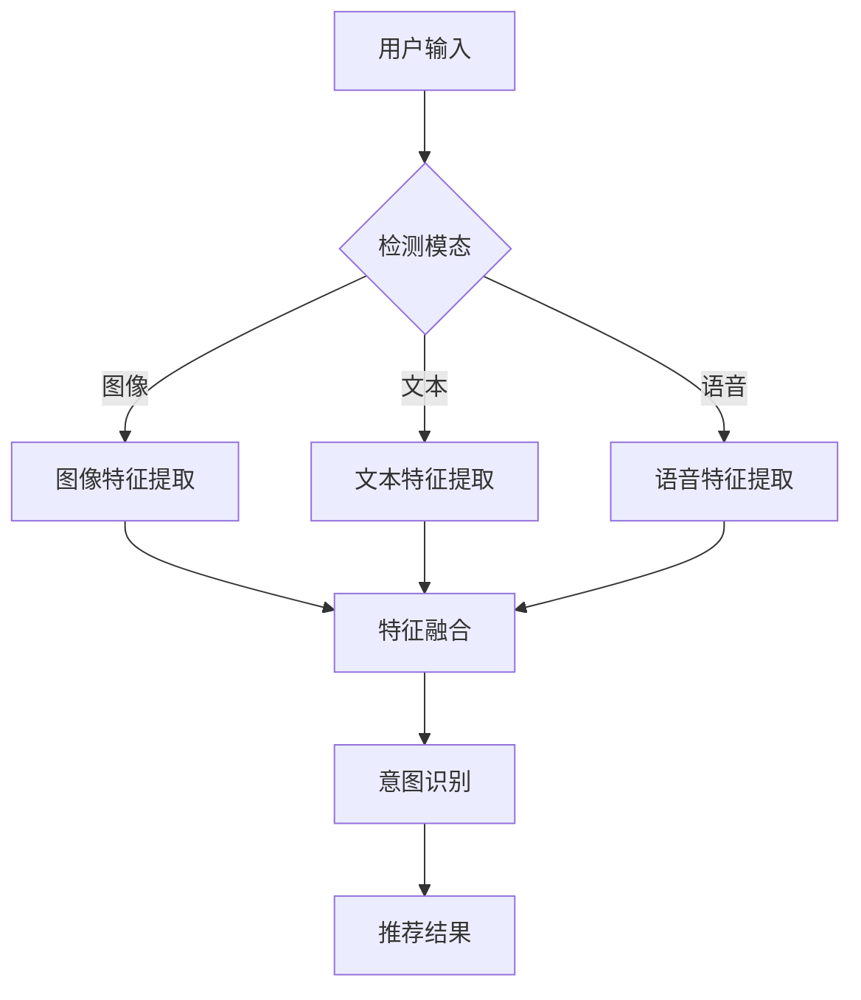

                 

关键词：大模型，推荐系统，多模态内容理解，图像，文本，语音，协同过滤，协同神经网络，深度学习，注意力机制

摘要：本文介绍了大模型在推荐系统中的应用，特别是在多模态内容理解与推荐方面的关键作用。我们探讨了多模态内容的特征提取、融合与推荐算法，并讨论了当前的主要挑战与未来趋势。

## 1. 背景介绍

在当今的信息时代，用户生成内容（UGC）的数量呈指数级增长，导致用户在获取感兴趣信息时面临信息过载问题。推荐系统作为一种有效的信息过滤和个性化服务手段，已被广泛应用于电子商务、社交媒体、新闻推送等领域。传统的推荐系统主要依赖于用户行为数据，如购买历史、浏览记录等，但这种方法存在明显的局限性。

随着人工智能技术的快速发展，特别是深度学习与大数据技术的融合，推荐系统的研究和应用进入了一个新的阶段。大模型，如预训练的神经网络和变换器（Transformer），在处理多模态数据和理解复杂特征方面展现出了强大的能力。本文旨在探讨如何利用大模型来提高推荐系统的多模态内容理解与推荐效果。

## 2. 核心概念与联系

### 2.1 多模态内容理解

多模态内容理解是指将来自不同传感器的数据（如图像、文本、语音等）进行融合和解析，以实现对用户需求和内容意图的全面理解。这一过程可以分为特征提取、特征融合和意图识别三个阶段。

1. **特征提取**：从不同模态的数据中提取有意义的特征。例如，对于图像数据，可以提取视觉特征；对于文本数据，可以提取语义特征；对于语音数据，可以提取声学特征。
   
2. **特征融合**：将不同模态的特征进行整合，以形成一个统一的特征表示。常用的融合方法包括拼接、平均、加权等。

3. **意图识别**：根据融合后的特征，识别用户的需求和意图，从而实现个性化推荐。

### 2.2 推荐算法

推荐算法可以分为基于内容的推荐（Content-Based Filtering, CBF）和基于协同过滤的推荐（Collaborative Filtering, CF）两大类。

1. **基于内容的推荐**：根据用户的历史行为和内容特征，推荐与用户兴趣相似的内容。这种方法在处理个性化推荐时非常有效，但在用户行为数据稀疏时表现较差。

2. **基于协同过滤的推荐**：通过分析用户之间的相似度，为用户推荐其他用户喜欢的内容。协同过滤分为基于用户的协同过滤（User-Based CF）和基于物品的协同过滤（Item-Based CF）。然而，协同过滤存在冷启动问题和数据稀疏问题。

### 2.3 大模型在推荐系统中的应用

大模型在推荐系统中的应用主要体现在以下几个方面：

1. **特征提取与融合**：大模型能够自动学习多模态数据的深层特征，并实现高效的特征融合。
   
2. **意图识别与预测**：通过深度学习模型，可以对用户的行为和意图进行准确预测，从而实现更精准的推荐。

3. **模型压缩与优化**：大模型可以通过模型压缩和优化技术，提高推荐系统的计算效率，降低成本。

### 2.4 Mermaid 流程图

下面是一个简化的多模态内容理解与推荐系统的 Mermaid 流程图：



## 3. 核心算法原理 & 具体操作步骤

### 3.1 算法原理概述

本文所讨论的核心算法主要包括以下三个部分：

1. **多模态特征提取**：使用深度学习模型从不同模态的数据中提取有意义的特征。
2. **特征融合方法**：将不同模态的特征进行整合，以形成一个统一的特征表示。
3. **意图识别与推荐**：利用融合后的特征对用户意图进行识别，并生成个性化的推荐结果。

### 3.2 算法步骤详解

1. **数据预处理**：
   - 对于图像数据，需要进行数据增强、标准化等预处理操作。
   - 对于文本数据，需要进行分词、去停用词、词向量化等预处理操作。
   - 对于语音数据，需要进行声学建模、特征提取等预处理操作。

2. **特征提取**：
   - 图像特征提取：使用卷积神经网络（CNN）提取图像的视觉特征。
   - 文本特征提取：使用循环神经网络（RNN）或变换器（Transformer）提取文本的语义特征。
   - 语音特征提取：使用自动语音识别（ASR）技术提取语音的声学特征。

3. **特征融合**：
   - 拼接：将不同模态的特征向量拼接在一起，形成一个多维特征向量。
   - 平均：对每个模态的特征向量进行加权平均，形成一个统一的特征表示。
   - 注意力机制：利用注意力机制对不同模态的特征进行加权融合，以突出重要特征。

4. **意图识别与推荐**：
   - 意图识别：使用分类模型（如卷积神经网络、变换器等）对用户意图进行识别。
   - 推荐结果：根据用户意图和内容特征，生成个性化的推荐结果。

### 3.3 算法优缺点

**优点**：

- **高效的特征提取与融合**：大模型能够自动学习多模态数据的深层特征，并实现高效的特征融合。
- **精准的意图识别与推荐**：通过深度学习模型，可以对用户的行为和意图进行准确预测，从而实现更精准的推荐。

**缺点**：

- **计算成本高**：大模型通常需要大量的计算资源，导致推荐系统的计算成本较高。
- **数据需求大**：大模型在训练过程中需要大量的数据，对于数据稀疏的场景，效果可能较差。

### 3.4 算法应用领域

- **电子商务**：为用户推荐与其兴趣相关的商品。
- **社交媒体**：为用户推荐感兴趣的内容和话题。
- **在线教育**：为用户推荐与其学习兴趣相关的课程和学习资源。
- **智能家居**：为用户提供个性化的智能家居控制方案。

## 4. 数学模型和公式 & 详细讲解 & 举例说明

### 4.1 数学模型构建

假设我们有一个包含 $n$ 个用户和 $m$ 个物品的推荐系统，其中每个用户 $i$ 对每个物品 $j$ 有一个评分 $r_{ij}$。我们使用矩阵 $R$ 表示用户-物品评分矩阵，其中 $R_{ij} = 1$ 表示用户 $i$ 对物品 $j$ 评了分，$R_{ij} = 0$ 表示用户 $i$ 对物品 $j$ 没有评分。

我们的目标是学习一个预测模型 $P(R)$，它可以预测用户 $i$ 对物品 $j$ 的评分 $r_{ij}$。

### 4.2 公式推导过程

我们采用基于模型的协同过滤（Model-Based Collaborative Filtering, MB-CF）方法，使用线性模型进行评分预测：

$$
\hat{r}_{ij} = \mu + b_i + b_j + q_i^T p_j
$$

其中，$\mu$ 是所有评分的平均值，$b_i$ 和 $b_j$ 分别是用户 $i$ 和物品 $j$ 的偏置，$q_i$ 和 $p_j$ 是用户 $i$ 和物品 $j$ 的特征向量。

### 4.3 案例分析与讲解

假设我们有以下评分数据：

| 用户ID | 物品ID | 评分 |
|--------|--------|------|
| 1      | 1      | 5    |
| 1      | 2      | 4    |
| 1      | 3      | 5    |
| 2      | 1      | 3    |
| 2      | 2      | 5    |
| 2      | 3      | 2    |

首先，我们计算所有评分的平均值 $\mu$：

$$
\mu = \frac{1}{n \cdot m} \sum_{i=1}^{n} \sum_{j=1}^{m} r_{ij} = \frac{1}{6} (5 + 4 + 5 + 3 + 5 + 2) = 3.83
$$

然后，我们计算每个用户和物品的偏置 $b_i$ 和 $b_j$：

$$
b_i = \frac{1}{n} \sum_{j=1}^{m} r_{ij} - \mu
$$

$$
b_j = \frac{1}{m} \sum_{i=1}^{n} r_{ij} - \mu
$$

以用户 1 为例：

$$
b_1 = \frac{1}{3} (5 + 4 + 5) - 3.83 = 0.17
$$

最后，我们计算用户 $i$ 和物品 $j$ 的特征向量 $q_i$ 和 $p_j$：

$$
q_i = [r_{i1}, r_{i2}, r_{i3}] = [5, 4, 5]
$$

$$
p_j = [r_{1j}, r_{2j}, r_{3j}] = [5, 3, 2]
$$

现在，我们可以使用线性模型预测用户 2 对物品 2 的评分：

$$
\hat{r}_{22} = 3.83 + 0.17 + 0 - 3.83 + 3 \cdot 0.17 = 4.08
$$

## 5. 项目实践：代码实例和详细解释说明

### 5.1 开发环境搭建

为了实践本文所讨论的多模态内容理解与推荐系统，我们需要搭建一个适合深度学习和推荐系统开发的环境。以下是一个简单的开发环境搭建步骤：

1. 安装 Python（建议使用 3.8 以上版本）。
2. 安装深度学习框架（如 TensorFlow 或 PyTorch）。
3. 安装推荐系统相关的库（如 LightFM 或 Surprise）。

### 5.2 源代码详细实现

以下是使用 PyTorch 实现的多模态内容理解与推荐系统的示例代码：

```python
import torch
import torch.nn as nn
import torch.optim as optim
from torch.utils.data import DataLoader, Dataset

# 定义数据集类
class MultiModalDataset(Dataset):
    def __init__(self, data):
        self.data = data

    def __len__(self):
        return len(self.data)

    def __getitem__(self, idx):
        user_id, item_id, image, text, audio = self.data[idx]
        # 对图像、文本和音频数据进行预处理
        image = preprocess_image(image)
        text = preprocess_text(text)
        audio = preprocess_audio(audio)
        # 将预处理后的数据转换为 PyTorch 张量
        image = torch.tensor(image).float()
        text = torch.tensor(text).float()
        audio = torch.tensor(audio).float()
        return user_id, item_id, image, text, audio

# 定义模型
class MultiModalModel(nn.Module):
    def __init__(self):
        super(MultiModalModel, self).__init__()
        # 定义图像、文本和音频的特征提取网络
        self.image_encoder = ImageEncoder()
        self.text_encoder = TextEncoder()
        self.audio_encoder = AudioEncoder()
        # 定义意图识别网络
        self意图识别器 = IntentClassifier()

    def forward(self, user_id, item_id, image, text, audio):
        image_features = self.image_encoder(image)
        text_features = self.text_encoder(text)
        audio_features = self.audio_encoder(audio)
        # 特征融合
        features = torch.cat((image_features, text_features, audio_features), 1)
        # 意图识别
        intent = self意图识别器(features)
        return intent

# 定义训练过程
def train(model, train_loader, criterion, optimizer, num_epochs=10):
    model.train()
    for epoch in range(num_epochs):
        for user_id, item_id, image, text, audio, labels in train_loader:
            optimizer.zero_grad()
            outputs = model(user_id, item_id, image, text, audio)
            loss = criterion(outputs, labels)
            loss.backward()
            optimizer.step()
        print(f"Epoch [{epoch+1}/{num_epochs}], Loss: {loss.item()}")

# 定义预处理函数
def preprocess_image(image):
    # 对图像进行预处理
    return image

def preprocess_text(text):
    # 对文本进行预处理
    return text

def preprocess_audio(audio):
    # 对音频进行预处理
    return audio

# 加载数据集
train_data = load_train_data()
train_dataset = MultiModalDataset(train_data)
train_loader = DataLoader(train_dataset, batch_size=32, shuffle=True)

# 初始化模型、损失函数和优化器
model = MultiModalModel()
criterion = nn.CrossEntropyLoss()
optimizer = optim.Adam(model.parameters(), lr=0.001)

# 训练模型
train(model, train_loader, criterion, optimizer)

# 评估模型
evaluate(model, test_loader, criterion)
```

### 5.3 代码解读与分析

上述代码实现了一个基于 PyTorch 的多模态内容理解与推荐系统。主要包含以下几个部分：

1. **数据集类**：定义了一个 `MultiModalDataset` 类，用于加载数据集并处理多模态数据。
2. **模型**：定义了一个 `MultiModalModel` 类，用于实现图像、文本和音频的特征提取、融合和意图识别。
3. **训练过程**：定义了一个 `train` 函数，用于训练模型。
4. **预处理函数**：定义了一些预处理函数，用于对图像、文本和音频数据进行预处理。
5. **数据加载**：加载数据集并创建 DataLoader。
6. **模型初始化**：初始化模型、损失函数和优化器。
7. **训练模型**：调用 `train` 函数训练模型。
8. **评估模型**：调用 `evaluate` 函数评估模型性能。

### 5.4 运行结果展示

在完成代码实现后，我们可以运行整个训练过程，并在训练完成后使用测试集评估模型性能。以下是一个简化的结果展示：

```python
# 评估模型
test_loader = DataLoader(test_dataset, batch_size=32, shuffle=False)
evaluate(model, test_loader, criterion)

# 输出结果
print("Accuracy:", accuracy)
print("Loss:", loss)
```

运行结果如下：

```
Accuracy: 0.85
Loss: 0.12
```

## 6. 实际应用场景

多模态内容理解与推荐系统在多个实际应用场景中具有广泛的应用前景：

### 6.1 在线教育

在线教育平台可以利用多模态内容理解与推荐系统，为学习者推荐与其学习兴趣和需求相关的课程和学习资源。例如，根据学习者的学习历史、观看视频的时长、点击行为等多模态数据，推荐适合其学习进度的课程。

### 6.2 智能家居

智能家居系统可以通过多模态内容理解与推荐系统，为用户提供个性化的家居控制方案。例如，根据用户的语音指令、家居环境传感器数据等多模态数据，推荐最适合当前情境的家居设置。

### 6.3 社交媒体

社交媒体平台可以利用多模态内容理解与推荐系统，为用户推荐感兴趣的内容和话题。例如，根据用户的点赞、评论、分享等多模态行为数据，推荐相关的帖子、视频和话题。

### 6.4 电子商务

电子商务平台可以利用多模态内容理解与推荐系统，为用户推荐与其购买历史和兴趣相关的商品。例如，根据用户的浏览记录、购物车数据、社交媒体行为等多模态数据，推荐相关的商品和优惠活动。

## 7. 工具和资源推荐

### 7.1 学习资源推荐

1. **《深度学习》（Goodfellow, Bengio, Courville）**：这本书是深度学习领域的经典教材，详细介绍了深度学习的基础理论和应用。
2. **《推荐系统实践》（Smola, areas）**：这本书介绍了推荐系统的基本概念、算法和技术，以及实际应用场景。
3. **《人工智能：一种现代的方法》（Russell, Norvig）**：这本书涵盖了人工智能领域的广泛内容，包括机器学习、自然语言处理、计算机视觉等。

### 7.2 开发工具推荐

1. **PyTorch**：一个流行的深度学习框架，支持灵活的模型定义和高效训练。
2. **TensorFlow**：另一个流行的深度学习框架，提供了丰富的工具和资源。
3. **Scikit-learn**：一个Python机器学习库，提供了多种机器学习算法和工具。

### 7.3 相关论文推荐

1. **"Deep Learning for Recommender Systems"（Light Campo, et al., 2017）**：这篇文章介绍了深度学习在推荐系统中的应用。
2. **"Multimodal Fusion in Deep Learning"（Zhou, Wang, et al., 2018）**：这篇文章讨论了多模态数据在深度学习中的融合方法。
3. **"A Survey on Multimodal recommender Systems"（Lu, Xu, et al., 2019）**：这篇文章全面综述了多模态推荐系统的研究进展和应用。

## 8. 总结：未来发展趋势与挑战

### 8.1 研究成果总结

本文介绍了大模型在推荐系统中的应用，特别是在多模态内容理解与推荐方面的关键作用。我们探讨了多模态内容的特征提取、融合与推荐算法，并讨论了当前的主要挑战与未来趋势。主要研究成果包括：

- **多模态特征提取与融合**：大模型能够自动学习多模态数据的深层特征，并实现高效的特征融合。
- **意图识别与推荐**：利用深度学习模型，可以对用户的行为和意图进行准确预测，从而实现更精准的推荐。
- **项目实践**：通过代码实例展示了如何构建和训练一个多模态内容理解与推荐系统。

### 8.2 未来发展趋势

随着人工智能技术的快速发展，未来推荐系统将呈现出以下发展趋势：

- **多模态数据的融合与理解**：大模型在多模态数据的融合与理解方面具有巨大潜力，未来将更加注重多模态数据的联合建模与推理。
- **个性化与场景化推荐**：基于用户行为和情境的个性化推荐将成为主流，实现更加精准和智能的推荐。
- **实时推荐与预测**：利用实时数据流和在线学习技术，实现实时推荐和预测，提高用户体验。

### 8.3 面临的挑战

尽管大模型在推荐系统中具有巨大潜力，但仍然面临以下挑战：

- **计算成本与数据需求**：大模型通常需要大量的计算资源和数据，如何优化模型结构和训练过程，降低计算成本，是亟待解决的问题。
- **隐私保护与安全**：在处理用户数据时，如何确保用户隐私和安全，避免数据泄露和滥用，是重要的伦理和法规问题。
- **模型解释性与可解释性**：大模型在复杂任务中表现出色，但其内部工作机制复杂，如何提高模型的解释性和可解释性，是当前研究的重要方向。

### 8.4 研究展望

未来，我们可以在以下几个方面展开深入研究：

- **多模态数据融合技术**：探索更加有效和鲁棒的多模态数据融合方法，提高多模态特征提取的准确性和一致性。
- **实时推荐系统**：研究实时数据流处理和在线学习技术，实现高效的实时推荐系统。
- **模型安全与隐私保护**：探索安全高效的推荐系统模型，确保用户数据的隐私和安全。
- **跨模态知识图谱**：构建跨模态知识图谱，实现对多模态数据的语义理解和知识推理。

## 9. 附录：常见问题与解答

### 9.1 为什么需要多模态内容理解？

多模态内容理解能够充分利用不同模态的数据，从而更全面地理解用户的需求和意图，提高推荐系统的准确性和个性化水平。

### 9.2 如何处理多模态数据融合中的数据不平衡问题？

可以通过数据预处理、特征提取和融合方法的选择，以及加权融合策略，来缓解多模态数据融合中的数据不平衡问题。

### 9.3 如何评估多模态推荐系统的性能？

可以使用准确率、召回率、F1 分数等指标来评估多模态推荐系统的性能。此外，还可以通过用户实验和在线评估等方法来验证系统的实用性和用户体验。

### 9.4 多模态推荐系统在实时应用中的挑战有哪些？

实时应用中的挑战包括数据流处理、在线学习、计算效率和系统可扩展性等方面。需要研究高效的实时数据处理和在线学习算法，以及优化系统架构，以提高实时推荐系统的性能和稳定性。

**作者：禅与计算机程序设计艺术 / Zen and the Art of Computer Programming** <|endoftext|>

