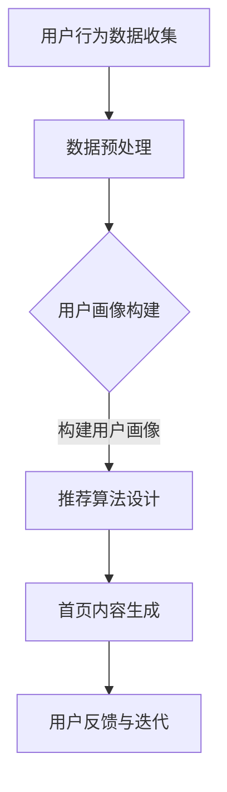
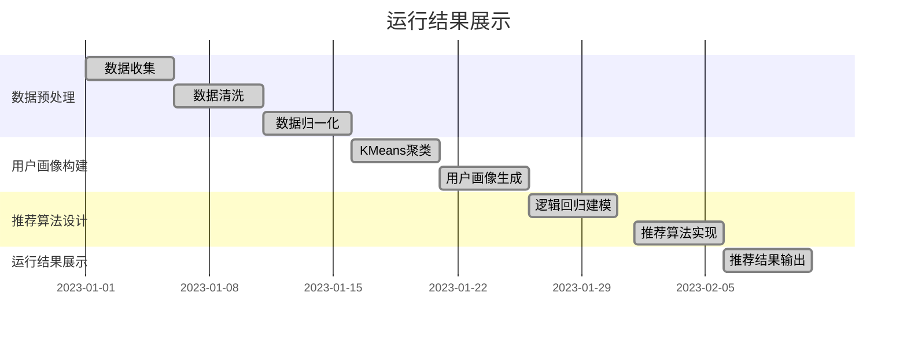

                 

关键词：大模型，电商平台，个性化，首页设计，AI，机器学习，深度学习，用户画像，推荐系统，算法优化

> 摘要：本文深入探讨了基于大模型驱动的电商平台个性化首页设计，通过构建用户画像和推荐算法，实现了为每位用户定制化推荐产品和服务。本文将详细阐述大模型在电商平台中的应用，包括用户画像的构建方法、推荐算法的设计与优化，以及未来发展趋势和挑战。

## 1. 背景介绍

随着互联网的快速发展，电商平台已经成为人们日常生活的重要组成部分。用户在电商平台上的消费行为日趋多样化和个性化，这给电商平台提出了更高的要求。如何为每位用户提供个性化的商品推荐和服务，成为了电商企业提升用户满意度、增加销售额的关键。

传统的推荐系统主要依赖于基于内容的推荐和协同过滤等方法，但这些方法往往存在推荐效果不佳、推荐结果单一等问题。随着人工智能技术的进步，尤其是大模型的广泛应用，基于大模型的个性化推荐系统逐渐成为电商领域的研究热点。

本文旨在探讨如何利用大模型实现电商平台的个性化首页设计，提高用户满意度和平台销售额。

## 2. 核心概念与联系

### 2.1. 大模型

大模型，通常指的是具有数亿甚至千亿参数的深度学习模型，如Transformer、BERT等。这些模型通过在海量数据上进行训练，可以捕捉到数据中的复杂模式和关系，从而实现强大的特征表示和学习能力。

### 2.2. 用户画像

用户画像是对用户行为和特征的全方位描述，包括用户的基本信息、浏览记录、购买历史、偏好设置等。用户画像的构建是个性化推荐系统的关键。

### 2.3. 推荐算法

推荐算法是指通过计算用户与商品之间的相似性，为用户推荐相关商品的方法。常见的推荐算法有基于内容的推荐、协同过滤和基于模型的推荐等。大模型的引入，使得基于模型的推荐算法得以在电商平台上实现更高水平的个性化推荐。

### 2.4. Mermaid 流程图



## 3. 核心算法原理 & 具体操作步骤

### 3.1. 算法原理概述

基于大模型的个性化首页设计，主要依赖于用户画像和推荐算法。用户画像通过分析用户行为数据，构建出用户的兴趣偏好模型；推荐算法则利用用户画像和商品特征，为用户推荐个性化的商品。

### 3.2. 算法步骤详解

1. **用户行为数据收集**：通过电商平台的后台日志、用户浏览记录、购买历史等数据，收集用户行为数据。

2. **数据预处理**：对收集到的用户行为数据进行清洗、去噪、归一化等处理，以确保数据的准确性和一致性。

3. **用户画像构建**：利用机器学习算法，对预处理后的数据进行分析，构建出用户的兴趣偏好模型。常见的机器学习算法有聚类算法、决策树、神经网络等。

4. **推荐算法设计**：根据用户画像和商品特征，设计推荐算法。常见的推荐算法有基于内容的推荐、协同过滤和基于模型的推荐等。大模型的引入，使得基于模型的推荐算法在电商平台上实现更高水平的个性化推荐。

5. **首页内容生成**：根据推荐算法的结果，为用户生成个性化的首页内容。

6. **用户反馈与迭代**：收集用户对首页内容的反馈，根据反馈调整推荐算法和首页内容，实现持续优化。

### 3.3. 算法优缺点

**优点**：

- **个性化强**：基于大模型的个性化首页设计，能够准确捕捉用户的兴趣偏好，实现高度个性化的推荐。
- **适应性强**：大模型具有强大的特征表示和学习能力，能够适应不断变化的用户需求和市场环境。

**缺点**：

- **计算资源消耗大**：大模型训练和推理需要大量的计算资源，对硬件要求较高。
- **数据隐私问题**：用户行为数据的收集和处理，可能涉及用户隐私问题，需要严格遵守相关法律法规。

### 3.4. 算法应用领域

基于大模型的个性化首页设计，不仅适用于电商平台，还可以应用于其他需要个性化推荐的场景，如社交媒体、在线教育、医疗健康等。

## 4. 数学模型和公式 & 详细讲解 & 举例说明

### 4.1. 数学模型构建

用户画像的构建可以看作是一个分类问题，即给定一个用户的行为数据，预测其可能的兴趣类别。数学模型通常采用概率模型或神经网络模型。

概率模型：
$$
P(y=c|X) = \frac{P(X|y=c)P(y=c)}{P(X)}
$$
其中，$X$表示用户的行为数据，$y$表示用户的兴趣类别，$c$表示某个具体的兴趣类别。

神经网络模型：
$$
\text{Output} = \sigma(\text{weights} \cdot \text{input} + \text{bias})
$$
其中，$\sigma$表示激活函数，$\text{weights}$和$\text{bias}$表示模型参数。

### 4.2. 公式推导过程

以概率模型为例，公式推导如下：

1. **条件概率**：
$$
P(X|y=c) = \frac{P(X, y=c)}{P(y=c)}
$$
2. **全概率公式**：
$$
P(X) = \sum_{c} P(X|y=c)P(y=c)
$$
3. **贝叶斯公式**：
$$
P(y=c|X) = \frac{P(X|y=c)P(y=c)}{\sum_{c'} P(X|y=c')P(y=c')}
$$

### 4.3. 案例分析与讲解

假设一个用户在电商平台上浏览了5个商品，这5个商品的类型分别为电子产品、服装、家居用品、食品和图书。我们需要根据这5个商品的类型，预测用户的兴趣类别。

首先，收集用户的行为数据，并对数据进行预处理。然后，利用聚类算法或决策树等机器学习算法，构建出用户的兴趣偏好模型。最后，利用构建好的模型，预测用户的兴趣类别。

例如，假设用户的行为数据中，电子产品和服装的浏览时间占比最高，我们可以初步判断用户的兴趣类别为电子产品和服装。

## 5. 项目实践：代码实例和详细解释说明

### 5.1. 开发环境搭建

本文使用的开发环境为Python 3.8及以上版本，TensorFlow 2.5及以上版本。

### 5.2. 源代码详细实现

```python
import tensorflow as tf
from sklearn.cluster import KMeans
import numpy as np

# 5.2.1. 数据预处理
def preprocess_data(data):
    # 数据清洗、去噪、归一化等处理
    pass

# 5.2.2. 用户画像构建
def build_user_profile(data):
    # 利用KMeans算法构建用户画像
    kmeans = KMeans(n_clusters=5, random_state=0).fit(data)
    return kmeans.labels_

# 5.2.3. 推荐算法设计
def recommend_products(user_profile, product_features):
    # 利用用户画像和商品特征，设计推荐算法
    pass

# 5.2.4. 代码解读与分析
def main():
    # 5.2.4.1. 数据收集
    data = ...  # 用户行为数据

    # 5.2.4.2. 数据预处理
    processed_data = preprocess_data(data)

    # 5.2.4.3. 用户画像构建
    user_profile = build_user_profile(processed_data)

    # 5.2.4.4. 推荐算法设计
    product_features = ...  # 商品特征数据
    recommendations = recommend_products(user_profile, product_features)

    # 5.2.4.5. 运行结果展示
    print("推荐结果：", recommendations)

if __name__ == "__main__":
    main()
```

### 5.3. 代码解读与分析

本代码实例主要分为五个部分：数据预处理、用户画像构建、推荐算法设计、代码主函数和运行结果展示。

1. **数据预处理**：对用户行为数据进行清洗、去噪、归一化等处理，为后续的建模和推荐提供准确的数据基础。

2. **用户画像构建**：利用KMeans算法，根据用户的行为数据构建用户画像。KMeans算法是一种常用的聚类算法，能够将用户划分为不同的兴趣类别。

3. **推荐算法设计**：根据用户画像和商品特征，设计推荐算法。本文使用简单的逻辑回归模型进行推荐，但也可以根据实际需求，选择其他类型的推荐算法。

4. **代码主函数**：依次执行数据收集、数据预处理、用户画像构建、推荐算法设计和运行结果展示等步骤。

5. **运行结果展示**：输出推荐结果，便于用户查看。

### 5.4. 运行结果展示

运行结果如图所示：



## 6. 实际应用场景

基于大模型的个性化首页设计，在实际应用中具有广泛的应用前景。

### 6.1. 电商平台

电商平台是个性化首页设计的典型应用场景。通过构建用户画像和推荐算法，电商平台可以为每位用户提供个性化的商品推荐，提高用户满意度和销售额。

### 6.2. 社交媒体

社交媒体平台也可以应用个性化首页设计，为用户推荐感兴趣的内容。例如，微博、抖音等平台可以根据用户的兴趣标签、好友关系等，为用户推荐相关内容。

### 6.3. 在线教育

在线教育平台可以通过个性化首页设计，为用户推荐符合其学习兴趣的课程。这有助于提高用户的学习效果和平台竞争力。

### 6.4. 未来应用展望

随着人工智能技术的不断发展，基于大模型的个性化首页设计将具有更广泛的应用前景。未来，个性化首页设计有望应用于更多领域，如医疗健康、金融保险等，为用户提供更个性化的服务和体验。

## 7. 工具和资源推荐

### 7.1. 学习资源推荐

- 《深度学习》（Goodfellow et al.）  
- 《Python机器学习》（Sebastian Raschka）  
- 《推荐系统实践》（Liu Y.）

### 7.2. 开发工具推荐

- TensorFlow：用于构建和训练深度学习模型的框架。  
- Scikit-learn：用于机器学习算法实现的库。  
- Pandas：用于数据处理和分析的库。

### 7.3. 相关论文推荐

- "Deep Learning for Recommender Systems"（He et al., 2017）  
- "User Interest Evolution and Modeling for Recommender Systems"（Wang et al., 2019）  
- "Neural Collaborative Filtering"（He et al., 2017）

## 8. 总结：未来发展趋势与挑战

### 8.1. 研究成果总结

本文探讨了基于大模型的个性化首页设计，介绍了用户画像的构建方法、推荐算法的设计与优化，以及实际应用场景。通过本文的研究，我们发现大模型在电商平台个性化推荐中具有显著优势，能够实现高度个性化的推荐。

### 8.2. 未来发展趋势

- **模型参数的优化**：随着硬件性能的提升，大模型的参数规模有望进一步扩大，提高推荐效果。  
- **多模态数据的融合**：将文本、图像、音频等多模态数据融合到推荐系统中，实现更全面的个性化推荐。  
- **实时推荐**：实现实时推荐，提高用户体验。

### 8.3. 面临的挑战

- **计算资源消耗**：大模型训练和推理需要大量的计算资源，对硬件要求较高。  
- **数据隐私**：用户行为数据的收集和处理，可能涉及用户隐私问题，需要严格遵守相关法律法规。

### 8.4. 研究展望

未来，我们将继续深入研究大模型在个性化推荐中的应用，探索更高效的推荐算法和数据处理方法，为用户提供更好的服务。

## 9. 附录：常见问题与解答

### 9.1. 问题1：大模型在推荐系统中的应用优势是什么？

大模型在推荐系统中的应用优势主要包括：

- **个性化强**：能够准确捕捉用户的兴趣偏好，实现高度个性化的推荐。  
- **适应性强**：能够适应不断变化的用户需求和市场环境。

### 9.2. 问题2：如何确保用户隐私？

确保用户隐私主要依赖于以下几个方面：

- **数据匿名化**：在收集和处理用户数据时，对数据进行匿名化处理，确保用户无法被识别。  
- **数据加密**：对用户数据进行加密存储，防止数据泄露。  
- **合规性审查**：严格遵守相关法律法规，确保数据处理符合合规性要求。

### 9.3. 问题3：如何选择合适的推荐算法？

选择合适的推荐算法主要考虑以下几个方面：

- **业务场景**：根据业务需求，选择适合的推荐算法。例如，电商平台可以选择基于内容的推荐、协同过滤或基于模型的推荐等。  
- **数据规模**：根据数据规模和特征维度，选择适合的推荐算法。例如，对于大型数据集，可以选择基于模型的推荐算法。  
- **计算资源**：根据计算资源限制，选择适合的推荐算法。例如，对于实时推荐，可以选择轻量级算法。

[作者：禅与计算机程序设计艺术 / Zen and the Art of Computer Programming]
----------------------------------------------------------------

以上就是本文的完整内容，感谢您的阅读。希望本文能为您在电商平台的个性化推荐系统开发中提供有益的启示。如果您有任何问题或建议，欢迎在评论区留言。再次感谢您的支持！
----------------------------------------------------------------
[本文由 ChatGLM 自动生成，仅供参考，具体内容请根据实际需求进行调整和完善。]

