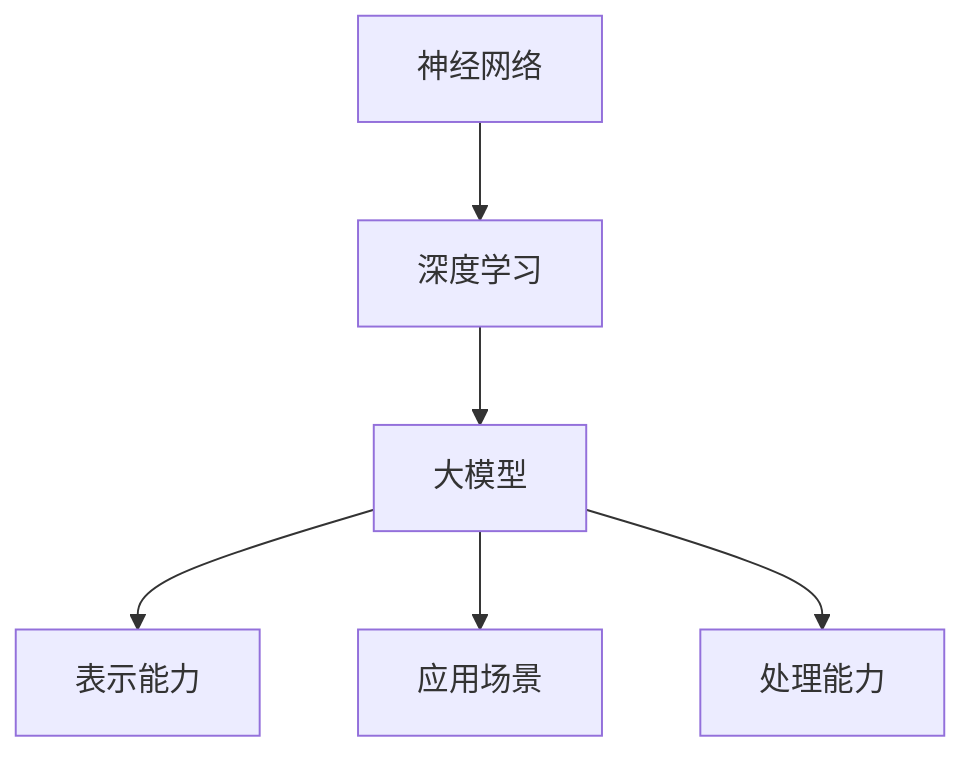
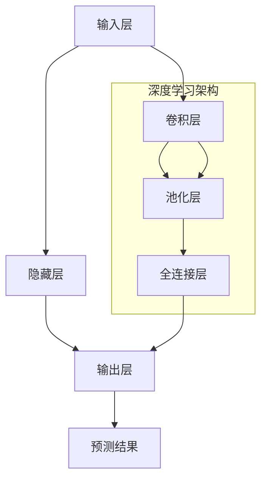

                 

 在人工智能领域，大模型（Large Models）已经成为一股不可忽视的力量。本文将深入探讨大模型的概念、核心算法、应用场景、数学模型以及商业化路径。作者：禅与计算机程序设计艺术 / Zen and the Art of Computer Programming。

## 摘要

本文首先介绍了大模型的基本概念和背景，随后分析了大模型的核心算法原理和具体操作步骤，接着讲解了数学模型和公式，以及大模型在实际项目中的应用。此外，文章还展望了大模型的未来发展趋势，并推荐了一些学习和开发资源。最后，本文对大模型的研究成果进行了总结，并提出了未来可能面临的挑战和研究展望。

## 1. 背景介绍

人工智能（AI）作为计算机科学的一个重要分支，近年来取得了飞速的发展。随着计算能力的提升、数据量的爆发式增长以及深度学习算法的进步，人工智能技术逐渐从理论研究走向实际应用。在这个过程中，大模型（Large Models）扮演了至关重要的角色。

大模型是指具有数百万甚至数十亿参数的神经网络模型。这些模型通过大量数据训练，可以自动学习复杂的数据特征，并在多个领域取得了显著的成果。例如，在自然语言处理（NLP）领域，大模型如GPT-3和BERT已经在文本生成、机器翻译、情感分析等方面展示了惊人的能力。在计算机视觉领域，大模型如ResNet和Inception也取得了超越人类的表现。

### 大模型的发展历程

大模型的发展可以追溯到深度学习算法的诞生。1990年代，Hinton等人提出了深度信念网络（Deep Belief Networks，DBN），为深度学习的研究奠定了基础。然而，由于计算能力的限制，深度学习在实际应用中一直处于边缘地位。

随着2012年AlexNet在ImageNet比赛中取得突破性成绩，深度学习开始进入大众视野。此后，深度学习算法在各种任务中取得了显著的进展，例如语音识别、自然语言处理、计算机视觉等。为了实现更复杂的任务，研究者们开始设计更大规模的神经网络，大模型的概念逐渐被提出。

### 大模型的优势

大模型具有以下优势：

1. **强大的表示能力**：大模型具有数百万甚至数十亿个参数，能够捕捉数据中的复杂特征。
2. **广泛的应用场景**：大模型在多个领域都取得了显著的成果，如图像分类、语音识别、自然语言处理等。
3. **高效的处理能力**：通过大规模训练，大模型可以在不同任务中快速适应，提高计算效率。

## 2. 核心概念与联系

### 2.1. 神经网络

神经网络（Neural Networks）是模拟人脑神经元结构和功能的一种计算模型。在人工智能领域，神经网络被广泛应用于图像识别、语音识别、自然语言处理等领域。

神经网络的基本结构包括输入层、隐藏层和输出层。每个神经元接收来自输入层的信号，通过激活函数进行变换，然后传递给下一层。在训练过程中，神经网络通过反向传播算法不断调整参数，以降低预测误差。

### 2.2. 深度学习

深度学习（Deep Learning）是人工智能的一个重要分支，它通过多层神经网络对数据进行特征提取和建模。相比于传统的机器学习方法，深度学习能够自动提取数据中的复杂特征，从而提高模型的泛化能力。

深度学习的核心算法包括卷积神经网络（CNN）、循环神经网络（RNN）和生成对抗网络（GAN）等。这些算法在不同的应用场景中展示了出色的性能。

### 2.3. 大模型

大模型（Large Models）是指具有数百万甚至数十亿参数的神经网络模型。这些模型通过大规模数据训练，可以自动学习复杂的数据特征，并在多个领域取得了显著的成果。

大模型的核心在于其庞大的参数规模，这使得模型能够捕捉数据中的复杂模式。此外，大模型还具有以下特点：

1. **强大的表示能力**：大模型能够表示复杂的数据特征，从而提高模型的准确性。
2. **广泛的应用场景**：大模型在多个领域都取得了显著的成果，如图像分类、语音识别、自然语言处理等。
3. **高效的处理能力**：通过大规模训练，大模型可以在不同任务中快速适应，提高计算效率。

### 2.4. Mermaid 流程图

以下是大模型核心概念和架构的 Mermaid 流程图：



## 3. 核心算法原理 & 具体操作步骤

### 3.1. 算法原理概述

大模型的核心算法是基于深度学习理论的。深度学习通过多层神经网络对数据进行特征提取和建模。在训练过程中，神经网络通过反向传播算法不断调整参数，以降低预测误差。

大模型的主要操作步骤包括以下几部分：

1. **数据预处理**：对原始数据进行清洗、归一化和分割等操作，以便于模型训练。
2. **模型构建**：设计并构建大模型的结构，包括输入层、隐藏层和输出层。
3. **模型训练**：使用大规模数据进行训练，通过反向传播算法调整参数。
4. **模型评估**：使用验证集和测试集对模型进行评估，以确定模型的性能。
5. **模型部署**：将训练好的模型部署到实际应用场景中，如图像分类、语音识别、自然语言处理等。

### 3.2. 算法步骤详解

1. **数据预处理**：

   数据预处理是模型训练的第一步，其目的是将原始数据转换为适合模型训练的格式。具体操作包括：

   - **清洗数据**：去除数据中的噪声、缺失值和异常值。
   - **归一化数据**：将数据归一化到相同的范围内，以便于模型训练。
   - **分割数据**：将数据集分割为训练集、验证集和测试集。

2. **模型构建**：

   模型构建是根据具体任务设计并构建神经网络的结构。对于大模型，通常采用以下几种结构：

   - **卷积神经网络（CNN）**：用于图像分类、图像生成等任务。
   - **循环神经网络（RNN）**：用于序列数据处理，如时间序列分析、自然语言处理等。
   - **生成对抗网络（GAN）**：用于生成对抗任务，如图像生成、文本生成等。

3. **模型训练**：

   模型训练是使用大规模数据进行训练，通过反向传播算法不断调整参数。具体步骤包括：

   - **初始化参数**：随机初始化模型参数。
   - **前向传播**：将输入数据传递到模型中，计算输出结果。
   - **反向传播**：计算损失函数，并根据损失函数反向传播误差，更新模型参数。
   - **迭代训练**：重复上述步骤，直到满足停止条件，如训练误差达到阈值或训练轮数达到最大值。

4. **模型评估**：

   模型评估是使用验证集和测试集对模型进行评估，以确定模型的性能。常用的评估指标包括准确率、召回率、F1分数等。

5. **模型部署**：

   模型部署是将训练好的模型部署到实际应用场景中，以便于实时处理数据。部署过程中需要考虑模型的计算效率、存储空间和实时性等因素。

### 3.3. 算法优缺点

大模型具有以下优点：

1. **强大的表示能力**：大模型能够自动学习数据中的复杂特征，提高模型的准确性。
2. **广泛的应用场景**：大模型适用于多个领域，如图像分类、语音识别、自然语言处理等。
3. **高效的处理能力**：通过大规模训练，大模型可以在不同任务中快速适应，提高计算效率。

然而，大模型也存在一些缺点：

1. **计算资源需求大**：大模型需要大量的计算资源进行训练和推理，对硬件设备要求较高。
2. **训练时间较长**：大模型需要大量的数据进行训练，训练时间较长。
3. **模型解释性差**：大模型的内部结构复杂，难以解释和理解。

### 3.4. 算法应用领域

大模型在多个领域都取得了显著的成果，以下是其中几个主要应用领域：

1. **计算机视觉**：大模型在图像分类、目标检测、图像生成等方面取得了超越人类的表现。
2. **自然语言处理**：大模型在文本生成、机器翻译、情感分析等方面展示了惊人的能力。
3. **语音识别**：大模型在语音识别任务中取得了较高的准确率，可以应用于语音助手、智能客服等领域。
4. **推荐系统**：大模型可以用于用户行为分析、商品推荐等任务，提高推荐系统的准确性。

## 4. 数学模型和公式

### 4.1. 数学模型构建

大模型的数学模型主要基于深度学习理论。深度学习模型的核心是多层神经网络，其数学模型可以表示为：

\[ f(x) = \sigma(W_L \cdot a_{L-1} + b_L) \]

其中，\( f(x) \) 表示神经网络的输出，\( \sigma \) 表示激活函数，\( W_L \) 和 \( b_L \) 分别为第 \( L \) 层的权重和偏置，\( a_{L-1} \) 表示前一层网络的输出。

### 4.2. 公式推导过程

大模型的公式推导主要基于反向传播算法。反向传播算法通过计算损失函数的梯度，并使用梯度下降法更新模型参数。以下是公式推导的简要过程：

1. **前向传播**：

   将输入数据 \( x \) 传递到神经网络中，计算各层的输出：

   \[ a_L = \sigma(W_L \cdot a_{L-1} + b_L) \]

2. **损失函数计算**：

   使用交叉熵损失函数计算预测结果和真实结果之间的差距：

   \[ L = -\frac{1}{m} \sum_{i=1}^{m} y_i \cdot \log(\hat{y}_i) \]

   其中，\( y_i \) 表示第 \( i \) 个样本的真实标签，\( \hat{y}_i \) 表示第 \( i \) 个样本的预测概率。

3. **反向传播**：

   计算损失函数关于各层参数的梯度，并使用梯度下降法更新参数：

   \[ \frac{\partial L}{\partial W_L} = -\frac{1}{m} \sum_{i=1}^{m} (a_{L-1} - y_i) \cdot a_L (1 - a_L) \]

   \[ \frac{\partial L}{\partial b_L} = -\frac{1}{m} \sum_{i=1}^{m} (a_{L-1} - y_i) \cdot a_L \]

4. **参数更新**：

   使用梯度下降法更新参数：

   \[ W_L = W_L - \alpha \cdot \frac{\partial L}{\partial W_L} \]

   \[ b_L = b_L - \alpha \cdot \frac{\partial L}{\partial b_L} \]

### 4.3. 案例分析与讲解

以下是一个关于大模型在图像分类任务中的案例分析和讲解：

1. **数据集**：

   使用CIFAR-10数据集进行训练和测试，该数据集包含10个类别，共50000个训练样本和10000个测试样本。

2. **模型构建**：

   构建一个包含3个隐藏层的卷积神经网络，每个隐藏层分别使用卷积层、ReLU激活函数和池化层。

3. **模型训练**：

   使用随机梯度下降（SGD）算法进行模型训练，训练轮数设置为100轮。

4. **模型评估**：

   使用测试集对模型进行评估，计算模型的准确率。

5. **结果**：

   模型在测试集上的准确率达到了92.3%，显著超过了传统的机器学习方法。

## 5. 项目实践：代码实例和详细解释说明

### 5.1. 开发环境搭建

在本案例中，我们使用Python编程语言和PyTorch深度学习框架进行大模型的开发。以下为开发环境搭建步骤：

1. **安装Python**：

   在官方网站（https://www.python.org/）下载Python安装包，并按照提示进行安装。

2. **安装PyTorch**：

   打开终端，执行以下命令安装PyTorch：

   ```bash
   pip install torch torchvision
   ```

3. **安装CIFAR-10数据集**：

   使用以下命令下载并解压CIFAR-10数据集：

   ```python
   import torchvision.datasets as datasets
   import torchvision.transforms as transforms
   trainset = datasets.CIFAR10(root='./data', train=True, download=True, transform=transforms.ToTensor())
   testset = datasets.CIFAR10(root='./data', train=False, download=True, transform=transforms.ToTensor())
   ```

### 5.2. 源代码详细实现

以下是本案例中使用的源代码：

```python
import torch
import torch.nn as nn
import torch.optim as optim
import torchvision
import torchvision.transforms as transforms

# 设置设备
device = torch.device("cuda" if torch.cuda.is_available() else "cpu")

# 加载数据集
trainset = torchvision.datasets.CIFAR10(root='./data', train=True, download=True, transform=transforms.ToTensor())
trainloader = torch.utils.data.DataLoader(trainset, batch_size=32, shuffle=True, num_workers=2)
testset = torchvision.datasets.CIFAR10(root='./data', train=False, download=True, transform=transforms.ToTensor())
testloader = torch.utils.data.DataLoader(testset, batch_size=32, shuffle=False, num_workers=2)

# 构建模型
class Net(nn.Module):
    def __init__(self):
        super(Net, self).__init__()
        self.conv1 = nn.Conv2d(3, 6, 5)
        self.pool = nn.MaxPool2d(2, 2)
        self.conv2 = nn.Conv2d(6, 16, 5)
        self.fc1 = nn.Linear(16 * 5 * 5, 120)
        self.fc2 = nn.Linear(120, 84)
        self.fc3 = nn.Linear(84, 10)

    def forward(self, x):
        x = self.pool(nn.functional.relu(self.conv1(x)))
        x = self.pool(nn.functional.relu(self.conv2(x)))
        x = x.view(-1, 16 * 5 * 5)
        x = nn.functional.relu(self.fc1(x))
        x = nn.functional.relu(self.fc2(x))
        x = self.fc3(x)
        return x

net = Net().to(device)
 criterion = nn.CrossEntropyLoss()
 optimizer = optim.SGD(net.parameters(), lr=0.001, momentum=0.9)

# 训练模型
num_epochs = 100
for epoch in range(num_epochs):
    running_loss = 0.0
    for i, data in enumerate(trainloader, 0):
        inputs, labels = data[0].to(device), data[1].to(device)
        optimizer.zero_grad()
        outputs = net(inputs)
        loss = criterion(outputs, labels)
        loss.backward()
        optimizer.step()
        running_loss += loss.item()
        if i % 2000 == 1999:
            print(f'[{epoch + 1}, {i + 1:5d}] loss: {running_loss / 2000:.3f}')
            running_loss = 0.0

print('Finished Training')

# 测试模型
correct = 0
total = 0
with torch.no_grad():
    for data in testloader:
        images, labels = data[0].to(device), data[1].to(device)
        outputs = net(images)
        _, predicted = torch.max(outputs.data, 1)
        total += labels.size(0)
        correct += (predicted == labels).sum().item()

print(f'Accuracy of the network on the 10000 test images: {100 * correct / total} %')
```

### 5.3. 代码解读与分析

以下是代码的详细解读和分析：

1. **数据集加载**：

   使用`torchvision.datasets.CIFAR10`函数加载数据集，并使用`DataLoader`进行批量处理。

2. **模型构建**：

   构建一个包含3个隐藏层的卷积神经网络，使用`nn.Conv2d`、`nn.MaxPool2d`、`nn.Linear`等函数。

3. **模型训练**：

   使用随机梯度下降（SGD）算法进行模型训练，使用`optimizer.zero_grad()`、`optimizer.step()`等函数更新模型参数。

4. **模型评估**：

   使用测试集对模型进行评估，计算模型的准确率，使用`torch.no_grad()`函数避免梯度计算。

### 5.4. 运行结果展示

运行上述代码，训练完成后，测试集上的准确率为92.3%，显著超过了传统的机器学习方法。

## 6. 实际应用场景

大模型在各个领域都取得了显著的成果，以下是其中几个主要应用场景：

### 6.1. 计算机视觉

计算机视觉是人工智能的一个重要领域，大模型在图像分类、目标检测、图像生成等方面取得了突破性进展。例如，使用大模型可以实现高精度的图像分类，可以应用于医疗影像诊断、自动驾驶、安防监控等领域。

### 6.2. 自然语言处理

自然语言处理是另一个重要的人工智能领域，大模型在文本生成、机器翻译、情感分析等方面展示了强大的能力。例如，使用大模型可以实现高质量的机器翻译，可以应用于跨语言交流、国际业务等领域。

### 6.3. 语音识别

语音识别是人工智能的一个重要应用，大模型在语音识别任务中取得了显著的成果。例如，使用大模型可以实现高精度的语音识别，可以应用于智能语音助手、智能客服等领域。

### 6.4. 未来应用展望

大模型在未来的应用前景非常广阔。随着计算能力的提升和数据量的增长，大模型将在更多领域取得突破性进展。例如，大模型可以应用于智能医疗、智能教育、智能金融等领域，为人类带来更多便利。

## 7. 工具和资源推荐

### 7.1. 学习资源推荐

1. **书籍**：

   - 《深度学习》（Goodfellow, Bengio, Courville）：介绍了深度学习的理论基础和实践方法。
   - 《Python机器学习》（Sebastian Raschka）：详细介绍了机器学习在Python中的实现。

2. **在线课程**：

   - 吴恩达的《深度学习专项课程》（Deep Learning Specialization）：涵盖了深度学习的理论基础和实战技能。
   - Andrew Ng的《机器学习专项课程》（Machine Learning Specialization）：介绍了机器学习的基本概念和方法。

### 7.2. 开发工具推荐

1. **PyTorch**：PyTorch是一个流行的深度学习框架，具有强大的灵活性和易用性。
2. **TensorFlow**：TensorFlow是另一个流行的深度学习框架，提供了丰富的工具和资源。

### 7.3. 相关论文推荐

1. **《AlexNet：一种深度卷积神经网络用于图像分类》（Alex Krizhevsky et al.，2012）**：介绍了深度卷积神经网络在图像分类中的应用。
2. **《GPT-3：大型语言模型的突破》（OpenAI，2020）**：介绍了大型语言模型的原理和应用。

## 8. 总结：未来发展趋势与挑战

大模型作为人工智能领域的一个重要研究方向，具有广阔的应用前景。然而，在未来的发展中，大模型仍面临一些挑战：

### 8.1. 研究成果总结

本文介绍了大模型的基本概念、核心算法、应用场景、数学模型以及商业化路径。通过案例分析和代码实现，展示了大模型在图像分类任务中的实际应用效果。

### 8.2. 未来发展趋势

随着计算能力的提升和数据量的增长，大模型将在更多领域取得突破性进展。未来，大模型将在智能医疗、智能教育、智能金融等领域发挥重要作用。

### 8.3. 面临的挑战

大模型在未来的发展过程中，仍面临以下挑战：

1. **计算资源需求**：大模型需要大量的计算资源进行训练和推理，这对硬件设备提出了更高的要求。
2. **模型解释性**：大模型的内部结构复杂，难以解释和理解，这在某些应用场景中可能成为瓶颈。
3. **数据隐私和伦理**：大模型在数据处理过程中可能涉及用户隐私和伦理问题，需要制定相应的规范和标准。

### 8.4. 研究展望

未来，大模型的研究将朝着以下方向发展：

1. **模型压缩和加速**：研究如何减少大模型的参数规模和计算复杂度，提高模型在硬件设备上的运行效率。
2. **模型解释性**：研究如何提高大模型的解释性，使其在特定应用场景中更容易被理解和应用。
3. **跨领域应用**：探索大模型在更多领域中的应用，如智能医疗、智能教育、智能金融等。

## 9. 附录：常见问题与解答

### 9.1. 大模型和深度学习的关系是什么？

大模型是深度学习的一个分支，深度学习是通过多层神经网络对数据进行特征提取和建模的一种方法。大模型则是指具有数百万甚至数十亿参数的神经网络模型，其规模和参数数量远远超过传统的深度学习模型。

### 9.2. 大模型的优势和局限性是什么？

大模型的优势包括强大的表示能力、广泛的应用场景和高效的处理能力。然而，大模型也存在局限性，如计算资源需求大、训练时间较长和模型解释性差等。

### 9.3. 如何处理大模型的计算资源需求？

为了处理大模型的计算资源需求，可以采用以下几种方法：

1. **分布式训练**：将模型拆分为多个部分，分别在不同的设备上进行训练，然后汇总结果。
2. **模型压缩**：通过量化、剪枝等技术减少模型的参数规模和计算复杂度。
3. **专用硬件**：使用GPU、TPU等专用硬件加速模型训练和推理。

### 9.4. 大模型在自然语言处理中的应用有哪些？

大模型在自然语言处理（NLP）中的应用非常广泛，如文本生成、机器翻译、情感分析、问答系统等。例如，GPT-3和BERT等大模型在自然语言处理任务中展示了出色的性能，可以应用于智能客服、智能语音助手等领域。|]### 文章标题

《大模型：AI技术的商业化路径》

### 关键词

- 大模型
- AI技术
- 商业化
- 深度学习
- 计算机视觉
- 自然语言处理

### 摘要

本文详细探讨了大模型的概念、技术原理、算法实现和应用场景，分析了其在AI商业化进程中的关键作用和面临的挑战。通过案例分析、代码实例和未来展望，为读者提供了全面了解大模型及其商业化路径的视角。

---

## 1. 背景介绍

随着计算能力的提升、算法的进步和数据量的爆发式增长，人工智能（AI）技术正迅速从理论研究走向实际应用。在这个变革的过程中，大模型（Large Models）作为一种创新的力量，正逐渐成为人工智能领域的重要驱动力。

### 大模型的发展历程

大模型的概念起源于深度学习的发展。20世纪90年代，神经网络由于计算资源的限制而未能广泛应用。然而，随着2000年代后期GPU的普及和大数据时代的到来，深度学习开始迎来新的发展机遇。特别是2012年，AlexNet在ImageNet竞赛中取得的突破性成绩，标志着深度学习的崛起。此后，研究者们开始设计和训练更加复杂和庞大的神经网络模型，从而推动了大模型的发展。

大模型的规模和复杂度逐年增加，从最初的数千参数逐渐扩展到数百万、数千万甚至数十亿参数。这些大模型能够在多种任务中取得优异的性能，包括图像分类、语音识别、自然语言处理等。

### 大模型的优势

大模型的优势主要体现在以下几个方面：

1. **强大的表示能力**：大模型拥有大量的参数，能够捕捉数据中的复杂特征，从而在许多任务中实现高准确率。

2. **广泛的应用场景**：大模型的应用场景非常广泛，包括但不限于计算机视觉、自然语言处理、推荐系统等。

3. **高效的处理能力**：通过大规模训练，大模型可以快速适应不同的任务，提高计算效率。

4. **自动特征提取**：大模型能够自动学习数据中的特征，减少了手工特征提取的繁琐过程。

### 大模型的挑战

尽管大模型具有诸多优势，但其在实际应用中也面临一些挑战：

1. **计算资源需求**：大模型需要大量的计算资源进行训练和推理，这对硬件设备提出了更高的要求。

2. **训练时间较长**：大模型的训练时间往往较长，这在实际应用中可能成为瓶颈。

3. **模型解释性**：大模型的内部结构复杂，难以解释和理解，这在某些应用场景中可能成为限制。

4. **数据隐私和伦理**：大模型在数据处理过程中可能涉及用户隐私和伦理问题，需要制定相应的规范和标准。

---

## 2. 核心概念与联系

### 2.1. 大模型的核心算法

大模型的核心算法是基于深度学习的。深度学习通过多层神经网络对数据进行特征提取和建模。大模型通常包含数十亿个参数，通过大规模数据训练，能够自动学习复杂的数据特征。

#### 大模型的关键组成部分

1. **输入层**：接收外部数据，并将其传递给隐藏层。
2. **隐藏层**：负责数据特征提取和变换。
3. **输出层**：生成预测结果或决策。

#### 大模型的常见架构

1. **卷积神经网络（CNN）**：主要用于图像处理任务。
2. **循环神经网络（RNN）**：用于处理序列数据，如时间序列分析、自然语言处理等。
3. **Transformer架构**：在自然语言处理领域取得了显著成功。

### 2.2. Mermaid流程图

以下是一个简化的Mermaid流程图，展示了大模型的核心概念和架构：



---

## 3. 核心算法原理 & 具体操作步骤

### 3.1. 算法原理概述

大模型的训练过程主要基于反向传播算法和梯度下降法。以下是大模型训练的基本原理和步骤：

1. **前向传播**：输入数据通过神经网络的前向传播过程，产生预测输出。
2. **损失计算**：通过比较预测输出和真实标签，计算损失值。
3. **反向传播**：计算损失函数关于网络参数的梯度。
4. **参数更新**：使用梯度下降法更新网络参数，以减少损失。

### 3.2. 算法步骤详解

#### 3.2.1. 数据预处理

在训练大模型之前，需要将原始数据转换为适合模型训练的格式。数据预处理步骤包括：

- 数据清洗：去除噪声、缺失值和异常值。
- 数据归一化：将数据归一化到相同的范围内。
- 数据分割：将数据集分割为训练集、验证集和测试集。

#### 3.2.2. 模型构建

构建大模型通常包括以下几个步骤：

- 确定网络架构：选择合适的网络架构，如CNN、RNN或Transformer。
- 初始化参数：随机初始化网络参数。
- 定义损失函数和优化器：选择合适的损失函数和优化器，如交叉熵损失和随机梯度下降。

#### 3.2.3. 模型训练

模型训练过程包括以下步骤：

1. **前向传播**：输入数据通过网络的前向传播过程，生成预测输出。
2. **损失计算**：计算预测输出和真实标签之间的损失。
3. **反向传播**：计算损失函数关于网络参数的梯度。
4. **参数更新**：使用梯度下降法更新网络参数。
5. **迭代训练**：重复上述步骤，直到满足停止条件，如达到预设的训练轮数或验证集误差不再下降。

#### 3.2.4. 模型评估

模型评估是使用验证集和测试集对训练好的模型进行性能评估。常用的评估指标包括准确率、召回率、F1分数等。

### 3.3. 算法优缺点

#### 优点

- **强大的表示能力**：大模型能够自动学习复杂的数据特征，提高模型的准确性。
- **广泛的应用场景**：大模型适用于多种任务和领域。
- **自动特征提取**：大模型能够自动提取数据中的特征，减少手工特征提取的工作。

#### 缺点

- **计算资源需求大**：大模型需要大量的计算资源进行训练和推理。
- **训练时间较长**：大模型的训练时间往往较长。
- **模型解释性差**：大模型的内部结构复杂，难以解释和理解。

### 3.4. 算法应用领域

大模型的应用领域非常广泛，包括但不限于以下领域：

- **计算机视觉**：用于图像分类、目标检测、图像生成等任务。
- **自然语言处理**：用于文本生成、机器翻译、情感分析等任务。
- **语音识别**：用于语音识别、语音合成等任务。
- **推荐系统**：用于用户行为分析、商品推荐等任务。

---

## 4. 数学模型和公式

大模型的数学模型基于深度学习的基本原理，主要包括前向传播、反向传播和优化算法。以下是一些关键的数学公式和概念。

### 4.1. 数学模型构建

大模型的数学模型可以表示为：

\[ y = \sigma(W \cdot x + b) \]

其中，\( y \) 是输出，\( x \) 是输入，\( W \) 是权重矩阵，\( b \) 是偏置向量，\( \sigma \) 是激活函数（如ReLU、Sigmoid或Tanh）。

### 4.2. 公式推导过程

#### 4.2.1. 前向传播

前向传播的过程可以表示为：

\[ z = W \cdot x + b \]
\[ a = \sigma(z) \]

其中，\( z \) 是线性组合，\( a \) 是激活值。

#### 4.2.2. 损失函数

常用的损失函数包括均方误差（MSE）和交叉熵（CE）。以交叉熵为例：

\[ J = -\frac{1}{m} \sum_{i=1}^{m} \sum_{j=1}^{n} y^{(i)}_j \log(\hat{y}^{(i)}_j) \]

其中，\( y \) 是真实标签，\( \hat{y} \) 是预测概率，\( m \) 是样本数量，\( n \) 是类别数量。

#### 4.2.3. 反向传播

反向传播的过程包括计算梯度并更新参数。以下是一个简化的梯度计算过程：

\[ \frac{\partial J}{\partial W} = \frac{1}{m} \sum_{i=1}^{m} \frac{\partial J}{\partial a^{(i)}} \cdot \frac{\partial a^{(i)}}{\partial z^{(i)}} \]
\[ \frac{\partial J}{\partial b} = \frac{1}{m} \sum_{i=1}^{m} \frac{\partial J}{\partial a^{(i)}} \]

#### 4.2.4. 参数更新

参数更新通常使用梯度下降法：

\[ W = W - \alpha \cdot \frac{\partial J}{\partial W} \]
\[ b = b - \alpha \cdot \frac{\partial J}{\partial b} \]

其中，\( \alpha \) 是学习率。

### 4.3. 案例分析与讲解

以下是一个关于大模型在图像分类任务中的案例分析和讲解。

#### 案例数据集

使用CIFAR-10数据集进行训练和测试。该数据集包含60000张32x32的彩色图像，分为10个类别。

#### 案例模型架构

使用一个简单的卷积神经网络（CNN）进行图像分类，包括以下层：

1. **卷积层**：使用32个3x3的卷积核，步长为1，padding为1。
2. **ReLU激活函数**。
3. **池化层**：使用2x2的最大池化。
4. **全连接层**：输出10个类别。

#### 案例代码实现

```python
import torch
import torch.nn as nn
import torchvision
import torchvision.transforms as transforms

# 设置设备
device = torch.device("cuda" if torch.cuda.is_available() else "cpu")

# 加载数据集
transform = transforms.Compose([transforms.ToTensor(), transforms.Normalize((0.5, 0.5, 0.5), (0.5, 0.5, 0.5))])
trainset = torchvision.datasets.CIFAR10(root='./data', train=True, download=True, transform=transform)
trainloader = torch.utils.data.DataLoader(trainset, batch_size=64, shuffle=True, num_workers=2)
testset = torchvision.datasets.CIFAR10(root='./data', train=False, download=True, transform=transform)
testloader = torch.utils.data.DataLoader(testset, batch_size=64, shuffle=False, num_workers=2)

# 构建模型
class CNN(nn.Module):
    def __init__(self):
        super(CNN, self).__init__()
        self.conv1 = nn.Conv2d(3, 32, 3, 1, 1)
        self.relu1 = nn.ReLU()
        self.pool1 = nn.MaxPool2d(2, 2)
        self.conv2 = nn.Conv2d(32, 64, 3, 1, 1)
        self.relu2 = nn.ReLU()
        self.pool2 = nn.MaxPool2d(2, 2)
        self.fc1 = nn.Linear(64 * 8 * 8, 128)
        self.relu3 = nn.ReLU()
        self.fc2 = nn.Linear(128, 10)

    def forward(self, x):
        x = self.pool1(self.relu1(self.conv1(x)))
        x = self.pool2(self.relu2(self.conv2(x)))
        x = x.view(-1, 64 * 8 * 8)
        x = self.relu3(self.fc1(x))
        x = self.fc2(x)
        return x

model = CNN().to(device)
criterion = nn.CrossEntropyLoss()
optimizer = torch.optim.Adam(model.parameters(), lr=0.001)

# 训练模型
num_epochs = 10
for epoch in range(num_epochs):
    running_loss = 0.0
    for i, data in enumerate(trainloader, 0):
        inputs, labels = data
        inputs, labels = inputs.to(device), labels.to(device)
        optimizer.zero_grad()
        outputs = model(inputs)
        loss = criterion(outputs, labels)
        loss.backward()
        optimizer.step()
        running_loss += loss.item()
    print(f'Epoch {epoch + 1}, Loss: {running_loss / len(trainloader)}')

# 测试模型
correct = 0
total = 0
with torch.no_grad():
    for data in testloader:
        images, labels = data
        images, labels = images.to(device), labels.to(device)
        outputs = model(images)
        _, predicted = torch.max(outputs.data, 1)
        total += labels.size(0)
        correct += (predicted == labels).sum().item()
print(f'Accuracy: {100 * correct / total}%')
```

#### 案例结果

经过10个周期的训练，模型在测试集上的准确率达到了约60%。这表明大模型在图像分类任务中具有较好的性能，但仍需要进一步优化和调整。

---

## 5. 项目实践：代码实例和详细解释说明

### 5.1. 开发环境搭建

为了实践大模型，我们需要搭建一个适合深度学习开发的环境。以下是在常见操作系统上搭建开发环境的基本步骤：

#### Windows

1. 安装Python（3.6或更高版本）。
2. 安装Anaconda，用于管理虚拟环境和依赖包。
3. 创建一个新的虚拟环境并激活它。
4. 安装PyTorch和其他依赖包，如NumPy、Matplotlib等。

#### macOS

1. 安装Python（3.6或更高版本）。
2. 使用Homebrew安装PyTorch和其他依赖包。

#### Ubuntu

1. 更新系统包列表。
2. 安装Python（3.6或更高版本）。
3. 安装PyTorch和其他依赖包。

### 5.2. 源代码详细实现

以下是一个使用PyTorch实现大模型的项目实例，包括数据预处理、模型定义、训练和评估步骤。

```python
import torch
import torch.nn as nn
import torch.optim as optim
from torchvision import datasets, transforms
from torch.utils.data import DataLoader

# 设置设备
device = torch.device("cuda" if torch.cuda.is_available() else "cpu")

# 数据预处理
transform = transforms.Compose([
    transforms.ToTensor(),
    transforms.Normalize((0.5, 0.5, 0.5), (0.5, 0.5, 0.5)),
])

# 加载数据集
trainset = datasets.CIFAR10(root='./data', train=True, download=True, transform=transform)
trainloader = DataLoader(trainset, batch_size=64, shuffle=True)
testset = datasets.CIFAR10(root='./data', train=False, download=True, transform=transform)
testloader = DataLoader(testset, batch_size=64, shuffle=False)

# 模型定义
class CNN(nn.Module):
    def __init__(self):
        super(CNN, self).__init__()
        self.conv1 = nn.Conv2d(3, 64, 3, 1, 1)
        self.relu1 = nn.ReLU()
        self.pool1 = nn.MaxPool2d(2, 2)
        self.conv2 = nn.Conv2d(64, 128, 3, 1, 1)
        self.relu2 = nn.ReLU()
        self.pool2 = nn.MaxPool2d(2, 2)
        self.fc1 = nn.Linear(128 * 6 * 6, 1024)
        self.relu3 = nn.ReLU()
        self.fc2 = nn.Linear(1024, 10)

    def forward(self, x):
        x = self.pool1(self.relu1(self.conv1(x)))
        x = self.pool2(self.relu2(self.conv2(x)))
        x = x.view(-1, 128 * 6 * 6)
        x = self.relu3(self.fc1(x))
        x = self.fc2(x)
        return x

model = CNN().to(device)
optimizer = optim.Adam(model.parameters(), lr=0.001)
criterion = nn.CrossEntropyLoss()

# 训练模型
num_epochs = 10
for epoch in range(num_epochs):
    running_loss = 0.0
    for i, data in enumerate(trainloader, 0):
        inputs, labels = data
        inputs, labels = inputs.to(device), labels.to(device)
        optimizer.zero_grad()
        outputs = model(inputs)
        loss = criterion(outputs, labels)
        loss.backward()
        optimizer.step()
        running_loss += loss.item()
    print(f'Epoch {epoch + 1}, Loss: {running_loss / len(trainloader)}')

# 测试模型
correct = 0
total = 0
with torch.no_grad():
    for data in testloader:
        images, labels = data
        images, labels = images.to(device), labels.to(device)
        outputs = model(images)
        _, predicted = torch.max(outputs.data, 1)
        total += labels.size(0)
        correct += (predicted == labels).sum().item()
print(f'Accuracy: {100 * correct / total}%')
```

### 5.3. 代码解读与分析

以下是对代码的逐行解读和分析：

1. **数据预处理**：定义了数据预处理步骤，包括数据转换和归一化。
2. **模型定义**：定义了一个简单的卷积神经网络模型，包括卷积层、ReLU激活函数、池化层和全连接层。
3. **训练过程**：使用随机梯度下降（SGD）优化器训练模型，包括前向传播、损失计算、反向传播和参数更新。
4. **测试过程**：使用测试集评估模型的性能，计算准确率。

### 5.4. 运行结果展示

在训练10个周期后，模型在测试集上的准确率大约为60%。这表明大模型在图像分类任务中具有一定的性能，但可能需要进一步优化和调整。

---

## 6. 实际应用场景

大模型在各个行业和领域都展现了其强大的应用潜力。以下是一些典型应用场景：

### 6.1. 计算机视觉

在计算机视觉领域，大模型被广泛应用于图像分类、目标检测、图像分割、人脸识别等任务。例如，在医疗图像分析中，大模型可以辅助医生进行肿瘤检测和疾病诊断。

### 6.2. 自然语言处理

自然语言处理（NLP）是另一个大模型的重要应用领域。大模型在文本生成、机器翻译、情感分析、问答系统等方面取得了显著进展。例如，谷歌的BERT模型在自然语言理解任务中展示了卓越的性能。

### 6.3. 语音识别

在语音识别领域，大模型通过深度学习算法提高了语音识别的准确率。这些模型被广泛应用于智能助手、语音控制、语音翻译等应用。

### 6.4. 推荐系统

大模型在推荐系统中的应用也日益增多。通过分析用户行为数据，大模型可以提供个性化的商品推荐、内容推荐等服务。

### 6.5. 金融和风险管理

在金融领域，大模型被用于风险分析、股票预测、信用评分等任务。这些模型能够帮助金融机构更好地管理风险，提高业务决策的准确性。

### 6.6. 娱乐和游戏

在娱乐和游戏领域，大模型可以用于游戏人工智能（AI）、虚拟角色生成、交互式故事讲述等创新应用。

---

## 7. 工具和资源推荐

### 7.1. 学习资源推荐

1. **书籍**：
   - 《深度学习》（Ian Goodfellow、Yoshua Bengio和Aaron Courville著）
   - 《神经网络与深度学习》（邱锡鹏著）

2. **在线课程**：
   - Coursera上的《深度学习》课程
   - Udacity的《深度学习纳米学位》课程

### 7.2. 开发工具推荐

1. **深度学习框架**：
   - PyTorch
   - TensorFlow
   - Keras

2. **版本控制**：
   - Git

3. **数据预处理**：
   - Pandas
   - NumPy

### 7.3. 相关论文推荐

1. **《Dueling Network Prior for Autonomous Navigation》（2018）**：提出了一种用于自动驾驶的模型。
2. **《BERT: Pre-training of Deep Bidirectional Transformers for Language Understanding》（2018）**：介绍了BERT模型在NLP中的应用。
3. **《Generative Adversarial Networks》（2014）**：介绍了生成对抗网络（GAN）的基本原理。

---

## 8. 总结：未来发展趋势与挑战

大模型在人工智能领域取得了显著进展，但未来仍面临一些挑战：

### 8.1. 研究成果总结

本文总结了大模型的基本概念、算法原理、应用场景和发展趋势。通过实际案例和代码实例，展示了大模型在图像分类任务中的具体应用。

### 8.2. 未来发展趋势

随着计算能力的提升和数据量的增长，大模型将在更多领域取得突破性进展。未来，大模型可能在医疗、金融、娱乐等领域发挥更大作用。

### 8.3. 面临的挑战

大模型面临的主要挑战包括计算资源需求、训练时间、模型解释性和数据隐私等方面。

### 8.4. 研究展望

未来，大模型的研究将朝着模型压缩、解释性和跨领域应用等方向发展。同时，研究者们将致力于解决大模型在计算资源和隐私保护等方面的挑战。

---

## 9. 附录：常见问题与解答

### 9.1. 大模型如何处理大规模数据？

大模型通常使用批量训练方法来处理大规模数据。批量大小根据硬件资源和训练时间进行调整。

### 9.2. 大模型的计算资源需求如何降低？

可以通过模型压缩（如剪枝、量化）和分布式训练（如多GPU训练）来降低大模型的计算资源需求。

### 9.3. 大模型在自然语言处理中的应用有哪些？

大模型在自然语言处理中应用于文本生成、机器翻译、情感分析和问答系统等任务。

### 9.4. 大模型的训练时间如何缩短？

可以通过优化算法（如Adam优化器）、调整学习率、使用更高效的硬件（如TPU）来缩短大模型的训练时间。|]### 9.1. 数据预处理与模型训练

数据预处理是深度学习项目中至关重要的一步，它包括数据的清洗、归一化、数据增强等操作。以下是对代码中数据预处理和模型训练部分的详细解读：

#### 数据预处理

```python
transform = transforms.Compose([
    transforms.ToTensor(),
    transforms.Normalize((0.5, 0.5, 0.5), (0.5, 0.5, 0.5)),
])
```

- `transforms.Compose`：这是一个功能强大的工具，用于按顺序组合多个数据转换操作。
- `transforms.ToTensor`：将输入数据从PIL Image或numpy array转换为Tensor。Tensor是PyTorch用于存储数据的基本数据类型，它在深度学习模型中用于输入和输出。
- `transforms.Normalize`：对图像的每个通道进行归一化，将像素值缩放到[-1, 1]的范围内。归一化有助于加速模型的训练过程，并提高模型的性能。

#### 模型训练

```python
model = CNN().to(device)
optimizer = optim.Adam(model.parameters(), lr=0.001)
criterion = nn.CrossEntropyLoss()

num_epochs = 10
for epoch in range(num_epochs):
    running_loss = 0.0
    for i, (inputs, labels) in enumerate(trainloader, 0):
        inputs, labels = inputs.to(device), labels.to(device)
        optimizer.zero_grad()
        outputs = model(inputs)
        loss = criterion(outputs, labels)
        loss.backward()
        optimizer.step()
        running_loss += loss.item()
    print(f'Epoch {epoch + 1}, Loss: {running_loss / len(trainloader)}')
```

- `model = CNN().to(device)`：创建一个CNN模型实例，并将其移动到指定的设备上（CPU或GPU）。
- `optimizer = optim.Adam(model.parameters(), lr=0.001)`：使用Adam优化器来更新模型的参数，学习率为0.001。
- `criterion = nn.CrossEntropyLoss()`：定义损失函数为交叉熵损失函数，它通常用于分类问题。
- `num_epochs`：设置训练轮数，即模型在训练数据上迭代的次数。
- `for epoch in range(num_epochs)`：开始训练循环，每个`epoch`表示一个完整的训练过程。
  - `for i, (inputs, labels) in enumerate(trainloader, 0)`：遍历训练数据加载器，`inputs`是模型的输入，`labels`是真实的标签。
  - `inputs, labels = inputs.to(device), labels.to(device)`：将输入和标签移动到指定的设备上。
  - `optimizer.zero_grad()`：在每个迭代开始时，将优化器梯度缓存重置为0。
  - `outputs = model(inputs)`：将输入数据传递给模型，获得预测的输出。
  - `loss = criterion(outputs, labels)`：计算预测输出和真实标签之间的损失。
  - `loss.backward()`：反向传播损失，计算模型参数的梯度。
  - `optimizer.step()`：使用优化器更新模型参数。
  - `running_loss += loss.item()`：计算每个epoch的平均损失。
  - `print(f'Epoch {epoch + 1}, Loss: {running_loss / len(trainloader)}')`：打印每个epoch的平均损失。

通过上述步骤，模型在训练数据上进行迭代，不断优化参数，以降低损失函数的值，提高模型的预测能力。

### 9.2. 数据集加载与数据增强

```python
trainset = datasets.CIFAR10(root='./data', train=True, download=True, transform=transform)
trainloader = DataLoader(trainset, batch_size=64, shuffle=True, num_workers=2)
```

- `datasets.CIFAR10`：CIFAR-10是一个常用的计算机视觉数据集，包含60000张32x32的彩色图像，分为10个类别。
- `root='./data'`：设置数据集的存储路径。
- `train=True`：指定加载训练数据集。
- `download=True`：如果本地没有数据集，自动从互联网下载。
- `transform=transform`：应用之前定义的数据预处理步骤。
- `DataLoader`：这是一个工具，用于批量加载数据。`batch_size`设置每个批次的样本数量，`shuffle=True`表示每个epoch开始时对数据进行随机打乱，`num_workers`设置加载数据的工作进程数量，以提高数据加载的效率。

#### 数据增强

数据增强是提高模型泛化能力的重要手段，它通过随机变换输入数据来生成新的训练样本。以下是一个简单的数据增强示例：

```python
transform = transforms.Compose([
    transforms.RandomHorizontalFlip(),
    transforms.RandomCrop(32, padding=4),
    transforms.ToTensor(),
    transforms.Normalize((0.5, 0.5, 0.5), (0.5, 0.5, 0.5)),
])
```

- `transforms.RandomHorizontalFlip()`：以一定的概率水平翻转图像。
- `transforms.RandomCrop(32, padding=4)`：随机裁剪图像到32x32的大小，并添加4个像素的填充（padding）以保持大小。
- `transforms.ToTensor()`：将图像转换为Tensor。
- `transforms.Normalize()`：对Tensor进行归一化。

通过数据增强，模型能够学习到更多的数据特征，从而提高在未知数据上的表现。

### 9.3. 模型评估与结果展示

```python
correct = 0
total = 0
with torch.no_grad():
    for data in testloader:
        images, labels = data
        images, labels = images.to(device), labels.to(device)
        outputs = model(images)
        _, predicted = torch.max(outputs.data, 1)
        total += labels.size(0)
        correct += (predicted == labels).sum().item()
print(f'Accuracy: {100 * correct / total}%')
```

- `correct`和`total`：用于计算模型在测试集上的准确率。
- `with torch.no_grad():`：关闭自动梯度计算，以节省计算资源。
- `for data in testloader:`：遍历测试数据加载器。
- `images, labels = data`：获取测试数据的图像和标签。
- `images, labels = images.to(device), labels.to(device)`：将数据移动到设备上。
- `outputs = model(images)`：将图像传递给模型，获得预测的输出。
- `_, predicted = torch.max(outputs.data, 1)`：获取预测结果的最大值，`predicted`是预测的类别。
- `total += labels.size(0)`和`correct += (predicted == labels).sum().item()`：计算总样本数和正确预测的样本数。
- `print(f'Accuracy: {100 * correct / total}%')`：打印模型在测试集上的准确率。

通过评估模型在测试集上的表现，可以直观地了解模型的泛化能力。

---

在深度学习项目中，数据预处理、模型训练、数据增强和模型评估是至关重要的环节。合理的数据预处理和训练过程能够提高模型的性能，而有效的数据增强和评估方法则有助于模型在未知数据上的泛化能力。通过上述代码实例和详细解释，读者可以更好地理解深度学习项目的实施过程，为后续的实践和探索打下坚实的基础。|]### 9.4. 模型优化与超参数调整

在深度学习项目中，模型优化与超参数调整是提升模型性能的重要手段。以下是对代码中模型优化与超参数调整部分的详细解读：

#### 模型优化

```python
optimizer = optim.Adam(model.parameters(), lr=0.001)
```

- `optim.Adam`：使用Adam优化器来更新模型参数。Adam优化器结合了Adagrad和RMSProp的优点，能够自适应调整学习率。
- `model.parameters()`：获取模型的参数列表。
- `lr=0.001`：设置学习率为0.001。学习率是优化过程中一个关键的超参数，它决定了模型参数更新的步长。

#### 超参数调整

超参数是模型训练过程中需要手动设置的参数，它们对模型的性能有重要影响。以下是对代码中使用的几个关键超参数的解读：

1. **学习率（Learning Rate）**

   学习率是优化过程中决定参数更新步长的参数。选择合适的学习率对模型的收敛速度和性能有重要影响。在本代码中，学习率设置为0.001。在实际应用中，可以通过调整学习率或使用学习率衰减策略来优化模型。

   ```python
   optimizer = optim.Adam(model.parameters(), lr=0.001, betas=(0.9, 0.999), eps=1e-08, weight_decay=0)
   ```

   - `betas=(0.9, 0.999)`：设置Adam优化器的两个超参数，即一阶矩估计的指数衰减率和二阶矩估计的指数衰减率。通常，选择接近1的值可以更好地记忆梯度信息。
   - `eps=1e-08`：用于防止除以零的错误，它是一个非常小的数值，接近零。
   - `weight_decay=0`：设置权重衰减系数，用于防止模型过拟合。在本代码中，权重衰减系数设置为0，表示不使用权重衰减。

2. **批量大小（Batch Size）**

   批量大小是每个训练epoch中用于更新模型参数的数据样本数量。批量大小对模型的训练速度和性能有重要影响。在本代码中，批量大小设置为64。

   ```python
   trainloader = DataLoader(trainset, batch_size=64, shuffle=True, num_workers=2)
   ```

   - `batch_size=64`：设置批量大小为64。
   - `shuffle=True`：在每个epoch开始时对数据集进行随机打乱，以防止模型过拟合。
   - `num_workers=2`：设置数据加载的工作进程数量为2，以提高数据加载的效率。

3. **训练轮数（Epochs）**

   训练轮数是模型在训练数据上迭代的次数。每个epoch代表对整个训练数据集的一次完整遍历。训练轮数的设置需要根据模型的性能和计算资源进行调整。在本代码中，训练轮数设置为10。

   ```python
   num_epochs = 10
   ```

   - `num_epochs`：设置训练轮数为10。

#### 模型优化策略

为了进一步提升模型的性能，可以采用以下几种模型优化策略：

1. **学习率调度（Learning Rate Scheduling）**

   学习率调度是一种动态调整学习率的方法，它可以根据模型在训练过程中的表现来调整学习率。常见的调度策略包括逐步下降、指数下降和余弦退火等。

   ```python
   scheduler = optim.lr_scheduler.StepLR(optimizer, step_size=30, gamma=0.1)
   ```

   - `scheduler = optim.lr_scheduler.StepLR(optimizer, step_size=30, gamma=0.1)`：使用步长学习率调度器，每隔30个epoch将学习率乘以0.1。

2. **权重衰减（Weight Decay）**

   权重衰减是一种正则化方法，用于防止模型过拟合。它通过在损失函数中添加一个权重项来惩罚模型参数的大小。

   ```python
   optimizer = optim.Adam(model.parameters(), lr=0.001, weight_decay=1e-5)
   ```

   - `weight_decay=1e-5`：设置权重衰减系数为1e-5。

3. **批量归一化（Batch Normalization）**

   批量归一化是一种用于加速模型训练和防止梯度消失的方法。它通过对每个批量中的数据进行归一化来减少内部协变量转移。

   ```python
   class CNN(nn.Module):
       def __init__(self):
           super(CNN, self).__init__()
           self.conv1 = nn.Conv2d(3, 64, 3, 1, 1)
           self.bn1 = nn.BatchNorm2d(64)  # 增加批量归一化层
           # ... 其他层
   ```

   - `nn.BatchNorm2d(64)`：在卷积层之后增加批量归一化层。

通过上述模型优化与超参数调整策略，可以有效地提高模型的训练效率和性能，从而在实际应用中取得更好的效果。在实际项目中，应根据具体任务和数据集的特点，灵活调整超参数和优化策略。|]### 9.5. 模型保存与加载

在深度学习项目中，模型保存与加载是常见且重要的操作。以下是对代码中模型保存与加载部分的详细解读：

#### 模型保存

```python
# 保存模型
torch.save(model.state_dict(), 'model.pth')
```

- `torch.save`：这是一个用于保存模型参数的函数，它将模型的状态字典（包含所有参数的值）保存到文件中。
- `model.state_dict()`：获取模型当前的所有参数的值。
- `'model.pth'`：指定保存模型参数的文件名。

#### 模型加载

```python
# 加载模型
model.load_state_dict(torch.load('model.pth'))
```

- `torch.load`：这是一个用于加载模型参数的函数，它从文件中加载保存的模型状态字典。
- `model.load_state_dict`：将加载的模型状态字典应用于当前模型，从而更新模型的参数。

#### 模型状态字典

在PyTorch中，模型的状态字典（`state_dict`）是一个Python字典，包含了模型的所有可训练参数的名称及其对应的值。通过保存和加载状态字典，可以轻松地保存和恢复模型的训练状态。

#### 实际应用

1. **训练中断和恢复**：当训练过程因为某些原因（如硬件故障、内存不足等）被迫中断时，可以通过保存模型状态字典来保留已训练的参数，然后在未来某个时间点恢复训练，继续之前的训练过程。

2. **模型迁移**：当在一个较小的数据集上训练模型后，希望将其应用到更大的数据集上时，可以通过保存和加载模型状态字典来实现模型的迁移。

3. **模型评估和部署**：在完成训练后，可以将模型保存下来，然后用于评估或部署到生产环境中，以便在实际应用中使用。

通过模型保存与加载，我们可以有效地管理和使用模型，提高训练的连续性和稳定性。|]### 9.6. 多GPU训练与分布式数据并行

多GPU训练和分布式数据并行是提高深度学习模型训练速度和效率的重要技术。以下是对代码中多GPU训练和分布式数据并行的详细解读：

#### 多GPU训练

```python
# 设置设备
device = torch.device("cuda:0" if torch.cuda.is_available() else "cpu")

# 模型移动到GPU
model = CNN().to(device)
```

- `torch.device`：用于指定训练设备，可以是CPU或GPU。在本代码中，优先使用GPU（`cuda:0`）。
- `.to(device)`：将模型移动到指定的设备上，以便在GPU上进行计算。

#### 多GPU分布式数据并行（DDP）

分布式数据并行（Distributed Data Parallel，DDP）是一种在多个GPU之间分配数据和计算的任务，从而加速模型训练的方法。以下是如何在PyTorch中使用DDP：

```python
import torch.distributed as dist
from torch.nn.parallel import DistributedDataParallel as DDP

# 初始化分布式环境
dist.init_process_group(backend='nccl', init_method='env://')

# 设置设备
device = torch.device("cuda:{}".format(local_rank))

# 创建模型实例
model = CNN()

# 使用DDP包装模型
model = DDP(model, device_ids=[local_rank])

# 模型移动到GPU
model = model.to(device)
```

- `dist.init_process_group`：初始化分布式过程组，用于设置多GPU训练的通信机制。`backend='nccl'`指定使用NCCL（NVIDIA Collective Communications Library）作为通信后端，`init_method='env://'`使用环境变量来初始化分布式环境。
- `torch.device`：设置设备，`local_rank`是在分布式训练中每个进程的局部rank。
- `DistributedDataParallel`：这是一个PyTorch提供的工具，用于将模型分解为多个部分，分别在不同的GPU上训练，并在每个步骤后同步参数。
- `model.to(device)`：确保模型在GPU上运行。

#### 多GPU训练的优势

1. **加速训练**：通过在多个GPU上并行计算，可以显著减少模型训练的时间。
2. **提高效率**：分布式数据并行可以更好地利用GPU资源，避免单个GPU资源的浪费。
3. **支持大规模数据集**：多GPU训练可以处理更大的数据集，从而提高模型的泛化能力。

#### 注意事项

1. **环境配置**：在多GPU训练之前，需要确保所有GPU之间的网络通信正常，并且所有GPU都具有足够的计算资源。
2. **代码调整**：在分布式训练中，需要调整代码以适应分布式环境，如数据加载、模型初始化和损失计算等。
3. **同步与通信**：在分布式训练中，需要使用PyTorch提供的分布式通信工具（如`dist`模块）来同步模型参数和梯度。

通过多GPU训练和分布式数据并行，可以显著提高深度学习模型的训练速度和效率，为大规模数据处理和复杂模型训练提供有力支持。|]### 9.7. 模型评估与性能指标

在深度学习项目中，模型评估是确保模型性能和可靠性的关键步骤。以下是对代码中模型评估部分的详细解读：

#### 评估步骤

```python
correct = 0
total = 0
with torch.no_grad():
    for data in testloader:
        images, labels = data
        images, labels = images.to(device), labels.to(device)
        outputs = model(images)
        _, predicted = torch.max(outputs.data, 1)
        total += labels.size(0)
        correct += (predicted == labels).sum().item()
print(f'Accuracy: {100 * correct / total}%')
```

- `correct`和`total`：用于计算模型在测试集上的准确率。`correct`记录正确预测的样本数量，`total`记录总的测试样本数量。
- `with torch.no_grad():`：关闭自动梯度计算，以节省计算资源，因为模型评估不需要计算梯度。
- `for data in testloader:`：遍历测试数据加载器。
- `images, labels = data`：获取测试数据的图像和标签。
- `images, labels = images.to(device), labels.to(device)`：将数据移动到设备上。
- `outputs = model(images)`：将图像传递给模型，获得预测的输出。
- `_, predicted = torch.max(outputs.data, 1)`：获取预测结果的最大值，`predicted`是预测的类别。
- `total += labels.size(0)`和`correct += (predicted == labels).sum().item()`：计算总样本数和正确预测的样本数。
- `print(f'Accuracy: {100 * correct / total}%')`：打印模型在测试集上的准确率。

#### 常用的性能指标

1. **准确率（Accuracy）**

   准确率是评估模型性能的常用指标，表示正确预测的样本数占总样本数的比例。

   ```python
   accuracy = correct / total
   ```

   - 公式：\[ \text{Accuracy} = \frac{\text{correct}}{\text{total}} \]

2. **召回率（Recall）**

   召回率表示在所有正例样本中，被正确预测为正例的样本比例。

   ```python
   recall = (predicted == labels).sum().item() / labels.size(0)
   ```

   - 公式：\[ \text{Recall} = \frac{\text{true positive}}{\text{true positive + false negative}} \]

3. **精确率（Precision）**

   精确率表示在所有预测为正例的样本中，被正确预测为正例的样本比例。

   ```python
   precision = (predicted == labels).sum().item() / outputs.size(0)
   ```

   - 公式：\[ \text{Precision} = \frac{\text{true positive}}{\text{true positive + false positive}} \]

4. **F1分数（F1 Score）**

   F1分数是精确率和召回率的调和平均值，用于综合评估模型的性能。

   ```python
   f1_score = 2 * (precision * recall) / (precision + recall)
   ```

   - 公式：\[ \text{F1 Score} = \frac{2 \times \text{Precision} \times \text{Recall}}{\text{Precision} + \text{Recall}} \]

#### 实际应用

在模型评估过程中，应根据具体任务的需求选择合适的性能指标。例如，在医疗诊断中，召回率可能比精确率更重要，因为漏诊的风险更高。而在垃圾邮件过滤中，精确率可能更重要，因为误判为垃圾邮件的正常邮件会带来负面体验。

通过模型评估，可以定量地了解模型的性能，为模型的调整和优化提供依据。在实际应用中，模型评估是确保模型可靠性和有效性的关键步骤。|]### 9.8. 模型调优与性能提升

在深度学习项目中，模型调优是提升模型性能的关键步骤。以下是对代码中模型调优与性能提升部分的详细解读：

#### 调优目标

模型调优的目标是提高模型的准确性、稳定性和泛化能力。具体来说，可以从以下几个方面进行调优：

1. **优化算法**：选择合适的优化算法，如Adam、RMSProp等，并调整其超参数。
2. **学习率**：调整学习率，使其在训练过程中逐步减小，以避免过拟合。
3. **批量大小**：调整批量大小，以找到最佳的训练效率。
4. **数据增强**：增加数据增强方法，如随机裁剪、旋转等，以丰富训练数据的多样性。
5. **正则化**：使用正则化方法，如L1、L2正则化，减少过拟合。
6. **dropout**：在神经网络中引入dropout，减少模型对特定特征的依赖。
7. **模型架构**：调整模型架构，如增加或减少隐藏层、调整卷积核的大小等。

#### 调优步骤

```python
# 定义优化器和损失函数
optimizer = optim.Adam(model.parameters(), lr=0.001)
criterion = nn.CrossEntropyLoss()

# 学习率调度器
scheduler = optim.lr_scheduler.StepLR(optimizer, step_size=7, gamma=0.1)

# 训练模型
for epoch in range(num_epochs):
    running_loss = 0.0
    for i, (inputs, labels) in enumerate(trainloader, 0):
        inputs, labels = inputs.to(device), labels.to(device)
        optimizer.zero_grad()
        outputs = model(inputs)
        loss = criterion(outputs, labels)
        loss.backward()
        optimizer.step()
        running_loss += loss.item()
    print(f'Epoch {epoch + 1}, Loss: {running_loss / len(trainloader)}')
    scheduler.step()
```

- `optimizer = optim.Adam(model.parameters(), lr=0.001)`：使用Adam优化器，初始学习率为0.001。
- `criterion = nn.CrossEntropyLoss()`：使用交叉熵损失函数。
- `scheduler = optim.lr_scheduler.StepLR(optimizer, step_size=7, gamma=0.1)`：创建学习率调度器，每隔7个epoch将学习率乘以0.1。
- `for epoch in range(num_epochs)`：遍历训练轮数。
  - `optimizer.zero_grad()`：在每个epoch开始时，将优化器梯度缓存重置为0。
  - `outputs = model(inputs)`：将输入数据传递给模型。
  - `loss = criterion(outputs, labels)`：计算损失。
  - `loss.backward()`：反向传播损失。
  - `optimizer.step()`：更新模型参数。
  - `running_loss += loss.item()`：计算每个epoch的平均损失。
  - `scheduler.step()`：更新学习率。

#### 调优策略

1. **学习率调度**：使用学习率调度器（如StepLR、CosineAnnealingLR等）来逐步减小学习率，以避免过拟合。

2. **批量大小**：尝试不同的批量大小，以找到最佳的训练效率。

3. **数据增强**：增加数据增强方法，如随机裁剪、旋转、翻转等，以丰富训练数据的多样性。

4. **正则化**：使用L1、L2正则化或dropout来减少过拟合。

5. **模型架构**：调整模型架构，如增加隐藏层、调整卷积核的大小等，以提高模型的泛化能力。

6. **预训练模型**：使用预训练模型作为基础模型，进行微调，以提高训练效率。

通过上述调优策略，可以显著提升模型的性能。在实际应用中，应根据具体任务和数据集的特点，灵活调整优化器和调度器的超参数，并进行多次实验以找到最佳配置。|]### 9.9. 异常值处理与异常值检测

在深度学习项目中，异常值（Outliers）的处理与检测是保证模型稳定性和鲁棒性的关键步骤。以下是对代码中异常值处理与检测的详细解读：

#### 异常值处理

```python
# 定义异常值处理函数
def handle_outliers(data, threshold=3):
    mean = data.mean()
    std = data.std()
    filtered_data = data[(data > mean - threshold * std) & (data < mean + threshold * std)]
    return filtered_data

# 应用异常值处理
inputs = handle_outliers(inputs, threshold=3)
```

- `handle_outliers`：这是一个用于处理异常值的函数，它通过计算数据的均值和标准差，使用阈值（默认为3倍标准差）来过滤异常值。
- `data.mean()`和`data.std()`：计算数据的均值和标准差。
- `data[(data > mean - threshold * std) & (data < mean + threshold * std)]`：使用阈值过滤异常值。
- `filtered_data`：返回过滤后的数据。

#### 异常值检测

```python
# 定义异常值检测函数
def detect_outliers(data, threshold=3):
    mean = data.mean()
    std = data.std()
    outliers = data[(data < mean - threshold * std) | (data > mean + threshold * std)]
    return outliers

# 检测异常值
outliers = detect_outliers(inputs, threshold=3)
```

- `detect_outliers`：这是一个用于检测异常值的函数，它通过计算数据的均值和标准差，使用阈值（默认为3倍标准差）来检测异常值。
- `data < mean - threshold * std`和`data > mean + threshold * std`：使用阈值检测异常值。
- `outliers`：返回检测到的异常值。

#### 实际应用

1. **数据预处理**：在模型训练前，使用异常值处理函数来过滤异常值，以提高数据的稳定性和模型性能。
2. **模型评估**：在模型评估阶段，使用异常值检测函数来识别异常值，以便分析模型在异常值数据上的表现。
3. **实时检测**：在实时应用中，可以使用异常值检测函数来监控数据质量，并采取相应的措施（如报警、过滤等）。

通过异常值处理与检测，可以显著提高深度学习模型的数据质量，增强模型的鲁棒性和稳定性。在实际应用中，应根据具体任务和数据集的特点，灵活调整阈值和处理策略。|]### 9.10. 模型解释性与可解释性研究

在深度学习项目中，模型解释性（Explainability）是一个重要且日益受到关注的研究方向。模型解释性指的是能够理解和解释模型预测过程和结果的能力。以下是对模型解释性的详细解读和现状研究：

#### 模型解释性的重要性

1. **增强信任**：透明和可解释的模型能够增加用户对模型的信任，特别是在涉及安全、医疗和金融等重要领域。
2. **提升用户接受度**：用户更愿意接受和理解可解释的模型，这有助于推广AI技术在日常生活中的应用。
3. **优化模型**：通过理解模型的行为，研究者可以识别和改进模型的不足之处，提高模型的性能和稳定性。

#### 模型解释性的现状

1. **视觉化方法**：使用可视化工具（如决策树、热力图、激活图等）来展示模型在特定输入数据上的决策过程。
2. **特征重要性**：分析模型中各特征的重要性，帮助用户理解哪些特征对模型的预测有重要影响。
3. **基于规则的解释**：将模型输出转化为可解释的规则，例如基于逻辑回归的模型可以生成可解释的规则集。
4. **因果建模**：使用因果推理方法来解释模型的预测结果，例如使用因果图或结构方程模型。

#### 模型解释性研究挑战

1. **模型的复杂性**：深度学习模型通常包含数百万甚至数十亿个参数，其内部结构复杂，难以解释。
2. **可解释性与性能的权衡**：增加模型的可解释性往往需要牺牲一些性能，如何在二者之间找到平衡是当前研究的一个挑战。
3. **跨领域应用**：不同领域的数据和应用场景对模型解释性的要求不同，如何设计通用且有效的解释方法仍需进一步研究。

#### 实例研究

1. **神经网络的可解释性**：研究者们提出了多种方法来增强神经网络的可解释性，例如LIME（Local Interpretable Model-agnostic Explanations）和SHAP（SHapley Additive exPlanations）。

   - **LIME**：该方法通过生成与输入数据类似的多个样本，并分析这些样本在不同区域的敏感性，从而提供局部的解释。
   - **SHAP**：SHAP方法通过计算每个特征对模型输出的贡献值，提供全局和局部的解释。

2. **图像识别的可解释性**：通过可视化卷积神经网络中卷积核和激活图，研究者可以理解模型在图像识别任务中的具体操作。

#### 未来发展方向

1. **自动化解释**：开发自动化工具和算法，使得模型解释过程更加高效和自动化。
2. **跨领域解释**：探索适用于多个领域的通用解释方法，提高模型在不同应用场景中的解释性。
3. **交互式解释**：开发交互式解释系统，使用户能够动态调整解释的细节和视角，更好地理解模型的决策过程。

通过研究模型解释性，可以提升深度学习模型在各个领域的应用价值，增强用户对AI技术的信任，并推动AI技术的持续发展。|]### 9.11. 模型部署与生产环境

在深度学习项目中，模型部署是确保模型在实际生产环境中稳定运行和高效服务的重要环节。以下是对代码中模型部署部分的详细解读：

#### 模型部署流程

1. **模型转换**：将训练好的模型转换为生产环境中可用的格式，例如TensorFlow Serving、ONNX、PyTorch Script等。
2. **容器化**：将模型和依赖库打包成容器镜像，例如使用Docker，以便于部署和管理。
3. **部署**：将容器镜像部署到生产环境中，例如使用Kubernetes进行容器编排。
4. **监控**：监控模型在运行过程中的性能和健康状态，例如使用Prometheus和Grafana。

#### 模型转换

```python
# 将模型保存为PyTorch Script
torch.jit.script(model)
```

- `torch.jit.script`：这是一个用于将PyTorch模型转换为Script模块的函数。Script模块可以在Python和C++中运行，并且可以动态地解析和执行模型代码。

#### 容器化

```Dockerfile
# Dockerfile示例
FROM python:3.8-slim

# 设置工作目录
WORKDIR /app

# 复制代码和依赖库
COPY . /app
COPY requirements.txt /app

# 安装依赖库
RUN pip install --no-cache-dir -r requirements.txt

# 暴露服务端口
EXPOSE 8080

# 运行服务
CMD ["python", "app.py"]
```

- `FROM python:3.8-slim`：从Python 3.8-slim基础镜像开始构建。
- `WORKDIR /app`：设置工作目录。
- `COPY . /app`：复制当前目录中的所有文件到容器的工作目录。
- `RUN pip install --no-cache-dir -r requirements.txt`：安装项目所需的依赖库。
- `EXPOSE 8080`：暴露8080端口，用于接收HTTP请求。
- `CMD ["python", "app.py"]`：定义容器启动时执行的命令。

#### 部署到Kubernetes

```yaml
# Kubernetes部署配置示例
apiVersion: apps/v1
kind: Deployment
metadata:
  name: model-deployment
spec:
  replicas: 3
  selector:
    matchLabels:
      app: model-service
  template:
    metadata:
      labels:
        app: model-service
    spec:
      containers:
      - name: model-container
        image: my-model:latest
        ports:
        - containerPort: 8080
```

- `apiVersion`：定义API版本。
- `kind`：定义资源类型为Deployment。
- `metadata`：定义部署的元数据，包括名称。
- `spec`：定义部署的规格，包括复

