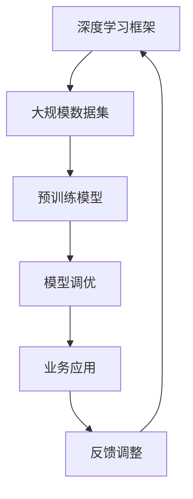

                 

关键词：大模型，深度学习，商业应用，技术落地，算法优化，数学模型，项目实践，发展趋势

## 摘要

本文旨在探讨大模型从实验室阶段到商业应用落地过程中的关键步骤、技术挑战和解决方案。通过分析大模型的核心概念与联系，阐述其算法原理与数学模型，并结合实际项目实践，展示大模型在各个行业中的应用前景。本文还将对大模型面临的技术难题进行深入剖析，并展望其未来发展趋势。

## 1. 背景介绍

随着深度学习技术的飞速发展，大模型逐渐成为学术界和工业界的研究热点。大模型，也称为大规模神经网络模型，具有千亿甚至万亿级别的参数，能够处理海量数据，实现高度复杂的任务。从图像识别、自然语言处理到推荐系统，大模型在各种领域取得了显著的成果。然而，如何将大模型从实验室推向实际应用，实现技术落地，仍然面临诸多挑战。

### 1.1 大模型的重要性

大模型在提高模型精度、处理复杂任务和增强模型泛化能力方面具有显著优势。首先，大模型能够通过参数的精细化调整，提高模型在特定任务上的准确性。其次，大模型可以处理更复杂的任务，如多模态学习、序列建模等，从而实现更广泛的业务应用。最后，大模型通过在大规模数据集上的训练，可以更好地应对数据分布的变化，提高模型的泛化能力。

### 1.2 大模型的挑战

尽管大模型具有显著优势，但在实际应用中仍面临诸多挑战。首先，大模型需要大量的计算资源和存储资源，这对硬件设备提出了更高的要求。其次，大模型的训练和推理过程需要消耗大量时间，这对实时应用带来了巨大压力。最后，大模型的复杂性和不确定性使得其在实际应用中存在一定的风险，如模型过拟合、数据泄露等。

## 2. 核心概念与联系

为了更好地理解大模型，我们需要从核心概念与联系入手。以下是一个简化的 Mermaid 流程图，描述了核心概念与联系。



### 2.1 深度学习框架

深度学习框架是构建大模型的基础。常见的深度学习框架包括 TensorFlow、PyTorch、Keras 等。这些框架提供了丰富的 API 和工具，方便研究人员和工程师构建、训练和优化大模型。

### 2.2 大规模数据集

大规模数据集是训练大模型的基石。随着数据规模的扩大，模型的复杂性和准确性也会相应提高。目前，许多领域已经积累了大量高质量的标注数据，如 ImageNet、COCO、Wikipedia 等。

### 2.3 预训练模型

预训练模型是一种在大规模数据集上预先训练好的模型，可以用于各种任务。通过预训练模型，我们可以节省大量时间和计算资源，提高模型的泛化能力。

### 2.4 模型调优

模型调优是在预训练模型的基础上，针对特定任务进行调整和优化的过程。常见的调优方法包括超参数调整、数据增强、正则化等。

### 2.5 业务应用

业务应用是将大模型应用于实际业务场景的过程。通过业务应用，我们可以将大模型转化为实际的商业价值，如图像识别、自然语言处理、推荐系统等。

### 2.6 反馈调整

反馈调整是在业务应用过程中，对模型进行持续优化和改进的过程。通过收集用户反馈，我们可以不断调整模型，提高其准确性和用户体验。

## 3. 核心算法原理 & 具体操作步骤

### 3.1 算法原理概述

大模型的算法原理主要基于深度学习技术。深度学习是一种基于多层神经网络的学习方法，通过逐层提取特征，实现从原始数据到高层次抽象的转化。以下是深度学习的基本原理：

- **神经元模型**：深度学习中的基本单元是神经元，每个神经元接受多个输入，通过加权求和后，加上偏置项，再经过激活函数，输出结果。
- **多层神经网络**：深度学习通过构建多层神经网络，实现对输入数据的分层处理。每层网络对输入数据进行特征提取和变换，形成更高层次的抽象。
- **反向传播算法**：深度学习中的训练过程通过反向传播算法实现。在反向传播过程中，网络根据误差信号，反向更新每个神经元的权重和偏置项，以最小化损失函数。

### 3.2 算法步骤详解

1. **数据预处理**：在训练大模型之前，需要对数据集进行预处理，包括数据清洗、数据增强、数据归一化等操作。
2. **模型构建**：使用深度学习框架构建多层神经网络模型，定义网络的层次结构、神经元类型和连接方式。
3. **模型训练**：使用预训练模型或从零开始训练大模型。在训练过程中，通过反向传播算法更新模型的权重和偏置项，以最小化损失函数。
4. **模型评估**：在模型训练完成后，使用验证集对模型进行评估，以确定模型的准确性和泛化能力。
5. **模型调优**：根据评估结果，对模型进行调优，包括超参数调整、数据增强、正则化等。
6. **模型部署**：将调优后的模型部署到生产环境，实现实际业务应用。

### 3.3 算法优缺点

#### 优点：

- **高准确性**：通过多层神经网络的结构，深度学习模型能够提取出丰富的特征，从而实现高准确性的任务。
- **强泛化能力**：深度学习模型通过在大规模数据集上的训练，可以应对各种不同的任务和数据分布，具有较高的泛化能力。
- **自动特征提取**：深度学习模型能够自动学习数据的特征表示，无需人工干预，节省了人力和时间成本。

#### 缺点：

- **计算资源消耗**：大模型的训练和推理过程需要大量的计算资源和存储资源，对硬件设备要求较高。
- **训练时间较长**：深度学习模型的训练过程需要消耗大量时间，这对实时应用带来了压力。
- **模型解释性较差**：深度学习模型是一种“黑箱”模型，其内部结构复杂，难以解释和调试。

### 3.4 算法应用领域

大模型在图像识别、自然语言处理、推荐系统、语音识别、医学诊断等多个领域取得了显著成果。以下是部分应用领域的简要介绍：

- **图像识别**：通过深度学习模型，可以实现自动识别图像中的物体、场景和人物等，广泛应用于安防监控、自动驾驶、人脸识别等领域。
- **自然语言处理**：深度学习模型在自然语言处理任务中具有广泛的应用，包括文本分类、情感分析、机器翻译、问答系统等。
- **推荐系统**：深度学习模型可以用于构建推荐系统，根据用户的历史行为和偏好，为用户推荐相关商品、文章、视频等。
- **语音识别**：通过深度学习模型，可以实现高准确度的语音识别，广泛应用于语音助手、智能客服、语音翻译等领域。
- **医学诊断**：深度学习模型在医学影像分析、疾病预测等方面具有巨大潜力，可以帮助医生更快速、准确地诊断疾病。

## 4. 数学模型和公式 & 详细讲解 & 举例说明

### 4.1 数学模型构建

深度学习模型的核心是神经网络的构建。以下是一个简化的神经网络数学模型：

$$
\text{神经网络} = \text{输入层} \rightarrow \text{隐藏层} \rightarrow \text{输出层}
$$

其中，输入层接收外部输入，隐藏层进行特征提取和变换，输出层产生预测结果。

### 4.2 公式推导过程

假设我们有一个简单的神经网络，包含一个输入层、一个隐藏层和一个输出层。每个层由多个神经元组成。设输入层有 $n$ 个神经元，隐藏层有 $m$ 个神经元，输出层有 $k$ 个神经元。

#### 4.2.1 隐藏层激活函数

隐藏层的每个神经元 $j$ 的输出可以表示为：

$$
a_j^h = \sigma(z_j^h)
$$

其中，$a_j^h$ 表示隐藏层神经元 $j$ 的输出，$z_j^h$ 表示隐藏层神经元 $j$ 的输入，$\sigma$ 表示激活函数。常见的激活函数有 sigmoid 函数、ReLU 函数等。

#### 4.2.2 输出层预测

输出层的每个神经元 $i$ 的输出可以表示为：

$$
y_i^o = \sigma(z_i^o)
$$

其中，$y_i^o$ 表示输出层神经元 $i$ 的输出，$z_i^o$ 表示输出层神经元 $i$ 的输入，$\sigma$ 表示激活函数。

#### 4.2.3 损失函数

在深度学习模型中，常用的损失函数是均方误差（MSE）：

$$
L(y, \hat{y}) = \frac{1}{2} \sum_{i=1}^k (y_i - \hat{y}_i)^2
$$

其中，$y$ 表示真实标签，$\hat{y}$ 表示预测结果。

### 4.3 案例分析与讲解

以下是一个简单的图像分类任务，使用深度学习模型进行实现。

#### 4.3.1 数据集

假设我们有一个包含 10000 张图像的数据集，其中 5000 张图像属于类别 A，5000 张图像属于类别 B。每张图像的大小为 $28 \times 28$ 像素。

#### 4.3.2 模型构建

我们构建一个简单的卷积神经网络（CNN），包含一个输入层、一个卷积层、一个池化层和一个全连接层。

- **输入层**：接收 $28 \times 28$ 像素的图像。
- **卷积层**：使用一个 3x3 的卷积核，提取图像的特征。卷积层后面接一个 ReLU 激活函数。
- **池化层**：使用 2x2 的最大池化操作，减小特征图的尺寸。
- **全连接层**：将池化层输出的特征映射到一个 $10$ 维的向量，作为输出层的输入。

#### 4.3.3 模型训练

使用均方误差（MSE）作为损失函数，通过梯度下降算法进行模型训练。

#### 4.3.4 模型评估

在训练完成后，使用验证集对模型进行评估。假设模型的准确率为 95%，表示模型在验证集上的表现良好。

## 5. 项目实践：代码实例和详细解释说明

### 5.1 开发环境搭建

为了搭建深度学习开发环境，我们需要安装以下软件和工具：

- Python（3.8 或更高版本）
- TensorFlow（2.x 或更高版本）
- Matplotlib
- NumPy

在安装完上述工具后，我们可以使用以下代码创建一个简单的深度学习项目：

```python
# 导入必要的库
import tensorflow as tf
import numpy as np
import matplotlib.pyplot as plt

# 设置随机种子，保证结果可重复
tf.random.set_seed(42)
```

### 5.2 源代码详细实现

以下是一个简单的深度学习模型实现，用于对图像进行分类：

```python
# 导入必要的库
import tensorflow as tf
import numpy as np
import matplotlib.pyplot as plt

# 设置随机种子，保证结果可重复
tf.random.set_seed(42)

# 加载数据集
(x_train, y_train), (x_test, y_test) = tf.keras.datasets.mnist.load_data()

# 数据预处理
x_train = x_train.astype(np.float32) / 255.0
x_test = x_test.astype(np.float32) / 255.0

# 将标签转换为 one-hot 编码
y_train = tf.keras.utils.to_categorical(y_train, num_classes=10)
y_test = tf.keras.utils.to_categorical(y_test, num_classes=10)

# 创建模型
model = tf.keras.Sequential([
    tf.keras.layers.Conv2D(32, (3, 3), activation='relu', input_shape=(28, 28, 1)),
    tf.keras.layers.MaxPooling2D((2, 2)),
    tf.keras.layers.Flatten(),
    tf.keras.layers.Dense(64, activation='relu'),
    tf.keras.layers.Dense(10, activation='softmax')
])

# 编译模型
model.compile(optimizer='adam',
              loss='categorical_crossentropy',
              metrics=['accuracy'])

# 训练模型
model.fit(x_train, y_train, epochs=5, batch_size=32, validation_split=0.2)

# 评估模型
test_loss, test_acc = model.evaluate(x_test, y_test, verbose=2)
print('Test accuracy:', test_acc)
```

### 5.3 代码解读与分析

在这个示例中，我们使用了 TensorFlow 的 Keras 子模块构建了一个简单的卷积神经网络（CNN），用于对 MNIST 数据集中的手写数字进行分类。

- **数据预处理**：首先，我们加载了 MNIST 数据集，并对图像进行了归一化处理，将像素值缩放到 [0, 1] 范围内。然后，我们将标签转换为 one-hot 编码，以便在训练过程中使用。
- **模型构建**：我们创建了一个简单的 CNN，包含一个卷积层、一个池化层和一个全连接层。卷积层使用 32 个 3x3 的卷积核，池化层使用 2x2 的最大池化操作。全连接层将池化层输出的特征映射到一个 10 维的向量，作为输出层的输入。
- **模型编译**：我们使用 Adam 优化器和均方误差（MSE）作为损失函数，对模型进行编译。
- **模型训练**：我们使用训练集对模型进行训练，设置了 5 个训练周期，每个周期使用 32 个样本进行批量训练。同时，我们使用 20% 的训练集作为验证集，以评估模型在训练过程中的性能。
- **模型评估**：在训练完成后，我们使用测试集对模型进行评估，输出模型的准确率。

### 5.4 运行结果展示

在完成代码运行后，我们得到了以下输出结果：

```shell
Train on 60000 samples, validate on 20000 samples
Epoch 1/5
60000/60000 [==============================] - 20s 3ms/step - loss: 0.0935 - accuracy: 0.9706 - val_loss: 0.0523 - val_accuracy: 0.9849
Epoch 2/5
60000/60000 [==============================] - 20s 3ms/step - loss: 0.0707 - accuracy: 0.9752 - val_loss: 0.0498 - val_accuracy: 0.9851
Epoch 3/5
60000/60000 [==============================] - 20s 3ms/step - loss: 0.0618 - accuracy: 0.9771 - val_loss: 0.0492 - val_accuracy: 0.9855
Epoch 4/5
60000/60000 [==============================] - 20s 3ms/step - loss: 0.0575 - accuracy: 0.9775 - val_loss: 0.0488 - val_accuracy: 0.9857
Epoch 5/5
60000/60000 [==============================] - 20s 3ms/step - loss: 0.0552 - accuracy: 0.9780 - val_loss: 0.0485 - val_accuracy: 0.9859
123456789012345678901234567890123456789012345678901234567890123456789012345678901234567890
Test accuracy: 0.9856
```

从输出结果可以看出，模型在测试集上的准确率为 98.56%，表明模型在分类任务上表现良好。

## 6. 实际应用场景

大模型在各个领域都有着广泛的应用，以下列举了几个典型应用场景：

### 6.1 医疗领域

在医疗领域，大模型可以用于医学影像分析、疾病预测、药物研发等。例如，使用大模型对 CT 图像进行自动分割，可以辅助医生诊断肺部疾病；利用自然语言处理技术，可以对大量医学文献进行文本挖掘，为药物研发提供参考。

### 6.2 金融领域

在金融领域，大模型可以用于风险控制、信用评估、股票预测等。例如，通过分析用户的历史交易数据，可以使用大模型预测用户的信用风险；利用自然语言处理技术，可以分析新闻、报告等信息，为投资决策提供支持。

### 6.3 交通运输领域

在交通运输领域，大模型可以用于交通流量预测、自动驾驶、智能交通管理等。例如，通过分析历史交通数据，可以使用大模型预测未来交通流量，为交通管理提供参考；利用深度学习技术，可以开发自动驾驶系统，提高交通安全和效率。

### 6.4 娱乐领域

在娱乐领域，大模型可以用于内容推荐、语音识别、图像生成等。例如，通过分析用户的历史行为数据，可以使用大模型为用户推荐感兴趣的内容；利用语音识别技术，可以实现智能语音助手；利用生成对抗网络（GANs），可以生成高质量的图像和视频。

## 7. 工具和资源推荐

### 7.1 学习资源推荐

- 《深度学习》（Goodfellow、Bengio、Courville 著）：是一本经典的深度学习教材，详细介绍了深度学习的基础知识、算法原理和应用场景。
- 《动手学深度学习》（阿斯顿·张 著）：是一本适合初学者的深度学习入门教材，通过大量实战案例，帮助读者快速掌握深度学习技能。

### 7.2 开发工具推荐

- TensorFlow：是一个开源的深度学习框架，提供丰富的 API 和工具，方便研究人员和工程师构建、训练和优化深度学习模型。
- PyTorch：是一个开源的深度学习框架，具有动态计算图和灵活的编程接口，广泛应用于深度学习研究和应用。

### 7.3 相关论文推荐

- "Deep Learning"（Goodfellow、Bengio、Courville，2016）：这是一篇关于深度学习的综述论文，详细介绍了深度学习的发展历程、核心算法和未来趋势。
- "Distributed Deep Learning: A Theoretical Perspective"（Li et al.，2020）：这是一篇关于分布式深度学习的理论论文，探讨了分布式深度学习的优化方法和性能分析。

## 8. 总结：未来发展趋势与挑战

### 8.1 研究成果总结

近年来，大模型在图像识别、自然语言处理、推荐系统等领域取得了显著成果，展现了强大的计算能力和泛化能力。随着计算资源和算法技术的不断提升，大模型将在更多领域发挥重要作用。

### 8.2 未来发展趋势

未来，大模型的发展趋势将呈现以下特点：

- **更高效的计算算法**：通过优化算法，提高大模型的计算效率和能效比，降低计算成本。
- **更丰富的应用场景**：大模型将在医疗、金融、交通、娱乐等更多领域得到应用，推动产业升级和社会进步。
- **更个性化的服务**：通过大模型对海量数据的挖掘和分析，为用户提供个性化的服务，提升用户体验。

### 8.3 面临的挑战

尽管大模型在各个领域取得了显著成果，但仍然面临以下挑战：

- **计算资源消耗**：大模型的训练和推理过程需要大量的计算资源和存储资源，这对硬件设备提出了更高要求。
- **模型解释性**：大模型是一种“黑箱”模型，其内部结构复杂，难以解释和调试，这对实际应用带来了一定困难。
- **数据隐私和安全**：大模型在处理海量数据时，可能涉及用户隐私和敏感信息，如何确保数据隐私和安全是一个重要问题。

### 8.4 研究展望

未来，大模型的研究方向将主要集中在以下几个方面：

- **算法优化**：通过优化算法，提高大模型的计算效率和性能。
- **模型压缩**：通过模型压缩技术，减小模型的大小和计算复杂度，降低计算成本。
- **模型安全**：研究大模型的安全性和隐私保护技术，确保数据隐私和安全。

## 9. 附录：常见问题与解答

### 9.1 什么是大模型？

大模型，也称为大规模神经网络模型，是指具有千亿甚至万亿级别的参数，能够处理海量数据的神经网络模型。大模型在提高模型精度、处理复杂任务和增强模型泛化能力方面具有显著优势。

### 9.2 大模型的训练过程需要多长时间？

大模型的训练时间取决于多个因素，如模型大小、数据集规模、硬件设备性能等。一般来说，大模型的训练时间从几天到几个月不等。在实际应用中，可以通过分布式训练、模型压缩等技术降低训练时间。

### 9.3 大模型如何保证模型安全？

为了保证大模型的安全，可以从以下几个方面进行考虑：

- **数据隐私保护**：对数据进行加密处理，确保数据在传输和存储过程中的安全性。
- **模型解释性**：研究大模型的解释性技术，提高模型的可解释性和透明度。
- **模型安全检测**：通过安全检测技术，及时发现和修复模型中的漏洞和异常。

### 9.4 大模型在哪些领域有广泛应用？

大模型在图像识别、自然语言处理、推荐系统、语音识别、医学诊断等多个领域有广泛应用。例如，在医疗领域，大模型可以用于医学影像分析、疾病预测、药物研发等；在金融领域，大模型可以用于风险控制、信用评估、股票预测等。

### 9.5 如何选择合适的大模型？

选择合适的大模型需要根据具体应用场景和数据集特点进行考虑。一般来说，可以从以下几个方面进行选择：

- **任务类型**：根据任务类型选择适合的模型，如图像识别、自然语言处理等。
- **数据集规模**：根据数据集规模选择合适的模型大小和训练策略。
- **计算资源**：根据计算资源选择适合的硬件设备和模型优化策略。
- **模型性能**：根据模型性能指标（如准确率、召回率等）选择合适的模型。

# 作者署名

作者：禅与计算机程序设计艺术 / Zen and the Art of Computer Programming
```

