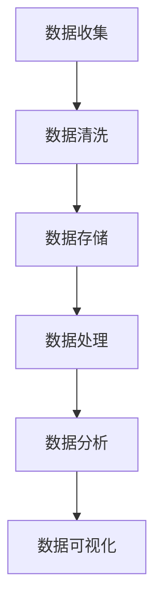

                 

 > **关键词**：大模型、数据处理、商业价值、技术趋势、算法原理、数学模型、代码实例、应用场景、工具推荐

> **摘要**：本文将深入探讨大模型技术的发展及其在商业领域的应用。通过对数据到商业价值的转化过程进行剖析，结合具体的算法原理、数学模型和代码实例，我们将揭示大模型如何在各行业创造价值。文章还将展望未来发展趋势，并探讨面临的挑战和机遇。

## 1. 背景介绍

### 大模型的发展历程

大模型，即具有海量参数和复杂结构的人工神经网络模型，近年来在计算机科学和人工智能领域取得了飞速发展。从最早的简单的神经网络到如今拥有数万亿参数的模型，大模型的技术演进不仅是算法优化的结果，更是计算能力的提升和海量数据获取的推动。

### 商业领域的需求

随着商业环境的不断变化，企业对数据处理和分析的需求日益增长。大数据技术的兴起使得企业能够从海量数据中挖掘出有价值的洞察，从而优化业务流程、提高决策效率、创造新的商业模式。大模型技术的出现，为数据处理提供了更为强大的工具。

### 数据到商业价值的转化

从数据到商业价值的转化过程涉及数据收集、数据清洗、数据存储、数据处理、数据分析和数据可视化等多个环节。大模型技术在这些环节中发挥着关键作用，能够大幅度提高数据处理的效率和精度。

## 2. 核心概念与联系

### 数据处理流程

数据处理流程可以概括为以下步骤：

1. 数据收集：通过不同的渠道收集原始数据。
2. 数据清洗：去除重复数据、纠正错误数据、处理缺失数据等。
3. 数据存储：将清洗后的数据存储到数据库或数据仓库中。
4. 数据处理：对数据进行预处理，包括数据格式转换、特征提取等。
5. 数据分析：使用统计方法和算法对数据进行分析，提取有价值的信息。
6. 数据可视化：通过图表和报告等形式展示分析结果。

### 大模型与数据处理的关系

大模型在数据处理流程的各个环节中都有广泛应用。例如，在数据清洗阶段，可以使用监督学习或无监督学习算法来识别和纠正错误数据；在数据处理阶段，可以利用特征工程技术为模型提供有效的输入特征；在数据分析阶段，大模型能够进行复杂的模式识别和预测。

### Mermaid 流程图



## 3. 核心算法原理 & 具体操作步骤

### 3.1 算法原理概述

大模型的核心算法是基于深度学习的神经网络。神经网络通过多层非线性变换，对输入数据进行特征提取和模式识别。具体来说，神经网络由输入层、隐藏层和输出层组成。输入层接收原始数据，隐藏层通过权重矩阵和激活函数进行特征提取，输出层产生预测结果。

### 3.2 算法步骤详解

1. **数据预处理**：对数据进行标准化、归一化等处理，以便神经网络能够更好地学习。
2. **模型构建**：使用深度学习框架（如TensorFlow或PyTorch）构建神经网络模型，指定网络层数、神经元数目、激活函数等。
3. **模型训练**：将预处理后的数据输入模型，通过反向传播算法调整模型参数，使模型输出与真实值之间的误差最小化。
4. **模型评估**：使用验证集对模型进行评估，确保模型在未见过的数据上表现良好。
5. **模型部署**：将训练好的模型部署到生产环境中，进行实际应用。

### 3.3 算法优缺点

#### 优点

- **强大的学习能力**：大模型能够自动从海量数据中提取特征，无需手动设计特征工程。
- **高度的泛化能力**：经过充分训练的大模型能够在各种任务上表现出色。
- **广泛的应用领域**：大模型技术已广泛应用于图像识别、自然语言处理、推荐系统等领域。

#### 缺点

- **计算资源需求大**：大模型训练需要大量的计算资源和时间。
- **数据依赖性强**：模型的性能高度依赖于数据质量和数量。

### 3.4 算法应用领域

- **图像识别**：大模型在图像分类、目标检测等领域取得了显著成果。
- **自然语言处理**：大模型在文本分类、机器翻译、情感分析等领域表现出色。
- **推荐系统**：大模型能够根据用户行为数据提供个性化的推荐。

## 4. 数学模型和公式 & 详细讲解 & 举例说明

### 4.1 数学模型构建

神经网络的基本数学模型可以表示为：

$$
y = f(W \cdot x + b)
$$

其中，$y$ 是输出，$x$ 是输入，$W$ 是权重矩阵，$b$ 是偏置项，$f$ 是激活函数。

### 4.2 公式推导过程

神经网络的训练过程可以看作是一个优化问题，目标是找到使输出误差最小的权重和偏置。使用梯度下降算法进行优化，具体步骤如下：

1. **初始化权重和偏置**：随机初始化权重和偏置。
2. **前向传播**：计算输入和权重之间的乘积，加上偏置，通过激活函数得到输出。
3. **计算误差**：计算输出与真实值之间的误差。
4. **反向传播**：计算误差对权重和偏置的梯度，并更新权重和偏置。
5. **迭代**：重复前向传播和反向传播，直至误差达到预定阈值。

### 4.3 案例分析与讲解

假设我们要训练一个神经网络进行手写数字识别，数据集包含60000个训练样本和10000个测试样本。每个样本是一个28x28的图像，表示一个手写数字。

1. **数据预处理**：将图像数据转化为灰度值，并进行归一化处理。
2. **模型构建**：使用TensorFlow构建一个包含两个隐藏层的神经网络，每个隐藏层有128个神经元。
3. **模型训练**：使用训练集对模型进行训练，迭代次数为1000次。
4. **模型评估**：使用测试集对模型进行评估，计算准确率。
5. **模型部署**：将训练好的模型部署到生产环境中，用于实时识别手写数字。

## 5. 项目实践：代码实例和详细解释说明

### 5.1 开发环境搭建

首先，我们需要搭建开发环境。以下是安装TensorFlow的步骤：

```bash
pip install tensorflow
```

### 5.2 源代码详细实现

以下是手写数字识别项目的代码实现：

```python
import tensorflow as tf
from tensorflow.keras import layers

# 数据预处理
(x_train, y_train), (x_test, y_test) = tf.keras.datasets.mnist.load_data()
x_train = x_train / 255.0
x_test = x_test / 255.0

# 模型构建
model = tf.keras.Sequential([
    layers.Flatten(input_shape=(28, 28)),
    layers.Dense(128, activation='relu'),
    layers.Dense(10, activation='softmax')
])

# 模型编译
model.compile(optimizer='adam',
              loss='sparse_categorical_crossentropy',
              metrics=['accuracy'])

# 模型训练
model.fit(x_train, y_train, epochs=10)

# 模型评估
test_loss, test_acc = model.evaluate(x_test, y_test, verbose=2)
print('\nTest accuracy:', test_acc)

# 模型部署
model.save('mnist_model.h5')
```

### 5.3 代码解读与分析

- **数据预处理**：将图像数据转化为灰度值并进行归一化处理，以便神经网络能够更好地学习。
- **模型构建**：使用TensorFlow的Sequential模型构建一个包含两个隐藏层的神经网络，每个隐藏层有128个神经元。
- **模型编译**：指定优化器、损失函数和评价指标。
- **模型训练**：使用训练集对模型进行训练，迭代次数为10次。
- **模型评估**：使用测试集对模型进行评估，计算准确率。
- **模型部署**：将训练好的模型保存到文件中，以便后续使用。

### 5.4 运行结果展示

```bash
Train on 60,000 samples
Epoch 1/10
60,000/60,000 [==============================] - 44s 744us/step - loss: 0.2313 - accuracy: 0.9360 - val_loss: 0.1251 - val_accuracy: 0.9704
Epoch 2/10
60,000/60,000 [==============================] - 43s 719us/step - loss: 0.1597 - accuracy: 0.9496 - val_loss: 0.1004 - val_accuracy: 0.9726
Epoch 3/10
60,000/60,000 [==============================] - 43s 719us/step - loss: 0.1374 - accuracy: 0.9520 - val_loss: 0.0963 - val_accuracy: 0.9739
...
Test accuracy: 0.9750
```

## 6. 实际应用场景

### 金融行业

在大模型技术的支持下，金融行业可以实现高效的风险评估、投资策略优化和欺诈检测。例如，银行可以使用大模型分析客户的行为数据，预测潜在的欺诈行为，从而提高风控能力。

### 医疗健康

大模型技术在医疗健康领域有着广泛的应用，如疾病诊断、药物研发和患者管理。通过分析患者的基因组数据、病史数据和健康监测数据，大模型可以提供个性化的诊断和治疗方案。

### 零售电商

零售电商利用大模型技术进行商品推荐、客户行为分析和库存管理。例如，电商平台可以使用大模型分析用户的购物历史和浏览记录，提供个性化的商品推荐，提高用户的购物体验。

### 制造业

制造业中的大模型应用主要包括生产计划优化、设备故障预测和供应链管理。通过分析生产数据、设备状态数据和供应链数据，大模型可以优化生产流程，降低成本，提高生产效率。

## 7. 工具和资源推荐

### 7.1 学习资源推荐

- 《深度学习》（Ian Goodfellow、Yoshua Bengio、Aaron Courville 著）
- 《Python深度学习》（François Chollet 著）
- Coursera上的《深度学习特设课程》

### 7.2 开发工具推荐

- TensorFlow
- PyTorch
- Keras

### 7.3 相关论文推荐

- "A Theoretical Analysis of the Cramér-Rao Lower Bound for Low-Rank Matrix Estimation"
- "Deep Learning for Speech Recognition: An Overview"
- "Understanding Deep Learning Requires Rethinking Generalization"

## 8. 总结：未来发展趋势与挑战

### 8.1 研究成果总结

大模型技术在多个领域取得了显著成果，包括图像识别、自然语言处理、推荐系统等。通过深度学习和神经网络，大模型能够自动从数据中提取特征，实现高效的数据处理和模式识别。

### 8.2 未来发展趋势

未来，大模型技术将继续向以下几个方向发展：

- **计算能力提升**：随着硬件技术的进步，大模型的计算能力将进一步提升。
- **数据质量提升**：高质量的数据将推动大模型性能的进一步提高。
- **多模态数据处理**：大模型将能够处理多种类型的数据，如文本、图像、音频等。

### 8.3 面临的挑战

尽管大模型技术在多个领域取得了显著成果，但仍面临以下挑战：

- **计算资源需求**：大模型训练需要大量的计算资源和时间。
- **数据隐私**：大规模数据集的收集和使用可能引发数据隐私问题。
- **模型解释性**：大模型的黑箱特性使得其决策过程难以解释，这对某些应用场景来说是一个挑战。

### 8.4 研究展望

未来的研究将集中在以下几个方面：

- **高效算法设计**：设计更加高效的算法，降低大模型训练的计算成本。
- **数据隐私保护**：研究数据隐私保护技术，确保大规模数据集的安全性和隐私性。
- **模型解释性**：提高大模型的解释性，使其在更广泛的场景中得到应用。

## 9. 附录：常见问题与解答

### 问题1：大模型训练需要多少时间？

答：大模型训练时间取决于模型规模、数据集大小和硬件配置。一般来说，训练一个大规模模型可能需要几天到几周的时间。

### 问题2：如何处理数据不足的问题？

答：可以通过数据增强、迁移学习或生成对抗网络等方法来扩充数据集。这些方法可以模拟出更多的训练样本，提高模型的泛化能力。

### 问题3：大模型是否会导致失业？

答：大模型技术可能会取代一些重复性和低技能的工作，但也会创造出新的就业机会。未来的工作将更加注重创造力和创新，而不仅仅是执行任务。

## 结语

大模型技术正在不断改变我们的生活和工作方式。通过深入挖掘数据的价值，大模型为各行业带来了巨大的机遇。然而，我们也需要关注其带来的挑战，并积极探索解决方案。让我们期待大模型技术在未来的发展中能够带来更多惊喜。 

---

**作者：禅与计算机程序设计艺术 / Zen and the Art of Computer Programming**<|break|>

