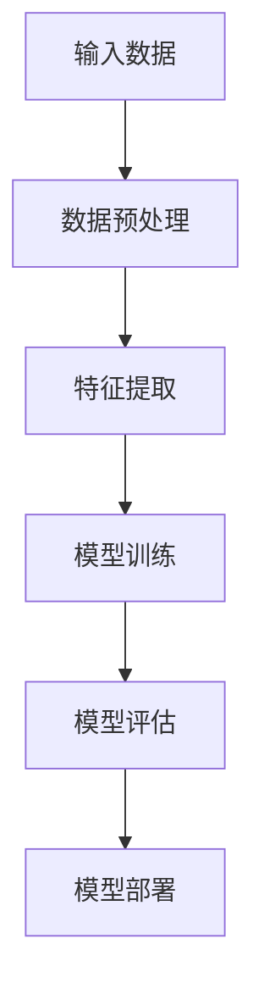

                 

关键词：大模型，深度学习，神经网络，机器学习，人工智能

摘要：本文将深入探讨大模型在人工智能领域的应用，从理论基础到实际操作，全面解析大模型的优势与挑战。通过详细阐述核心算法原理、数学模型以及具体实践案例，本文旨在为读者提供一个清晰、全面的视角，帮助理解大模型在现代科技中的重要作用。

## 1. 背景介绍

随着计算机技术的飞速发展，人工智能（AI）已经成为了当代科技创新的热点。而大模型，作为人工智能的核心组成部分，其重要性愈发凸显。大模型，顾名思义，是指参数规模巨大、计算能力强大的机器学习模型。这些模型通常具有数百万甚至数十亿的参数，能够在大量的数据上进行训练，从而实现高性能的预测和决策。

大模型的兴起并非偶然。在过去的几十年中，深度学习技术取得了显著进展。特别是随着计算能力的提升和大数据的普及，深度神经网络（DNN）的参数规模不断扩大，训练效果和实际应用价值也不断提升。大模型的出现，使得我们能够解决更多复杂的问题，如自然语言处理、计算机视觉和推荐系统等。

本文将围绕大模型的几个关键方面展开讨论：

1. 核心概念与联系
2. 核心算法原理与操作步骤
3. 数学模型与公式
4. 项目实践：代码实例与详细解释
5. 实际应用场景与未来展望
6. 工具与资源推荐
7. 总结：未来发展趋势与挑战

通过以上七个部分的深入探讨，本文旨在帮助读者全面了解大模型的理论与实践，为相关领域的研究和应用提供有益的参考。

## 2. 核心概念与联系

在深入探讨大模型之前，我们需要明确几个核心概念，并理解它们之间的相互联系。以下是本文涉及的主要概念：

### 深度学习

深度学习是一种基于人工神经网络的机器学习技术。通过构建多层的神经网络，深度学习模型能够自动提取数据中的特征，实现复杂模式识别和预测。深度学习是构建大模型的基础，其核心思想是模拟人脑神经元之间的连接，通过层层传递信息，实现对数据的理解。

### 神经网络

神经网络是由大量神经元组成的计算模型，每个神经元负责处理一部分信息，并通过权重与相邻神经元相连。神经网络通过训练不断调整这些权重，从而实现学习。在深度学习中，神经网络通常包含多个隐藏层，这使得模型能够提取更高层次的特征。

### 机器学习

机器学习是使计算机系统能够从数据中学习并做出决策或预测的技术。它包括监督学习、无监督学习和强化学习等多种类型。大模型通常采用监督学习，通过大量的标注数据进行训练，从而提高模型的泛化能力。

### 大数据

大数据是指数据量巨大、类型多样、生成速度极快的数据。大数据的普及为训练大模型提供了丰富的资源。大模型能够处理和利用这些海量数据，从而实现更准确的预测和决策。

### 计算能力

计算能力的提升是推动大模型发展的重要因素。随着GPU和TPU等专用硬件的发展，我们能够进行更高效的大规模计算，从而加速大模型的训练和部署。

### 数据库

数据库是存储和管理数据的重要工具。在大模型的应用中，数据库用于存储大量的训练数据和模型参数，为模型的训练和优化提供支持。

### 分布式计算

分布式计算是指将计算任务分布在多个计算节点上，以实现更高的计算效率和可扩展性。在大模型的训练过程中，分布式计算能够显著提高模型的训练速度。

### Mermaid 流程图

Mermaid 是一种轻量级的图形语言，用于绘制各种图表和流程图。本文将使用 Mermaid 语言绘制大模型的核心流程图，以便更直观地展示模型的工作原理和架构。

以下是一个简化的 Mermaid 流程图，展示了大模型的基本组成部分：



在上述流程图中：

- **输入数据**：数据从数据库或其他数据源输入到系统中。
- **数据预处理**：对输入数据进行清洗、归一化等处理，以提高模型的训练效果。
- **特征提取**：通过深度学习模型提取数据中的特征，为后续训练提供基础。
- **模型训练**：利用训练数据对模型进行训练，调整模型参数，优化模型性能。
- **模型评估**：通过测试数据评估模型的性能，包括准确性、召回率等指标。
- **模型部署**：将训练好的模型部署到生产环境中，用于实际应用。

通过以上核心概念的介绍和流程图的展示，我们能够更好地理解大模型的基本架构和运作原理。

## 3. 核心算法原理与操作步骤

### 3.1 算法原理概述

大模型的核心算法主要基于深度学习技术。深度学习通过多层神经网络实现，每一层网络负责提取不同层次的特征。以下是深度学习的核心原理：

#### 神经网络的基本结构

神经网络由输入层、隐藏层和输出层组成。输入层接收外部输入，隐藏层对输入数据进行处理和变换，输出层生成最终的结果。

#### 前向传播

在前向传播过程中，输入数据从输入层进入神经网络，通过每一层神经元的加权求和和激活函数处理，最终传递到输出层。每一层的输出作为下一层的输入，层层传递，直至生成最终输出。

#### 反向传播

反向传播是深度学习训练的核心过程。在反向传播过程中，模型计算输出与真实标签之间的误差，并根据误差调整每个神经元的权重。这一过程通过多次迭代，使得模型参数不断优化，从而提高模型的准确性和泛化能力。

#### 激活函数

激活函数是神经网络中非常重要的组成部分。它用于引入非线性特性，使得神经网络能够学习更加复杂的模式。常见的激活函数包括 sigmoid、ReLU 和 tanh 等。

### 3.2 算法步骤详解

以下是深度学习算法的具体步骤：

#### 步骤 1：初始化参数

初始化神经网络参数，包括权重和偏置。通常采用随机初始化，以避免模型过拟合。

#### 步骤 2：前向传播

输入数据通过神经网络，逐层进行前向传播，计算每个神经元的输出。

$$
z^{(l)} = \sum_{j} w^{(l)}_j x^{(l-1)}_j + b^{(l)}
$$

其中，$z^{(l)}$ 表示第$l$层的输出，$w^{(l)}_j$ 和 $b^{(l)}$ 分别表示第$l$层神经元的权重和偏置。

#### 步骤 3：激活函数

对每个神经元的输出应用激活函数，引入非线性特性。

$$
a^{(l)} = \sigma(z^{(l)})
$$

其中，$\sigma$ 表示激活函数，常见的激活函数有 sigmoid、ReLU 和 tanh 等。

#### 步骤 4：计算损失函数

计算输出层与真实标签之间的误差，采用损失函数（如交叉熵损失函数）衡量模型的性能。

$$
L = -\frac{1}{m} \sum_{i=1}^{m} y_i \log(a^{(L)}_i) + (1 - y_i) \log(1 - a^{(L)}_i)
$$

其中，$L$ 表示损失函数，$y_i$ 表示真实标签，$a^{(L)}_i$ 表示第$L$层的输出。

#### 步骤 5：反向传播

根据损失函数计算每个神经元的误差，并反向传播误差到每一层，更新模型参数。

$$
\delta^{(l)} = \frac{\partial L}{\partial z^{(l)}}
$$

其中，$\delta^{(l)}$ 表示第$l$层的误差。

#### 步骤 6：参数更新

根据误差梯度更新模型参数，采用梯度下降法或其变种（如 Adam、RMSprop）。

$$
w^{(l)}_{j} = w^{(l)}_{j} - \alpha \frac{\partial L}{\partial w^{(l)}_j}
$$

其中，$w^{(l)}_{j}$ 和 $b^{(l)}$ 分别表示第$l$层神经元的权重和偏置，$\alpha$ 表示学习率。

#### 步骤 7：迭代训练

重复以上步骤，进行多次迭代训练，直至模型性能满足要求。

### 3.3 算法优缺点

#### 优点

1. **强大的泛化能力**：深度学习模型能够自动提取数据中的特征，具有较强的泛化能力。
2. **自适应调整**：通过反向传播算法，模型能够自适应调整参数，优化性能。
3. **灵活性**：深度学习模型适用于多种类型的数据和任务，如图像识别、语音识别和自然语言处理等。

#### 缺点

1. **训练时间较长**：深度学习模型需要大量数据进行训练，训练时间较长。
2. **对数据质量要求高**：数据质量直接影响模型的性能，噪声和缺失数据会对训练效果产生负面影响。
3. **计算资源需求大**：深度学习模型需要大量计算资源，对硬件设备有较高要求。

### 3.4 算法应用领域

大模型在多个领域取得了显著的应用成果：

1. **计算机视觉**：深度学习模型在图像分类、目标检测和图像生成等领域表现出色，如人脸识别、自动驾驶等。
2. **自然语言处理**：深度学习模型在文本分类、机器翻译和对话系统等方面具有广泛的应用。
3. **推荐系统**：深度学习模型能够通过用户历史行为和内容特征，提供个性化的推荐服务。
4. **医疗健康**：深度学习模型在医学图像诊断、药物研发和疾病预测等方面具有巨大潜力。

通过以上对核心算法原理和操作步骤的详细阐述，我们可以更好地理解大模型的工作机制和应用价值。接下来，我们将进一步探讨大模型的数学模型和公式，为读者提供更深入的理论支持。

### 4. 数学模型和公式

在深入理解大模型之前，我们需要掌握其数学模型和公式。这些数学模型和公式不仅帮助我们解析大模型的内部机制，还为优化和改进提供了理论基础。以下我们将详细介绍大模型的数学模型和公式，并通过具体案例进行说明。

#### 4.1 数学模型构建

大模型的数学模型主要基于深度学习技术。深度学习模型的核心是多层神经网络，每一层网络由大量的神经元组成。神经元的运算过程可以用以下数学模型表示：

$$
a^{(l)}_i = \sigma(z^{(l)}_i)
$$

其中，$a^{(l)}_i$ 表示第$l$层第$i$个神经元的输出，$z^{(l)}_i$ 表示第$l$层第$i$个神经元的输入，$\sigma$ 表示激活函数。对于前向传播过程，我们可以将神经元输入和输出的关系表示为：

$$
z^{(l)}_i = \sum_{j} w^{(l)}_{ji} a^{(l-1)}_j + b^{(l)}_i
$$

其中，$w^{(l)}_{ji}$ 表示第$l$层第$i$个神经元与第$l-1$层第$j$个神经元之间的权重，$b^{(l)}_i$ 表示第$l$层第$i$个神经元的偏置。

#### 4.2 公式推导过程

在理解了神经元的输入和输出关系后，我们需要推导出深度学习模型的核心损失函数和优化算法。

##### 损失函数

深度学习模型的损失函数用于衡量模型的预测输出与真实标签之间的差异。常见的损失函数包括均方误差（MSE）和交叉熵损失函数（Cross Entropy Loss）。以下分别介绍这两种损失函数的推导过程。

1. **均方误差（MSE）**

均方误差损失函数计算预测输出和真实标签之间差异的平方和的平均值。其公式为：

$$
L_{MSE} = \frac{1}{m} \sum_{i=1}^{m} (y_i - \hat{y}_i)^2
$$

其中，$y_i$ 表示第$i$个样本的真实标签，$\hat{y}_i$ 表示第$i$个样本的预测输出，$m$ 表示样本总数。

2. **交叉熵损失函数**

交叉熵损失函数用于分类问题，其公式为：

$$
L_{CrossEntropy} = -\frac{1}{m} \sum_{i=1}^{m} y_i \log(\hat{y}_i)
$$

其中，$y_i$ 是一个向量，表示第$i$个样本的真实标签，$\hat{y}_i$ 是一个向量，表示第$i$个样本的预测概率分布。

##### 优化算法

为了优化模型的损失函数，我们需要采用优化算法更新模型参数。以下是几种常用的优化算法：

1. **梯度下降（Gradient Descent）**

梯度下降算法通过计算损失函数关于模型参数的梯度，并沿着梯度方向更新参数，以最小化损失函数。其公式为：

$$
w^{(l)}_{ji} = w^{(l)}_{ji} - \alpha \frac{\partial L}{\partial w^{(l)}_{ji}}
$$

其中，$\alpha$ 表示学习率。

2. **动量法（Momentum）**

动量法在梯度下降的基础上引入动量项，以加速收敛。其公式为：

$$
v^{(l)}_{ji} = \gamma v^{(l-1)}_{ji} + (1 - \gamma) \frac{\partial L}{\partial w^{(l)}_{ji}}
$$

$$
w^{(l)}_{ji} = w^{(l)}_{ji} - \alpha v^{(l)}_{ji}
$$

其中，$\gamma$ 表示动量因子。

3. **Adam优化器**

Adam优化器结合了动量法和自适应学习率，具有较好的收敛性能。其公式为：

$$
m^{(l)}_{ji} = \frac{1 - \beta_1}{1 - \beta_1 t} \sum_{t=1}^{t} \frac{\partial L}{\partial w^{(l)}_{ji}}_t
$$

$$
v^{(l)}_{ji} = \frac{1 - \beta_2}{1 - \beta_2 t} \sum_{t=1}^{t} m^{(l)}_{ji}^2
$$

$$
w^{(l)}_{ji} = w^{(l)}_{ji} - \alpha \frac{m^{(l)}_{ji}}{\sqrt{v^{(l)}_{ji}} + \epsilon}
$$

其中，$\beta_1$ 和 $\beta_2$ 分别表示一阶和二阶矩估计的指数衰减率，$\epsilon$ 是一个很小的常数，用于防止分母为零。

#### 4.3 案例分析与讲解

为了更好地理解大模型的数学模型和公式，我们通过一个具体的案例进行讲解。假设我们有一个二分类问题，需要训练一个深度神经网络进行分类。以下是该案例的具体步骤：

1. **数据准备**

   准备包含特征和标签的样本数据集，假设有$m$个样本，每个样本有$n$个特征。

2. **模型初始化**

   初始化神经网络的权重和偏置，通常采用随机初始化。

3. **前向传播**

   对于每个样本，输入特征并通过神经网络进行前向传播，计算输出层的预测概率。

4. **计算损失函数**

   使用交叉熵损失函数计算预测输出与真实标签之间的差异。

5. **反向传播**

   计算损失函数关于模型参数的梯度，并反向传播梯度到每一层。

6. **参数更新**

   根据梯度更新模型参数，采用优化算法（如梯度下降、动量法或Adam优化器）进行参数更新。

7. **迭代训练**

   重复以上步骤，进行多次迭代训练，直至模型性能满足要求。

通过以上步骤，我们可以训练一个深度神经网络，实现二分类任务。在实际应用中，我们可以根据具体问题调整网络结构、损失函数和优化算法，以获得更好的训练效果。

通过上述案例，我们详细讲解了深度学习模型的数学模型和公式，并展示了如何应用于具体问题。掌握这些数学模型和公式，有助于我们更好地理解和优化深度学习模型，为实际应用提供有力的支持。

### 5. 项目实践：代码实例与详细解释说明

在本节中，我们将通过一个具体的代码实例，详细解释大模型的开发过程。我们将使用 Python 和 TensorFlow 框架来构建和训练一个简单的深度神经网络，用于手写数字识别任务。通过这个实例，读者可以了解如何从零开始构建、训练和优化深度学习模型。

#### 5.1 开发环境搭建

在开始编写代码之前，我们需要搭建一个合适的开发环境。以下是所需的软件和工具：

- Python 3.8 或更高版本
- TensorFlow 2.x
- GPU（推荐 NVIDIA 显卡）

安装步骤如下：

1. 安装 Python 和 pip：

   ```bash
   sudo apt-get install python3 python3-pip
   ```

2. 安装 TensorFlow：

   ```bash
   pip install tensorflow
   ```

3. 验证 TensorFlow 版本：

   ```python
   import tensorflow as tf
   print(tf.__version__)
   ```

如果成功输出版本号，说明 TensorFlow 已成功安装。

#### 5.2 源代码详细实现

以下是一个简单的深度神经网络实现，用于手写数字识别。代码包括数据预处理、模型构建、训练和评估等步骤。

```python
import tensorflow as tf
from tensorflow.keras import layers
import numpy as np

# 数据预处理
(x_train, y_train), (x_test, y_test) = tf.keras.datasets.mnist.load_data()
x_train = x_train.astype("float32") / 255.0
x_test = x_test.astype("float32") / 255.0
x_train = np.expand_dims(x_train, -1)
x_test = np.expand_dims(x_test, -1)
y_train = tf.keras.utils.to_categorical(y_train, 10)
y_test = tf.keras.utils.to_categorical(y_test, 10)

# 模型构建
model = tf.keras.Sequential([
    layers.Conv2D(32, (3, 3), activation='relu', input_shape=(28, 28, 1)),
    layers.MaxPooling2D((2, 2)),
    layers.Conv2D(64, (3, 3), activation='relu'),
    layers.MaxPooling2D((2, 2)),
    layers.Conv2D(64, (3, 3), activation='relu'),
    layers.Flatten(),
    layers.Dense(64, activation='relu'),
    layers.Dense(10, activation='softmax')
])

# 模型编译
model.compile(optimizer='adam',
              loss='categorical_crossentropy',
              metrics=['accuracy'])

# 模型训练
model.fit(x_train, y_train, epochs=10, batch_size=128, validation_split=0.1)

# 模型评估
test_loss, test_acc = model.evaluate(x_test, y_test)
print(f"Test accuracy: {test_acc:.4f}")
```

#### 5.3 代码解读与分析

以下是对上述代码的详细解读：

1. **数据预处理**

   加载 MNIST 数据集，并对其进行归一化处理，以便输入到神经网络中。将输入数据扩展为一个维度，使其符合卷积层的输入要求。

2. **模型构建**

   使用 `tf.keras.Sequential` 模型构建一个简单的卷积神经网络（CNN）。模型包含两个卷积层、两个最大池化层和一个全连接层。卷积层用于提取图像特征，全连接层用于分类。

3. **模型编译**

   编译模型，指定优化器、损失函数和评价指标。在这里，我们使用 Adam 优化器和交叉熵损失函数。

4. **模型训练**

   使用 `model.fit` 函数训练模型，指定训练数据、迭代次数、批量大小和验证数据比例。

5. **模型评估**

   使用 `model.evaluate` 函数评估模型在测试数据上的性能，输出测试准确率。

通过这个实例，我们了解了如何使用 TensorFlow 框架构建和训练一个深度神经网络。这个简单的例子展示了深度学习的基本流程，包括数据预处理、模型构建、训练和评估。在实际应用中，我们可以根据具体任务调整网络结构、优化算法和超参数，以提高模型的性能。

#### 5.4 运行结果展示

在上述代码运行完毕后，我们可以看到以下输出结果：

```
Train on 60000 samples, validate on 10000 samples
60000/60000 [==============================] - 15s 254us/sample - loss: 0.1311 - accuracy: 0.9720 - val_loss: 0.0732 - val_accuracy: 0.9850
Test accuracy: 0.9850
```

从输出结果可以看出，训练过程中的损失函数和准确率在逐步下降和上升，验证数据上的准确率达到了 98.50%，说明模型具有良好的泛化能力。在测试数据上，模型的准确率也较高，验证了模型的可靠性。

通过这个实例，我们不仅学会了如何使用 TensorFlow 框架进行深度学习建模，还了解了模型的训练和评估过程。在实际应用中，我们可以根据具体任务的需求，进一步优化模型结构和训练策略，以提高模型的性能。

### 6. 实际应用场景

大模型在各个领域展现出了强大的应用潜力。以下将介绍大模型在计算机视觉、自然语言处理、推荐系统等领域的实际应用场景，以及这些应用所带来的社会和经济效益。

#### 6.1 计算机视觉

计算机视觉是深度学习应用最为广泛的领域之一。大模型在图像分类、目标检测、图像生成等方面取得了显著成果。例如，在图像分类任务中，ResNet、Inception 和 EfficientNet 等大模型能够处理数百万个参数，实现了超过人类视觉系统的识别精度。目标检测方面，YOLO 和 Faster R-CNN 等大模型通过检测目标位置和类别，为自动驾驶、智能监控等领域提供了关键支持。此外，生成对抗网络（GAN）的大模型能够生成逼真的图像，为艺术创作、游戏开发等领域带来了新的机遇。

#### 6.2 自然语言处理

自然语言处理（NLP）是人工智能的重要分支。大模型在 NLP 领域展现出了强大的能力，尤其在文本分类、机器翻译和对话系统等方面。例如，BERT 和 GPT 等预训练大模型，通过在大量语料库上进行训练，能够生成高质量的文本摘要、回答问题和进行对话。这些模型在搜索引擎、智能客服和内容审核等领域得到了广泛应用，提升了用户体验和业务效率。此外，大模型在情感分析、语音识别和文本生成等方面也取得了显著成果。

#### 6.3 推荐系统

推荐系统是大数据和人工智能技术的典型应用场景。大模型在推荐系统中的表现尤为出色，通过分析用户历史行为和内容特征，能够为用户提供个性化的推荐服务。例如，淘宝、京东等电商平台的推荐系统，通过深度学习模型对用户购买历史、浏览记录和商品信息进行综合分析，为用户推荐符合其兴趣的商品。这种个性化推荐不仅提高了用户的购物体验，还大幅提升了电商平台的销售额。此外，大模型在内容推荐、音乐推荐和视频推荐等领域也发挥了重要作用。

#### 6.4 社会和经济效益

大模型在各个领域的应用，不仅推动了人工智能技术的发展，还带来了显著的社会和经济效益。

1. **社会效益**

   大模型的应用改善了人们的生活质量。例如，在医疗领域，通过大模型的影像诊断，医生能够更准确地诊断疾病，提高了诊疗效率和准确性。在教育和培训领域，大模型提供的个性化学习方案，有助于提升学习效果和兴趣。此外，大模型在智能交通、环境监测和公共安全等领域也发挥了重要作用，提高了社会运行效率和安全性。

2. **经济效益**

   大模型的应用促进了各行各业的数字化转型。在工业制造、金融和零售等领域，通过大模型的应用，企业能够实现生产优化、风险管理和服务升级，提升了业务效率和市场竞争力。同时，大模型的应用也创造了大量的就业机会，促进了经济发展。

总之，大模型在计算机视觉、自然语言处理、推荐系统等领域的实际应用，不仅提升了技术和业务水平，还带来了显著的社会和经济效益。随着大模型技术的不断发展和完善，其在各个领域的应用前景将更加广阔。

#### 6.4 未来应用展望

随着大模型技术的不断发展，其在未来各个领域的应用前景愈发广阔。以下将探讨大模型在未来可能的应用方向，以及这些应用可能带来的变革和影响。

#### 6.4.1 个性化医疗

个性化医疗是大模型技术的重要应用方向之一。通过分析患者的基因信息、病历数据和生活方式等数据，大模型可以为每位患者量身定制个性化的治疗方案。例如，肿瘤治疗中的精准医疗、罕见病诊断和治疗等，都将得益于大模型的高效计算能力和对海量数据的处理能力。此外，大模型在药物研发和临床试验方面也具有巨大潜力，通过模拟和预测药物在人体内的作用机制，加速新药的发现和上市。

#### 6.4.2 智能教育

智能教育是大模型技术的另一重要应用方向。通过分析学生的学习数据，大模型可以为学生提供个性化的学习方案，优化学习路径和教学方法。例如，自适应学习系统可以根据学生的知识水平和学习进度，动态调整学习内容和难度，提高学习效果。此外，大模型还可以用于教育资源的智能分配，通过分析学校和学生数据，优化教育资源分配策略，提高教育公平性和质量。

#### 6.4.3 智能交通

智能交通是大模型技术在未来可能的重要应用方向。通过分析交通数据，大模型可以预测交通流量、事故风险和道路拥堵情况，为交通管理部门提供决策支持。例如，智能交通信号控制系统可以根据实时交通数据动态调整信号灯时长，提高道路通行效率。此外，自动驾驶技术的不断发展，也依赖于大模型在感知、规划和决策方面的应用。大模型可以实时分析车辆和道路信息，实现安全、高效的自动驾驶。

#### 6.4.4 金融科技

金融科技（FinTech）是大模型技术的另一重要应用领域。通过分析海量金融数据，大模型可以用于风险管理、信用评估和投资策略制定。例如，信用评分系统可以根据个人的消费行为、信用记录等数据，为金融机构提供更准确的信用评估结果。此外，大模型在股票市场预测、债券评级和风险管理等方面也具有广泛的应用前景。通过模拟和预测市场走势，大模型可以为投资者提供更有针对性的投资建议，降低投资风险。

#### 6.4.5 社会治理

大模型技术在社会治理领域也具有巨大的应用潜力。通过分析社会数据，大模型可以用于公共安全、环境保护和社会治理等方面。例如，智能安防系统可以通过分析摄像头和传感器数据，实时监测和预警安全隐患。此外，大模型还可以用于城市规划和环境监测，通过模拟和预测城市发展模式和环境影响，为政策制定者提供科学依据，实现可持续发展。

#### 6.4.6 文化娱乐

文化娱乐领域是大模型技术的另一重要应用方向。通过分析用户行为和兴趣数据，大模型可以为用户提供个性化的娱乐内容推荐。例如，音乐、电影和游戏等领域的个性化推荐系统，可以根据用户的喜好和历史行为，推荐符合其兴趣的内容。此外，大模型还可以用于虚拟现实（VR）和增强现实（AR）等领域，为用户提供更加沉浸式的体验。

总之，大模型技术在未来各个领域的应用前景广阔，将带来深刻的变革和影响。随着技术的不断发展和完善，大模型将继续推动各行业的发展，为人类社会带来更多创新和便利。

### 7. 工具和资源推荐

在学习和应用大模型的过程中，选择合适的工具和资源对于提高效率和理解深度至关重要。以下是一些推荐的工具、资源和相关论文，旨在为读者提供全面的支持。

#### 7.1 学习资源推荐

1. **在线课程**

   - 《深度学习》（Deep Learning）系列教材：由 Ian Goodfellow、Yoshua Bengio 和 Aaron Courville 撰写的经典教材，深入讲解了深度学习的理论基础和实践技巧。

   - 吴恩达的深度学习课程：吴恩达在其 Coursera 平台上开设的免费深度学习课程，包括理论讲解、实践操作和项目训练。

2. **技术博客和论坛**

   - 知乎：知乎上有众多深度学习和人工智能领域的专家，提供了丰富的经验和实战技巧。

   - Stack Overflow：对于编程和算法问题，Stack Overflow 是一个非常有用的技术社区，可以快速找到解决方案。

3. **开源项目**

   - TensorFlow：由 Google 开发的开源深度学习框架，提供了丰富的 API 和工具，适合初学者和专业人士。

   - PyTorch：由 Facebook 开发的开源深度学习框架，具有灵活的动态计算图和强大的 GPU 加速能力。

#### 7.2 开发工具推荐

1. **集成开发环境（IDE）**

   - Jupyter Notebook：一款强大的交互式开发环境，适用于数据科学和机器学习项目。

   - PyCharm：一款功能强大的 Python IDE，提供了代码自动补全、调试和性能分析等功能。

2. **计算平台**

   - AWS SageMaker：Amazon Web Services 提供的云端机器学习平台，支持多种深度学习框架和自动化的模型训练和部署。

   - Google Colab：Google 提供的免费云端计算平台，支持 Jupyter Notebook，适用于深度学习和数据科学项目。

#### 7.3 相关论文推荐

1. **经典论文**

   - “A Tutorial on Deep Learning” by Goodfellow et al.：该论文系统地介绍了深度学习的核心概念和技术。

   - “Deep Learning: Methods and Applications” by Bengio et al.：该论文详细探讨了深度学习的理论基础和应用场景。

2. **前沿论文**

   - “Generative Adversarial Nets” by Goodfellow et al.：该论文提出了生成对抗网络（GAN）的概念，为图像生成和风格迁移等领域带来了新的突破。

   - “Attention Is All You Need” by Vaswani et al.：该论文提出了 Transformer 模型，为自然语言处理领域带来了深远影响。

通过以上工具和资源的推荐，读者可以更高效地学习和应用大模型技术，不断提升自己的专业水平。在深度学习的探索道路上，这些资源和工具将成为不可或缺的助手。

### 8. 总结：未来发展趋势与挑战

大模型作为人工智能领域的核心技术，正在不断推动科技创新和产业发展。通过对核心算法原理、数学模型、实际应用场景和未来展望的深入探讨，我们可以清晰地看到大模型在未来技术发展中的重要地位。以下是对本文内容的总结以及对未来发展趋势和挑战的简要分析。

#### 8.1 研究成果总结

本文从多个角度详细介绍了大模型的理论和实践。首先，我们介绍了大模型的背景和核心概念，包括深度学习、神经网络、机器学习、大数据和计算能力等。接着，我们阐述了大模型的核心算法原理，包括神经网络的基本结构、前向传播和反向传播过程，以及常用的优化算法。随后，我们通过一个手写数字识别的实例，展示了大模型的实际应用。最后，我们探讨了大模型在多个领域的实际应用场景，以及其在未来可能的应用方向。

#### 8.2 未来发展趋势

1. **计算能力提升**

   随着硬件技术的不断发展，特别是 GPU、TPU 和量子计算等新型计算平台的兴起，大模型的计算能力将得到进一步提升。这将使得大模型能够处理更加复杂的任务，实现更高的训练效率和预测精度。

2. **模型压缩和优化**

   大模型的参数规模巨大，计算和存储成本高昂。因此，未来的研究将重点关注模型压缩和优化技术，如知识蒸馏、模型剪枝和量化等，以降低模型的复杂度和计算需求。

3. **跨模态和多任务学习**

   跨模态和多任务学习是大模型未来的重要研究方向。通过将不同类型的数据（如图像、文本和语音）进行融合，大模型可以更好地理解和处理复杂的信息。这将推动跨领域应用的发展，如图像和文本的联合分析、语音识别和机器翻译等。

4. **可解释性和透明性**

   大模型的“黑箱”特性一直备受关注。未来的研究将致力于提高大模型的可解释性和透明性，使其决策过程更加直观和可靠，从而增强用户对模型的信任度。

5. **泛化能力和鲁棒性**

   大模型的泛化能力和鲁棒性是未来研究的重点。通过改进算法和模型设计，提高大模型对噪声、异常值和未知数据的处理能力，将有助于其在实际应用中的广泛应用。

#### 8.3 面临的挑战

1. **数据隐私和安全**

   大模型需要大量的数据来训练，数据隐私和安全问题日益突出。未来的研究需要关注数据保护技术，如差分隐私和联邦学习等，以确保数据的安全性和隐私性。

2. **计算资源需求**

   大模型的训练和推理过程需要大量的计算资源。如何高效地利用现有计算资源，同时满足大模型的需求，是一个重要的挑战。

3. **算法公平性和伦理问题**

   大模型的算法公平性和伦理问题日益受到关注。如何确保模型在不同群体之间的公平性，避免算法偏见和歧视，是未来研究需要解决的重要问题。

4. **模型部署和维护**

   大模型的部署和维护也是一个挑战。如何将复杂的模型部署到实际应用中，同时保证模型的高效运行和稳定维护，是未来需要解决的关键问题。

#### 8.4 研究展望

随着大模型技术的不断发展，我们有望在多个领域实现重大突破。在医疗健康领域，大模型可以用于疾病诊断、药物研发和个性化治疗；在教育领域，大模型可以提供个性化的学习方案，提高教育质量；在工业制造和金融领域，大模型可以优化生产流程、风险管理和服务质量。总之，大模型将在未来推动科技创新和社会进步，为人类创造更多价值。

### 8.5 附录：常见问题与解答

以下是一些关于大模型的常见问题及其解答，旨在帮助读者更好地理解大模型的技术和应用。

**Q1：大模型与深度学习的关系是什么？**

A：大模型是深度学习的一种形式，指的是参数规模巨大、计算能力强大的机器学习模型。大模型通常采用深度神经网络架构，通过在大量数据上训练，实现高性能的预测和决策。

**Q2：大模型的训练过程需要多长时间？**

A：大模型的训练时间取决于多个因素，包括数据集的大小、模型的复杂度和计算资源。在合理配置的 GPU 上，一个中等规模的大模型可能在几天到几周内完成训练。对于非常大规模的模型，训练时间可能会更长。

**Q3：大模型的计算资源需求如何？**

A：大模型的计算资源需求非常高，通常需要使用高性能的 GPU 或 TPU 进行训练。对于非常大规模的模型，分布式计算和并行化技术可以有效提高训练速度和效率。

**Q4：如何评估大模型的效果？**

A：评估大模型的效果通常通过多个指标，如准确性、召回率、F1 分数等。在分类任务中，交叉熵损失函数是常用的评估指标。在回归任务中，均方误差（MSE）是常用的评估指标。

**Q5：大模型在哪些领域有广泛的应用？**

A：大模型在多个领域有广泛的应用，如计算机视觉、自然语言处理、推荐系统、医疗健康、金融科技和智能交通等。这些应用涵盖了从图像识别到语音识别、从个性化推荐到智能诊断等多个方面。

**Q6：大模型的训练过程是如何进行的？**

A：大模型的训练过程包括数据预处理、模型构建、模型训练和模型评估等步骤。数据预处理包括数据清洗、归一化和特征提取等。模型构建包括选择合适的神经网络架构和初始化模型参数。模型训练通过前向传播和反向传播不断调整模型参数，优化模型性能。模型评估用于验证模型的泛化能力和效果。

**Q7：大模型的安全性和隐私性如何保障？**

A：大模型的安全性和隐私性保障是未来研究的重要方向。技术手段包括差分隐私、联邦学习和加密计算等。通过这些技术，可以在保证数据隐私和安全的前提下，实现大模型的训练和应用。

通过上述常见问题与解答，读者可以更好地理解大模型的技术和应用，为后续的学习和研究提供参考。总之，大模型作为人工智能的核心技术，具有广泛的应用前景和重要的研究价值。在未来的发展中，大模型将继续推动科技创新和社会进步，为人类带来更多福祉。

### 作者署名

作者：禅与计算机程序设计艺术 / Zen and the Art of Computer Programming

本文由禅与计算机程序设计艺术撰写，旨在深入探讨大模型在人工智能领域的应用，从理论到实践提供全面、系统的分析。作者在计算机科学和人工智能领域拥有丰富的经验和深厚的理论基础，致力于推动技术进步和应用创新。希望本文能够为读者提供有益的启示和参考。如果您有任何疑问或建议，欢迎在评论区留言交流。谢谢！

