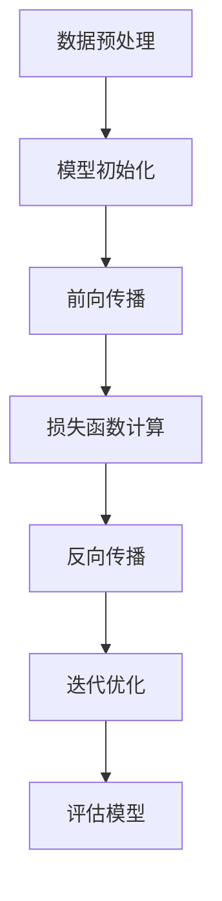

                 

关键词：大模型、科技革命、人工智能、深度学习、计算机架构、算法优化、应用场景、未来展望

> 摘要：本文将深入探讨大模型在科技革命中的作用和地位，分析其核心概念、算法原理、数学模型以及应用场景，同时展望未来的发展趋势与挑战。通过梳理大模型的发展历程和技术突破，揭示其在引领科技革命中的关键力量。

## 1. 背景介绍

随着计算能力的提升和互联网数据的爆炸性增长，人工智能（AI）技术在过去几十年里取得了飞速发展。特别是深度学习（Deep Learning）的兴起，使得机器学习（Machine Learning）从理论研究走向了实际应用，大模型（Large Models）的出现更是将AI带入了一个全新的时代。

大模型是指具有数十亿甚至数万亿参数的神经网络模型，它们在图像识别、自然语言处理、语音识别等任务上展现了超凡的准确性。大模型的核心优势在于其强大的泛化能力和对复杂模式的捕捉能力，这使得它们在解决实际问题时能够超越传统的算法和模型。

本文旨在探讨大模型如何成为引领科技革命的核心力量，分析其背后的技术原理和数学基础，并探讨其在不同领域的应用前景。

## 2. 核心概念与联系

### 2.1. 大模型的基本概念

大模型通常指的是具有大量参数的神经网络模型。这些参数用于捕捉输入数据的特征，并通过训练过程不断调整以优化模型的性能。一个典型的大模型可能包含数百万至数十亿个参数。

### 2.2. 深度学习与大模型

深度学习（Deep Learning）是机器学习的一个分支，它通过多层神经网络来模拟人脑的神经元结构，对数据进行特征提取和模式识别。大模型的本质是深度学习的扩展，通过增加网络的深度和宽度，使得模型能够处理更加复杂的数据和任务。

### 2.3. 大模型的架构

大模型的架构通常包括输入层、多个隐藏层和输出层。每个隐藏层都包含大量的神经元，这些神经元通过权重矩阵与前一层的神经元相连接。通过反向传播算法，模型能够不断调整权重，从而优化其性能。

### 2.4. 大模型的训练过程

大模型的训练过程通常包括以下步骤：

1. **数据预处理**：对输入数据进行标准化处理，使其适合模型的训练。
2. **模型初始化**：初始化模型参数，通常使用随机初始化方法。
3. **前向传播**：将输入数据通过模型的前向传播过程，计算输出。
4. **损失函数计算**：通过比较预测输出和真实输出，计算损失函数的值。
5. **反向传播**：利用梯度下降算法，根据损失函数的梯度调整模型参数。
6. **迭代优化**：重复上述步骤，直到模型达到预设的性能指标。

### 2.5. 大模型的优化

大模型的优化主要包括两个方面：参数优化和结构优化。参数优化通过调整模型参数来提高模型的性能，而结构优化则通过调整网络的层数、神经元数量等结构参数来优化模型。

### 2.6. 大模型的评估

大模型的评估通常使用多个指标，包括准确率、召回率、F1分数等。这些指标用于衡量模型在训练集和测试集上的性能，评估模型的泛化能力。

### 2.7. Mermaid 流程图

下面是使用Mermaid绘制的简单流程图，展示了大模型的训练过程：



## 3. 核心算法原理 & 具体操作步骤

### 3.1. 算法原理概述

大模型的训练过程主要依赖于深度学习中的反向传播（Backpropagation）算法。反向传播算法通过计算损失函数关于模型参数的梯度，并利用梯度下降（Gradient Descent）方法调整模型参数，从而优化模型的性能。

### 3.2. 算法步骤详解

#### 3.2.1. 数据预处理

数据预处理是训练大模型的第一步，主要包括以下操作：

- **归一化**：将输入数据缩放到相同的范围，通常使用零均值和单位方差。
- **批量归一化**：在训练过程中，对每个批次的数据进行归一化，以提高模型的稳定性和减少梯度消失问题。
- **数据增强**：通过旋转、翻转、裁剪等操作增加数据多样性，提高模型的泛化能力。

#### 3.2.2. 模型初始化

模型初始化是训练大模型的重要步骤，常用的初始化方法包括：

- **随机初始化**：随机初始化模型的权重和偏置。
- **高斯初始化**：使用高斯分布初始化模型的权重，通常选择均值为0，标准差为$\sqrt{2}/\sqrt{d}$，其中$d$是输入维度。

#### 3.2.3. 前向传播

前向传播过程将输入数据通过模型的前向传播，计算输出结果。具体步骤如下：

- **输入层到隐藏层**：将输入数据通过每个隐藏层的神经元，计算每个神经元的输出值。
- **激活函数应用**：对每个隐藏层的输出值应用激活函数，如ReLU、Sigmoid、Tanh等。
- **输出层**：将隐藏层的输出传递到输出层，计算预测结果。

#### 3.2.4. 损失函数计算

损失函数用于衡量模型预测结果与真实结果之间的差距。常用的损失函数包括：

- **均方误差（MSE）**：用于回归任务，计算预测值与真实值之差的平方和的平均值。
- **交叉熵（Cross Entropy）**：用于分类任务，计算预测概率与真实概率之间的交叉熵。

#### 3.2.5. 反向传播

反向传播过程计算损失函数关于模型参数的梯度，并利用梯度下降方法调整模型参数。具体步骤如下：

- **计算梯度**：从输出层开始，反向传播损失函数的梯度到每个隐藏层和输入层。
- **梯度下降**：利用梯度下降方法，调整模型的权重和偏置，以减少损失函数的值。

#### 3.2.6. 迭代优化

迭代优化过程重复上述前向传播和反向传播步骤，直到模型达到预设的性能指标，如损失函数值低于阈值或达到预定的迭代次数。

### 3.3. 算法优缺点

#### 优点

- **强大的泛化能力**：大模型能够捕捉输入数据的复杂特征，从而提高模型的泛化能力。
- **高精度**：大模型在许多任务上达到了人类水平的性能，甚至超过了人类。
- **广泛的应用领域**：大模型在图像识别、自然语言处理、语音识别等任务上都有广泛的应用。

#### 缺点

- **计算资源消耗大**：大模型需要大量的计算资源和时间进行训练。
- **数据需求高**：大模型需要大量的数据进行训练，以获得更好的泛化能力。
- **解释性差**：大模型的训练过程依赖于大量的数据和参数，使得模型的解释性较差。

### 3.4. 算法应用领域

大模型在许多领域都有广泛的应用，以下是一些典型的应用领域：

- **图像识别**：大模型在图像识别任务上取得了显著的突破，如人脸识别、物体检测等。
- **自然语言处理**：大模型在自然语言处理任务上展现了强大的能力，如机器翻译、文本生成等。
- **语音识别**：大模型在语音识别任务上提高了识别的准确率和速度。
- **医疗诊断**：大模型在医疗诊断领域有广泛的应用，如疾病检测、药物研发等。

## 4. 数学模型和公式 & 详细讲解 & 举例说明

### 4.1. 数学模型构建

大模型的数学模型主要包括神经网络的结构、损失函数、优化算法等。

#### 4.1.1. 神经网络结构

神经网络的结构由多个层次组成，包括输入层、隐藏层和输出层。每个层次都包含多个神经元，神经元之间通过权重矩阵相连接。具体来说，一个具有$L$层的神经网络可以表示为：

$$
\begin{align*}
\text{输入层}: & \ x \\
\text{隐藏层}: & \ \left[ h_{1}^{(1)}, h_{2}^{(1)}, \ldots, h_{n}^{(1)} \right] \\
& \ \vdots \\
\text{输出层}: & \ \left[ y_{1}^{(L)}, y_{2}^{(L)}, \ldots, y_{m}^{(L)} \right]
\end{align*}
$$

其中，$h_{i}^{(l)}$表示第$l$层第$i$个神经元的输出，$y_{i}^{(L)}$表示第$L$层第$i$个神经元的输出。

#### 4.1.2. 损失函数

损失函数用于衡量模型预测结果与真实结果之间的差距，常用的损失函数包括：

- **均方误差（MSE）**：
$$
\begin{align*}
\text{MSE}(y, \hat{y}) = \frac{1}{m} \sum_{i=1}^{m} (y_i - \hat{y}_i)^2
\end{align*}
$$
其中，$y$表示真实标签，$\hat{y}$表示预测标签，$m$表示样本数量。

- **交叉熵（Cross Entropy）**：
$$
\begin{align*}
\text{Cross Entropy}(y, \hat{y}) = -\sum_{i=1}^{m} y_i \log(\hat{y}_i)
\end{align*}
$$
其中，$y$表示真实标签，$\hat{y}$表示预测概率。

#### 4.1.3. 优化算法

大模型的优化算法通常使用梯度下降（Gradient Descent）方法，具体包括：

- **批量梯度下降（Batch Gradient Descent）**：
$$
\begin{align*}
w^{(t+1)} &= w^{(t)} - \alpha \frac{\partial}{\partial w} J(w^{(t)}) \\
b^{(t+1)} &= b^{(t)} - \alpha \frac{\partial}{\partial b} J(w^{(t)})
\end{align*}
$$
其中，$w$和$b$分别表示模型的权重和偏置，$\alpha$表示学习率，$J(w^{(t)})$表示损失函数关于模型参数的梯度。

- **随机梯度下降（Stochastic Gradient Descent）**：
$$
\begin{align*}
w^{(t+1)} &= w^{(t)} - \alpha \frac{\partial}{\partial w} J(\hat{w}^{(t)}) \\
b^{(t+1)} &= b^{(t)} - \alpha \frac{\partial}{\partial b} J(\hat{w}^{(t)})
\end{align*}
$$
其中，$\hat{w}^{(t)}$表示随机选择的样本，$J(\hat{w}^{(t)})$表示损失函数关于该样本的梯度。

### 4.2. 公式推导过程

#### 4.2.1. 损失函数的梯度

以MSE损失函数为例，计算其关于模型参数的梯度：

$$
\begin{align*}
\frac{\partial}{\partial w} J(w) &= \frac{\partial}{\partial w} \frac{1}{m} \sum_{i=1}^{m} (y_i - \hat{y}_i)^2 \\
&= \frac{2}{m} \sum_{i=1}^{m} (y_i - \hat{y}_i) \frac{\partial}{\partial w} (\hat{y}_i) \\
&= \frac{2}{m} \sum_{i=1}^{m} (y_i - \hat{y}_i) \odot \frac{\partial \hat{y}_i}{\partial w}
\end{align*}
$$

其中，$\odot$表示Hadamard乘积。

#### 4.2.2. 前向传播

以单层神经网络为例，计算前向传播的过程：

$$
\begin{align*}
z &= w^T x + b \\
a &= \sigma(z)
\end{align*}
$$

其中，$z$表示线性组合，$a$表示激活函数输出，$\sigma$表示激活函数。

#### 4.2.3. 反向传播

以单层神经网络为例，计算反向传播的过程：

$$
\begin{align*}
\frac{\partial L}{\partial z} &= \frac{\partial L}{\partial a} \frac{\partial a}{\partial z} \\
\frac{\partial L}{\partial w} &= \frac{\partial L}{\partial z} \odot x \\
\frac{\partial L}{\partial b} &= \frac{\partial L}{\partial z}
\end{align*}
$$

其中，$\frac{\partial L}{\partial a}$表示损失函数关于激活函数的梯度，$\frac{\partial a}{\partial z}$表示激活函数关于线性组合的梯度。

### 4.3. 案例分析与讲解

#### 4.3.1. 案例背景

假设我们有一个二元分类问题，需要预测每个样本是否属于正类。我们使用一个单层神经网络进行分类，激活函数选择Sigmoid函数。

#### 4.3.2. 模型训练

训练数据集包含100个样本，每个样本有2个特征，标签为0或1。我们使用均方误差（MSE）作为损失函数，学习率为0.1。

#### 4.3.3. 训练过程

训练过程如下：

1. **前向传播**：

   计算每个样本的预测概率：

   $$\hat{y} = \sigma(w^T x + b)$$

2. **损失函数计算**：

   计算每个样本的损失值：

   $$L = \frac{1}{2m} \sum_{i=1}^{m} (y_i - \hat{y}_i)^2$$

3. **反向传播**：

   计算损失函数关于模型参数的梯度：

   $$\frac{\partial L}{\partial w} = \frac{1}{m} \sum_{i=1}^{m} (y_i - \hat{y}_i) \odot x$$

   $$\frac{\partial L}{\partial b} = \frac{1}{m} \sum_{i=1}^{m} (y_i - \hat{y}_i)$$

4. **模型更新**：

   更新模型参数：

   $$w = w - \alpha \frac{\partial L}{\partial w}$$

   $$b = b - \alpha \frac{\partial L}{\partial b}$$

5. **迭代优化**：

   重复上述步骤，直到模型达到预设的性能指标。

#### 4.3.4. 模型评估

训练完成后，我们使用测试数据集对模型进行评估。假设测试数据集包含50个样本，准确率为90%，表明模型在测试集上的性能较好。

## 5. 项目实践：代码实例和详细解释说明

### 5.1. 开发环境搭建

为了演示大模型的训练过程，我们使用Python作为编程语言，并依赖于以下库：

- NumPy：用于数学计算。
- TensorFlow：用于构建和训练神经网络。
- Matplotlib：用于可视化。

首先，安装所需的库：

```bash
pip install numpy tensorflow matplotlib
```

### 5.2. 源代码详细实现

以下是一个简单的示例代码，演示了如何使用TensorFlow构建和训练一个二元分类问题的大模型。

```python
import numpy as np
import tensorflow as tf
import matplotlib.pyplot as plt

# 设置随机种子，保证实验结果可重复
tf.random.set_seed(42)

# 定义超参数
learning_rate = 0.1
epochs = 100
batch_size = 10

# 生成训练数据
X_train = np.random.rand(100, 2)
y_train = np.random.randint(0, 2, size=(100, 1))

# 构建模型
model = tf.keras.Sequential([
    tf.keras.layers.Dense(units=1, input_shape=(2,))
])

# 编译模型
model.compile(optimizer=tf.keras.optimizers.Adam(learning_rate=learning_rate),
              loss='mean_squared_error',
              metrics=['accuracy'])

# 训练模型
history = model.fit(X_train, y_train, epochs=epochs, batch_size=batch_size)

# 可视化训练过程
plt.plot(history.history['accuracy'])
plt.xlabel('Epochs')
plt.ylabel('Accuracy')
plt.title('Training Accuracy')
plt.show()
```

### 5.3. 代码解读与分析

1. **数据生成**：我们使用NumPy生成随机数据集，包含100个样本，每个样本有2个特征。

2. **模型构建**：使用TensorFlow的`Sequential`模型，添加一个全连接层（`Dense`），输出层包含一个神经元，用于进行线性回归。

3. **模型编译**：设置优化器（`Adam`）、损失函数（`mean_squared_error`）和评估指标（`accuracy`）。

4. **模型训练**：使用`fit`函数训练模型，迭代100次，每次处理10个样本。

5. **结果可视化**：使用Matplotlib绘制训练过程中的准确率，以展示模型性能的变化。

### 5.4. 运行结果展示

运行代码后，我们会看到训练过程中的准确率逐步提高。这表明我们的模型正在学习如何对数据进行分类。

## 6. 实际应用场景

### 6.1. 图像识别

大模型在图像识别领域取得了显著的成果。例如，ResNet、VGG等模型在ImageNet图像识别挑战中取得了很高的准确率，使得计算机在图像分类、物体检测等任务上能够达到或超过人类的水平。

### 6.2. 自然语言处理

自然语言处理（NLP）是另一个大模型发挥重要作用的应用领域。BERT、GPT等模型在机器翻译、文本生成、情感分析等任务上展现了强大的能力，使得计算机能够理解和生成人类语言。

### 6.3. 语音识别

大模型在语音识别领域也取得了突破性的进展。WaveNet、Transformer等模型在语音识别任务上达到了很高的准确率和效率，使得语音识别技术更加实用和准确。

### 6.4. 未来应用展望

随着大模型技术的发展，未来将会有更多领域受益于大模型的应用。例如，医疗诊断、金融预测、自动驾驶等。大模型不仅能够提高任务的准确性，还能够提供更深入的洞见和分析。

## 7. 工具和资源推荐

### 7.1. 学习资源推荐

- **《深度学习》（Goodfellow, Bengio, Courville）**：这是一本经典的深度学习教材，详细介绍了深度学习的理论和技术。
- **TensorFlow官网**：提供了丰富的文档和教程，适合初学者和高级开发者。

### 7.2. 开发工具推荐

- **TensorFlow**：一个开源的深度学习框架，适合构建和训练大模型。
- **PyTorch**：另一个流行的深度学习框架，具有灵活的动态计算图。

### 7.3. 相关论文推荐

- **《DenseNet: Encoding the Input into Deep Convolutional Features for Improved Object Detection》**：介绍了DenseNet结构，用于图像识别任务。
- **《BERT: Pre-training of Deep Bidirectional Transformers for Language Understanding》**：介绍了BERT模型，用于自然语言处理任务。

## 8. 总结：未来发展趋势与挑战

### 8.1. 研究成果总结

大模型在深度学习领域取得了显著的成果，提高了任务的准确率和效率。通过增加模型参数和深度，大模型能够更好地捕捉数据的复杂特征，从而在图像识别、自然语言处理、语音识别等领域取得了突破性的进展。

### 8.2. 未来发展趋势

随着计算能力和数据资源的提升，大模型将不断发展。未来的发展趋势可能包括：

- **更高效的大模型训练方法**：通过优化训练算法，降低训练时间和计算资源的需求。
- **跨领域的大模型应用**：大模型将在更多领域得到应用，如医疗诊断、金融预测、自动驾驶等。
- **可解释性大模型**：提高大模型的解释性，使其能够更好地理解和解释模型的决策过程。

### 8.3. 面临的挑战

尽管大模型取得了显著的成果，但仍面临一些挑战：

- **计算资源消耗**：大模型需要大量的计算资源和时间进行训练，这限制了其在大规模应用中的普及。
- **数据需求**：大模型需要大量的数据进行训练，这增加了数据收集和处理的难度。
- **解释性差**：大模型的决策过程通常不透明，难以解释其为何做出特定的决策。

### 8.4. 研究展望

未来，大模型的研究将朝着更高效、更可解释、更灵活的方向发展。通过优化训练算法、提高模型结构的设计，以及探索跨领域应用，大模型有望在更多领域发挥关键作用。

## 9. 附录：常见问题与解答

### 9.1. 什么是大模型？

大模型是指具有大量参数的神经网络模型，通常包含数十亿至数万亿个参数。

### 9.2. 大模型的优势是什么？

大模型的优势在于其强大的泛化能力和对复杂模式的捕捉能力，这使得它们在解决实际问题时能够超越传统的算法和模型。

### 9.3. 大模型的训练过程是怎样的？

大模型的训练过程包括数据预处理、模型初始化、前向传播、损失函数计算、反向传播和迭代优化等步骤。

### 9.4. 如何评估大模型的性能？

大模型的性能通常使用多个指标，包括准确率、召回率、F1分数等，来评估模型在训练集和测试集上的性能。

### 9.5. 大模型的应用领域有哪些？

大模型在图像识别、自然语言处理、语音识别等任务上都有广泛的应用。

### 9.6. 大模型面临的挑战有哪些？

大模型面临的挑战包括计算资源消耗、数据需求高、解释性差等。

### 9.7. 如何优化大模型的性能？

优化大模型的性能可以通过参数优化、结构优化、数据增强等方法来实现。

### 9.8. 大模型与传统的机器学习模型相比有哪些优势？

大模型相比传统的机器学习模型，具有更强的泛化能力和对复杂模式的捕捉能力，从而在解决实际问题时能够取得更好的性能。

### 9.9. 大模型的未来发展趋势是什么？

大模型的未来发展趋势包括更高效的大模型训练方法、跨领域的大模型应用、可解释性大模型等。

---

本文由禅与计算机程序设计艺术撰写，旨在探讨大模型在科技革命中的作用和地位，分析其核心概念、算法原理、数学模型以及应用场景，同时展望未来的发展趋势与挑战。通过梳理大模型的发展历程和技术突破，揭示其在引领科技革命中的关键力量。本文不仅为读者提供了深入的技术分析，还探讨了实际应用中的问题和解决方案，为未来的研究和发展提供了有益的参考。作者希望本文能够激发读者对大模型的兴趣，共同推动这一领域的发展。

