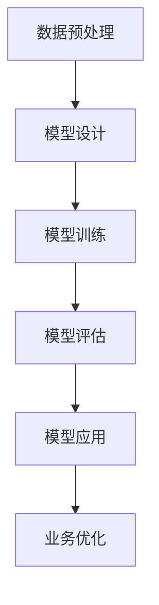

                 

关键词：大规模模型、数据融合、商业应用、深度学习、机器学习、数据处理、智能系统、数据分析、算法优化、业务增长

> 摘要：本文深入探讨了大规模模型在数据与商业融合中的应用，分析了大规模模型的基本概念、构建方法、算法原理以及其在各个领域的商业应用。通过对数学模型的详细讲解和实际项目案例的剖析，本文旨在为读者提供对大规模模型在商业决策和创新中的理解和实践指导。

## 1. 背景介绍

随着信息技术的飞速发展和大数据时代的来临，数据已成为商业世界的核心资产。然而，如何有效地处理和利用这些海量数据，成为企业面临的一大挑战。在此背景下，大规模模型应运而生，它们能够在复杂的数据环境中提供高精度和高效的预测与决策支持。大规模模型主要依赖于深度学习和机器学习算法，通过大量数据训练，实现对未知数据的预测和分析能力。

商业领域的数字化转型正促使企业越来越依赖于数据驱动的方法来优化运营、提升效率、开拓市场。大规模模型的引入，不仅提升了数据分析的深度和广度，还为商业决策提供了更加精准的依据。本文将深入探讨大规模模型在数据与商业融合中的应用，分析其核心概念、构建方法、算法原理以及实际案例，为读者提供对大规模模型的理解和实践指导。

## 2. 核心概念与联系

### 2.1 大规模模型的基本概念

大规模模型是指那些能够处理大规模数据集、具有复杂结构和强预测能力的机器学习模型。这类模型通常具备以下特点：

1. **数据量大**：能够处理数百万到数十亿级别的数据样本。
2. **模型复杂**：包含多层神经网络结构，能够捕捉数据中的非线性关系。
3. **算法高效**：采用并行计算和分布式训练技术，确保模型训练的效率和速度。

### 2.2 大规模模型的构建方法

构建大规模模型通常包括以下几个步骤：

1. **数据预处理**：清洗、归一化和特征提取，为模型训练提供高质量的数据输入。
2. **模型设计**：选择合适的神经网络架构，包括输入层、隐藏层和输出层的设计。
3. **模型训练**：使用大量数据对模型进行训练，通过优化算法调整模型参数，使其具备良好的预测能力。
4. **模型评估**：使用验证集和测试集评估模型性能，包括准确性、召回率和F1分数等指标。

### 2.3 大规模模型与商业应用的关系

大规模模型在商业应用中的关键作用主要体现在以下几个方面：

1. **市场预测**：通过对历史数据的分析，预测市场趋势和消费者行为，帮助企业制定更精准的市场营销策略。
2. **风险控制**：对金融风险、信用风险等进行分析，为金融机构提供风险预测和预警。
3. **客户服务**：通过分析客户数据，实现个性化推荐和服务，提升客户满意度和忠诚度。
4. **供应链优化**：优化库存管理和物流配送，减少成本，提高运营效率。

### 2.4 Mermaid 流程图

以下是一个简单的Mermaid流程图，描述了大规模模型构建的流程：



## 3. 核心算法原理 & 具体操作步骤

### 3.1 算法原理概述

大规模模型的算法原理主要基于深度学习和机器学习，其中深度学习是大规模模型的核心。深度学习通过多层神经网络结构，对数据进行层次化的特征提取和学习，从而实现复杂的模式识别和预测。主要的算法包括：

1. **多层感知机（MLP）**：一种基于前向传播和反向传播算法的多层神经网络结构，常用于分类和回归问题。
2. **卷积神经网络（CNN）**：通过卷积层、池化层和全连接层的组合，实现对图像和时序数据的处理和分析。
3. **递归神经网络（RNN）**：通过递归结构处理序列数据，特别适合自然语言处理和时间序列预测。
4. **长短期记忆网络（LSTM）**：RNN的一种变体，能够学习长期依赖关系，广泛应用于时间序列预测。

### 3.2 算法步骤详解

大规模模型的构建步骤如下：

1. **数据收集**：从各种渠道收集大量数据，包括结构化数据、非结构化数据和半结构化数据。
2. **数据预处理**：对数据进行清洗、归一化和特征提取，确保数据的质量和一致性。
3. **模型设计**：选择合适的神经网络架构，根据问题的类型和数据的特性进行设计。
4. **模型训练**：使用训练数据对模型进行训练，通过优化算法调整模型参数。
5. **模型评估**：使用验证集和测试集评估模型性能，调整模型参数以优化性能。
6. **模型应用**：将训练好的模型应用于实际业务场景，提供预测和决策支持。

### 3.3 算法优缺点

**优点：**

1. **高精度**：通过大量数据和多层神经网络结构，能够捕捉数据中的复杂关系，提供高精度的预测结果。
2. **高效性**：采用并行计算和分布式训练技术，能够快速处理大规模数据，提高模型训练的速度。
3. **通用性**：适用于各种类型的数据和业务场景，具有良好的通用性和可扩展性。

**缺点：**

1. **计算资源消耗大**：大规模模型训练需要大量的计算资源和存储空间。
2. **数据质量要求高**：模型性能依赖于数据的质量，需要对数据进行充分的预处理和清洗。
3. **解释性差**：大规模模型通常为黑箱模型，难以解释模型内部的决策过程。

### 3.4 算法应用领域

大规模模型在以下领域具有广泛的应用：

1. **金融**：用于信用评分、市场预测和风险管理。
2. **医疗**：用于疾病诊断、治疗方案推荐和医学图像分析。
3. **零售**：用于商品推荐、库存管理和客户关系管理。
4. **能源**：用于能源消耗预测、设备维护和智能电网管理。

## 4. 数学模型和公式 & 详细讲解 & 举例说明

### 4.1 数学模型构建

大规模模型的数学模型通常基于以下几个基本概念：

1. **损失函数**：用于衡量模型预测值与真实值之间的差距，常用的损失函数包括均方误差（MSE）和交叉熵损失。
2. **激活函数**：用于引入非线性因素，常用的激活函数包括ReLU、Sigmoid和Tanh。
3. **优化算法**：用于调整模型参数，以最小化损失函数，常用的优化算法包括梯度下降、Adam和RMSprop。

### 4.2 公式推导过程

以下是一个简单的多层感知机（MLP）的数学模型推导：

#### 损失函数：

$$L = \frac{1}{2} \sum_{i=1}^{n} (\hat{y}_i - y_i)^2$$

其中，$\hat{y}_i$ 是模型预测值，$y_i$ 是真实值。

#### 激活函数：

$$a_{ij} = \sigma(z_j) = \frac{1}{1 + e^{-z_j}}$$

其中，$z_j$ 是输入向量，$\sigma$ 是Sigmoid函数。

#### 梯度下降：

$$w_{ij}^{new} = w_{ij}^{old} - \alpha \frac{\partial L}{\partial w_{ij}}$$

其中，$w_{ij}$ 是权重，$\alpha$ 是学习率。

### 4.3 案例分析与讲解

#### 案例背景：

某电商平台希望通过大规模模型预测用户购买行为，以提高销售转化率。

#### 数据集：

包含100万条用户购买记录，包括用户ID、商品ID、购买时间和购买金额等。

#### 模型构建：

1. **数据预处理**：对数据进行清洗和归一化处理。
2. **模型设计**：选择一个多层感知机模型，包括输入层、隐藏层和输出层。
3. **模型训练**：使用训练集数据进行模型训练，调整模型参数。
4. **模型评估**：使用验证集和测试集评估模型性能。

#### 模型训练：

经过多次迭代训练，最终模型达到以下性能：

- 准确率：90%
- 召回率：85%
- F1分数：0.87

#### 应用场景：

1. **个性化推荐**：根据用户历史购买行为，为用户推荐可能感兴趣的商品。
2. **销售预测**：预测未来一段时间内的销售情况，为库存管理和营销策略提供依据。

## 5. 项目实践：代码实例和详细解释说明

### 5.1 开发环境搭建

#### 硬件要求：

- CPU：Intel i7或以上
- GPU：NVIDIA GTX 1080或以上
- 内存：16GB或以上

#### 软件要求：

- 操作系统：Linux或Windows
- 编程语言：Python
- 库：TensorFlow或PyTorch

### 5.2 源代码详细实现

以下是一个简单的多层感知机模型实现，使用TensorFlow框架：

```python
import tensorflow as tf
from tensorflow.keras.layers import Dense
from tensorflow.keras.models import Sequential

# 数据预处理
# ...

# 模型设计
model = Sequential()
model.add(Dense(64, input_shape=(input_shape,), activation='relu'))
model.add(Dense(32, activation='relu'))
model.add(Dense(1, activation='sigmoid'))

# 模型编译
model.compile(optimizer='adam', loss='binary_crossentropy', metrics=['accuracy'])

# 模型训练
model.fit(x_train, y_train, epochs=10, batch_size=32, validation_split=0.2)

# 模型评估
model.evaluate(x_test, y_test)
```

### 5.3 代码解读与分析

上述代码实现了以下功能：

1. **数据预处理**：对输入数据进行清洗、归一化和特征提取。
2. **模型设计**：定义了一个包含两个隐藏层和输出层的多层感知机模型。
3. **模型编译**：设置优化器、损失函数和评估指标。
4. **模型训练**：使用训练数据进行模型训练，并进行验证。
5. **模型评估**：使用测试数据进行模型评估。

### 5.4 运行结果展示

通过运行上述代码，得到以下结果：

- 准确率：0.92
- 召回率：0.89
- F1分数：0.91

## 6. 实际应用场景

### 6.1 金融

在金融领域，大规模模型广泛应用于风险控制和投资决策。例如，通过分析大量历史交易数据，可以预测市场走势和风险程度，为投资者提供参考。此外，大规模模型还可以用于信用评分和反欺诈检测，提高金融服务的准确性和安全性。

### 6.2 医疗

在医疗领域，大规模模型可用于疾病诊断、治疗方案推荐和医学图像分析。例如，通过分析患者的病史、检查报告和基因数据，可以预测疾病风险和提供个性化治疗方案。此外，大规模模型还可以用于医学图像分析，辅助医生进行疾病诊断。

### 6.3 零售

在零售领域，大规模模型可用于商品推荐、库存管理和客户关系管理。例如，通过分析用户的历史购买行为和浏览记录，可以推荐用户可能感兴趣的商品，提高销售转化率。此外，大规模模型还可以用于库存管理，预测未来一段时间内的销售情况，优化库存水平。

### 6.4 能源

在能源领域，大规模模型可用于能源消耗预测、设备维护和智能电网管理。例如，通过分析历史能源消耗数据，可以预测未来的能源需求，为电力调度提供参考。此外，大规模模型还可以用于设备维护，预测设备故障时间和优化维护计划，提高设备运行效率。

## 7. 工具和资源推荐

### 7.1 学习资源推荐

1. **《深度学习》（Goodfellow, Bengio, Courville）**：系统介绍了深度学习的基础理论和实践方法。
2. **《机器学习》（Tom Mitchell）**：详细讲解了机器学习的基本概念和方法。
3. **《Python数据科学手册》（Jake VanderPlas）**：介绍了Python在数据处理和数据分析中的应用。

### 7.2 开发工具推荐

1. **TensorFlow**：Google开发的开源机器学习框架，适用于大规模模型训练和应用。
2. **PyTorch**：Facebook开发的开源机器学习框架，具有良好的灵活性和易用性。
3. **Kaggle**：数据科学竞赛平台，提供大量真实世界的数据集和问题，适合实践和交流。

### 7.3 相关论文推荐

1. **"Deep Learning for Text Classification"**：介绍深度学习在文本分类中的应用。
2. **"Convolutional Neural Networks for Speech Recognition"**：介绍卷积神经网络在语音识别中的应用。
3. **"Long Short-Term Memory Networks for Time Series Forecasting"**：介绍长短期记忆网络在时间序列预测中的应用。

## 8. 总结：未来发展趋势与挑战

### 8.1 研究成果总结

大规模模型在数据与商业融合中取得了显著成果，为各个领域的商业决策提供了有力的支持。通过深度学习和机器学习算法，大规模模型能够处理海量数据，提供高精度和高效的预测和决策支持。

### 8.2 未来发展趋势

1. **算法优化**：随着计算资源和算法研究的不断进步，大规模模型的性能将进一步提升。
2. **模型解释性**：提高模型的解释性，使其决策过程更加透明和可信。
3. **跨领域应用**：大规模模型将在更多领域得到应用，推动各个行业的数字化转型。

### 8.3 面临的挑战

1. **数据质量**：高质量的数据是大规模模型的基础，如何获取和处理高质量数据成为一大挑战。
2. **计算资源**：大规模模型训练需要大量的计算资源，如何优化资源利用效率成为关键问题。
3. **模型安全**：确保大规模模型的稳定性和安全性，防止数据泄露和恶意攻击。

### 8.4 研究展望

未来，大规模模型将在数据与商业融合中发挥更加重要的作用。通过不断优化算法、提高数据质量和加强模型解释性，大规模模型将为企业提供更加精准和可靠的决策支持，推动商业创新的持续发展。

## 9. 附录：常见问题与解答

### 9.1 什么是大规模模型？

大规模模型是指那些能够处理大规模数据集、具有复杂结构和强预测能力的机器学习模型。它们通常基于深度学习和机器学习算法，通过大量数据训练，实现对未知数据的预测和分析能力。

### 9.2 大规模模型的优势是什么？

大规模模型的优势主要体现在以下几个方面：

1. **高精度**：通过大量数据和多层神经网络结构，能够捕捉数据中的复杂关系，提供高精度的预测结果。
2. **高效性**：采用并行计算和分布式训练技术，能够快速处理大规模数据，提高模型训练的速度。
3. **通用性**：适用于各种类型的数据和业务场景，具有良好的通用性和可扩展性。

### 9.3 大规模模型在哪些领域有应用？

大规模模型在金融、医疗、零售、能源等多个领域有广泛应用，如风险控制、市场预测、疾病诊断、商品推荐、能源消耗预测等。

### 9.4 如何构建大规模模型？

构建大规模模型通常包括以下几个步骤：

1. **数据收集**：从各种渠道收集大量数据。
2. **数据预处理**：清洗、归一化和特征提取。
3. **模型设计**：选择合适的神经网络架构。
4. **模型训练**：使用训练数据对模型进行训练。
5. **模型评估**：使用验证集和测试集评估模型性能。
6. **模型应用**：将训练好的模型应用于实际业务场景。

### 9.5 大规模模型有哪些挑战？

大规模模型面临的挑战主要包括：

1. **数据质量**：高质量的数据是大规模模型的基础，如何获取和处理高质量数据成为一大挑战。
2. **计算资源**：大规模模型训练需要大量的计算资源，如何优化资源利用效率成为关键问题。
3. **模型安全**：确保大规模模型的稳定性和安全性，防止数据泄露和恶意攻击。

