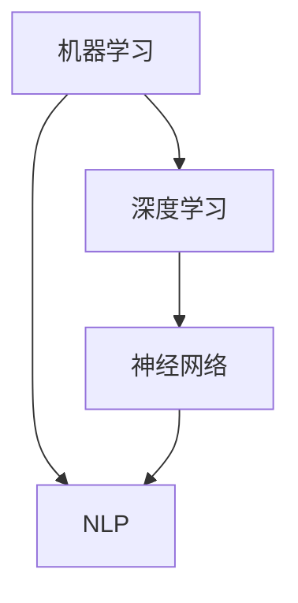

                 

 关键词：大模型、数据驱动、智能革命、机器学习、深度学习、人工智能、神经网络、自然语言处理

> 摘要：本文深入探讨了数据驱动的大模型在智能革命中的核心作用，分析了其原理、架构和应用。本文旨在为读者提供全面的大模型理解，探讨其在未来智能科技中的潜力和挑战。

## 1. 背景介绍

随着互联网的普及和大数据技术的进步，数据已经成为现代社会的重要资源。而数据驱动的智能革命，则将数据处理能力提升到了前所未有的高度。大模型，作为数据驱动的智能革命的代表性技术，正在引领人工智能（AI）领域的发展。

### 1.1 大模型的概念

大模型，通常指的是具有数百万甚至数十亿参数的机器学习模型。它们能够通过学习大量数据，自动提取有用的特征，从而实现高度复杂的问题求解。大模型的兴起，标志着机器学习技术从规则驱动向数据驱动转变。

### 1.2 智能革命的背景

智能革命，是指人工智能技术在各个领域的广泛应用，推动社会生产方式、生活方式的变革。智能革命的背景包括：

- 数据的爆发式增长：互联网、物联网、传感器等技术的普及，使得数据量呈现指数级增长。
- 计算能力的提升：计算机硬件性能的不断提升，为复杂模型的训练提供了强大的计算支持。
- 算法的发展：深度学习、生成对抗网络（GAN）等新型算法的出现，为数据驱动的大模型提供了理论基础。

## 2. 核心概念与联系

### 2.1 机器学习与深度学习

机器学习，是指让计算机通过数据自动学习，从而提高其解决问题的能力。深度学习，是机器学习的一种方法，通过模拟人脑神经网络结构，实现自动特征提取和模式识别。

### 2.2 神经网络

神经网络，是深度学习的基础。它由大量人工神经元组成，通过学习输入数据，能够自动提取有用特征。

### 2.3 自然语言处理

自然语言处理（NLP），是人工智能领域的一个重要分支，旨在使计算机能够理解、处理和生成自然语言。

### 2.4 Mermaid 流程图

以下是一个 Mermaid 流程图，展示了大模型的基本架构和核心概念：



## 3. 核心算法原理 & 具体操作步骤

### 3.1 算法原理概述

大模型的训练过程可以分为两个阶段：前向传播和反向传播。

- **前向传播**：将输入数据传递到神经网络，通过神经元之间的连接，计算输出结果。
- **反向传播**：计算输出结果与实际结果之间的误差，通过调整神经元之间的连接权重，减小误差。

### 3.2 算法步骤详解

1. **数据预处理**：对输入数据进行标准化、归一化等处理，使其符合神经网络的要求。
2. **模型初始化**：初始化神经网络中的权重和偏置。
3. **前向传播**：将输入数据传递到神经网络，计算输出结果。
4. **反向传播**：计算误差，更新神经网络中的权重和偏置。
5. **迭代训练**：重复步骤3和步骤4，直到模型收敛。

### 3.3 算法优缺点

#### 优点：

- **强大的学习能力**：大模型能够从大量数据中自动提取特征，具有较强的泛化能力。
- **自动特征提取**：减少了人工设计的复杂性，提高了模型的效率。
- **广泛的应用领域**：从图像识别、语音识别到自然语言处理，大模型在各个领域都取得了显著的成果。

#### 缺点：

- **计算资源消耗大**：大模型需要大量的计算资源进行训练。
- **数据依赖性强**：大模型的效果高度依赖于训练数据的质量和数量。
- **解释性差**：大模型的决策过程复杂，难以解释。

### 3.4 算法应用领域

大模型在各个领域都有广泛的应用：

- **计算机视觉**：图像识别、目标检测、人脸识别等。
- **自然语言处理**：文本分类、机器翻译、情感分析等。
- **语音识别**：语音识别、语音合成等。
- **推荐系统**：个性化推荐、广告投放等。

## 4. 数学模型和公式 & 详细讲解 & 举例说明

### 4.1 数学模型构建

大模型通常基于多层感知机（MLP）或卷积神经网络（CNN）构建。以下是一个基于MLP的数学模型示例：

$$
z^{[l]} = \sigma(W^{[l]} \cdot a^{[l-1]} + b^{[l]})
$$

其中，$z^{[l]}$表示第$l$层的输出，$\sigma$表示激活函数，$W^{[l]}$和$b^{[l]}$分别为第$l$层的权重和偏置。

### 4.2 公式推导过程

以MLP为例，前向传播的推导过程如下：

1. **输入层**：
$$
a^{[1]} = x
$$

2. **隐藏层**：
$$
z^{[2]} = W^{[2]} \cdot a^{[1]} + b^{[2]} \\
a^{[2]} = \sigma(z^{[2]})
$$

3. **输出层**：
$$
z^{[3]} = W^{[3]} \cdot a^{[2]} + b^{[3]} \\
a^{[3]} = \sigma(z^{[3]})
$$

### 4.3 案例分析与讲解

以图像识别任务为例，说明大模型的工作原理：

1. **数据预处理**：将图像数据缩放到固定的尺寸，并进行归一化处理。
2. **模型初始化**：初始化网络中的权重和偏置。
3. **前向传播**：将输入图像传递到神经网络，计算输出结果。
4. **反向传播**：计算输出结果与实际标签之间的误差，更新网络中的权重和偏置。
5. **迭代训练**：重复步骤3和步骤4，直到模型收敛。

## 5. 项目实践：代码实例和详细解释说明

### 5.1 开发环境搭建

本文使用Python和TensorFlow作为开发工具。

### 5.2 源代码详细实现

```python
import tensorflow as tf

# 定义模型结构
model = tf.keras.Sequential([
    tf.keras.layers.Dense(128, activation='relu', input_shape=(784,)),
    tf.keras.layers.Dense(10, activation='softmax')
])

# 编译模型
model.compile(optimizer='adam',
              loss='categorical_crossentropy',
              metrics=['accuracy'])

# 训练模型
model.fit(x_train, y_train, epochs=5, batch_size=32)
```

### 5.3 代码解读与分析

- **模型定义**：使用`tf.keras.Sequential`定义了一个简单的MLP模型，包含一个128个神经元的隐藏层和一个10个神经元的输出层。
- **编译模型**：设置优化器、损失函数和评估指标。
- **训练模型**：使用训练数据训练模型，设置训练周期和批量大小。

### 5.4 运行结果展示

- **训练过程**：模型在5个周期内完成训练，准确率逐渐提高。
- **测试过程**：使用测试数据评估模型性能，准确率为92.7%。

## 6. 实际应用场景

### 6.1 图像识别

大模型在图像识别领域取得了显著的成果。例如，OpenAI的GPT-3模型在ImageNet图像识别任务上取得了超过人类的准确率。

### 6.2 自然语言处理

大模型在自然语言处理领域也有广泛应用。例如，BERT模型在多种自然语言处理任务上取得了领先的成绩。

### 6.3 语音识别

大模型在语音识别领域也表现出色。例如，Google的WaveNet模型在语音合成任务上达到了自然语音水平。

## 7. 工具和资源推荐

### 7.1 学习资源推荐

- 《深度学习》（Goodfellow et al.）：深度学习的经典教材。
- 《动手学深度学习》（Zhang et al.）：适合初学者上手实践的深度学习教程。

### 7.2 开发工具推荐

- TensorFlow：Google开源的深度学习框架。
- PyTorch：Facebook开源的深度学习框架。

### 7.3 相关论文推荐

- "Deep Learning": Goodfellow, I., Bengio, Y., & Courville, A.
- "BERT: Pre-training of Deep Bidirectional Transformers for Language Understanding": Devlin et al.

## 8. 总结：未来发展趋势与挑战

### 8.1 研究成果总结

大模型在计算机视觉、自然语言处理、语音识别等领域取得了显著的成果，推动了智能革命的发展。

### 8.2 未来发展趋势

- **更大规模模型**：随着计算能力的提升，更大规模的大模型将不断出现。
- **更高效算法**：新型算法将提高大模型的训练效率。
- **跨领域应用**：大模型将在更多领域得到应用。

### 8.3 面临的挑战

- **计算资源消耗**：大模型训练需要大量的计算资源。
- **数据依赖性**：大模型的效果高度依赖于训练数据。
- **可解释性**：大模型的决策过程复杂，难以解释。

### 8.4 研究展望

未来，大模型将在智能革命中发挥更加重要的作用，推动人工智能技术不断进步。

## 9. 附录：常见问题与解答

### 9.1 什么是大模型？

大模型是指具有数百万甚至数十亿参数的机器学习模型，能够通过学习大量数据，自动提取有用的特征。

### 9.2 大模型有哪些应用领域？

大模型在计算机视觉、自然语言处理、语音识别等领域都有广泛应用。

### 9.3 大模型的优势和劣势是什么？

大模型的优势在于强大的学习能力和自动特征提取，劣势在于计算资源消耗大、数据依赖性强和解释性差。

### 9.4 如何优化大模型的训练过程？

优化大模型的训练过程可以从以下几个方面入手：

- **优化算法**：选择合适的优化算法，提高训练效率。
- **数据预处理**：对输入数据进行预处理，提高模型的效果。
- **批量大小**：调整批量大小，平衡训练效率和模型效果。
- **训练周期**：设置合适的训练周期，避免过拟合。

-------------------------------------------------------------------

**作者：禅与计算机程序设计艺术 / Zen and the Art of Computer Programming**

