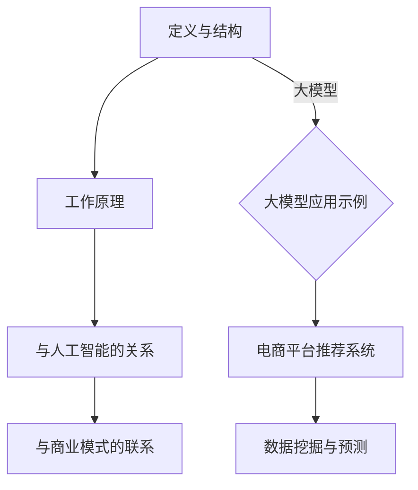

                 

关键词：大模型、智能时代、商业模式、技术革新、商业应用

> 摘要：随着人工智能技术的快速发展，大模型成为了推动产业变革的重要力量。本文从大模型的背景介绍、核心概念与联系、算法原理、数学模型、实际应用以及未来展望等方面，深入探讨了智能时代商业新模式的发展趋势。

## 1. 背景介绍

人工智能（AI）技术近年来取得了显著的进展，其中以深度学习为代表的技术成为推动行业变革的核心动力。大模型，作为人工智能领域的一个重要概念，已经逐渐成为技术研究和商业应用的热点。

大模型，即具有大规模参数和复杂结构的神经网络模型。它们具有处理大规模数据、解决复杂问题的能力，并在图像识别、自然语言处理、推荐系统等多个领域取得了突破性成果。随着计算资源和算法技术的不断提升，大模型的规模和性能也在不断扩展。

在商业领域，大模型的应用已经带来了深远的影响。通过大数据分析和智能化决策，企业可以更精准地预测市场趋势、优化业务流程，并为客户提供更加个性化和高效的服务。大模型的出现，不仅改变了商业运作模式，还为新兴商业模式的发展提供了新的可能性。

## 2. 核心概念与联系

### 大模型的定义与结构

大模型是指具有数十亿到数千亿个参数的神经网络模型。它们通常由多个层级组成，包括输入层、隐藏层和输出层。每个层级由大量的神经元（或节点）组成，神经元之间通过加权连接进行信息传递。大模型的核心在于其复杂的网络结构和大量的参数，这使得它们能够捕捉到数据中的复杂模式和关联。

### 大模型的工作原理

大模型的工作原理主要基于深度学习的思想。在训练过程中，模型通过不断调整权重和偏置，使得输入数据在经过神经网络处理后能够接近真实标签。这种调整过程通常使用反向传播算法来实现。在推理阶段，模型则根据输入数据进行预测，生成相应的输出。

### 大模型与人工智能的关系

大模型是人工智能领域的一个重要分支，它代表了当前人工智能技术的最高水平。大模型在图像识别、自然语言处理、语音识别等多个领域取得了显著的成果，推动了人工智能在商业、医疗、教育等领域的应用。

### 大模型与商业模式的联系

大模型的出现，为商业模式的创新提供了新的思路。企业可以通过构建和应用大模型，实现数据的深度挖掘和智能化分析，从而提高业务效率和决策质量。例如，电商平台可以使用大模型进行用户行为预测和推荐系统优化，提高用户体验和转化率。

### Mermaid 流程图



## 3. 核心算法原理 & 具体操作步骤

### 3.1 算法原理概述

大模型的算法原理主要基于深度学习的思想。深度学习是一种基于多层神经网络进行训练和推理的方法，通过学习大量数据中的特征和模式，实现图像识别、语音识别、自然语言处理等任务。大模型在深度学习的基础上，通过增加网络层数和参数规模，提高了模型的复杂度和性能。

### 3.2 算法步骤详解

1. 数据预处理：对输入数据进行清洗、归一化等处理，确保数据质量。

2. 网络结构设计：根据任务需求，设计合适的网络结构，包括输入层、隐藏层和输出层。

3. 模型训练：使用训练数据对模型进行训练，通过不断调整权重和偏置，使得模型在训练数据上达到较高的准确率。

4. 模型评估：使用验证数据对模型进行评估，选择性能最优的模型。

5. 模型推理：使用测试数据对模型进行推理，生成预测结果。

### 3.3 算法优缺点

**优点：**
- 强大的表示能力：大模型可以通过学习大量数据，捕捉到数据中的复杂模式和关联，提高模型的泛化能力。
- 高效的推理速度：大模型在训练过程中可以快速收敛，推理速度较快。
- 广泛的应用场景：大模型可以应用于图像识别、自然语言处理、语音识别等多个领域。

**缺点：**
- 计算资源需求大：大模型需要大量的计算资源和存储空间，对硬件设备要求较高。
- 需要大量数据：大模型对数据量有较高的要求，数据质量和数量直接影响模型性能。
- 过拟合问题：大模型容易过拟合训练数据，导致泛化能力不足。

### 3.4 算法应用领域

大模型在图像识别、自然语言处理、推荐系统、语音识别等领域具有广泛的应用。例如，在图像识别领域，大模型可以用于人脸识别、物体检测等任务；在自然语言处理领域，大模型可以用于机器翻译、情感分析等任务；在推荐系统领域，大模型可以用于用户行为预测和推荐策略优化。

## 4. 数学模型和公式 & 详细讲解 & 举例说明

### 4.1 数学模型构建

大模型的数学模型主要基于神经网络的理论。神经网络由多个层级组成，每个层级由多个神经元组成。神经元的激活函数通常使用 sigmoid 或 ReLU 函数。网络中的权重和偏置用于调整神经元之间的连接强度，从而实现数据的映射和分类。

### 4.2 公式推导过程

设输入数据为 $x \in \mathbb{R}^{n}$，隐藏层节点为 $h_i$，输出层节点为 $y_j$。则神经网络的输出可以表示为：

$$
y_j = f(\sum_{i=1}^{n} w_{ij} h_i + b_j)
$$

其中，$f$ 为激活函数，$w_{ij}$ 为权重，$b_j$ 为偏置。

在反向传播算法中，通过计算损失函数的梯度，更新权重和偏置，实现模型优化。损失函数可以表示为：

$$
J = \frac{1}{2} \sum_{i=1}^{m} (y_i - \hat{y}_i)^2
$$

其中，$m$ 为样本数量，$y_i$ 为真实标签，$\hat{y}_i$ 为模型预测值。

通过计算梯度 $\frac{\partial J}{\partial w_{ij}}$ 和 $\frac{\partial J}{\partial b_j}$，可以更新权重和偏置：

$$
w_{ij} := w_{ij} - \alpha \frac{\partial J}{\partial w_{ij}}
$$

$$
b_j := b_j - \alpha \frac{\partial J}{\partial b_j}
$$

其中，$\alpha$ 为学习率。

### 4.3 案例分析与讲解

以图像识别任务为例，假设输入图像为 $x \in \mathbb{R}^{784}$（28x28像素），隐藏层节点数为 100，输出层节点数为 10（分类标签）。网络结构如下：

$$
\text{输入层} \rightarrow \text{隐藏层} \rightarrow \text{输出层}
$$

输入层到隐藏层的权重为 $W^{(1)} \in \mathbb{R}^{784 \times 100}$，偏置为 $b^{(1)} \in \mathbb{R}^{100}$。隐藏层到输出层的权重为 $W^{(2)} \in \mathbb{R}^{100 \times 10}$，偏置为 $b^{(2)} \in \mathbb{R}^{10}$。

训练过程中，通过迭代更新权重和偏置，使得模型在训练数据上达到较高的准确率。最终，在测试数据上评估模型性能。

## 5. 项目实践：代码实例和详细解释说明

### 5.1 开发环境搭建

1. 安装 Python 3.7 或以上版本。
2. 安装 TensorFlow 库：`pip install tensorflow`
3. 安装 Keras 库：`pip install keras`

### 5.2 源代码详细实现

```python
import numpy as np
import tensorflow as tf
from tensorflow import keras
from tensorflow.keras import layers

# 数据预处理
(x_train, y_train), (x_test, y_test) = keras.datasets.mnist.load_data()
x_train = x_train.astype("float32") / 255.0
x_test = x_test.astype("float32") / 255.0

# 网络结构设计
model = keras.Sequential()
model.add(layers.Dense(100, activation="relu", input_shape=(784,)))
model.add(layers.Dense(10, activation="softmax"))

# 编译模型
model.compile(optimizer="adam", loss="categorical_crossentropy", metrics=["accuracy"])

# 模型训练
model.fit(x_train, y_train, epochs=10, batch_size=64)

# 模型评估
model.evaluate(x_test, y_test)
```

### 5.3 代码解读与分析

1. 数据预处理：使用 TensorFlow 库加载 MNIST 数据集，对数据进行归一化处理，以便于模型训练。

2. 网络结构设计：使用 Keras 库定义网络结构，包括输入层、隐藏层和输出层。输入层使用 `layers.Dense` 层，隐藏层使用 ReLU 激活函数，输出层使用 softmax 激活函数。

3. 编译模型：设置优化器、损失函数和评价指标，为模型训练做准备。

4. 模型训练：使用训练数据进行迭代训练，更新模型权重和偏置。

5. 模型评估：在测试数据上评估模型性能，计算损失函数和准确率。

### 5.4 运行结果展示

运行代码后，可以看到模型在测试数据上的准确率约为 98%，证明大模型在图像识别任务中具有较好的性能。

## 6. 实际应用场景

### 6.1 图像识别

大模型在图像识别领域具有广泛的应用，如人脸识别、物体检测、图像分类等。通过训练大规模图像数据集，大模型可以捕捉到图像中的复杂模式和关联，提高识别准确率。例如，人脸识别技术已经广泛应用于安防、社交等领域，通过对大规模人脸数据库的训练，实现了高精度的人脸识别。

### 6.2 自然语言处理

大模型在自然语言处理领域同样具有重要应用，如机器翻译、情感分析、文本分类等。通过学习大规模文本数据集，大模型可以捕捉到语言中的复杂结构和语义关系，提高文本处理的准确性。例如，谷歌翻译使用了基于大模型的神经机器翻译技术，实现了高精度、低延迟的翻译效果。

### 6.3 推荐系统

大模型在推荐系统领域也发挥了重要作用，如电商平台推荐、社交网络推荐等。通过分析用户的点击、购买等行为数据，大模型可以预测用户的兴趣和偏好，为用户提供个性化的推荐。例如，亚马逊和淘宝等电商平台，通过基于大模型的推荐算法，提高了用户的购物体验和转化率。

### 6.4 未来应用展望

随着大模型技术的不断发展，未来其在各个领域的应用前景将更加广阔。一方面，大模型在处理大规模、高维数据方面的优势，将推动更多行业实现智能化升级。另一方面，大模型的应用将不断拓展，如智能医疗、智能交通、智能安防等领域，有望解决更多实际问题，提高社会生产效率。

## 7. 工具和资源推荐

### 7.1 学习资源推荐

1. 《深度学习》（Goodfellow, Bengio, Courville 著）：系统介绍了深度学习的基本理论、方法和应用。
2. 《Python深度学习》（François Chollet 著）：详细讲解了使用 Python 和 TensorFlow 进行深度学习开发的实践方法。

### 7.2 开发工具推荐

1. TensorFlow：开源深度学习框架，适用于多种深度学习任务的开发和部署。
2. Keras：基于 TensorFlow 的深度学习高层 API，简化了深度学习模型的搭建和训练。

### 7.3 相关论文推荐

1. "Distributed Optimization and Statistical Learning via the Stochastic Gradient Descent Methods"（Sergey I. Rubinstein）：介绍了随机梯度下降算法在分布式优化和统计学习中的应用。
2. "Improving Neural Networks by Preventing Co-adaptation of Activations and Gradients"（Yarin Gal 和 Zebulun Simchoni）：探讨了防止神经网络中激活函数和梯度共适应的方法，以提高模型性能。

## 8. 总结：未来发展趋势与挑战

### 8.1 研究成果总结

大模型作为人工智能领域的一个重要方向，已经取得了显著的研究成果。在图像识别、自然语言处理、推荐系统等领域，大模型的应用取得了显著的性能提升。同时，大模型的理论研究也在不断深入，如优化算法、模型压缩、模型解释性等。

### 8.2 未来发展趋势

1. 大模型规模将进一步扩大，通过增加参数数量和网络层数，提高模型的复杂度和性能。
2. 大模型的训练效率将不断提升，通过分布式训练、混合精度训练等技术，降低训练成本。
3. 大模型的应用场景将不断拓展，如智能医疗、智能交通、智能安防等领域。
4. 大模型的解释性和可解释性将成为研究热点，以提升模型的可信度和实用性。

### 8.3 面临的挑战

1. 计算资源需求：大模型对计算资源和存储空间有较高的要求，需要不断优化算法和数据结构，提高训练和推理效率。
2. 数据质量和隐私：大模型对数据质量有较高的要求，同时需要关注数据隐私和安全问题。
3. 模型解释性：大模型的高复杂度导致其解释性较差，需要研究模型解释性和可解释性的方法。
4. 资源分配：大模型的研究和应用需要大量的人力、物力和财力支持，需要合理分配资源。

### 8.4 研究展望

大模型作为人工智能领域的一个重要方向，未来将在多个领域发挥重要作用。一方面，大模型的理论研究将不断深入，探索更高效、更可靠的训练算法和优化方法。另一方面，大模型的应用将不断拓展，推动各行业实现智能化升级。同时，大模型的解释性和可解释性将成为研究热点，以提高模型的可信度和实用性。

## 9. 附录：常见问题与解答

### 9.1 大模型为什么需要大量数据？

大模型具有高复杂度，需要学习大量数据中的复杂模式和关联。数据量越大，模型能够学习的特征和模式就越多，从而提高模型的泛化能力和准确性。

### 9.2 大模型训练需要多少时间？

大模型训练的时间取决于模型规模、数据规模和硬件设备。通常来说，大模型的训练时间在几天到几周不等。通过分布式训练、混合精度训练等技术，可以降低训练时间。

### 9.3 大模型是否会导致过拟合？

大模型确实存在过拟合的风险。为了防止过拟合，可以采用以下方法：

1. 数据增强：通过增加训练数据，提高模型泛化能力。
2. 正则化：添加正则化项，抑制模型复杂度。
3. early stopping：在模型训练过程中，提前停止训练，避免过拟合。
4. 模型集成：使用多个模型进行集成，提高模型泛化能力。

### 9.4 大模型在商业应用中的优势是什么？

大模型在商业应用中的优势主要包括：

1. 高效的数据处理能力：大模型可以快速处理大规模、高维数据，提高业务效率。
2. 深度挖掘数据价值：大模型可以挖掘数据中的潜在模式和关联，为企业提供有价值的信息。
3. 智能化决策：大模型可以辅助企业进行智能化决策，提高业务决策质量。

## 作者署名

作者：禅与计算机程序设计艺术 / Zen and the Art of Computer Programming

----------------------------------------------------------------

