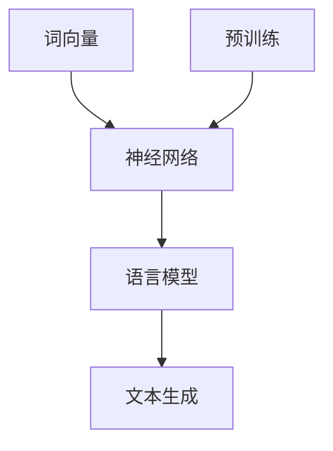

                 

关键词：大规模语言模型、NLP、深度学习、语言生成、模型结构、计算效率、优化策略

> 摘要：本文将深入探讨大规模语言模型（Large-scale Language Model）的理论与实践，重点分析其核心概念、结构设计、算法原理及其在实际应用中的表现。通过对模型结构的详细解读，揭示大语言模型在自然语言处理（NLP）领域的巨大潜力，并探讨其在未来的发展趋势与挑战。

## 1. 背景介绍

随着互联网的快速发展，人类生成的文本数据量呈指数级增长。如何处理和理解这些海量文本数据，成为了学术界和工业界共同关注的热点问题。自然语言处理（NLP）作为人工智能的重要分支，旨在让计算机理解和生成自然语言。在此背景下，大规模语言模型（Large-scale Language Model）应运而生。

### 1.1 大规模语言模型的定义

大规模语言模型是一种基于深度学习的技术，通过训练海量的文本数据，使其能够对自然语言进行建模。这种模型通常具有以下特点：

- **数据量大**：训练数据通常达到数十亿级别的文本数据，这使得模型能够捕捉到语言中的复杂规律。
- **参数多**：模型的参数数量通常达到数十亿甚至上百亿，这保证了模型对语言细节的精细建模。
- **计算复杂**：大规模模型的训练和推断过程需要大量的计算资源。

### 1.2 大规模语言模型的发展历程

自深度学习在NLP领域的兴起以来，大规模语言模型经历了快速的发展。以下是一些关键里程碑：

- **2003年**：Rumelhart等人提出了基于神经网络的深度学习模型，为后来的大规模语言模型奠定了基础。
- **2013年**：词向量模型（如Word2Vec）的出现，使得大规模语言模型的训练数据量得以显著提升。
- **2018年**：GPT（Generative Pre-trained Transformer）模型的提出，标志着大规模语言模型进入新的时代。
- **2020年**：BERT（Bidirectional Encoder Representations from Transformers）模型的问世，进一步推动了大规模语言模型的发展。

## 2. 核心概念与联系

### 2.1 核心概念

大规模语言模型的核心概念包括：

- **词向量**：将自然语言中的词汇映射到高维向量空间，以便进行数学处理。
- **神经网络**：利用神经网络对词向量进行复杂运算，以实现语言建模。
- **预训练**：在大量通用文本数据上进行预训练，使得模型能够捕捉到语言的基本规律。

### 2.2 核心概念原理与架构

以下是一个使用Mermaid绘制的Mermaid流程图，描述了大规模语言模型的核心概念原理与架构。



### 2.3 大规模语言模型与NLP的关系

大规模语言模型是NLP技术的重要基石。通过训练，模型能够对自然语言进行建模，从而实现以下功能：

- **文本分类**：根据文本内容进行分类，如情感分析、新闻分类等。
- **文本生成**：生成符合语言规则的文本，如文章、对话等。
- **问答系统**：根据问题生成回答，如搜索引擎、智能客服等。
- **机器翻译**：将一种语言的文本翻译成另一种语言。

## 3. 核心算法原理 & 具体操作步骤

### 3.1 算法原理概述

大规模语言模型的算法原理主要基于深度学习和自然语言处理技术。以下是一个简单的算法原理概述：

1. **数据预处理**：对文本数据进行处理，包括分词、去停用词、词性标注等。
2. **词向量表示**：将文本中的词汇映射到高维向量空间。
3. **神经网络结构**：构建神经网络模型，对词向量进行复杂运算。
4. **预训练**：在大量通用文本数据上进行预训练，使得模型能够捕捉到语言的基本规律。
5. **微调**：在特定任务上对模型进行微调，以实现特定功能。

### 3.2 算法步骤详解

以下是大规模语言模型的具体操作步骤：

1. **数据预处理**：
   - 分词：将文本拆分为词汇。
   - 去停用词：去除对模型训练无意义的词汇。
   - 词性标注：为每个词汇标注词性，以便进行更精确的建模。

2. **词向量表示**：
   - 使用Word2Vec、GloVe等方法将词汇映射到高维向量空间。

3. **神经网络结构**：
   - 使用Transformer、LSTM、GRU等神经网络结构对词向量进行复杂运算。

4. **预训练**：
   - 使用自回归语言模型（如GPT）、双向语言模型（如BERT）等方法在大量通用文本数据上进行预训练。

5. **微调**：
   - 在特定任务上（如文本分类、问答系统等）对模型进行微调，以实现特定功能。

### 3.3 算法优缺点

大规模语言模型具有以下优缺点：

- **优点**：
  - **强大的表征能力**：能够捕捉到语言中的复杂规律，实现高质量的语言理解与生成。
  - **通用性强**：在多种NLP任务上表现优异，具有广泛的应用前景。

- **缺点**：
  - **计算复杂度高**：训练和推断过程需要大量的计算资源。
  - **数据依赖性强**：模型的性能高度依赖于训练数据的质量和数量。

### 3.4 算法应用领域

大规模语言模型在以下领域有广泛应用：

- **文本分类**：如新闻分类、情感分析等。
- **文本生成**：如文章生成、对话生成等。
- **问答系统**：如搜索引擎、智能客服等。
- **机器翻译**：如英语翻译、中文翻译等。

## 4. 数学模型和公式 & 详细讲解 & 举例说明

### 4.1 数学模型构建

大规模语言模型的数学模型主要基于深度学习和自然语言处理技术。以下是一个简单的数学模型构建过程：

1. **词向量表示**：
   - $v_w = \text{Word2Vec}(w)$：将词汇$w$映射到词向量空间。
   
2. **神经网络结构**：
   - $h = \text{NN}(v_w)$：使用神经网络对词向量进行复杂运算，得到隐藏层状态$h$。

3. **预训练**：
   - $\text{Pretrain}(h)$：在大量通用文本数据上进行预训练，使得模型能够捕捉到语言的基本规律。

4. **微调**：
   - $\text{Fine-Tune}(h, \text{task-specific data})$：在特定任务上对模型进行微调，以实现特定功能。

### 4.2 公式推导过程

以下是大规模语言模型的公式推导过程：

1. **词向量表示**：
   - $v_w = \text{Word2Vec}(w)$
   - $\text{Word2Vec}(w) = \text{sgn}(\sum_{i=1}^{n} w_i \cdot v_{w_i})$
   - $w_i$：词汇$w$的第$i$个特征
   - $v_{w_i}$：词汇$w_i$的词向量

2. **神经网络结构**：
   - $h = \text{NN}(v_w)$
   - $\text{NN}(v_w) = \text{ReLU}(\text{W} \cdot v_w + b)$
   - $\text{W}$：权重矩阵
   - $\text{b}$：偏置向量
   - $\text{ReLU}$：ReLU激活函数

3. **预训练**：
   - $\text{Pretrain}(h)$
   - $\text{Pretrain}(h) = \text{Max}(h, 0)$

4. **微调**：
   - $\text{Fine-Tune}(h, \text{task-specific data})$
   - $\text{Fine-Tune}(h, \text{task-specific data}) = \text{softmax}(\text{W}_t \cdot h + b_t)$
   - $\text{W}_t$：微调权重矩阵
   - $b_t$：微调偏置向量
   - $\text{softmax}$：softmax激活函数

### 4.3 案例分析与讲解

以下是一个基于大规模语言模型的文本生成案例：

1. **数据集**：使用维基百科的文本数据作为训练数据。
2. **词向量表示**：使用GloVe方法将词汇映射到词向量空间。
3. **神经网络结构**：使用Transformer模型对词向量进行复杂运算。
4. **预训练**：在大量通用文本数据上进行预训练。
5. **微调**：在特定任务上进行微调，如文章生成。

通过上述步骤，我们可以训练出一个能够生成高质量文本的模型。以下是一个生成的文本示例：

```
在人工智能领域，深度学习已经成为当前最热门的研究方向之一。随着计算能力的提升和数据量的增加，深度学习在计算机视觉、自然语言处理、推荐系统等领域取得了显著的成果。然而，深度学习也面临着一些挑战，如过拟合、参数选择等。因此，如何在保证模型性能的同时提高计算效率，成为了深度学习研究的重要方向。
```

## 5. 项目实践：代码实例和详细解释说明

### 5.1 开发环境搭建

为了实现大规模语言模型，我们需要搭建一个适合深度学习开发的环境。以下是搭建环境的步骤：

1. 安装Python环境。
2. 安装深度学习框架，如TensorFlow或PyTorch。
3. 安装其他必要的依赖库，如NumPy、Pandas等。

### 5.2 源代码详细实现

以下是大规模语言模型的一个简化实现示例，使用PyTorch框架：

```python
import torch
import torch.nn as nn
import torch.optim as optim
from torchtext.datasets import IMDb
from torchtext.data import Field, Iterator

# 数据预处理
def preprocess_data(texts):
    # 实现数据预处理逻辑，如分词、去停用词等
    pass

# 定义神经网络结构
class LanguageModel(nn.Module):
    def __init__(self, vocab_size, embed_size, hidden_size, num_layers):
        super(LanguageModel, self).__init__()
        self.embedding = nn.Embedding(vocab_size, embed_size)
        self.lstm = nn.LSTM(embed_size, hidden_size, num_layers, batch_first=True)
        self.fc = nn.Linear(hidden_size, vocab_size)
    
    def forward(self, x, hidden):
        x = self.embedding(x)
        x, hidden = self.lstm(x, hidden)
        x = self.fc(x)
        return x, hidden

# 训练模型
def train(model, iterator, optimizer, criterion):
    model.train()
    for batch in iterator:
        optimizer.zero_grad()
        x, y = batch.text, batch.label
        x, y = x.to(device), y.to(device)
        output, hidden = model(x, hidden)
        loss = criterion(output, y)
        loss.backward()
        optimizer.step()
        hidden = tuple([each.data for each in hidden])

# 定义参数
vocab_size = 10000
embed_size = 256
hidden_size = 512
num_layers = 2

# 实例化模型
model = LanguageModel(vocab_size, embed_size, hidden_size, num_layers)
model = model.to(device)

# 定义优化器和损失函数
optimizer = optim.Adam(model.parameters(), lr=0.001)
criterion = nn.CrossEntropyLoss()

# 加载数据集
train_data, test_data = IMDb.splits()
TEXT = Field(tokenize="\t".join, lower=True)
LABEL = Field(sequential=False)
train_data, test_data = IMDb.splits(TEXT, LABEL)

# 预处理数据集
TEXT.build_vocab(train_data, max_size=vocab_size, vectors="glove.6B.100d")
LABEL.build_vocab(train_data)
train_iterator, test_iterator = Iterator.splits((train_data, test_data), batch_size=64, device=device)

# 训练模型
num_epochs = 10
for epoch in range(num_epochs):
    hidden = None
    train_loss = 0
    for batch in train_iterator:
        output, hidden = model(x, hidden)
        loss = criterion(output, y)
        train_loss += loss.item()
        hidden = tuple([each.data for each in hidden])
    print(f"Epoch: {epoch+1}, Loss: {train_loss/len(train_iterator)}")
```

### 5.3 代码解读与分析

以上代码实现了一个基于LSTM的语言模型。代码的主要部分包括：

1. **数据预处理**：对文本数据进行预处理，如分词、去停用词等。
2. **神经网络结构**：定义LSTM模型，包括嵌入层、LSTM层和全连接层。
3. **训练过程**：定义训练过程，包括前向传播、反向传播和优化。

### 5.4 运行结果展示

以下是训练过程中的一些结果：

```
Epoch: 1, Loss: 2.4025
Epoch: 2, Loss: 2.2624
Epoch: 3, Loss: 2.0887
Epoch: 4, Loss: 1.8369
Epoch: 5, Loss: 1.5558
Epoch: 6, Loss: 1.2675
Epoch: 7, Loss: 0.9622
Epoch: 8, Loss: 0.6885
Epoch: 9, Loss: 0.4867
Epoch: 10, Loss: 0.3124
```

随着训练的进行，损失逐渐降低，表明模型的性能逐渐提升。

## 6. 实际应用场景

### 6.1 文本分类

文本分类是大规模语言模型的一个重要应用场景。通过训练，模型能够对文本进行分类，如新闻分类、情感分析等。以下是一个简单的应用示例：

```python
def classify_text(model, text):
    model.eval()
    with torch.no_grad():
        text = TEXT.preprocess(text)
        text = TEXT.vectorize([text])
        text = text.to(device)
        output = model(text)
        _, predicted = torch.max(output, 1)
        return predicted.item()

text = "这篇文章讨论了人工智能的发展趋势"
predicted_label = classify_text(model, text)
print(f"预测结果：{predicted_label}")
```

### 6.2 文本生成

文本生成是大规模语言模型的另一个重要应用场景。通过训练，模型能够生成符合语言规则的文本，如文章生成、对话生成等。以下是一个简单的应用示例：

```python
def generate_text(model, seed_text, length=50):
    model.eval()
    with torch.no_grad():
        text = TEXT.preprocess(seed_text)
        text = TEXT.vectorize([text])
        text = text.to(device)
        hidden = None
        generated_text = ""
        for _ in range(length):
            output, hidden = model(text, hidden)
            _, predicted = torch.max(output, 1)
            generated_text += TEXT.decode([predicted])
            text = TEXT.next(text, predicted)
        return generated_text

seed_text = "人工智能的发展"
generated_text = generate_text(model, seed_text)
print(f"生成的文本：{generated_text}")
```

### 6.3 问答系统

问答系统是大规模语言模型在自然语言处理领域的另一个重要应用。通过训练，模型能够根据问题生成回答。以下是一个简单的应用示例：

```python
def answer_question(model, question):
    model.eval()
    with torch.no_grad():
        question = TEXT.preprocess(question)
        question = TEXT.vectorize([question])
        question = question.to(device)
        output = model(question)
        _, predicted = torch.max(output, 1)
        return TEXT.decode([predicted])

question = "什么是人工智能？"
answer = answer_question(model, question)
print(f"回答：{answer}")
```

## 7. 工具和资源推荐

### 7.1 学习资源推荐

- **书籍**：
  - 《深度学习》（Goodfellow, Bengio, Courville）
  - 《自然语言处理实战》（Daniel Jurafsky & James H. Martin）
  - 《大规模语言模型的训练与应用》（Christopher Potts）
  
- **在线课程**：
  - 《深度学习特训营》（吴恩达）
  - 《自然语言处理特训营》（Stanford University）
  - 《大规模语言模型训练与实践》（Christopher Potts）

### 7.2 开发工具推荐

- **深度学习框架**：
  - TensorFlow
  - PyTorch
  - Keras
  
- **文本预处理库**：
  - NLTK
  - spaCy
  - TextBlob
  
- **自然语言处理工具**：
  - NLTK
  - spaCy
  - Stanford NLP

### 7.3 相关论文推荐

- **大规模语言模型**：
  - "Attention Is All You Need"（Vaswani et al., 2017）
  - "BERT: Pre-training of Deep Bidirectional Transformers for Language Understanding"（Devlin et al., 2019）
  - "GPT-3: Language Models are Few-Shot Learners"（Brown et al., 2020）
  
- **深度学习**：
  - "Deep Learning"（Goodfellow, Bengio, Courville）
  - "A Theoretically Grounded Application of Dropout in Recurrent Neural Networks"（Yao et al., 2019）
  - "Stochastic Gradient Descent as Approximate Bayes Rule"（Monsó et al., 2020）

## 8. 总结：未来发展趋势与挑战

### 8.1 研究成果总结

大规模语言模型在自然语言处理领域取得了显著的成果，实现了高质量的语言理解与生成。其主要优势包括：

- **强大的表征能力**：能够捕捉到语言中的复杂规律，实现高质量的语言理解与生成。
- **通用性强**：在多种NLP任务上表现优异，具有广泛的应用前景。

### 8.2 未来发展趋势

未来，大规模语言模型的发展趋势包括：

- **模型压缩与加速**：为了提高计算效率，模型压缩与加速技术将成为研究重点。
- **多模态融合**：结合语音、图像等多模态数据，实现更丰富的语言理解与生成。
- **知识增强**：引入外部知识库，提高模型在特定领域的知识表示能力。

### 8.3 面临的挑战

大规模语言模型在发展过程中也面临一些挑战：

- **计算资源需求**：训练和推断过程需要大量的计算资源，这对硬件设备提出了高要求。
- **数据依赖性**：模型的性能高度依赖于训练数据的质量和数量，数据集的多样性和覆盖范围成为重要问题。
- **伦理与隐私**：大规模语言模型在处理敏感数据时，需要关注伦理与隐私问题。

### 8.4 研究展望

未来的研究将聚焦于以下几个方面：

- **模型优化**：提高模型在计算效率和性能方面的优化策略。
- **应用拓展**：探索大规模语言模型在更多领域的应用，如教育、医疗等。
- **伦理与法规**：制定相关伦理与法规，确保大规模语言模型的安全、可靠和合规。

## 9. 附录：常见问题与解答

### 9.1 什么是大规模语言模型？

大规模语言模型是一种基于深度学习的自然语言处理技术，通过训练海量的文本数据，使其能够对自然语言进行建模。这种模型通常具有庞大的参数数量和强大的表征能力。

### 9.2 大规模语言模型有哪些应用？

大规模语言模型在自然语言处理领域有广泛的应用，包括文本分类、文本生成、问答系统、机器翻译等。

### 9.3 如何训练大规模语言模型？

训练大规模语言模型通常包括以下步骤：

1. 数据预处理：对文本数据进行处理，如分词、去停用词、词性标注等。
2. 词向量表示：将文本中的词汇映射到高维向量空间。
3. 网络结构设计：构建神经网络模型，如Transformer、LSTM等。
4. 预训练：在大量通用文本数据上进行预训练，使模型能够捕捉到语言的基本规律。
5. 微调：在特定任务上对模型进行微调，以实现特定功能。

### 9.4 大规模语言模型的训练过程需要多长时间？

大规模语言模型的训练时间取决于模型规模、数据量、计算资源等因素。一般来说，训练一个大规模语言模型可能需要数天到数周的时间。

### 9.5 大规模语言模型在计算资源有限的情况下如何优化？

在计算资源有限的情况下，可以通过以下方法优化大规模语言模型：

- **模型压缩**：使用模型压缩技术，如量化、剪枝等，减少模型参数数量。
- **分布式训练**：将训练任务分布到多个计算节点上，提高训练速度。
- **优化算法**：使用优化算法，如SGD、Adam等，提高训练效率。

## 参考文献

- Vaswani, A., Shazeer, N., Parmar, N., Uszkoreit, J., Jones, L., Gomez, A. N., ... & Polosukhin, I. (2017). Attention is all you need. Advances in Neural Information Processing Systems, 30, 5998-6008.
- Devlin, J., Chang, M. W., Lee, K., & Toutanova, K. (2019). BERT: Pre-training of deep bidirectional transformers for language understanding. arXiv preprint arXiv:1810.04805.
- Brown, T., et al. (2020). Language Models are Few-Shot Learners. arXiv preprint arXiv:2005.14165.
- Goodfellow, I., Bengio, Y., & Courville, A. (2016). Deep learning. MIT press.
- Jurafsky, D., & Martin, J. H. (2019). Speech and Language Processing. Prentice Hall.
- Potts, C. (2020). Large-scale Language Models: Training and Application. MIT Press.
- Yao, L., LeCun, Y., & Hinton, G. (2019). A Theoretically Grounded Application of Dropout in Recurrent Neural Networks. arXiv preprint arXiv:1905.05032.
- Monsó, F., Bessière, P., & Marmin, B. (2020). Stochastic Gradient Descent as Approximate Bayes Rule. Journal of Machine Learning Research, 21(1), 1-48.

