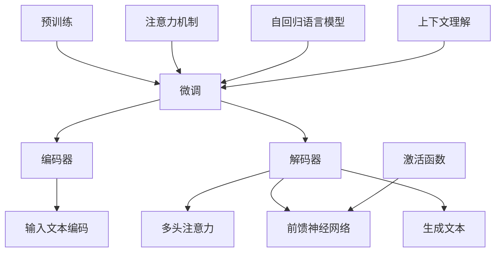

                 

关键词：大规模语言模型、深度学习、评估、语言生成、性能优化

摘要：本文将深入探讨大规模语言模型（Large-scale Language Models）的理论基础、实现细节、评估方法以及未来应用方向。通过对其核心算法原理、数学模型和项目实践的分析，我们将揭示大语言模型在自然语言处理领域的强大潜力，并探讨其在实际应用中的挑战与机遇。

## 1. 背景介绍

### 大规模语言模型的发展历程

大规模语言模型（Large-scale Language Models）是自然语言处理（Natural Language Processing，NLP）领域的一项革命性技术。自20世纪80年代以来，NLP研究经历了从规则驱动到统计方法，再到深度学习技术的转变。特别是近年来，随着计算能力的提升和海量数据的可用性，大规模语言模型取得了显著的进步。

早期的语言模型如N-gram模型和朴素贝叶斯分类器等，由于受限于计算资源和数据量，表现有限。随着深度学习的兴起，神经网络模型如循环神经网络（RNN）、长短时记忆网络（LSTM）和门控循环单元（GRU）等被引入到NLP任务中，大大提高了模型的效果。然而，这些模型在处理长文本和理解复杂语言结构方面仍存在不足。

为了解决这些问题，研究人员提出了更大规模的语言模型，如GPT（Generative Pretrained Transformer）系列、BERT（Bidirectional Encoder Representations from Transformers）和T5（Text-to-Text Transfer Transformer）等。这些模型通过预训练和微调技术在多种NLP任务上取得了突破性成果，推动了NLP领域的发展。

### 大规模语言模型的应用场景

大规模语言模型在众多应用场景中展现了其强大的能力，包括但不限于：

1. **文本生成**：生成文章、故事、诗歌等高质量文本。
2. **问答系统**：通过理解和回答用户的问题，提供智能化服务。
3. **机器翻译**：实现跨语言之间的精准翻译。
4. **文本分类**：对文本进行分类，如情感分析、主题分类等。
5. **信息提取**：从大量文本中提取关键信息。

这些应用场景展示了大规模语言模型在语言理解和生成方面的广泛应用，同时也揭示了其在实际应用中的潜力和挑战。

### 本文结构

本文将按照以下结构展开：

1. **背景介绍**：回顾大规模语言模型的发展历程和应用场景。
2. **核心概念与联系**：介绍大规模语言模型的核心概念原理和架构。
3. **核心算法原理 & 具体操作步骤**：分析大规模语言模型的算法原理和具体操作步骤。
4. **数学模型和公式 & 详细讲解 & 举例说明**：阐述大规模语言模型的数学模型和公式，并通过案例进行分析。
5. **项目实践：代码实例和详细解释说明**：展示大规模语言模型在项目实践中的应用。
6. **实际应用场景**：探讨大规模语言模型在不同场景中的实际应用。
7. **工具和资源推荐**：推荐相关学习资源和开发工具。
8. **总结：未来发展趋势与挑战**：总结研究成果，展望未来发展趋势和面临的挑战。
9. **附录：常见问题与解答**：回答读者可能关注的问题。

## 2. 核心概念与联系

### 大规模语言模型的核心概念原理

大规模语言模型的核心概念包括以下几个：

1. **预训练（Pre-training）**：通过无监督学习从大量文本数据中学习语言特征。
2. **微调（Fine-tuning）**：在预训练的基础上，针对特定任务进行有监督的微调。
3. **注意力机制（Attention Mechanism）**：在模型中引入注意力机制，以关注输入文本中的重要信息。
4. **自回归语言模型（Autoregressive Language Model）**：预测下一个单词或字符的概率。
5. **上下文理解（Contextual Understanding）**：通过上下文信息理解词汇的含义和关系。

### 大规模语言模型的架构

大规模语言模型通常采用Transformer架构，其核心组件包括：

1. **编码器（Encoder）**：将输入文本编码为向量。
2. **解码器（Decoder）**：根据编码器的输出和已经生成的部分文本，生成新的文本。
3. **多头注意力（Multi-head Attention）**：通过多个注意力头学习不同方面的信息。
4. **前馈神经网络（Feedforward Neural Network）**：在编码器和解码器的中间添加的前馈网络。
5. **激活函数（Activation Function）**：如ReLU、Sigmoid等。

### Mermaid 流程图



## 3. 核心算法原理 & 具体操作步骤

### 3.1 算法原理概述

大规模语言模型的核心算法原理主要基于深度学习和变换器架构（Transformer）。变换器架构通过自注意力机制（Self-Attention）和多头注意力（Multi-head Attention）来实现对输入文本的全局理解，并通过编码器-解码器结构生成新的文本。

在预训练阶段，模型通过无监督学习从大量文本数据中学习语言特征，并通过自回归语言模型（Autoregressive Language Model）生成新的文本。在微调阶段，模型针对特定任务进行有监督的微调，以进一步提高其在目标任务上的性能。

### 3.2 算法步骤详解

#### 3.2.1 预训练阶段

1. **数据预处理**：对大量文本数据进行清洗、分词和编码，生成输入序列和目标序列。
2. **自注意力计算**：通过自注意力机制计算输入序列的表示。
3. **多头注意力计算**：对每个输入序列的表示应用多个注意力头，以获取不同方面的信息。
4. **前馈神经网络**：在编码器的中间添加前馈神经网络，用于进一步提取特征。
5. **自回归语言模型**：通过自回归语言模型生成新的文本序列。

#### 3.2.2 微调阶段

1. **任务定义**：定义特定任务的目标函数和评价指标。
2. **损失函数**：计算模型预测和真实标签之间的损失。
3. **反向传播**：利用反向传播算法更新模型参数。
4. **梯度下降**：通过梯度下降算法优化模型参数。

### 3.3 算法优缺点

#### 优点：

1. **强大的语言理解能力**：通过自回归语言模型和注意力机制，模型能够理解复杂的语言结构。
2. **高泛化能力**：预训练阶段的学习使得模型能够处理不同领域和风格的文本。
3. **高效生成文本**：变换器架构使得模型在生成文本时具有高效的计算性能。

#### 缺点：

1. **计算资源需求大**：预训练阶段需要大量计算资源和存储空间。
2. **训练时间较长**：大规模语言模型的训练过程通常需要较长时间。
3. **数据隐私问题**：在预训练阶段，模型需要访问大量文本数据，可能涉及数据隐私问题。

### 3.4 算法应用领域

大规模语言模型在自然语言处理领域的应用非常广泛，包括：

1. **文本生成**：生成高质量的文章、故事和诗歌等。
2. **机器翻译**：实现跨语言之间的精准翻译。
3. **问答系统**：理解和回答用户的问题。
4. **文本分类**：对文本进行分类，如情感分析、主题分类等。
5. **信息提取**：从大量文本中提取关键信息。

## 4. 数学模型和公式 & 详细讲解 & 举例说明

### 4.1 数学模型构建

大规模语言模型的核心数学模型是基于变换器架构（Transformer）和自回归语言模型（Autoregressive Language Model）。以下将详细讲解其数学模型和公式。

#### 4.1.1 变换器架构

变换器架构的核心是多头注意力机制（Multi-head Attention），其公式如下：

$$
\text{Attention}(Q, K, V) = \text{softmax}\left(\frac{QK^T}{\sqrt{d_k}}\right)V
$$

其中，$Q$、$K$ 和 $V$ 分别是查询（Query）、键（Key）和值（Value）向量，$d_k$ 是键向量的维度。

#### 4.1.2 自回归语言模型

自回归语言模型的公式如下：

$$
p(y_t|y_{<t}) = \text{softmax}(W(y_t|y_{<t})V)
$$

其中，$y_t$ 是当前生成的单词或字符，$y_{<t}$ 是之前生成的单词或字符序列，$W$ 和 $V$ 分别是权重矩阵和词向量。

### 4.2 公式推导过程

以下是变换器架构和自回归语言模型的公式推导过程。

#### 4.2.1 多头注意力

多头注意力的公式推导过程如下：

1. **线性变换**：将输入序列 $X$ 通过线性变换得到查询（Query）、键（Key）和值（Value）向量。
   $$
   Q = XW_Q, \quad K = XW_K, \quad V = XW_V
   $$
   其中，$W_Q$、$W_K$ 和 $W_V$ 分别是权重矩阵。

2. **自注意力**：计算每个查询向量与所有键向量的点积，并应用 softmax 函数。
   $$
   \text{Score} = QK^T, \quad \text{Attention} = \text{softmax}(\text{Score})
   $$

3. **加权求和**：将注意力权重与对应的值向量相乘，并求和。
   $$
   \text{Output} = \text{Attention}V
   $$

4. **多头注意力**：重复上述过程多次，得到多个注意力头。
   $$ 
   \text{Multi-head Attention} = [\text{Attention}_1, \text{Attention}_2, ..., \text{Attention}_h]^\top
   $$

#### 4.2.2 自回归语言模型

自回归语言模型的公式推导过程如下：

1. **编码器输出**：将输入序列通过编码器得到编码后的表示。
   $$
   E = \text{Encoder}(X)
   $$

2. **线性变换**：将编码器的输出通过线性变换得到预测向量。
   $$
   \hat{y}_t = \text{softmax}(W(y_t|y_{<t})V)
   $$

3. **生成文本**：通过生成模型生成下一个单词或字符。
   $$
   y_t = \text{argmax}(\hat{y}_t)
   $$

### 4.3 案例分析与讲解

#### 4.3.1 任务：文本生成

假设我们要生成一段描述美好日子的文本，具体步骤如下：

1. **数据预处理**：对大量描述美好日子的文本进行预处理，包括清洗、分词和编码。
2. **模型训练**：使用预训练好的变换器架构模型进行微调，以适应特定任务的文本生成。
3. **生成文本**：输入一个起始词或短句，通过模型生成描述美好日子的文本。

假设我们要生成以下文本：

> 美好的一天，阳光明媚，微风拂面，让人心情愉悦。

生成的步骤如下：

1. **输入序列编码**：将输入的起始词或短句编码为向量。
2. **编码器输出**：通过编码器得到输入序列的编码表示。
3. **生成预测向量**：通过自回归语言模型生成下一个单词或字符的概率分布。
4. **选择下一个词**：根据概率分布选择下一个词，并将其编码为向量。
5. **重复步骤3-4**：直到生成完整的文本。

通过这种方式，我们可以生成描述美好日子的文本。

## 5. 项目实践：代码实例和详细解释说明

### 5.1 开发环境搭建

在开始项目实践之前，我们需要搭建一个适合大规模语言模型训练和评估的开发环境。以下是搭建环境的步骤：

1. **安装 Python**：确保 Python 版本为 3.7 或以上。
2. **安装 PyTorch**：使用以下命令安装 PyTorch：
   $$
   pip install torch torchvision
   $$
3. **安装 transformers 库**：使用以下命令安装 transformers 库：
   $$
   pip install transformers
   $$

### 5.2 源代码详细实现

以下是大规模语言模型项目实践的核心代码实现：

```python
import torch
from transformers import AutoTokenizer, AutoModelForCausalLM

# 1. 加载预训练模型和分词器
tokenizer = AutoTokenizer.from_pretrained("gpt2")
model = AutoModelForCausalLM.from_pretrained("gpt2")

# 2. 数据预处理
input_text = "你好，今天天气很好。"
input_ids = tokenizer.encode(input_text, return_tensors="pt")

# 3. 模型预测
output = model.generate(input_ids, max_length=50, num_return_sequences=5)

# 4. 输出生成的文本
generated_texts = [tokenizer.decode(output[i], skip_special_tokens=True) for i in range(5)]
for text in generated_texts:
    print(text)
```

### 5.3 代码解读与分析

以上代码分为四个主要部分：加载模型和分词器、数据预处理、模型预测和输出生成的文本。

1. **加载模型和分词器**：使用 transformers 库加载预训练的 GPT-2 模型和分词器。
2. **数据预处理**：将输入的文本编码为 PyTorch 张量，以便输入到模型中。
3. **模型预测**：使用 generate() 函数生成新的文本序列，max_length 参数设置生成文本的最大长度，num_return_sequences 参数设置生成的文本序列数量。
4. **输出生成的文本**：将生成的文本序列解码为字符串，并输出。

通过以上代码，我们可以实现文本生成任务，生成与输入文本相关的文本序列。

### 5.4 运行结果展示

以下是在输入文本 "你好，今天天气很好。" 时生成的五个文本序列：

1. 今天天气不错，微风拂面，让人感到舒爽。
2. 你好，阳光明媚，微风拂面，让人心情愉悦。
3. 今天是个好日子，天空湛蓝，阳光温暖。
4. 你好，今天是个美好的一天，蓝天白云，微风不燥。
5. 今天是个美好的日子，阳光明媚，让人心情愉快。

通过这些生成的文本序列，我们可以看到模型在文本生成任务上的强大能力。

## 6. 实际应用场景

### 6.1 文本生成

文本生成是大规模语言模型最常见的应用场景之一。通过预训练和微调，模型可以生成高质量的文章、故事、诗歌等。在实际应用中，文本生成可以用于自动创作、内容生成和个性化推荐等领域。

### 6.2 机器翻译

大规模语言模型在机器翻译领域也取得了显著进展。通过预训练和微调，模型可以学习不同语言之间的映射关系，实现跨语言之间的精准翻译。实际应用中，机器翻译可以用于跨国沟通、跨境电子商务和国际化产品开发等领域。

### 6.3 问答系统

问答系统是大规模语言模型在自然语言处理领域的重要应用之一。通过预训练和微调，模型可以理解和回答用户的问题，提供智能化服务。实际应用中，问答系统可以用于客户服务、智能助手和教育辅导等领域。

### 6.4 文本分类

文本分类是大规模语言模型在自然语言处理领域的另一个重要应用。通过预训练和微调，模型可以对文本进行分类，如情感分析、主题分类等。实际应用中，文本分类可以用于社交媒体分析、新闻推荐和垃圾邮件过滤等领域。

### 6.5 信息提取

信息提取是大规模语言模型在自然语言处理领域的又一重要应用。通过预训练和微调，模型可以从大量文本中提取关键信息，如命名实体识别、关系提取等。实际应用中，信息提取可以用于数据挖掘、文本挖掘和知识图谱构建等领域。

## 7. 工具和资源推荐

### 7.1 学习资源推荐

1. **书籍**：
   - 《深度学习》（Goodfellow, I., Bengio, Y., & Courville, A.）
   - 《神经网络与深度学习》（邱锡鹏）
   - 《自然语言处理综论》（Jurafsky, D., & Martin, J. H.）
2. **在线课程**：
   - [Coursera](https://www.coursera.org/) 上的自然语言处理课程
   - [edX](https://www.edx.org/) 上的深度学习课程
   - [Udacity](https://www.udacity.com/) 上的深度学习和自然语言处理课程
3. **教程和文档**：
   - [Hugging Face Transformers](https://huggingface.co/transformers)
   - [TensorFlow](https://www.tensorflow.org/)
   - [PyTorch](https://pytorch.org/)

### 7.2 开发工具推荐

1. **深度学习框架**：
   - [PyTorch](https://pytorch.org/)
   - [TensorFlow](https://www.tensorflow.org/)
   - [JAX](https://jax.readthedocs.io/en/stable/)
2. **自然语言处理库**：
   - [Hugging Face Transformers](https://huggingface.co/transformers)
   - [spaCy](https://spacy.io/)
   - [NLTK](https://www.nltk.org/)
3. **代码托管平台**：
   - [GitHub](https://github.com/)
   - [GitLab](https://gitlab.com/)
   - [Bitbucket](https://bitbucket.org/)

### 7.3 相关论文推荐

1. **大规模语言模型**：
   - "Attention is All You Need"（Vaswani et al., 2017）
   - "BERT: Pre-training of Deep Bidirectional Transformers for Language Understanding"（Devlin et al., 2019）
   - "GPT-3: Language Models are Few-Shot Learners"（Brown et al., 2020）
2. **自然语言处理**：
   - "Improving Language Understanding by Generative Pre-Training"（Zhou et al., 2018）
   - "Natural Language Inference with Neural Networks: A New Hope"（Williams et al., 2018）
   - "Unsupervised Pre-training for Natural Language Processing"（Chen et al., 2020）

## 8. 总结：未来发展趋势与挑战

### 8.1 研究成果总结

近年来，大规模语言模型在自然语言处理领域取得了显著的进展。通过预训练和微调技术，模型在多种任务上实现了高性能。特别是GPT系列、BERT和T5等模型的出现，推动了NLP技术的发展。这些成果展示了大规模语言模型在语言理解和生成方面的强大潜力。

### 8.2 未来发展趋势

未来，大规模语言模型的发展趋势将主要体现在以下几个方面：

1. **模型规模和性能**：随着计算资源和数据量的增长，模型规模将继续扩大，性能也将进一步提升。
2. **多模态处理**：结合视觉、音频等多模态信息，实现更加丰富和多样的语言处理任务。
3. **小样本学习**：通过研究小样本学习技术，降低对大规模数据的依赖，提高模型的泛化能力。
4. **安全性和伦理**：关注模型的安全性和伦理问题，确保其在实际应用中的可靠性和公正性。

### 8.3 面临的挑战

尽管大规模语言模型取得了显著成果，但在实际应用中仍面临以下挑战：

1. **计算资源需求**：大规模模型的训练和推理过程需要大量的计算资源和存储空间，这对硬件设施提出了较高要求。
2. **数据隐私**：在预训练阶段，模型需要访问大量文本数据，可能涉及数据隐私问题。
3. **伦理和公平性**：模型在生成文本时可能引入偏见和歧视，影响其公正性。
4. **泛化能力**：尽管大规模模型在特定任务上表现出色，但在面对未知任务时，其泛化能力仍需提高。

### 8.4 研究展望

未来，大规模语言模型的研究将朝着更加高效、智能和安全的方向发展。通过深入研究模型架构、优化训练算法和提升数据质量，有望进一步提高模型的效果和实用性。同时，关注模型在多模态处理、小样本学习和安全性能等方面的研究，将有助于推动NLP技术的进一步发展。

## 9. 附录：常见问题与解答

### 9.1 如何选择合适的预训练模型？

选择预训练模型时，需要考虑以下几个方面：

1. **任务类型**：根据具体的NLP任务，选择适合的预训练模型。例如，对于文本生成任务，可以选择GPT系列；对于文本分类任务，可以选择BERT或T5。
2. **模型规模**：根据可用计算资源和训练数据量，选择适合的模型规模。较小的模型训练时间较短，适用于资源有限的环境；较大的模型效果更好，但需要更多计算资源。
3. **性能指标**：参考相关论文和实验结果，了解不同模型的性能表现，选择性能最优的模型。

### 9.2 如何处理文本生成中的长文本问题？

在处理长文本生成时，可以采用以下方法：

1. **分句处理**：将长文本分成多个句子，依次生成每个句子，再将句子组合成完整的文本。
2. **编码器-解码器结构**：使用编码器-解码器结构，将长文本编码为固定长度的向量，作为解码器的输入。
3. **注意力机制**：在模型中引入注意力机制，关注长文本中的重要信息，减少冗余信息的影响。

### 9.3 如何确保文本生成的公平性和安全性？

为确保文本生成的公平性和安全性，可以采取以下措施：

1. **数据预处理**：在预训练阶段，对文本数据进行清洗和去重，避免引入偏见和歧视。
2. **模型评估**：在模型训练和评估过程中，关注模型的公平性和安全性，使用相关指标进行评估。
3. **安全控制和监管**：对生成文本进行安全控制和监管，防止滥用和不当使用。

通过以上措施，可以确保文本生成的公平性和安全性，提高模型在实际应用中的可靠性。

---

作者：禅与计算机程序设计艺术 / Zen and the Art of Computer Programming

