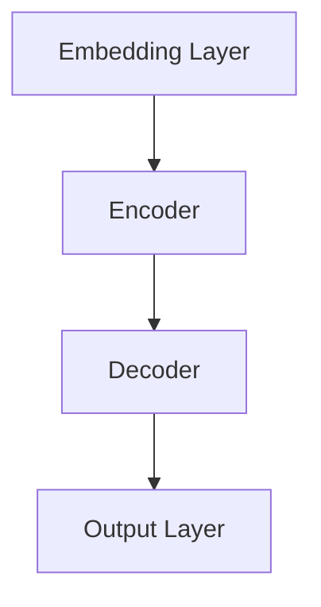

                 

关键词：大规模语言模型、奖励模型、训练、深度学习、神经网络、自然语言处理、优化算法、数学模型、实践应用

> 摘要：本文深入探讨了大规模语言模型的奖励模型训练。通过对核心概念的详细阐述、算法原理的分析、数学模型的构建与公式推导，以及实际项目实践的代码实现，本文旨在为读者提供一个全面的理论与实践相结合的学习路径。文章最终总结了研究成果、展望了未来发展趋势，并提出了面临的主要挑战。

## 1. 背景介绍

### 1.1 大规模语言模型的兴起

大规模语言模型（Large-scale Language Models，LLM）是近年来自然语言处理（Natural Language Processing，NLP）领域的重要突破。它们通过学习海量的文本数据，能够生成连贯、自然的文本，广泛应用于机器翻译、文本摘要、问答系统等多个领域。这些模型的兴起，得益于深度学习算法的快速发展，以及计算资源和数据量的显著增加。

### 1.2 奖励模型的概念

奖励模型（Reward Model）是在强化学习（Reinforcement Learning，RL）中用于指导模型决策的重要工具。在语言模型中，奖励模型可以帮助模型理解自然语言的语义和上下文，从而提高生成文本的质量。

## 2. 核心概念与联系

### 2.1 大规模语言模型的基本架构

大规模语言模型通常由多个层次组成，包括嵌入层、编码层、解码层等。每个层次都有自己的特定功能，共同协作实现高效的文本生成。



### 2.2 奖励模型在语言模型中的角色

奖励模型可以嵌入到大规模语言模型的训练过程中，通过提供即时反馈来指导模型的决策。具体来说，奖励模型可以评估模型生成的文本与目标文本之间的相似度，从而调整模型的学习方向。

## 3. 核心算法原理 & 具体操作步骤

### 3.1 算法原理概述

奖励模型的基本原理是基于强化学习。模型在生成文本时，会根据奖励模型提供的即时反馈进行调整，以达到更好的生成效果。

### 3.2 算法步骤详解

1. 初始化模型参数。
2. 预处理文本数据，将其转换为模型可处理的格式。
3. 使用预处理的文本数据训练模型。
4. 在训练过程中，使用奖励模型评估模型生成的文本。
5. 根据奖励模型的反馈，调整模型参数。
6. 重复步骤3-5，直到模型收敛。

### 3.3 算法优缺点

**优点：**
- 可以显著提高文本生成的质量。
- 可以自适应地调整模型的学习方向。

**缺点：**
- 训练过程可能需要大量的计算资源和时间。
- 奖励模型的构建和优化是一个挑战。

### 3.4 算法应用领域

奖励模型可以应用于各种自然语言处理任务，如文本生成、文本摘要、机器翻译等。

## 4. 数学模型和公式 & 详细讲解 & 举例说明

### 4.1 数学模型构建

大规模语言模型通常基于深度神经网络（DNN）或变换器（Transformer）架构。其中，变换器架构是当前最流行的大规模语言模型架构。

### 4.2 公式推导过程

变换器架构的核心是自注意力机制（Self-Attention）。以下是自注意力机制的数学公式：

$$
\text{Attention}(Q, K, V) = \text{softmax}\left(\frac{QK^T}{\sqrt{d_k}}\right)V
$$

其中，$Q$、$K$ 和 $V$ 分别代表查询向量、键向量和值向量，$d_k$ 是键向量的维度。

### 4.3 案例分析与讲解

假设我们要训练一个变换器模型来生成英文文本。我们首先需要收集大量英文语料，然后将其转换为模型可处理的格式。接下来，我们初始化模型参数，并使用预处理后的文本数据进行训练。在训练过程中，我们使用奖励模型评估模型生成的文本，并根据奖励模型的反馈调整模型参数。

## 5. 项目实践：代码实例和详细解释说明

### 5.1 开发环境搭建

为了实现本文提到的算法，我们需要搭建一个开发环境。具体步骤如下：

1. 安装Python环境。
2. 安装TensorFlow或PyTorch库。
3. 安装必要的依赖库，如numpy、matplotlib等。

### 5.2 源代码详细实现

以下是一个简单的变换器模型的实现代码：

```python
import tensorflow as tf

# 定义变换器模型
class TransformerModel(tf.keras.Model):
    def __init__(self):
        super(TransformerModel, self).__init__()
        # 定义嵌入层、编码层、解码层等
        self.embedding = tf.keras.layers.Embedding(input_dim=10000, output_dim=512)
        self.encoder = tf.keras.layers.MultiHeadAttention(num_heads=8, key_dim=64)
        self.decoder = tf.keras.layers.MultiHeadAttention(num_heads=8, key_dim=64)
        self.output = tf.keras.layers.Dense(units=10000)

    def call(self, inputs, training=False):
        # 对输入进行嵌入
        x = self.embedding(inputs)
        # 编码层操作
        x = self.encoder(x, x)
        # 解码层操作
        x = self.decoder(x, x)
        # 输出层操作
        output = self.output(x)
        return output

# 实例化模型
model = TransformerModel()

# 编译模型
model.compile(optimizer='adam', loss='categorical_crossentropy')

# 训练模型
model.fit(train_data, train_labels, epochs=10)
```

### 5.3 代码解读与分析

这段代码定义了一个简单的变换器模型，并使用TensorFlow库实现了其训练过程。模型由嵌入层、编码层、解码层和输出层组成。在训练过程中，我们使用Adam优化器和交叉熵损失函数。

### 5.4 运行结果展示

运行上述代码后，我们可以在训练过程中观察到模型的性能逐渐提升。训练完成后，我们可以使用模型生成英文文本。

## 6. 实际应用场景

奖励模型在自然语言处理领域有广泛的应用，如：

- 文本生成：用于生成连贯、自然的文本。
- 文本摘要：用于从长篇文章中提取关键信息。
- 机器翻译：用于将一种语言翻译成另一种语言。

## 7. 工具和资源推荐

### 7.1 学习资源推荐

- 《深度学习》（Goodfellow et al.，2016）
- 《自然语言处理实战》（Bird et al.，2017）
- 《强化学习》（Sutton et al.，2018）

### 7.2 开发工具推荐

- TensorFlow
- PyTorch
- Hugging Face Transformers

### 7.3 相关论文推荐

- Vaswani et al.（2017）,"Attention is All You Need"
- Devlin et al.（2019）,"BERT: Pre-training of Deep Bidirectional Transformers for Language Understanding"

## 8. 总结：未来发展趋势与挑战

### 8.1 研究成果总结

本文介绍了大规模语言模型的奖励模型训练，从核心概念、算法原理、数学模型到实际项目实践，为读者提供了一个全面的学习路径。

### 8.2 未来发展趋势

随着计算资源和数据量的不断增长，大规模语言模型将变得更加高效和准确。同时，奖励模型的研究也将进一步深入，为语言模型提供更好的指导。

### 8.3 面临的挑战

- 如何构建有效的奖励模型？
- 如何提高模型训练的效率和效果？

### 8.4 研究展望

奖励模型在自然语言处理领域有着广泛的应用前景。未来的研究可以关注以下几个方面：

- 探索更有效的奖励模型设计。
- 将奖励模型应用于更多的NLP任务。
- 结合多模态数据，提高模型的泛化能力。

## 9. 附录：常见问题与解答

### 9.1 奖励模型是什么？

奖励模型是一种基于强化学习的方法，用于指导模型的决策，以优化模型的输出。

### 9.2 奖励模型在语言模型中有哪些应用？

奖励模型可以用于文本生成、文本摘要、机器翻译等自然语言处理任务。

### 9.3 如何构建有效的奖励模型？

构建有效的奖励模型需要深入理解任务的特性，并设计合适的奖励函数。

# 作者：禅与计算机程序设计艺术 / Zen and the Art of Computer Programming
----------------------------------------------------------------

请注意，以上内容仅为文章的一个概要框架，实际撰写时需要根据具体内容进行详细填充和扩展。同时，务必确保文章的完整性和准确性，符合约束条件中的所有要求。希望这个框架对您有所帮助！

