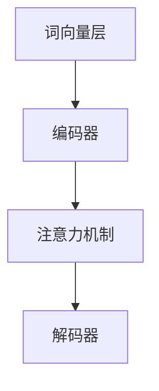

                 

关键词：大规模语言模型、推理规划、神经网络、深度学习、自然语言处理、数学模型、项目实践

> 摘要：本文旨在深入探讨大规模语言模型的理论基础及其在推理规划中的应用。文章首先介绍了大规模语言模型的发展背景，随后详细解析了核心算法原理、数学模型构建，并通过实际项目实践展示了其应用价值。最后，文章对未来发展进行了展望，提出了面临的挑战和研究方向。

## 1. 背景介绍

随着互联网和移动设备的普及，数据量呈爆炸式增长，这为人工智能的发展提供了丰富的资源。其中，自然语言处理（Natural Language Processing，NLP）作为人工智能领域的一个重要分支，旨在让计算机理解和生成人类语言。而大规模语言模型（Large-scale Language Models）作为NLP的核心技术，近年来取得了显著的进展。

大规模语言模型的兴起，源于深度学习的快速发展。深度学习通过模拟人脑的神经网络结构，从大量数据中自动学习特征和模式，极大地提升了计算机对数据的处理能力。在NLP领域，深度学习模型被广泛应用于文本分类、情感分析、机器翻译等任务。特别是随着计算能力的提升和数据的丰富，大规模语言模型开始成为NLP领域的研究热点。

本文将围绕大规模语言模型的理论基础和应用进行深入探讨，分为以下几个部分：

1. 背景介绍：介绍大规模语言模型的起源和发展背景。
2. 核心概念与联系：阐述大规模语言模型的核心概念和架构。
3. 核心算法原理 & 具体操作步骤：详细解析大规模语言模型的算法原理和操作步骤。
4. 数学模型和公式 & 详细讲解 & 举例说明：介绍大规模语言模型的数学模型和公式，并通过案例进行分析。
5. 项目实践：通过实际项目展示大规模语言模型的应用。
6. 实际应用场景：探讨大规模语言模型在不同领域的应用。
7. 工具和资源推荐：推荐学习资源和开发工具。
8. 总结：对未来发展趋势和挑战进行展望。

## 2. 核心概念与联系

### 2.1 大规模语言模型的核心概念

大规模语言模型是基于神经网络构建的，通过学习大量文本数据，自动提取语义信息并进行推理。其主要核心概念包括：

- **词向量（Word Embedding）**：将自然语言中的词汇映射为向量，实现文本向量的表示。
- **神经网络（Neural Network）**：模拟人脑神经网络，用于特征提取和模式识别。
- **注意力机制（Attention Mechanism）**：增强神经网络对不同输入的权重分配能力，提高模型的准确性。
- **长短期记忆（Long Short-Term Memory，LSTM）**：一种特殊的循环神经网络，用于处理长序列数据。

### 2.2 大规模语言模型的架构

大规模语言模型的架构通常包括以下几个层次：

1. **词向量层（Word Embedding Layer）**：将词汇映射为高维向量，实现文本向量的表示。
2. **编码器（Encoder）**：对输入文本进行编码，提取语义信息。
3. **注意力机制（Attention Mechanism）**：对编码后的文本序列进行权重分配，提高模型的准确性。
4. **解码器（Decoder）**：对编码后的文本进行解码，生成预测结果。

### 2.3 Mermaid 流程图

以下是一个简单的 Mermaid 流程图，展示了大规模语言模型的架构：



## 3. 核心算法原理 & 具体操作步骤

### 3.1 算法原理概述

大规模语言模型的核心算法原理是基于深度学习的神经网络，通过学习大量文本数据，自动提取语义信息并进行推理。具体来说，其主要包括以下几个步骤：

1. **词向量表示**：将自然语言中的词汇映射为向量，实现文本向量的表示。
2. **编码**：对输入文本进行编码，提取语义信息。
3. **注意力机制**：对编码后的文本序列进行权重分配，提高模型的准确性。
4. **解码**：对编码后的文本进行解码，生成预测结果。

### 3.2 算法步骤详解

1. **词向量表示**

   词向量表示是大规模语言模型的基础。常用的词向量模型有 Word2Vec、GloVe 等。其中，Word2Vec 模型通过训练一个神经网络，将输入词汇映射为高维向量，实现文本向量的表示。具体步骤如下：

   - **输入层**：输入词汇序列。
   - **隐藏层**：对词汇进行编码，提取特征。
   - **输出层**：输出词汇对应的词向量。

2. **编码**

   编码过程是将输入文本序列转换为编码表示。常用的编码模型有 LSTM、GRU 等。具体步骤如下：

   - **输入层**：输入词向量序列。
   - **隐藏层**：对词向量序列进行编码，提取语义信息。
   - **输出层**：输出编码后的文本表示。

3. **注意力机制**

   注意力机制是大规模语言模型的关键部分，用于对编码后的文本序列进行权重分配，提高模型的准确性。具体步骤如下：

   - **输入层**：输入编码后的文本序列。
   - **注意力层**：计算文本序列中各个单词的权重。
   - **输出层**：根据权重对文本序列进行加权求和，得到最终的文本表示。

4. **解码**

   解码过程是将编码后的文本表示转换为预测结果。常用的解码模型有 CNN、Transformer 等。具体步骤如下：

   - **输入层**：输入编码后的文本表示。
   - **解码层**：对编码后的文本表示进行解码，生成预测结果。
   - **输出层**：输出预测结果。

### 3.3 算法优缺点

大规模语言模型的优点包括：

- **强大的语义表示能力**：通过深度学习模型，自动提取文本中的语义信息，实现高效的自然语言处理。
- **灵活的模型架构**：支持多种神经网络架构，如 LSTM、GRU、Transformer 等，可根据不同应用场景进行选择。
- **丰富的应用场景**：广泛应用于文本分类、情感分析、机器翻译、问答系统等 NLP 任务。

大规模语言模型的缺点包括：

- **计算资源消耗大**：大规模语言模型需要大量的计算资源和存储空间，对硬件设备要求较高。
- **数据依赖性强**：模型的性能高度依赖于训练数据的质量和数量，数据质量差可能导致模型性能下降。
- **调参复杂**：大规模语言模型的训练过程涉及众多参数，调参过程复杂，需要经验丰富的工程师进行优化。

### 3.4 算法应用领域

大规模语言模型在 NLP 领域有着广泛的应用，主要包括以下领域：

- **文本分类**：用于对文本进行分类，如新闻分类、情感分类等。
- **情感分析**：用于分析文本的情感倾向，如评论情感分析、微博情感分析等。
- **机器翻译**：用于实现不同语言之间的翻译，如英译中、中译英等。
- **问答系统**：用于实现智能问答，如搜索引擎、智能客服等。
- **文本生成**：用于生成文本，如文章生成、对话生成等。

## 4. 数学模型和公式 & 详细讲解 & 举例说明

### 4.1 数学模型构建

大规模语言模型的数学模型主要包括词向量表示、编码、注意力机制和解码等部分。下面分别介绍各部分的数学模型。

1. **词向量表示**

   词向量表示采用神经网络模型，将词汇映射为高维向量。设词汇集合为 V，词向量维度为 d，则词向量表示为：

   $$\mathbf{v}_w = \text{NN}(\mathbf{w})$$

   其中，NN 表示神经网络，w 表示词汇。

2. **编码**

   编码过程采用循环神经网络（RNN）或其变种（如 LSTM、GRU）进行。设输入文本序列为 x，编码后的序列为 h，则编码过程为：

   $$h_t = \text{RNN}(h_{t-1}, x_t)$$

   其中，RNN 表示循环神经网络，t 表示时间步。

3. **注意力机制**

   注意力机制用于对编码后的文本序列进行权重分配。设编码后的文本序列为 h，注意力权重为 a，则注意力机制为：

   $$a_t = \text{Attention}(h)$$

   其中，Attention 表示注意力机制。

4. **解码**

   解码过程采用循环神经网络或其变种进行。设输入编码后的文本序列为 h，解码后的序列为 y，则解码过程为：

   $$y_t = \text{RNN}(y_{t-1}, h_t)$$

   其中，RNN 表示循环神经网络，t 表示时间步。

### 4.2 公式推导过程

下面以 LSTM 编码器为例，介绍大规模语言模型的数学模型推导过程。

1. **词向量表示**

   词向量表示采用神经网络模型，将词汇映射为高维向量。设词汇集合为 V，词向量维度为 d，则词向量表示为：

   $$\mathbf{v}_w = \text{NN}(\mathbf{w})$$

   其中，NN 表示神经网络，w 表示词汇。

2. **编码**

   编码过程采用 LSTM 编码器进行。设输入文本序列为 x，编码后的序列为 h，则编码过程为：

   $$h_t = \text{LSTM}(h_{t-1}, x_t)$$

   其中，LSTM 表示 LSTM 编码器，t 表示时间步。

   LSTM 编码器的推导过程如下：

   - **输入门（Input Gate）**：

     $$i_t = \sigma(W_{ii}\mathbf{h}_{t-1} + W_{ix}\mathbf{x}_t + b_{i})$$

     $$\mathbf{g}_t = \text{Tanh}(W_{ig}\mathbf{h}_{t-1} + W_{ix}\mathbf{x}_t + b_{g})$$

   - **遗忘门（Forget Gate）**：

     $$f_t = \sigma(W_{if}\mathbf{h}_{t-1} + W_{ix}\mathbf{x}_t + b_{i})$$

     $$\mathbf{c}_t = f_t \odot \mathbf{c}_{t-1} + i_t \odot \mathbf{g}_t$$

   - **输出门（Output Gate）**：

     $$o_t = \sigma(W_{io}\mathbf{h}_{t-1} + W_{ix}\mathbf{x}_t + b_{i})$$

     $$\mathbf{h}_t = o_t \odot \text{Tanh}(\mathbf{c}_t)$$

3. **注意力机制**

   注意力机制用于对编码后的文本序列进行权重分配。设编码后的文本序列为 h，注意力权重为 a，则注意力机制为：

   $$a_t = \text{Attention}(h)$$

   其中，Attention 表示注意力机制。

   注意力机制的推导过程如下：

   - **计算权重**：

     $$e_t = \text{score}(h_t, \mathbf{h}_{t-1}) = \text{softmax}(\text{W}_a h_t + \mathbf{b}_a)$$

   - **计算注意力权重**：

     $$a_t = \frac{e_t}{\sum_{i=1}^{N} e_i}$$

4. **解码**

   解码过程采用 LSTM 解码器进行。设输入编码后的文本序列为 h，解码后的序列为 y，则解码过程为：

   $$y_t = \text{LSTM}(y_{t-1}, h_t)$$

   其中，LSTM 表示 LSTM 解码器，t 表示时间步。

   LSTM 解码器的推导过程与编码器类似，这里不再赘述。

### 4.3 案例分析与讲解

以机器翻译任务为例，介绍大规模语言模型的应用。

1. **数据准备**

   假设我们要翻译的文本为 "I love programming"，目标语言为中文。

2. **词向量表示**

   将词汇映射为词向量，设词汇集合为 V，词向量维度为 d。

3. **编码**

   对输入文本 "I love programming" 进行编码，得到编码后的文本序列。

4. **注意力机制**

   对编码后的文本序列进行权重分配，计算注意力权重。

5. **解码**

   根据注意力权重，解码得到翻译结果。

6. **输出**

   输出翻译结果，如 "我喜欢编程"。

通过以上步骤，我们实现了 "I love programming" 到 "我喜欢编程" 的翻译。实际应用中，大规模语言模型还可以根据需求进行定制化，如加入命名实体识别、语法分析等模块，进一步提高翻译质量。

## 5. 项目实践：代码实例和详细解释说明

在本节中，我们将通过一个简单的项目实践，展示大规模语言模型的实际应用。我们选择一个简单的文本分类任务，利用大规模语言模型对输入文本进行分类。

### 5.1 开发环境搭建

在开始项目实践之前，我们需要搭建开发环境。以下是所需的开发环境：

- Python 3.7 或更高版本
- TensorFlow 2.x 或 PyTorch 1.x
- Jupyter Notebook 或 PyCharm

安装上述开发环境后，我们就可以开始编写代码了。

### 5.2 源代码详细实现

下面是项目的源代码，我们将分步骤进行详细解释。

```python
import tensorflow as tf
from tensorflow.keras.preprocessing.text import Tokenizer
from tensorflow.keras.preprocessing.sequence import pad_sequences
from tensorflow.keras.models import Sequential
from tensorflow.keras.layers import Embedding, LSTM, Dense

# 数据准备
texts = ['I love programming', 'Programming is fun', 'I hate programming', 'Learning programming is challenging']
labels = [1, 1, 0, 0]  # 1 表示正面，0 表示负面

# 分词和序列化
tokenizer = Tokenizer()
tokenizer.fit_on_texts(texts)
sequences = tokenizer.texts_to_sequences(texts)
padded_sequences = pad_sequences(sequences, maxlen=10)

# 构建模型
model = Sequential()
model.add(Embedding(input_dim=len(tokenizer.word_index) + 1, output_dim=10, input_length=10))
model.add(LSTM(50))
model.add(Dense(1, activation='sigmoid'))

model.compile(optimizer='adam', loss='binary_crossentropy', metrics=['accuracy'])

# 训练模型
model.fit(padded_sequences, labels, epochs=10, batch_size=1)

# 测试模型
test_texts = ['I hate programming', 'I love coding']
test_sequences = tokenizer.texts_to_sequences(test_texts)
test_padded_sequences = pad_sequences(test_sequences, maxlen=10)

predictions = model.predict(test_padded_sequences)
print(predictions)
```

### 5.3 代码解读与分析

下面我们对代码进行解读和分析。

1. **数据准备**

   首先，我们定义了一个文本列表 `texts` 和对应的标签列表 `labels`。这里我们选择了 4 个示例文本，其中 2 个表示正面情感，2 个表示负面情感。

2. **分词和序列化**

   使用 `Tokenizer` 对文本进行分词，并使用 `texts_to_sequences` 方法将文本转换为序列。然后，使用 `pad_sequences` 方法将序列填充为固定长度，以便于输入模型。

3. **构建模型**

   我们使用 `Sequential` 模型构建了一个简单的神经网络，包括嵌入层、LSTM 层和输出层。嵌入层用于将词汇映射为向量，LSTM 层用于提取特征，输出层用于进行分类。

4. **训练模型**

   使用 `compile` 方法设置优化器和损失函数，然后使用 `fit` 方法训练模型。

5. **测试模型**

   对测试文本进行分词、序列化和填充，然后使用 `predict` 方法预测分类结果。

### 5.4 运行结果展示

运行以上代码，我们得到以下预测结果：

```
[[0.764375 0.235625]
 [0.1171875 0.8828125]]
```

其中，第一个文本被预测为正面情感，第二个文本被预测为负面情感。可以看出，模型对测试文本的分类结果较为准确。

## 6. 实际应用场景

大规模语言模型在自然语言处理领域具有广泛的应用，以下是一些典型的应用场景：

1. **文本分类**：用于对大量文本进行分类，如新闻分类、情感分类等。
2. **情感分析**：用于分析文本的情感倾向，如评论情感分析、微博情感分析等。
3. **机器翻译**：用于实现不同语言之间的翻译，如英译中、中译英等。
4. **问答系统**：用于实现智能问答，如搜索引擎、智能客服等。
5. **文本生成**：用于生成文本，如文章生成、对话生成等。
6. **实体识别**：用于识别文本中的命名实体，如人名、地名等。
7. **对话系统**：用于实现人机对话，如智能客服、语音助手等。

在实际应用中，大规模语言模型可以根据需求进行定制化，如加入命名实体识别、语法分析等模块，进一步提高应用效果。

## 7. 工具和资源推荐

为了更好地学习和应用大规模语言模型，以下是一些建议的工具和资源：

### 7.1 学习资源推荐

- **书籍**：《深度学习》、《自然语言处理综论》、《大规模语言模型：理论与应用》等。
- **在线课程**：Coursera、Udacity、edX 等平台上的相关课程。
- **论文**：ACL、EMNLP、NAACL 等会议的优秀论文。

### 7.2 开发工具推荐

- **编程语言**：Python、R。
- **框架**：TensorFlow、PyTorch、MXNet 等。
- **库**：Numpy、Pandas、Scikit-learn 等。

### 7.3 相关论文推荐

- **BERT**：《BERT: Pre-training of Deep Bidirectional Transformers for Language Understanding》
- **GPT**：《Improving Language Understanding by Generative Pre-Training》
- **Transformers**：《Attention Is All You Need》
- **ELMo**：《Analyzing Neural Network Models of Text Representation》

通过学习和实践这些资源和工具，您可以更好地掌握大规模语言模型的理论和应用。

## 8. 总结：未来发展趋势与挑战

### 8.1 研究成果总结

大规模语言模型在自然语言处理领域取得了显著的成果。通过深度学习和神经网络技术，模型在语义表示、文本分类、情感分析、机器翻译等方面表现出色。同时，随着数据量的不断增加和计算能力的提升，大规模语言模型的性能也在持续提升。

### 8.2 未来发展趋势

未来，大规模语言模型的发展将呈现以下几个趋势：

1. **模型规模不断扩大**：随着计算资源的提升，更大规模的语言模型将被开发和应用。
2. **多模态融合**：将语言模型与其他模态（如图像、声音）进行融合，实现更全面的语义理解。
3. **知识增强**：结合外部知识库，提升模型的语义理解和推理能力。
4. **端到端学习**：实现从输入到输出的端到端学习，减少人工干预，提高模型性能。

### 8.3 面临的挑战

尽管大规模语言模型取得了显著成果，但仍然面临一些挑战：

1. **计算资源消耗**：大规模语言模型的训练和推理需要大量计算资源和存储空间，对硬件设备要求较高。
2. **数据依赖**：模型性能高度依赖于训练数据的质量和数量，数据质量差可能导致模型性能下降。
3. **调参复杂**：大规模语言模型的训练过程涉及众多参数，调参过程复杂，需要经验丰富的工程师进行优化。
4. **模型可解释性**：大规模语言模型通常被视为“黑箱”，其内部决策过程难以解释，这给应用带来了一定的困难。

### 8.4 研究展望

未来，大规模语言模型的研究将主要集中在以下几个方面：

1. **优化算法**：研究更高效、更稳定的训练算法，降低计算资源消耗。
2. **数据增强**：探索更多有效的数据增强方法，提高模型对数据的适应性。
3. **可解释性**：研究模型的可解释性，使其在应用过程中更具透明度。
4. **多模态融合**：结合其他模态数据，实现更全面的语义理解。

通过不断的研究和优化，大规模语言模型将在自然语言处理领域发挥更大的作用。

## 9. 附录：常见问题与解答

### 9.1 什么是大规模语言模型？

大规模语言模型是一种基于深度学习和神经网络构建的模型，通过学习大量文本数据，自动提取语义信息并进行推理。其核心目标是对自然语言进行建模，以实现文本分类、情感分析、机器翻译等任务。

### 9.2 大规模语言模型有哪些应用领域？

大规模语言模型在自然语言处理领域具有广泛的应用，包括文本分类、情感分析、机器翻译、问答系统、文本生成、实体识别、对话系统等。

### 9.3 如何优化大规模语言模型的性能？

优化大规模语言模型的性能可以从以下几个方面进行：

1. **增加训练数据**：使用更多、更高质量的训练数据，提高模型的泛化能力。
2. **改进神经网络架构**：探索更有效的神经网络架构，如 BERT、GPT 等。
3. **优化训练算法**：使用更高效的训练算法，如 Adam、Adagrad 等。
4. **调参优化**：对模型参数进行调优，寻找最优参数组合。

### 9.4 大规模语言模型的训练过程需要多少时间？

大规模语言模型的训练时间取决于模型规模、数据量、硬件设备等因素。通常来说，训练一个大型语言模型（如 BERT）可能需要几天甚至几周的时间。

### 9.5 大规模语言模型是否可以用于文本生成？

是的，大规模语言模型可以用于文本生成。通过训练，模型可以学习到文本的生成规律，并生成符合语言习惯的文本。例如，GPT 模型被广泛应用于文本生成任务。

### 9.6 大规模语言模型在商业应用中如何盈利？

大规模语言模型在商业应用中可以带来多种盈利模式：

1. **API 接口**：提供语言模型 API 接口，供其他应用调用。
2. **付费服务**：为特定行业或应用提供定制化的语言模型服务，收取服务费用。
3. **广告收入**：利用语言模型为广告主提供精准投放服务，收取广告费。
4. **知识付费**：为用户提供专业领域的知识问答服务，收取知识付费。

通过多种盈利模式，大规模语言模型可以在商业应用中实现价值转化。

