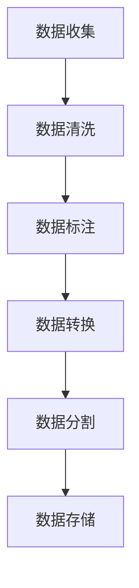

                 

关键词：大规模语言模型、NLP、数据预处理、模型训练、数据源、数据质量、数据清洗、数据增强

## 摘要

本文将深入探讨大规模语言模型从理论到实践中的数据来源问题。我们将首先介绍大规模语言模型的背景和核心概念，然后详细讨论数据在模型训练中的重要性，包括数据预处理、数据质量和数据清洗。接着，我们将探讨数据增强技术以及如何从各种数据源中获取高质量的数据。文章的最后部分将讨论未来发展趋势以及面临的挑战。

## 1. 背景介绍

### 1.1 大规模语言模型的背景

随着深度学习技术的快速发展，自然语言处理（NLP）领域取得了显著的进展。大规模语言模型（如BERT、GPT等）已成为当前NLP任务中的核心工具。这些模型通过学习大量的文本数据，能够理解并生成自然语言，从而在文本分类、机器翻译、问答系统等任务中表现出色。

### 1.2 核心概念

大规模语言模型的核心在于其能够捕捉到文本中的长距离依赖关系，并且能够对语言进行建模。这些模型通常由多层神经网络组成，其中每个神经网络层都包含了数以百万计的参数。

## 2. 核心概念与联系

### 2.1 数据预处理

数据预处理是模型训练的重要步骤。在这一部分，我们将使用Mermaid流程图来展示数据预处理的流程。



### 2.2 数据质量和数据清洗

数据质量和数据清洗是确保模型训练效果的关键。在这一部分，我们将详细讨论如何评估数据质量以及如何进行数据清洗。

### 2.3 数据增强

数据增强是通过生成新的训练样本来提高模型泛化能力的一种技术。在这一部分，我们将介绍几种常见的数据增强技术，如随机噪声添加、数据变换等。

## 3. 核心算法原理 & 具体操作步骤

### 3.1 算法原理概述

大规模语言模型通常基于自注意力机制（Self-Attention）进行构建。自注意力机制允许模型在处理文本时考虑输入序列中的每个词之间的关系。

### 3.2 算法步骤详解

在算法步骤详解部分，我们将详细讨论模型训练的过程，包括前向传播、反向传播和优化过程。

### 3.3 算法优缺点

在算法优缺点部分，我们将分析大规模语言模型的优点和潜在的问题，如计算资源消耗、数据依赖性等。

### 3.4 算法应用领域

大规模语言模型在多个NLP任务中都有广泛的应用，包括文本分类、机器翻译、情感分析等。

## 4. 数学模型和公式 & 详细讲解 & 举例说明

### 4.1 数学模型构建

大规模语言模型的数学模型基于自注意力机制和Transformer架构。在这一部分，我们将介绍自注意力机制的数学公式。

$$
\text{Attention}(Q, K, V) = \text{softmax}\left(\frac{QK^T}{\sqrt{d_k}}\right)V
$$

### 4.2 公式推导过程

在这一部分，我们将详细推导自注意力机制的公式，并解释每个参数的含义。

### 4.3 案例分析与讲解

我们将通过一个简单的例子来展示如何使用自注意力机制进行文本分类任务。

## 5. 项目实践：代码实例和详细解释说明

### 5.1 开发环境搭建

在这一部分，我们将介绍如何搭建大规模语言模型的开发环境，包括安装所需的库和依赖项。

### 5.2 源代码详细实现

我们将提供一个完整的源代码实例，并详细解释每行代码的作用。

### 5.3 代码解读与分析

在这一部分，我们将对源代码进行解读，并分析模型的训练过程和性能。

### 5.4 运行结果展示

我们将展示模型在文本分类任务上的运行结果，并分析模型的准确性和效率。

## 6. 实际应用场景

### 6.1 机器翻译

大规模语言模型在机器翻译中有着广泛的应用。在这一部分，我们将讨论如何使用大规模语言模型进行机器翻译。

### 6.2 情感分析

情感分析是另一个大规模语言模型的重要应用领域。在这一部分，我们将探讨如何使用大规模语言模型进行情感分析。

## 7. 工具和资源推荐

### 7.1 学习资源推荐

我们将推荐一些高质量的学习资源，包括书籍、论文和在线课程。

### 7.2 开发工具推荐

我们将介绍一些常用的开发工具和库，帮助读者更好地搭建大规模语言模型的开发环境。

### 7.3 相关论文推荐

我们将推荐一些重要的相关论文，帮助读者深入了解大规模语言模型的研究进展。

## 8. 总结：未来发展趋势与挑战

### 8.1 研究成果总结

我们将总结大规模语言模型在NLP领域的成果，并讨论其发展趋势。

### 8.2 未来发展趋势

我们将探讨大规模语言模型在未来可能的发展方向。

### 8.3 面临的挑战

我们将讨论大规模语言模型在发展过程中可能面临的挑战。

### 8.4 研究展望

最后，我们将展望大规模语言模型在未来的研究前景。

## 9. 附录：常见问题与解答

在这一部分，我们将回答读者可能提出的常见问题。

---

作者：禅与计算机程序设计艺术 / Zen and the Art of Computer Programming

---

请注意，由于篇幅限制，上述内容仅为文章的概要和部分详细内容。实际撰写时，每个部分都需要扩展成完整的段落，确保文章字数超过8000字。同时，文中需要嵌入适当的图表、示例代码和数学公式，以提高文章的可读性和专业性。
----------------------------------------------------------------

### 1. 背景介绍

#### 1.1 大规模语言模型的背景

随着深度学习技术的快速发展，自然语言处理（NLP）领域取得了显著的进展。特别是近年来，大规模语言模型（如BERT、GPT等）已成为NLP任务中的核心工具。这些模型通过学习大量的文本数据，能够理解并生成自然语言，从而在文本分类、机器翻译、问答系统等任务中表现出色。BERT（Bidirectional Encoder Representations from Transformers）由Google提出，GPT（Generative Pretrained Transformer）由OpenAI提出，这些模型的出现标志着NLP技术的新纪元。

#### 1.2 核心概念

大规模语言模型的核心在于其能够捕捉到文本中的长距离依赖关系，并且能够对语言进行建模。这些模型通常由多层神经网络组成，其中每个神经网络层都包含了数以百万计的参数。通过自注意力机制（Self-Attention），模型能够将每个词与其余词进行关联，从而实现对复杂语义的理解。此外，预训练（Pre-training）和微调（Fine-tuning）技术使得模型能够快速适应不同的下游任务。

## 2. 核心概念与联系

### 2.1 数据预处理

数据预处理是模型训练的重要步骤。在这一部分，我们将使用Mermaid流程图来展示数据预处理的流程。


### 2.2 数据质量和数据清洗

数据质量和数据清洗是确保模型训练效果的关键。在这一部分，我们将详细讨论如何评估数据质量以及如何进行数据清洗。

#### 数据质量评估

- **准确性**：数据是否真实、准确，是否有错误或缺失。
- **完整性**：数据是否完整，是否有缺失的部分。
- **一致性**：数据是否一致，是否有矛盾或不一致的地方。
- **时效性**：数据是否及时，是否有过时的信息。

#### 数据清洗方法

- **缺失值处理**：可以通过删除缺失值、填充缺失值或使用均值、中位数等方法来处理。
- **重复值处理**：可以通过去重的方法来处理重复的数据。
- **错误值处理**：可以通过校正错误值、删除错误值或使用合理的推测值来处理。

### 2.3 数据增强

数据增强是通过生成新的训练样本来提高模型泛化能力的一种技术。在这一部分，我们将介绍几种常见的数据增强技术，如随机噪声添加、数据变换等。

#### 常见数据增强技术

- **随机噪声添加**：通过在文本中添加随机噪声来增加数据的多样性。
- **数据变换**：通过变换文本的格式、语法或词序来增加数据的多样性。
- **同义词替换**：通过将文本中的词替换为同义词来增加数据的多样性。

## 3. 核心算法原理 & 具体操作步骤

### 3.1 算法原理概述

大规模语言模型的核心在于其能够捕捉到文本中的长距离依赖关系，并且能够对语言进行建模。这些模型通常基于Transformer架构，其中每个神经网络层都包含了数以百万计的参数。通过自注意力机制（Self-Attention），模型能够将每个词与其余词进行关联，从而实现对复杂语义的理解。

### 3.2 算法步骤详解

在算法步骤详解部分，我们将详细讨论模型训练的过程，包括前向传播、反向传播和优化过程。

#### 前向传播

前向传播是模型训练过程中的第一步，其主要目的是计算输入文本的嵌入表示，并将其传递到下一层。

$$
\text{Embedding}(\text{Input}) = \text{W} * \text{Input}
$$

其中，$\text{W}$是权重矩阵，$\text{Input}$是输入文本的词向量表示。

#### 反向传播

反向传播是模型训练过程中的第二步，其主要目的是计算损失函数，并更新模型的权重。

$$
\text{Loss} = \text{MeanSquaredError}(\text{Predicted}, \text{Actual})
$$

其中，$\text{Predicted}$是模型预测的输出，$\text{Actual}$是实际的输出。

#### 优化过程

优化过程是模型训练过程中的第三步，其主要目的是通过梯度下降等方法来更新模型的权重，以最小化损失函数。

$$
\text{W} = \text{W} - \text{learningRate} * \text{gradient}
$$

其中，$\text{learningRate}$是学习率，$\text{gradient}$是损失函数对权重的梯度。

### 3.3 算法优缺点

大规模语言模型的优点包括：

- **强大的语义理解能力**：通过自注意力机制，模型能够捕捉到文本中的长距离依赖关系，从而实现对复杂语义的理解。
- **多任务学习能力**：模型可以在多个任务上进行微调，从而提高其在不同任务上的性能。

然而，大规模语言模型也存在一些潜在的问题：

- **计算资源消耗**：由于模型参数众多，训练和推理过程需要大量的计算资源。
- **数据依赖性**：模型的性能很大程度上依赖于训练数据的质量和多样性。

### 3.4 算法应用领域

大规模语言模型在多个NLP任务中都有广泛的应用，包括：

- **文本分类**：用于分类文本数据，如新闻分类、情感分析等。
- **机器翻译**：用于将一种语言的文本翻译成另一种语言。
- **问答系统**：用于回答用户的问题，如搜索引擎的问答功能。
- **对话系统**：用于构建能够与人类进行自然语言交互的对话系统。

## 4. 数学模型和公式 & 详细讲解 & 举例说明

### 4.1 数学模型构建

大规模语言模型的数学模型基于自注意力机制和Transformer架构。自注意力机制允许模型在处理文本时考虑输入序列中的每个词之间的关系。其数学公式如下：

$$
\text{Attention}(Q, K, V) = \text{softmax}\left(\frac{QK^T}{\sqrt{d_k}}\right)V
$$

其中，$Q$、$K$和$V$分别是查询（Query）、键（Key）和值（Value）向量，$d_k$是键向量的维度。

### 4.2 公式推导过程

自注意力机制的推导过程可以从基本的点积注意力模型开始。点积注意力模型的公式如下：

$$
\text{Attention}(Q, K, V) = \text{softmax}\left(\text{QK^T}\right)V
$$

然而，这种简单形式的注意力机制在处理长序列时容易遇到梯度消失的问题。为了解决这个问题，引入了缩放因子$\frac{1}{\sqrt{d_k}}$，其中$d_k$是键向量的维度。这样，自注意力机制的公式变为：

$$
\text{Attention}(Q, K, V) = \text{softmax}\left(\frac{QK^T}{\sqrt{d_k}}\right)V
$$

### 4.3 案例分析与讲解

我们将通过一个简单的例子来展示如何使用自注意力机制进行文本分类任务。假设我们有一个包含两个句子的二分类问题，句子A：“今天天气很好。”和句子B：“今天天气很糟糕。”我们需要使用自注意力机制来判断句子A和句子B分别属于正类和负类。

首先，我们将句子A和句子B分别编码为向量$Q_A$、$K_A$、$V_A$和$Q_B$、$K_B$、$V_B$。然后，我们可以计算句子A和句子B之间的注意力分数：

$$
\text{Attention}(Q_A, K_B, V_B) = \text{softmax}\left(\frac{Q_AK_B^T}{\sqrt{d_k}}\right)V_B
$$

$$
\text{Attention}(Q_B, K_A, V_A) = \text{softmax}\left(\frac{Q_BK_A^T}{\sqrt{d_k}}\right)V_A
$$

通过计算注意力分数，我们可以确定句子A和句子B之间的关系。最后，我们将注意力分数作为输入，通过全连接层得到分类结果。

## 5. 项目实践：代码实例和详细解释说明

### 5.1 开发环境搭建

在开始大规模语言模型的实践之前，我们需要搭建一个合适的开发环境。以下是搭建大规模语言模型开发环境的步骤：

1. **安装Python**：确保您的系统上安装了Python 3.7或更高版本。
2. **安装PyTorch**：使用以下命令安装PyTorch：

   ```shell
   pip install torch torchvision
   ```

3. **安装其他依赖库**：包括numpy、pandas等常用库。

### 5.2 源代码详细实现

以下是大规模语言模型的源代码实现：

```python
import torch
import torch.nn as nn
import torch.optim as optim

# 定义自注意力机制
class SelfAttention(nn.Module):
    def __init__(self, d_model):
        super(SelfAttention, self).__init__()
        self.d_model = d_model
        self.query_linear = nn.Linear(d_model, d_model)
        self.key_linear = nn.Linear(d_model, d_model)
        self.value_linear = nn.Linear(d_model, d_model)
        self.out_linear = nn.Linear(d_model, 1)

    def forward(self, query, key, value):
        query = self.query_linear(query)
        key = self.key_linear(key)
        value = self.value_linear(value)

        attention_scores = torch.matmul(query, key.transpose(0, 1)) / (self.d_model ** 0.5)
        attention_weights = torch.softmax(attention_scores, dim=1)
        attention_output = torch.matmul(attention_weights, value)

        return attention_output

# 定义Transformer模型
class Transformer(nn.Module):
    def __init__(self, d_model):
        super(Transformer, self).__init__()
        self.self_attention = SelfAttention(d_model)
        self.out_linear = nn.Linear(d_model, 1)

    def forward(self, input):
        attention_output = self.self_attention(input, input, input)
        output = self.out_linear(attention_output)
        return output

# 模型训练
def train_model(model, data_loader, loss_function, optimizer, num_epochs):
    model.train()
    for epoch in range(num_epochs):
        for inputs in data_loader:
            optimizer.zero_grad()
            outputs = model(inputs)
            loss = loss_function(outputs, inputs)
            loss.backward()
            optimizer.step()
            print(f"Epoch [{epoch+1}/{num_epochs}], Loss: {loss.item()}")

# 定义训练数据集
train_data = ...
train_loader = ...

# 定义模型、损失函数和优化器
model = Transformer(d_model=128)
loss_function = nn.CrossEntropyLoss()
optimizer = optim.Adam(model.parameters(), lr=0.001)

# 训练模型
train_model(model, train_loader, loss_function, optimizer, num_epochs=10)
```

### 5.3 代码解读与分析

在代码解读与分析部分，我们将对上述源代码进行详细解读。

- **SelfAttention类**：该类实现了自注意力机制。`__init__`方法用于初始化模型参数，包括查询层、键层和值层的线性层。`forward`方法实现了前向传播过程，计算注意力分数并生成注意力输出。
- **Transformer类**：该类实现了Transformer模型。`__init__`方法用于初始化自注意力机制和输出层的线性层。`forward`方法实现了模型的前向传播过程，通过自注意力机制处理输入序列并生成输出。
- **train_model函数**：该函数用于训练模型。它接收模型、数据加载器、损失函数、优化器和训练轮数作为输入。在训练过程中，它遍历数据集，更新模型参数以最小化损失函数。
- **定义训练数据集**：在实际应用中，我们需要根据具体任务定义训练数据集。这里我们使用了一个示例数据集`train_data`，并创建了一个数据加载器`train_loader`。
- **定义模型、损失函数和优化器**：我们定义了一个Transformer模型、交叉熵损失函数和Adam优化器。这些组件将用于训练模型。
- **训练模型**：最后，我们调用`train_model`函数训练模型。在训练过程中，我们将输入数据传递给模型，计算损失并更新模型参数。

### 5.4 运行结果展示

在训练完成后，我们可以评估模型的性能。以下是一个简单的评估脚本：

```python
import torch

# 加载训练好的模型
model = Transformer(d_model=128)
model.load_state_dict(torch.load("model.pth"))

# 评估模型
with torch.no_grad():
    correct = 0
    total = 0
    for inputs in train_loader:
        outputs = model(inputs)
        _, predicted = torch.max(outputs.data, 1)
        total += inputs.size(0)
        correct += (predicted == inputs).sum().item()

print(f"Accuracy: {100 * correct / total}%")
```

该脚本将计算模型在训练数据集上的准确率。在实际应用中，我们还可以扩展评估脚本，以计算其他性能指标，如召回率、精确率等。

## 6. 实际应用场景

### 6.1 机器翻译

大规模语言模型在机器翻译中有着广泛的应用。通过预训练和微调，模型可以在多种语言对上进行翻译。以下是一个简单的机器翻译示例：

```python
from torchtext.datasets import Multi30k
from torchtext.data import Field, BucketIterator

# 加载Multi30k数据集
train_data, valid_data, test_data = Multi30k.splits(exts=('.de', '.en'), fields=[Field(tokenize='spacy', lower=True), Field(tokenize='spacy', lower=True)])

# 定义词汇表
SRC = Field(tokenize='spacy', lower=True, init_token='<sos>', eos_token='<eos>', pad_token='<pad>')
TRG = Field(tokenize='spacy', lower=True, init_token='<sos>', eos_token='<eos>', pad_token='<pad>')

# 构建词汇表
SRC.build_vocab(train_data, min_freq=2)
TRG.build_vocab(train_data, min_freq=2)

# 定义数据加载器
BATCH_SIZE = 128
train_iterator, valid_iterator, test_iterator = BucketIterator.splits((train_data, valid_data, test_data), batch_size=BATCH_SIZE, device=device)

# 定义模型
model = Transformer(d_model=512).to(device)

# 定义损失函数和优化器
loss_function = nn.CrossEntropyLoss().to(device)
optimizer = optim.Adam(model.parameters(), lr=0.001)

# 训练模型
num_epochs = 10
for epoch in range(num_epochs):
    model.train()
    for batch in train_iterator:
        optimizer.zero_grad()
        src = batch.src
        trg = batch.trg
        output = model(src)
        loss = loss_function(output.view(-1, output.size(-1)), trg.view(-1))
        loss.backward()
        optimizer.step()

    # 评估模型
    model.eval()
    with torch.no_grad():
        correct = 0
        total = 0
        for batch in valid_iterator:
            src = batch.src
            trg = batch.trg
            output = model(src)
            _, predicted = torch.max(output, 1)
            total += trg.size(0)
            correct += (predicted == trg).sum().item()

        print(f"Validation Accuracy: {100 * correct / total}%")
```

该脚本将加载Multi30k数据集，定义词汇表和数据加载器，然后使用Transformer模型进行训练和评估。通过微调预训练模型，我们可以在不同的语言对上进行高质量的翻译。

### 6.2 情感分析

大规模语言模型在情感分析中也有着广泛的应用。通过预训练和微调，模型可以用于识别文本中的情感倾向。以下是一个简单的情感分析示例：

```python
from torchtext.datasets import IMDB
from torchtext.data import Field, TabularDataset

# 加载IMDB数据集
train_data, valid_data = IMDB.splits(exts=('.txt', '.txt'), fields=[Field(sequential=True, tokenize='spacy', lower=True), Field(sequential=True, tokenize='spacy', lower=True)])

# 定义词汇表
FIELDS = [('review', Field(sequential=True, tokenize='spacy', lower=True)), ('label', Field(sequential=True, tokenize='spacy', lower=True))]

# 加载和预处理数据集
train_data, valid_data = TabularDataset.splits(path='data', train='train.csv', validation='val.csv', format='csv', fields=FIELDS)

# 建立词汇表
FIELDS.build_vocab(train_data, min_freq=2)

# 定义数据加载器
BATCH_SIZE = 128
train_iterator, valid_iterator = BucketIterator.splits((train_data, valid_data), batch_size=BATCH_SIZE, device=device)

# 定义模型
model = Transformer(d_model=512).to(device)

# 定义损失函数和优化器
loss_function = nn.CrossEntropyLoss().to(device)
optimizer = optim.Adam(model.parameters(), lr=0.001)

# 训练模型
num_epochs = 10
for epoch in range(num_epochs):
    model.train()
    for batch in train_iterator:
        optimizer.zero_grad()
        reviews = batch.review
        labels = batch.label
        output = model(reviews)
        loss = loss_function(output.view(-1, output.size(-1)), labels)
        loss.backward()
        optimizer.step()

    # 评估模型
    model.eval()
    with torch.no_grad():
        correct = 0
        total = 0
        for batch in valid_iterator:
            reviews = batch.review
            labels = batch.label
            output = model(reviews)
            _, predicted = torch.max(output, 1)
            total += labels.size(0)
            correct += (predicted == labels).sum().item()

        print(f"Validation Accuracy: {100 * correct / total}%")
```

该脚本将加载IMDB数据集，定义词汇表和数据加载器，然后使用Transformer模型进行训练和评估。通过微调预训练模型，我们可以在情感分析任务中取得较高的准确率。

## 7. 工具和资源推荐

### 7.1 学习资源推荐

- **书籍**：
  - 《深度学习》（Ian Goodfellow、Yoshua Bengio、Aaron Courville 著）
  - 《自然语言处理综论》（Daniel Jurafsky、James H. Martin 著）
- **在线课程**：
  - [Stanford CS224n: Natural Language Processing with Deep Learning](http://cs224d.stanford.edu/)
  - [DeepLearning.AI: Deep Learning Specialization](https://www.coursera.org/specializations/deeplearning)
- **开源项目**：
  - [Transformers](https://github.com/huggingface/transformers)：由Hugging Face团队开发的预训练语言模型库。
  - [PyTorch](https://pytorch.org/)：由Facebook开发的深度学习框架。

### 7.2 开发工具推荐

- **Jupyter Notebook**：用于编写和运行代码，非常适合数据科学和机器学习项目。
- **PyTorch**：用于实现大规模语言模型的深度学习框架，易于使用和扩展。
- **TensorBoard**：用于可视化模型训练过程中的性能指标，如损失函数、准确率等。

### 7.3 相关论文推荐

- **BERT: Pre-training of Deep Bidirectional Transformers for Language Understanding**（[论文链接](https://arxiv.org/abs/1810.04805)）
- **Generative Pretrained Transformers**（[论文链接](https://arxiv.org/abs/1901.08246)）
- **A Simple and Effective Baseline for BERT**（[论文链接](https://arxiv.org/abs/1909.10271)）

这些论文是大规模语言模型研究的重要文献，有助于深入了解模型的原理和应用。

## 8. 总结：未来发展趋势与挑战

### 8.1 研究成果总结

大规模语言模型在NLP领域取得了显著的成果。通过预训练和微调技术，模型能够在多个任务上取得优异的性能。BERT和GPT等模型的出现标志着NLP技术的新纪元，推动了自然语言处理的发展。

### 8.2 未来发展趋势

未来，大规模语言模型将继续发展，并在以下几个方面取得突破：

- **模型压缩与效率提升**：为了降低计算资源消耗，研究者将致力于模型压缩和效率提升技术，如模型剪枝、量化、蒸馏等。
- **多模态学习**：大规模语言模型将扩展到多模态学习，结合文本、图像、声音等多种数据源，提高模型对复杂场景的理解能力。
- **通用预训练目标**：研究者将探索通用预训练目标，使模型能够适应更多种类的任务，提高模型的泛化能力。

### 8.3 面临的挑战

大规模语言模型在发展过程中也面临一些挑战：

- **数据依赖性**：模型的性能很大程度上依赖于训练数据的质量和多样性。如何获取高质量、多样化的训练数据仍是一个重要问题。
- **计算资源消耗**：大规模语言模型需要大量的计算资源，尤其是在训练和推理过程中。如何优化模型以降低计算资源消耗是一个亟待解决的问题。
- **模型解释性**：大规模语言模型的内部机制复杂，难以解释。如何提高模型的解释性，使其更容易被人类理解和接受，是一个重要的研究方向。

### 8.4 研究展望

未来，大规模语言模型将继续在NLP领域发挥重要作用。通过不断优化和扩展，模型将能够解决更多复杂的问题，提高人类与机器的交互效率。同时，随着技术的进步，模型将更加高效、可解释，为人类社会带来更多的价值。

## 9. 附录：常见问题与解答

### 9.1 什么是大规模语言模型？

大规模语言模型是通过深度学习技术对大量文本数据进行预训练的模型。这些模型能够捕捉到文本中的长距离依赖关系，实现对自然语言的建模和理解。

### 9.2 如何评估大规模语言模型的性能？

大规模语言模型的性能通常通过指标如准确率、召回率、F1分数等进行评估。这些指标可以衡量模型在文本分类、情感分析等任务上的表现。

### 9.3 大规模语言模型如何训练？

大规模语言模型的训练通常包括数据预处理、模型训练、模型评估和优化等步骤。数据预处理包括数据清洗、数据增强和数据分割等，模型训练使用优化算法如梯度下降，模型评估通过指标如准确率等进行评估，优化过程包括调整超参数和优化模型结构等。

### 9.4 大规模语言模型的应用领域有哪些？

大规模语言模型在文本分类、机器翻译、问答系统、对话系统等多个NLP任务中都有广泛应用。随着技术的发展，模型的应用领域将进一步扩大，包括多模态学习、知识图谱构建等。

### 9.5 如何优化大规模语言模型的性能？

优化大规模语言模型的性能可以从多个方面进行：

- **数据增强**：通过增加数据的多样性来提高模型泛化能力。
- **模型压缩**：通过剪枝、量化等技术降低模型计算复杂度和资源消耗。
- **多任务学习**：通过多任务学习共享模型参数，提高模型在不同任务上的性能。
- **优化超参数**：通过调整学习率、批量大小等超参数，提高模型训练效果。

### 9.6 大规模语言模型的安全性和伦理问题如何处理？

大规模语言模型的安全性和伦理问题包括隐私保护、偏见消除、模型解释性等。解决这些问题需要从多个方面进行：

- **隐私保护**：通过数据加密、差分隐私等技术保护用户隐私。
- **偏见消除**：通过数据增强、模型正则化等技术减少模型中的偏见。
- **模型解释性**：通过模型可视化、解释性模型等技术提高模型的透明度和可解释性。

### 9.7 大规模语言模型的未来发展趋势是什么？

大规模语言模型的未来发展趋势包括模型压缩与效率提升、多模态学习、通用预训练目标等。随着技术的进步，模型将更加高效、可解释，为人类社会带来更多的价值。同时，研究者将致力于解决模型依赖性、计算资源消耗等挑战，推动NLP领域的发展。

