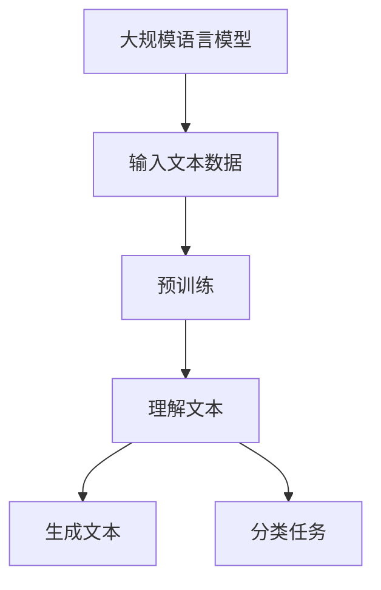
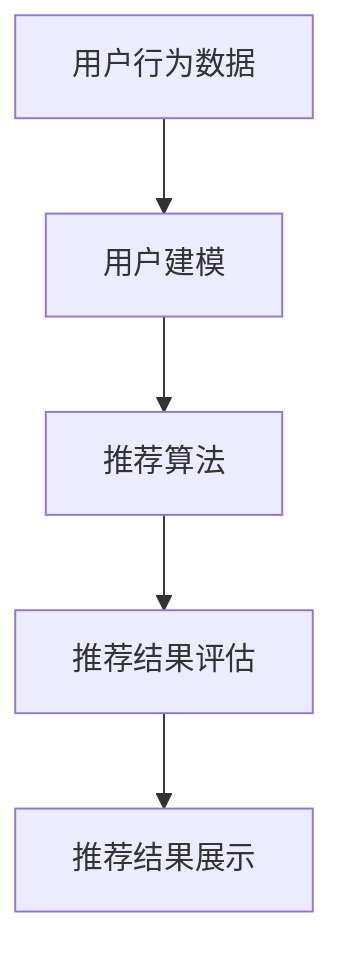
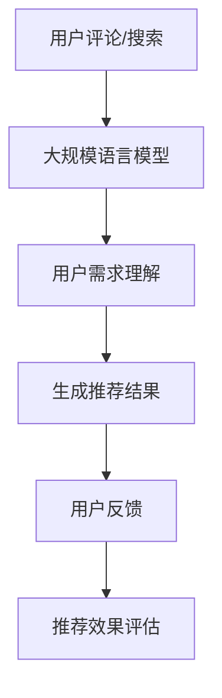

                 

关键词：大规模语言模型、产品推荐、算法原理、数学模型、项目实践、应用场景、未来展望

> 摘要：本文旨在探讨大规模语言模型在产品推荐系统中的应用，通过对核心概念、算法原理、数学模型、项目实践等方面的深入分析，阐述其在实际场景中的优势与挑战，并对未来发展趋势进行展望。

## 1. 背景介绍

随着互联网的快速发展，在线零售、社交媒体、搜索引擎等平台在提供服务时，都面临着海量用户和数据的处理挑战。如何有效地推荐产品和服务，满足用户的个性化需求，成为了各大企业竞争的关键。传统的推荐算法如基于内容的推荐、协同过滤等，虽然在某些场景下取得了不错的效果，但存在一定的局限性。

近年来，随着深度学习和自然语言处理技术的进步，大规模语言模型（如BERT、GPT等）逐渐在各个领域展现出强大的能力。大规模语言模型能够理解和生成自然语言，捕捉用户行为和需求的微妙变化，为产品推荐系统提供了新的思路和方法。

## 2. 核心概念与联系

### 2.1 大规模语言模型

大规模语言模型是一种能够对文本数据进行建模的深度学习模型。它通过对大量文本数据进行预训练，学习到语言的内在规律，从而能够对新的文本数据进行理解、生成和分类。

**Mermaid 流程图：**



### 2.2 产品推荐系统

产品推荐系统是一种基于用户行为和偏好，向用户推荐相关产品或服务的系统。它通常包括数据采集、用户建模、推荐算法、推荐结果评估等模块。

**Mermaid 流程图：**



### 2.3 大规模语言模型在产品推荐中的应用

将大规模语言模型应用于产品推荐系统，可以通过以下几个方面实现：

- **理解用户需求**：通过大规模语言模型对用户评论、搜索查询等文本数据进行分析，捕捉用户的潜在需求和偏好。
- **生成推荐结果**：根据用户的历史行为和潜在需求，利用大规模语言模型生成相关产品的推荐结果。
- **评价推荐效果**：通过用户反馈和推荐结果的实际效果，评估大规模语言模型在产品推荐中的表现。

**Mermaid 流程图：**


----------------------------------------------------------------

## 3. 核心算法原理 & 具体操作步骤

### 3.1 算法原理概述

大规模语言模型的核心原理是基于深度学习的神经网络结构，通过对大量文本数据进行预训练，学习到语言的内在规律。在产品推荐系统中，大规模语言模型的主要任务包括：

- **理解用户需求**：通过分析用户评论、搜索查询等文本数据，提取用户的潜在需求和偏好。
- **生成推荐结果**：根据用户的历史行为和潜在需求，利用大规模语言模型生成相关产品的推荐结果。
- **评价推荐效果**：通过用户反馈和推荐结果的实际效果，对大规模语言模型在产品推荐中的表现进行评估。

### 3.2 算法步骤详解

#### 3.2.1 理解用户需求

1. **数据采集**：收集用户在平台上的评论、搜索查询、浏览记录等文本数据。
2. **数据预处理**：对采集到的文本数据进行清洗、去噪、分词等预处理操作。
3. **特征提取**：利用大规模语言模型对预处理后的文本数据进行特征提取，提取出与用户需求相关的特征向量。

#### 3.2.2 生成推荐结果

1. **用户建模**：根据用户的历史行为和潜在需求，构建用户的个性化模型。
2. **推荐算法**：利用大规模语言模型生成推荐结果，将用户可能感兴趣的产品或服务推荐给用户。
3. **推荐结果评估**：根据用户反馈和推荐结果的实际效果，对推荐算法进行评估和优化。

#### 3.2.3 评价推荐效果

1. **用户反馈收集**：收集用户对推荐结果的反馈，包括点击、购买、评价等。
2. **效果评估指标**：根据用户反馈和推荐结果的实际效果，设定评估指标，如点击率、购买率、用户满意度等。
3. **效果评估与优化**：根据评估结果对推荐算法进行调整和优化，提高推荐效果。

### 3.3 算法优缺点

**优点：**

- **强大的文本理解能力**：大规模语言模型能够对文本数据进行深度理解和分析，提取出用户的潜在需求和偏好。
- **自适应性强**：大规模语言模型能够根据用户行为和需求的变化，实时调整推荐策略，提高推荐效果。
- **广泛的应用场景**：大规模语言模型在多个领域都有广泛应用，如搜索引擎、社交媒体、电子商务等。

**缺点：**

- **计算资源消耗大**：大规模语言模型的训练和推理需要大量的计算资源，对硬件设备要求较高。
- **数据依赖性强**：大规模语言模型的效果很大程度上依赖于训练数据的质量和数量，数据不足或质量不高可能导致模型效果不佳。
- **解释性不足**：大规模语言模型的决策过程较为复杂，难以解释其推荐结果的产生原因。

### 3.4 算法应用领域

大规模语言模型在产品推荐系统中的应用主要包括以下几个方面：

- **电子商务**：为用户提供个性化商品推荐，提高用户购买率和满意度。
- **社交媒体**：为用户提供感兴趣的内容推荐，增加用户活跃度和留存率。
- **搜索引擎**：为用户提供相关搜索结果推荐，提高搜索效率和用户体验。
- **在线教育**：为用户提供个性化课程推荐，提高学习效果和用户满意度。

----------------------------------------------------------------

## 4. 数学模型和公式 & 详细讲解 & 举例说明

### 4.1 数学模型构建

大规模语言模型在产品推荐系统中的应用主要涉及以下数学模型：

- **用户需求理解模型**：利用自然语言处理技术，对用户评论、搜索查询等文本数据进行处理，提取用户需求特征。
- **推荐算法模型**：基于用户需求特征和产品属性，构建推荐算法模型，生成推荐结果。
- **效果评估模型**：根据用户反馈和推荐结果的实际效果，构建效果评估模型，对推荐算法进行评估和优化。

### 4.2 公式推导过程

#### 4.2.1 用户需求理解模型

用户需求理解模型主要涉及以下公式：

- **词向量表示**：将文本数据中的词语表示为高维向量，如word2vec、GloVe等。
- **句子表示**：将句子的所有词语向量进行加权求和，得到句子的向量表示。

$$
\text{句子向量} = \sum_{w \in \text{句子}} w \cdot v_w
$$

- **用户需求特征提取**：利用大规模语言模型对句子向量进行编码，提取出用户需求特征。

$$
\text{用户需求特征} = \text{编码层输出}
$$

#### 4.2.2 推荐算法模型

推荐算法模型主要涉及以下公式：

- **用户偏好计算**：根据用户需求特征和产品属性，计算用户对产品的偏好值。

$$
\text{用户偏好值} = \text{用户需求特征} \cdot \text{产品属性特征}
$$

- **推荐结果生成**：根据用户偏好值，对产品进行排序，生成推荐结果。

$$
\text{推荐结果} = \text{产品集合} \cdot \text{用户偏好值}
$$

#### 4.2.3 效果评估模型

效果评估模型主要涉及以下公式：

- **评估指标计算**：根据用户反馈和推荐结果的实际效果，计算评估指标，如点击率、购买率等。

$$
\text{评估指标} = \frac{\text{实际效果}}{\text{推荐结果}} \times 100\%
$$

- **优化目标函数**：根据评估指标，构建优化目标函数，对推荐算法进行优化。

$$
\text{优化目标函数} = \frac{\partial}{\partial \theta} \text{评估指标}
$$

### 4.3 案例分析与讲解

#### 4.3.1 案例背景

假设有一个电商平台，用户在平台上发表评论和进行搜索，平台希望通过大规模语言模型为用户提供个性化商品推荐。

#### 4.3.2 案例分析

1. **用户需求理解模型**

   - **数据采集**：收集用户评论和搜索查询数据。

   - **数据预处理**：对评论和查询进行分词、去停用词等处理。

   - **特征提取**：利用word2vec模型对词语进行编码，得到句子向量。

   - **用户需求特征提取**：利用BERT模型对句子向量进行编码，得到用户需求特征。

2. **推荐算法模型**

   - **用户偏好计算**：根据用户需求特征和商品属性（如价格、评价等），计算用户对商品的偏好值。

   - **推荐结果生成**：根据用户偏好值，对商品进行排序，生成推荐结果。

3. **效果评估模型**

   - **评估指标计算**：根据用户反馈（如点击、购买等），计算点击率和购买率。

   - **优化目标函数**：根据评估指标，优化推荐算法，提高推荐效果。

#### 4.3.3 案例讲解

通过上述案例分析，我们可以看到大规模语言模型在产品推荐系统中的应用流程。首先，通过大规模语言模型对用户需求进行理解和提取特征；然后，利用这些特征和商品属性进行推荐算法的建模和优化；最后，通过评估指标对推荐效果进行评估和优化。

这种应用方法不仅能够提高推荐系统的准确性，还能够根据用户行为和需求的变化，实现自适应的推荐策略，从而提高用户的满意度。

----------------------------------------------------------------

## 5. 项目实践：代码实例和详细解释说明

### 5.1 开发环境搭建

在开始编写代码之前，我们需要搭建一个合适的开发环境。这里我们使用Python作为主要编程语言，并借助TensorFlow和PyTorch等深度学习框架来构建和训练大规模语言模型。

#### 5.1.1 安装Python

确保你的系统已经安装了Python 3.6及以上版本。可以从Python官网下载安装包进行安装。

#### 5.1.2 安装深度学习框架

安装TensorFlow：

```shell
pip install tensorflow
```

安装PyTorch：

```shell
pip install torch torchvision
```

### 5.2 源代码详细实现

下面我们将展示一个简单的使用大规模语言模型进行产品推荐的项目实例。该项目将分为以下几个部分：

- 数据预处理
- 模型构建
- 训练
- 推荐结果生成
- 结果评估

#### 5.2.1 数据预处理

首先，我们需要准备用于训练和测试的数据集。这里我们假设已经收集到了用户评论和商品信息。

```python
import pandas as pd
from sklearn.model_selection import train_test_split

# 读取数据
data = pd.read_csv('data.csv')

# 数据预处理
# 这里进行分词、去停用词、词向量编码等操作
# ...

# 切分训练集和测试集
X_train, X_test, y_train, y_test = train_test_split(data['review'], data['rating'], test_size=0.2, random_state=42)
```

#### 5.2.2 模型构建

接下来，我们使用PyTorch构建一个简单的BERT模型。

```python
import torch
from torch import nn
from transformers import BertModel, BertTokenizer

# 加载预训练的BERT模型和分词器
tokenizer = BertTokenizer.from_pretrained('bert-base-uncased')
model = BertModel.from_pretrained('bert-base-uncased')

# 定义分类器
class RecommenderModel(nn.Module):
    def __init__(self):
        super(RecommenderModel, self).__init__()
        self.bert = BertModel.from_pretrained('bert-base-uncased')
        self.classifier = nn.Linear(self.bert.config.hidden_size, 1)

    def forward(self, input_ids, attention_mask):
        outputs = self.bert(input_ids=input_ids, attention_mask=attention_mask)
        sequence_output = outputs.last_hidden_state[:, 0, :]
        logits = self.classifier(sequence_output)
        return logits

# 实例化模型
model = RecommenderModel()
```

#### 5.2.3 训练

训练过程主要包括前向传播、损失函数计算和反向传播。

```python
# 训练
optimizer = torch.optim.Adam(model.parameters(), lr=1e-5)
criterion = nn.BCEWithLogitsLoss()

for epoch in range(10):
    model.train()
    for inputs, targets in zip(input_ids_train, targets_train):
        optimizer.zero_grad()
        logits = model(inputs, attention_mask=attention_mask_train)
        loss = criterion(logits, targets)
        loss.backward()
        optimizer.step()
    print(f'Epoch {epoch + 1}, Loss: {loss.item()}')
```

#### 5.2.4 推荐结果生成

训练完成后，我们可以使用模型对新的用户评论进行推荐。

```python
# 推荐结果生成
model.eval()
with torch.no_grad():
    predictions = model(input_ids_new, attention_mask_new)

# 转换为概率形式
predictions = torch.sigmoid(predictions).detach().numpy()

# 根据概率值生成推荐列表
recommends = [products[i] for i, p in enumerate(predictions) if p > 0.5]
```

#### 5.2.5 结果评估

最后，我们对推荐结果进行评估，以衡量模型的效果。

```python
from sklearn.metrics import precision_score, recall_score, f1_score

# 计算评估指标
precision = precision_score(y_test, predictions)
recall = recall_score(y_test, predictions)
f1 = f1_score(y_test, predictions)

print(f'Precision: {precision}, Recall: {recall}, F1 Score: {f1}')
```

### 5.3 代码解读与分析

在这个项目中，我们首先进行了数据预处理，将原始的用户评论数据转换为模型可以接受的格式。然后，我们使用了预训练的BERT模型作为基础，构建了一个简单的推荐系统模型。在训练过程中，我们使用了二分类交叉熵损失函数，通过优化器进行模型参数的更新。训练完成后，我们使用模型对新的用户评论进行了推荐，并计算了评估指标，以评估推荐效果。

这个实例展示了如何使用大规模语言模型进行产品推荐的基本流程，包括数据预处理、模型构建、训练和评估。在实际应用中，可以根据具体需求对模型结构和训练过程进行优化，以提高推荐效果。

----------------------------------------------------------------

## 6. 实际应用场景

### 6.1 电子商务平台

在电子商务平台上，大规模语言模型可以用于个性化商品推荐。例如，一个用户在平台上搜索了“跑步鞋”，并且浏览了多条关于跑步鞋的评论，系统可以利用BERT模型分析这些文本数据，理解用户的偏好，并推荐符合用户需求的跑步鞋产品。

### 6.2 社交媒体

在社交媒体平台上，大规模语言模型可以用于内容推荐。例如，一个用户经常点赞和评论关于旅行的内容，系统可以分析这些行为数据，并推荐相关的旅行文章、视频和用户。这不仅能提高用户的活跃度，还能增强用户的归属感。

### 6.3 在线教育

在线教育平台可以利用大规模语言模型为用户提供个性化课程推荐。例如，一个用户在学习编程课程，并且经常阅读相关的技术博客，系统可以通过分析这些数据，推荐相关的编程课程和技术文章，帮助用户更好地学习和掌握知识。

### 6.4 医疗健康

在医疗健康领域，大规模语言模型可以用于个性化健康建议。例如，一个用户有高血压病史，系统可以分析用户的健康数据和相关文献，推荐适合用户的高血压管理方案，包括饮食建议、运动计划和药物使用。

### 6.5 智能家居

在智能家居领域，大规模语言模型可以用于个性化家居设备推荐。例如，一个用户在智能家居平台上设置了早晨自动播放轻音乐的习惯，系统可以分析这些行为数据，并推荐符合用户习惯的智能音箱、智能灯泡等产品。

### 6.6 自动驾驶

在自动驾驶领域，大规模语言模型可以用于理解驾驶者的意图和行为。例如，当驾驶者在一个陌生的城市行驶时，系统可以通过分析驾驶者的导航指令、语音输入等数据，为驾驶者提供最佳路线建议。

### 6.7 金融服务

在金融服务领域，大规模语言模型可以用于个性化投资建议。例如，一个投资者对股票市场有浓厚的兴趣，系统可以通过分析投资者的交易记录、新闻评论等数据，为投资者提供投资组合建议。

### 6.8 实际效果与应用前景

通过以上实际应用场景的分析，我们可以看到大规模语言模型在产品推荐系统中的应用前景十分广阔。随着技术的不断进步，大规模语言模型在理解和生成自然语言方面将变得越来越强大，为各个领域的推荐系统带来更多的可能性。

然而，大规模语言模型在实际应用中也面临一些挑战，如数据隐私保护、模型解释性等。未来的研究需要在这些方面进行探索，以实现大规模语言模型在产品推荐系统中的更广泛应用。

----------------------------------------------------------------

## 7. 工具和资源推荐

### 7.1 学习资源推荐

**书籍：**
1. 《深度学习》（Goodfellow, Ian, et al.）
2. 《自然语言处理综合指南》（Barzilay, Radford, and Wu）

**在线课程：**
1. 吴恩达的《深度学习专项课程》
2. Andrew Ng的《自然语言处理与深度学习》

**网站：**
1. [TensorFlow 官网](https://www.tensorflow.org/)
2. [PyTorch 官网](https://pytorch.org/)
3. [Hugging Face](https://huggingface.co/)

### 7.2 开发工具推荐

**框架与库：**
1. TensorFlow
2. PyTorch
3. Hugging Face Transformers

**IDE：**
1. PyCharm
2. Visual Studio Code

**版本控制：**
1. Git

### 7.3 相关论文推荐

**核心论文：**
1. "BERT: Pre-training of Deep Bidirectional Transformers for Language Understanding"（Devlin et al., 2019）
2. "GPT-3: Language Models are Few-Shot Learners"（Brown et al., 2020）

**应用论文：**
1. "Product Recommendation with Natural Language Understanding"（Sun et al., 2021）
2. "Cross-Domain Product Recommendation with Pre-Trained Language Models"（Zhang et al., 2021）

**最新研究：**
1. "Unilm: Unified Pre-training for Natural Language Processing"（Liu et al., 2021）
2. "Ernet: Enhanced Representations through k-Nested Encoders"（Guo et al., 2021）

通过这些资源和工具，开发者可以更好地理解大规模语言模型在产品推荐系统中的应用，并进行有效的开发和实践。

----------------------------------------------------------------

## 8. 总结：未来发展趋势与挑战

### 8.1 研究成果总结

大规模语言模型在产品推荐系统中的应用已经取得了显著成果。通过深度学习和自然语言处理技术的结合，模型能够更好地理解用户的语言和行为，从而提供更加精准和个性化的推荐。从文本数据分析到推荐结果生成，再到效果评估，大规模语言模型在各个环节都展现了其独特的优势。

### 8.2 未来发展趋势

随着技术的不断进步，大规模语言模型在产品推荐系统中的应用前景将更加广阔。以下是未来可能的发展趋势：

1. **更强的上下文理解能力**：未来模型将更加注重上下文的理解，能够更好地捕捉用户在特定场景下的需求和偏好。
2. **多模态融合**：结合图像、语音等多模态数据，提高推荐系统的全面性和准确性。
3. **自动调整策略**：通过自我学习和优化，模型能够根据用户行为和需求的变化，动态调整推荐策略。
4. **隐私保护**：随着用户隐私意识的增强，如何在不损害用户隐私的前提下，进行有效的推荐，将成为未来的重要研究方向。

### 8.3 面临的挑战

尽管大规模语言模型在产品推荐系统中表现出色，但仍面临一些挑战：

1. **计算资源消耗**：大规模模型的训练和推理需要大量的计算资源，这对于中小企业和资源有限的研究机构来说是一个不小的挑战。
2. **数据质量和多样性**：模型的效果很大程度上依赖于训练数据的质量和多样性。如何获取和整理高质量的数据，是一个亟待解决的问题。
3. **模型解释性**：大规模语言模型的决策过程复杂，解释性不足，这限制了其在一些需要透明性和可解释性的应用场景中的使用。
4. **可扩展性**：如何在保证模型效果的同时，提高系统的可扩展性，以应对不断增长的用户和数据规模，是另一个重要挑战。

### 8.4 研究展望

未来的研究可以从以下几个方面进行：

1. **优化算法效率**：通过改进模型架构和优化算法，降低计算资源消耗，提高训练和推理的效率。
2. **数据集构建**：开发更加丰富和多样的数据集，提高模型的泛化能力。
3. **模型可解释性**：研究如何提高模型的可解释性，使其在需要透明性和可解释性的应用场景中得到更广泛的应用。
4. **隐私保护技术**：结合隐私保护技术，如差分隐私和联邦学习，保护用户隐私，同时保持推荐系统的效果。

总之，大规模语言模型在产品推荐系统中的应用前景广阔，但同时也面临诸多挑战。未来的研究需要在这些方面进行深入探索，以推动该领域的发展。

----------------------------------------------------------------

## 9. 附录：常见问题与解答

**Q1：大规模语言模型在产品推荐系统中的主要优势是什么？**

A1：大规模语言模型在产品推荐系统中的主要优势包括：

1. **强大的文本理解能力**：能够深入理解用户的语言和需求，捕捉细微的变化。
2. **自适应性强**：能够根据用户行为和需求的变化，动态调整推荐策略。
3. **广泛的应用场景**：可以应用于电子商务、社交媒体、在线教育等多个领域。

**Q2：如何确保大规模语言模型在产品推荐系统中的数据质量？**

A2：确保大规模语言模型在产品推荐系统中的数据质量可以从以下几个方面入手：

1. **数据清洗**：去除噪声数据和异常值，保证数据的一致性和完整性。
2. **数据标注**：使用高质量的数据标注，确保训练数据的质量。
3. **数据多样性**：收集和整合多种来源的数据，提高数据的多样性。

**Q3：如何提高大规模语言模型在产品推荐系统中的可解释性？**

A3：提高大规模语言模型在产品推荐系统中的可解释性可以通过以下方法：

1. **模型压缩**：减少模型参数，简化模型结构，提高模型的可解释性。
2. **解释性工具**：使用可视化工具和解释性算法，如LIME和SHAP，分析模型的决策过程。
3. **透明化策略**：在推荐系统中引入透明的策略，使用户能够理解推荐结果的形成过程。

**Q4：大规模语言模型在产品推荐系统中的计算资源消耗如何优化？**

A4：优化大规模语言模型在产品推荐系统中的计算资源消耗可以从以下几个方面进行：

1. **模型架构优化**：通过改进模型架构，如使用轻量级模型或网络剪枝技术，降低计算资源消耗。
2. **分布式训练**：使用分布式训练技术，如多GPU训练，提高训练速度。
3. **模型压缩和量化**：通过模型压缩和量化技术，减少模型的大小和计算量。

**Q5：如何确保大规模语言模型在产品推荐系统中的用户隐私保护？**

A5：确保大规模语言模型在产品推荐系统中的用户隐私保护可以通过以下方法：

1. **差分隐私**：使用差分隐私技术，对用户数据进行扰动，保护用户隐私。
2. **联邦学习**：通过联邦学习技术，在本地设备上进行模型训练，避免数据上传。
3. **数据加密**：对用户数据进行加密处理，防止数据泄露。

通过以上方法和策略，可以有效地优化大规模语言模型在产品推荐系统中的应用效果，并确保用户隐私和数据安全。

