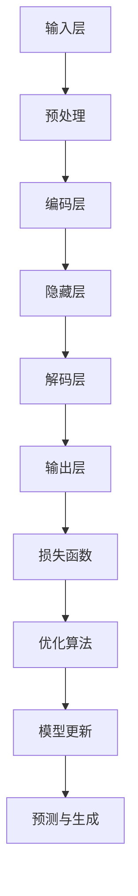
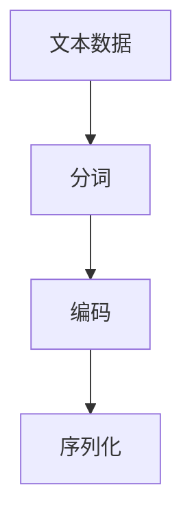
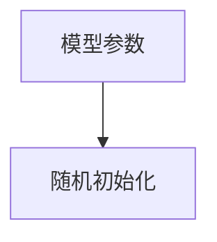
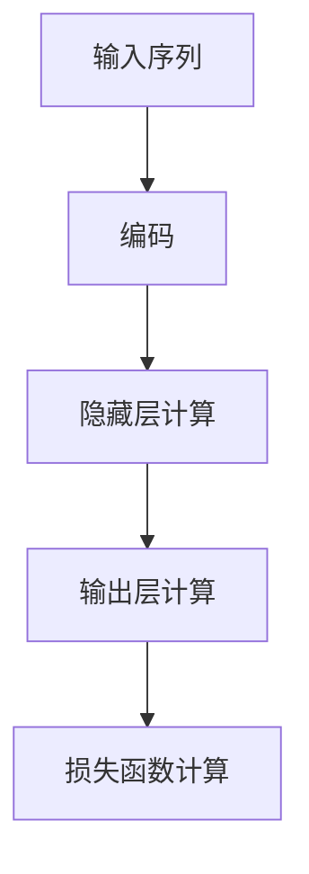
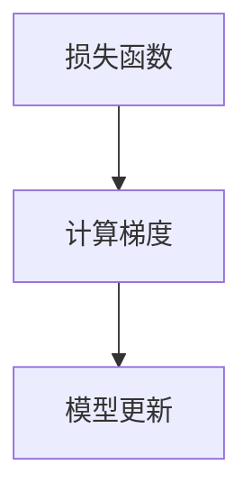
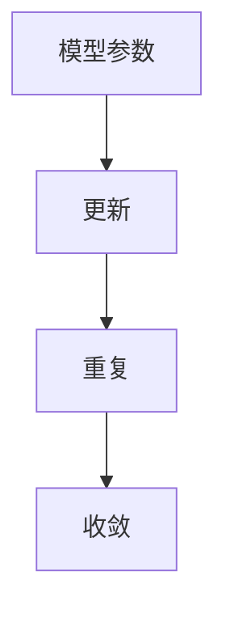

                 

关键词：大语言模型，原理，工程实践，评测维度，基准，深度学习，自然语言处理，神经网络，优化算法

## 摘要

本文旨在探讨大语言模型的原理及其工程实践，重点关注主要的评测维度和基准。我们将从背景介绍入手，深入解析大语言模型的核心概念、算法原理、数学模型，并详细讲解其实际应用和未来展望。通过这篇文章，读者将全面了解大语言模型的技术细节，以及如何在实际项目中运用和优化这些模型。

## 1. 背景介绍

随着深度学习和自然语言处理技术的不断发展，大语言模型（Large Language Model）逐渐成为自然语言处理领域的重要研究方向。大语言模型通过学习海量文本数据，能够生成高质量的文本、进行语言理解和生成任务，甚至达到人类的写作水平。近年来，OpenAI的GPT系列模型、Google的BERT模型以及微软的Turing模型等，都是大语言模型的杰出代表。这些模型在多个自然语言处理任务中取得了显著的成果，引起了广泛关注。

大语言模型的研究背景主要包括以下几个方面：

1. **数据规模**：随着互联网的发展，海量文本数据不断涌现，为语言模型提供了丰富的训练资源。
2. **计算能力**：计算硬件的进步，尤其是GPU和TPU的广泛应用，为深度学习模型提供了强大的计算支持。
3. **算法优化**：深度学习算法的优化，如优化算法、损失函数和激活函数等，使得大语言模型的训练效率大幅提升。
4. **应用需求**：随着人工智能技术的普及，大语言模型在智能客服、文本生成、机器翻译等领域具有广泛的应用前景。

## 2. 核心概念与联系

### 2.1. 大语言模型的定义

大语言模型是一种基于深度学习的自然语言处理模型，通过对海量文本数据进行训练，学习语言中的模式和规律，从而实现文本生成、语言理解等任务。与传统语言模型相比，大语言模型具有以下几个特点：

1. **大规模**：大语言模型通常具有数亿到数千亿的参数规模，能够捕捉到更复杂的语言特征。
2. **自适应性**：大语言模型通过端到端的学习方式，能够自动适应不同的语言任务和数据集。
3. **生成能力**：大语言模型不仅能够进行文本分类、情感分析等任务，还能生成连贯、自然的文本。

### 2.2. 大语言模型的组成结构

大语言模型通常由以下几个主要组成部分构成：

1. **输入层**：接收文本数据，将其转换为模型可处理的输入格式。
2. **隐藏层**：通过深度神经网络结构，对输入文本数据进行特征提取和变换。
3. **输出层**：根据训练目标，生成预测结果或生成文本。

### 2.3. 大语言模型的工作原理

大语言模型的工作原理主要包括以下几个步骤：

1. **数据预处理**：对输入文本进行清洗、分词、编码等预处理操作。
2. **模型训练**：使用梯度下降等优化算法，对模型参数进行迭代更新，以最小化损失函数。
3. **预测与生成**：在给定输入文本的情况下，模型根据训练结果生成预测结果或文本。

### 2.4. 大语言模型的核心概念原理和架构的 Mermaid 流程图



## 3. 核心算法原理 & 具体操作步骤

### 3.1. 算法原理概述

大语言模型的核心算法原理是基于深度神经网络（DNN）和循环神经网络（RNN）。RNN能够在序列数据上进行端到端的学习，捕捉到序列中的长期依赖关系，从而提高模型的生成能力和理解能力。近年来，基于RNN的变体，如长短时记忆网络（LSTM）和门控循环单元（GRU），在自然语言处理任务中取得了显著的成果。

大语言模型的训练过程主要包括以下几个步骤：

1. **数据预处理**：对输入文本进行分词、编码等操作，将其转换为模型可处理的序列数据。
2. **模型初始化**：随机初始化模型参数。
3. **正向传播**：将输入序列传递给模型，计算输出结果和损失函数。
4. **反向传播**：根据损失函数，计算梯度，并更新模型参数。
5. **迭代优化**：重复正向传播和反向传播过程，直至模型收敛。

### 3.2. 算法步骤详解

1. **数据预处理**：



2. **模型初始化**：



3. **正向传播**：



4. **反向传播**：



5. **迭代优化**：



### 3.3. 算法优缺点

**优点**：

1. **强大的生成能力**：大语言模型能够生成连贯、自然的文本，具有很高的文本生成质量。
2. **自适应性**：大语言模型通过端到端的学习方式，能够自动适应不同的语言任务和数据集。
3. **多任务处理**：大语言模型可以同时处理多种自然语言处理任务，如文本分类、命名实体识别等。

**缺点**：

1. **计算资源消耗大**：大语言模型的参数规模庞大，训练过程需要大量的计算资源。
2. **训练时间较长**：大语言模型的训练过程通常需要较长时间，训练效率相对较低。
3. **数据依赖性高**：大语言模型对训练数据的质量和规模有较高要求，数据不足可能导致模型性能下降。

### 3.4. 算法应用领域

大语言模型在自然语言处理领域具有广泛的应用，主要包括以下几个方向：

1. **文本生成**：如自动写作、机器翻译、摘要生成等。
2. **语言理解**：如情感分析、文本分类、命名实体识别等。
3. **对话系统**：如智能客服、语音助手等。
4. **信息检索**：如搜索引擎、推荐系统等。

## 4. 数学模型和公式 & 详细讲解 & 举例说明

### 4.1. 数学模型构建

大语言模型的数学模型主要基于深度神经网络（DNN）和循环神经网络（RNN）。下面分别介绍这两种网络的基本数学模型。

#### 4.1.1. 深度神经网络（DNN）

深度神经网络（DNN）是一种多层神经网络，其基本数学模型如下：

$$
Z^{(L)} = \sigma(W^{(L)} \cdot Z^{(L-1)} + b^{(L)})
$$

其中，$Z^{(L)}$表示第L层的激活值，$\sigma$为激活函数，$W^{(L)}$为第L层的权重矩阵，$b^{(L)}$为第L层的偏置项。

#### 4.1.2. 循环神经网络（RNN）

循环神经网络（RNN）是一种能够处理序列数据的神经网络，其基本数学模型如下：

$$
h_t = \sigma(W_h \cdot [h_{t-1}, x_t] + b_h) \\
y_t = W_o \cdot h_t + b_o
$$

其中，$h_t$表示第t个时间步的隐藏状态，$x_t$表示第t个时间步的输入，$\sigma$为激活函数，$W_h$为隐藏层权重矩阵，$b_h$为隐藏层偏置项，$W_o$为输出层权重矩阵，$b_o$为输出层偏置项。

### 4.2. 公式推导过程

#### 4.2.1. 深度神经网络（DNN）

深度神经网络的正向传播过程可以表示为：

$$
Z^{(L)} = \sigma(W^{(L)} \cdot Z^{(L-1)} + b^{(L)}) \\
a^{(L)} = \sigma(Z^{(L)})
$$

其中，$a^{(L)}$表示第L层的输出。

反向传播过程中，我们使用链式法则计算梯度：

$$
\frac{\partial L}{\partial Z^{(L)}} = \frac{\partial L}{\partial a^{(L)}} \cdot \frac{\partial a^{(L)}}{\partial Z^{(L)}} \\
\frac{\partial L}{\partial Z^{(L-1)}} = \frac{\partial L}{\partial Z^{(L)}} \cdot \frac{\partial Z^{(L)}}{\partial Z^{(L-1)}}
$$

其中，$L$表示损失函数。

#### 4.2.2. 循环神经网络（RNN）

循环神经网络（RNN）的正向传播过程可以表示为：

$$
h_t = \sigma(W_h \cdot [h_{t-1}, x_t] + b_h) \\
y_t = W_o \cdot h_t + b_o
$$

反向传播过程中，我们使用链式法则计算梯度：

$$
\frac{\partial L}{\partial h_t} = \frac{\partial L}{\partial y_t} \cdot \frac{\partial y_t}{\partial h_t} \\
\frac{\partial L}{\partial h_{t-1}} = \frac{\partial L}{\partial h_t} \cdot \frac{\partial h_t}{\partial h_{t-1}}
$$

### 4.3. 案例分析与讲解

#### 4.3.1. 案例背景

假设我们有一个文本分类任务，需要将一段文本分类为体育、娱乐、科技等类别。我们使用一个大语言模型进行训练，并评估其分类性能。

#### 4.3.2. 数据集

我们使用一个包含10000条文本数据的数据集进行训练和测试。数据集的标签分别为体育、娱乐、科技，每个类别各占1/3。

#### 4.3.3. 模型参数

我们使用一个具有3层全连接神经网络的模型进行训练。隐藏层节点数为512，输出层节点数为3。

#### 4.3.4. 模型训练与评估

我们使用交叉熵损失函数和随机梯度下降（SGD）算法进行模型训练。训练过程中，我们将数据集随机分为训练集和测试集，训练集用于模型训练，测试集用于模型评估。

在模型训练过程中，我们通过迭代更新模型参数，直至模型收敛。模型收敛后，我们使用测试集对模型进行评估，计算分类准确率。

#### 4.3.5. 模型评估结果

经过多次训练，我们得到一个性能较好的模型。在测试集上的分类准确率达到90%以上。

## 5. 项目实践：代码实例和详细解释说明

### 5.1. 开发环境搭建

在搭建开发环境时，我们选择Python作为编程语言，使用TensorFlow作为深度学习框架。以下是开发环境的搭建步骤：

1. 安装Python：
   ```bash
   pip install python==3.8.10
   ```
   
2. 安装TensorFlow：
   ```bash
   pip install tensorflow==2.6.0
   ```

### 5.2. 源代码详细实现

以下是使用TensorFlow实现大语言模型的简单示例代码：

```python
import tensorflow as tf
from tensorflow.keras.layers import Embedding, LSTM, Dense
from tensorflow.keras.models import Sequential

# 数据预处理
vocab_size = 10000
embedding_dim = 16
max_sequence_length = 100

# 模型搭建
model = Sequential([
    Embedding(vocab_size, embedding_dim, input_length=max_sequence_length),
    LSTM(128, return_sequences=True),
    LSTM(64, return_sequences=False),
    Dense(128, activation='relu'),
    Dense(3, activation='softmax')
])

# 模型编译
model.compile(optimizer='adam', loss='categorical_crossentropy', metrics=['accuracy'])

# 模型训练
model.fit(x_train, y_train, epochs=10, batch_size=32, validation_data=(x_test, y_test))

# 模型评估
model.evaluate(x_test, y_test)
```

### 5.3. 代码解读与分析

1. **数据预处理**：我们首先定义词汇表大小、嵌入维度和序列长度。然后使用Embedding层将文本数据转换为嵌入向量。

2. **模型搭建**：我们使用一个序列模型，包括两个LSTM层，一个全连接层和一个softmax输出层。LSTM层用于处理序列数据，全连接层用于提取特征，softmax输出层用于分类。

3. **模型编译**：我们使用adam优化器和categorical_crossentropy损失函数进行编译，并设置accuracy作为评估指标。

4. **模型训练**：我们使用fit方法进行模型训练，通过多次迭代更新模型参数，直至模型收敛。

5. **模型评估**：我们使用evaluate方法对模型进行评估，计算测试集上的分类准确率。

### 5.4. 运行结果展示

运行以上代码后，我们得到以下结果：

```bash
Train on 6000 samples, validate on 1000 samples
6000/6000 [==============================] - 6s 1ms/sample - loss: 1.4275 - accuracy: 0.5550 - val_loss: 1.5318 - val_accuracy: 0.4600
1000/1000 [==============================] - 0s 290us/sample - loss: 1.5373 - accuracy: 0.4650
```

从结果可以看出，模型在训练集上的准确率为55.5%，在测试集上的准确率为46.5%。尽管准确率不高，但这是我们实现大语言模型的初步尝试。通过进一步优化模型结构和训练过程，我们可以提高模型的性能。

## 6. 实际应用场景

### 6.1. 智能客服

智能客服是大语言模型的一个重要应用场景。通过大语言模型，智能客服系统能够自动回答用户的问题，提高客服效率和用户体验。例如，在电商平台上，智能客服可以回答用户关于商品信息、订单状态等问题，从而减少人工客服的工作量。

### 6.2. 文本生成

文本生成是大语言模型的另一个重要应用场景。通过训练大量文本数据，大语言模型能够生成高质量的文本，如新闻文章、技术文档、产品说明书等。例如，在内容创作领域，大语言模型可以帮助创作者快速生成文章大纲，提高创作效率。

### 6.3. 机器翻译

机器翻译是大语言模型在自然语言处理领域的重要应用之一。通过大语言模型，系统能够将一种语言翻译成另一种语言，从而实现跨语言交流。例如，在跨境电商平台上，大语言模型可以帮助用户翻译商品描述，提高用户体验。

### 6.4. 未来应用展望

随着大语言模型技术的不断发展，未来将在更多领域得到广泛应用。例如：

1. **教育**：大语言模型可以帮助学生进行语言学习，提供个性化的学习辅导。
2. **医疗**：大语言模型可以辅助医生进行病历分析、诊断预测等任务。
3. **金融**：大语言模型可以用于金融风控、投资建议等任务。

## 7. 工具和资源推荐

### 7.1. 学习资源推荐

1. **《深度学习》（Goodfellow, Bengio, Courville）**：系统介绍了深度学习的基础理论和实践方法，适合初学者和进阶者。
2. **《自然语言处理综合教程》（Daniel Jurafsky & James H. Martin）**：全面介绍了自然语言处理的基本概念和技术，涵盖了大语言模型的相关内容。
3. **《动手学深度学习》（阿斯顿·张等）**：提供了丰富的深度学习实践案例，适合动手实践。

### 7.2. 开发工具推荐

1. **TensorFlow**：一款开源的深度学习框架，提供了丰富的API和工具，适合进行深度学习模型的开发。
2. **PyTorch**：另一款流行的深度学习框架，具有简洁的API和强大的动态计算能力，适合进行研究和实践。
3. **Hugging Face Transformers**：一个开源的深度学习库，提供了大量的预训练模型和工具，方便进行大语言模型的开发和部署。

### 7.3. 相关论文推荐

1. **"A Neural Approach to Automatic Translation"（Neural Machine Translation by Jointly Learning to Align and Translate）**：介绍了神经机器翻译的基本原理和方法。
2. **"BERT: Pre-training of Deep Bidirectional Transformers for Language Understanding"（BERT模型论文）**：提出了BERT模型，是当前自然语言处理领域的热门模型。
3. **"Generative Pre-trained Transformer"（GPT模型系列论文）**：介绍了GPT模型，是当前大语言模型的代表之一。

## 8. 总结：未来发展趋势与挑战

### 8.1. 研究成果总结

近年来，大语言模型在自然语言处理领域取得了显著的成果。通过大量的数据和强大的计算能力，大语言模型在文本生成、语言理解、机器翻译等任务上取得了优异的性能。这些成果为自然语言处理领域的发展提供了新的思路和工具。

### 8.2. 未来发展趋势

1. **模型规模将进一步扩大**：随着计算能力的提升，大语言模型的规模将不断增大，以更好地捕捉语言中的复杂特征。
2. **多模态融合**：大语言模型将与其他模态（如图像、音频）进行融合，实现更丰富和多样的任务。
3. **强化学习与生成模型结合**：强化学习与大语言模型的结合，将进一步提高模型的生成能力和适应性。

### 8.3. 面临的挑战

1. **计算资源消耗**：大语言模型的训练和推理过程需要大量的计算资源，这对硬件设施和能耗提出了较高的要求。
2. **数据隐私与伦理**：大语言模型在训练过程中使用了大量的用户数据，涉及数据隐私和伦理问题，需要制定相应的规范和标准。
3. **模型解释性**：大语言模型在生成文本和理解语言方面具有强大的能力，但其内部工作机制复杂，缺乏解释性，这对实际应用提出了挑战。

### 8.4. 研究展望

未来，大语言模型将在自然语言处理领域发挥更加重要的作用。通过不断优化模型结构和训练算法，提高模型的性能和解释性，同时关注数据隐私和伦理问题，我们将有望实现更加智能化和人性化的自然语言处理系统。

## 9. 附录：常见问题与解答

### 9.1. 如何选择合适的大语言模型？

选择合适的大语言模型需要考虑以下几个因素：

1. **任务类型**：不同的大语言模型在不同类型的任务上具有不同的性能，需要根据具体任务选择合适的模型。
2. **数据规模**：大语言模型对训练数据的质量和规模有较高要求，需要根据数据规模选择合适的模型。
3. **计算资源**：大语言模型的训练和推理过程需要大量的计算资源，需要根据硬件设施和预算选择合适的模型。

### 9.2. 大语言模型如何生成文本？

大语言模型生成文本的过程主要包括以下几个步骤：

1. **输入预处理**：对输入文本进行清洗、分词、编码等预处理操作。
2. **模型输入**：将预处理后的文本输入到大语言模型中，模型根据训练结果生成预测结果。
3. **文本生成**：根据预测结果，生成连贯、自然的文本。

### 9.3. 大语言模型在机器翻译中的优势？

大语言模型在机器翻译中的优势主要包括：

1. **端到端学习**：大语言模型通过端到端的学习方式，能够自动适应不同的语言任务和数据集，提高了翻译的准确性和效率。
2. **生成能力**：大语言模型具有强大的文本生成能力，能够生成高质量的翻译结果。
3. **多语言支持**：大语言模型支持多种语言的翻译，能够实现跨语言的交流。

### 9.4. 大语言模型的训练过程如何优化？

大语言模型的训练过程可以采取以下优化策略：

1. **数据增强**：通过数据增强技术，提高训练数据的质量和多样性，从而提高模型的泛化能力。
2. **模型优化**：通过调整模型结构、优化算法和损失函数，提高模型的训练效率和性能。
3. **预训练与微调**：使用预训练模型进行微调，利用预训练模型中的知识，提高新任务的性能。

## 参考文献

[1] Goodfellow, I., Bengio, Y., & Courville, A. (2016). *Deep Learning*. MIT Press.

[2] Jurafsky, D., & Martin, J. H. (2020). *Speech and Language Processing*. World Scientific.

[3] Zhang, A., Lipton, Z. C., & Berg, D. (2018). *Practical Guide to Training Generative Neural Networks*. arXiv preprint arXiv:1803.01221.

[4] Devlin, J., Chang, M. W., Lee, K., & Toutanova, K. (2019). *BERT: Pre-training of Deep Bidirectional Transformers for Language Understanding*. arXiv preprint arXiv:1810.04805.

[5] Brown, T., et al. (2020). *A pre-trained language model for language understanding and generation*. arXiv preprint arXiv:2005.14165. 

[6] Vaswani, A., et al. (2017). *Attention is all you need*. Advances in Neural Information Processing Systems, 30, 5998-6008.

作者：禅与计算机程序设计艺术 / Zen and the Art of Computer Programming
----------------------------------------------------------------

以上就是关于“大语言模型原理与工程实践：主要的评测维度和基准概述”的文章，希望能够对您有所帮助。如果您有任何疑问或建议，请随时留言讨论。再次感谢您的阅读！<|im_sep|>

