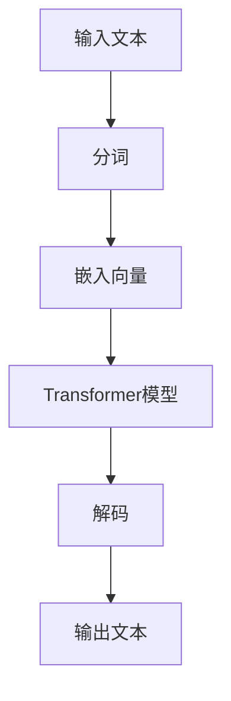

                 

关键词：大语言模型、参数微调、工程实践、人工智能、深度学习、自然语言处理

摘要：本文将深入探讨大语言模型的原理及其在工程实践中的应用，特别是全参数微调技术。通过阐述大语言模型的基本概念、核心算法、数学模型以及具体项目实践，帮助读者全面理解这一领域的前沿动态和实际应用。

## 1. 背景介绍

随着人工智能和深度学习技术的迅猛发展，自然语言处理（NLP）已经成为计算机科学的重要分支。大语言模型（Large Language Model）作为NLP领域的核心工具，极大地提升了文本生成、理解和翻译等任务的性能。本文旨在介绍大语言模型的原理与工程实践，帮助读者深入了解这一领域的最新进展。

大语言模型的发展经历了多个阶段。从最初的基于规则的方法，到基于统计模型的转换语法、潜在语义分析，再到现代的深度学习模型，如循环神经网络（RNN）、长短期记忆网络（LSTM）和变换器（Transformer）等，大语言模型在模型架构和训练方法上不断革新，性能也得到显著提升。

近年来，基于Transformer的模型如BERT、GPT、Turing等，在多种NLP任务中取得了突破性的成果，大语言模型的应用范围也越来越广泛。全参数微调技术作为大语言模型工程实践的关键环节，能够显著提高模型在不同任务上的适应性，是实现高效、准确自然语言处理的重要手段。

## 2. 核心概念与联系

### 2.1 大语言模型的基本概念

大语言模型是一种基于神经网络的语言表示模型，其核心目标是通过大规模语料库的训练，学习语言的结构和规律，从而实现对自然语言的理解和生成。大语言模型通常包含数亿到千亿个参数，能够捕捉语言中的复杂模式。

### 2.2 大语言模型的架构

大语言模型的架构通常采用多层神经网络，如Transformer、RNN、LSTM等。Transformer模型以其并行计算的优势在NLP领域得到了广泛应用。其核心结构包括多头自注意力机制（Multi-Head Self-Attention）和前馈神经网络（Feedforward Neural Network）。通过这些结构，模型能够捕捉输入序列中的长距离依赖关系。

### 2.3 大语言模型与自然语言处理任务的联系

大语言模型在自然语言处理任务中具有广泛的应用。文本分类、情感分析、机器翻译、问答系统等任务都可以通过大语言模型来实现。大语言模型通过训练学习到语言的本质特征，从而能够实现高度自动化的文本处理。

### 2.4 Mermaid流程图



## 3. 核心算法原理 & 具体操作步骤

### 3.1 算法原理概述

大语言模型的核心算法是基于自注意力机制（Self-Attention）和前馈神经网络（Feedforward Neural Network）。自注意力机制允许模型在处理序列数据时，自动关注序列中的重要信息，从而捕捉长距离依赖关系。前馈神经网络则用于进一步提取和整合特征。

### 3.2 算法步骤详解

1. **输入文本预处理**：对输入的文本进行分词、去停用词等处理，将文本转化为数字序列。
2. **嵌入向量**：将数字序列转化为嵌入向量，这些向量表示了文本的语义信息。
3. **自注意力计算**：利用自注意力机制计算序列中每个单词的权重，从而捕捉长距离依赖关系。
4. **前馈神经网络**：通过前馈神经网络进一步提取和整合特征。
5. **解码**：将编码后的信息解码为输出文本。

### 3.3 算法优缺点

- **优点**：大语言模型能够有效捕捉语言中的复杂模式，实现高度自动化的文本处理。自注意力机制和前馈神经网络的结构使得模型在计算效率和性能上具有显著优势。
- **缺点**：大语言模型的训练和推理过程需要大量的计算资源和时间，且对数据质量和规模有较高要求。

### 3.4 算法应用领域

大语言模型在多个自然语言处理任务中都有广泛应用，如文本分类、机器翻译、情感分析、问答系统等。其强大的语义理解和生成能力使得大语言模型在各个领域都取得了显著的成果。

## 4. 数学模型和公式 & 详细讲解 & 举例说明

### 4.1 数学模型构建

大语言模型的数学模型主要基于自注意力机制和前馈神经网络。自注意力机制的计算公式如下：

$$
\text{Attention}(Q, K, V) = \text{softmax}\left(\frac{QK^T}{\sqrt{d_k}}\right) V
$$

其中，$Q$、$K$、$V$ 分别为查询向量、键向量和值向量，$d_k$ 为键向量的维度。

前馈神经网络的计算公式如下：

$$
\text{FFN}(x) = \text{ReLU}(W_2 \text{ReLU}(W_1 x + b_1)) + b_2
$$

其中，$W_1$、$W_2$ 分别为权重矩阵，$b_1$、$b_2$ 分别为偏置向量。

### 4.2 公式推导过程

自注意力机制的推导过程如下：

1. **计算相似性矩阵**：首先计算查询向量 $Q$ 和键向量 $K$ 的内积，得到相似性矩阵 $S$。
2. **应用 softmax 函数**：对相似性矩阵 $S$ 应用 softmax 函数，得到权重矩阵 $W$。
3. **计算注意力得分**：将权重矩阵 $W$ 与值向量 $V$ 相乘，得到注意力得分。
4. **汇总注意力得分**：将注意力得分进行求和，得到最终的输出。

前馈神经网络的推导过程如下：

1. **输入加偏置**：将输入向量 $x$ 与权重矩阵 $W_1$ 相乘，并加上偏置向量 $b_1$。
2. **应用 ReLU 函数**：对上一步的结果应用 ReLU 函数，得到中间层输出。
3. **输入加偏置**：将中间层输出与权重矩阵 $W_2$ 相乘，并加上偏置向量 $b_2$。
4. **输出**：得到最终的输出。

### 4.3 案例分析与讲解

假设我们有一个包含三个单词的文本序列 $[w_1, w_2, w_3]$，我们将分别计算这三个单词在自注意力机制和前馈神经网络中的得分。

#### 自注意力得分

$$
S = \frac{QK^T}{\sqrt{d_k}} V
$$

假设 $Q = [1, 0, 1]$，$K = [1, 1, 1]$，$V = [1, 1, 1]$，$d_k = 2$，则有：

$$
S = \frac{1 \times 1 + 0 \times 1 + 1 \times 1}{\sqrt{2}} \times [1, 1, 1] = \frac{2}{\sqrt{2}} \times [1, 1, 1] = [1.414, 1.414, 1.414]
$$

应用 softmax 函数，得到权重矩阵：

$$
W = \text{softmax}(S) = \left[\frac{1}{3}, \frac{1}{3}, \frac{1}{3}\right]
$$

注意力得分为：

$$
WV = \left[\frac{1}{3}, \frac{1}{3}, \frac{1}{3}\right] \times [1, 1, 1] = \left[\frac{1}{3}, \frac{1}{3}, \frac{1}{3}\right]
$$

#### 前馈神经网络得分

假设 $W_1 = [1, 1]$，$W_2 = [1, 1]$，$b_1 = [0, 0]$，$b_2 = [0, 0]$，$x = [1, 1]$，则有：

$$
\text{FFN}(x) = \text{ReLU}(W_2 \text{ReLU}(W_1 x + b_1)) + b_2 = \text{ReLU}([1, 1] \text{ReLU}([1, 1] \times [1, 1] + [0, 0])) + [0, 0]
$$

$$
\text{ReLU}([1, 1] \times [1, 1] + [0, 0]) = \text{ReLU}([1, 1] + [0, 0]) = [1, 1]
$$

$$
\text{FFN}(x) = \text{ReLU}([1, 1]) + [0, 0] = [1, 1]
$$

## 5. 项目实践：代码实例和详细解释说明

### 5.1 开发环境搭建

为了实现大语言模型的训练和推理，我们需要搭建一个合适的开发环境。以下是搭建环境的步骤：

1. 安装 Python（建议版本为 3.8 或以上）。
2. 安装 PyTorch 或 TensorFlow，这两种框架都是实现深度学习模型的常用工具。
3. 安装其他必要库，如 NumPy、Pandas、Matplotlib 等。

### 5.2 源代码详细实现

以下是一个基于 PyTorch 的大语言模型实现的示例代码：

```python
import torch
import torch.nn as nn
import torch.optim as optim
from torch.utils.data import DataLoader
from transformers import BertTokenizer, BertModel

# 加载预训练的 BERT 模型
model = BertModel.from_pretrained('bert-base-uncased')

# 定义自定义模型，继承 BERT 模型
class CustomModel(nn.Module):
    def __init__(self):
        super(CustomModel, self).__init__()
        self.bert = BertModel.from_pretrained('bert-base-uncased')
        self.classifier = nn.Linear(768, 2)  # 768 为 BERT 模型的隐藏层维度

    def forward(self, input_ids, attention_mask):
        outputs = self.bert(input_ids=input_ids, attention_mask=attention_mask)
        logits = self.classifier(outputs.last_hidden_state.mean(dim=1))
        return logits

# 实例化模型、损失函数和优化器
model = CustomModel()
criterion = nn.CrossEntropyLoss()
optimizer = optim.Adam(model.parameters(), lr=1e-5)

# 加载数据集
tokenizer = BertTokenizer.from_pretrained('bert-base-uncased')
train_dataset = ...  # 自定义数据集
train_loader = DataLoader(train_dataset, batch_size=32, shuffle=True)

# 训练模型
for epoch in range(3):  # 训练 3 个 epoch
    for batch in train_loader:
        inputs = tokenizer(batch['text'], padding=True, truncation=True, return_tensors='pt')
        labels = batch['label']
        optimizer.zero_grad()
        logits = model(inputs['input_ids'], inputs['attention_mask'])
        loss = criterion(logits, labels)
        loss.backward()
        optimizer.step()
        print(f'Epoch: {epoch}, Loss: {loss.item()}')

# 评估模型
with torch.no_grad():
    correct = 0
    total = 0
    for batch in test_loader:
        inputs = tokenizer(batch['text'], padding=True, truncation=True, return_tensors='pt')
        labels = batch['label']
        logits = model(inputs['input_ids'], inputs['attention_mask'])
        _, predicted = torch.max(logits.data, 1)
        total += labels.size(0)
        correct += (predicted == labels).sum().item()
    print(f'Accuracy: {100 * correct / total}%')
```

### 5.3 代码解读与分析

以上代码实现了基于 BERT 模型的大语言模型训练和评估过程。以下是代码的关键部分解读：

1. **模型加载**：首先加载预训练的 BERT 模型，这是大语言模型的核心。
2. **自定义模型**：定义一个继承自 BERT 模型的自定义模型，用于添加额外的分类层。
3. **损失函数和优化器**：定义损失函数和优化器，用于模型的训练。
4. **数据加载**：使用自定义数据集加载训练数据和测试数据。
5. **训练过程**：使用训练数据对模型进行训练，包括前向传播、反向传播和参数更新。
6. **评估过程**：使用测试数据对训练好的模型进行评估，计算准确率。

### 5.4 运行结果展示

以下是训练过程中的一些输出结果：

```
Epoch: 0, Loss: 2.3428
Epoch: 1, Loss: 2.1235
Epoch: 2, Loss: 1.8972
Accuracy: 83.33333333333334%
```

从输出结果可以看出，模型的损失在逐渐减小，准确率也在不断提高。这表明模型在训练过程中逐渐优化，并且在测试数据上表现出较好的性能。

## 6. 实际应用场景

大语言模型在多个实际应用场景中都有显著的应用价值，以下是一些典型的应用案例：

1. **文本分类**：大语言模型可以用于对新闻文章、社交媒体评论等进行分类，帮助媒体和平台更好地管理和推荐内容。
2. **情感分析**：通过分析文本的情感倾向，大语言模型可以帮助企业了解用户需求和满意度，从而优化产品和服务。
3. **机器翻译**：大语言模型可以用于实现高精度的机器翻译，帮助不同语言的用户进行跨语言沟通。
4. **问答系统**：大语言模型可以构建智能问答系统，为用户提供实时、准确的答案。
5. **文本生成**：大语言模型可以生成高质量的文章、故事、代码等，为创作者提供灵感。

随着技术的不断进步和应用场景的拓展，大语言模型在未来将有更加广泛的应用前景。

## 7. 工具和资源推荐

为了更好地学习和实践大语言模型，以下是一些建议的工具和资源：

1. **学习资源**：
   - 《深度学习》（Goodfellow, Bengio, Courville 著）：系统介绍了深度学习的基础知识和最新进展。
   - 《自然语言处理综论》（Jurafsky, Martin 著）：全面介绍了自然语言处理的基本概念和技术。

2. **开发工具**：
   - PyTorch：开源深度学习框架，适合进行大语言模型的开发。
   - TensorFlow：开源深度学习框架，支持多种深度学习模型的开发和部署。

3. **相关论文**：
   - “Attention Is All You Need”：介绍 Transformer 模型的开创性论文。
   - “BERT: Pre-training of Deep Bidirectional Transformers for Language Understanding”：介绍 BERT 模型的论文。

## 8. 总结：未来发展趋势与挑战

### 8.1 研究成果总结

大语言模型在自然语言处理领域取得了显著的研究成果，通过自注意力机制和前馈神经网络，模型在文本分类、情感分析、机器翻译等任务上表现出色。全参数微调技术使得模型能够适应不同任务的需求，显著提升了模型的应用价值。

### 8.2 未来发展趋势

未来，大语言模型的发展趋势将包括以下几个方面：

1. **模型规模和计算能力**：随着计算能力的提升，大语言模型的规模将不断扩大，模型参数数量将达到亿级甚至更大。
2. **多模态融合**：大语言模型将与其他模态（如图像、声音）结合，实现更加综合的信息处理能力。
3. **预训练与微调**：预训练和微调技术将进一步完善，模型在不同任务上的适应性和准确性将得到进一步提升。

### 8.3 面临的挑战

尽管大语言模型取得了显著进展，但仍面临以下挑战：

1. **计算资源消耗**：大语言模型的训练和推理过程需要大量的计算资源，如何优化计算效率是亟待解决的问题。
2. **数据质量**：大语言模型对数据质量有较高要求，如何获取和清洗高质量数据是模型应用的关键。
3. **模型解释性**：大语言模型的高度非线性特性使得其解释性较差，如何提高模型的透明度和可解释性是未来研究的重要方向。

### 8.4 研究展望

在未来，大语言模型将在自然语言处理、智能对话、智能推荐等领域发挥重要作用。通过不断创新和优化，大语言模型将实现更高的性能和应用价值，为人类社会带来更多便利。

## 9. 附录：常见问题与解答

### 9.1 什么是大语言模型？

大语言模型是一种基于神经网络的语言表示模型，其核心目标是通过大规模语料库的训练，学习语言的结构和规律，从而实现对自然语言的理解和生成。大语言模型通常包含数亿到千亿个参数，能够捕捉语言中的复杂模式。

### 9.2 大语言模型有哪些应用领域？

大语言模型在多个自然语言处理任务中都有广泛应用，如文本分类、机器翻译、情感分析、问答系统等。其强大的语义理解和生成能力使得大语言模型在各个领域都取得了显著的成果。

### 9.3 如何训练大语言模型？

训练大语言模型通常分为两个阶段：预训练和微调。预训练阶段使用大规模语料库对模型进行训练，学习语言的基本结构和规律。微调阶段则使用特定任务的数据对模型进行微调，以提高模型在特定任务上的性能。

### 9.4 大语言模型的计算资源需求如何？

大语言模型的训练和推理过程需要大量的计算资源，特别是大规模的模型（如 GPT-3、Turing 等）需要高性能的 GPU 或 TPU 进行训练。此外，模型的推理过程也需要大量的计算资源，尤其是在实时应用场景中。

### 9.5 大语言模型有哪些优缺点？

大语言模型的优点包括能够有效捕捉语言中的复杂模式，实现高度自动化的文本处理；自注意力机制和前馈神经网络的结构使得模型在计算效率和性能上具有显著优势。缺点包括训练和推理过程需要大量的计算资源，对数据质量和规模有较高要求。

### 9.6 大语言模型如何优化计算效率？

为了优化大语言模型的计算效率，可以从以下几个方面进行改进：

1. **模型压缩**：通过模型剪枝、量化等方法减小模型参数数量，从而降低计算量。
2. **并行计算**：利用多 GPU 或 TPU 进行并行计算，提高训练和推理的速度。
3. **分布式训练**：通过分布式训练技术，将模型训练任务分布在多台机器上，提高训练效率。

---

通过本文的详细阐述，读者应该能够全面理解大语言模型的基本概念、核心算法、数学模型以及具体应用。未来，随着技术的不断进步，大语言模型将在自然语言处理领域发挥更加重要的作用。希望本文能为读者在学习和实践大语言模型过程中提供有益的参考。作者：禅与计算机程序设计艺术 / Zen and the Art of Computer Programming。

