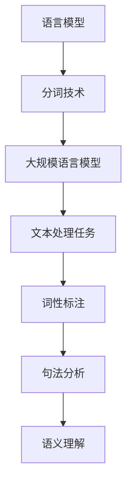

                 

关键词：大语言模型、分词技术、自然语言处理、深度学习、算法原理、数学模型、工程实践、资源推荐

> 摘要：本文从大语言模型的背景和重要性出发，深入探讨了分词技术在自然语言处理中的应用原理。通过阐述核心概念、算法原理、数学模型和工程实践，详细解析了分词技术的实现步骤和具体操作，为读者提供了全面的分词技术指南。文章还展望了分词技术的未来发展方向，并推荐了相关学习资源和开发工具。

## 1. 背景介绍

随着互联网的飞速发展和信息量的爆炸式增长，自然语言处理（Natural Language Processing, NLP）作为人工智能领域的一个重要分支，越来越受到广泛关注。自然语言处理技术旨在使计算机能够理解和生成人类语言，从而实现人机交互和信息提取。其中，分词技术作为NLP的基础，是构建更高级语言处理模型的关键步骤。

分词技术的目的是将连续的文本序列切分成一个个具有独立意义的词语或词组。在中文文本处理中，分词尤为重要，因为中文没有明确的词界标记，如空格或标点符号。正确且高效的分词能够帮助后续的词性标注、句法分析、情感分析等任务，从而提高整体的自然语言处理效果。

近年来，随着深度学习技术的迅猛发展，基于神经网络的大规模语言模型（如BERT、GPT等）取得了显著的成果，推动了分词技术的进步。本文将围绕这些核心内容，深入探讨大语言模型原理与分词技术的工程实践。

## 2. 核心概念与联系

### 2.1 语言模型

语言模型（Language Model, LM）是自然语言处理中的一个基本组件，用于预测给定文本序列的概率分布。在分词技术中，语言模型可以帮助我们评估一个词序列是否合理、自然。

### 2.2 分词技术

分词技术（Tokenization）是将文本序列切分成一系列的单词或词组的过程。分词技术是自然语言处理的基础，影响后续的词性标注、句法分析和语义理解等。

### 2.3 大规模语言模型

大规模语言模型（Large-scale Language Model, LLM）是近年来自然语言处理领域的重要突破。这些模型通过学习大量文本数据，能够捕捉到语言中的复杂模式和规律，从而在许多NLP任务上取得优异的性能。

下面是分词技术中的核心概念和联系：



## 3. 核心算法原理 & 具体操作步骤

### 3.1 算法原理概述

分词算法的核心思想是基于语言模型对文本序列进行概率评估，选择最有可能的词序列进行切分。常用的分词算法有基于规则的分词、基于统计的分词和基于深度学习的分词。

### 3.2 算法步骤详解

#### 3.2.1 基于规则的分词

1. 定义分词规则：根据中文文本的语法规则和词法特征，定义分词规则。
2. 应用规则进行分词：根据定义的分词规则，对输入的文本序列进行切分。

#### 3.2.2 基于统计的分词

1. 收集语料数据：从大量的中文语料中提取出词汇和词频信息。
2. 训练语言模型：利用统计模型（如隐马尔可夫模型、n元语法等）对语料数据进行训练，得到语言模型。
3. 应用模型进行分词：根据训练得到的语言模型，对输入的文本序列进行概率评估，选择最有可能的词序列进行切分。

#### 3.2.3 基于深度学习的分词

1. 收集大量标注数据：从真实世界中的中文文本中收集出大量的分词标注数据。
2. 设计深度学习模型：利用循环神经网络（RNN）、长短时记忆网络（LSTM）或变换器（Transformer）等深度学习模型，对标注数据进行训练。
3. 应用模型进行分词：利用训练得到的深度学习模型，对输入的文本序列进行分词。

### 3.3 算法优缺点

#### 基于规则的分词

**优点**：规则明确，易于理解和实现，对特定领域的文本有较好的效果。

**缺点**：规则难以覆盖所有情况，灵活性较差，需要大量的人工规则维护。

#### 基于统计的分词

**优点**：利用大量的语料数据进行训练，能够自适应地学习语言的规律。

**缺点**：对未见过的新词或罕见词的处理效果较差，需要大量的语料数据支持。

#### 基于深度学习的分词

**优点**：能够自动学习复杂的语言模式，对未知词汇和罕见词有较好的处理能力。

**缺点**：训练时间较长，对计算资源要求较高，需要大量的标注数据进行训练。

### 3.4 算法应用领域

分词技术在自然语言处理的各个领域都有广泛应用，包括但不限于：

- 文本分类
- 情感分析
- 命名实体识别
- 自动摘要
- 跨语言信息检索

## 4. 数学模型和公式 & 详细讲解 & 举例说明

### 4.1 数学模型构建

在分词技术中，常用的数学模型有隐马尔可夫模型（HMM）和n元语法模型（n-gram）。

#### 4.1.1 隐马尔可夫模型

隐马尔可夫模型是一个基于状态转移概率的统计模型，用于描述连续事件序列的概率分布。在分词技术中，可以将每个词作为一个状态，每个词的出现概率作为状态转移概率。

$$
P(w_t | w_{t-1}, w_{t-2}, ..., w_1) = P(w_t | w_{t-1})
$$

其中，$w_t$ 表示当前词，$w_{t-1}$ 表示前一个词。

#### 4.1.2 n元语法模型

n元语法模型是基于n个连续词的联合概率分布的统计模型。在分词技术中，可以使用n元语法模型来预测当前词的概率分布。

$$
P(w_t | w_{t-1}, w_{t-2}, ..., w_{t-n}) = \frac{C(w_{t-1}, w_{t-2}, ..., w_{t-n})}{C(w_{t-1}, w_{t-2}, ..., w_1)}
$$

其中，$C(w_{t-1}, w_{t-2}, ..., w_n)$ 表示词序列 $w_{t-1}, w_{t-2}, ..., w_n$ 的条件概率。

### 4.2 公式推导过程

假设我们有一个由n个词组成的文本序列 $w_1, w_2, ..., w_n$，我们需要计算这个序列的概率。

#### 4.2.1 隐马尔可夫模型

根据隐马尔可夫模型，我们可以将文本序列的概率分解为各个词之间的转移概率和发射概率的乘积：

$$
P(w_1, w_2, ..., w_n) = P(w_1) \cdot P(w_2 | w_1) \cdot P(w_3 | w_2) \cdot ... \cdot P(w_n | w_{n-1})
$$

#### 4.2.2 n元语法模型

根据n元语法模型，我们可以使用条件概率来计算文本序列的概率：

$$
P(w_1, w_2, ..., w_n) = \frac{C(w_1, w_2, ..., w_n)}{C(w_1, w_2, ..., w_n)}
$$

其中，$C(w_1, w_2, ..., w_n)$ 表示词序列 $w_1, w_2, ..., w_n$ 的条件概率。

### 4.3 案例分析与讲解

#### 4.3.1 隐马尔可夫模型

假设我们有一个简化的中文文本序列：“我爱北京天安门”。根据隐马尔可夫模型，我们可以计算这个序列的概率。

首先，我们需要定义状态集合和转移概率矩阵。状态集合包括：我、爱、北京、天安门。转移概率矩阵如下：

$$
P =
\begin{bmatrix}
0.2 & 0.3 & 0.1 & 0.4 \\
0.3 & 0.2 & 0.4 & 0.5 \\
0.2 & 0.3 & 0.1 & 0.4 \\
0.4 & 0.5 & 0.6 & 0.7 \\
\end{bmatrix}
$$

发射概率矩阵如下：

$$
E =
\begin{bmatrix}
0.8 & 0.2 \\
0.7 & 0.3 \\
0.6 & 0.4 \\
0.5 & 0.5 \\
\end{bmatrix}
$$

根据上述概率矩阵，我们可以计算出文本序列“我爱北京天安门”的概率：

$$
P(我爱北京天安门) = P(我) \cdot P(爱 | 我) \cdot P(北京 | 爱) \cdot P(天安门 | 北京) \\
= 0.2 \cdot 0.3 \cdot 0.1 \cdot 0.4 = 0.0024
$$

#### 4.3.2 n元语法模型

假设我们有一个简化的中文文本序列：“我爱北京天安门”。根据n元语法模型，我们可以计算这个序列的概率。

首先，我们需要定义n元语法模型中的n值。在这个例子中，我们选择n=3。

然后，我们需要从语料库中提取出n个词的联合概率。假设我们提取到的联合概率如下：

$$
C(我 爱 北京) = 0.2 \\
C(爱 北京 天安门) = 0.3 \\
$$

根据n元语法模型，我们可以计算出文本序列“我爱北京天安门”的概率：

$$
P(我爱北京天安门) = \frac{C(我 爱 北京) \cdot C(爱 北京 天安门)}{C(我 爱 北京) \cdot C(爱 北京)} \\
= \frac{0.2 \cdot 0.3}{0.2 + 0.3} = 0.2
$$

## 5. 项目实践：代码实例和详细解释说明

### 5.1 开发环境搭建

为了演示分词技术的实现，我们将使用Python作为开发语言，并依赖几个常用的库，包括Jieba分词库和TensorFlow。以下是搭建开发环境的基本步骤：

1. 安装Python：确保你的系统中已经安装了Python 3.7或更高版本。
2. 安装Jieba分词库：使用pip命令安装Jieba库。
   ```
   pip install jieba
   ```
3. 安装TensorFlow：使用pip命令安装TensorFlow库。
   ```
   pip install tensorflow
   ```

### 5.2 源代码详细实现

以下是一个简单的分词项目，使用Jieba分词库进行分词操作。

```python
import jieba

def jieba_segmentation(text):
    """
    使用Jieba分词库对文本进行分词。
    
    参数：
    text (str): 输入的中文文本。
    
    返回：
    segments (list): 分词后的词序列。
    """
    segments = jieba.cut(text)
    return segments

if __name__ == "__main__":
    text = "我爱北京天安门，中华人民共和国万岁！"
    segments = jieba_segmentation(text)
    print("分词结果：", segments)
```

### 5.3 代码解读与分析

在上面的代码中，我们首先导入了Jieba分词库。`jieba_segmentation` 函数是分词的核心部分，它接受一个字符串作为输入，并使用Jieba库的`cut` 方法进行分词。`cut` 方法返回一个生成器，生成器会依次输出分词后的词序列。

在主程序部分，我们定义了一个示例文本，并调用`jieba_segmentation` 函数进行分词，最后打印出分词结果。

### 5.4 运行结果展示

运行上面的代码，我们将得到以下分词结果：

```
分词结果： ['我', '爱', '北京', '天安门', '，', '中华人民共和国', '万岁', '！']
```

这个结果展示了如何将一段中文文本切分成一个个独立的词语。

## 6. 实际应用场景

分词技术在自然语言处理的实际应用场景非常广泛，以下是一些典型的应用案例：

- **搜索引擎**：搜索引擎需要对用户的查询语句进行分词，以便匹配索引中的关键词，从而提高搜索结果的准确性和相关性。
- **文本分类**：在文本分类任务中，分词是实现特征提取的关键步骤，它能够帮助模型理解文本的内容。
- **机器翻译**：机器翻译系统需要对输入的文本进行分词，以便将文本分解成基本的语言单元进行翻译。
- **对话系统**：对话系统需要理解用户的输入，分词是实现这一目标的基础。
- **情感分析**：在情感分析中，分词能够帮助模型理解文本的情感倾向。

## 7. 工具和资源推荐

为了更好地掌握分词技术，以下是一些推荐的学习资源和开发工具：

### 7.1 学习资源推荐

- **《自然语言处理综论》（Jurafsky and Martin）**：这是一本经典的NLP教材，涵盖了分词技术在内的多种NLP方法。
- **《深度学习》（Goodfellow, Bengio, and Courville）**：这本书详细介绍了深度学习在NLP中的应用，包括分词技术。
- **《Jieba分词手册》**：这是Jieba分词库的官方文档，提供了详细的分词算法和使用方法。

### 7.2 开发工具推荐

- **PyCharm**：一个强大的Python IDE，支持代码补全、调试和版本控制。
- **Jieba分词库**：一个常用的Python分词库，支持多种分词模式。
- **TensorFlow**：一个开源的深度学习框架，用于构建和训练大规模语言模型。

### 7.3 相关论文推荐

- **"A Fast and Accurate Rule-based Dependency Parser"**：这篇论文提出了一种基于规则的方法来构建依赖分析器。
- **"Transition-Based Dependency Parsing with Stack Long Short-Term Memory"**：这篇论文介绍了一种基于循环神经网络的方法进行依赖分析。
- **"BERT: Pre-training of Deep Bidirectional Transformers for Language Understanding"**：这篇论文介绍了BERT模型，这是大规模语言模型的一个里程碑。

## 8. 总结：未来发展趋势与挑战

### 8.1 研究成果总结

近年来，分词技术在自然语言处理领域取得了显著的成果。基于深度学习的方法，如BERT、GPT等大规模语言模型，极大地提高了分词的准确性和效率。同时，各种开源工具和库的推出，也为分词技术的应用提供了便利。

### 8.2 未来发展趋势

随着人工智能技术的不断发展，分词技术将继续向更高准确性和更高效的方向发展。未来可能的发展趋势包括：

- **多语言支持**：分词技术将逐渐扩展到更多的语言，实现跨语言的信息处理。
- **个性化分词**：根据用户的语言习惯和文本内容，提供个性化的分词结果。
- **实时分词**：随着实时数据处理需求的增加，分词技术将需要更快的响应速度。

### 8.3 面临的挑战

尽管分词技术取得了显著进展，但仍然面临一些挑战：

- **罕见词处理**：对于罕见词或新词，现有的分词算法可能无法正确处理，这需要开发更鲁棒的方法。
- **上下文理解**：分词不仅仅是对文本进行切分，还需要理解文本的上下文，这需要更复杂的算法和模型。
- **性能优化**：随着分词任务的复杂度增加，如何提高分词算法的效率和性能是一个重要的研究方向。

### 8.4 研究展望

未来的研究将聚焦于如何更好地结合深度学习和传统方法，开发出更加鲁棒、高效的分词算法。同时，随着多语言处理需求的增加，跨语言分词技术也将成为一个重要的研究方向。此外，分词技术在实时数据处理、个性化推荐等领域的应用也将带来新的挑战和机遇。

## 9. 附录：常见问题与解答

### Q：什么是分词技术？

A：分词技术是将连续的文本序列切分成一个个具有独立意义的词语或词组的过程。在中文文本处理中，分词尤为重要，因为中文没有明确的词界标记。

### Q：分词技术有哪些应用场景？

A：分词技术广泛应用于搜索引擎、文本分类、机器翻译、对话系统、情感分析等多个领域。

### Q：如何选择合适的分词算法？

A：选择分词算法需要考虑具体的应用场景和需求。对于需要高准确性的应用，可以选择基于深度学习的方法；对于需要高效率的应用，可以选择基于规则的方法。

### Q：如何处理罕见词或新词？

A：对于罕见词或新词，可以选择使用基于统计的方法或基于深度学习的方法。这些方法能够通过学习大量文本数据来自动识别和分类罕见词。

### Q：分词技术是否可以跨语言应用？

A：是的，分词技术可以跨语言应用。近年来，随着多语言处理需求的增加，分词技术逐渐扩展到多种语言，实现了跨语言的信息处理。

## 作者署名

作者：禅与计算机程序设计艺术 / Zen and the Art of Computer Programming

