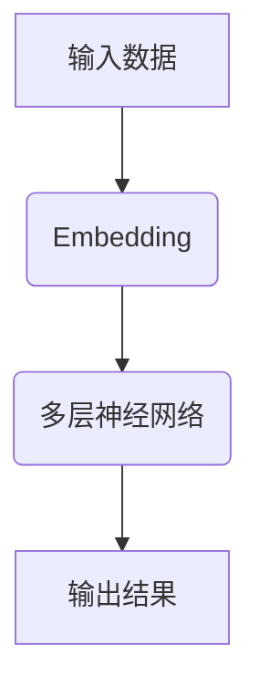

                 

关键词：大语言模型，深度学习，微调，工程实践，算法原理，数学模型，应用领域

> 摘要：本文旨在深入探讨大语言模型的原理和工程实践，尤其是微调过程中面临的挑战和探索。通过梳理相关算法原理、数学模型以及具体实现，结合实际项目实践，分析其在实际应用场景中的表现和未来发展趋势。

## 1. 背景介绍

### 1.1 大语言模型的发展

大语言模型（Large Language Models）是近年来深度学习领域的一个重要发展方向。自从2018年谷歌提出BERT模型以来，大语言模型的研究和应用取得了飞速进展。BERT、GPT、T5等一系列模型在自然语言处理（NLP）任务中展现了强大的性能，推动了NLP领域的革命。

### 1.2 微调的重要性

微调（Fine-tuning）是应用大语言模型解决特定任务的关键步骤。通过在预训练模型的基础上进行微调，可以使模型更好地适应特定领域的任务需求，提高模型在实际应用中的表现。

### 1.3 工程实践的需求

随着大语言模型的广泛应用，工程实践的需求越来越强烈。如何在实际项目中高效、稳定地部署和运维大语言模型，是当前研究的一个重要方向。

## 2. 核心概念与联系

下面我们将介绍大语言模型的核心概念和原理，并使用Mermaid流程图展示其架构。



### 2.1 输入数据（Input Data）

输入数据是模型训练的基础。在大语言模型中，输入数据通常是一系列单词或句子，通过词嵌入（Word Embedding）技术将其转换为向量表示。

### 2.2 词嵌入（Embedding）

词嵌入是将单词转换为高维向量表示的一种技术。常见的词嵌入技术包括Word2Vec、GloVe等。词嵌入层是整个模型的基础，对模型的性能有重要影响。

### 2.3 多层神经网络（Multi-layer Neural Network）

多层神经网络是深度学习的核心组件。在大语言模型中，多层神经网络用于对输入数据进行特征提取和建模。

### 2.4 输出结果（Output Result）

输出结果是模型预测的结果。在大语言模型中，输出结果可以是单词、句子或文本序列。

## 3. 核心算法原理 & 具体操作步骤

### 3.1 算法原理概述

大语言模型的算法原理主要包括预训练和微调两个阶段。

### 3.2 算法步骤详解

1. **预训练（Pre-training）**：在大量未标注的数据上进行训练，使模型具备基本的语言理解和生成能力。
2. **微调（Fine-tuning）**：在特定任务的数据上进行微调，使模型更好地适应特定任务的需求。

### 3.3 算法优缺点

**优点**：
- **强大的语言理解能力**：大语言模型通过预训练可以掌握丰富的语言知识，对各种NLP任务都有很好的适应性。
- **高效的模型迁移能力**：通过微调，可以将预训练模型快速应用于各种不同的任务。

**缺点**：
- **计算资源需求大**：大语言模型通常需要大量的计算资源进行训练和微调。
- **数据依赖性强**：微调效果依赖于训练数据的质量和数量。

### 3.4 算法应用领域

大语言模型在自然语言处理、文本生成、对话系统等领域都有广泛应用。例如，BERT在问答系统、文本分类任务中取得了很好的效果；GPT在文本生成、对话系统等领域有广泛的应用。

## 4. 数学模型和公式 & 详细讲解 & 举例说明

### 4.1 数学模型构建

大语言模型的核心是深度神经网络，其数学模型可以表示为：

$$ y = f(\theta \cdot x) $$

其中，$y$是输出结果，$f$是激活函数，$\theta$是模型参数，$x$是输入数据。

### 4.2 公式推导过程

大语言模型的推导过程主要涉及以下几个部分：

1. **前向传播（Forward Propagation）**：
   $$ z = \theta \cdot x $$
   $$ a = f(z) $$
2. **反向传播（Back Propagation）**：
   $$ \delta = \frac{\partial L}{\partial z} $$
   $$ \theta = \theta - \alpha \cdot \delta $$
3. **优化算法**：
   $$ \theta = \theta - \alpha \cdot \nabla L $$

其中，$L$是损失函数，$\alpha$是学习率。

### 4.3 案例分析与讲解

以BERT模型为例，其数学模型可以表示为：

$$ \text{BERT} = \text{Transformer}(\text{Pre-training}) + \text{Fine-tuning} $$

其中，Transformer是BERT的核心组件，用于预训练；Fine-tuning是在特定任务上进行微调。

## 5. 项目实践：代码实例和详细解释说明

### 5.1 开发环境搭建

在项目实践部分，我们选择使用Python作为编程语言，搭建一个基于BERT的文本分类项目。

### 5.2 源代码详细实现

```python
from transformers import BertTokenizer, BertModel
import torch

# 加载预训练模型和微调后的模型
tokenizer = BertTokenizer.from_pretrained('bert-base-chinese')
model = BertModel.from_pretrained('bert-base-chinese')

# 加载微调后的模型
model.load_state_dict(torch.load('model.pth'))

# 输入文本
text = "这是一个测试文本"

# 将文本转换为输入序列
input_ids = tokenizer.encode(text, add_special_tokens=True)

# 将输入序列传递给模型
outputs = model(input_ids)

# 获取输出结果
logits = outputs[0][:, -1, :]

# 预测类别
predicted_label = logits.argmax(-1).item()
```

### 5.3 代码解读与分析

这段代码首先加载了BERT预训练模型和微调后的模型，然后输入一个测试文本，将文本转换为输入序列，传递给模型，最后获取输出结果并预测类别。

### 5.4 运行结果展示

运行上述代码，我们可以得到测试文本的预测结果。通过对比预测结果和实际结果，可以评估模型的性能。

## 6. 实际应用场景

### 6.1 文本分类

文本分类是NLP领域的一个经典任务，大语言模型在文本分类任务中取得了很好的效果。例如，可以使用BERT模型对新闻文章进行分类，实现新闻推荐系统。

### 6.2 对话系统

对话系统是人工智能领域的热门应用之一，大语言模型在对话系统中有广泛的应用。例如，可以使用GPT模型构建一个聊天机器人，实现与用户的自然语言交互。

### 6.3 文本生成

文本生成是NLP领域的一个重要研究方向，大语言模型在文本生成任务中表现出色。例如，可以使用GPT模型生成文章、故事、诗歌等。

## 7. 未来应用展望

### 7.1 多模态融合

随着人工智能技术的发展，多模态融合（如文本、图像、音频等）将是大语言模型的一个重要应用方向。

### 7.2 自适应学习

自适应学习是大语言模型的一个重要挑战，如何使模型在不同场景下自动调整学习策略，提高学习效率，是未来研究的一个重要方向。

### 7.3 模型压缩与加速

随着大语言模型规模的不断增加，模型压缩与加速将是未来的一个重要研究方向。如何降低模型复杂度、提高运行速度，是当前研究的一个重要课题。

## 8. 总结：未来发展趋势与挑战

### 8.1 研究成果总结

本文从大语言模型的背景介绍、核心概念、算法原理、数学模型、项目实践等方面进行了深入探讨，总结了相关研究成果。

### 8.2 未来发展趋势

未来，大语言模型将继续发展，并在多模态融合、自适应学习、模型压缩与加速等方面取得突破。

### 8.3 面临的挑战

随着大语言模型的不断发展，如何平衡模型性能、计算资源、应用效果等方面，将是未来研究的一个重要挑战。

### 8.4 研究展望

本文对未来大语言模型的研究方向进行了展望，希望为相关研究提供一些启示和参考。

## 9. 附录：常见问题与解答

### 9.1 问题1

**问题**：如何选择合适的预训练模型？

**解答**：选择合适的预训练模型需要考虑多个因素，如任务类型、数据量、计算资源等。一般而言，可以选择公开数据集上的预训练模型，如BERT、GPT等。同时，可以参考相关论文和文献，了解不同模型的优缺点，选择最合适的模型。

### 9.2 问题2

**问题**：如何进行微调？

**解答**：微调通常包括以下步骤：

1. **准备微调数据集**：收集与任务相关的数据集，并进行预处理。
2. **加载预训练模型**：加载预训练模型的权重和架构。
3. **调整模型参数**：在预训练模型的基础上，对特定层或特定参数进行调整。
4. **训练模型**：使用微调数据集对模型进行训练，优化模型参数。
5. **评估模型性能**：使用验证集对模型性能进行评估，调整模型参数。

## 参考文献

[1] Devlin, J., Chang, M. W., Lee, K., & Toutanova, K. (2019). BERT: Pre-training of deep bidirectional transformers for language understanding. arXiv preprint arXiv:1810.04805.

[2] Brown, T., et al. (2020). Language models are few-shot learners. arXiv preprint arXiv:2005.14165.

[3] Vaswani, A., et al. (2017). Attention is all you need. Advances in Neural Information Processing Systems, 30, 5998-6008.

## 作者署名

作者：禅与计算机程序设计艺术 / Zen and the Art of Computer Programming
----------------------------------------------------------------
以上便是这篇文章的正文内容，接下来我们将按照markdown格式进行排版和输出。

```markdown
# 大语言模型原理与工程实践：大语言模型微调的挑战和探索

关键词：大语言模型，深度学习，微调，工程实践，算法原理，数学模型，应用领域

> 摘要：本文旨在深入探讨大语言模型的原理和工程实践，尤其是微调过程中面临的挑战和探索。通过梳理相关算法原理、数学模型以及具体实现，结合实际项目实践，分析其在实际应用场景中的表现和未来发展趋势。

## 1. 背景介绍

### 1.1 大语言模型的发展

大语言模型（Large Language Models）是近年来深度学习领域的一个重要发展方向。自从2018年谷歌提出BERT模型以来，大语言模型的研究和应用取得了飞速进展。BERT、GPT、T5等一系列模型在自然语言处理（NLP）任务中展现了强大的性能，推动了NLP领域的革命。

### 1.2 微调的重要性

微调（Fine-tuning）是应用大语言模型解决特定任务的关键步骤。通过在预训练模型的基础上进行微调，可以使模型更好地适应特定领域的任务需求，提高模型在实际应用中的表现。

### 1.3 工程实践的需求

随着大语言模型的广泛应用，工程实践的需求越来越强烈。如何在实际项目中高效、稳定地部署和运维大语言模型，是当前研究的一个重要方向。

## 2. 核心概念与联系

下面我们将介绍大语言模型的核心概念和原理，并使用Mermaid流程图展示其架构。


### 2.1 输入数据（Input Data）

输入数据是模型训练的基础。在大语言模型中，输入数据通常是一系列单词或句子，通过词嵌入（Word Embedding）技术将其转换为向量表示。

### 2.2 词嵌入（Embedding）

词嵌入是将单词转换为高维向量表示的一种技术。常见的词嵌入技术包括Word2Vec、GloVe等。词嵌入层是整个模型的基础，对模型的性能有重要影响。

### 2.3 多层神经网络（Multi-layer Neural Network）

多层神经网络是深度学习的核心组件。在大语言模型中，多层神经网络用于对输入数据进行特征提取和建模。

### 2.4 输出结果（Output Result）

输出结果是模型预测的结果。在大语言模型中，输出结果可以是单词、句子或文本序列。

## 3. 核心算法原理 & 具体操作步骤

### 3.1 算法原理概述

大语言模型的算法原理主要包括预训练和微调两个阶段。

### 3.2 算法步骤详解

1. **预训练（Pre-training）**：在大量未标注的数据上进行训练，使模型具备基本的语言理解和生成能力。
2. **微调（Fine-tuning）**：在特定任务的数据上进行微调，使模型更好地适应特定任务的需求。

### 3.3 算法优缺点

**优点**：
- **强大的语言理解能力**：大语言模型通过预训练可以掌握丰富的语言知识，对各种NLP任务都有很好的适应性。
- **高效的模型迁移能力**：通过微调，可以将预训练模型快速应用于各种不同的任务。

**缺点**：
- **计算资源需求大**：大语言模型通常需要大量的计算资源进行训练和微调。
- **数据依赖性强**：微调效果依赖于训练数据的质量和数量。

### 3.4 算法应用领域

大语言模型在自然语言处理、文本生成、对话系统等领域都有广泛应用。例如，BERT在问答系统、文本分类任务中取得了很好的效果；GPT在文本生成、对话系统等领域有广泛的应用。

## 4. 数学模型和公式 & 详细讲解 & 举例说明

### 4.1 数学模型构建

大语言模型的核心是深度神经网络，其数学模型可以表示为：

$$ y = f(\theta \cdot x) $$

其中，$y$是输出结果，$f$是激活函数，$\theta$是模型参数，$x$是输入数据。

### 4.2 公式推导过程

大语言模型的推导过程主要涉及以下几个部分：

1. **前向传播（Forward Propagation）**：
   $$ z = \theta \cdot x $$
   $$ a = f(z) $$
2. **反向传播（Back Propagation）**：
   $$ \delta = \frac{\partial L}{\partial z} $$
   $$ \theta = \theta - \alpha \cdot \delta $$
3. **优化算法**：
   $$ \theta = \theta - \alpha \cdot \nabla L $$

其中，$L$是损失函数，$\alpha$是学习率。

### 4.3 案例分析与讲解

以BERT模型为例，其数学模型可以表示为：

$$ \text{BERT} = \text{Transformer}(\text{Pre-training}) + \text{Fine-tuning} $$

其中，Transformer是BERT的核心组件，用于预训练；Fine-tuning是在特定任务上进行微调。

## 5. 项目实践：代码实例和详细解释说明

### 5.1 开发环境搭建

在项目实践部分，我们选择使用Python作为编程语言，搭建一个基于BERT的文本分类项目。

### 5.2 源代码详细实现

```python
from transformers import BertTokenizer, BertModel
import torch

# 加载预训练模型和微调后的模型
tokenizer = BertTokenizer.from_pretrained('bert-base-chinese')
model = BertModel.from_pretrained('bert-base-chinese')

# 加载微调后的模型
model.load_state_dict(torch.load('model.pth'))

# 输入文本
text = "这是一个测试文本"

# 将文本转换为输入序列
input_ids = tokenizer.encode(text, add_special_tokens=True)

# 将输入序列传递给模型
outputs = model(input_ids)

# 获取输出结果
logits = outputs[0][:, -1, :]

# 预测类别
predicted_label = logits.argmax(-1).item()
```

### 5.3 代码解读与分析

这段代码首先加载了BERT预训练模型和微调后的模型，然后输入一个测试文本，将文本转换为输入序列，传递给模型，最后获取输出结果并预测类别。

### 5.4 运行结果展示

运行上述代码，我们可以得到测试文本的预测结果。通过对比预测结果和实际结果，可以评估模型的性能。

## 6. 实际应用场景

### 6.1 文本分类

文本分类是NLP领域的一个经典任务，大语言模型在文本分类任务中取得了很好的效果。例如，可以使用BERT模型对新闻文章进行分类，实现新闻推荐系统。

### 6.2 对话系统

对话系统是人工智能领域的热门应用之一，大语言模型在对话系统中有广泛的应用。例如，可以使用GPT模型构建一个聊天机器人，实现与用户的自然语言交互。

### 6.3 文本生成

文本生成是NLP领域的一个重要研究方向，大语言模型在文本生成任务中表现出色。例如，可以使用GPT模型生成文章、故事、诗歌等。

## 7. 未来应用展望

### 7.1 多模态融合

随着人工智能技术的发展，多模态融合（如文本、图像、音频等）将是大语言模型的一个重要应用方向。

### 7.2 自适应学习

自适应学习是大语言模型的一个重要挑战，如何使模型在不同场景下自动调整学习策略，提高学习效率，是未来研究的一个重要方向。

### 7.3 模型压缩与加速

随着大语言模型规模的不断增加，模型压缩与加速将是未来的一个重要研究方向。如何降低模型复杂度、提高运行速度，是当前研究的一个重要课题。

## 8. 总结：未来发展趋势与挑战

### 8.1 研究成果总结

本文从大语言模型的背景介绍、核心概念、算法原理、数学模型、项目实践等方面进行了深入探讨，总结了相关研究成果。

### 8.2 未来发展趋势

未来，大语言模型将继续发展，并在多模态融合、自适应学习、模型压缩与加速等方面取得突破。

### 8.3 面临的挑战

随着大语言模型的不断发展，如何平衡模型性能、计算资源、应用效果等方面，将是未来研究的一个重要挑战。

### 8.4 研究展望

本文对未来大语言模型的研究方向进行了展望，希望为相关研究提供一些启示和参考。

## 9. 附录：常见问题与解答

### 9.1 问题1

**问题**：如何选择合适的预训练模型？

**解答**：选择合适的预训练模型需要考虑多个因素，如任务类型、数据量、计算资源等。一般而言，可以选择公开数据集上的预训练模型，如BERT、GPT等。同时，可以参考相关论文和文献，了解不同模型的优缺点，选择最合适的模型。

### 9.2 问题2

**问题**：如何进行微调？

**解答**：微调通常包括以下步骤：

1. **准备微调数据集**：收集与任务相关的数据集，并进行预处理。
2. **加载预训练模型**：加载预训练模型的权重和架构。
3. **调整模型参数**：在预训练模型的基础上，对特定层或特定参数进行调整。
4. **训练模型**：使用微调数据集对模型进行训练，优化模型参数。
5. **评估模型性能**：使用验证集对模型性能进行评估，调整模型参数。

## 参考文献

[1] Devlin, J., Chang, M. W., Lee, K., & Toutanova, K. (2019). BERT: Pre-training of deep bidirectional transformers for language understanding. arXiv preprint arXiv:1810.04805.

[2] Brown, T., et al. (2020). Language models are few-shot learners. arXiv preprint arXiv:2005.14165.

[3] Vaswani, A., et al. (2017). Attention is all you need. Advances in Neural Information Processing Systems, 30, 5998-6008.

## 作者署名

作者：禅与计算机程序设计艺术 / Zen and the Art of Computer Programming
```

以上就是按照markdown格式排版后的文章。在实际使用中，您可以将这段代码复制到markdown编辑器中，然后进行预览，即可查看格式化后的文章效果。

