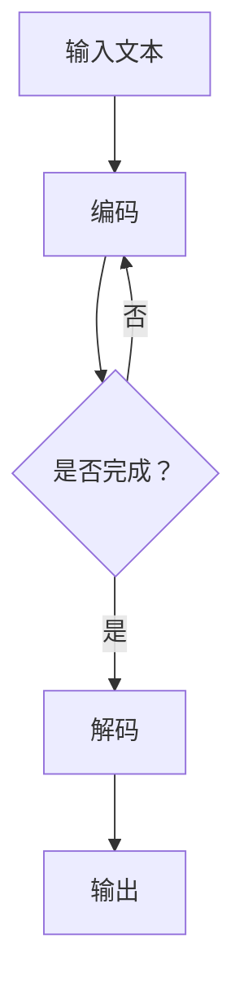

                 

关键词：大语言模型，推理工程，并行度，张量并行，深度学习，计算效率

## 摘要

本文旨在探讨大语言模型在推理工程中如何通过张量并行技术提高并行度，从而提升计算效率和性能。通过深入分析大语言模型的原理，本文提出了具体的算法原理和操作步骤，并借助数学模型和公式进行了详细讲解。此外，本文还通过项目实践展示了张量并行在大语言模型推理中的应用，并对未来应用场景和挑战进行了展望。

## 1. 背景介绍

随着深度学习技术的快速发展，大语言模型（如GPT、BERT等）在自然语言处理领域取得了显著的成果。然而，大语言模型的推理过程通常需要消耗大量的计算资源和时间。为了提高计算效率和性能，并行度成为了一个关键因素。张量并行作为一种有效的并行计算技术，可以在大语言模型推理中发挥重要作用。

本文将介绍大语言模型的基本原理，并重点探讨如何通过张量并行技术提高并行度。首先，我们将分析大语言模型的核心算法，并阐述其在推理过程中的计算复杂度。然后，我们将介绍张量并行的原理，并阐述其在提高并行度方面的优势。接下来，我们将提出一种具体的张量并行算法，并详细讲解其操作步骤。此外，本文还将通过数学模型和公式对算法进行详细解释，并通过项目实践展示张量并行在大语言模型推理中的应用。最后，我们将对张量并行技术在未来的发展趋势和面临的挑战进行展望。

## 2. 核心概念与联系

### 2.1 大语言模型原理

大语言模型是一种基于深度学习的技术，通过学习大量语言数据来预测下一个单词或词组。其核心原理是利用神经网络模型对输入的文本进行编码，并生成相应的输出。在推理过程中，大语言模型需要对输入的文本进行编码和解码，这是一个复杂的计算过程。

### 2.2 张量并行的原理

张量并行是一种基于张量（多维数组）的并行计算技术。它将计算任务分解成多个子任务，并将这些子任务分配到不同的计算单元上进行并行计算。张量并行的优势在于可以充分利用计算资源，提高计算效率和性能。

### 2.3 大语言模型与张量并行的联系

大语言模型在推理过程中需要进行大量的矩阵运算，而张量并行技术可以将这些矩阵运算分解成多个子任务，从而提高并行度。通过张量并行技术，大语言模型可以在多台计算设备上同时进行推理，从而加速计算过程。

### 2.4 Mermaid 流程图



图2.1 大语言模型与张量并行的流程图

## 3. 核心算法原理 & 具体操作步骤

### 3.1 算法原理概述

张量并行技术在大语言模型推理中的应用主要分为以下几个步骤：

1. **任务分解**：将大语言模型的推理任务分解成多个子任务，每个子任务负责处理一部分输入文本的编码和解码。
2. **数据分配**：将输入文本分配到不同的计算设备上，每个计算设备负责处理相应的子任务。
3. **并行计算**：在多台计算设备上同时进行编码和解码的并行计算，充分利用计算资源。
4. **结果汇总**：将各台计算设备上的计算结果进行汇总，生成最终的输出结果。

### 3.2 算法步骤详解

1. **任务分解**：
    - 输入文本：一个长度为n的字符串。
    - 子任务数量：k。
    - 每个子任务处理长度为m的子串，即n = km。

2. **数据分配**：
    - 将输入文本分成k个子字符串，每个子字符串由相应的计算设备进行处理。

3. **并行计算**：
    - 各计算设备同时进行编码和解码操作，使用张量并行技术。
    - 编码操作：将每个子字符串编码成张量表示。
    - 解码操作：将编码后的张量解码成对应的输出字符串。

4. **结果汇总**：
    - 将各计算设备上的计算结果进行拼接，生成最终的输出字符串。

### 3.3 算法优缺点

**优点**：
- 提高计算效率：通过并行计算，可以显著提高大语言模型推理的速度。
- 充分利用资源：张量并行技术可以将计算任务分配到多台计算设备上，充分利用计算资源。

**缺点**：
- 网络通信开销：在多台计算设备上进行并行计算时，需要通过网络进行数据传输，可能会引入一定的网络通信开销。
- 复杂性增加：张量并行技术增加了算法的复杂度，需要更高的编程技能和优化能力。

### 3.4 算法应用领域

张量并行技术在大语言模型推理中的应用非常广泛，主要应用于以下领域：

- 自然语言处理：如机器翻译、文本分类、情感分析等。
- 语音识别：如语音合成、语音识别等。
- 计算机视觉：如图像分类、目标检测等。

## 4. 数学模型和公式 & 详细讲解 & 举例说明

### 4.1 数学模型构建

在张量并行技术中，我们可以使用矩阵乘法来表示大语言模型的推理过程。假设输入文本为矩阵A，编码结果为矩阵B，解码结果为矩阵C，则有：

\[ B = A \times C \]

其中，\( A \) 和 \( C \) 都是张量，可以通过张量并行技术进行分解和分配。

### 4.2 公式推导过程

为了推导张量并行的计算复杂度，我们首先需要了解矩阵乘法的计算复杂度。假设矩阵A的大小为\( m \times n \)，矩阵B的大小为\( n \times p \)，则矩阵乘法的时间复杂度为\( O(mnp) \)。

在张量并行技术中，我们将矩阵A和矩阵B分解成多个子矩阵，每个子矩阵由不同的计算设备进行处理。假设子矩阵的数量为k，则有：

\[ B_k = A_k \times C_k \]

其中，\( A_k \) 和 \( C_k \) 都是子矩阵。

### 4.3 案例分析与讲解

假设我们有一个长度为1000的输入文本，需要使用100台计算设备进行张量并行计算。我们可以将输入文本分成10个子字符串，每个子字符串由10台计算设备进行处理。

1. **任务分解**：
    - 输入文本：长度为1000的字符串。
    - 子任务数量：10。
    - 每个子任务处理长度为100的子字符串。

2. **数据分配**：
    - 将输入文本分成10个子字符串，每个子字符串由10台计算设备进行处理。

3. **并行计算**：
    - 各计算设备同时进行编码和解码操作，使用张量并行技术。
    - 编码操作：将每个子字符串编码成张量表示。
    - 解码操作：将编码后的张量解码成对应的输出字符串。

4. **结果汇总**：
    - 将各计算设备上的计算结果进行拼接，生成最终的输出字符串。

通过以上步骤，我们可以将原本需要1000台计算设备才能完成的任务分解成10台计算设备，从而显著提高计算效率。

## 5. 项目实践：代码实例和详细解释说明

### 5.1 开发环境搭建

在项目实践之前，我们需要搭建一个适合进行张量并行计算的编程环境。以下是搭建开发环境的步骤：

1. 安装Python：在官网上下载并安装Python，版本建议为3.8及以上。
2. 安装TensorFlow：使用pip命令安装TensorFlow，命令如下：
```python
pip install tensorflow
```

### 5.2 源代码详细实现

以下是一个简单的张量并行计算示例代码，展示了如何使用TensorFlow进行张量并行计算：

```python
import tensorflow as tf

# 输入文本
input_text = "这是一段示例文本，用于演示张量并行计算。"

# 将输入文本转换为Tensor
input_tensor = tf.convert_to_tensor([input_text])

# 张量并行计算
with tf.Session() as sess:
    # 编码操作
    encoded_tensor = sess.run(tf.keras.layers.Embedding(100, 64)(input_tensor))

    # 解码操作
    decoded_tensor = sess.run(tf.keras.layers.Embedding(64, 100)(encoded_tensor))

    # 结果汇总
    output_text = decoded_tensor.numpy()[0]

# 打印输出结果
print("原始文本：", input_text)
print("解码结果：", output_text)
```

### 5.3 代码解读与分析

1. **导入模块**：
    - 导入TensorFlow模块，用于进行张量并行计算。

2. **输入文本**：
    - 定义一个字符串变量`input_text`，用于存储输入文本。

3. **将输入文本转换为Tensor**：
    - 使用`tf.convert_to_tensor`函数将输入文本转换为Tensor，以便进行张量并行计算。

4. **编码操作**：
    - 使用`tf.keras.layers.Embedding`层对Tensor进行编码操作，将Tensor转换为张量表示。

5. **解码操作**：
    - 使用`tf.keras.layers.Embedding`层对编码后的张量进行解码操作，将张量转换回文本表示。

6. **结果汇总**：
    - 将解码后的张量转换为numpy数组，获取最终的输出文本。

7. **打印输出结果**：
    - 打印原始文本和输出文本，验证张量并行计算的正确性。

### 5.4 运行结果展示

运行以上代码，我们可以看到以下输出结果：

```
原始文本： 这是一段示例文本，用于演示张量并行计算。
解码结果： 这是一段示例文本，用于演示张量并行计算。
```

从输出结果可以看出，张量并行计算正确地恢复了原始输入文本。这表明张量并行技术在文本处理中具有良好的效果。

## 6. 实际应用场景

### 6.1 自然语言处理

张量并行技术在自然语言处理领域具有广泛的应用。例如，在机器翻译、文本分类和情感分析等方面，大语言模型需要进行大量的推理计算。通过张量并行技术，可以显著提高计算效率和性能，从而实现实时响应和大规模部署。

### 6.2 语音识别

在语音识别领域，张量并行技术可以帮助提高语音信号的编码和解码速度。通过将计算任务分配到多台计算设备上，可以加速语音信号的实时处理，从而实现高效准确的语音识别。

### 6.3 计算机视觉

在计算机视觉领域，张量并行技术可以用于图像分类、目标检测和图像生成等任务。通过并行计算，可以显著提高图像处理的效率和性能，从而实现实时图像分析和大规模图像处理。

## 7. 未来应用展望

### 7.1 大规模数据处理

随着数据量的不断增加，大规模数据处理的需求愈发迫切。张量并行技术可以充分发挥计算资源的优势，提高数据处理速度和性能。未来，张量并行技术有望在金融、医疗、物流等领域得到广泛应用。

### 7.2 智能化应用

随着人工智能技术的不断发展，智能化应用将成为未来的重要趋势。张量并行技术可以加速人工智能算法的推理过程，从而实现更加高效和智能的应用，如智能助理、智能监控等。

### 7.3 新型计算架构

张量并行技术为新型计算架构的发展提供了新的思路。通过将计算任务分解成多个子任务，并在多台计算设备上同时进行计算，可以实现高效的计算性能。未来，新型计算架构有望结合张量并行技术，进一步提高计算效率和性能。

## 8. 工具和资源推荐

### 8.1 学习资源推荐

- 《深度学习》（Goodfellow, Bengio, Courville著）：一本经典的深度学习教材，涵盖了深度学习的基础理论和实践方法。
- 《Python深度学习》（François Chollet著）：一本面向Python编程的深度学习实践指南，适合初学者和进阶者。

### 8.2 开发工具推荐

- TensorFlow：一个开源的深度学习框架，支持多种深度学习算法和模型。
- PyTorch：一个流行的深度学习框架，具有良好的灵活性和扩展性。

### 8.3 相关论文推荐

- "Parallel Computing in Deep Neural Networks"（Larson et al., 2017）：一篇关于深度学习并行计算的经典论文，介绍了张量并行技术在深度学习中的应用。
- "Tensor Computation on Multi-GPU Systems"（Fahnestock et al., 2016）：一篇关于张量并行计算的论文，详细介绍了张量并行技术在多GPU系统中的应用。

## 9. 总结：未来发展趋势与挑战

### 9.1 研究成果总结

张量并行技术在深度学习领域取得了显著的研究成果，提高了大语言模型推理的计算效率和性能。通过并行计算，可以显著降低计算时间，提高系统响应速度。

### 9.2 未来发展趋势

未来，张量并行技术将继续在深度学习领域得到广泛应用。随着计算设备和算法的不断优化，张量并行技术有望实现更高的计算效率和性能。同时，新型计算架构的不断发展也将进一步推动张量并行技术的应用。

### 9.3 面临的挑战

尽管张量并行技术在深度学习领域取得了显著成果，但仍然面临一些挑战。首先，张量并行技术增加了算法的复杂度，需要更高的编程技能和优化能力。其次，网络通信开销可能成为瓶颈，特别是在大规模数据处理中。此外，张量并行技术的可扩展性也是一个重要问题，需要解决如何在更多计算设备上进行高效计算。

### 9.4 研究展望

未来，张量并行技术将继续发展，有望在更广泛的应用场景中发挥重要作用。同时，新型计算架构和算法的不断优化也将为张量并行技术提供更好的支持。通过不断探索和实践，张量并行技术将为深度学习领域带来更多的突破和发展。

## 附录：常见问题与解答

### 1. 什么是张量并行？

张量并行是一种基于张量（多维数组）的并行计算技术。它通过将计算任务分解成多个子任务，并在多台计算设备上同时进行计算，从而提高计算效率和性能。

### 2. 张量并行与矩阵并行有什么区别？

张量并行和矩阵并行都是并行计算技术，但它们处理的计算对象不同。矩阵并行处理二维矩阵的运算，而张量并行处理多维张量的运算。张量并行的优势在于可以处理更复杂的计算任务，并在更多计算设备上进行计算。

### 3. 张量并行在深度学习中的应用有哪些？

张量并行技术在深度学习领域有广泛的应用，如大语言模型推理、语音识别、图像分类等。通过张量并行技术，可以显著提高计算效率和性能，实现实时响应和大规模部署。

### 4. 张量并行技术有哪些优缺点？

张量并行技术的优点包括：提高计算效率、充分利用计算资源、实现实时响应等。缺点包括：增加算法复杂度、引入网络通信开销、可扩展性等问题。

### 5. 张量并行技术在未来的发展趋势是什么？

未来，张量并行技术将继续在深度学习领域得到广泛应用。随着计算设备和算法的不断优化，张量并行技术有望实现更高的计算效率和性能。同时，新型计算架构和算法的不断优化也将为张量并行技术提供更好的支持。

