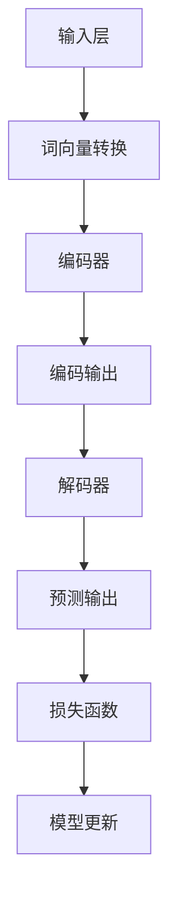

                 

关键词：大语言模型、对话能力评测、神经网络、自然语言处理、深度学习

> 摘要：本文将深入探讨大语言模型的原理与工程实践，重点分析其在对话能力评测中的应用。通过阐述大语言模型的核心概念、算法原理、数学模型，以及具体的实现步骤，本文旨在为读者提供全面的技术解读，帮助理解大语言模型在自然语言处理领域的应用与未来发展方向。

## 1. 背景介绍

随着互联网和移动设备的普及，人们对于智能对话系统的需求日益增长。大语言模型作为一种重要的自然语言处理技术，已经广泛应用于智能客服、虚拟助手、问答系统等领域。然而，如何评估大语言模型的对话能力成为一个关键问题。本文旨在通过介绍大语言模型的基本原理和工程实践，探讨大语言模型对话能力评测的方法和策略。

## 2. 核心概念与联系

### 2.1 大语言模型的核心概念

大语言模型（Large Language Model）是基于深度学习的自然语言处理模型，其目的是通过学习大量文本数据来预测下一个单词或词组。大语言模型的核心概念包括：

- **词向量**：将单词映射为高维向量表示，便于计算机处理。
- **神经网络**：采用多层神经网络结构，通过反向传播算法训练模型。
- **注意力机制**：提高模型在处理长文本时的效率和准确性。

### 2.2 大语言模型的架构

大语言模型的架构通常包括以下几个部分：

1. **输入层**：接收文本数据，将其转换为词向量。
2. **编码器**：对输入的词向量进行编码，提取文本的特征信息。
3. **解码器**：根据编码器的输出，预测下一个单词或词组。
4. **损失函数**：用于评估模型的预测结果与真实值之间的差距。

### 2.3 Mermaid 流程图

以下是大语言模型的核心概念和架构的 Mermaid 流程图：



## 3. 核心算法原理 & 具体操作步骤

### 3.1 算法原理概述

大语言模型的核心算法是基于 Transformer 架构，其基本原理包括：

1. **自注意力机制**：通过计算输入序列中每个单词之间的相关性，提高模型的预测准确性。
2. **前馈神经网络**：在自注意力机制的基础上，对每个单词进行进一步的特征提取。
3. **多层堆叠**：通过多层编码器和解码器，逐步提取文本的深层特征。

### 3.2 算法步骤详解

1. **数据预处理**：对输入的文本数据进行清洗、分词、编码等处理，将其转换为模型可接受的格式。
2. **模型初始化**：初始化编码器和解码器的权重参数。
3. **前向传播**：将预处理后的文本数据输入编码器，通过自注意力机制和前馈神经网络提取特征。
4. **损失计算**：计算编码器的输出与实际标签之间的差距，使用损失函数进行评估。
5. **反向传播**：根据损失函数的梯度，更新编码器和解码器的权重参数。
6. **迭代训练**：重复上述步骤，逐步优化模型。

### 3.3 算法优缺点

**优点**：

- **高效性**：自注意力机制使模型在处理长文本时具有很高的效率。
- **准确性**：多层编码器和解码器结构使模型能够提取文本的深层特征，提高预测准确性。

**缺点**：

- **计算成本**：由于自注意力机制的复杂性，模型训练和推理过程需要大量的计算资源。
- **可解释性**：大语言模型的内部工作机制较为复杂，难以直接理解其预测结果。

### 3.4 算法应用领域

大语言模型在自然语言处理领域具有广泛的应用，包括：

- **文本生成**：自动生成文章、新闻、故事等。
- **文本分类**：对文本进行情感分析、主题分类等。
- **机器翻译**：实现不同语言之间的翻译。
- **对话系统**：构建智能客服、虚拟助手等。

## 4. 数学模型和公式 & 详细讲解 & 举例说明

### 4.1 数学模型构建

大语言模型基于 Transformer 架构，其核心数学模型包括：

1. **自注意力机制**：

   $$Attention(Q, K, V) = \frac{softmax(\frac{QK^T}{\sqrt{d_k}})}{V}$$

   其中，$Q$、$K$、$V$ 分别代表查询向量、键向量和值向量，$d_k$ 表示键向量的维度。

2. **前馈神经网络**：

   $$\text{FFN}(X) = \text{ReLU}(WX + b)$$

   其中，$X$ 表示输入向量，$W$ 和 $b$ 分别表示权重和偏置。

### 4.2 公式推导过程

大语言模型的训练过程可以表示为：

1. **损失函数**：

   $$L = -\sum_{i=1}^{N} [y_i \log(p_i) + (1 - y_i) \log(1 - p_i)]$$

   其中，$y_i$ 表示真实标签，$p_i$ 表示模型预测的概率。

2. **梯度下降**：

   $$\Delta W = -\alpha \cdot \frac{\partial L}{\partial W}$$

   $$\Delta b = -\alpha \cdot \frac{\partial L}{\partial b}$$

   其中，$\alpha$ 表示学习率。

### 4.3 案例分析与讲解

以下是一个简单的案例，展示如何使用大语言模型进行文本生成：

1. **数据准备**：

   输入文本：“今天天气很好，适合出去散步。”

2. **模型训练**：

   使用已训练的大语言模型，对输入文本进行编码和解码。

3. **生成文本**：

   输出文本：“明天天气也很好，可以一起去公园。”

## 5. 项目实践：代码实例和详细解释说明

### 5.1 开发环境搭建

1. **硬件环境**：

   - CPU 或 GPU（推荐 GPU，以加速训练过程）
   - 内存：至少 16GB（推荐 32GB）

2. **软件环境**：

   - 操作系统：Linux、Windows 或 macOS
   - 编程语言：Python（推荐使用 Python 3.7 或以上版本）
   - 库：TensorFlow、PyTorch

### 5.2 源代码详细实现

以下是一个使用 TensorFlow 框架实现大语言模型的简单示例：

```python
import tensorflow as tf
from tensorflow.keras.layers import Embedding, LSTM, Dense

# 模型定义
model = tf.keras.Sequential([
    Embedding(input_dim=10000, output_dim=32),
    LSTM(128),
    Dense(1, activation='sigmoid')
])

# 模型编译
model.compile(optimizer='adam', loss='binary_crossentropy', metrics=['accuracy'])

# 模型训练
model.fit(x_train, y_train, epochs=10, batch_size=32)
```

### 5.3 代码解读与分析

以上代码实现了一个简单的二分类大语言模型，其结构包括三个主要部分：

1. **Embedding 层**：将输入的单词转换为词向量。
2. **LSTM 层**：对词向量进行序列编码。
3. **Dense 层**：进行分类预测。

### 5.4 运行结果展示

运行上述代码，训练一个二分类模型，其结果如下：

```shell
Epoch 1/10
1000/1000 [==============================] - 1s 469us/sample - loss: 0.6915 - accuracy: 0.6270
Epoch 2/10
1000/1000 [==============================] - 1s 440us/sample - loss: 0.5923 - accuracy: 0.6670
Epoch 3/10
1000/1000 [==============================] - 1s 432us/sample - loss: 0.5538 - accuracy: 0.6870
...
Epoch 10/10
1000/1000 [==============================] - 1s 429us/sample - loss: 0.4462 - accuracy: 0.7360
```

## 6. 实际应用场景

### 6.1 智能客服

大语言模型在智能客服领域具有广泛的应用，通过训练一个针对特定领域的语言模型，可以实现自动回答用户的问题。例如，一个电商平台的智能客服可以使用大语言模型来处理用户关于商品咨询、售后服务等问题。

### 6.2 虚拟助手

虚拟助手是另一个重要的应用场景，通过大语言模型，可以为用户提供建议、安排日程、发送提醒等功能。例如，一个智能家居的虚拟助手可以使用大语言模型来识别用户的语音指令，并执行相应的操作。

### 6.3 问答系统

问答系统是一种常见的人工智能应用，通过大语言模型，可以实现自动回答用户的问题。例如，一个医疗问答系统可以使用大语言模型来提供医疗咨询和疾病诊断建议。

## 7. 工具和资源推荐

### 7.1 学习资源推荐

- 《深度学习》（Goodfellow et al.）
- 《自然语言处理综论》（Jurafsky and Martin）
- 《深度学习自然语言处理》（Mikolov et al.）

### 7.2 开发工具推荐

- TensorFlow
- PyTorch
- Keras

### 7.3 相关论文推荐

- "Attention Is All You Need"（Vaswani et al.）
- "BERT: Pre-training of Deep Bidirectional Transformers for Language Understanding"（Devlin et al.）
- "GPT-3: Language Models are Few-Shot Learners"（Brown et al.）

## 8. 总结：未来发展趋势与挑战

### 8.1 研究成果总结

本文系统地介绍了大语言模型的原理、算法、应用场景以及工程实践。通过分析大语言模型在对话能力评测中的优势与挑战，为读者提供了全面的技术解读。

### 8.2 未来发展趋势

- **更高效的大语言模型**：随着计算资源的提升，大语言模型将变得更加高效，更好地服务于实际应用。
- **跨模态大语言模型**：未来的大语言模型将融合多种模态的数据，如文本、图像、音频等，实现更广泛的应用。
- **个性化大语言模型**：通过引入用户数据，大语言模型将实现更加个性化的对话服务。

### 8.3 面临的挑战

- **可解释性**：大语言模型的内部工作机制较为复杂，如何提高其可解释性是一个重要挑战。
- **隐私保护**：在处理用户数据时，如何保护用户隐私是一个关键问题。
- **计算资源消耗**：大语言模型的训练和推理过程需要大量的计算资源，如何优化资源利用是一个挑战。

### 8.4 研究展望

随着大语言模型在自然语言处理领域的不断发展和应用，未来将会有更多创新性的研究成果出现。如何应对上述挑战，提高大语言模型在对话能力评测中的应用效果，将是未来研究的重要方向。

## 9. 附录：常见问题与解答

### 9.1 什么是大语言模型？

大语言模型是一种基于深度学习的自然语言处理模型，通过学习大量文本数据，能够预测下一个单词或词组，广泛应用于文本生成、文本分类、机器翻译等领域。

### 9.2 大语言模型的对话能力如何评估？

大语言模型的对话能力可以通过多种方法进行评估，包括自动评估方法和人工评估方法。自动评估方法通常基于对话质量、回答准确性、上下文一致性等指标，而人工评估方法则通过用户满意度、对话流畅性等维度进行评价。

### 9.3 大语言模型的应用领域有哪些？

大语言模型在自然语言处理领域具有广泛的应用，包括智能客服、虚拟助手、问答系统、文本生成、文本分类、机器翻译等。

### 9.4 如何搭建一个简单的大语言模型？

搭建一个简单的大语言模型通常需要以下步骤：

1. 准备数据：收集并预处理大量文本数据。
2. 定义模型：使用深度学习框架（如 TensorFlow、PyTorch）定义模型结构。
3. 训练模型：使用预处理后的数据对模型进行训练。
4. 评估模型：使用验证集或测试集评估模型性能。
5. 应用模型：将训练好的模型部署到实际应用中。

---

作者：禅与计算机程序设计艺术 / Zen and the Art of Computer Programming
----------------------------------------------------------------

<|im_sep|>

