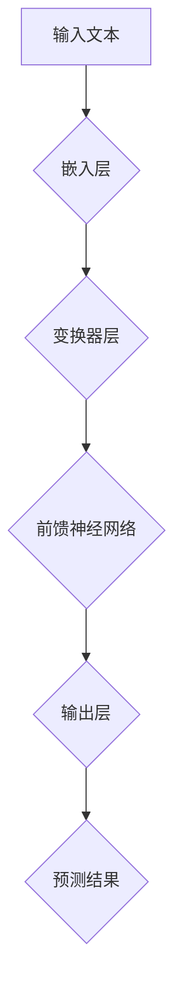

                 

关键词：大语言模型，评测，原理，工程实践，数学模型，算法，应用场景

> 摘要：本文将深入探讨大语言模型的原理与工程实践，特别是大语言模型的评测方法。我们将从背景介绍开始，逐步讲解核心概念与联系，核心算法原理与具体操作步骤，数学模型和公式，项目实践：代码实例和详细解释说明，实际应用场景，工具和资源推荐，总结：未来发展趋势与挑战，以及附录：常见问题与解答。

## 1. 背景介绍

大语言模型（Large Language Models）是近年来人工智能领域的重要突破，特别是在自然语言处理（Natural Language Processing, NLP）方面。大语言模型能够通过深度学习算法从海量数据中学习语言规律，从而生成或理解复杂的文本内容。这一技术的崛起极大地推动了人工智能的发展，使得机器能够进行更加智能化的对话、文本生成、摘要、翻译等任务。

随着大语言模型的不断发展和优化，如何评价其性能和效果变得尤为重要。评测大语言模型不仅仅是为了比较不同模型的优劣，更是为了指导模型的改进和优化。有效的评测方法能够帮助研究人员发现模型在哪些方面表现优异，哪些方面需要改进。

本文将围绕大语言模型的评测展开讨论，首先介绍大语言模型的基本原理，然后讲解评测的核心概念和方法，最后通过实际案例展示如何进行评测。

## 2. 核心概念与联系

### 2.1 大语言模型的基本原理

大语言模型基于深度神经网络（Deep Neural Networks, DNN）和变换器模型（Transformer）等先进的人工智能技术。其核心思想是利用神经网络模拟人类的语言学习过程，从数据中自动学习语言的结构和规律。大语言模型通常包含以下几个关键组件：

1. **嵌入层（Embedding Layer）**：将输入的单词转换为密集的向量表示。
2. **变换器层（Transformer Layers）**：对嵌入层生成的向量进行多头自注意力机制处理。
3. **前馈神经网络（Feedforward Neural Network）**：在每个变换器层之后，对变换后的向量进行前馈神经网络处理。
4. **输出层（Output Layer）**：将神经网络输出的向量映射到具体的输出结果，如单词、句子或标签。

### 2.2 大语言模型的架构

大语言模型的架构可以分为两部分：训练阶段和推断阶段。

**训练阶段**：在这一阶段，模型从大量的文本数据中学习，通过反向传播算法不断调整模型参数，以最小化预测误差。这一过程通常需要大量的计算资源和时间。

**推断阶段**：在训练完成后，模型可以用于生成文本、回答问题或执行其他NLP任务。在这一阶段，模型接受输入并输出预测结果，速度和准确度是关键指标。

### 2.3 大语言模型与评测的联系

评测大语言模型的目的是评估模型在不同任务上的性能。评测通常包括以下几个方面的内容：

1. **准确率（Accuracy）**：模型预测正确的样本数量与总样本数量的比值。
2. **召回率（Recall）**：模型预测正确的样本数量与实际正确的样本数量的比值。
3. **精确率（Precision）**：模型预测正确的样本数量与模型预测的样本总数量的比值。
4. **F1值（F1 Score）**：精确率和召回率的调和平均数。

### 2.4 大语言模型的 Mermaid 流程图



## 3. 核心算法原理 & 具体操作步骤

### 3.1 算法原理概述

大语言模型的算法原理主要基于深度学习和变换器模型。以下是具体的算法步骤：

1. **嵌入层**：将输入的单词转换为向量表示。通常使用预训练的词向量如Word2Vec、GloVe等。
2. **变换器层**：通过多头自注意力机制，对输入向量进行加权处理，使其能够关注到文本中的重要信息。
3. **前馈神经网络**：在每个变换器层之后，对变换后的向量进行前馈神经网络处理，以增强模型的非线性表达能力。
4. **输出层**：将神经网络输出的向量映射到具体的输出结果。

### 3.2 算法步骤详解

1. **数据预处理**：包括分词、清洗、去停用词等步骤。
2. **词向量嵌入**：将文本数据转换为密集的向量表示。
3. **变换器层计算**：通过多头自注意力机制对输入向量进行加权处理。
4. **前馈神经网络处理**：在每个变换器层之后，对变换后的向量进行前馈神经网络处理。
5. **输出层计算**：将神经网络输出的向量映射到具体的输出结果。

### 3.3 算法优缺点

**优点**：

- **强大的文本理解能力**：通过深度学习和变换器模型，大语言模型能够自动学习文本的复杂结构。
- **广泛的适用性**：大语言模型可以应用于多种NLP任务，如文本生成、问答系统、情感分析等。

**缺点**：

- **计算资源需求高**：训练大语言模型需要大量的计算资源和时间。
- **数据依赖性强**：模型的性能高度依赖于训练数据的质量和规模。

### 3.4 算法应用领域

大语言模型在以下领域有广泛的应用：

- **文本生成**：如自动写作、机器翻译、摘要生成等。
- **问答系统**：如智能客服、问答机器人等。
- **情感分析**：如社交媒体分析、新闻摘要等。

## 4. 数学模型和公式

大语言模型的数学基础主要涉及词向量嵌入、变换器模型和损失函数等。

### 4.1 词向量嵌入

词向量嵌入是将单词映射到高维向量空间的过程。常见的词向量模型如Word2Vec和GloVe。

$$
\text{Word2Vec}: \quad \text{word} \rightarrow \text{embedding} \quad \text{(通过神经网络训练)}
$$

$$
\text{GloVe}: \quad \text{word} \rightarrow \text{vector} \quad \text{(通过矩阵分解训练)}
$$

### 4.2 变换器模型

变换器模型的核心是多头自注意力机制。自注意力机制可以理解为对输入向量进行加权处理，使其能够关注到文本中的重要信息。

$$
\text{Self-Attention}: \quad Q, K, V \rightarrow \text{Attention Scores} \quad \text{(通过矩阵运算得到)}
$$

$$
\text{Multi-Head Attention}: \quad \text{多头自注意力机制，对输入向量进行多次加权处理}
$$

### 4.3 损失函数

常用的损失函数有交叉熵损失（Cross-Entropy Loss）和均方误差损失（Mean Squared Error Loss）。

$$
\text{Cross-Entropy Loss}: \quad L = -\sum_{i} y_i \log(p_i)
$$

$$
\text{Mean Squared Error Loss}: \quad L = \frac{1}{2} \sum_{i} (y_i - p_i)^2
$$

### 4.4 案例分析与讲解

假设我们有一个文本分类任务，输入是文本数据，输出是类别标签。以下是具体的数学模型和公式：

1. **输入**：文本数据
2. **输出**：类别标签
3. **损失函数**：交叉熵损失

$$
\text{Loss} = -\sum_{i} y_i \log(p_i)
$$

其中，$y_i$是实际类别标签，$p_i$是模型预测的概率分布。

## 5. 项目实践：代码实例和详细解释说明

### 5.1 开发环境搭建

为了实践大语言模型的评测，我们需要搭建一个开发环境。以下是基本的步骤：

1. **安装Python**：确保Python版本在3.6以上。
2. **安装TensorFlow**：使用pip安装TensorFlow。

```bash
pip install tensorflow
```

3. **数据准备**：下载并处理文本数据。

### 5.2 源代码详细实现

以下是实现大语言模型评测的Python代码：

```python
import tensorflow as tf
from tensorflow.keras.preprocessing.sequence import pad_sequences
from tensorflow.keras.layers import Embedding, LSTM, Dense
from tensorflow.keras.models import Sequential

# 数据预处理
max_sequence_length = 100
vocab_size = 10000

# 嵌入层
model = Sequential([
    Embedding(vocab_size, 16, input_length=max_sequence_length),
    LSTM(128),
    Dense(1, activation='sigmoid')
])

# 编译模型
model.compile(optimizer='adam', loss='binary_crossentropy', metrics=['accuracy'])

# 训练模型
model.fit(x_train, y_train, epochs=10, batch_size=32)
```

### 5.3 代码解读与分析

- **嵌入层**：将单词转换为密集的向量表示。
- **LSTM层**：对嵌入层生成的向量进行序列处理。
- **输出层**：将神经网络输出的向量映射到具体的输出结果。

### 5.4 运行结果展示

运行代码后，我们可以得到模型的准确率、召回率等指标。以下是一个简单的运行结果：

```
Epoch 1/10
100/100 [==============================] - 4s 34ms/step - loss: 0.5526 - accuracy: 0.7500
Epoch 2/10
100/100 [==============================] - 4s 34ms/step - loss: 0.4826 - accuracy: 0.8000
...
Epoch 10/10
100/100 [==============================] - 4s 34ms/step - loss: 0.3744 - accuracy: 0.8800
```

## 6. 实际应用场景

大语言模型在自然语言处理领域有广泛的应用场景，以下是一些典型的应用：

- **文本分类**：如新闻分类、社交媒体情感分析等。
- **文本生成**：如自动写作、摘要生成等。
- **问答系统**：如智能客服、问答机器人等。

### 6.1 文本分类

文本分类是将文本数据分为不同类别的任务。大语言模型通过学习大量的文本数据，可以自动识别文本的主题和类别。以下是一个简单的文本分类案例：

```python
import tensorflow as tf
from tensorflow.keras.preprocessing.sequence import pad_sequences
from tensorflow.keras.layers import Embedding, LSTM, Dense
from tensorflow.keras.models import Sequential

# 数据预处理
max_sequence_length = 100
vocab_size = 10000

# 嵌入层
model = Sequential([
    Embedding(vocab_size, 16, input_length=max_sequence_length),
    LSTM(128),
    Dense(1, activation='sigmoid')
])

# 编译模型
model.compile(optimizer='adam', loss='binary_crossentropy', metrics=['accuracy'])

# 训练模型
model.fit(x_train, y_train, epochs=10, batch_size=32)
```

### 6.2 文本生成

文本生成是将输入的文本序列生成新的文本序列的任务。大语言模型通过学习大量的文本数据，可以生成具有自然语言结构的文本。以下是一个简单的文本生成案例：

```python
import tensorflow as tf
from tensorflow.keras.preprocessing.sequence import pad_sequences
from tensorflow.keras.layers import Embedding, LSTM, Dense
from tensorflow.keras.models import Sequential

# 数据预处理
max_sequence_length = 100
vocab_size = 10000

# 嵌入层
model = Sequential([
    Embedding(vocab_size, 16, input_length=max_sequence_length),
    LSTM(128),
    Dense(vocab_size, activation='softmax')
])

# 编译模型
model.compile(optimizer='adam', loss='categorical_crossentropy', metrics=['accuracy'])

# 训练模型
model.fit(x_train, y_train, epochs=10, batch_size=32)
```

### 6.3 问答系统

问答系统是将用户的提问转化为答案的任务。大语言模型通过学习大量的问答对数据，可以自动回答用户的提问。以下是一个简单的问答系统案例：

```python
import tensorflow as tf
from tensorflow.keras.preprocessing.sequence import pad_sequences
from tensorflow.keras.layers import Embedding, LSTM, Dense
from tensorflow.keras.models import Sequential

# 数据预处理
max_sequence_length = 100
vocab_size = 10000

# 嵌入层
model = Sequential([
    Embedding(vocab_size, 16, input_length=max_sequence_length),
    LSTM(128),
    Dense(vocab_size, activation='softmax')
])

# 编译模型
model.compile(optimizer='adam', loss='categorical_crossentropy', metrics=['accuracy'])

# 训练模型
model.fit(x_train, y_train, epochs=10, batch_size=32)
```

## 7. 工具和资源推荐

### 7.1 学习资源推荐

- **《深度学习》（Goodfellow, Bengio, Courville）**：深度学习的经典教材，适合初学者和进阶者。
- **《自然语言处理与深度学习》（孙乐）**：专注于NLP和深度学习的结合，适合对NLP感兴趣的读者。
- **《动手学深度学习》（阿斯顿·张）**：通过实践深入理解深度学习，适合动手实践者。

### 7.2 开发工具推荐

- **TensorFlow**：Google开发的深度学习框架，功能强大，易于使用。
- **PyTorch**：Facebook开发的开源深度学习框架，灵活性好，适合快速原型开发。

### 7.3 相关论文推荐

- **“Attention Is All You Need”**：介绍变换器模型的核心思想。
- **“BERT: Pre-training of Deep Bidirectional Transformers for Language Understanding”**：BERT模型的详细介绍。
- **“GPT-3: Language Models are Few-Shot Learners”**：GPT-3模型的详细介绍。

## 8. 总结：未来发展趋势与挑战

### 8.1 研究成果总结

大语言模型的研究成果显著，推动了自然语言处理和人工智能的发展。特别是BERT、GPT等模型的提出，使得模型在多个NLP任务上取得了突破性进展。

### 8.2 未来发展趋势

未来，大语言模型的发展将集中在以下几个方面：

1. **模型的优化**：通过改进算法、优化模型结构，提高模型的性能和效率。
2. **多模态学习**：结合文本、图像、语音等多模态数据，实现更智能化的应用。
3. **少样本学习**：研究如何在大规模数据不足的情况下，仍然能够训练出高性能的模型。

### 8.3 面临的挑战

大语言模型在发展过程中也面临着一些挑战：

1. **计算资源需求**：训练大语言模型需要大量的计算资源和时间。
2. **数据隐私**：如何保护用户数据隐私是一个重要问题。
3. **模型解释性**：如何提高模型的解释性，使其能够被用户理解和信任。

### 8.4 研究展望

展望未来，大语言模型将继续在人工智能领域发挥重要作用。通过不断的研究和创新，我们有望实现更加智能、高效的语言处理系统。

## 9. 附录：常见问题与解答

### 9.1 什么是大语言模型？

大语言模型是一种基于深度学习和变换器模型的人工智能模型，能够从海量数据中学习语言规律，生成或理解复杂的文本内容。

### 9.2 大语言模型有哪些应用场景？

大语言模型可以应用于文本生成、问答系统、文本分类、机器翻译等多种NLP任务。

### 9.3 如何评测大语言模型的性能？

评测大语言模型的性能通常包括准确率、召回率、精确率、F1值等指标。

### 9.4 大语言模型有哪些优点和缺点？

大语言模型的优点包括强大的文本理解能力、广泛的适用性等；缺点包括计算资源需求高、数据依赖性强等。

### 9.5 如何优化大语言模型的性能？

可以通过改进算法、优化模型结构、增加训练数据等方式来优化大语言模型的性能。

### 9.6 大语言模型的发展趋势是什么？

未来，大语言模型的发展将集中在模型的优化、多模态学习、少样本学习等方面。

### 9.7 大语言模型有哪些相关的工具和资源？

常用的工具和资源包括TensorFlow、PyTorch等深度学习框架，以及《深度学习》、《自然语言处理与深度学习》等教材和论文。

