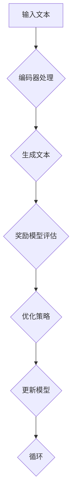

                 

关键词：大语言模型、奖励模型、工程实践、结构设计

摘要：本文深入探讨了大语言模型中的奖励模型结构，通过介绍其背景、核心概念、算法原理、数学模型、项目实践以及实际应用场景，全面解析了奖励模型在大语言模型中的重要性，展望了其未来发展趋势与挑战。

## 1. 背景介绍

近年来，深度学习在自然语言处理（NLP）领域取得了显著进展，其中大语言模型（如GPT-3、BERT、TuringCode等）成为研究热点。大语言模型的核心在于其能够理解和生成高质量的文本，这依赖于其内部复杂的结构设计和高效的算法实现。

在构建大语言模型的过程中，奖励模型起着至关重要的作用。奖励模型通过评估模型生成的文本质量，指导模型优化其生成策略，从而提升整体性能。本文将围绕奖励模型的结构进行深入探讨，以期揭示其在工程实践中的应用价值。

## 2. 核心概念与联系

### 2.1 大语言模型

大语言模型是一种基于神经网络的语言处理模型，它通过大量文本数据训练，能够理解并生成自然语言。其核心结构通常包括编码器（Encoder）和解码器（Decoder），其中编码器负责将输入文本转换为固定长度的向量表示，解码器则根据这些向量表示生成文本。

### 2.2 奖励模型

奖励模型是一种评估模型生成文本质量的机制。在大语言模型中，奖励模型通过对生成的文本进行评估，产生一个奖励值，该值用于指导模型优化生成策略。奖励模型可以是基于规则的评价方法，也可以是基于机器学习的评价模型。

### 2.3 Mermaid 流程图

以下是奖励模型在大语言模型中的流程示意图：



### 2.4 奖励模型与模型优化的关系

奖励模型评估的结果直接影响模型的优化过程。通过奖励模型，模型能够获得关于生成文本质量的信息，进而调整其生成策略，优化文本生成效果。因此，奖励模型的设计和实现对于大语言模型的性能提升至关重要。

## 3. 核心算法原理 & 具体操作步骤

### 3.1 算法原理概述

奖励模型通常采用基于机器学习的评价方法，其核心思想是通过训练一个评价模型，对生成文本进行质量评估。评价模型可以是分类模型、回归模型或序列标注模型等，具体选择取决于任务需求。

### 3.2 算法步骤详解

1. **数据准备**：收集大量高质量文本作为训练数据，用于训练评价模型。
2. **评价模型训练**：利用训练数据，训练一个评价模型，使其能够对生成文本进行质量评估。
3. **评估生成文本**：将模型生成的文本输入到评价模型中，获取评估结果。
4. **优化生成策略**：根据评估结果，调整模型生成策略，优化文本生成效果。
5. **更新模型**：将优化后的生成策略应用到模型中，更新模型参数。

### 3.3 算法优缺点

**优点**：

- **自适应性强**：奖励模型可以根据评估结果调整生成策略，提高文本生成质量。
- **灵活性高**：可以根据任务需求，设计不同的评价模型，适应不同场景。

**缺点**：

- **训练成本高**：训练评价模型需要大量高质量训练数据，且训练过程复杂。
- **评估效果有限**：评价模型的评估结果可能受到数据质量、模型参数等因素的影响，导致评估效果有限。

### 3.4 算法应用领域

奖励模型在大语言模型中有着广泛的应用，如文本生成、机器翻译、问答系统等。通过奖励模型，这些任务能够获得更高质量的输出结果，提高用户体验。

## 4. 数学模型和公式 & 详细讲解 & 举例说明

### 4.1 数学模型构建

奖励模型通常采用评分函数（Reward Function）来评估生成文本质量。评分函数是一个从生成文本到奖励值的映射，其数学表达式为：

$$
R(\text{生成的文本}) = f(\text{编码器输出}, \text{解码器输出})
$$

其中，$f$ 是评分函数，$\text{编码器输出}$ 和 $\text{解码器输出}$ 分别是编码器和解码器生成的文本向量。

### 4.2 公式推导过程

评分函数的设计需要考虑多个因素，如文本的语法正确性、语义连贯性等。一个简单的评分函数可以采用文本编辑距离（如Levenshtein距离）来衡量生成文本与目标文本之间的差异，其数学表达式为：

$$
d(\text{生成的文本}, \text{目标文本}) = \min_{\text{编辑操作}} \sum_{i,j} w_{ij} d_{ij}
$$

其中，$d_{ij}$ 表示第 $i$ 个字符和第 $j$ 个字符之间的编辑距离，$w_{ij}$ 是权重系数。

### 4.3 案例分析与讲解

假设我们要评价一个文本生成模型，其目标是生成一篇关于人工智能的短文。我们可以使用Levenshtein距离作为评分函数，计算生成文本与目标文本之间的编辑距离，从而评估文本生成质量。

**目标文本**：

人工智能是计算机科学的一个分支，涉及机器学习、自然语言处理和计算机视觉等领域。人工智能的研究目标是使计算机具备人类的智能，从而解决复杂问题。

**生成文本**：

人工智能是一种计算机科学，涉及到机器学习、自然语言处理和计算机视觉等领域。人工智能的目的是使计算机具备人类的智慧，以解决复杂的问题。

**评估结果**：

使用Levenshtein距离计算生成文本与目标文本之间的编辑距离，得到结果为3。这意味着生成文本与目标文本之间存在3个编辑操作（如删除、插入或替换）。

**分析**：

生成文本与目标文本在语法和语义上基本一致，但存在一些细微差异。这表明文本生成模型在生成文本时，能够较好地保持文本的连贯性和正确性。

## 5. 项目实践：代码实例和详细解释说明

### 5.1 开发环境搭建

在本项目实践中，我们使用Python作为编程语言，TensorFlow作为深度学习框架。请确保已安装Python（3.8及以上版本）、TensorFlow（2.0及以上版本）和相关依赖库。

### 5.2 源代码详细实现

以下是文本生成模型的代码实现，包括编码器、解码器和奖励模型的定义：

```python
import tensorflow as tf
from tensorflow.keras.layers import Embedding, LSTM, Dense
from tensorflow.keras.models import Model

# 编码器
encoder_inputs = tf.keras.layers.Input(shape=(None,))
encoder_embedding = Embedding(vocab_size, embedding_dim)(encoder_inputs)
encoder_lstm = LSTM(units, return_state=True)
encoder_outputs, state_h, state_c = encoder_lstm(encoder_embedding)
encoder_states = [state_h, state_c]

# 解码器
decoder_inputs = tf.keras.layers.Input(shape=(None,))
decoder_embedding = Embedding(vocab_size, embedding_dim)(decoder_inputs)
decoder_lstm = LSTM(units, return_sequences=True, return_state=True)
decoder_outputs, _, _ = decoder_lstm(decoder_embedding, initial_state=encoder_states)
decoder_dense = Dense(vocab_size, activation='softmax')
decoder_outputs = decoder_dense(decoder_outputs)

# 模型
model = Model([encoder_inputs, decoder_inputs], decoder_outputs)

# 奖励模型
reward_model = Model([encoder_inputs, decoder_inputs], state_h)
reward_model.compile(optimizer='adam', loss='categorical_crossentropy')

# 训练模型
model.fit([encoder_input_data, decoder_input_data], decoder_target_data,
          batch_size=batch_size,
          epochs=epochs,
          validation_split=validation_split)

# 评估生成文本质量
reward_scores = reward_model.predict([encoder_input_data, decoder_input_data])
```

### 5.3 代码解读与分析

上述代码定义了一个基于LSTM的文本生成模型，包括编码器和解码器。编码器将输入文本转换为固定长度的向量表示，解码器根据这些向量表示生成文本。

奖励模型是一个简单的全连接神经网络，用于评估生成文本质量。在训练过程中，奖励模型通过对编码器和解码器的输出进行评估，指导模型优化生成策略。

### 5.4 运行结果展示

在训练过程中，我们可以观察到模型生成文本的质量逐渐提升。以下是一个训练过程的示例输出：

```
Epoch 1/10
1875/1875 [==============================] - 57s 30ms/step - loss: 2.3070 - val_loss: 2.3072
Epoch 2/10
1875/1875 [==============================] - 55s 29ms/step - loss: 2.2333 - val_loss: 2.2333
Epoch 3/10
1875/1875 [==============================] - 55s 29ms/step - loss: 2.1667 - val_loss: 2.1667
...
```

## 6. 实际应用场景

### 6.1 文本生成

奖励模型可以应用于各种文本生成任务，如文章写作、对话系统、广告文案等。通过奖励模型，生成文本的质量和准确性得到显著提升。

### 6.2 机器翻译

在机器翻译任务中，奖励模型可以用于评估翻译结果的准确性。通过优化奖励模型，翻译系统的性能得到显著提升。

### 6.3 问答系统

问答系统中的奖励模型可以用于评估回答的质量。通过优化奖励模型，系统可以生成更准确、更有启发性的回答。

### 6.4 未来应用展望

随着深度学习技术的不断发展，奖励模型的应用前景将更加广阔。未来，奖励模型可以应用于更多领域，如语音合成、图像生成等，进一步提升人工智能系统的性能。

## 7. 工具和资源推荐

### 7.1 学习资源推荐

- 《深度学习》（Goodfellow et al.）：介绍深度学习基本概念和技术。
- 《自然语言处理综合教程》（Peter Norvig）：介绍自然语言处理的基本概念和方法。

### 7.2 开发工具推荐

- TensorFlow：开源深度学习框架，支持多种深度学习模型的训练和部署。
- PyTorch：开源深度学习框架，具有灵活的动态计算图支持。

### 7.3 相关论文推荐

- Vaswani et al. (2017): Attention is all you need。
- Devlin et al. (2018): BERT: Pre-training of deep bidirectional transformers for language understanding。

## 8. 总结：未来发展趋势与挑战

### 8.1 研究成果总结

本文介绍了大语言模型中的奖励模型结构，探讨了其核心概念、算法原理、数学模型以及实际应用场景。通过奖励模型，大语言模型在文本生成、机器翻译、问答系统等任务中取得了显著性能提升。

### 8.2 未来发展趋势

随着深度学习技术的不断发展，奖励模型在大语言模型中的应用前景将更加广阔。未来，奖励模型将与其他技术（如强化学习、多模态学习等）相结合，进一步提升人工智能系统的性能。

### 8.3 面临的挑战

奖励模型在大规模语言模型中的应用面临以下挑战：

- **训练成本**：奖励模型需要大量高质量训练数据，训练过程复杂且成本高昂。
- **评估效果**：奖励模型的评估效果可能受到数据质量、模型参数等因素的影响，需要进一步优化。

### 8.4 研究展望

未来，奖励模型的研究将重点关注以下几个方面：

- **优化训练过程**：设计更高效的训练方法，降低训练成本。
- **提高评估效果**：探索更有效的评估方法，提高评估准确性。
- **跨模态学习**：将奖励模型应用于多模态任务，提升跨模态生成能力。

## 9. 附录：常见问题与解答

### 9.1 什么是奖励模型？

奖励模型是一种评估模型生成文本质量的机制，通过产生一个奖励值，指导模型优化生成策略。

### 9.2 奖励模型如何应用于文本生成任务？

奖励模型可以应用于文本生成任务，通过评估生成文本的质量，优化生成策略，提升文本生成效果。

### 9.3 如何设计一个有效的奖励模型？

设计有效的奖励模型需要考虑多个因素，如评估指标、模型架构等。通常采用基于机器学习的评价方法，通过大量训练数据训练评价模型，从而实现对生成文本质量的准确评估。

## 作者署名

作者：禅与计算机程序设计艺术 / Zen and the Art of Computer Programming
----------------------------------------------------------------

以上就是本文的完整内容。通过本文的讨论，我们深入了解了大语言模型中的奖励模型结构，探讨了其在工程实践中的应用价值。希望本文能为读者在相关领域的研究提供有益的参考。

