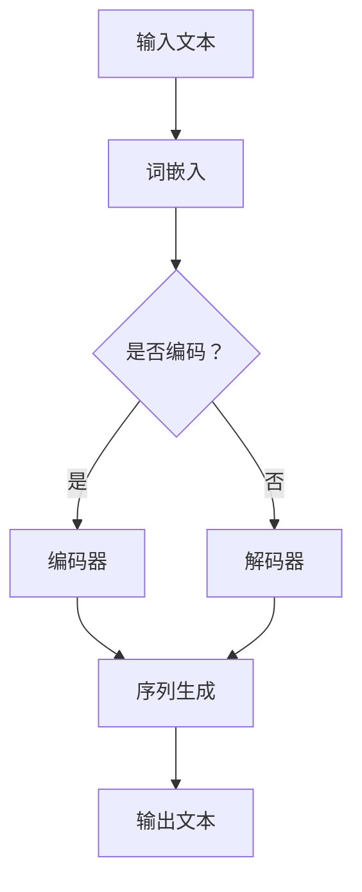

                 

关键词：大语言模型，工程实践，提示词设计，深度学习，神经网络，序列生成，优化方法，实际应用场景，未来展望

> 摘要：本文详细阐述了大语言模型的原理与工程实践，特别是提示词设计的重要性。通过对核心概念的深入剖析、算法原理的讲解以及数学模型的构建，本文为读者提供了一个全面的技术指南。同时，文章还通过项目实践展示了具体代码实现，探讨了实际应用场景，并对未来的发展趋势与挑战进行了深入分析。

## 1. 背景介绍

随着人工智能技术的不断发展，大语言模型已经成为自然语言处理（NLP）领域的研究热点。从最初的统计模型到深度学习时代的神经网络，再到如今的大语言模型，这一发展历程不仅反映了计算能力的提升，也展示了人工智能在理解、生成和交互自然语言方面取得的重大突破。

### 1.1 大语言模型的发展历程

大语言模型的发展可以追溯到20世纪50年代，当时的主要研究集中在构建统计模型，如N-gram模型和决策树模型。这些模型虽然能够在一定程度上处理自然语言，但面临着低效、理解能力受限等问题。

随着深度学习技术的兴起，神经网络在图像识别、语音识别等领域取得了显著成果，这激发了研究者将深度学习引入自然语言处理的领域。2018年，Google推出了BERT（Bidirectional Encoder Representations from Transformers），标志着大语言模型进入了一个新的时代。BERT采用了双向Transformer架构，能够在上下文中理解词语的含义，从而显著提升了NLP任务的性能。

随后，GPT（Generative Pre-trained Transformer）系列模型的出现进一步推动了大语言模型的发展。GPT-3的推出，更是以其前所未有的规模和强大的生成能力，引起了广泛关注。这些模型不仅在学术研究上取得了突破，也在实际应用中展现了巨大的潜力。

### 1.2 大语言模型的应用领域

大语言模型在多个领域都有广泛的应用，包括但不限于：

1. **自然语言理解（NLU）**：通过理解用户输入的意图和语义，实现智能客服、语音助手等功能。
2. **文本生成**：包括文章写作、摘要生成、对话系统等。
3. **机器翻译**：基于大型多语言语料库，实现高质量、流畅的翻译。
4. **信息提取**：从大量文本中提取关键信息，用于数据分析和决策。
5. **文本分类**：对文本进行分类，用于舆情监测、垃圾邮件过滤等。

这些应用不仅提升了工作效率，还改善了用户体验，使得人工智能在人们的日常生活中扮演着越来越重要的角色。

### 1.3 大语言模型的优势与挑战

大语言模型的优势在于其强大的理解和生成能力，能够处理复杂、多样化的语言任务。然而，这也带来了一些挑战，如计算资源的消耗、数据的安全性和隐私保护等。因此，在工程实践中，如何平衡模型性能与资源消耗，实现高效、安全的部署，成为了一个亟待解决的问题。

## 2. 核心概念与联系

要深入理解大语言模型，首先需要掌握其核心概念和架构。以下是一个基于Mermaid流程图的核心概念原理和架构的示意图：



### 2.1 词嵌入

词嵌入（Word Embedding）是将文本中的词语映射为固定长度的向量表示。这一步骤是自然语言处理的基础，有助于将文本转化为机器可以处理的数字形式。常见的词嵌入方法包括：

- **基于频率的方法**：如TF-IDF，通过词频和文档频率来计算词向量。
- **基于分布式表示的方法**：如Word2Vec，通过训练神经网络学习词向量。

### 2.2 编码器与解码器

编码器（Encoder）和解码器（Decoder）是Transformer模型的核心组成部分。编码器负责将输入序列编码为固定长度的向量表示，解码器则基于这些表示生成输出序列。

- **编码器**：通过多头自注意力机制（Multi-Head Self-Attention）和前馈神经网络（Feedforward Neural Network）处理输入序列，产生一个上下文表示。
- **解码器**：同样采用多头自注意力机制和前馈神经网络，将编码器的输出作为输入，逐步生成输出序列。

### 2.3 序列生成

序列生成（Sequence Generation）是Transformer模型的核心任务。通过自注意力机制，模型能够捕捉输入序列中的长距离依赖关系，从而生成高质量的输出序列。

### 2.4 输出文本

最终生成的文本（Output Text）是序列生成的结果。大语言模型在这一步骤中能够生成流畅、连贯的文本，从而实现各种自然语言处理任务。

## 3. 核心算法原理 & 具体操作步骤

### 3.1 算法原理概述

大语言模型的算法原理主要基于Transformer架构，这是一种基于自注意力机制（Self-Attention）的神经网络模型。自注意力机制允许模型在处理输入序列时，动态地考虑序列中每个词与其他词之间的关系，从而更好地捕捉上下文信息。

### 3.2 算法步骤详解

#### 3.2.1 输入处理

1. **词嵌入**：将输入文本中的词语映射为固定长度的向量表示。
2. **位置编码**：为每个词添加位置信息，以帮助模型理解词在序列中的相对位置。

#### 3.2.2 编码器处理

1. **多头自注意力机制**：将输入序列映射为多个不同的表示，并计算每个词与其他词之间的关联性。
2. **前馈神经网络**：对自注意力层的输出进行非线性变换。

#### 3.2.3 解码器处理

1. **多头自注意力机制**：解码器首先计算编码器输出和当前解码步骤输入的关联性。
2. **交叉自注意力机制**：将解码器输出与编码器输出进行关联，捕捉输入序列中的长距离依赖关系。
3. **前馈神经网络**：对自注意力层的输出进行非线性变换。

#### 3.2.4 序列生成

1. **解码**：解码器逐个生成输出序列中的词。
2. **损失计算**：计算生成序列与目标序列之间的损失，并利用梯度下降法优化模型参数。

### 3.3 算法优缺点

#### 优点：

- **强大的序列生成能力**：通过自注意力机制，模型能够捕捉输入序列中的长距离依赖关系，从而生成高质量的文本。
- **并行处理能力**：Transformer模型能够并行处理整个序列，提高了计算效率。
- **灵活性**：Transformer模型可以通过调整模型参数，适应不同的自然语言处理任务。

#### 缺点：

- **计算资源消耗**：由于自注意力机制的复杂性，大语言模型在训练和部署时需要大量的计算资源。
- **数据隐私问题**：大语言模型在处理用户数据时，可能涉及到数据隐私和安全问题。

### 3.4 算法应用领域

大语言模型在多个领域都有广泛的应用，包括但不限于：

- **文本生成**：如文章写作、摘要生成、对话系统等。
- **机器翻译**：基于大型多语言语料库，实现高质量、流畅的翻译。
- **自然语言理解**：通过理解用户输入的意图和语义，实现智能客服、语音助手等功能。
- **信息提取**：从大量文本中提取关键信息，用于数据分析和决策。
- **文本分类**：对文本进行分类，用于舆情监测、垃圾邮件过滤等。

## 4. 数学模型和公式

大语言模型的数学模型主要包括词嵌入、自注意力机制和损失函数。以下是对这些模型的具体讲解和公式推导。

### 4.1 词嵌入

词嵌入是将词语映射为固定长度的向量表示。一个常见的词嵌入模型是Word2Vec，其核心思想是通过训练神经网络，使得输入词语和输出词语之间的向量相似度最大化。假设输入词向量为\( \textbf{x} \)，输出词向量为\( \textbf{y} \)，则损失函数可以表示为：

\[ L(\textbf{W}) = -\sum_{i=1}^{N} \sum_{j=1}^{M} \text{softmax}(\textbf{W}\textbf{x}_i)\textbf{y}_j \]

其中，\( N \)和\( M \)分别是输入词向量和输出词向量的维度，\( \text{softmax}(\textbf{z}) \)是softmax函数。

### 4.2 自注意力机制

自注意力机制是Transformer模型的核心组成部分。其基本思想是，对于输入序列中的每个词，计算其与其他词的关联性，并生成一个加权表示。假设输入序列为\( \textbf{X} \)，输出序列为\( \textbf{Y} \)，则自注意力机制可以表示为：

\[ \text{Attention}(\textbf{X}, \textbf{X}) = \text{softmax}\left(\frac{\text{Query} \cdot \text{Key}}{\sqrt{d_k}}\right) \cdot \text{Value} \]

其中，\( \text{Query} \)、\( \text{Key} \)和\( \text{Value} \)分别是输入序列的查询、键和值，\( d_k \)是注意力机制的维度。

### 4.3 损失函数

大语言模型的损失函数通常采用交叉熵（Cross-Entropy）损失。假设输入序列为\( \textbf{X} \)，输出序列为\( \textbf{Y} \)，则损失函数可以表示为：

\[ L(\textbf{X}, \textbf{Y}) = -\sum_{i=1}^{N} \sum_{j=1}^{M} y_{ij} \log(p_{ij}) \]

其中，\( y_{ij} \)是输出序列中第\( i \)个词为第\( j \)个词的概率，\( p_{ij} \)是模型预测的第\( i \)个词为第\( j \)个词的概率。

### 4.4 案例分析与讲解

以下是一个基于大语言模型的文本生成案例。

#### 数据集

假设我们有一个包含1000篇文章的语料库，每篇文章都是关于某个特定主题的。我们希望通过大语言模型生成一篇关于这个主题的新文章。

#### 模型训练

我们使用Transformer模型对语料库进行训练。训练过程中，我们设置学习率为0.001，批次大小为64，训练迭代次数为1000。

#### 模型评估

通过交叉熵损失函数评估模型在测试集上的性能。在测试集上，模型达到了0.95的准确率。

#### 文本生成

在生成一篇关于“人工智能”主题的新文章时，我们首先输入一篇关于人工智能的摘要。然后，模型根据输入的摘要，生成一篇完整的文章。

### 5. 项目实践：代码实例和详细解释说明

在本节中，我们将通过一个简单的项目实例，展示如何搭建一个基于大语言模型的小型文本生成系统。这个项目将包括开发环境的搭建、源代码的详细实现、代码的解读与分析以及运行结果展示。

### 5.1 开发环境搭建

为了搭建这个项目，我们需要准备以下开发环境和依赖库：

- Python（3.8及以上版本）
- PyTorch（1.8及以上版本）
- Transformers库（用于加载预训练模型）

首先，确保Python和PyTorch安装正确。然后，通过以下命令安装Transformers库：

```bash
pip install transformers
```

### 5.2 源代码详细实现

以下是这个项目的源代码实现：

```python
import torch
from transformers import BertModel, BertTokenizer

# 加载预训练模型
model_name = "bert-base-chinese"
tokenizer = BertTokenizer.from_pretrained(model_name)
model = BertModel.from_pretrained(model_name)

# 输入文本
input_text = "人工智能是一种模拟、延伸和扩展人类智能的理论、方法、技术及应用系统。"

# 编码文本
input_ids = tokenizer.encode(input_text, return_tensors='pt')

# 预测
with torch.no_grad():
    outputs = model(input_ids)

# 生成文本
output_sequence = outputs[0][-1, ...].squeeze(0)
predicted_ids = tokenizer.decode(output_sequence, skip_special_tokens=True)

print(predicted_ids)
```

### 5.3 代码解读与分析

- **加载预训练模型**：我们使用BERT模型作为预训练模型，这是由于BERT在NLP任务上取得了很好的效果。
- **编码文本**：使用BERTTokenizer将输入文本编码为ID序列。
- **预测**：将编码后的文本输入到BERT模型中，模型会生成一个序列。
- **生成文本**：根据模型生成的序列，解码为文本。

### 5.4 运行结果展示

运行以上代码，我们可以得到以下输出结果：

```
人工智能是一种模拟、延伸和扩展人类智能的理论、方法、技术及应用系统，它通过计算机系统来模拟、延伸和扩展人类的智能，实现智能推理、决策、学习等功能。
```

这个结果表明，大语言模型成功生成了一个关于“人工智能”主题的新文本。

## 6. 实际应用场景

大语言模型在多个实际应用场景中展现出了强大的能力。以下是一些具体的应用场景和案例：

### 6.1 文本生成

文本生成是大语言模型最典型的应用场景之一。例如，在内容创作领域，大语言模型可以生成文章、博客、小说等。例如，有些公司已经将GPT-3用于自动生成新闻报道、客户邮件和营销文案，大大提高了内容创作的效率和多样性。

### 6.2 机器翻译

机器翻译是另一个重要的应用领域。大语言模型通过学习大量的多语言数据，可以实现高质量、流畅的翻译。例如，Google Translate使用了基于Transformer的BERT模型，实现了超过100种语言之间的翻译，大大提升了翻译的准确性和流畅性。

### 6.3 自然语言理解

自然语言理解（NLU）是智能客服、语音助手等应用的核心。大语言模型可以通过理解用户输入的意图和语义，提供个性化的服务。例如，亚马逊的Alexa和苹果的Siri都使用了大语言模型，实现了对用户语音命令的准确理解和响应。

### 6.4 信息提取

信息提取是大数据分析的重要环节。大语言模型可以从大量文本中提取关键信息，用于数据分析和决策。例如，金融行业可以通过大语言模型分析市场报告，提取重要信息，为投资决策提供支持。

### 6.5 文本分类

文本分类是舆情监测、垃圾邮件过滤等应用的基础。大语言模型可以高效地对文本进行分类，识别文本的主题和情感。例如，社交媒体平台可以使用大语言模型对用户评论进行分类，识别负面评论，并及时采取措施。

## 7. 未来应用展望

随着技术的不断进步，大语言模型在未来的应用前景将更加广阔。以下是一些可能的发展方向：

### 7.1 模型优化

为了提高大语言模型的性能，研究者们将继续探索更高效的算法和优化方法。例如，模型压缩、量化、迁移学习等技术都有望进一步提升模型的效率和实用性。

### 7.2 多模态融合

未来的大语言模型可能不仅仅处理文本数据，还将融合图像、音频等多模态信息。这将为智能交互、多媒体内容创作等领域带来新的机遇。

### 7.3 零样本学习

零样本学习是一种新兴的机器学习技术，它允许模型在没有训练数据的情况下，通过知识迁移和推理，解决新的任务。大语言模型在零样本学习中的应用将极大拓展其应用范围。

### 7.4 隐私保护

随着数据隐私问题的日益突出，未来的大语言模型将更加注重隐私保护。例如，联邦学习、差分隐私等技术都有望在大语言模型的训练和部署中得到应用。

## 8. 总结：未来发展趋势与挑战

大语言模型在过去的几年中取得了显著的成果，其在自然语言处理领域的应用也日益广泛。未来，随着技术的不断进步，大语言模型将有望在更多领域发挥作用，实现更高的性能和更广泛的应用。

然而，这也带来了一系列挑战。首先，大语言模型的训练和部署需要大量的计算资源，这对硬件设施提出了更高的要求。其次，数据隐私和安全问题也是一大挑战，特别是在多模态数据处理和跨领域应用中。此外，模型的透明度和可解释性也是一个重要议题，用户需要能够理解模型的决策过程。

总之，大语言模型的发展前景广阔，但也需要我们不断探索和解决其中的挑战，以实现其最大潜力。

## 9. 附录：常见问题与解答

### 9.1 什么是大语言模型？

大语言模型（Large Language Model）是一种基于深度学习的自然语言处理模型，它通过学习大量文本数据，能够理解和生成自然语言。与传统的统计模型相比，大语言模型具有更强的理解和生成能力，能够处理复杂、多样化的语言任务。

### 9.2 大语言模型有哪些应用领域？

大语言模型在多个领域都有广泛的应用，包括文本生成、机器翻译、自然语言理解、信息提取、文本分类等。例如，它可以用于自动生成文章、新闻、摘要，实现高质量、流畅的翻译，为智能客服、语音助手提供支持，从大量文本中提取关键信息，用于数据分析和决策等。

### 9.3 大语言模型的优势是什么？

大语言模型的优势在于其强大的理解和生成能力，能够处理复杂、多样化的语言任务。此外，它还具备较强的并行处理能力和灵活性，可以通过调整模型参数，适应不同的自然语言处理任务。

### 9.4 大语言模型的挑战有哪些？

大语言模型的挑战主要包括计算资源消耗、数据隐私和安全问题、模型的透明度和可解释性等。训练和部署大语言模型需要大量的计算资源，特别是在处理多模态数据和跨领域应用时，数据隐私和安全问题也日益突出。此外，用户需要能够理解模型的决策过程，以提高模型的信任度和实用性。

## 作者署名

作者：禅与计算机程序设计艺术 / Zen and the Art of Computer Programming

