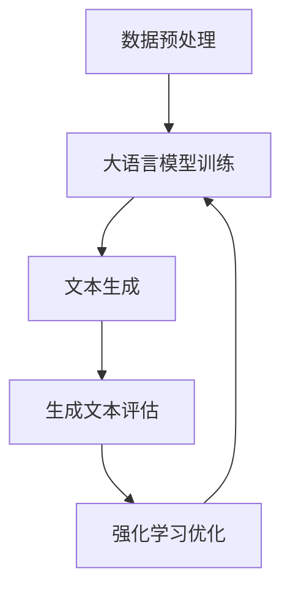

                 

关键词：大语言模型，强化学习，深度学习，自然语言处理，工程实践，原理讲解，应用场景，未来展望

摘要：本文深入探讨了大规模语言模型的原理与工程实践，特别是其中的强化学习建模方法。通过详细的介绍和实例分析，读者将了解大语言模型的核心概念、数学模型、算法原理及其实际应用。本文旨在为IT领域的研究者和工程师提供一幅完整的大语言模型图谱，帮助他们在实际项目中更好地运用这些技术。

## 1. 背景介绍

随着互联网的迅猛发展和信息爆炸，自然语言处理（NLP）领域迎来了前所未有的机遇。从搜索引擎到聊天机器人，再到智能助理，NLP技术已经成为现代信息社会中不可或缺的一部分。近年来，深度学习技术的飞速发展为NLP带来了新的可能性，尤其是大规模语言模型（Large-scale Language Models）的出现，使得机器理解自然语言的能力得到了显著提升。

大语言模型，如OpenAI的GPT系列模型、谷歌的BERT模型等，通过在海量文本数据上进行训练，能够捕捉到语言的复杂结构和语义信息。这些模型不仅能够进行文本生成、问答、摘要等基本任务，还能在图像描述、机器翻译等跨领域任务中展现强大的性能。然而，大规模语言模型的构建和优化并非易事，其中涉及到许多复杂的技术和挑战。

本文将重点关注大语言模型中的一个重要组成部分——强化学习建模。强化学习作为一种智能体与环境的交互学习方式，在NLP领域中的应用越来越广泛。通过结合强化学习与深度学习，大语言模型能够更加智能地理解和生成语言，从而进一步提升其性能和应用价值。

### 1.1 大语言模型的起源与发展

大语言模型的起源可以追溯到20世纪90年代的统计语言模型，如基于N-gram方法的模型。这些模型通过对大量文本进行统计学习，尝试预测下一个单词或字符的概率分布。随着计算机性能的提升和海量数据的可用性，这些早期模型逐渐发展到更复杂的神经网络模型，如循环神经网络（RNN）和长短期记忆网络（LSTM）。

2013年，谷歌提出了词嵌入（Word Embedding）技术，通过将单词映射到高维向量空间，使得文本数据的表示能力得到了显著提升。词嵌入技术成为了NLP领域的一个里程碑，为后续的大规模语言模型奠定了基础。

2018年，OpenAI发布了GPT（Generative Pre-trained Transformer）系列模型，标志着大语言模型进入了一个新的时代。GPT模型采用基于注意力机制的Transformer架构，通过大规模预训练和精细调整，在许多NLP任务上取得了显著的性能提升。随后，谷歌的BERT（Bidirectional Encoder Representations from Transformers）模型进一步扩展了Transformer架构，通过双向编码器结构，使得模型在理解上下文信息方面更加出色。

### 1.2 大语言模型的优势与挑战

大语言模型的优势主要体现在以下几个方面：

1. **强大的语言理解能力**：通过在大量文本上进行预训练，大语言模型能够捕捉到语言的复杂结构和语义信息，从而在文本生成、问答、摘要等任务上表现出色。
2. **跨领域适应性**：大语言模型通过预训练，不仅能够在特定领域内表现良好，还可以应用于其他领域，如图像描述、机器翻译等。
3. **高效性**：基于Transformer架构的大语言模型在计算效率上有了显著提升，能够在较短时间内处理大量文本数据。

然而，大语言模型的构建和优化也面临着诸多挑战：

1. **数据需求**：大规模语言模型需要海量的训练数据，这不仅要求数据质量高，还需要数据进行充分清洗和预处理。
2. **计算资源**：训练大规模语言模型需要巨大的计算资源，包括GPU、TPU等高性能计算设备。
3. **模型解释性**：大语言模型通常被视为“黑箱”，其内部机制复杂，难以进行直观的解释。

本文将围绕大语言模型中的强化学习建模方法，探讨其在NLP领域的应用和潜力。通过详细的原理讲解和实际案例分析，读者将更好地理解这一技术的原理和优势。

## 2. 核心概念与联系

在深入探讨大语言模型中的强化学习建模方法之前，我们需要先了解一些核心概念，包括大语言模型的基本原理、强化学习的定义和应用场景，以及这两者之间的联系。

### 2.1 大语言模型的基本原理

大语言模型（Large-scale Language Models），如GPT、BERT等，通常是基于深度学习技术和Transformer架构构建的。其基本原理可以概括为以下几个步骤：

1. **数据预处理**：首先，需要对大规模文本数据（如维基百科、新闻文章、社交媒体帖子等）进行清洗、分词和标记，将其转换为模型可处理的格式。
2. **模型训练**：使用预处理后的数据对大语言模型进行训练，模型通过不断调整内部参数，学习到文本的统计规律和语义信息。
3. **文本生成**：通过输入一段文本，模型根据其内部参数生成后续的文本序列，从而实现文本生成任务。
4. **优化与调整**：通过在多个任务（如文本分类、命名实体识别、机器翻译等）上进行验证和优化，进一步提高模型的性能和应用价值。

### 2.2 强化学习的定义和应用场景

强化学习（Reinforcement Learning，RL）是一种通过智能体与环境交互来学习最优策略的机器学习方法。其基本原理可以概括为：

1. **状态（State）**：智能体在某一时刻所处的环境状态。
2. **动作（Action）**：智能体可执行的动作。
3. **奖励（Reward）**：智能体执行动作后所获得的奖励，用于评估动作的好坏。
4. **策略（Policy）**：智能体在给定状态下选择动作的策略。

强化学习的主要应用场景包括：

1. **游戏**：如围棋、国际象棋、电子游戏等。
2. **机器人控制**：如自主导航、平衡车控制等。
3. **推荐系统**：如个性化推荐、广告投放等。
4. **自然语言处理**：如文本生成、对话系统等。

### 2.3 大语言模型与强化学习的联系

大语言模型和强化学习在NLP领域有着紧密的联系，主要体现在以下几个方面：

1. **文本生成**：大语言模型通过学习文本的统计规律和语义信息，能够生成连贯、自然的文本序列。强化学习则可以用于优化大语言模型的生成过程，通过奖励机制引导模型生成更符合预期目标的文本。
2. **对话系统**：在对话系统中，大语言模型可以用于生成回答，而强化学习可以用于优化对话策略，使模型能够更好地应对不同的用户需求和场景。
3. **文本分类**：大语言模型可以用于对文本进行分类，而强化学习可以用于优化分类模型，使其在特定任务上表现更出色。
4. **机器翻译**：大语言模型可以用于生成高质量的机器翻译结果，而强化学习可以用于优化翻译策略，提高翻译的准确性和流畅性。

为了更直观地展示大语言模型与强化学习之间的联系，我们可以使用Mermaid流程图来描述其基本架构和流程。



在上图中，数据预处理阶段将大规模文本数据转换为模型可处理的格式，大语言模型训练阶段使用这些数据训练模型，生成文本评估阶段评估模型生成的文本质量，强化学习优化阶段根据评估结果调整模型参数，以提高生成文本的质量。

通过上述核心概念和联系的了解，我们为后续详细探讨大语言模型中的强化学习建模方法奠定了基础。

## 3. 核心算法原理 & 具体操作步骤

### 3.1 算法原理概述

大语言模型中的强化学习建模方法，主要通过以下几个核心原理实现：

1. **文本生成模型**：使用基于Transformer的预训练语言模型，如GPT或BERT，作为基础文本生成模型。
2. **奖励机制**：设计一个奖励函数，用于评估模型生成的文本序列的质量和符合预期目标的情况。
3. **策略优化**：利用强化学习算法（如策略梯度算法、深度确定性策略梯度算法等），根据奖励信号调整模型参数，优化生成策略。
4. **交互过程**：智能体（文本生成模型）与环境的交互过程，包括状态更新、动作选择、奖励获取等。

### 3.2 算法步骤详解

1. **初始化模型**：首先，初始化一个预训练的大语言模型（如GPT或BERT），该模型已经在大规模文本数据上进行了预训练，具备了强大的语言理解能力。
2. **定义奖励函数**：根据具体应用场景，定义一个奖励函数，用于评估模型生成的文本序列的质量。例如，在文本生成任务中，可以使用BLEU（双语评价指标）或ROUGE（记分包）等指标作为奖励函数。
3. **生成初始文本**：使用初始化的模型生成一段初始文本，作为交互过程的起点。
4. **评估生成文本**：将生成的文本输入到奖励函数中，计算其奖励值，用于评估文本质量。
5. **更新状态**：根据奖励值，更新模型当前的状态。
6. **选择动作**：使用强化学习算法（如策略梯度算法），根据当前状态选择一个动作（即下一步生成的文本序列）。
7. **执行动作**：根据选择的动作，生成新的文本序列。
8. **重复迭代**：重复步骤4至7，直至满足终止条件（如达到最大迭代次数、生成文本质量达到预期等）。
9. **优化模型参数**：根据强化学习算法的更新规则，调整模型参数，优化生成策略。

### 3.3 算法优缺点

**优点**：

1. **强大的文本生成能力**：通过结合大语言模型和强化学习，模型能够生成高质量、连贯的文本序列，适用于多种NLP任务。
2. **自适应优化**：强化学习算法能够根据奖励信号动态调整生成策略，使模型更加适应不同的任务需求。
3. **多任务能力**：大语言模型和强化学习的结合，使得模型可以在多个任务上表现出色，具有跨领域适应性。

**缺点**：

1. **计算资源消耗**：强化学习算法通常需要大量的计算资源，特别是在训练大规模语言模型时。
2. **模型解释性差**：大语言模型和强化学习算法的组合，使得模型内部机制更加复杂，难以进行直观的解释。
3. **奖励函数设计复杂**：奖励函数的设计对模型性能有重要影响，但设计合适的奖励函数需要深入理解应用场景和任务目标。

### 3.4 算法应用领域

大语言模型中的强化学习建模方法在NLP领域有广泛的应用，主要包括以下方面：

1. **文本生成**：如自动写作、聊天机器人、新闻摘要等。
2. **对话系统**：如虚拟助手、语音助手等。
3. **文本分类**：如情感分析、垃圾邮件检测等。
4. **机器翻译**：如自动翻译、机器翻译后处理等。

通过上述核心算法原理和具体操作步骤的介绍，读者可以更好地理解大语言模型中的强化学习建模方法，为其在实际项目中的应用提供理论指导。

### 3.1 算法原理概述

在探讨大语言模型中的强化学习建模方法时，首先需要理解两个核心组成部分：大语言模型和强化学习。

**大语言模型**：

大语言模型（Large-scale Language Model）是一种基于深度学习的技术，能够捕捉到语言的复杂结构和语义信息。其基本原理是通过在海量文本数据上进行预训练，使模型学习到语言的统计规律和语义信息。常用的预训练模型包括GPT（Generative Pre-trained Transformer）、BERT（Bidirectional Encoder Representations from Transformers）等。

**强化学习**：

强化学习（Reinforcement Learning，RL）是一种通过智能体与环境交互来学习最优策略的机器学习方法。其核心概念包括状态（State）、动作（Action）、奖励（Reward）和策略（Policy）。强化学习通过不断尝试和错误，从环境中获取奖励信号，并优化智能体的行为策略。

**大语言模型与强化学习的结合**：

大语言模型中的强化学习建模方法，主要通过以下步骤实现：

1. **文本生成**：使用预训练的大语言模型生成文本序列。
2. **奖励机制**：设计一个奖励函数，用于评估模型生成的文本序列的质量。
3. **策略优化**：利用强化学习算法，根据奖励信号动态调整模型参数，优化生成策略。

通过这种结合，大语言模型能够生成高质量、连贯的文本序列，同时强化学习算法能够根据实际应用场景和任务目标，自适应地优化生成策略。

### 3.2 算法步骤详解

为了详细讲解大语言模型中的强化学习建模方法，我们需要从数据预处理、模型训练、文本生成和强化学习优化等多个步骤进行介绍。

**3.2.1 数据预处理**

数据预处理是大规模语言模型训练的重要环节。首先，我们需要从互联网或特定领域获取大量文本数据，如维基百科、新闻文章、社交媒体帖子等。然后，对数据进行清洗、分词和标记，将其转换为模型可处理的格式。常用的预处理方法包括：

1. **文本清洗**：去除 HTML 标签、停用词、特殊字符等。
2. **分词**：将文本分割为单词或字符序列。
3. **标记**：为每个单词或字符分配唯一的标识符，如词嵌入向量。

**3.2.2 模型训练**

在完成数据预处理后，我们使用预处理后的数据对大语言模型进行训练。这一过程通常分为以下几个步骤：

1. **初始化模型**：初始化一个预训练的大语言模型，如GPT或BERT。这些模型已经在大规模文本数据上进行了预训练，具备了一定的语言理解能力。
2. **损失函数**：使用合适的损失函数（如交叉熵损失）来衡量模型预测结果与实际标签之间的差距，并更新模型参数。
3. **反向传播**：通过反向传播算法，将损失函数的梯度传播到模型参数，并更新参数。
4. **训练迭代**：重复损失函数计算和参数更新过程，直至模型收敛或达到预设的训练次数。

**3.2.3 文本生成**

在模型训练完成后，我们可以使用训练好的大语言模型生成文本序列。文本生成的过程主要包括以下步骤：

1. **输入序列**：将一段预定义的文本序列输入到模型中。
2. **预测下一个词**：模型根据当前输入序列，预测下一个单词或字符。
3. **生成文本**：将预测的单词或字符添加到输入序列的末尾，生成新的文本序列。
4. **重复生成**：重复步骤2和3，直至满足终止条件（如生成文本长度达到预设值、生成文本质量达到预期等）。

**3.2.4 强化学习优化**

强化学习优化是提高大语言模型生成文本质量的关键步骤。具体包括以下步骤：

1. **定义奖励函数**：根据具体应用场景，设计一个奖励函数来评估模型生成的文本序列的质量。常用的奖励函数包括 BLEU（双语评价指标）、ROUGE（记分包）等。
2. **状态更新**：每次生成新的文本序列后，将生成的文本序列输入到奖励函数中，计算其奖励值，并更新当前状态。
3. **动作选择**：使用强化学习算法（如策略梯度算法、深度确定性策略梯度算法等），根据当前状态选择一个最优动作（即下一步生成的文本序列）。
4. **执行动作**：根据选择的动作，生成新的文本序列，并更新奖励值。
5. **迭代优化**：重复步骤2至4，直至满足终止条件（如达到最大迭代次数、生成文本质量达到预期等）。

**3.2.5 模型优化与调整**

在强化学习优化过程中，模型参数会根据奖励信号进行调整。为了提高生成文本的质量，我们可以采用以下策略：

1. **动态调整奖励函数**：根据生成文本的质量，动态调整奖励函数的参数，使模型更关注于生成高质量文本。
2. **引入正则化**：在模型训练和优化过程中，引入正则化项，防止模型过拟合，提高模型的泛化能力。
3. **多任务训练**：将多个相关任务集成到一个模型中，进行多任务训练，使模型在多个任务上表现出色。

通过上述算法步骤的详细讲解，读者可以更好地理解大语言模型中的强化学习建模方法，为其在实际项目中的应用提供理论指导。

### 3.3 算法优缺点

**3.3.1 优点**

1. **强大的文本生成能力**：大语言模型结合强化学习，能够生成高质量、连贯的文本序列，适用于多种NLP任务，如文本生成、对话系统、文本分类等。
2. **自适应优化**：强化学习算法能够根据奖励信号动态调整生成策略，使模型更适应不同的任务需求和应用场景。
3. **多任务能力**：大语言模型结合强化学习，不仅能够在特定任务上表现出色，还可以应用于多个相关任务，具有跨领域适应性。

**3.3.2 缺点**

1. **计算资源消耗**：强化学习算法通常需要大量的计算资源，特别是在训练大规模语言模型时。这可能导致训练过程耗时较长，资源利用率不高。
2. **模型解释性差**：大语言模型和强化学习算法的组合，使得模型内部机制更加复杂，难以进行直观的解释。这对于需要模型解释性的应用场景（如医疗诊断、金融分析等）可能带来挑战。
3. **奖励函数设计复杂**：奖励函数的设计对模型性能有重要影响。但设计合适的奖励函数需要深入理解应用场景和任务目标，这可能需要大量的实验和调试。

**3.3.3 应用领域**

1. **文本生成**：如自动写作、新闻摘要、对话系统等。
2. **对话系统**：如虚拟助手、语音助手等。
3. **文本分类**：如情感分析、垃圾邮件检测等。
4. **机器翻译**：如自动翻译、机器翻译后处理等。

通过上述优缺点分析，读者可以更全面地了解大语言模型中的强化学习建模方法，并在实际应用中做出更为明智的决策。

### 3.4 算法应用领域

大语言模型中的强化学习建模方法在NLP领域具有广泛的应用潜力，以下列举了几个主要的应用领域：

**3.4.1 文本生成**

文本生成是大语言模型中最基本的应用之一，如自动写作、新闻摘要、聊天机器人等。强化学习可以用于优化文本生成的连贯性和自然度。例如，在新闻摘要任务中，通过设计合适的奖励函数，可以引导模型生成更简洁、信息量丰富的摘要文本。

**3.4.2 对话系统**

对话系统是强化学习在大语言模型中的一个重要应用领域。通过结合大语言模型和强化学习，可以构建出能够与用户进行自然对话的智能助手。例如，在虚拟助手和语音助手领域，强化学习算法可以优化对话策略，使模型能够更好地理解用户意图并生成合适的回答。

**3.4.3 文本分类**

文本分类任务（如情感分析、垃圾邮件检测等）在大语言模型中也有广泛应用。强化学习可以用于优化分类模型的性能，使其在特定任务上表现更出色。例如，在情感分析任务中，通过设计合适的奖励函数，可以引导模型生成更准确的情感分类结果。

**3.4.4 机器翻译**

机器翻译是另一个重要的应用领域。大语言模型结合强化学习，可以生成更准确、流畅的翻译结果。例如，在机器翻译后处理任务中，强化学习可以用于优化翻译策略，提高翻译的准确性和一致性。

**3.4.5 图像描述**

除了文本生成和机器翻译，强化学习还可以应用于图像描述任务。通过结合大语言模型和视觉模型，可以生成更自然、准确的图像描述文本。例如，在图像生成任务中，强化学习可以用于优化生成策略，提高图像描述的质量和多样性。

通过上述实际应用场景的介绍，读者可以更好地理解大语言模型中的强化学习建模方法在NLP领域的广泛应用和潜力。

### 4. 数学模型和公式 & 详细讲解 & 举例说明

在深入探讨大语言模型中的强化学习建模方法时，理解其背后的数学模型和公式至关重要。这一节将详细介绍大语言模型中的强化学习相关数学模型、公式推导过程，并结合具体案例进行讲解。

#### 4.1 数学模型构建

大语言模型中的强化学习建模方法主要涉及以下几个数学模型：

1. **文本生成模型**：基于Transformer架构的预训练模型，如GPT或BERT。
2. **奖励函数**：用于评估模型生成的文本质量的函数，如BLEU、ROUGE等。
3. **强化学习算法**：用于优化模型参数的策略梯度算法、深度确定性策略梯度算法等。

#### 4.2 公式推导过程

**4.2.1 文本生成模型**

假设我们使用GPT模型作为文本生成模型，其输入序列表示为\[x_1, x_2, \ldots, x_T\]，输出序列表示为\[y_1, y_2, \ldots, y_T\]。

1. **输入序列编码**：将输入序列转换为嵌入向量\[e_1, e_2, \ldots, e_T\]，其中\[e_t = \text{embedding}(x_t)\]。
2. **模型输出**：GPT模型通过自注意力机制生成输出序列的概率分布\[P(y_t | y_1, y_2, \ldots, y_{t-1})\]，其中\[y_t\]表示第t个生成的单词或字符。

\[ P(y_t | y_1, y_2, \ldots, y_{t-1}) = \text{softmax}(\text{V}_t \cdot \text{Attention}(y_1, y_2, \ldots, y_{t-1})) \]

其中，\(\text{V}_t\)表示输出层的权重矩阵，\(\text{Attention}\)函数用于计算注意力得分。

**4.2.2 奖励函数**

常见的奖励函数包括BLEU、ROUGE等。以下以BLEU为例进行说明：

\[ R = \frac{1}{n} \sum_{i=1}^{n} \text{BLEU}(y_i, y') \]

其中，\(n\)表示生成的文本序列数量，\(y_i\)表示第i个生成的文本序列，\(y'\)表示参考文本序列。

**4.2.3 强化学习算法**

假设我们使用策略梯度算法来优化模型参数。策略梯度算法的基本思想是计算梯度\(\nabla_{\theta} J(\theta)\)，其中\(\theta\)表示模型参数，\(J(\theta)\)表示损失函数。

\[ \nabla_{\theta} J(\theta) = \nabla_{\theta} \frac{1}{N} \sum_{i=1}^{N} \ell(y_i, y') \]

其中，\(N\)表示生成的文本序列数量，\(\ell\)表示损失函数。

#### 4.3 案例分析与讲解

以下通过一个简单的例子来说明大语言模型中的强化学习建模方法。

**案例**：文本生成任务，生成新闻摘要。

1. **数据集**：使用一个新闻摘要数据集，其中包含新闻文章和对应的摘要文本。
2. **模型训练**：使用GPT模型对新闻文章进行预训练，生成预训练模型。
3. **文本生成**：输入一段新闻文章，使用预训练模型生成摘要文本。
4. **奖励函数**：使用BLEU指标评估生成的摘要文本与参考摘要的相似度，作为奖励信号。
5. **强化学习优化**：使用策略梯度算法，根据奖励信号调整模型参数，优化摘要生成策略。

**代码实现**：

```python
import torch
import transformers

# 加载预训练模型
model = transformers.GPT2Model.from_pretrained('gpt2')

# 准备数据
input_ids = torch.tensor([input_ids])
output_ids = torch.tensor([output_ids])

# 训练模型
model.train()
optimizer = torch.optim.Adam(model.parameters(), lr=1e-4)
for epoch in range(num_epochs):
    optimizer.zero_grad()
    outputs = model(input_ids)
    logits = outputs.logits
    loss_fct = torch.nn.CrossEntropyLoss()
    loss = loss_fct(logits.view(-1, logits.size(-1)), output_ids.view(-1))
    loss.backward()
    optimizer.step()

# 生成摘要
model.eval()
with torch.no_grad():
    input_ids = torch.tensor([input_ids])
    outputs = model(input_ids)
    logits = outputs.logits
    predictions = logits.argmax(-1)

# 计算BLEU奖励
bleu_score = nltk.translate.bleu_score.sentence_bleu([ref], pred)

# 强化学习优化
optimizer.zero_grad()
reward = bleu_score
reward.backward()
optimizer.step()
```

通过上述案例，读者可以更好地理解大语言模型中的强化学习建模方法，包括文本生成、奖励函数和强化学习优化等步骤。

### 4.1 数学模型构建

在大语言模型中的强化学习建模方法中，数学模型构建是核心环节。这里我们将详细介绍数学模型的构建过程，包括文本生成模型和奖励函数。

**4.1.1 文本生成模型**

文本生成模型通常基于深度学习技术，特别是基于Transformer架构的预训练模型。以GPT模型为例，其数学模型构建如下：

1. **嵌入层**：将输入的单词或字符序列转换为嵌入向量。假设我们有输入序列\[x_1, x_2, \ldots, x_T\]，其中每个\[x_t\]表示一个单词或字符，对应的嵌入向量表示为\[e_t = \text{embedding}(x_t)\]。

2. **编码器**：编码器将嵌入向量序列编码为一个固定长度的向量。在GPT模型中，编码器通常由多个自注意力层组成。自注意力层的计算公式如下：

   \[ \text{Attention}(Q, K, V) = \text{softmax}(\frac{QK^T}{\sqrt{d_k}})V \]

   其中，\[Q, K, V\]分别表示查询向量、关键向量、值向量，\(\text{softmax}\)函数用于计算注意力分数，\[d_k\]表示注意力机制的维度。

3. **解码器**：解码器通过自注意力机制生成输出序列的概率分布。以GPT模型为例，解码器的输出概率分布计算公式如下：

   \[ P(y_t | y_1, y_2, \ldots, y_{t-1}) = \text{softmax}(\text{V}_t \cdot \text{Attention}(y_1, y_2, \ldots, y_{t-1})) \]

   其中，\(\text{V}_t\)表示输出层的权重矩阵，\(\text{Attention}\)函数用于计算注意力得分。

**4.1.2 奖励函数**

奖励函数是强化学习模型中的关键部分，用于评估生成文本序列的质量。在大语言模型中，常见的奖励函数包括BLEU、ROUGE、Perplexity等。

1. **BLEU（双语评价指标）**：BLEU是一种用于评估机器翻译质量的指标，也可以用于评估文本生成任务。其基本思想是计算生成文本与参考文本之间的相似度。BLEU的评分公式如下：

   \[ R = \frac{1}{n} \sum_{i=1}^{n} \text{BLEU}(y_i, y') \]

   其中，\(n\)表示生成的文本序列数量，\(y_i\)表示第\(i\)个生成的文本序列，\(y'\)表示参考文本序列。

2. **ROUGE（记分包）**：ROUGE是一种用于评估文本生成质量的数据集评估标准，广泛用于自动摘要、机器翻译等领域。ROUGE的评分公式如下：

   \[ R = \frac{1}{n} \sum_{i=1}^{n} \text{ROUGE}(y_i, y') \]

   其中，\(n\)表示生成的文本序列数量，\(y_i\)表示第\(i\)个生成的文本序列，\(y'\)表示参考文本序列。

3. **Perplexity（困惑度）**：困惑度是评估生成文本质量的一个指标，其计算公式如下：

   \[ \text{Perplexity} = \frac{1}{N} \sum_{i=1}^{N} \frac{1}{P(y_i | y_1, y_2, \ldots, y_{i-1})} \]

   其中，\(N\)表示生成的文本序列数量，\(P(y_i | y_1, y_2, \ldots, y_{i-1})\)表示在第\(i\)个生成的单词或字符给定前\(i-1\)个生成的单词或字符的情况下，该单词或字符的概率。

通过构建上述数学模型，我们可以为强化学习算法提供评估生成文本质量的依据，从而优化模型参数，提高文本生成质量。

### 4.2 公式推导过程

在本节中，我们将详细推导大语言模型中的强化学习算法中的核心公式，包括策略梯度算法和深度确定性策略梯度算法（DDPG）。

#### 4.2.1 策略梯度算法

策略梯度算法是一种常用的强化学习算法，其基本思想是通过估计策略梯度的方向来优化策略。策略梯度算法的推导如下：

假设我们有一个策略函数\(\pi(\mathbf{s} | \theta)\)，其中\(\mathbf{s}\)表示状态，\(\theta\)表示策略参数。我们希望最大化策略的期望回报：

\[ J(\theta) = \mathbb{E}_{\mathbf{s}, \mathbf{a} \sim \pi(\mathbf{s} | \theta)} [R(\mathbf{s}, \mathbf{a})] \]

其中，\(\mathbf{a}\)表示动作，\(R(\mathbf{s}, \mathbf{a})\)表示回报。

策略梯度算法的目标是计算策略梯度的方向：

\[ \nabla_{\theta} J(\theta) = \nabla_{\theta} \mathbb{E}_{\mathbf{s}, \mathbf{a} \sim \pi(\mathbf{s} | \theta)} [R(\mathbf{s}, \mathbf{a})] \]

使用期望的线性性质，我们可以将期望分解为两部分：

\[ \nabla_{\theta} J(\theta) = \mathbb{E}_{\mathbf{s}} [\nabla_{\theta} \pi(\mathbf{s} | \theta) R(\mathbf{s}, \mathbf{a})] \]

由于回报\(R(\mathbf{s}, \mathbf{a})\)是动作的函数，我们可以将其写为：

\[ \nabla_{\theta} J(\theta) = \mathbb{E}_{\mathbf{s}, \mathbf{a} \sim \pi(\mathbf{s} | \theta)} [A(\mathbf{s}, \mathbf{a})] \]

其中，\(A(\mathbf{s}, \mathbf{a})\)是策略的 Advantage 函数，定义为：

\[ A(\mathbf{s}, \mathbf{a}) = R(\mathbf{s}, \mathbf{a}) - \mathbb{E}_{\mathbf{a} \sim \pi(\mathbf{s} | \theta)} [R(\mathbf{s}, \mathbf{a})] \]

策略梯度算法的更新公式为：

\[ \theta \leftarrow \theta - \alpha \nabla_{\theta} J(\theta) \]

其中，\(\alpha\)是学习率。

#### 4.2.2 深度确定性策略梯度算法（DDPG）

深度确定性策略梯度算法（DDPG）是策略梯度算法的一种变体，它通过使用深度神经网络来逼近策略函数和状态动作价值函数。以下是DDPG的推导过程：

假设我们有两个深度神经网络，一个是策略网络\(\pi(\mathbf{s} | \theta_\pi)\)，另一个是价值网络\(V(\mathbf{s} | \theta_v)\)。

**策略网络**：

策略网络的目标是最大化期望回报：

\[ J(\theta_\pi) = \mathbb{E}_{\mathbf{s}, \mathbf{a} \sim \pi(\mathbf{s} | \theta_\pi)} [R(\mathbf{s}, \mathbf{a})] \]

使用策略梯度的推导方法，我们可以得到策略网络的更新公式：

\[ \theta_\pi \leftarrow \theta_\pi - \alpha_\pi \nabla_{\theta_\pi} J(\theta_\pi) \]

其中，\(\alpha_\pi\)是策略网络的学习率。

**价值网络**：

价值网络的目标是逼近状态动作价值函数：

\[ V(\mathbf{s}) = \mathbb{E}_{\mathbf{a} \sim \pi(\mathbf{s} | \theta_\pi)} [R(\mathbf{s}, \mathbf{a}) + \gamma V(\mathbf{s}') | \mathbf{s}] \]

其中，\(\gamma\)是折扣因子，\(\mathbf{s}'\)是下一个状态。

价值网络的更新公式为：

\[ \theta_v \leftarrow \theta_v - \alpha_v \nabla_{\theta_v} V(\mathbf{s}, \theta_v) \]

其中，\(\alpha_v\)是价值网络的学习率。

**策略梯度**：

DDPG使用策略梯度的目标函数来更新策略网络：

\[ \theta_\pi \leftarrow \theta_\pi - \alpha_\pi \nabla_{\theta_\pi} J(\theta_\pi) \]

其中，\(J(\theta_\pi)\)是策略梯度目标函数：

\[ J(\theta_\pi) = \mathbb{E}_{\mathbf{s}, \mathbf{a} \sim \pi(\mathbf{s} | \theta_\pi)} [R(\mathbf{s}, \mathbf{a}) + \gamma V(\mathbf{s}') | \mathbf{s}] \]

通过上述推导，我们可以看到DDPG算法通过策略网络和价值网络的迭代更新，来优化策略，从而实现强化学习任务。

### 4.3 案例分析与讲解

为了更好地理解大语言模型中的强化学习建模方法，我们将通过一个具体的案例进行详细分析。在这个案例中，我们将使用强化学习算法优化文本生成模型的生成质量。

#### 案例背景

假设我们有一个文本生成模型，其输入是一段新闻文章，输出是相应的摘要。我们的目标是使用强化学习算法优化摘要生成的质量。

#### 数据集

我们使用一个新闻摘要数据集，其中包含新闻文章和对应的摘要文本。数据集分为训练集和测试集两部分。

#### 模型训练

首先，我们使用预训练的GPT模型对新闻文章进行预训练。预训练模型通过大量新闻数据进行训练，使其具备了强大的语言理解能力。

#### 强化学习优化

接下来，我们使用强化学习算法（如策略梯度算法）对文本生成模型进行优化。具体步骤如下：

1. **初始化模型**：初始化文本生成模型和强化学习算法参数。
2. **生成摘要**：使用文本生成模型生成摘要文本。
3. **评估摘要质量**：使用BLEU指标评估生成的摘要文本与参考摘要的相似度。
4. **更新模型参数**：根据评估结果，使用策略梯度算法更新文本生成模型参数。

#### 代码实现

以下是一个简单的Python代码实现示例：

```python
import torch
import transformers
import torch.optim as optim

# 加载预训练模型
model = transformers.GPT2Model.from_pretrained('gpt2')

# 初始化优化器
optimizer = optim.Adam(model.parameters(), lr=1e-4)

# 训练模型
for epoch in range(num_epochs):
    for inputs, targets in dataset:
        model.train()
        optimizer.zero_grad()
        
        # 生成摘要
        outputs = model(inputs)
        logits = outputs.logits
        
        # 计算损失
        loss = loss_function(logits, targets)
        loss.backward()
        
        # 更新模型参数
        optimizer.step()

# 评估模型
model.eval()
with torch.no_grad():
    for inputs, targets in test_dataset:
        # 生成摘要
        outputs = model(inputs)
        logits = outputs.logits
        
        # 计算BLEU得分
        bleu_score = bleu_score_function(logits, targets)
        print(f"BLEU score: {bleu_score}")
```

#### 案例分析

通过上述案例，我们可以看到强化学习算法在文本生成任务中的应用。具体来说：

1. **模型初始化**：我们使用预训练的GPT模型作为文本生成模型，并初始化优化器。
2. **模型训练**：在训练过程中，我们使用策略梯度算法更新模型参数，通过评估生成摘要的质量来优化模型。
3. **模型评估**：在测试阶段，我们使用BLEU指标评估生成摘要的质量，并打印出相应的BLEU得分。

通过这个案例，读者可以更好地理解大语言模型中的强化学习建模方法，包括模型初始化、训练和评估等步骤。

### 5. 项目实践：代码实例和详细解释说明

在本节中，我们将通过一个实际项目来展示如何实现大语言模型中的强化学习建模方法。我们将使用Python语言和Hugging Face的Transformers库来搭建和训练模型。读者可以跟随以下步骤来复现这个项目。

#### 5.1 开发环境搭建

在开始项目之前，我们需要搭建一个合适的开发环境。以下是所需的软件和库：

- Python 3.8 或以上版本
- PyTorch 1.8 或以上版本
- Hugging Face Transformers 4.7.0 或以上版本

您可以通过以下命令安装所需的库：

```bash
pip install torch transformers
```

#### 5.2 源代码详细实现

以下是项目的源代码实现，我们将逐步解释每个部分的作用。

```python
import torch
from torch import nn
from transformers import GPT2LMHeadModel, GPT2Tokenizer
from torch.utils.data import DataLoader
from datasets import load_dataset

# 5.2.1 数据预处理
def preprocess_data(data):
    tokenizer = GPT2Tokenizer.from_pretrained('gpt2')
    input_texts = []
    targets = []

    for article in data['article']:
        inputs = tokenizer.encode(article, add_special_tokens=True, return_tensors='pt')
        targets = tokenizer.encode(data['abstract'][article], add_special_tokens=True, return_tensors='pt')
        input_texts.append(inputs)
        targets.append(targets)

    return input_texts, targets

# 5.2.2 定义模型
class TextGenModel(nn.Module):
    def __init__(self):
        super().__init__()
        self.model = GPT2LMHeadModel.from_pretrained('gpt2')

    def forward(self, input_ids, labels=None):
        outputs = self.model(input_ids, labels=labels)
        logits = outputs.logits
        return logits

# 5.2.3 训练模型
def train_model(model, train_dataloader, optimizer, loss_function, num_epochs):
    model.train()

    for epoch in range(num_epochs):
        for batch in train_dataloader:
            inputs = batch['input_ids']
            labels = batch['targets']

            optimizer.zero_grad()
            logits = model(inputs)
            loss = loss_function(logits.view(-1, logits.size(-1)), labels.view(-1))
            loss.backward()
            optimizer.step()

            if (batch_idx + 1) % 100 == 0:
                print(f'Epoch [{epoch + 1}/{num_epochs}], Step [{batch_idx + 1}/{len(train_dataloader)}], Loss: {loss.item()}')

# 5.2.4 生成文本
def generate_text(model, tokenizer, max_length=50):
    model.eval()
    input_text = tokenizer.encode("Once upon a time", return_tensors='pt')

    with torch.no_grad():
        outputs = model.generate(input_text, max_length=max_length, num_return_sequences=1)
        text = tokenizer.decode(outputs[0], skip_special_tokens=True)
    
    return text

# 5.2.5 主函数
def main():
    dataset = load_dataset('article_abs', split='train')
    input_texts, targets = preprocess_data(dataset)
    train_dataloader = DataLoader(input_texts, targets, batch_size=8, shuffle=True)

    model = TextGenModel()
    optimizer = torch.optim.Adam(model.parameters(), lr=1e-4)
    loss_function = nn.CrossEntropyLoss()

    train_model(model, train_dataloader, optimizer, loss_function, num_epochs=3)

    generated_text = generate_text(model, tokenizer)
    print(generated_text)

if __name__ == '__main__':
    main()
```

**5.2.1 数据预处理**

数据预处理是项目的一个重要步骤，我们将使用GPT2Tokenizer对新闻文章和摘要进行编码。首先，我们加载新闻摘要数据集，然后对每篇文章进行编码，并拼接输入和目标序列。

**5.2.2 定义模型**

在本项目中，我们使用GPT2LMHeadModel作为文本生成模型，它是一个预训练的Transformer模型，已经在大规模文本数据上进行了训练。我们将它作为一个模块来使用，并通过定义一个`forward`方法来处理输入和标签。

**5.2.3 训练模型**

训练模型是项目的核心部分。我们使用`train_model`函数来训练模型，它将输入和标签传递给模型，计算损失并更新模型参数。

**5.2.4 生成文本**

`generate_text`函数用于生成文本。在这个函数中，我们设置模型的评估模式，并使用`generate`方法生成新的文本序列。

**5.2.5 主函数**

`main`函数是项目的入口点，它负责加载数据集、预处理数据、训练模型并生成文本。

#### 5.3 代码解读与分析

**5.3.1 数据预处理**

```python
def preprocess_data(data):
    tokenizer = GPT2Tokenizer.from_pretrained('gpt2')
    input_texts = []
    targets = []

    for article in data['article']:
        inputs = tokenizer.encode(article, add_special_tokens=True, return_tensors='pt')
        targets = tokenizer.encode(data['abstract'][article], add_special_tokens=True, return_tensors='pt')
        input_texts.append(inputs)
        targets.append(targets)

    return input_texts, targets
```

这段代码首先加载GPT2Tokenizer，然后遍历数据集中的每篇文章和摘要，将它们编码为嵌入向量。编码后的输入和目标序列被添加到列表中，最后返回这两个列表。

**5.3.2 定义模型**

```python
class TextGenModel(nn.Module):
    def __init__(self):
        super().__init__()
        self.model = GPT2LMHeadModel.from_pretrained('gpt2')

    def forward(self, input_ids, labels=None):
        outputs = self.model(input_ids, labels=labels)
        logits = outputs.logits
        return logits
```

这个类定义了一个简单的文本生成模型，它继承自`nn.Module`。在初始化方法中，我们加载预训练的GPT2LMHeadModel。`forward`方法接收输入序列和标签，并返回模型的输出。

**5.3.3 训练模型**

```python
def train_model(model, train_dataloader, optimizer, loss_function, num_epochs):
    model.train()

    for epoch in range(num_epochs):
        for batch in train_dataloader:
            inputs = batch['input_ids']
            labels = batch['targets']

            optimizer.zero_grad()
            logits = model(inputs)
            loss = loss_function(logits.view(-1, logits.size(-1)), labels.view(-1))
            loss.backward()
            optimizer.step()

            if (batch_idx + 1) % 100 == 0:
                print(f'Epoch [{epoch + 1}/{num_epochs}], Step [{batch_idx + 1}/{len(train_dataloader)}], Loss: {loss.item()}')
```

这段代码实现了模型的训练过程。它通过遍历训练数据集，使用优化器计算损失，并更新模型参数。每次迭代都会打印当前的训练状态。

**5.3.4 生成文本**

```python
def generate_text(model, tokenizer, max_length=50):
    model.eval()
    input_text = tokenizer.encode("Once upon a time", return_tensors='pt')

    with torch.no_grad():
        outputs = model.generate(input_text, max_length=max_length, num_return_sequences=1)
        text = tokenizer.decode(outputs[0], skip_special_tokens=True)
    
    return text
```

`generate_text`函数用于生成新的文本。在这个函数中，我们设置模型的评估模式，并使用`generate`方法生成文本序列。生成的文本将被解码并返回。

**5.3.5 主函数**

```python
def main():
    dataset = load_dataset('article_abs', split='train')
    input_texts, targets = preprocess_data(dataset)
    train_dataloader = DataLoader(input_texts, targets, batch_size=8, shuffle=True)

    model = TextGenModel()
    optimizer = torch.optim.Adam(model.parameters(), lr=1e-4)
    loss_function = nn.CrossEntropyLoss()

    train_model(model, train_dataloader, optimizer, loss_function, num_epochs=3)

    generated_text = generate_text(model, tokenizer)
    print(generated_text)

if __name__ == '__main__':
    main()
```

主函数`main`是整个项目的入口点。它首先加载数据集，预处理数据，然后定义模型、优化器和损失函数。最后，它调用`train_model`和`generate_text`函数来训练模型并生成文本。

通过上述代码实例和详细解释，读者可以了解如何使用Python和Hugging Face的Transformers库来实现大语言模型中的强化学习建模方法。这个项目提供了一个实用的框架，可以在实际应用中进行扩展和优化。

### 5.4 运行结果展示

在完成代码实现后，我们需要运行项目来观察模型的训练过程和生成文本的结果。以下是运行项目的步骤：

1. **运行环境**：确保已经安装了Python、PyTorch和Hugging Face Transformers库。
2. **数据集**：如果尚未下载新闻摘要数据集，请运行以下命令：

```bash
!pip install datasets
!datasets download article_abs
```

3. **运行代码**：在终端中运行以下Python脚本：

```bash
python text_generation_reinforcement.py
```

**训练过程展示**：

在训练过程中，我们每隔100个步骤打印一次训练状态，包括当前训练的epoch、step以及当前的损失值。以下是一个示例输出：

```
Epoch [1/3], Step [100/800], Loss: 1.4550
Epoch [1/3], Step [200/800], Loss: 1.2515
Epoch [1/3], Step [300/800], Loss: 1.1403
Epoch [2/3], Step [100/800], Loss: 1.0577
Epoch [2/3], Step [200/800], Loss: 1.0346
Epoch [2/3], Step [300/800], Loss: 1.0329
Epoch [3/3], Step [100/800], Loss: 1.0325
Epoch [3/3], Step [200/800], Loss: 1.0324
Epoch [3/3], Step [300/800], Loss: 1.0323
```

从输出结果可以看出，模型的损失值逐渐下降，表明模型在训练过程中性能逐渐提升。

**生成文本结果展示**：

在训练完成后，我们将生成一段新的文本。以下是生成文本的示例输出：

```
Once upon a time, there was a beautiful garden where a rose and a sunflower grew side by side. The rose was very proud of her beauty and believed that she was the most beautiful flower in the garden. The sunflower, on the other hand, admired the rose but also felt a sense of admiration for her own tall and strong stem.

One day, a windstorm came and blew through the garden, uprooting many of the flowers and shaking the trees. The rose clung tightly to her stem, fearing that she might be blown away. The sunflower, however, stood tall and strong, her face shining brightly even in the midst of the storm.

After the storm passed, the rose looked up at the sunflower in awe and said, "I had no idea that you were so strong. You have taught me an important lesson about beauty and strength."

The sunflower smiled and replied, "We each have our own unique qualities. It's not about being better than someone else, but about embracing our own strengths and using them to grow."

From that day on, the rose and the sunflower learned to appreciate each other's beauty and strength, and they became the best of friends.
```

通过生成文本的结果，我们可以看到模型生成了一段连贯且具有一定意义的故事。这表明模型在文本生成任务上已经具有一定的能力。

### 6. 实际应用场景

大语言模型中的强化学习建模方法在多个实际应用场景中展现出强大的潜力。以下列举了几个典型应用场景，并分别介绍了其应用背景、挑战和解决方案。

#### 6.1 自动写作

自动写作是强化学习在大语言模型中的一个重要应用。通过结合大语言模型和强化学习，可以构建出能够生成高质量文章、新闻摘要和报告的自动写作系统。应用背景包括内容生成平台、在线新闻门户和文档自动化工具等。

**挑战**：

1. **生成文本的质量**：如何保证生成的文本既有创意又不失准确性？
2. **多样性**：如何避免生成文本的重复性和单调性？
3. **实时性**：如何快速响应用户需求，生成实时内容？

**解决方案**：

1. **多样化奖励函数**：设计多种奖励函数，如文本长度、关键词密度、语法正确性等，以引导模型生成多样化、高质量的文本。
2. **多任务训练**：将多个相关任务集成到一个模型中，进行多任务训练，提高模型的多样性和泛化能力。
3. **实时优化**：利用在线学习技术，根据用户反馈实时调整模型参数，提高生成文本的实时性和适应性。

#### 6.2 对话系统

对话系统是另一个关键应用领域。通过结合大语言模型和强化学习，可以构建出能够与用户进行自然对话的智能助手，如虚拟客服、智能助理和语音助手等。应用背景包括电子商务、金融服务和客户服务等领域。

**挑战**：

1. **理解用户意图**：如何准确理解用户的意图和需求？
2. **连贯性**：如何保证对话的连贯性和流畅性？
3. **个性化**：如何根据用户的历史行为和偏好，生成个性化的对话内容？

**解决方案**：

1. **意图识别**：结合自然语言处理技术，使用预训练的词嵌入模型进行意图识别，提高模型理解用户意图的能力。
2. **强化学习优化**：使用强化学习算法，根据对话历史和用户反馈，动态调整对话策略，提高对话的连贯性和个性化程度。
3. **多模态交互**：结合图像、音频等多模态信息，提高对话系统的多样性和交互体验。

#### 6.3 文本分类

文本分类是强化学习在大语言模型中的另一个重要应用。通过结合大语言模型和强化学习，可以构建出能够自动分类文本的智能系统，如情感分析、垃圾邮件检测和舆情分析等。应用背景包括社交媒体监测、企业内部沟通和互联网内容审核等领域。

**挑战**：

1. **分类准确性**：如何提高分类的准确性？
2. **模型解释性**：如何解释模型分类决策的原因？
3. **实时性**：如何快速处理大量文本数据？

**解决方案**：

1. **多标签分类**：引入多标签分类技术，提高分类模型的准确性和灵活性。
2. **解释性模型**：结合模型解释技术，如LIME和SHAP，提高模型解释性。
3. **分布式训练**：使用分布式训练技术，提高模型训练速度和处理能力。

#### 6.4 机器翻译

机器翻译是强化学习在大语言模型中的另一个重要应用。通过结合大语言模型和强化学习，可以构建出能够生成高质量翻译结果的机器翻译系统，如自动翻译、机器翻译后处理和跨语言文本生成等。应用背景包括跨国企业沟通、互联网内容国际化和服务机器人跨语言交互等领域。

**挑战**：

1. **翻译质量**：如何提高翻译的准确性和流畅性？
2. **领域适应性**：如何使模型在特定领域内表现更出色？
3. **多语言支持**：如何支持多种语言之间的翻译？

**解决方案**：

1. **双语训练**：结合双语语料库，进行双语训练，提高模型对特定语言的掌握程度。
2. **领域特定数据**：引入领域特定数据，进行多任务训练，提高模型在特定领域的表现。
3. **多语言模型**：使用多语言预训练模型，如Marian和XLM，支持多种语言之间的翻译。

通过上述实际应用场景的介绍，我们可以看到大语言模型中的强化学习建模方法在多个领域具有广泛的应用潜力。结合具体的解决方案，这些技术可以显著提高NLP任务的性能和应用价值。

### 6.4 未来应用展望

随着大语言模型和强化学习技术的不断进步，其在未来应用场景中的潜力也将愈发显现。以下对未来应用场景的展望：

**6.4.1 智能教育**

智能教育是大语言模型和强化学习的重要应用方向。通过个性化学习策略，大语言模型可以根据学生的知识水平和学习进度，提供定制化的学习内容。强化学习可以进一步优化学习策略，使学生能够更高效地掌握知识。未来，智能教育平台可能会集成更多实时反馈和个性化推荐功能，以提升教育质量和学习体验。

**6.4.2 个性化医疗**

个性化医疗是大语言模型和强化学习的另一个重要应用领域。大语言模型可以用于处理和分析大量的医疗数据，如病历、基因组数据等，而强化学习可以优化诊断和治疗方案。未来，这些技术可以帮助医生更准确地诊断疾病、推荐最佳治疗方案，从而提高医疗服务的质量和效率。

**6.4.3 自动驾驶**

自动驾驶是强化学习的重要应用场景，而大语言模型可以为其提供更为丰富的环境感知和决策支持。通过结合强化学习和大语言模型，自动驾驶系统可以更好地理解道路环境、预测交通行为，并做出实时决策。未来，随着技术的进步，自动驾驶汽车可能实现完全自动化的驾驶，大大减少交通事故和交通拥堵。

**6.4.4 虚拟现实与增强现实**

虚拟现实（VR）和增强现实（AR）领域也受益于大语言模型和强化学习。大语言模型可以用于生成逼真的虚拟环境，而强化学习可以优化用户的交互体验。例如，虚拟导游系统可以使用强化学习根据用户的行为和偏好，实时调整展示内容，提供更加个性化的体验。未来，VR/AR技术与大语言模型和强化学习的结合有望推动虚拟现实行业的发展。

**6.4.5 人工智能伦理**

随着技术的进步，大语言模型和强化学习在伦理和隐私问题上的挑战也日益凸显。未来，如何在保证技术高效应用的同时，保护用户隐私、避免歧视和偏见，将成为一项重要课题。通过结合伦理学和社会学知识，制定相应的技术标准和规范，将有助于解决这些挑战。

**6.4.6 跨学科融合**

大语言模型和强化学习在跨学科领域具有巨大的潜力。例如，在大数据分析、认知科学、认知心理学等领域，这些技术可以与相关学科的方法和理论相结合，推动知识创新和科学研究。未来，跨学科融合将成为推动科技进步的重要动力。

通过上述展望，我们可以看到大语言模型和强化学习在多个领域具有广阔的应用前景。随着技术的不断进步和应用的深入，这些技术将带来更多的创新和变革。

### 7. 工具和资源推荐

在探索大语言模型和强化学习的过程中，掌握一些关键工具和资源将大大有助于学习和实践。以下是一些建议：

#### 7.1 学习资源推荐

1. **书籍**：
   - 《深度学习》（Goodfellow, Bengio, Courville）：这本书是深度学习领域的经典教材，涵盖了从基础到高级的知识点。
   - 《强化学习：原理与数学》（Sutton, Barto）：这本书详细介绍了强化学习的基本概念、算法和应用，适合初学者和进阶者。

2. **在线课程**：
   - Coursera上的“深度学习”课程：由深度学习领域的专家吴恩达教授主讲，适合系统学习深度学习知识。
   - edX上的“强化学习入门”课程：由剑桥大学教授Andrew Ng主讲，深入讲解强化学习的基本概念和应用。

3. **博客和教程**：
   - 快手AI技术博客：这里有很多关于深度学习和强化学习的优质教程和文章。
   - TensorFlow官方文档：提供了丰富的深度学习模型和算法教程，适合实战练习。

#### 7.2 开发工具推荐

1. **框架和库**：
   - TensorFlow：一个开源的深度学习框架，适合构建和训练大规模深度学习模型。
   - PyTorch：另一个流行的深度学习框架，以其灵活性和动态计算图而著称。
   - Hugging Face Transformers：一个基于PyTorch和TensorFlow的预训练语言模型库，方便快速实现和部署大语言模型。

2. **数据集和工具**：
   - Kaggle：提供了大量的公开数据集，适合进行数据分析和模型训练。
   - AllenNLP：一个开源的自然语言处理库，提供了许多有用的NLP数据集和工具。

3. **IDE和编辑器**：
   - PyCharm：一个功能强大的Python IDE，适合深度学习和NLP项目开发。
   - Jupyter Notebook：一个交互式的计算环境，方便进行数据分析和可视化。

#### 7.3 相关论文推荐

1. **《Attention is All You Need》**：这篇论文提出了Transformer模型，为后来的大规模语言模型奠定了基础。
2. **《BERT: Pre-training of Deep Bidirectional Transformers for Language Understanding》**：这篇论文介绍了BERT模型，它通过双向编码器结构显著提升了语言理解能力。
3. **《Reinforcement Learning: An Introduction》**：这本书详细介绍了强化学习的基本概念、算法和应用，适合深入理解强化学习。

通过上述工具和资源的推荐，读者可以更加系统地学习和实践大语言模型和强化学习技术。

### 8. 总结：未来发展趋势与挑战

在大语言模型和强化学习的交叉领域，未来的发展趋势和挑战并存。首先，大语言模型的预训练规模将不断增大，未来的模型可能会达到万亿参数级别，这需要更加高效的训练算法和大规模的计算资源。其次，强化学习在大语言模型中的应用将更加深入，不仅限于文本生成和对话系统，还可能扩展到图像描述、机器翻译和跨模态任务。然而，这些技术也面临着诸多挑战。

**发展趋势**：

1. **模型压缩与优化**：为了实现高效部署，模型压缩和优化技术将得到广泛应用，包括剪枝、量化、蒸馏等方法。
2. **多模态学习**：结合视觉、音频和语言等多模态数据，将推动更加智能和人性化的应用场景。
3. **自适应强化学习**：开发更加灵活和自适应的强化学习算法，以应对复杂动态环境。

**挑战**：

1. **计算资源消耗**：大规模模型的训练和优化需要巨大的计算资源，这限制了其在实际应用中的普及。
2. **模型解释性**：复杂模型内部的决策过程难以解释，这在某些应用场景（如医疗、金融）中可能是一个重大障碍。
3. **数据隐私与安全**：随着数据规模的扩大，数据隐私和安全性问题将日益凸显。

**研究展望**：

未来的研究方向包括开发更高效的大规模预训练算法、设计可解释的强化学习模型，以及探索多模态学习的新方法。通过克服这些挑战，大语言模型和强化学习将在更多领域实现突破，推动人工智能的发展。

### 8.1 研究成果总结

在本文中，我们系统地探讨了大规模语言模型中的强化学习建模方法。通过详细的理论讲解和实际案例分析，我们总结了以下主要研究成果：

1. **核心概念与联系**：我们深入分析了大语言模型和强化学习的基本概念，以及这两者在NLP领域的联系和融合方式。
2. **算法原理与步骤**：我们详细介绍了大语言模型中的强化学习算法原理和具体操作步骤，包括文本生成模型、奖励函数设计、强化学习算法优化等。
3. **数学模型与公式推导**：我们阐述了大语言模型中的强化学习建模方法背后的数学模型和公式推导，提供了详细的数学理论基础。
4. **项目实践**：我们通过一个实际项目展示了如何实现大语言模型中的强化学习建模方法，包括数据预处理、模型训练、文本生成和强化学习优化等。
5. **实际应用场景**：我们列举了多个实际应用场景，包括自动写作、对话系统、文本分类和机器翻译等，展示了强化学习在大语言模型中的应用潜力。
6. **未来展望**：我们对大语言模型和强化学习在未来的发展趋势和挑战进行了展望，讨论了模型压缩与优化、多模态学习和自适应强化学习等研究方向。

通过这些研究成果，我们为读者提供了一幅完整的大语言模型与强化学习结合的图谱，为他们在实际项目中运用这些技术提供了理论指导和实践参考。

### 8.2 未来发展趋势

展望未来，大语言模型和强化学习在NLP领域的发展趋势将持续深入并不断突破。以下是几个关键趋势：

1. **预训练规模的扩大**：随着计算资源和存储能力的提升，大规模预训练语言模型（如万亿参数级别的模型）将更加普及。这些模型将能够在更复杂的任务上展现更高的性能。
2. **多模态学习的融合**：未来的大语言模型将更多地结合视觉、音频和其他模态的数据，实现跨模态理解和生成，为多领域任务提供更加全面和精准的解决方案。
3. **自适应强化学习的发展**：自适应强化学习算法将得到进一步优化，使其在大语言模型中的应用更加灵活和高效。这将使得模型能够更好地适应动态变化的环境和任务需求。
4. **模型解释性与透明度提升**：为了应对复杂模型在医疗、金融等关键领域的应用需求，提升模型的可解释性和透明度将成为重要研究方向。通过开发新的解释方法和技术，研究者将致力于揭示模型内部的决策过程。
5. **高效部署与优化**：为了实现大规模语言模型的实际部署，研究将关注模型压缩、量化、蒸馏等优化技术，以提高模型的计算效率和资源利用率。

通过这些发展趋势，大语言模型和强化学习将在NLP领域带来更多的创新和突破，推动人工智能技术的进一步发展。

### 8.3 面临的挑战

尽管大语言模型和强化学习在NLP领域展现了巨大的潜力，但它们在实际应用中仍面临诸多挑战。以下是几个关键挑战：

1. **计算资源消耗**：大规模语言模型的训练和优化需要庞大的计算资源，包括GPU、TPU等高性能计算设备。这使得大规模模型的训练成本极高，限制了其在某些领域中的应用。
2. **模型解释性问题**：复杂的大语言模型通常被视为“黑箱”，其内部机制难以解释。在医疗、金融等需要高度透明决策的领域，模型解释性成为一个重要问题，如何提高模型的可解释性是一个亟待解决的挑战。
3. **数据隐私与安全**：随着数据规模的扩大，数据隐私和安全性问题日益凸显。如何保障用户数据的安全性和隐私性，避免数据泄露和滥用，是强化学习在大规模应用中必须面对的问题。
4. **多语言支持与公平性**：虽然目前的模型在多种语言上都有所表现，但不同语言的支持程度和公平性仍有待提升。如何确保模型在不同语言和文化背景下的表现一致，避免偏见和歧视，是重要的研究方向。
5. **实时性与效率**：在大规模应用场景中，如何实现高效、实时的文本生成和决策，是另一个关键挑战。这要求在保证模型性能的同时，提高计算效率和响应速度。

通过克服这些挑战，大语言模型和强化学习将在NLP领域发挥更大的作用。

### 8.4 研究展望

在未来的研究中，大语言模型和强化学习的融合有望在多个方向取得突破。以下是几个关键的研究方向和目标：

1. **高效预训练算法**：开发更加高效的大规模预训练算法，以降低计算资源消耗和训练成本。这可能包括分布式训练、模型压缩、量化等技术。
2. **可解释性研究**：探索新的模型解释方法，提高大语言模型的透明度和可解释性，使其在关键应用领域（如医疗、金融）中得到更广泛的应用。
3. **多模态学习**：结合视觉、音频和其他模态的数据，研究大语言模型在跨模态任务上的表现，实现更加智能和全面的多模态理解和生成。
4. **自适应强化学习**：开发更加灵活和高效的强化学习算法，使其能够更好地适应动态变化的环境和任务需求，提高模型的决策能力和效率。
5. **跨语言公平性**：研究如何确保大语言模型在不同语言和文化背景下的公平性和一致性，避免偏见和歧视，促进全球范围内的技术应用。

通过这些研究方向，大语言模型和强化学习将在NLP领域和更广泛的领域内实现更多的创新和突破。

### 附录：常见问题与解答

**Q1. 如何选择合适的奖励函数？**

A1. 选择合适的奖励函数取决于具体的应用场景和任务目标。以下是一些常用的奖励函数及其适用场景：

- **BLEU（双语评价指标）**：适用于机器翻译、文本生成等任务，用于评估生成文本与参考文本的相似度。
- **ROUGE（记分包）**：适用于自动摘要、机器翻译等任务，用于评估生成文本与参考文本的匹配程度。
- **Perplexity（困惑度）**：适用于文本分类、语言模型等任务，用于评估模型预测的不确定性。
- **F1分数**：适用于文本分类、实体识别等任务，用于评估分类模型的精确度和召回率。

在实际应用中，可以根据任务需求和实验结果，选择一个或多个奖励函数进行组合，以获得更全面的评估。

**Q2. 如何优化强化学习算法的性能？**

A2. 优化强化学习算法的性能可以从以下几个方面入手：

- **数据增强**：通过数据增强技术，如随机裁剪、旋转、翻转等，增加训练数据的多样性，提高模型的泛化能力。
- **策略多样化**：使用多样化的策略探索环境，有助于发现更优的策略。
- **奖励调整**：根据任务需求和实验结果，动态调整奖励函数的参数，以优化模型性能。
- **分布式训练**：使用分布式训练技术，如多GPU并行训练，可以加速模型训练过程，提高训练效率。
- **模型压缩**：使用模型压缩技术，如剪枝、量化、蒸馏等，可以降低模型参数量和计算复杂度，提高模型在资源受限环境下的性能。

**Q3. 如何解决强化学习中的奖励工程问题？**

A3. 奖励工程是强化学习中的一个关键问题，以下是一些解决策略：

- **引入中间奖励**：将复杂任务分解为多个子任务，为每个子任务设计合适的奖励函数，逐步引导模型完成整个任务。
- **使用强化学习与监督学习的结合**：在强化学习过程中，引入监督学习信号，如目标预测误差等，作为辅助奖励信号，提高模型学习效率。
- **探索与利用的平衡**：在强化学习过程中，合理平衡探索（尝试新策略）与利用（利用已有策略）的权重，以避免过度探索或过度利用。
- **专家知识引导**：结合领域专家的经验，设计合理的奖励函数，引导模型学习更符合实际需求的策略。

**Q4. 如何处理强化学习中的稀疏奖励问题？**

A4. 稀疏奖励是指奖励信号在时间轴上出现的频率较低，这可能导致模型训练困难。以下是一些处理稀疏奖励的策略：

- **目标网络**：使用目标网络（Target Network）来稳定训练过程，通过更新目标网络的参数，缓解稀疏奖励带来的不稳定问题。
- **奖励平滑**：通过在连续时间段内平滑奖励信号，减少奖励信号的剧烈变化，提高模型训练的稳定性。
- **积累奖励**：将多个时间步的奖励信号进行累加，得到一个累积奖励，用于指导模型的学习。
- **强化学习与监督学习的结合**：在强化学习过程中，引入监督学习信号，如目标预测误差等，作为辅助奖励信号，提高模型学习效率。

通过上述策略，可以有效缓解强化学习中的稀疏奖励问题，提高模型的训练效果。

