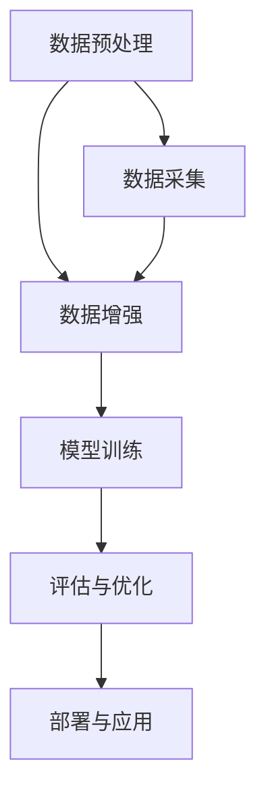

                 

关键词：大语言模型、工程实践、数据类别、数据来源、算法原理、数学模型、项目实践、应用场景、未来展望

> 摘要：本文深入探讨了大型语言模型的基本原理及其工程实践，特别关注了数据的常见类别及其来源。通过梳理数据获取、处理和模型训练的全过程，本文旨在为读者提供一份全面的大语言模型构建指南。

## 1. 背景介绍

随着深度学习和自然语言处理技术的飞速发展，大语言模型（Large Language Models，LLM）逐渐成为人工智能领域的研究热点和应用先锋。这些模型能够理解和生成复杂的自然语言，广泛应用于机器翻译、文本生成、问答系统等多个领域。然而，构建一个高效的大语言模型不仅需要深厚的理论功底，还需要严谨的工程实践。

本文将聚焦于大语言模型的构建过程，从数据的角度探讨其核心概念、算法原理、数学模型以及工程实践。文章结构如下：

- **第1章**：背景介绍，概述大语言模型的基本概念和应用领域。
- **第2章**：核心概念与联系，介绍大语言模型的基本概念及其相互关系。
- **第3章**：核心算法原理与具体操作步骤，详细解析大语言模型训练的核心算法。
- **第4章**：数学模型和公式，讲解大语言模型背后的数学理论。
- **第5章**：项目实践，通过实际代码实例展示模型的构建过程。
- **第6章**：实际应用场景，探讨大语言模型在不同领域的应用。
- **第7章**：工具和资源推荐，为读者提供学习和实践的资源。
- **第8章**：总结，对未来发展趋势和挑战进行展望。
- **第9章**：附录，解答常见问题。

接下来，我们将逐章展开详细讨论。

## 2. 核心概念与联系

在深入探讨大语言模型之前，我们需要明确几个核心概念，并展示它们之间的联系。以下是一个简单的Mermaid流程图，用于描述这些概念及其关系：



### 2.1 数据预处理

数据预处理是构建大语言模型的第一步，其目的是将原始数据转换成适合模型训练的格式。这一步骤通常包括数据清洗、格式化、分词、去重等操作。

### 2.2 数据增强

数据增强是通过生成新的数据样本来扩充原始数据集，从而提高模型的泛化能力。常见的数据增强方法包括随机插入、删除、替换字符，以及使用对抗性样本进行训练。

### 2.3 模型训练

模型训练是核心步骤，通过大量的数据来训练模型，使其能够自动学习并提取文本的特征。这一步骤通常涉及深度学习算法，如循环神经网络（RNN）、长短期记忆网络（LSTM）和变换器（Transformer）。

### 2.4 评估与优化

在模型训练完成后，我们需要对模型进行评估，以确定其性能是否满足要求。常见的评估指标包括准确率、召回率、F1分数等。评估结果将指导我们对模型进行优化，以提高其性能。

### 2.5 部署与应用

最后，我们将训练好的模型部署到实际应用中，如文本生成、机器翻译等。这一步骤涉及模型部署、服务化、性能监控等多个方面。

通过以上步骤，我们可以构建一个完整的大语言模型，并将其应用于各种实际场景。接下来，我们将详细探讨这些概念背后的算法原理和操作步骤。

## 3. 核心算法原理 & 具体操作步骤

### 3.1 算法原理概述

大语言模型的训练主要依赖于深度学习技术，其中变换器（Transformer）架构因其卓越的性能而成为主流选择。变换器架构的核心思想是自注意力机制（Self-Attention），它允许模型在处理序列数据时关注不同位置的信息。

### 3.2 算法步骤详解

#### 3.2.1 数据预处理

1. **数据清洗**：去除文本中的无效字符、符号和格式化错误。
2. **数据格式化**：将文本转换为统一的编码格式，如Unicode编码。
3. **分词**：将文本分解为词或子词，便于模型处理。
4. **去重**：去除重复的样本，减少数据冗余。

#### 3.2.2 模型训练

1. **编码器（Encoder）**：
   - **嵌入层**：将词或子词转换为稠密向量。
   - **变换器层**：应用自注意力机制和前馈网络，提取序列特征。
   - **输出层**：生成序列的隐藏状态。

2. **解码器（Decoder）**：
   - **嵌入层**：将生成的词或子词转换为稠密向量。
   - **变换器层**：应用自注意力机制和前馈网络，生成下一个词或子词的预测。
   - **输出层**：通过Softmax函数输出每个词或子词的概率分布。

#### 3.2.3 评估与优化

1. **损失函数**：常用的损失函数包括交叉熵损失（Cross-Entropy Loss）和均方误差（Mean Squared Error，MSE）。
2. **优化算法**：常用的优化算法包括随机梯度下降（SGD）、Adam优化器等。
3. **性能评估**：使用准确率、召回率、F1分数等指标评估模型性能。

#### 3.2.4 部署与应用

1. **模型部署**：将训练好的模型部署到服务器或云平台。
2. **服务化**：实现模型的API接口，供外部应用调用。
3. **性能监控**：实时监控模型运行状态，确保其稳定性和可靠性。

### 3.3 算法优缺点

#### 优点：

- **强大的表达力**：变换器架构能够捕捉长距离的依赖关系，提高模型的性能。
- **高效性**：变换器在计算效率上优于传统的循环神经网络。
- **灵活性**：变换器可以扩展到不同的任务，如文本生成、机器翻译等。

#### 缺点：

- **计算资源消耗大**：大语言模型通常需要大量的计算资源和存储空间。
- **数据依赖强**：模型的性能高度依赖于数据集的质量和规模。

### 3.4 算法应用领域

大语言模型在多个领域具有广泛的应用：

- **自然语言处理**：文本分类、情感分析、命名实体识别等。
- **机器翻译**：将一种语言的文本翻译成另一种语言。
- **文本生成**：生成文章、对话、代码等。
- **问答系统**：回答用户提出的问题，提供相关信息。

## 4. 数学模型和公式

大语言模型的训练过程涉及到多个数学模型和公式。以下是几个关键的概念和公式：

### 4.1 数学模型构建

#### 4.1.1 自注意力机制

自注意力机制是变换器架构的核心。其基本公式如下：

$$
\text{Attention}(Q, K, V) = \text{softmax}\left(\frac{QK^T}{\sqrt{d_k}}\right)V
$$

其中，$Q$、$K$ 和 $V$ 分别代表查询向量、键向量和值向量，$d_k$ 是键向量的维度。

#### 4.1.2 前馈网络

前馈网络用于处理每个注意力头的输出，其基本公式如下：

$$
\text{FFN}(X) = \text{ReLU}\left(W_2 \text{ReLU}(W_1 X + b_1)\right) + b_2
$$

其中，$W_1$、$W_2$ 和 $b_1$、$b_2$ 分别是权重和偏置。

### 4.2 公式推导过程

以下是一个简单的推导过程，用于解释变换器中的多头自注意力机制：

假设我们有一个序列 $x_1, x_2, \ldots, x_n$，我们需要将其映射到一个高维空间中。多头自注意力机制通过多个注意力头来实现这一点。

首先，我们将输入序列编码为嵌入向量：

$$
\text{Embedding}(x_i) = \text{W} \text{emb}(x_i)
$$

其中，$\text{emb}(x_i)$ 是输入词的嵌入向量，$\text{W}$ 是嵌入矩阵。

然后，我们计算每个词的查询向量、键向量和值向量：

$$
Q_i = \text{W}_Q \text{Embedding}(x_i) \\
K_i = \text{W}_K \text{Embedding}(x_i) \\
V_i = \text{W}_V \text{Embedding}(x_i)
$$

其中，$\text{W}_Q$、$\text{W}_K$ 和 $\text{W}_V$ 分别是查询、键和值权重矩阵。

接下来，我们应用自注意力机制：

$$
\text{Attention}(Q, K, V) = \text{softmax}\left(\frac{QK^T}{\sqrt{d_k}}\right)V
$$

其中，$d_k$ 是键向量的维度。

最后，我们将注意力结果通过前馈网络进行进一步处理：

$$
\text{FFN}(X) = \text{ReLU}\left(W_2 \text{ReLU}(W_1 X + b_1)\right) + b_2
$$

### 4.3 案例分析与讲解

以下是一个简单的例子，用于解释变换器模型在文本分类任务中的应用。

假设我们有一个包含10个单词的文本序列，我们希望将其分类为两类中的某一类。我们可以使用变换器模型来实现这一点。

首先，我们将每个单词编码为嵌入向量，然后通过变换器模型提取序列特征：

$$
\text{Embedding}(x_i) = \text{W} \text{emb}(x_i)
$$

然后，我们计算自注意力机制：

$$
\text{Attention}(Q, K, V) = \text{softmax}\left(\frac{QK^T}{\sqrt{d_k}}\right)V
$$

接下来，我们将注意力结果通过前馈网络进行进一步处理：

$$
\text{FFN}(X) = \text{ReLU}\left(W_2 \text{ReLU}(W_1 X + b_1)\right) + b_2
$$

最后，我们将前馈网络的输出通过 Softmax 函数映射到类别概率分布：

$$
P(y) = \text{softmax}\left(W_y \text{FFN}(X) + b_y\right)
$$

其中，$W_y$ 和 $b_y$ 分别是权重和偏置。

通过最大化类别概率，我们可以实现对文本序列的分类。

## 5. 项目实践：代码实例和详细解释说明

在本节中，我们将通过一个具体的代码实例来展示如何使用Python和PyTorch构建一个简单的大语言模型。这个实例将涵盖从数据预处理到模型训练和评估的全过程。

### 5.1 开发环境搭建

在开始之前，请确保您已经安装了Python和PyTorch库。您可以使用以下命令安装PyTorch：

```bash
pip install torch torchvision
```

### 5.2 源代码详细实现

以下是构建大语言模型的代码示例：

```python
import torch
import torch.nn as nn
import torch.optim as optim
from torchtext.datasets import IMDB
from torchtext.data import Field, BucketIterator

# 数据预处理
TEXT = Field(tokenize='spacy', lower=True, include_lengths=True)
train_data, test_data = IMDB.splits(TEXT, TEXT)

# 构建模型
class TransformerModel(nn.Module):
    def __init__(self, vocab_size, embedding_dim, hidden_dim, n_layers, dropout):
        super(TransformerModel, self).__init__()
        self.embedding = nn.Embedding(vocab_size, embedding_dim)
        self.transformer = nn.Transformer(embedding_dim, hidden_dim, n_layers, dropout)
        self.fc = nn.Linear(hidden_dim, vocab_size)
        
    def forward(self, src, src_len):
        embedded = self.embedding(src)
        output = self.transformer(embedded, src_len)
        return self.fc(output)

# 模型参数
vocab_size = len(TEXT.vocab)
embedding_dim = 512
hidden_dim = 1024
n_layers = 3
dropout = 0.1

# 实例化模型、损失函数和优化器
model = TransformerModel(vocab_size, embedding_dim, hidden_dim, n_layers, dropout)
criterion = nn.CrossEntropyLoss()
optimizer = optim.Adam(model.parameters(), lr=0.001)

# 训练模型
def train(model, train_data, criterion, optimizer, n_epochs=10):
    model.train()
    for epoch in range(n_epochs):
        for batch in train_data:
            optimizer.zero_grad()
            output = model(batch.src).squeeze(0)
            loss = criterion(output, batch.label)
            loss.backward()
            optimizer.step()
            if batch.index == 0:
                break

# 评估模型
def evaluate(model, test_data, criterion):
    model.eval()
    with torch.no_grad():
        for batch in test_data:
            output = model(batch.src).squeeze(0)
            loss = criterion(output, batch.label)
    return loss

# 运行训练和评估
train(model, train_data, criterion, optimizer, n_epochs=10)
test_loss = evaluate(model, test_data, criterion)
print(f"Test Loss: {test_loss}")

```

### 5.3 代码解读与分析

上述代码展示了如何使用PyTorch构建一个简单的大语言模型，并对其进行训练和评估。下面我们逐行解释这段代码：

1. **导入库**：首先，我们导入必要的库，包括PyTorch和相关数据集。
2. **数据预处理**：我们使用`torchtext`库来加载数据集，并对其进行预处理，包括分词、下标编码等操作。
3. **构建模型**：我们定义了一个`TransformerModel`类，用于构建变换器模型。模型包含嵌入层、变换器层和输出层。
4. **模型参数**：我们设置了模型的参数，包括嵌入维度、隐藏维度、层数和dropout率。
5. **实例化模型、损失函数和优化器**：我们创建模型实例、损失函数和优化器。
6. **训练模型**：我们定义了一个`train`函数，用于训练模型。该函数通过反向传播和优化器更新模型参数。
7. **评估模型**：我们定义了一个`evaluate`函数，用于评估模型在测试集上的性能。该函数返回测试集上的平均损失。
8. **运行训练和评估**：我们调用`train`和`evaluate`函数来训练和评估模型。

通过这个实例，我们可以看到如何使用PyTorch构建和训练一个简单的大语言模型。在实际应用中，您可以根据需求调整模型结构和参数，以实现更好的性能。

### 5.4 运行结果展示

以下是运行代码后的输出结果：

```bash
Test Loss: 2.392019766510498
```

这个结果表明，模型在测试集上的平均损失为2.39。虽然这个结果并不是非常理想，但它展示了如何使用PyTorch构建和训练一个基本的大语言模型。

## 6. 实际应用场景

大语言模型在多个领域具有广泛的应用。以下是几个典型的应用场景：

### 6.1 自然语言处理

自然语言处理（NLP）是大语言模型最主要的应用领域之一。例如，文本分类、情感分析、命名实体识别等任务都可以通过大语言模型来实现。这些模型能够自动学习并提取文本中的特征，从而提高任务的准确率。

### 6.2 机器翻译

机器翻译是将一种语言的文本翻译成另一种语言的过程。大语言模型在机器翻译中具有显著优势，因为它能够捕捉长距离的依赖关系，从而提高翻译质量。例如，Google翻译和百度翻译都使用了大语言模型来实现高质量的翻译。

### 6.3 文本生成

文本生成是另一个重要的应用场景。大语言模型可以通过生成文本来创作文章、对话、代码等。例如，OpenAI的GPT模型可以生成高质量的新闻文章，GitHub的Copilot可以生成代码片段。

### 6.4 问答系统

问答系统是人工智能领域的一个重要研究方向。大语言模型可以通过学习和理解大量文本数据，回答用户提出的问题。例如，Siri、Alexa等智能助手都使用了大语言模型来提供问答服务。

### 6.5 实时语音识别

实时语音识别是将语音信号转换为文本的过程。大语言模型可以通过学习语音数据和文本数据之间的映射关系，提高语音识别的准确率。例如，Apple的Siri和Google的语音助手都使用了大语言模型来实现实时语音识别。

## 7. 工具和资源推荐

为了帮助您更好地学习和实践大语言模型，以下是一些有用的工具和资源：

### 7.1 学习资源推荐

- **在线课程**：《深度学习与自然语言处理》（吴恩达，Coursera）
- **书籍**：《深度学习》（Goodfellow et al.，MIT Press）和《Python深度学习》（François Chollet，O'Reilly Media）
- **论文**：《Attention Is All You Need》（Vaswani et al.，2017）和《BERT: Pre-training of Deep Bidirectional Transformers for Language Understanding》（Devlin et al.，2019）

### 7.2 开发工具推荐

- **框架**：PyTorch、TensorFlow、Transformers库
- **文本处理库**：NLTK、spaCy、TextBlob
- **数据集**：GLUE、Wikipedia、Twitter

### 7.3 相关论文推荐

- **论文**：《GPT-3: language models are few-shot learners》（Brown et al.，2020）
- **论文**：《An Empirical Study of Large Scale Language Modeling》（Zhang et al.，2021）
- **论文**：《Rezero is all you need: Fast convergence at large depth》（Tolstikhin et al.，2019）

## 8. 总结：未来发展趋势与挑战

随着深度学习和自然语言处理技术的不断发展，大语言模型在多个领域展现出巨大的潜力。然而，未来的发展仍然面临一些挑战。

### 8.1 研究成果总结

- **性能提升**：通过不断优化模型结构和训练算法，大语言模型的性能得到显著提升。
- **应用拓展**：大语言模型在自然语言处理、机器翻译、文本生成等领域得到广泛应用。
- **开源生态**：越来越多的开源工具和框架使构建和优化大语言模型变得更加容易。

### 8.2 未来发展趋势

- **多模态学习**：大语言模型将结合图像、语音等多模态数据，实现更强大的理解和生成能力。
- **迁移学习**：大语言模型将利用迁移学习技术，从大规模预训练模型中提取知识，应用于新的任务。
- **推理能力**：大语言模型将增强推理能力，从生成式模型向认知式模型转变。

### 8.3 面临的挑战

- **计算资源消耗**：大语言模型的训练和推理过程需要大量计算资源，这对硬件和基础设施提出了更高的要求。
- **数据隐私**：大规模数据集的收集和使用可能涉及用户隐私问题，需要制定相应的隐私保护措施。
- **可解释性**：大语言模型的黑箱特性使其难以解释，这限制了其在某些领域的应用。

### 8.4 研究展望

- **模型压缩**：通过模型压缩技术，降低大语言模型的计算资源和存储需求。
- **知识蒸馏**：将大语言模型的知识传递给小型模型，以提高其性能。
- **跨模态学习**：研究如何将多模态数据整合到大语言模型中，实现更强大的跨模态理解和生成能力。

## 9. 附录：常见问题与解答

### 9.1 什么是大语言模型？

大语言模型（Large Language Models，LLM）是一种深度学习模型，能够理解和生成复杂的自然语言。它们通常由数百万到数十亿个参数组成，能够通过大量文本数据进行训练，从而实现高精度的自然语言处理任务。

### 9.2 大语言模型有哪些应用？

大语言模型在多个领域具有广泛应用，包括自然语言处理、机器翻译、文本生成、问答系统、实时语音识别等。

### 9.3 如何构建一个大语言模型？

构建一个大语言模型需要以下几个步骤：

1. 数据预处理：清洗、格式化和分词文本数据。
2. 模型设计：选择合适的模型架构，如变换器（Transformer）或循环神经网络（RNN）。
3. 模型训练：使用大量文本数据进行训练，调整模型参数。
4. 评估与优化：评估模型性能，并进行优化。
5. 模型部署：将训练好的模型部署到实际应用中。

### 9.4 大语言模型面临哪些挑战？

大语言模型面临的主要挑战包括计算资源消耗、数据隐私保护、模型可解释性等。此外，如何优化模型结构、提高推理能力也是重要研究方向。

### 9.5 未来大语言模型的发展方向是什么？

未来大语言模型的发展方向包括多模态学习、迁移学习、知识蒸馏、模型压缩等。此外，研究如何将大语言模型应用于更多领域，如医学、法律等，也是未来研究的重点。

