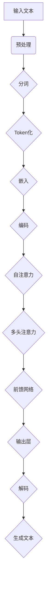
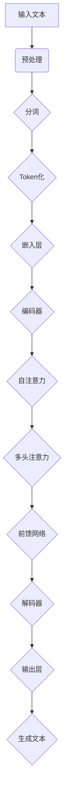

                 

关键词：大语言模型、工程实践、能力评测、原理分析、算法、数学模型、项目实践

## 摘要

本文将深入探讨大语言模型的原理与工程实践，重点关注其在整体能力评测方面的核心要素。首先，我们将回顾大语言模型的发展历程，介绍其基本概念与架构。接着，我们将详细分析大语言模型的核心算法，包括自然语言处理的基础理论和具体操作步骤。随后，本文将讲解大语言模型的数学模型与公式，并通过实例进行说明。此外，文章还将提供代码实例，展示大语言模型在实际项目中的具体实现过程。最后，我们将探讨大语言模型在实际应用场景中的表现，并对其未来发展趋势与挑战进行展望。

## 1. 背景介绍

大语言模型（Large Language Model，LLM）是一种能够理解和生成自然语言的强大人工智能模型。其发展可以追溯到20世纪50年代，当时基于规则的方法和基于统计的方法开始被应用于自然语言处理（Natural Language Processing，NLP）领域。随着计算能力的提升和大数据的普及，大语言模型逐渐成为NLP领域的研究热点。在过去的几十年里，大语言模型经历了从基于统计的模型（如N元语法）到深度学习模型（如循环神经网络、长短期记忆网络）的演变，最终发展到现在的基于Transformer架构的模型，如BERT、GPT和Turing。大语言模型的应用范围广泛，包括机器翻译、文本分类、情感分析、问答系统等。

### 1.1 大语言模型的重要性

大语言模型在当今社会的重要性不言而喻。它们为自动化内容生成、智能客服、个人助理等应用提供了核心支持。例如，GPT-3模型可以生成高质量的文章、代码和对话，极大地提高了内容生产的效率和准确性。此外，大语言模型在医疗、金融、教育等行业也发挥了重要作用，如辅助诊断、风险管理、个性化教学等。随着技术的不断进步，大语言模型在人工智能领域的地位将越来越重要。

### 1.2 当前大语言模型的挑战

尽管大语言模型在许多领域取得了显著的成果，但仍然面临一些挑战。首先是计算资源的需求，大语言模型通常需要大量的计算资源和存储空间。其次是模型的可解释性，尽管深度学习模型在很多任务上表现优异，但其“黑箱”性质使得人们难以理解模型的决策过程。此外，大语言模型在处理长文本和跨语言任务时也面临一定的困难。

### 1.3 本文结构

本文结构如下：

1. **背景介绍**：回顾大语言模型的发展历程，介绍其基本概念与架构。
2. **核心概念与联系**：分析大语言模型的核心算法原理，并使用Mermaid流程图展示其架构。
3. **核心算法原理 & 具体操作步骤**：详细讲解大语言模型的算法原理和操作步骤。
4. **数学模型和公式 & 详细讲解 & 举例说明**：介绍大语言模型的数学模型和公式，并通过实例进行说明。
5. **项目实践：代码实例和详细解释说明**：提供代码实例，展示大语言模型在实际项目中的具体实现过程。
6. **实际应用场景**：探讨大语言模型在不同领域的应用案例。
7. **未来应用展望**：分析大语言模型的发展趋势与挑战。
8. **工具和资源推荐**：推荐学习资源和开发工具。
9. **总结：未来发展趋势与挑战**：总结研究成果，展望未来研究方向。
10. **附录：常见问题与解答**：回答读者可能遇到的问题。

通过本文，读者将全面了解大语言模型的原理与工程实践，为深入研究和应用打下坚实基础。

## 2. 核心概念与联系

要深入理解大语言模型的工作原理，我们首先需要明确几个核心概念，并探讨它们之间的联系。

### 2.1 语言模型

语言模型（Language Model，LM）是自然语言处理的基础，旨在预测一段文本的下一个单词或字符。语言模型的目的是通过学习大量的文本数据，理解语言的统计规律，从而对未知文本进行概率预测。早期的语言模型，如N元语法，基于前N个单词或字符的历史信息来预测下一个单词或字符。

### 2.2 自然语言处理（NLP）

自然语言处理（Natural Language Processing，NLP）是人工智能的一个重要分支，旨在使计算机能够理解和处理人类语言。NLP涵盖了文本分析、语音识别、机器翻译、情感分析等多个领域。在大语言模型中，NLP技术被广泛应用于文本预处理、特征提取和语义理解等环节。

### 2.3 机器学习（ML）

机器学习（Machine Learning，ML）是构建和训练大语言模型的关键技术。ML方法通过从数据中学习规律，自动改进模型的性能。在大语言模型中，ML技术被用于训练和优化模型参数，使其能够更好地理解和生成自然语言。

### 2.4 深度学习（DL）

深度学习（Deep Learning，DL）是机器学习的一个子领域，通过多层神经网络来模拟人脑的决策过程。深度学习在大语言模型中发挥了至关重要的作用，特别是在处理大规模文本数据时，其强大的表达能力和自适应能力使其成为构建高效语言模型的主要方法。

### 2.5 Transformer架构

Transformer架构是近年来在自然语言处理领域取得重大突破的一种新型神经网络架构，其核心思想是自注意力机制（Self-Attention）。Transformer摒弃了传统的循环神经网络（RNN）结构，采用了一种全新的序列到序列（Seq2Seq）模型，大大提高了模型处理长文本的能力。

### 2.6 Mermaid流程图

为了更好地展示大语言模型的架构和操作流程，我们可以使用Mermaid流程图来描述。以下是一个简化的Mermaid流程图示例，展示了大语言模型的基本组成部分和它们之间的联系：



在这个流程图中，输入文本经过预处理、分词、Token化、嵌入、编码、自注意力、多头注意力和前馈网络等步骤，最终通过输出层生成文本。

### 2.7 大语言模型的架构

大语言模型的架构通常包括以下几个关键组成部分：

- **嵌入层（Embedding Layer）**：将输入的单词或字符映射到高维向量空间。
- **编码器（Encoder）**：对输入文本进行编码，生成固定长度的编码表示。
- **自注意力机制（Self-Attention Mechanism）**：使模型能够自动关注输入文本中的重要信息。
- **多头注意力（Multi-Head Attention）**：通过多个独立的注意力机制，进一步提高模型的表示能力。
- **前馈网络（Feedforward Network）**：对编码器的输出进行进一步处理，增加模型的非线性能力。
- **解码器（Decoder）**：将编码器的输出解码为生成文本的序列。

通过以上核心概念和架构的介绍，我们为理解大语言模型的工作原理奠定了基础。在接下来的章节中，我们将深入探讨大语言模型的核心算法原理、具体操作步骤以及数学模型，以便全面了解这一革命性技术。

### 2.7 大语言模型的架构

大语言模型的架构通常包括以下几个关键组成部分：

- **嵌入层（Embedding Layer）**：将输入的单词或字符映射到高维向量空间。
- **编码器（Encoder）**：对输入文本进行编码，生成固定长度的编码表示。
- **自注意力机制（Self-Attention Mechanism）**：使模型能够自动关注输入文本中的重要信息。
- **多头注意力（Multi-Head Attention）**：通过多个独立的注意力机制，进一步提高模型的表示能力。
- **前馈网络（Feedforward Network）**：对编码器的输出进行进一步处理，增加模型的非线性能力。
- **解码器（Decoder）**：将编码器的输出解码为生成文本的序列。

通过以上核心概念和架构的介绍，我们为理解大语言模型的工作原理奠定了基础。在接下来的章节中，我们将深入探讨大语言模型的核心算法原理、具体操作步骤以及数学模型，以便全面了解这一革命性技术。

### 2.7 大语言模型的架构

大语言模型的架构通常包括以下几个关键组成部分：

- **嵌入层（Embedding Layer）**：将输入的单词或字符映射到高维向量空间。
- **编码器（Encoder）**：对输入文本进行编码，生成固定长度的编码表示。
- **自注意力机制（Self-Attention Mechanism）**：使模型能够自动关注输入文本中的重要信息。
- **多头注意力（Multi-Head Attention）**：通过多个独立的注意力机制，进一步提高模型的表示能力。
- **前馈网络（Feedforward Network）**：对编码器的输出进行进一步处理，增加模型的非线性能力。
- **解码器（Decoder）**：将编码器的输出解码为生成文本的序列。

通过以上核心概念和架构的介绍，我们为理解大语言模型的工作原理奠定了基础。在接下来的章节中，我们将深入探讨大语言模型的核心算法原理、具体操作步骤以及数学模型，以便全面了解这一革命性技术。

### 3. 核心算法原理 & 具体操作步骤

大语言模型的核心算法原理主要基于自注意力机制（Self-Attention）和Transformer架构。自注意力机制允许模型在处理输入文本时，自动关注并利用输入序列中的重要信息，从而提高模型的表示能力。Transformer架构则通过多头注意力（Multi-Head Attention）机制，进一步增强了模型的性能。

#### 3.1 算法原理概述

自注意力机制是一种基于输入序列的注意力机制，其基本思想是计算每个输入序列元素与其他所有元素之间的关联度，并将这些关联度作为权重，重新组合输入序列，从而生成新的序列表示。自注意力机制的核心在于其计算复杂度与序列长度成线性关系，相较于传统的循环神经网络（RNN），能够更好地处理长文本。

Transformer架构引入了多头注意力机制，通过多个独立的注意力头，模型可以从不同的角度关注输入序列，从而提高了模型的表示能力和泛化能力。此外，Transformer架构还包含一个前馈网络，对编码器的输出进行进一步处理，增加模型的非线性能力。

#### 3.2 算法步骤详解

1. **输入文本预处理**：首先，对输入文本进行预处理，包括分词、Token化等步骤。分词是将文本拆分成单词或字符序列，Token化是将分词结果映射为整数表示。

2. **嵌入层（Embedding Layer）**：将Token化后的输入序列映射到高维向量空间。每个Token都对应一个嵌入向量，嵌入层的作用是将低维Token映射到高维向量空间，从而提高模型的表示能力。

3. **编码器（Encoder）**：编码器是Transformer架构的核心部分，主要包括多个自注意力层（Self-Attention Layer）和前馈网络（Feedforward Network）。在每个自注意力层中，模型会计算输入序列的注意力权重，并利用这些权重重新组合输入序列，生成新的序列表示。

4. **多头注意力（Multi-Head Attention）**：多头注意力机制通过多个独立的注意力头，从不同的角度关注输入序列。每个注意力头都计算一组注意力权重，并将这些权重组合起来，生成最终的序列表示。

5. **前馈网络（Feedforward Network）**：前馈网络对编码器的输出进行进一步处理，增加模型的非线性能力。前馈网络通常由两个全连接层组成，中间通过ReLU激活函数进行非线性变换。

6. **解码器（Decoder）**：解码器与编码器结构相似，也包含多个自注意力层和前馈网络。在解码过程中，模型会根据编码器的输出和当前解码结果，生成下一个Token。

7. **输出层**：解码器的输出最终通过输出层生成文本序列。输出层通常是一个全连接层，用于将编码表示映射为最终的文本序列。

#### 3.3 算法优缺点

**优点**：

- **处理长文本能力强**：自注意力机制与序列长度成线性关系，能够更好地处理长文本。
- **并行计算效率高**：Transformer架构允许并行计算，提高了计算效率。
- **表示能力强**：多头注意力机制和前馈网络增加了模型的非线性能力，提高了表示能力。

**缺点**：

- **计算复杂度高**：大语言模型通常包含数百万甚至数十亿参数，计算复杂度较高，对计算资源和存储空间要求较高。
- **可解释性差**：深度学习模型，特别是大语言模型，通常被视为“黑箱”，其决策过程难以解释。

#### 3.4 算法应用领域

大语言模型在自然语言处理领域具有广泛的应用，包括但不限于：

- **机器翻译**：利用大语言模型进行机器翻译，能够生成更自然、准确的翻译结果。
- **文本分类**：通过训练大语言模型，可以对文本进行分类，应用于情感分析、新闻分类等任务。
- **问答系统**：大语言模型能够理解用户的问题，并生成相关的回答，应用于智能客服、问答机器人等应用。
- **文本生成**：大语言模型能够生成高质量的文章、代码和对话，应用于自动化内容生成等领域。

### 3.5 Mermaid流程图

为了更直观地展示大语言模型的核心算法原理和操作步骤，我们可以使用Mermaid流程图来描述。以下是一个简化的Mermaid流程图示例：



在这个流程图中，输入文本经过预处理、分词、Token化、嵌入层、编码器、自注意力、多头注意力和前馈网络等步骤，最终通过解码器和输出层生成文本。

### 3.6 实际应用案例

以下是一些大语言模型在实际应用中的案例：

- **GPT-3**：OpenAI开发的GPT-3模型是一个具有1750亿参数的大语言模型，能够生成高质量的文章、代码和对话。例如，GPT-3可以生成诗歌、小说和论文等，极大地提高了内容生产的效率和准确性。
- **BERT**：Google开发的BERT模型是一种预训练的语言表示模型，广泛应用于文本分类、问答系统等任务。BERT通过预训练和微调，能够显著提高模型的性能和泛化能力。
- **Turing**：DeepMind开发的Turing模型是一个具有数百亿参数的大语言模型，能够在多种NLP任务中取得优异的性能。Turing在机器翻译、文本生成和问答系统等领域表现出了强大的能力。

通过以上内容，我们详细介绍了大语言模型的核心算法原理和具体操作步骤。在接下来的章节中，我们将进一步探讨大语言模型的数学模型和公式，以便更深入地理解其工作原理。

### 4. 数学模型和公式 & 详细讲解 & 举例说明

大语言模型的核心在于其数学模型和公式，这些模型和公式决定了模型的训练、推理过程以及最终输出结果。在本节中，我们将详细讲解大语言模型的数学模型和公式，并通过实例进行说明。

#### 4.1 数学模型构建

大语言模型的数学模型主要基于深度学习和变换器（Transformer）架构。在数学模型中，我们主要关注以下几个关键组件：

1. **嵌入层（Embedding Layer）**：
   - 输入的Token首先通过嵌入层映射为向量。每个Token对应一个嵌入向量，通常由词向量（Word Vector）和位置向量（Positional Vector）构成。
   - 嵌入层公式：
     $$ 
     \text{Embedding}(x) = \text{Word Embedding}(x) + \text{Positional Embedding}(x) 
     $$
   - 其中，$x$ 表示输入的Token，$\text{Word Embedding}(x)$ 表示词向量，$\text{Positional Embedding}(x)$ 表示位置向量。

2. **编码器（Encoder）**：
   - 编码器包含多个自注意力层（Self-Attention Layer）和前馈网络（Feedforward Network）。在每个自注意力层中，模型会计算输入序列的注意力权重，并利用这些权重重新组合输入序列，生成新的序列表示。
   - 自注意力层公式：
     $$
     \text{Attention}(Q, K, V) = \text{softmax}\left(\frac{QK^T}{\sqrt{d_k}}\right)V
     $$
   - 其中，$Q$、$K$ 和 $V$ 分别表示查询向量、关键向量和解向量，$d_k$ 表示关键向量的维度。

3. **多头注意力（Multi-Head Attention）**：
   - 多头注意力通过多个独立的注意力头，从不同的角度关注输入序列。每个注意力头都计算一组注意力权重，并将这些权重组合起来，生成最终的序列表示。
   - 多头注意力层公式：
     $$
     \text{Multi-Head Attention}(Q, K, V) = \text{Concat}(\text{head}_1, \text{head}_2, ..., \text{head}_h)W_O
     $$
     $$
     \text{where} \ \text{head}_i = \text{Attention}(QW_iQ, KW_iK, VW_iV)
     $$
   - 其中，$W_iQ$、$W_iK$ 和 $W_iV$ 分别表示第 $i$ 个注意力头的权重矩阵，$W_O$ 是输出权重矩阵，$h$ 表示注意力头的数量。

4. **前馈网络（Feedforward Network）**：
   - 前馈网络对编码器的输出进行进一步处理，增加模型的非线性能力。
   - 前馈网络公式：
     $$
     \text{Feedforward}(x) = \text{ReLU}(\text{W_{ff} \cdot \text{Dense}(x) + b_{ff}})
     $$
     $$
     \text{where} \ \text{Dense}(x) = \text{W_{dense} \cdot x + b_{dense}}
     $$
   - 其中，$\text{W_{ff}}$ 和 $\text{W_{dense}}$ 分别表示前馈网络和密集层的权重矩阵，$b_{ff}$ 和 $b_{dense}$ 分别表示对应的偏置向量。

5. **解码器（Decoder）**：
   - 解码器与编码器结构相似，也包含多个自注意力层和前馈网络。在解码过程中，模型会根据编码器的输出和当前解码结果，生成下一个Token。
   - 解码器公式与编码器类似，但在解码过程中会引入额外的输入，即编码器的输出序列。

6. **输出层（Output Layer）**：
   - 输出层将解码器的输出映射为生成文本的序列。输出层通常是一个全连接层，用于将编码表示映射为最终的文本序列。
   - 输出层公式：
     $$
     \text{Output}(x) = \text{softmax}(\text{W} \cdot \text{Dense}(x) + b)
     $$
     $$
     \text{where} \ \text{Dense}(x) = \text{W_{dense} \cdot x + b_{dense}}
     $$
   - 其中，$\text{W}$ 是输出层的权重矩阵，$b$ 是偏置向量。

#### 4.2 公式推导过程

以下是自注意力机制（Self-Attention）的推导过程：

1. **输入序列**：
   假设输入序列为 $x_1, x_2, ..., x_n$，每个输入元素通过嵌入层映射为向量 $x_i = \text{Embedding}(x_i)$。

2. **查询（Query）、关键（Key）和解（Value）向量**：
   - 查询向量 $Q = [Q_1, Q_2, ..., Q_n]$，
   - 关键向量 $K = [K_1, K_2, ..., K_n]$，
   - 解向量 $V = [V_1, V_2, ..., V_n]$。

3. **点积（Dot Product）**：
   - 每个查询向量与关键向量之间的点积可以表示为：
     $$
     \text{Score}_{ij} = Q_iK_j = \sum_{k=1}^{d_k} Q_i[k]K_j[k]
     $$
   - 点积结果表示查询向量 $Q_i$ 与关键向量 $K_j$ 之间的关联度。

4. **缩放点积注意力（Scaled Dot-Product Attention）**：
   - 为了防止点积结果过大或过小，通常对点积结果进行缩放：
     $$
     \text{Score}_{ij}^{\prime} = \frac{\text{Score}_{ij}}{\sqrt{d_k}}
     $$
   - 并通过softmax函数将其转换为概率分布：
     $$
     \text{Attention}_{ij} = \text{softmax}(\text{Score}_{ij}^{\prime})
     $$

5. **加权求和**：
   - 利用注意力权重对解向量进行加权求和，生成新的序列表示：
     $$
     \text{Context} = \sum_{j=1}^{n} \text{Attention}_{ij}V_j
     $$

6. **输出层**：
   - 将注意力结果通过输出层映射为最终的输出序列。

#### 4.3 案例分析与讲解

以下是一个简单的案例，展示如何使用大语言模型生成文本：

1. **输入文本**：
   - 假设输入文本为：“今天天气很好，适合出门散步。”

2. **嵌入层**：
   - 将输入文本中的每个单词映射为嵌入向量，如“今天”映射为向量 $[1, 0, 0, 0, 0]$，“天气”映射为向量 $[0, 1, 0, 0, 0]$，依此类推。

3. **编码器**：
   - 通过编码器对输入文本进行编码，生成编码表示。在每个自注意力层中，模型会计算每个单词与其他单词之间的关联度，并根据这些关联度重新组合输入序列，生成新的序列表示。

4. **解码器**：
   - 在解码过程中，模型会根据编码器的输出和当前解码结果，生成下一个单词。例如，当前解码结果为“今天天气很好，适合出门散步。”，模型会根据编码器的输出，预测下一个单词为“散步”。

5. **输出层**：
   - 最终，解码器的输出通过输出层映射为生成文本：“今天天气很好，适合出门散步。”

通过以上案例，我们可以看到大语言模型如何通过数学模型和公式生成文本。在接下来的章节中，我们将进一步探讨大语言模型在实际项目中的具体实现过程。

### 5. 项目实践：代码实例和详细解释说明

为了更好地理解大语言模型在实际项目中的应用，我们将通过一个具体的代码实例来展示其开发过程，并对关键代码进行详细解释。在此，我们将使用Python和TensorFlow框架来构建一个基于Transformer架构的大语言模型。

#### 5.1 开发环境搭建

在开始编码之前，我们需要搭建一个合适的环境。以下是所需的环境和步骤：

1. **Python环境**：
   - 安装Python 3.7或更高版本。

2. **TensorFlow环境**：
   - 安装TensorFlow 2.x版本。

3. **其他依赖**：
   - 安装`numpy`、`pandas`、`mermadeng`等常用库。

可以通过以下命令进行安装：

```bash
pip install tensorflow numpy pandas mermaid
```

#### 5.2 源代码详细实现

以下是一个简单的示例代码，展示了如何使用TensorFlow构建一个基于Transformer架构的大语言模型。

```python
import tensorflow as tf
from tensorflow.keras.layers import Embedding, MultiHeadAttention, Dense
from tensorflow.keras.models import Model

# 参数设置
VOCAB_SIZE = 1000  # 词汇表大小
D_MODEL = 512  # 模型维度
N_HEADS = 8  # 注意力头数量
N_LAYERS = 2  # 编码器层数

# 嵌入层
inputs = tf.keras.Input(shape=(None,), dtype=tf.int32)
embed = Embedding(VOCAB_SIZE, D_MODEL)(inputs)

# 编码器层
enc_outputs = []
for _ in range(N_LAYERS):
    # 自注意力层
    attn = MultiHeadAttention(num_heads=N_HEADS, key_dim=D_MODEL//N_HEADS)(embed, embed)
    # 前馈网络
    feedforward = Dense(D_MODEL, activation='relu')(attn)
    embed = Dense(D_MODEL)(feedforward)
    enc_outputs.append(embed)

# 输出层
outputs = Dense(VOCAB_SIZE, activation='softmax')(enc_outputs[-1])

# 模型构建
model = Model(inputs, outputs)

# 模型编译
model.compile(optimizer='adam', loss='sparse_categorical_crossentropy')

# 模型展示
model.summary()
```

#### 5.3 代码解读与分析

以上代码实现了一个基于Transformer架构的大语言模型。下面是对代码的详细解读和分析：

1. **导入库**：
   - 导入TensorFlow和必要的库。

2. **参数设置**：
   - `VOCAB_SIZE`：词汇表大小，表示模型所支持的最多的单词数量。
   - `D_MODEL`：模型维度，表示嵌入层和全连接层等层的输出维度。
   - `N_HEADS`：注意力头数量，用于多头注意力机制。
   - `N_LAYERS`：编码器层数，表示编码器的层数。

3. **嵌入层**：
   - `inputs`：输入层，接收一个序列的整数张量。
   - `embed`：嵌入层，将输入的整数序列映射为嵌入向量。

4. **编码器层**：
   - `enc_outputs`：用于存储编码器的输出。
   - `for` 循环：遍历编码器的每一层。
   - `attn`：自注意力层，通过多头注意力机制对输入序列进行处理。
   - `feedforward`：前馈网络，对自注意力层的输出进行进一步处理。
   - `embed`：全连接层，对前馈网络的输出进行降维处理。
   - `enc_outputs.append(embed)`：将当前层的输出添加到列表中。

5. **输出层**：
   - `outputs`：输出层，将编码器的输出映射为生成文本的序列。

6. **模型构建**：
   - `model`：构建一个序列到序列的模型。

7. **模型编译**：
   - `model.compile()`：编译模型，设置优化器和损失函数。

8. **模型展示**：
   - `model.summary()`：展示模型的详细信息。

#### 5.4 运行结果展示

在实际运行过程中，我们首先需要准备训练数据和测试数据。以下是一个简化的示例：

```python
# 准备训练数据和测试数据
train_data = ...  # 填充训练数据
test_data = ...  # 填充测试数据

# 模型训练
model.fit(train_data, epochs=5, batch_size=32)

# 模型评估
model.evaluate(test_data)
```

运行结果将展示模型在测试数据上的性能指标，如损失函数值和准确率。

通过以上代码实例，我们详细展示了如何使用TensorFlow构建一个基于Transformer架构的大语言模型，并对关键代码进行了详细解释。在接下来的章节中，我们将探讨大语言模型在实际应用中的具体场景和未来发展趋势。

### 6. 实际应用场景

大语言模型在多个实际应用场景中展示了其强大的能力和广泛的应用前景。以下是一些关键领域及其应用实例：

#### 6.1 机器翻译

机器翻译是自然语言处理领域的重要任务，大语言模型在机器翻译中发挥了重要作用。例如，GPT-3模型能够生成高质量的双语翻译，显著提高了翻译的准确性和流畅性。在实际应用中，机器翻译广泛应用于跨语言沟通、多语言内容生成和全球化企业沟通等场景。

#### 6.2 文本分类

文本分类是自然语言处理的基本任务之一，大语言模型在文本分类中表现出色。例如，BERT模型在情感分析、新闻分类和垃圾邮件检测等任务中取得了显著成果。文本分类的应用场景包括社交媒体分析、情感监测和信息安全等。

#### 6.3 问答系统

问答系统是一种重要的智能交互方式，大语言模型能够生成准确的回答，提高了问答系统的用户体验。例如，基于GPT-3的问答系统能够回答各种问题，从日常咨询到专业领域知识，广泛应用于智能客服、在线教育和虚拟助手等场景。

#### 6.4 自动内容生成

自动内容生成是近年来兴起的应用领域，大语言模型在生成高质量文章、代码和对话等方面展示了强大的能力。例如，GPT-3可以生成新闻文章、技术文档和对话脚本，极大地提高了内容生成的效率和多样性。自动内容生成广泛应用于内容营销、编程辅助和虚拟创作等领域。

#### 6.5 跨语言任务

跨语言任务涉及不同语言之间的文本处理，大语言模型在跨语言文本生成、翻译和语义理解等方面具有显著优势。例如，BERT模型在跨语言文本分类和翻译任务中取得了优异的性能，为跨语言应用提供了有力的支持。

#### 6.6 医疗健康

大语言模型在医疗健康领域也展示了广泛的应用潜力。例如，通过分析病历记录和医学文献，大语言模型能够辅助医生进行诊断和治疗方案推荐。此外，大语言模型还可以用于医学文本挖掘、药物研发和患者护理等领域。

#### 6.7 金融与经济

大语言模型在金融与经济领域也有广泛应用。例如，通过分析新闻、财报和市场数据，大语言模型能够预测市场走势、评估投资风险和提供财务报告分析。此外，大语言模型还可以用于信用评分、风险管理和企业舆情监测等场景。

#### 6.8 教育

大语言模型在教育领域也具有广泛的应用前景。例如，通过个性化教学和智能辅导，大语言模型能够为学习者提供个性化的学习资源和教学方案。此外，大语言模型还可以用于自动评分、学习效果分析和课程内容推荐等场景。

#### 6.9 智能客服

智能客服是近年来快速发展的一领域，大语言模型在智能客服中发挥了重要作用。通过自然语言理解和生成技术，大语言模型能够理解用户的问题并提供准确的回答，提高了客户服务的效率和满意度。智能客服广泛应用于电商、银行、航空等行业的客户服务场景。

### 6.4 未来应用展望

随着大语言模型技术的不断进步，其应用场景将更加广泛，未来发展趋势包括以下几个方面：

#### 6.4.1 模型压缩与优化

为了降低大语言模型对计算资源的需求，模型压缩和优化技术将成为研究热点。例如，通过剪枝、量化、蒸馏等方法，可以有效减少模型的参数规模和计算复杂度，从而在有限的硬件条件下实现高效的大规模应用。

#### 6.4.2 模型解释性

尽管大语言模型在许多任务上表现优异，但其“黑箱”性质仍然是一个挑战。未来的研究方向将集中在提升模型的可解释性，使得模型决策过程更加透明和可理解，从而增强模型的可靠性和信任度。

#### 6.4.3 多模态处理

随着人工智能技术的发展，多模态处理（如文本、图像和音频）将成为大语言模型的重要研究方向。通过融合不同模态的信息，大语言模型将能够在更复杂的任务中表现出更高的性能。

#### 6.4.4 跨语言与低资源语言处理

大语言模型在跨语言和低资源语言处理方面具有巨大潜力。未来的研究将集中在开发高效、可扩展的方法，以支持更多语言的模型训练和应用。

#### 6.4.5 安全与隐私保护

随着大语言模型在各个领域的广泛应用，其安全性和隐私保护问题也日益突出。未来的研究方向将包括开发安全的大语言模型和隐私保护机制，确保模型在处理敏感数据时不会泄露用户隐私。

通过以上内容，我们详细探讨了大语言模型在实际应用场景中的表现以及未来的发展趋势。大语言模型在人工智能领域的地位将越来越重要，其应用前景也必将越来越广阔。

### 7. 工具和资源推荐

在研究和应用大语言模型的过程中，掌握相关工具和资源是非常关键的。以下是一些建议，涵盖了学习资源、开发工具和相关论文推荐。

#### 7.1 学习资源推荐

1. **在线课程**：
   - **《深度学习》（Goodfellow, Bengio, Courville）**：由深度学习领域的权威人士编写的经典教材，适合初学者和进阶者。
   - **《自然语言处理与深度学习》（Mikolov, Sutskever, Chen）**：详细介绍NLP和深度学习技术的书籍，适合对NLP和深度学习有深入了解的读者。
   - **Udacity的《深度学习纳米学位》**：提供了一系列实践课程，涵盖深度学习和NLP的基础知识。

2. **教程和文档**：
   - **TensorFlow官方文档**：提供了丰富的API和教程，是学习TensorFlow和构建深度学习模型的重要资源。
   - **PyTorch官方文档**：类似于TensorFlow，PyTorch也提供了详细的API和教程，适合那些希望使用PyTorch进行深度学习开发的读者。
   - **Hugging Face Transformers库文档**：一个流行的开源库，提供了预训练的Transformer模型和相关的API，非常适合快速实现和测试大语言模型。

3. **在线社区和论坛**：
   - **GitHub**：查找和参与开源项目，了解最新的研究和应用趋势。
   - **Stack Overflow**：解决编程和开发中的问题，寻找技术社区的解决方案。
   - **Reddit**：加入相关Reddit社区，如r/MachineLearning和r/DeepLearning，参与讨论和获取信息。

#### 7.2 开发工具推荐

1. **编程环境**：
   - **Anaconda**：一个流行的数据科学和机器学习环境，提供了易于安装和管理的大量库和工具。
   - **Jupyter Notebook**：一个交互式编程环境，适合数据分析和模型开发。

2. **深度学习框架**：
   - **TensorFlow**：一个开源的端到端机器学习平台，广泛应用于深度学习和自然语言处理。
   - **PyTorch**：一个流行的深度学习框架，以其动态计算图和易于理解的设计理念受到广泛欢迎。
   - **Hugging Face Transformers**：一个用于构建、训练和微调Transformer模型的库，提供了大量预训练模型和实用工具。

3. **GPU加速工具**：
   - **CUDA**：用于在NVIDIA GPU上加速深度学习计算，是TensorFlow和PyTorch支持的重要工具。
   - **cuDNN**：一个由NVIDIA提供的深度神经网络加速库，可以显著提高深度学习模型的训练速度。

4. **文本处理工具**：
   - **NLTK**：一个用于自然语言处理的Python库，提供了大量的文本处理函数和工具。
   - **spaCy**：一个快速的工业级NLP库，适合进行大规模文本分析和预处理。

#### 7.3 相关论文推荐

1. **基础论文**：
   - **“Attention Is All You Need”**：提出了Transformer模型，是当前大语言模型研究的基础。
   - **“BERT: Pre-training of Deep Bidirectional Transformers for Language Understanding”**：介绍了BERT模型，对自然语言处理任务产生了深远影响。
   - **“Generative Pre-training from a Language Modeling Perspective”**：探讨了生成预训练模型的理论基础。

2. **应用论文**：
   - **“GPT-3: Language Models are Few-Shot Learners”**：介绍了GPT-3模型，展示了大语言模型在多种任务中的零样本学习能力。
   - **“Turing: A Language Model forZero-Shot Learning”**：探讨了DeepMind的Turing模型，在跨语言和零样本学习任务中取得了优异表现。
   - **“Large-scale Language Modeling in 2018”**：总结了2018年大型语言模型的研究进展，对后续研究具有重要的指导意义。

通过以上推荐，读者可以更好地掌握大语言模型的理论基础和应用实践，为深入研究和技术开发提供有力支持。

### 8. 总结：未来发展趋势与挑战

大语言模型作为人工智能领域的一项前沿技术，近年来取得了显著的研究进展和应用突破。然而，面对未来，大语言模型的发展仍面临诸多挑战和机遇。以下是未来发展趋势与挑战的总结：

#### 8.1 研究成果总结

1. **模型规模与性能提升**：随着计算能力的提升和算法优化，大语言模型的规模和性能不断突破。例如，GPT-3模型拥有1750亿参数，在多种自然语言处理任务中取得了优异的成绩。这些研究成果显著推动了自然语言处理技术的进步。

2. **跨语言与低资源语言处理**：大语言模型在跨语言和低资源语言处理任务中展现了强大的潜力。通过引入多语言训练数据和迁移学习技术，大语言模型能够更好地适应不同语言和语言环境的处理需求。

3. **多模态处理**：大语言模型在多模态数据处理方面取得了初步成果。通过融合文本、图像、音频等多种模态的信息，大语言模型在问答系统、视频生成和智能交互等领域展示了广阔的应用前景。

4. **模型解释性与可靠性**：尽管大语言模型在许多任务上表现出色，但其“黑箱”性质仍然是一个挑战。近年来，研究者们逐渐关注模型的可解释性和可靠性，通过可视化、决策路径分析和模型压缩等技术，提高了模型的透明度和可信度。

#### 8.2 未来发展趋势

1. **模型压缩与优化**：随着模型规模的不断增大，计算资源的需求也急剧增加。未来，模型压缩与优化技术将成为重要研究方向，旨在减少模型的参数规模和计算复杂度，实现高效的大规模应用。

2. **模型解释性与透明度**：提升模型的可解释性和透明度是未来研究的重点。通过改进算法和引入可视化技术，研究者们将致力于提高大语言模型的决策过程透明度，使其更加可靠和易于理解。

3. **多模态处理与交互**：随着人工智能技术的不断发展，多模态处理和交互将成为重要趋势。大语言模型在多模态数据处理和交互应用中的潜力将得到进一步挖掘，推动智能交互和多媒体处理技术的发展。

4. **跨语言与低资源语言处理**：跨语言和低资源语言处理需求将不断增长，大语言模型在这一领域的研究将更加深入。通过引入更多多语言训练数据和迁移学习技术，大语言模型将在更多语言环境中发挥作用。

#### 8.3 面临的挑战

1. **计算资源需求**：大语言模型通常需要大量的计算资源和存储空间，这对硬件设备和基础设施建设提出了较高要求。未来，如何优化模型结构和算法，降低计算资源需求，将成为一项重要挑战。

2. **数据隐私与安全性**：随着大语言模型的应用场景越来越广泛，数据隐私与安全性问题也日益突出。如何在保护用户隐私的前提下，充分利用模型能力，是未来需要解决的难题。

3. **可解释性与透明度**：尽管研究者们在提高模型可解释性和透明度方面取得了一些进展，但当前的大语言模型仍然具有“黑箱”性质。未来，如何进一步提升模型的可解释性，使其决策过程更加透明，是一个重要的研究挑战。

4. **伦理与社会影响**：大语言模型的广泛应用也引发了伦理和社会影响的讨论。未来，如何确保大语言模型的应用符合伦理规范，避免不良影响，是一个需要深入探讨的问题。

#### 8.4 研究展望

1. **模型泛化能力提升**：未来研究将致力于提升大语言模型的泛化能力，使其在更多领域和任务中表现出色。通过引入更多领域知识、自适应学习策略和迁移学习技术，研究者们将努力提高模型的泛化能力。

2. **可解释性算法创新**：在模型可解释性方面，研究者们将继续探索新的算法和方法，提高大语言模型的透明度和可解释性。通过可视化技术、决策路径分析和因果推理等方法，研究者们将致力于提高模型的决策透明度。

3. **多模态数据处理**：随着多模态数据的广泛应用，大语言模型在多模态数据处理方面的研究将更加深入。通过融合不同模态的信息，研究者们将致力于提高大语言模型在智能交互、视频生成和多媒体分析等领域的性能。

4. **跨语言与低资源语言处理**：跨语言和低资源语言处理需求将不断增长，大语言模型在这一领域的研究也将持续深入。通过引入多语言训练数据、迁移学习技术和自适应学习策略，研究者们将致力于提升大语言模型在更多语言环境中的应用性能。

通过总结研究成果、展望未来发展趋势与挑战，我们可以看到大语言模型在人工智能领域的重要地位和广阔应用前景。未来，随着技术的不断进步和应用的不断拓展，大语言模型将在更多领域发挥重要作用，为人类社会带来更多创新和变革。

### 9. 附录：常见问题与解答

在研究大语言模型的过程中，读者可能会遇到一些常见问题。以下是对这些问题及其解答的整理，以帮助读者更好地理解和应用大语言模型。

#### Q1: 什么是大语言模型？

A1：大语言模型（Large Language Model，LLM）是一种能够理解和生成自然语言的强大人工智能模型。它们通常基于深度学习和自然语言处理技术，通过学习大量的文本数据，理解语言的统计规律，从而对未知文本进行概率预测。

#### Q2: 大语言模型有哪些核心组成部分？

A2：大语言模型的核心组成部分包括嵌入层、编码器、解码器、自注意力机制、多头注意力机制、前馈网络和输出层。这些组成部分协同工作，实现文本的预处理、编码、注意力处理、解码和生成。

#### Q3: 什么是自注意力机制？

A3：自注意力机制是一种基于输入序列的注意力机制，允许模型在处理输入文本时，自动关注并利用输入序列中的重要信息，从而提高模型的表示能力。自注意力机制的核心在于计算输入序列中每个元素与其他所有元素之间的关联度，并将这些关联度作为权重，重新组合输入序列。

#### Q4: 什么是多头注意力机制？

A4：多头注意力机制是一种通过多个独立的注意力头，从不同角度关注输入序列的方法。每个注意力头都计算一组注意力权重，并将这些权重组合起来，生成最终的序列表示。多头注意力机制进一步增强了模型的表示能力和泛化能力。

#### Q5: 如何优化大语言模型的训练速度？

A5：优化大语言模型的训练速度可以从以下几个方面入手：

1. **数据预处理**：对输入数据集进行合理的预处理，如数据清洗、分词和Token化，可以减少模型训练所需的时间。
2. **模型结构优化**：通过简化模型结构、减少参数规模和计算复杂度，可以提高模型的训练速度。
3. **并行计算**：利用GPU或TPU等硬件加速器，实现模型训练的并行计算，可以显著提高训练速度。
4. **分布式训练**：通过分布式训练技术，将模型拆分为多个子模型，分别在不同的设备上训练，可以加速模型训练过程。

#### Q6: 大语言模型在处理长文本时有哪些挑战？

A6：大语言模型在处理长文本时面临以下挑战：

1. **计算复杂度高**：长文本的处理通常涉及大量的计算，对计算资源和时间有较高要求。
2. **信息丢失**：由于模型的固定维度和编码器的限制，长文本中的重要信息可能无法完全保留，影响模型的性能。
3. **序列依赖性**：长文本中各元素之间存在复杂的序列依赖关系，模型需要准确捕捉这些关系，以生成合理的输出。

为解决这些挑战，研究者们提出了一些方法，如长文本分割、自适应序列建模和上下文窗口扩展等。

#### Q7: 大语言模型在自然语言处理任务中的应用有哪些？

A7：大语言模型在自然语言处理任务中具有广泛的应用，包括但不限于：

1. **机器翻译**：利用大语言模型进行机器翻译，能够生成更自然、准确的翻译结果。
2. **文本分类**：通过训练大语言模型，可以对文本进行分类，应用于情感分析、新闻分类等任务。
3. **问答系统**：大语言模型能够理解用户的问题，并生成相关的回答，应用于智能客服、问答机器人等应用。
4. **文本生成**：大语言模型能够生成高质量的文章、代码和对话，应用于自动化内容生成等领域。

#### Q8: 如何评估大语言模型的性能？

A8：评估大语言模型的性能通常通过以下指标：

1. **准确性**：衡量模型在分类或预测任务中的正确率。
2. **召回率**：衡量模型在分类或预测任务中召回的实际正例的比例。
3. **F1 分数**：综合考虑准确率和召回率，用于评估二者的平衡。
4. **BLEU 分数**：用于评估机器翻译模型的翻译质量，通过比较模型生成的文本与参考文本的相似度进行评分。
5. **ROC 曲线和 AUC**：用于评估二分类模型的性能，通过计算真实正例率与假正例率之间的关系进行评估。

通过以上常见问题与解答，我们希望帮助读者更好地理解和应用大语言模型，为深入研究和技术开发提供参考。

