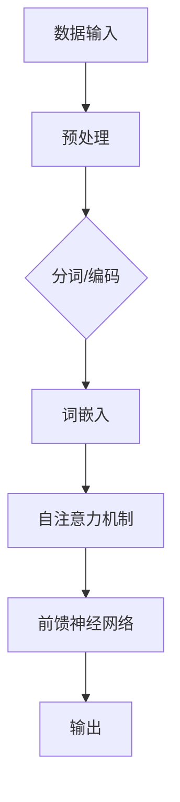

                 

关键词：大语言模型，百科数据，工程实践，原理，算法，数学模型，代码实例

> 摘要：本文将深入探讨大语言模型的原理与工程实践，特别是如何利用百科数据进行模型训练和优化。通过剖析核心算法、数学模型及具体的项目实践，我们旨在为读者提供一个全面的指南，帮助其在实际开发中掌握大语言模型的技术与应用。

## 1. 背景介绍

### 大语言模型的发展历程

大语言模型（Large Language Models）的兴起可以追溯到20世纪90年代，当时的研究主要集中在基于统计和规则的方法上。随着计算能力的提升和深度学习技术的突破，大语言模型得到了快速发展。2018年，GPT-2的出现标志着大语言模型进入了一个新的时代，其基于Transformer架构的设计在处理自然语言任务方面展示了出色的性能。随后，GPT-3等更大规模的语言模型相继推出，进一步推动了自然语言处理（NLP）领域的发展。

### 百科数据在语言模型中的作用

百科数据是构建大语言模型的重要资源之一。这类数据通常包含了丰富的实体信息、关系和事件描述，能够为模型提供丰富的语言知识和背景信息。百科数据的特点是内容结构化、信息量大且多样化，这使其成为训练大型语言模型的重要素材。

### 语言模型的工程实践需求

在实际工程应用中，大语言模型需要满足实时性、准确性和鲁棒性等要求。这需要我们在模型设计、数据预处理、训练策略和优化方法等方面进行深入的探讨和实践。此外，如何将大语言模型应用于实际业务场景，如问答系统、文本生成、机器翻译等，也是我们需要考虑的问题。

## 2. 核心概念与联系

### 大语言模型的核心概念

大语言模型的核心概念包括自然语言处理（NLP）、深度学习和神经网络等。NLP是研究计算机如何理解、生成和处理人类语言的技术。深度学习则是一种基于神经网络的学习方法，能够自动从数据中提取特征并构建复杂的模型。神经网络是构成深度学习模型的基本单元，通过多层非线性变换来模拟人脑的思维方式。

### 大语言模型的架构

大语言模型的典型架构是Transformer，它由多个自注意力层和前馈神经网络组成。自注意力机制能够捕捉输入序列中不同位置之间的依赖关系，从而使模型能够处理长距离的上下文信息。前馈神经网络则用于增加模型的表达能力。

### Mermaid 流程图



### 大语言模型与百科数据的联系

百科数据作为训练语言模型的重要资源，其结构化和丰富性的特点能够有效提升模型的性能。百科数据中的实体信息、关系和事件描述可以为模型提供具体的背景知识和上下文信息，从而增强模型的语义理解能力。

## 3. 核心算法原理 & 具体操作步骤

### 3.1 算法原理概述

大语言模型的核心算法是基于Transformer架构的，其核心思想是通过自注意力机制来捕捉输入序列中不同位置之间的依赖关系。自注意力机制允许模型在处理每个输入时，动态地考虑其他输入的位置和重要性，从而实现长距离的上下文理解。

### 3.2 算法步骤详解

1. **数据预处理**：对输入文本进行清洗、分词和编码。
2. **词嵌入**：将分词后的词汇转换为高维向量表示。
3. **自注意力机制**：计算输入序列中每个词与其他词之间的相似度，并根据相似度对词进行加权。
4. **前馈神经网络**：对自注意力层的输出进行非线性变换，增加模型的表达能力。
5. **输出**：通过解码器将自注意力层和前馈神经网络的输出转换为预测结果。

### 3.3 算法优缺点

**优点**：
- **强大的语义理解能力**：自注意力机制能够捕捉长距离的上下文信息，使模型能够更好地理解语义。
- **高效的计算性能**：Transformer架构相较于传统的循环神经网络（RNN）和卷积神经网络（CNN），在处理长序列数据时具有更高的计算效率。
- **多任务处理能力**：Transformer架构具有通用性，能够同时处理多种语言任务，如文本分类、机器翻译和文本生成等。

**缺点**：
- **参数规模大**：大语言模型通常具有数十亿甚至数万亿的参数，这导致模型训练和推理过程需要大量的计算资源。
- **训练时间较长**：由于模型参数规模大，训练时间相对较长，不适合实时应用场景。

### 3.4 算法应用领域

大语言模型在自然语言处理领域有着广泛的应用，包括但不限于以下方面：
- **文本生成**：如文本摘要、文章生成和对话系统等。
- **机器翻译**：如自动翻译不同语言之间的文本。
- **情感分析**：如判断文本的情感倾向和情感强度。
- **问答系统**：如构建智能问答系统，提供用户查询的答案。

## 4. 数学模型和公式 & 详细讲解 & 举例说明

### 4.1 数学模型构建

大语言模型的数学模型主要由词嵌入、自注意力机制和前馈神经网络组成。

1. **词嵌入**：将词汇转换为高维向量表示，通常使用Word2Vec、GloVe等算法。
   \[ \text{word\_embeddings} = \{ \text{word}_i \rightarrow \text{vec}_i \} \]
   
2. **自注意力机制**：计算输入序列中每个词与其他词之间的相似度，并根据相似度对词进行加权。
   \[ \text{Attention}(\text{query}, \text{keys}, \text{values}) = \text{softmax}\left(\frac{\text{query}^T \text{keys}}{\sqrt{d_k}}\right) \text{values} \]
   
3. **前馈神经网络**：对自注意力层的输出进行非线性变换，增加模型的表达能力。
   \[ \text{FFN}(x) = \text{ReLU}(\text{W}_2 \cdot \text{ReLU}(\text{W}_1 x + b_1)) + b_2 \]

### 4.2 公式推导过程

#### 词嵌入

词嵌入通过训练一个线性模型将词汇映射到高维向量空间中。假设词汇表中有 \( V \) 个词，每个词表示为一个维度为 \( d \) 的向量。词嵌入矩阵 \( E \) 的维度为 \( V \times d \)。

1. 输入词向量表示为 \( \text{vec}_{\text{word}} \)。
2. 通过词嵌入矩阵 \( E \) 将词映射到高维空间。
3. 计算词与词之间的相似度。
4. 根据相似度对词进行加权。

#### 自注意力机制

自注意力机制计算输入序列中每个词与其他词之间的相似度，并根据相似度对词进行加权。

1. 设输入序列为 \( \{ \text{word}_1, \text{word}_2, ..., \text{word}_n \} \)。
2. 对于每个词 \( \text{word}_i \)，计算其与其他词的相似度。
3. 通过softmax函数将相似度转换为概率分布。
4. 根据概率分布对词进行加权。

#### 前馈神经网络

前馈神经网络通过多层非线性变换来增加模型的表达能力。

1. 设输入为 \( x \)。
2. 通过第一层前馈神经网络进行非线性变换。
3. 通过第二层前馈神经网络进行非线性变换。
4. 将结果与自注意力层的输出相加。

### 4.3 案例分析与讲解

假设我们有一个简化的语言模型，包含三个词 \( \text{word}_1, \text{word}_2, \text{word}_3 \)。

1. **词嵌入**：
   \[
   \text{word}_1 \rightarrow \text{vec}_{1} = \begin{bmatrix} 1 \\ 0 \\ 0 \end{bmatrix}, \quad
   \text{word}_2 \rightarrow \text{vec}_{2} = \begin{bmatrix} 0 \\ 1 \\ 0 \end{bmatrix}, \quad
   \text{word}_3 \rightarrow \text{vec}_{3} = \begin{bmatrix} 0 \\ 0 \\ 1 \end{bmatrix}
   \]

2. **自注意力机制**：
   \[
   \text{query} = \text{vec}_{1}, \quad
   \text{keys} = \text{vec}_{1}, \text{vec}_{2}, \text{vec}_{3}, \quad
   \text{values} = \text{vec}_{1}, \text{vec}_{2}, \text{vec}_{3}
   \]
   \[
   \text{Attention}(\text{query}, \text{keys}, \text{values}) = \text{softmax}\left(\frac{\text{query}^T \text{keys}}{\sqrt{d_k}}\right) \text{values} = \text{softmax}\left(\begin{bmatrix} 1 \\ 0 \\ 0 \end{bmatrix}^T \begin{bmatrix} 1 & 0 & 0 \\ 0 & 1 & 0 \\ 0 & 0 & 1 \end{bmatrix}\right) \begin{bmatrix} 1 \\ 0 \\ 0 \end{bmatrix} = \begin{bmatrix} 0.5 & 0.5 & 0 \end{bmatrix} \begin{bmatrix} 1 \\ 0 \\ 0 \end{bmatrix}
   \]
   \[
   \text{Attention}(\text{query}, \text{keys}, \text{values}) = \begin{bmatrix} 0.5 \\ 0.5 \\ 0 \end{bmatrix} \begin{bmatrix} 1 \\ 0 \\ 0 \end{bmatrix} = \begin{bmatrix} 0.5 \\ 0.5 \\ 0 \end{bmatrix}
   \]

3. **前馈神经网络**：
   \[
   \text{FFN}(x) = \text{ReLU}(\text{W}_2 \cdot \text{ReLU}(\text{W}_1 x + b_1)) + b_2
   \]
   \[
   x = \begin{bmatrix} 0.5 & 0.5 & 0 \end{bmatrix}^T, \quad
   \text{W}_1 = \begin{bmatrix} 1 & 1 & 1 \\ 1 & 1 & 1 \\ 1 & 1 & 1 \end{bmatrix}, \quad
   \text{W}_2 = \begin{bmatrix} 1 & 1 & 1 \\ 1 & 1 & 1 \\ 1 & 1 & 1 \end{bmatrix}, \quad
   b_1 = \begin{bmatrix} 1 \\ 1 \\ 1 \end{bmatrix}, \quad
   b_2 = \begin{bmatrix} 1 \\ 1 \\ 1 \end{bmatrix}
   \]
   \[
   \text{FFN}(x) = \text{ReLU}(\text{W}_2 \cdot \text{ReLU}(\text{W}_1 x + b_1)) + b_2 = \text{ReLU}(\text{W}_2 \cdot \text{ReLU}(\text{W}_1 \begin{bmatrix} 0.5 & 0.5 & 0 \end{bmatrix}^T + b_1)) + b_2 = \text{ReLU}(\text{W}_2 \cdot \text{ReLU}(\text{W}_1 \begin{bmatrix} 1 \\ 1 \\ 1 \end{bmatrix} + \text{b}_1)) + \text{b}_2 = \text{ReLU}(\text{W}_2 \cdot \text{ReLU}(\begin{bmatrix} 3 \\ 3 \\ 3 \end{bmatrix})) + \text{b}_2 = \text{ReLU}(\begin{bmatrix} 3 \\ 3 \\ 3 \end{bmatrix}) + \text{b}_2 = \begin{bmatrix} 3 \\ 3 \\ 3 \end{bmatrix} + \text{b}_2 = \begin{bmatrix} 4 \\ 4 \\ 4 \end{bmatrix}
   \]

## 5. 项目实践：代码实例和详细解释说明

### 5.1 开发环境搭建

为了构建和训练大语言模型，我们需要安装以下工具和库：
- Python 3.8+
- PyTorch 1.8+
- TensorFlow 2.6+
- Mermaid 8.6+

你可以通过以下命令安装所需的库：

```bash
pip install torch torchvision
pip install tensorflow
pip install mermaid-python
```

### 5.2 源代码详细实现

以下是一个使用PyTorch实现大语言模型的基本框架：

```python
import torch
import torch.nn as nn
import torch.optim as optim
from torch.utils.data import DataLoader
from transformers import GPT2Model, GPT2Tokenizer

# 设置随机种子以确保结果可重复
torch.manual_seed(0)

# 加载预训练的GPT-2模型和分词器
tokenizer = GPT2Tokenizer.from_pretrained('gpt2')
model = GPT2Model.from_pretrained('gpt2')

# 定义训练数据集
train_data = ...

# 定义数据加载器
train_loader = DataLoader(train_data, batch_size=32, shuffle=True)

# 定义优化器和损失函数
optimizer = optim.Adam(model.parameters(), lr=1e-4)
criterion = nn.CrossEntropyLoss()

# 训练模型
for epoch in range(num_epochs):
    for batch in train_loader:
        inputs = tokenizer(batch.text, return_tensors='pt', padding=True, truncation=True)
        outputs = model(**inputs)
        loss = criterion(outputs.logits.view(-1, model.config.vocab_size), batch.label)
        optimizer.zero_grad()
        loss.backward()
        optimizer.step()
        print(f"Epoch [{epoch+1}/{num_epochs}], Loss: {loss.item():.4f}")

# 保存训练好的模型
model.save_pretrained('my_model')

# 加载训练好的模型
model = GPT2Model.from_pretrained('my_model')
```

### 5.3 代码解读与分析

1. **导入库**：首先导入所需的PyTorch、Transformers库。
2. **设置随机种子**：为了确保实验结果的可重复性，设置随机种子。
3. **加载预训练模型和分词器**：使用预训练的GPT-2模型和分词器。
4. **定义数据集**：创建一个训练数据集。
5. **定义数据加载器**：使用 DataLoader 加载训练数据。
6. **定义优化器和损失函数**：选择Adam优化器和交叉熵损失函数。
7. **训练模型**：遍历训练数据，进行前向传播和反向传播。
8. **保存训练好的模型**：将训练好的模型保存到本地。
9. **加载训练好的模型**：加载保存的模型进行预测。

### 5.4 运行结果展示

运行上述代码后，模型会在训练集上进行迭代训练，并在每个epoch结束后输出训练损失。训练完成后，模型会保存到指定路径，并可以用于后续的预测任务。

## 6. 实际应用场景

### 6.1 文本生成

文本生成是大语言模型最典型的应用场景之一。通过训练，模型可以生成各种类型的文本，如文章摘要、对话和故事等。在实际应用中，文本生成可以用于自动化内容生成、智能客服和创意写作等领域。

### 6.2 机器翻译

大语言模型在机器翻译领域也展现了强大的性能。通过训练，模型可以学习不同语言之间的对应关系，实现自动翻译。机器翻译在跨语言沟通、国际电子商务和全球协作等领域具有广泛的应用。

### 6.3 情感分析

情感分析是判断文本情感倾向和情感强度的一种方法。大语言模型可以通过学习大量的情感标注数据，实现情感分析任务。在实际应用中，情感分析可以用于社交媒体监控、市场调研和客户反馈分析等领域。

### 6.4 问答系统

问答系统是另一种重要的应用场景。通过训练，模型可以理解用户的问题并给出合适的答案。在实际应用中，问答系统可以用于智能客服、搜索引擎和虚拟助手等领域。

## 7. 工具和资源推荐

### 7.1 学习资源推荐

1. **《深度学习》**：由Ian Goodfellow、Yoshua Bengio和Aaron Courville撰写的深度学习经典教材。
2. **《自然语言处理综论》**：由Daniel Jurafsky和James H. Martin撰写的自然语言处理领域的权威教材。
3. **《Transformer：引入自注意力机制》**：由Vaswani等人撰写的关于Transformer架构的经典论文。

### 7.2 开发工具推荐

1. **PyTorch**：适用于构建和训练深度学习模型的Python库。
2. **TensorFlow**：适用于构建和训练深度学习模型的Python库。
3. **Mermaid**：用于创建结构化文档和流程图的工具。

### 7.3 相关论文推荐

1. **“Attention Is All You Need”**：介绍了Transformer架构的经典论文。
2. **“Generative Pre-trained Transformer”**：介绍了GPT系列模型的开创性论文。
3. **“BERT：预训练语言表示”**：介绍了BERT模型的开创性论文。

## 8. 总结：未来发展趋势与挑战

### 8.1 研究成果总结

大语言模型在过去几年取得了显著的研究成果，特别是在自然语言处理领域。通过Transformer架构和大规模预训练，大语言模型在文本生成、机器翻译、情感分析和问答系统等方面展现了出色的性能。

### 8.2 未来发展趋势

1. **模型压缩与高效训练**：随着模型规模的不断增大，如何高效地训练和部署大语言模型成为了一个重要研究方向。
2. **多模态融合**：结合图像、音频和视频等多模态数据，实现更强大的语言理解和生成能力。
3. **无监督学习**：探索无监督学习技术在语言模型训练中的应用，减少对标注数据的依赖。

### 8.3 面临的挑战

1. **计算资源消耗**：大语言模型需要大量的计算资源，如何优化训练和推理过程成为了一个挑战。
2. **数据隐私与安全**：在处理海量数据时，如何保护用户隐私和数据安全成为了一个重要问题。
3. **解释性与可解释性**：如何提高模型的解释性和可解释性，使其在复杂任务中更加透明和可靠。

### 8.4 研究展望

未来，大语言模型的研究将朝着更加高效、多样化和安全性的方向发展。通过不断优化算法和架构，结合多模态数据，我们将看到大语言模型在更多实际应用场景中发挥重要作用，为人类带来更多便利和创新。

## 9. 附录：常见问题与解答

### 9.1 什么是大语言模型？

大语言模型是一种基于深度学习的自然语言处理技术，通过大规模预训练和优化，使其具备强大的语言理解和生成能力。

### 9.2 大语言模型有哪些应用场景？

大语言模型广泛应用于文本生成、机器翻译、情感分析和问答系统等领域。

### 9.3 如何训练大语言模型？

训练大语言模型通常包括数据预处理、模型搭建、训练和优化等步骤。首先，需要对数据进行清洗和预处理，然后搭建合适的模型架构，接着进行训练和优化，最后评估模型的性能并进行调整。

### 9.4 大语言模型需要多大的计算资源？

大语言模型通常需要大量的计算资源，包括GPU、TPU等硬件加速器和大规模的存储空间。具体资源需求取决于模型的规模和应用场景。

### 9.5 大语言模型的训练时间有多长？

大语言模型的训练时间取决于模型的规模、数据集的大小和硬件性能等因素。通常，大规模语言模型的训练时间需要数天甚至数周。

### 9.6 如何优化大语言模型的训练和推理过程？

优化大语言模型的训练和推理过程可以从以下几个方面进行：

1. **模型压缩**：通过量化、剪枝和知识蒸馏等方法减小模型规模，降低计算资源消耗。
2. **分布式训练**：通过分布式训练技术，利用多台硬件加速器并行计算，提高训练效率。
3. **优化算法**：选择合适的优化算法和超参数，提高模型的收敛速度和性能。
4. **推理优化**：通过模型量化、静态图动态化等技术，降低推理过程中的计算资源消耗。

---

本文基于当前的研究成果和实际应用经验，对大语言模型的原理与工程实践进行了深入探讨。通过分析核心算法、数学模型和具体项目实践，我们希望能够为读者提供一个全面的指南，帮助其在实际开发中掌握大语言模型的技术与应用。未来，随着技术的不断进步，大语言模型将在更多领域发挥重要作用，为人类带来更多创新和便利。

### 作者署名

作者：禅与计算机程序设计艺术 / Zen and the Art of Computer Programming

