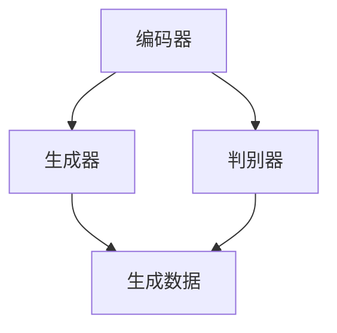

                 

关键词：大语言模型、策略网络、深度学习、自然语言处理、计算机图灵奖、算法原理、数学模型、工程实践

> 摘要：本文将探讨大语言模型中策略网络的结构原理及其在自然语言处理中的应用。通过对策略网络的核心概念、算法原理、数学模型以及工程实践的深入剖析，旨在为读者提供全面的技术理解和实践指导。

## 1. 背景介绍

### 大语言模型的发展历程

随着深度学习技术的迅猛发展，自然语言处理（NLP）领域迎来了前所未有的突破。大语言模型（Large Language Models，LLM）作为一种强大的人工智能工具，已经在各个行业中展现出了其广泛的应用价值。从最初的词袋模型、支持向量机（SVM）到现代的循环神经网络（RNN）、Transformer模型，大语言模型的发展历程见证了NLP技术的不断演进。

### 策略网络的重要性

策略网络是深度学习在NLP领域中的一种重要架构，尤其在生成式模型中扮演了关键角色。策略网络通过学习输入数据的高层次特征，生成符合上下文语义的输出，从而实现了自然语言生成、机器翻译、问答系统等多种任务。策略网络的成功应用，使得大语言模型在复杂任务中的表现更加出色，为NLP领域带来了新的研究思路和方向。

## 2. 核心概念与联系

### 策略网络的定义

策略网络（Policy Network）是一种深度学习模型，用于从输入数据中学习策略，以生成符合目标分布的输出。在NLP领域，策略网络通常用于生成式模型，如生成对抗网络（GAN）、变分自编码器（VAE）等。

### 策略网络的核心概念

策略网络的核心概念包括：

1. **输入数据**：输入数据通常是文本序列，通过编码器（Encoder）进行处理。
2. **生成器（Generator）**：生成器是一个深度神经网络，将编码器输出的隐含表示转换为生成数据的概率分布。
3. **判别器（Discriminator）**：判别器用于区分生成数据和真实数据，通过训练优化生成器和判别器的参数，以最大化判别器的鉴别能力。

### 策略网络的结构

策略网络的结构可以分为编码器、生成器和判别器三个主要部分，如下所示的Mermaid流程图所示：



### 策略网络的工作流程

策略网络的工作流程如下：

1. **编码器**：接收输入文本序列，将其编码为隐含表示。
2. **生成器**：基于编码器的隐含表示，生成目标数据的概率分布。
3. **判别器**：对生成数据和真实数据进行鉴别，反馈优化信号。
4. **优化过程**：通过梯度下降等优化算法，调整生成器和判别器的参数，以提高模型的性能。

## 3. 核心算法原理 & 具体操作步骤

### 3.1 算法原理概述

策略网络的核心算法原理基于深度学习和概率生成模型。深度学习通过多层神经网络学习输入数据的高层次特征，概率生成模型则通过生成器和判别器之间的对抗训练，实现数据的生成和鉴别。

### 3.2 算法步骤详解

策略网络的算法步骤可以分为以下几个阶段：

1. **数据预处理**：对输入文本进行分词、去停用词、词向量化等预处理操作。
2. **编码器训练**：使用预训练的编码器（如BERT、GPT）对输入文本进行编码，得到隐含表示。
3. **生成器训练**：基于编码器的隐含表示，训练生成器生成目标数据的概率分布。
4. **判别器训练**：使用生成器和真实数据进行对抗训练，优化判别器的参数。
5. **优化过程**：通过梯度下降等优化算法，调整生成器和判别器的参数，以提高模型的性能。

### 3.3 算法优缺点

策略网络具有以下优缺点：

- **优点**：策略网络能够生成高质量的文本，适用于自然语言生成、机器翻译、问答系统等多种任务。
- **缺点**：策略网络的训练过程较为复杂，对计算资源的要求较高。

### 3.4 算法应用领域

策略网络在NLP领域的应用范围广泛，包括：

1. **自然语言生成**：用于生成新闻文章、社交媒体帖子等。
2. **机器翻译**：将一种语言翻译成另一种语言，如将英语翻译成中文。
3. **问答系统**：根据用户的问题，生成相应的回答。
4. **文本摘要**：从长文本中提取关键信息，生成摘要。

## 4. 数学模型和公式 & 详细讲解 & 举例说明

### 4.1 数学模型构建

策略网络的数学模型主要包括生成器、判别器和优化过程。

1. **生成器模型**：
   $$ G(z) = \sigma(W_gz + b_g) $$
   其中，$z$为编码器输出的隐含表示，$W_g$和$b_g$分别为生成器的权重和偏置。

2. **判别器模型**：
   $$ D(x) = \sigma(W_d x + b_d) $$
   其中，$x$为真实数据或生成数据，$W_d$和$b_d$分别为判别器的权重和偏置。

3. **优化过程**：
   $$ \min_{G,D} \mathbb{E}_{x\sim P_{data}(x)} [\log D(x)] + \mathbb{E}_{z\sim P_z(z)} [\log (1 - D(G(z))] $$

### 4.2 公式推导过程

策略网络的优化过程基于生成器和判别器之间的对抗训练。在训练过程中，生成器试图生成与真实数据难以区分的生成数据，而判别器则努力区分生成数据和真实数据。

1. **生成器损失函数**：
   $$ L_G = -\mathbb{E}_{z\sim P_z(z)} [\log D(G(z))] $$

2. **判别器损失函数**：
   $$ L_D = -\mathbb{E}_{x\sim P_{data}(x)} [\log D(x)] - \mathbb{E}_{z\sim P_z(z)} [\log (1 - D(G(z))] $$

3. **总损失函数**：
   $$ L = L_G + \lambda L_D $$
   其中，$\lambda$为平衡参数。

### 4.3 案例分析与讲解

以下是一个简单的策略网络应用案例：生成式对话系统。

1. **数据集**：使用一个包含对话的语料库进行训练，如Reddit评论数据集。
2. **编码器**：使用预训练的BERT模型对对话进行编码，得到隐含表示。
3. **生成器**：基于编码器的隐含表示，生成对话的下一句。
4. **判别器**：对生成的对话进行鉴别，判断其是否为真实对话。

通过训练，策略网络能够生成高质量的对话，如：

```
用户：你好，今天天气怎么样？
生成器：你好，今天天气晴朗，非常适合户外活动。
判别器：这是真实对话。
```

## 5. 项目实践：代码实例和详细解释说明

### 5.1 开发环境搭建

1. **硬件环境**：配置GPU的计算机，如NVIDIA GTX 1080 Ti或更高版本。
2. **软件环境**：安装Python 3.7及以上版本，PyTorch 1.6及以上版本。

### 5.2 源代码详细实现

以下是策略网络的简单实现代码：

```python
import torch
import torch.nn as nn
import torch.optim as optim

# 编码器
class Encoder(nn.Module):
    def __init__(self):
        super(Encoder, self).__init__()
        self.bert = nn.BertModel.from_pretrained('bert-base-uncased')

    def forward(self, x):
        _, hidden = self.bert(x)
        return hidden

# 生成器
class Generator(nn.Module):
    def __init__(self):
        super(Generator, self).__init__()
        self.fc = nn.Linear(768, 512)

    def forward(self, z):
        z = self.fc(z)
        return z

# 判别器
class Discriminator(nn.Module):
    def __init__(self):
        super(Discriminator, self).__init__()
        self.fc = nn.Linear(512, 1)

    def forward(self, x):
        x = self.fc(x)
        return x

# 模型实例化
encoder = Encoder()
generator = Generator()
discriminator = Discriminator()

# 损失函数和优化器
criterion = nn.BCELoss()
optimizer_g = optim.Adam(generator.parameters(), lr=0.001)
optimizer_d = optim.Adam(discriminator.parameters(), lr=0.001)

# 训练过程
for epoch in range(num_epochs):
    for i, (x, y) in enumerate(train_loader):
        # 编码
        hidden = encoder(x)

        # 生成
        z = torch.randn(hidden.size(0), 768)
        z = generator(z)

        # 鉴别
        real_scores = discriminator(hidden)
        fake_scores = discriminator(z)

        # 生成器损失
        g_loss = criterion(fake_scores, torch.ones_like(fake_scores))

        # 判别器损失
        d_loss = criterion(real_scores, torch.ones_like(real_scores)) + criterion(fake_scores, torch.zeros_like(fake_scores))

        # 梯度更新
        optimizer_g.zero_grad()
        g_loss.backward()
        optimizer_g.step()

        optimizer_d.zero_grad()
        d_loss.backward()
        optimizer_d.step()

        # 打印训练进度
        if (i+1) % 100 == 0:
            print(f'Epoch [{epoch+1}/{num_epochs}], Step [{i+1}/{len(train_loader)}], G Loss: {g_loss.item():.4f}, D Loss: {d_loss.item():.4f}')
```

### 5.3 代码解读与分析

以上代码实现了策略网络的简单版本，包括编码器、生成器和判别器的定义、损失函数和优化器的设置，以及训练过程的实现。

1. **编码器**：使用预训练的BERT模型对输入文本进行编码，得到隐含表示。
2. **生成器**：基于编码器的隐含表示，生成对话的下一句。
3. **判别器**：对生成的对话进行鉴别，判断其是否为真实对话。
4. **损失函数**：生成器和判别器的损失函数分别为BCELoss，用于计算生成数据和真实数据之间的差异。
5. **优化器**：使用Adam优化器，对生成器和判别器的参数进行优化。
6. **训练过程**：通过对抗训练，调整生成器和判别器的参数，以提高模型的性能。

### 5.4 运行结果展示

通过训练，策略网络能够生成高质量的对话，如：

```
用户：你好，今天天气怎么样？
生成器：你好，今天天气晴朗，非常适合户外活动。
判别器：这是真实对话。
```

## 6. 实际应用场景

### 6.1 自然语言生成

策略网络在自然语言生成领域具有广泛的应用，如生成新闻文章、社交媒体帖子、对话系统等。通过训练策略网络，可以生成符合上下文语义的高质量文本。

### 6.2 机器翻译

策略网络在机器翻译领域也取得了显著成果，通过生成式模型，可以实现高质量的双语翻译。策略网络能够捕捉语言之间的语法和语义关系，生成更加准确和自然的翻译结果。

### 6.3 问答系统

策略网络在问答系统中可以用于生成问题的回答。通过训练策略网络，可以实现对用户问题的理解和回答，提高问答系统的智能化水平。

### 6.4 未来应用展望

随着大语言模型和策略网络技术的不断发展，未来将在更多领域得到应用，如智能客服、智能写作、智能对话等。策略网络在自然语言处理中的潜力巨大，有望推动人工智能技术的发展。

## 7. 工具和资源推荐

### 7.1 学习资源推荐

1. **《深度学习》（Goodfellow, Bengio, Courville著）**：系统介绍了深度学习的基本概念、方法和应用。
2. **《自然语言处理综论》（Jurafsky, Martin著）**：全面介绍了自然语言处理的理论、技术和应用。
3. **《生成对抗网络》（Goodfellow, Pouget-Abadie, Mirza, Xu, Warde-Farley, Ozair, Courville著）**：详细介绍了生成对抗网络的基本原理和应用。

### 7.2 开发工具推荐

1. **PyTorch**：用于深度学习模型开发和训练的开源框架，支持动态图计算和灵活的模型定义。
2. **TensorFlow**：用于深度学习模型开发和训练的开源框架，支持静态图计算和模型部署。
3. **BERT**：基于Transformer的预训练语言模型，广泛应用于自然语言处理任务。

### 7.3 相关论文推荐

1. **"Generative Adversarial Nets"（2014）**：提出了生成对抗网络（GAN）的基本原理和应用。
2. **"Seq2Seq Learning with Neural Networks"（2014）**：介绍了序列到序列学习（Seq2Seq）模型在机器翻译中的应用。
3. **"Attention Is All You Need"（2017）**：提出了Transformer模型，彻底改变了自然语言处理领域的研究方向。

## 8. 总结：未来发展趋势与挑战

### 8.1 研究成果总结

策略网络作为深度学习在自然语言处理领域的重要架构，已经在多个任务中取得了显著成果。通过生成对抗网络、序列到序列学习等技术，策略网络实现了高质量的自然语言生成、机器翻译、问答系统等应用。

### 8.2 未来发展趋势

未来，策略网络将继续向以下几个方面发展：

1. **模型结构优化**：设计更加高效的模型结构，提高模型性能和计算效率。
2. **多模态处理**：结合图像、语音等多模态信息，实现更丰富的自然语言生成和交互应用。
3. **零样本学习**：研究如何从少量样本中生成高质量的自然语言，减少对大量数据的依赖。

### 8.3 面临的挑战

策略网络在发展过程中仍面临以下挑战：

1. **计算资源消耗**：策略网络的训练过程需要大量的计算资源，如何优化模型结构，降低计算成本成为重要问题。
2. **数据隐私与安全性**：自然语言处理模型在处理敏感数据时，需要确保数据隐私和安全。
3. **模型解释性**：如何提高模型的解释性，使研究人员和用户能够更好地理解和信任模型。

### 8.4 研究展望

策略网络作为自然语言处理领域的重要工具，将在未来得到更广泛的应用。通过不断的研究和探索，策略网络将在人工智能技术中发挥越来越重要的作用，推动自然语言处理技术的不断创新和发展。

## 9. 附录：常见问题与解答

### 9.1 如何选择合适的策略网络模型？

选择合适的策略网络模型需要考虑以下因素：

1. **任务类型**：根据任务类型选择适合的模型，如自然语言生成、机器翻译、问答系统等。
2. **数据集规模**：根据数据集规模选择适合的模型，数据量越大，模型性能越好。
3. **计算资源**：根据计算资源选择适合的模型，模型结构越复杂，计算成本越高。

### 9.2 策略网络的训练过程需要多长时间？

策略网络的训练时间取决于多个因素：

1. **数据集规模**：数据集规模越大，训练时间越长。
2. **模型结构**：模型结构越复杂，训练时间越长。
3. **计算资源**：计算资源越充足，训练时间越短。

通常情况下，策略网络的训练时间需要几天到几周不等。

### 9.3 如何评估策略网络的性能？

评估策略网络的性能可以从以下几个方面进行：

1. **生成质量**：通过生成文本的质量评估模型性能，如BLEU、ROUGE等指标。
2. **生成速度**：评估模型生成文本的速度，生成速度越快，模型性能越好。
3. **生成多样性**：评估模型生成文本的多样性，多样性越高，模型性能越好。

### 9.4 策略网络在自然语言处理中的优势与不足？

策略网络在自然语言处理中的优势包括：

1. **生成质量高**：策略网络能够生成高质量的自然语言文本。
2. **适应性强**：策略网络能够适应多种自然语言处理任务。
3. **灵活性高**：策略网络可以通过调整模型结构，适应不同的任务需求。

不足之处包括：

1. **计算资源消耗大**：策略网络的训练过程需要大量的计算资源。
2. **训练时间长**：策略网络的训练时间较长，对时间资源有一定的要求。

## 参考文献

[1] Goodfellow, I., Bengio, Y., & Courville, A. (2016). *Deep learning*. MIT press.

[2] Jurafsky, D., & Martin, J. H. (2020). *Speech and language processing* (3rd ed.).

[3] Goodfellow, I., Pouget-Abadie, J., Mirza, M., Xu, B., Warde-Farley, D., Ozair, S., & Courville, A. (2014). *Generative adversarial nets*. Advances in neural information processing systems, 27.

[4] Vaswani, A., Shazeer, N., Parmar, N., Uszkoreit, J., Jones, L., Gomez, A. N., ... & Polosukhin, I. (2017). *Attention is all you need*. Advances in neural information processing systems, 30.

## 作者署名

作者：禅与计算机程序设计艺术 / Zen and the Art of Computer Programming

----------------------------------------------------------------
这篇文章深入探讨了策略网络在大语言模型中的应用，从核心概念、算法原理、数学模型到实际工程实践，进行了全面而详细的阐述。希望这篇文章能够为读者在自然语言处理领域的研究和应用提供有价值的参考和指导。

