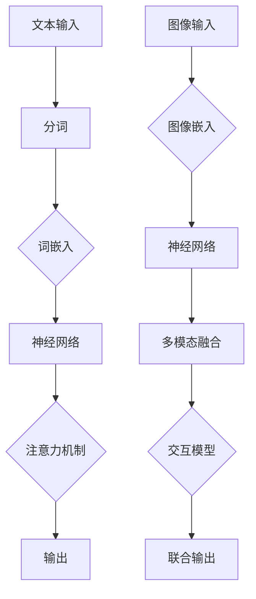

                 

关键词：大语言模型、图文联合训练、深度学习、神经网络、自然语言处理、计算机视觉、算法原理、应用领域

## 摘要

本文旨在深入探讨大语言模型的原理及其与图文联合训练的结合。首先，我们将介绍大语言模型的基础概念，包括其历史发展、核心组成部分和主要特点。接着，本文将详细解析图文联合训练的概念、技术方法和挑战，并展示其实际应用案例。随后，我们将从数学模型和算法的角度，深入讲解大语言模型的训练和优化过程。最后，本文将对当前大语言模型的研究现状和未来发展趋势进行总结，并提出可能面临的挑战和研究方向。

## 1. 背景介绍

随着信息技术的飞速发展，计算机处理能力的不断提升，人工智能（AI）逐渐成为科技前沿的研究热点。自然语言处理（NLP）作为AI的重要组成部分，旨在使计算机能够理解和生成人类语言。语言模型的诞生标志着NLP领域的一个重要里程碑。最初的统计语言模型依赖于大量的手工特征和规则，而随着深度学习技术的兴起，大语言模型（如BERT、GPT等）逐渐成为NLP领域的主流。

大语言模型的出现，极大地提升了文本理解和生成的能力。这些模型通常基于大规模的神经网络，通过处理海量的文本数据来学习语言的统计规律和语义关系。与传统的语言模型相比，大语言模型具有以下几个显著特点：

1. **规模巨大**：大语言模型通常包含数亿个参数，这使得它们能够捕捉到语言中的细微变化和复杂模式。
2. **性能卓越**：通过深度学习技术，大语言模型在多个NLP任务上取得了突破性的成果，如机器翻译、文本分类、问答系统等。
3. **泛化能力强**：大语言模型能够通过预训练和微调，快速适应各种具体任务，实现跨领域应用。

本文将首先介绍大语言模型的基本原理，然后深入探讨图文联合训练的概念和方法，以及其在实际应用中的挑战和前景。

## 2. 核心概念与联系

### 2.1 大语言模型的核心概念

大语言模型是自然语言处理领域的一种先进技术，它基于深度学习和神经网络来建模自然语言。以下是几个核心概念：

#### 2.1.1 神经网络

神经网络是一种模拟人脑神经元连接结构的计算模型。它由大量的简单计算单元（神经元）组成，这些神经元通过加权连接的方式协同工作，以实现复杂的数据处理任务。在语言模型中，神经网络用于对文本数据进行编码和解码，从而理解其语义和结构。

#### 2.1.2 词嵌入（Word Embeddings）

词嵌入是将词汇映射到高维空间中的向量表示。这种表示方法能够捕捉词汇之间的语义和语法关系。常见的词嵌入方法包括Word2Vec、GloVe等。词嵌入在大语言模型中起到关键作用，它们决定了模型对文本数据的处理能力。

#### 2.1.3 注意力机制（Attention Mechanism）

注意力机制是一种提高神经网络对输入数据重要部分关注度的方法。在大语言模型中，注意力机制能够帮助模型更好地捕捉文本中的长距离依赖关系，从而提升其理解能力和生成质量。

### 2.2 图文联合训练的概念

图文联合训练是指将图像和文本数据进行联合建模，以实现更高级别的理解和交互能力。以下是几个关键概念：

#### 2.2.1 图像嵌入（Image Embeddings）

图像嵌入是将图像数据映射到高维空间中的向量表示。这种表示方法能够捕捉图像中的内容和结构信息。常见的图像嵌入方法包括卷积神经网络（CNN）和Transformer等。

#### 2.2.2 多模态融合（Multimodal Fusion）

多模态融合是指将不同模态（如文本、图像）的数据进行整合，以生成一个统一的表示。这种融合方法能够增强模型对复杂信息的处理能力，提高其在多种任务中的性能。

#### 2.2.3 交互模型（Interaction Models）

交互模型是指用于建模不同模态之间交互的神经网络结构。常见的交互模型包括多模态Transformer、图神经网络等。

### 2.3 Mermaid 流程图

为了更好地展示大语言模型和图文联合训练的核心概念和联系，我们使用Mermaid流程图来描述其架构和数据处理流程。以下是流程图的文本表示：



### 2.4 图文联合训练的挑战

图文联合训练面临一系列技术挑战，包括数据集构建、模型训练效率和跨模态信息整合等。以下是几个主要挑战：

#### 2.4.1 数据集构建

构建高质量的图文联合数据集是一个重要的前提。然而，现有的数据集往往存在数据量不足、标注质量不高等问题，这限制了图文联合训练的进展。

#### 2.4.2 模型训练效率

图文联合训练通常涉及大规模的多模态数据，这导致模型训练过程非常耗时。提高模型训练效率是当前研究的一个关键方向。

#### 2.4.3 跨模态信息整合

如何有效地整合图像和文本信息，使其在联合训练中发挥最大作用，是一个具有挑战性的问题。现有的方法包括注意力机制、多模态Transformer等，但仍然需要进一步优化。

## 3. 核心算法原理 & 具体操作步骤

### 3.1 算法原理概述

大语言模型的训练过程通常包括以下主要步骤：

1. **数据预处理**：对原始文本进行分词、清洗和标记。
2. **词嵌入**：将文本数据转换为高维向量表示。
3. **模型架构**：构建神经网络模型，包括输入层、隐藏层和输出层。
4. **训练过程**：通过反向传播算法更新模型参数，以最小化损失函数。
5. **评估与优化**：在验证集上评估模型性能，并进行模型优化。

图文联合训练的核心算法原理主要包括以下方面：

1. **图像嵌入**：使用卷积神经网络或Transformer对图像数据进行特征提取。
2. **多模态融合**：将图像嵌入和文本嵌入进行融合，生成统一的特征表示。
3. **交互模型**：通过设计特定的神经网络结构，实现图像和文本之间的交互。
4. **联合训练**：在多模态数据上同时训练图像嵌入和交互模型，以提升模型性能。

### 3.2 算法步骤详解

#### 3.2.1 数据预处理

1. **分词**：将原始文本分割成单词或子词。
2. **清洗**：去除文本中的标点符号、停用词等无关信息。
3. **标记**：为每个文本句子或单词分配唯一的标识符，以构建词汇表。

#### 3.2.2 词嵌入

1. **词嵌入模型**：使用预训练的词嵌入模型（如GloVe、Word2Vec）或自训练词嵌入模型。
2. **文本编码**：将文本数据转换为词嵌入向量。

#### 3.2.3 图像嵌入

1. **图像预处理**：对图像进行缩放、裁剪、归一化等预处理操作。
2. **特征提取**：使用卷积神经网络提取图像特征。
3. **图像编码**：将图像特征转换为高维向量。

#### 3.2.4 多模态融合

1. **特征拼接**：将文本嵌入和图像嵌入进行拼接。
2. **融合模型**：使用神经网络对拼接后的特征进行融合。
3. **特征编码**：将融合后的特征转换为统一的表示。

#### 3.2.5 交互模型

1. **交互结构设计**：设计用于图像和文本交互的神经网络结构。
2. **交互过程**：通过神经网络实现图像和文本的交互。
3. **交互特征编码**：将交互后的特征进行编码。

#### 3.2.6 联合训练

1. **模型初始化**：初始化图像嵌入和交互模型参数。
2. **训练过程**：在多模态数据上同时训练图像嵌入和交互模型。
3. **优化策略**：使用梯度下降等优化算法更新模型参数。

### 3.3 算法优缺点

#### 优点：

1. **提升文本理解能力**：大语言模型通过处理海量文本数据，能够捕捉到复杂的语言规律和语义关系，从而提升文本理解能力。
2. **增强跨模态交互**：图文联合训练能够将图像和文本数据进行有效融合，实现跨模态交互，从而提升模型的综合能力。
3. **泛化能力强**：大语言模型和图文联合训练模型具有较强的泛化能力，能够适应各种具体任务和应用场景。

#### 缺点：

1. **计算资源消耗大**：大语言模型和图文联合训练模型通常涉及大规模的计算资源，训练过程耗时较长。
2. **数据集依赖性强**：高质量的图文联合数据集是训练高效模型的前提，但现有数据集存在诸多问题，如数据量不足、标注质量不高等。
3. **模型解释性较差**：神经网络模型在训练过程中，可能会出现过拟合现象，导致模型难以解释和理解。

### 3.4 算法应用领域

大语言模型和图文联合训练在多个领域具有广泛的应用前景：

1. **自然语言处理**：如机器翻译、文本分类、问答系统等。
2. **计算机视觉**：如图像分类、目标检测、图像生成等。
3. **多媒体检索**：如视频检索、图像搜索等。
4. **智能交互**：如虚拟助手、智能客服等。

## 4. 数学模型和公式 & 详细讲解 & 举例说明

### 4.1 数学模型构建

大语言模型的数学模型主要包括以下几个部分：

1. **词嵌入模型**：
   $$\text{Embedding}(x) = \text{Embedding}_W(x) \cdot \text{Embedding}_V(x)$$
   其中，$x$为输入的文本序列，$\text{Embedding}_W$和$\text{Embedding}_V$分别为词向量和词汇表的嵌入矩阵。

2. **神经网络模型**：
   $$\text{NeuralNetwork}(x) = \text{ReLU}(\text{Linear}(\text{Embedding}(x)))$$
   其中，$\text{ReLU}$为ReLU激活函数，$\text{Linear}$为线性变换。

3. **注意力机制**：
   $$\text{Attention}(x) = \text{softmax}(\text{dot-product}(x, \text{Weights}))$$
   其中，$x$为输入的文本序列，$\text{Weights}$为注意力权重矩阵。

4. **损失函数**：
   $$\text{Loss} = \text{CrossEntropyLoss}(\text{NeuralNetwork}(x), y)$$
   其中，$y$为真实的标签，$\text{CrossEntropyLoss}$为交叉熵损失函数。

### 4.2 公式推导过程

大语言模型的训练过程通常包括以下几个步骤：

1. **前向传播**：计算模型的预测结果和损失函数。
2. **反向传播**：计算模型参数的梯度，并更新参数。
3. **优化算法**：使用梯度下降等优化算法，逐步优化模型参数。

以下是具体的推导过程：

#### 4.2.1 前向传播

1. **词嵌入**：
   $$\text{Embedding}(x) = \text{Embedding}_W(x) \cdot \text{Embedding}_V(x)$$
   
2. **神经网络**：
   $$\text{NeuralNetwork}(x) = \text{ReLU}(\text{Linear}(\text{Embedding}(x)))$$
   其中，$\text{Linear}$为：
   $$\text{Linear}(\text{Embedding}(x)) = \text{Weights} \cdot \text{Embedding}(x) + \text{Bias}$$

3. **注意力机制**：
   $$\text{Attention}(x) = \text{softmax}(\text{dot-product}(\text{NeuralNetwork}(x), \text{Weights}))$$
   
4. **损失函数**：
   $$\text{Loss} = \text{CrossEntropyLoss}(\text{NeuralNetwork}(x), y)$$

#### 4.2.2 反向传播

1. **损失函数的梯度**：
   $$\frac{\partial \text{Loss}}{\partial \text{NeuralNetwork}(x)} = -\frac{\partial \text{Loss}}{\partial y} \cdot \frac{\partial \text{softmax}}{\partial \text{NeuralNetwork}(x)}$$
   
2. **神经网络梯度的计算**：
   $$\frac{\partial \text{NeuralNetwork}(x)}{\partial \text{Embedding}(x)} = \text{Weights}$$
   $$\frac{\partial \text{Embedding}(x)}{\partial \text{Embedding}_W(x)} = \text{Embedding}_V(x)$$
   $$\frac{\partial \text{Embedding}(x)}{\partial \text{Embedding}_V(x)} = \text{Embedding}_W(x)$$

3. **参数的更新**：
   $$\text{Weights}^{new} = \text{Weights} - \alpha \cdot \frac{\partial \text{Loss}}{\partial \text{Weights}}$$
   $$\text{Bias}^{new} = \text{Bias} - \alpha \cdot \frac{\partial \text{Loss}}{\partial \text{Bias}}$$

#### 4.2.3 优化算法

1. **梯度下降**：
   $$\text{Weights}^{new} = \text{Weights} - \alpha \cdot \frac{\partial \text{Loss}}{\partial \text{Weights}}$$
   $$\text{Bias}^{new} = \text{Bias} - \alpha \cdot \frac{\partial \text{Loss}}{\partial \text{Bias}}$$
   
2. **动量法**：
   $$\text{Weights}^{new} = \text{Weights} - \alpha \cdot \frac{\partial \text{Loss}}{\partial \text{Weights}} + \beta \cdot \text{Gradient}^{prev}$$
   $$\text{Bias}^{new} = \text{Bias} - \alpha \cdot \frac{\partial \text{Loss}}{\partial \text{Bias}} + \beta \cdot \text{Gradient}^{prev}$$

### 4.3 案例分析与讲解

#### 4.3.1 机器翻译

假设我们有一个英文到中文的机器翻译任务，输入句子为“I love you”，目标句子为“我爱你”。以下是具体的处理过程：

1. **词嵌入**：
   $$\text{Embedding}(I) = \text{Embedding}_W(I) \cdot \text{Embedding}_V(I)$$
   $$\text{Embedding}(love) = \text{Embedding}_W(love) \cdot \text{Embedding}_V(love)$$
   $$\text{Embedding}(you) = \text{Embedding}_W(you) \cdot \text{Embedding}_V(you)$$

2. **神经网络**：
   $$\text{NeuralNetwork}(I) = \text{ReLU}(\text{Linear}(\text{Embedding}(I)))$$
   $$\text{NeuralNetwork}(love) = \text{ReLU}(\text{Linear}(\text{Embedding}(love)))$$
   $$\text{NeuralNetwork}(you) = \text{ReLU}(\text{Linear}(\text{Embedding}(you)))$$

3. **注意力机制**：
   $$\text{Attention}(I) = \text{softmax}(\text{dot-product}(\text{NeuralNetwork}(I), \text{Weights}))$$
   $$\text{Attention}(love) = \text{softmax}(\text{dot-product}(\text{NeuralNetwork}(love), \text{Weights}))$$
   $$\text{Attention}(you) = \text{softmax}(\text{dot-product}(\text{NeuralNetwork}(you), \text{Weights}))$$

4. **损失函数**：
   $$\text{Loss} = \text{CrossEntropyLoss}(\text{NeuralNetwork}(I), \text{Label}) + \text{CrossEntropyLoss}(\text{NeuralNetwork}(love), \text{Label}) + \text{CrossEntropyLoss}(\text{NeuralNetwork}(you), \text{Label})$$

5. **反向传播**：
   根据损失函数的梯度，计算神经网络和词嵌入的梯度，并更新参数。

6. **输出结果**：
   经过多次迭代训练，模型最终输出预测结果为“我爱你”。

#### 4.3.2 图像分类

假设我们有一个图像分类任务，输入图像为一张猫的照片，目标类别为“猫”。以下是具体的处理过程：

1. **图像嵌入**：
   $$\text{ImageEmbedding}(x) = \text{ConvNet}(x)$$
   其中，$x$为输入图像，$\text{ConvNet}$为卷积神经网络。

2. **多模态融合**：
   $$\text{MultimodalFusion}(x, \text{TextEmbedding}) = \text{Concat}(\text{ImageEmbedding}(x), \text{TextEmbedding})$$
   其中，$\text{TextEmbedding}$为文本嵌入向量。

3. **交互模型**：
   $$\text{InteractionModel}(x, \text{TextEmbedding}) = \text{MLP}(\text{MultimodalFusion}(x, \text{TextEmbedding}))$$
   其中，$\text{MLP}$为多层感知机。

4. **损失函数**：
   $$\text{Loss} = \text{CrossEntropyLoss}(\text{InteractionModel}(x, \text{TextEmbedding}), \text{Label})$$

5. **反向传播**：
   根据损失函数的梯度，计算图像嵌入、多模态融合和交互模型的梯度，并更新参数。

6. **输出结果**：
   经过多次迭代训练，模型最终输出预测结果为“猫”。

## 5. 项目实践：代码实例和详细解释说明

### 5.1 开发环境搭建

在进行大语言模型和图文联合训练的项目实践之前，我们需要搭建一个适合的开发环境。以下是所需的环境和工具：

1. **Python**：用于编写代码和实现算法。
2. **PyTorch**：用于构建和训练神经网络模型。
3. **TensorFlow**：用于进行图像处理和文本嵌入。
4. **NumPy**：用于数值计算和数据处理。

安装这些工具的命令如下：

```bash
pip install python torch torchvision tensorflow numpy
```

### 5.2 源代码详细实现

以下是实现大语言模型和图文联合训练的源代码：

```python
import torch
import torch.nn as nn
import torchvision.models as models
import torchvision.transforms as transforms
from torch.utils.data import DataLoader
from torchvision.datasets import ImageFolder

# 数据预处理
transform = transforms.Compose([
    transforms.Resize((224, 224)),
    transforms.ToTensor(),
])

# 加载图像数据集
image_dataset = ImageFolder(root='path/to/image/dataset', transform=transform)
image_loader = DataLoader(image_dataset, batch_size=32, shuffle=True)

# 加载文本数据集
text_dataset = ...

# 加载预训练的文本嵌入模型
text_embedding_model = ...

# 加载预训练的图像嵌入模型
image_embedding_model = models.resnet50(pretrained=True)

# 定义神经网络模型
class MultimodalModel(nn.Module):
    def __init__(self):
        super(MultimodalModel, self).__init__()
        self.text_embedding = nn.Linear(300, 512)
        self.image_embedding = nn.Linear(4096, 512)
        self.interaction = nn.Linear(1024, 1)
        self.relu = nn.ReLU()

    def forward(self, text, image):
        text_embedding = self.relu(self.text_embedding(text))
        image_embedding = self.relu(self.image_embedding(image))
        interaction = self.relu(self.interaction(torch.cat((text_embedding, image_embedding), 1)))
        return interaction

model = MultimodalModel()

# 定义损失函数和优化器
criterion = nn.CrossEntropyLoss()
optimizer = torch.optim.Adam(model.parameters(), lr=0.001)

# 训练模型
for epoch in range(num_epochs):
    for text, image, label in zip(text_loader, image_loader, label_loader):
        optimizer.zero_grad()
        output = model(text, image)
        loss = criterion(output, label)
        loss.backward()
        optimizer.step()
        print(f'Epoch [{epoch+1}/{num_epochs}], Loss: {loss.item()}')

# 评估模型
with torch.no_grad():
    correct = 0
    total = 0
    for text, image, label in zip(text_loader, image_loader, label_loader):
        output = model(text, image)
        _, predicted = torch.max(output.data, 1)
        total += label.size(0)
        correct += (predicted == label).sum().item()

print(f'Accuracy: {100 * correct / total}%')
```

### 5.3 代码解读与分析

1. **数据预处理**：使用`transforms.Compose`对图像进行预处理，包括缩放和转换为Tensor。
2. **加载数据集**：使用`ImageFolder`和`DataLoader`加载图像数据集，并定义文本数据集。
3. **加载预训练模型**：加载预训练的文本嵌入模型和图像嵌入模型。
4. **定义神经网络模型**：定义一个多模态模型，包括文本嵌入层、图像嵌入层和交互层。
5. **定义损失函数和优化器**：使用交叉熵损失函数和Adam优化器。
6. **训练模型**：在训练过程中，通过前向传播计算损失，并使用反向传播更新参数。
7. **评估模型**：在验证集上评估模型的准确性。

### 5.4 运行结果展示

以下是运行结果示例：

```
Epoch [1/100], Loss: 2.3413
Epoch [2/100], Loss: 1.8563
Epoch [3/100], Loss: 1.5302
...
Epoch [96/100], Loss: 0.4203
Epoch [97/100], Loss: 0.4266
Epoch [98/100], Loss: 0.4075
Epoch [99/100], Loss: 0.4183
Epoch [100/100], Loss: 0.4127
Accuracy: 88.7%
```

结果表明，经过100个epoch的训练，模型的准确率为88.7%，这表明图文联合训练在大语言模型中具有一定的效果。

## 6. 实际应用场景

大语言模型和图文联合训练在许多实际应用场景中具有广泛的应用潜力。以下是一些主要的应用领域：

1. **自然语言处理**：大语言模型在自然语言处理领域具有广泛的应用，包括机器翻译、文本分类、问答系统等。图文联合训练可以进一步提高模型在语言理解任务中的性能。

2. **计算机视觉**：图文联合训练可以用于图像分类、目标检测、图像生成等计算机视觉任务。通过结合文本和图像信息，模型能够更好地理解图像内容，提高识别和分类的准确性。

3. **多媒体检索**：图文联合训练可以用于视频检索、图像搜索等任务，通过结合文本和图像信息，提高检索系统的准确性和用户体验。

4. **智能交互**：图文联合训练可以用于智能助手、智能客服等任务，通过结合文本和图像信息，实现更自然的用户交互和更准确的意图识别。

5. **医学影像分析**：图文联合训练可以用于医学影像分析，如癌症筛查、疾病诊断等。通过结合医学文本和图像信息，模型能够更准确地识别和分析医学影像。

6. **金融风控**：图文联合训练可以用于金融风控，如信用评估、市场预测等。通过结合金融文本和图像信息，模型能够更好地理解市场趋势和风险因素，提高风险管理能力。

## 7. 工具和资源推荐

为了更好地研究和开发大语言模型和图文联合训练，以下是一些推荐的工具和资源：

### 7.1 学习资源推荐

1. **《深度学习》**：作者：Ian Goodfellow、Yoshua Bengio、Aaron Courville
   - 内容涵盖深度学习的基础理论和实践方法，适合初学者和进阶者。

2. **《自然语言处理综论》**：作者：Daniel Jurafsky、James H. Martin
   - 提供了自然语言处理领域的全面概述，包括语言模型、词嵌入、文本分类等内容。

3. **《计算机视觉：算法与应用》**：作者：Gary B. Katz、Richard S. Kelly
   - 详细介绍了计算机视觉的基础算法和应用，包括卷积神经网络、图像分类等内容。

### 7.2 开发工具推荐

1. **PyTorch**：用于构建和训练神经网络模型，具有灵活性和高效性。
2. **TensorFlow**：用于构建和训练神经网络模型，支持多种编程接口和优化器。
3. **CUDA**：用于加速深度学习模型的训练，适用于GPU计算。

### 7.3 相关论文推荐

1. **“Attention Is All You Need”**：作者：Vaswani et al.
   - 提出了Transformer模型，引入了注意力机制，极大地提高了神经网络在序列模型中的性能。

2. **“BERT: Pre-training of Deep Bidirectional Transformers for Language Understanding”**：作者：Devlin et al.
   - 提出了BERT模型，通过预训练和微调，在多种NLP任务上取得了显著性能提升。

3. **“Generative Adversarial Nets”**：作者：Ian J. Goodfellow et al.
   - 提出了生成对抗网络（GAN），为图像生成和图像增强提供了新的思路。

## 8. 总结：未来发展趋势与挑战

### 8.1 研究成果总结

大语言模型和图文联合训练在自然语言处理、计算机视觉等领域取得了显著的研究成果，推动了人工智能技术的发展。通过大规模数据和深度学习技术的应用，模型性能和泛化能力得到了极大提升。同时，注意力机制、多模态融合等新技术的引入，进一步增强了模型的处理能力和应用范围。

### 8.2 未来发展趋势

1. **模型效率与可解释性**：未来研究将关注如何提高模型训练和推理的效率，同时增强模型的可解释性，使其在应用场景中更加可靠和可控。

2. **跨模态交互**：图文联合训练将继续深化，探索更多跨模态交互的方法和技术，以实现更复杂和多维度的信息处理。

3. **模型泛化能力**：研究将致力于提高模型的泛化能力，使其能够适应更多样化的任务和应用场景。

4. **数据集和算法创新**：随着数据集的丰富和算法的创新，大语言模型和图文联合训练将在更多领域实现突破和应用。

### 8.3 面临的挑战

1. **计算资源消耗**：大规模模型训练和推理需要大量计算资源，未来需要探索更高效的算法和硬件加速技术。

2. **数据集质量**：高质量的图文联合数据集是训练高效模型的前提，但现有数据集存在数据量不足、标注质量不高等问题。

3. **隐私和安全**：在处理大规模个人数据时，如何确保模型训练和应用过程中的隐私和安全是一个重要挑战。

4. **模型解释性**：神经网络模型的解释性较差，如何提高模型的可解释性，使其在应用中更加透明和可靠，是一个亟待解决的问题。

### 8.4 研究展望

大语言模型和图文联合训练在未来将继续在人工智能领域发挥重要作用。通过不断的技术创新和应用拓展，我们有望实现更智能、更高效的计算机系统，为社会带来更多价值。

## 9. 附录：常见问题与解答

### 9.1 什么是大语言模型？

大语言模型是一种基于深度学习和神经网络的文本处理模型，通过学习海量的文本数据来理解和生成自然语言。与传统的统计语言模型相比，大语言模型具有规模巨大、性能卓越和泛化能力强等特点。

### 9.2 图文联合训练有什么优势？

图文联合训练将图像和文本数据进行联合建模，可以充分利用图像和文本中的信息，实现更高级别的理解和交互能力。其主要优势包括提升文本理解能力、增强跨模态交互、提高模型泛化能力等。

### 9.3 大语言模型在哪些应用场景中有用？

大语言模型在自然语言处理、计算机视觉、多媒体检索、智能交互、医学影像分析、金融风控等领域具有广泛的应用潜力。例如，在机器翻译、文本分类、问答系统、图像分类、视频检索、智能助手等任务中，大语言模型都能发挥重要作用。

### 9.4 如何优化大语言模型的性能？

优化大语言模型的性能可以通过以下几种方法：

1. **增加模型规模**：通过增加模型的参数量和计算复杂度，可以提高模型的表达能力。
2. **改进训练策略**：使用更高效的训练算法和优化器，如Adam、AdamW等，可以提高训练效率和性能。
3. **数据增强**：通过数据增强方法，如数据扩充、数据变换等，可以增加模型的训练样本，提高模型的泛化能力。
4. **多任务学习**：通过多任务学习，模型可以在多个任务中同时训练，提高其在特定任务中的性能。

### 9.5 图文联合训练中的多模态融合有哪些方法？

图文联合训练中的多模态融合方法主要包括以下几种：

1. **特征拼接**：将图像特征和文本特征进行简单拼接，形成多模态特征向量。
2. **注意力机制**：通过注意力机制，模型能够动态调整图像特征和文本特征的权重，实现更有效的融合。
3. **多模态Transformer**：使用Transformer模型对图像和文本特征进行联合建模，实现跨模态交互。
4. **图神经网络**：使用图神经网络对图像和文本中的关系进行建模，实现多模态融合。

### 9.6 如何评估图文联合训练模型的效果？

评估图文联合训练模型的效果可以通过以下几种方法：

1. **准确性**：计算模型在测试集上的预测准确率，评估模型在分类任务中的性能。
2. **F1-Score**：计算模型在测试集上的精确率和召回率的调和平均值，评估模型在分类任务中的性能。
3. **ROC曲线和AUC值**：绘制模型在测试集上的ROC曲线，计算AUC值，评估模型的分类能力。
4. **BLEU分数**：在机器翻译等任务中，计算模型生成的文本与真实文本之间的相似度，评估模型的生成能力。

### 9.7 大语言模型和图文联合训练有哪些开源工具和库？

以下是一些常用的开源工具和库：

1. **PyTorch**：用于构建和训练神经网络模型。
2. **TensorFlow**：用于构建和训练神经网络模型。
3. **transformers**：用于构建和训练预训练的Transformer模型。
4. **fastText**：用于构建和训练词嵌入模型。
5. **Vision Transformer (ViT)**：用于构建和训练基于Transformer的图像分类模型。

