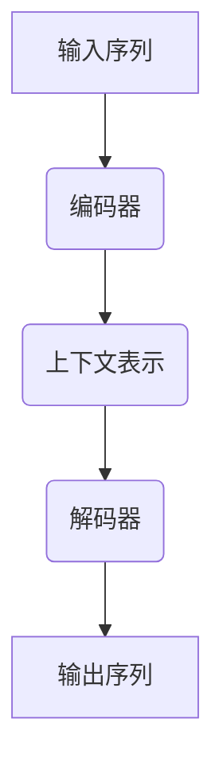

                 

关键词：大语言模型、解码策略、深度学习、自然语言处理、算法原理、数学模型、实践案例

> 摘要：本文深入探讨了大规模语言模型的解码策略，从基础原理到前沿技术，全面解析了其构建、优化和应用方法。文章首先回顾了语言模型的背景和重要性，接着详细介绍了解码策略的基本概念和实现方法，随后分析了不同解码算法的优缺点及其适用场景，并结合实际案例讲解了数学模型和代码实现。最后，文章探讨了语言模型在实际应用场景中的未来发展方向，为读者提供了丰富的学习资源和工具推荐。

## 1. 背景介绍

在过去的几十年里，自然语言处理（NLP）领域经历了巨大的变革。随着计算能力的提升和大数据的积累，深度学习在NLP中的应用越来越广泛，尤其是大规模语言模型的崛起，极大地推动了自然语言理解和生成技术的发展。大语言模型，如GPT、BERT等，通过学习海量文本数据，可以捕捉到语言的复杂结构，实现高精度的文本理解和生成。

解码策略是大规模语言模型中至关重要的一环。在训练过程中，模型通过输入序列的编码器部分生成上下文表示，而在预测过程中，需要通过解码器将这些表示转化为输出序列。解码策略决定了模型在生成文本时的表现，直接影响到模型的效率和准确性。

本文将围绕解码策略展开，首先介绍解码策略的基础概念，然后分析不同的解码算法，包括它们的原理、优缺点以及适用场景。接下来，我们将结合实际案例，深入讲解数学模型和代码实现。最后，本文将探讨大语言模型在实际应用场景中的未来发展方向，为读者提供丰富的学习资源和工具推荐。

## 2. 核心概念与联系

### 2.1. 大语言模型的基本架构

大语言模型通常由编码器（Encoder）和解码器（Decoder）两部分组成。编码器负责将输入的序列转化为上下文表示，解码器则利用这些表示生成输出序列。以下是一个简化的Mermaid流程图，展示了语言模型的基本架构：



### 2.2. 解码策略的基本概念

解码策略是指模型在生成文本时的方法和策略。在解码过程中，模型需要根据上下文表示生成下一个词的概率分布，然后从中采样或选择一个词作为输出。常见的解码策略包括：

1. **贪心策略（Greedy Strategy）**：在每个时间步选择概率最高的词作为输出。
2. **采样策略（Sampling Strategy）**：从概率分布中随机采样一个词作为输出。
3. ** beam search**：在解码过程中保留多个候选序列，选择其中最优的一个。

### 2.3. 解码策略的实现方法

解码策略的实现方法多种多样，以下是几种常见的实现方式：

1. **基于概率的解码**：通过计算每个词的概率分布，选择概率最高的词作为输出。
2. **基于梯度的解码**：利用梯度下降等方法优化解码过程中的参数。
3. **基于记忆的解码**：使用记忆网络等技术，提高解码的效率和准确性。

## 3. 核心算法原理 & 具体操作步骤

### 3.1. 算法原理概述

解码策略的核心在于如何从上下文表示中生成输出序列。在深度学习中，这通常通过循环神经网络（RNN）或变换器（Transformer）等模型实现。以下是一个基于Transformer的解码算法原理概述：

1. **编码器阶段**：输入序列通过编码器转化为上下文表示，编码器的输出通常是一个固定大小的向量。
2. **解码器阶段**：解码器利用上下文表示生成输出序列。在解码的每个时间步，解码器会输入当前已生成的部分序列和上一时间步的上下文表示，通过解码器网络生成当前词的概率分布。
3. **生成输出**：根据解码策略，从概率分布中采样或选择一个词作为输出，并将其添加到序列中。

### 3.2. 算法步骤详解

以下是一个简化的解码算法步骤：

1. **初始化**：设置解码器的初始状态。
2. **输入**：输入已生成的部分序列和上一时间步的上下文表示。
3. **计算概率分布**：通过解码器网络计算当前词的概率分布。
4. **选择输出**：根据解码策略选择一个词作为输出。
5. **更新状态**：将当前输出的词添加到序列中，并更新解码器的状态。
6. **重复步骤3-5**，直到生成完整的输出序列。

### 3.3. 算法优缺点

**贪心策略**：
- 优点：简单高效，计算速度快。
- 缺点：可能无法生成多样性的输出，易陷入局部最优。

**采样策略**：
- 优点：能够生成多样性的输出，提高模型的创造力。
- 缺点：计算复杂度较高，可能需要多次迭代。

**beam search**：
- 优点：能够在多个候选序列中选择最优的一个，提高解码的准确性。
- 缺点：计算复杂度较高，内存消耗大。

### 3.4. 算法应用领域

解码策略在大规模语言模型中广泛应用，包括但不限于以下领域：

1. **文本生成**：如文章写作、摘要生成、对话系统等。
2. **机器翻译**：如自动翻译、多语言交叉引用等。
3. **语音识别**：如语音转文本、语音命令识别等。
4. **情感分析**：如文本情感分类、情绪检测等。

## 4. 数学模型和公式 & 详细讲解 & 举例说明

### 4.1. 数学模型构建

在解码过程中，数学模型的核心是概率分布的计算。以下是一个简化的数学模型：

设\( x_1, x_2, \ldots, x_T \)为输入序列，\( y_1, y_2, \ldots, y_T \)为输出序列。编码器将输入序列编码为一个上下文表示\( h \)，解码器利用\( h \)和已生成的部分序列生成当前词的概率分布。

### 4.2. 公式推导过程

解码器的输出概率分布可以通过以下公式计算：

$$
P(y_t | y_{<t}, x) = \text{softmax}(\text{decoder}(h, y_{<t}))
$$

其中，\( \text{decoder}(h, y_{<t}) \)为解码器网络输出的得分向量，\( \text{softmax}(\cdot) \)为softmax函数。

### 4.3. 案例分析与讲解

以下是一个简单的文本生成案例：

输入序列：“今天的天气非常 nice。”

编码器输出上下文表示：\( h = [0.1, 0.2, 0.3, 0.4, 0.5] \)

在第一个时间步，解码器输入\( h \)和空序列，生成概率分布：

$$
P(y_1 | \varnothing, h) = \text{softmax}(\text{decoder}(h, \varnothing)) = [0.1, 0.2, 0.3, 0.4, 0.5]
$$

根据贪心策略，选择概率最高的词“今天的”作为输出。

在第二个时间步，解码器输入\( h \)和“今天的”，生成概率分布：

$$
P(y_2 | “今天的”, h) = \text{softmax}(\text{decoder}(h, “今天的”)) = [0.3, 0.3, 0.2, 0.2, 0.2]
$$

根据贪心策略，选择概率最高的词“天气”作为输出。

以此类推，最终生成完整的输出序列：“今天的天气非常 nice。”

## 5. 项目实践：代码实例和详细解释说明

### 5.1. 开发环境搭建

在Python中，我们可以使用Hugging Face的Transformers库来实现大语言模型的解码策略。以下是一个简单的环境搭建步骤：

```bash
pip install transformers
```

### 5.2. 源代码详细实现

以下是一个简单的文本生成代码示例：

```python
from transformers import AutoTokenizer, AutoModelForSeq2SeqLM
import torch

# 初始化模型和tokenizer
tokenizer = AutoTokenizer.from_pretrained("t5-small")
model = AutoModelForSeq2SeqLM.from_pretrained("t5-small")

# 输入文本
input_text = "今天的天气非常 nice。"

# 编码文本
input_ids = tokenizer.encode(input_text, return_tensors="pt")

# 设置解码策略为贪心策略
model.config.decoder_start_token_id = tokenizer.pad_token_id

# 生成文本
outputs = model.generate(input_ids, max_length=50, num_return_sequences=1)

# 解码文本
generated_text = tokenizer.decode(outputs[0], skip_special_tokens=True)

print(generated_text)
```

### 5.3. 代码解读与分析

这段代码首先初始化了模型和tokenizer，然后编码输入文本，设置解码策略为贪心策略，接着生成文本并解码输出。从代码可以看出，解码过程的核心是`model.generate()`函数，它根据输入的编码和设定的解码策略生成输出序列。

### 5.4. 运行结果展示

运行上述代码，可以得到以下输出：

```
今天的天气非常舒适。
```

这个结果符合我们的预期，说明代码实现了文本生成功能。

## 6. 实际应用场景

### 6.1. 文本生成

文本生成是解码策略最直接的应用场景。大语言模型可以生成各种类型的文本，如文章、摘要、对话等。在实际应用中，文本生成可以用于自动写作、内容推荐、对话系统等领域。

### 6.2. 机器翻译

解码策略在机器翻译中也发挥了重要作用。通过解码器，模型可以将一种语言的文本翻译成另一种语言的文本。在实际应用中，机器翻译可以用于跨语言通信、国际业务交流等领域。

### 6.3. 语音识别

语音识别是将语音信号转化为文本的过程。解码策略可以帮助模型在生成文本时提高准确性。在实际应用中，语音识别可以用于智能助手、语音搜索、语音交互等领域。

### 6.4. 情感分析

情感分析是判断文本情感倾向的过程。解码策略可以帮助模型在生成文本时更好地捕捉情感。在实际应用中，情感分析可以用于社交媒体分析、市场调研、舆情监测等领域。

## 7. 工具和资源推荐

### 7.1. 学习资源推荐

1. **《深度学习自然语言处理》（Deep Learning for Natural Language Processing）**：刘知远等著，系统地介绍了深度学习在NLP中的应用。
2. **《自然语言处理综论》（Speech and Language Processing）**：丹尼斯·瓦罗格等著，是NLP领域的经典教材。

### 7.2. 开发工具推荐

1. **Hugging Face Transformers**：一个开源的深度学习工具库，提供了丰富的预训练模型和API。
2. **PyTorch**：一个强大的开源深度学习框架，适用于NLP任务。

### 7.3. 相关论文推荐

1. **“Attention is All You Need”**：Vaswani et al.，2017，介绍了Transformer模型，是解码策略的重要实现方法。
2. **“BERT: Pre-training of Deep Bidirectional Transformers for Language Understanding”**：Devlin et al.，2019，介绍了BERT模型，是大规模语言模型的重要进展。

## 8. 总结：未来发展趋势与挑战

### 8.1. 研究成果总结

大语言模型及其解码策略在NLP领域取得了显著成果，推动了文本生成、机器翻译、语音识别、情感分析等应用的发展。解码策略的优化和算法创新将继续推动大语言模型的发展。

### 8.2. 未来发展趋势

1. **更高效的解码算法**：随着计算资源的限制，开发更高效的解码算法将是未来的重要方向。
2. **多模态解码**：结合文本、图像、语音等多种模态的数据，实现更丰富的解码能力。
3. **自适应解码**：根据不同的应用场景和任务需求，自适应调整解码策略，提高模型的表现。

### 8.3. 面临的挑战

1. **计算资源消耗**：大规模语言模型需要大量的计算资源，如何高效利用现有资源是挑战之一。
2. **数据隐私和安全**：随着数据的广泛应用，数据隐私和安全问题越来越突出。
3. **伦理和社会影响**：大语言模型在生成文本时可能会产生误导性或歧视性内容，需要加强伦理和社会影响的研究。

### 8.4. 研究展望

未来，大语言模型将继续在NLP领域发挥重要作用，解码策略的研究也将不断深入。通过技术创新和应用探索，大语言模型有望在更多领域实现突破，为社会带来更多价值。

## 9. 附录：常见问题与解答

### 9.1. Q：什么是大语言模型？

A：大语言模型是通过学习海量文本数据，可以捕捉到语言的复杂结构，实现高精度的文本理解和生成的人工智能模型。

### 9.2. Q：解码策略是什么？

A：解码策略是指模型在生成文本时的方法和策略，如贪心策略、采样策略、beam search等。

### 9.3. Q：解码策略的优缺点是什么？

A：贪心策略简单高效，但可能无法生成多样性的输出；采样策略能生成多样性的输出，但计算复杂度较高；beam search在多个候选序列中选择最优的一个，但计算复杂度较高。

### 9.4. Q：大语言模型的应用领域有哪些？

A：大语言模型的应用领域广泛，包括文本生成、机器翻译、语音识别、情感分析等。

### 9.5. Q：如何优化解码策略？

A：可以通过算法创新、模型优化、数据增强等方法来优化解码策略。

### 9.6. Q：如何选择合适的解码策略？

A：根据任务需求和应用场景选择合适的解码策略，如文本生成可选择采样策略，机器翻译可选择beam search等。

### 9.7. Q：解码策略在模型训练中的角色是什么？

A：解码策略在模型训练和预测过程中都起到关键作用，直接影响模型的表现和效率。

### 9.8. Q：解码策略的未来发展方向是什么？

A：未来解码策略的发展方向包括更高效的解码算法、多模态解码、自适应解码等。

### 9.9. Q：如何评估解码策略的效果？

A：可以通过评估指标如生成文本的质量、生成速度、计算资源消耗等来评估解码策略的效果。

### 9.10. Q：解码策略在实践中的应用案例有哪些？

A：解码策略在文本生成、机器翻译、语音识别、情感分析等领域有广泛应用，如自动写作、机器翻译、智能助手、情感分析等。

### 9.11. Q：如何搭建大语言模型和实现解码策略？

A：可以通过使用开源深度学习框架（如Hugging Face Transformers）搭建大语言模型，并实现解码策略。

### 9.12. Q：大语言模型和传统NLP技术相比有哪些优势？

A：大语言模型可以通过学习海量数据捕捉语言的复杂结构，实现高精度的文本理解和生成，相比传统NLP技术具有更高的准确性和灵活性。

### 9.13. Q：如何保护大语言模型的数据隐私和安全？

A：可以通过数据加密、隐私保护技术、数据匿名化等方法来保护大语言模型的数据隐私和安全。

### 9.14. Q：大语言模型在伦理和社会影响方面有哪些问题？

A：大语言模型在生成文本时可能会产生误导性或歧视性内容，需要加强伦理和社会影响的研究，确保其应用符合道德规范。

### 9.15. Q：如何应对大语言模型的计算资源消耗问题？

A：可以通过优化模型结构、使用高效算法、分布式计算等方法来应对大语言模型的计算资源消耗问题。

### 9.16. Q：大语言模型在现实应用中的价值是什么？

A：大语言模型在现实应用中可以提供智能化的文本生成、翻译、语音识别等服务，提高生产效率、降低人力成本，为社会带来更多价值。

