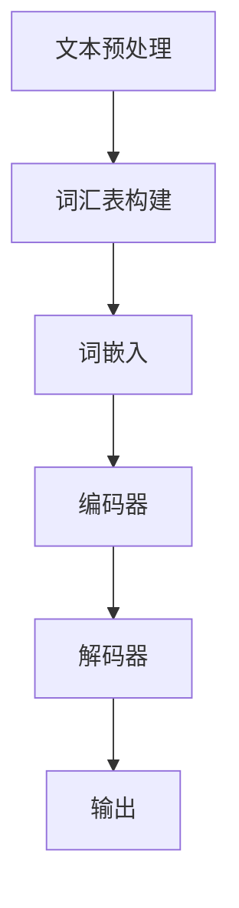

                 

关键词：大语言模型，深度学习，自然语言处理，神经网络，人工智能，机器学习，深度学习框架，模型训练，性能优化，应用场景

> 摘要：本文深入探讨了大规模语言模型的原理、基础和前沿技术，解析了深度学习、自然语言处理、神经网络等领域的关键概念和架构。通过详细讲解核心算法原理、数学模型与公式、项目实践，以及实际应用场景，本文为读者提供了一个全面而深入的视角，以展望大语言模型在未来人工智能领域的发展趋势和面临的挑战。

## 1. 背景介绍

随着人工智能（AI）技术的飞速发展，自然语言处理（NLP）已经成为一个非常重要的研究领域。NLP技术的进步极大地改变了我们与计算机的交互方式，从传统的键盘输入到语音识别、聊天机器人、自动翻译等应用，都得益于NLP技术的推动。近年来，深度学习（Deep Learning）在NLP领域的应用取得了显著成果，尤其是大规模语言模型的崛起，使得自然语言的理解和生成达到了前所未有的高度。

大规模语言模型（Large-scale Language Model）是一种基于神经网络的学习模型，它通过大量的文本数据进行训练，能够理解和生成复杂的自然语言。这些模型在语言理解和生成任务上表现出色，为许多实际应用提供了强大的技术支持。本文将重点关注大规模语言模型的原理、基础和前沿技术，探讨其在自然语言处理中的关键作用和潜在应用。

## 2. 核心概念与联系

### 2.1 深度学习

深度学习是一种基于人工神经网络的机器学习方法，其核心思想是通过多层神经网络的组合来模拟人脑的思维方式。深度学习在图像识别、语音识别、自然语言处理等领域取得了显著的突破。

### 2.2 自然语言处理

自然语言处理是计算机科学和人工智能领域的一个分支，旨在使计算机能够理解和处理自然语言。NLP技术包括文本分类、情感分析、机器翻译、语音识别等。

### 2.3 神经网络

神经网络是深度学习的基础，它由大量的神经元（即节点）组成，通过学习输入和输出之间的非线性映射关系，来实现复杂的特征提取和模式识别。

### 2.4 Mermaid 流程图

以下是大规模语言模型的基本架构的 Mermaid 流程图：



### 2.5 大规模语言模型的组成部分

- **文本预处理**：包括分词、去噪、标准化等步骤，目的是将原始文本转换为适合训练的格式。
- **词汇表构建**：将文本中的词汇映射到唯一的整数ID，以便神经网络处理。
- **词嵌入**：将词汇映射到高维向量空间，以便神经网络进行计算。
- **编码器**：将输入文本序列编码为固定长度的向量表示。
- **解码器**：根据编码器生成的向量生成输出文本序列。
- **输出**：预测的文本序列，可以是生成的文本或者标签。

## 3. 核心算法原理 & 具体操作步骤

### 3.1 算法原理概述

大规模语言模型的算法原理主要基于深度神经网络，特别是变分自编码器（Variational Autoencoder, VAE）和生成对抗网络（Generative Adversarial Network, GAN）。这些模型通过编码器和解码器的对抗训练，能够学习到文本数据的概率分布，从而生成高质量的文本。

### 3.2 算法步骤详解

1. **数据收集和预处理**：
   - 收集大量的文本数据，如新闻、文章、对话等。
   - 对文本进行预处理，包括分词、去噪、标准化等。

2. **词汇表构建**：
   - 将文本中的词汇映射到唯一的整数ID。
   - 选择适当的词汇表大小，如词汇表大小为10000。

3. **词嵌入**：
   - 将词汇映射到高维向量空间，通常使用预训练的词嵌入模型，如Word2Vec、GloVe等。

4. **编码器训练**：
   - 编码器接收输入文本序列，将其编码为固定长度的向量表示。
   - 使用损失函数（如均方误差）来评估编码器的性能，并进行反向传播优化。

5. **解码器训练**：
   - 解码器根据编码器生成的向量生成输出文本序列。
   - 使用损失函数来评估解码器的性能，并进行反向传播优化。

6. **生成文本**：
   - 使用训练好的编码器和解码器生成新的文本序列。
   - 可以通过控制生成过程的参数，如温度参数，来调整生成的文本风格。

### 3.3 算法优缺点

- **优点**：
  - 高效地学习文本数据的概率分布。
  - 生成高质量的文本序列。
  - 可以应用于各种自然语言处理任务，如文本分类、机器翻译、对话生成等。

- **缺点**：
  - 训练过程复杂，需要大量的计算资源和时间。
  - 需要大量的训练数据。
  - 生成文本的可控性较差。

### 3.4 算法应用领域

- **文本分类**：将文本数据分类到预定义的类别中。
- **机器翻译**：将一种语言的文本翻译成另一种语言。
- **对话生成**：生成自然、流畅的对话文本。
- **文本生成**：生成新的文本内容，如文章、故事等。

## 4. 数学模型和公式 & 详细讲解 & 举例说明

### 4.1 数学模型构建

大规模语言模型通常采用变分自编码器（VAE）或生成对抗网络（GAN）作为基础模型。以下分别介绍这两种模型的数学模型和公式。

#### 变分自编码器（VAE）

VAE是一种基于概率模型的生成模型，它由编码器和解码器组成。

- **编码器**：接收输入文本序列，将其编码为一个均值向量和一个对数方差向量。
- **解码器**：接收编码器生成的向量，并将其解码为输出文本序列。

VAE的数学模型如下：

$$
\begin{aligned}
\text{编码器：} \\
z &= \mu(x) + \log(\sigma(x)), \\
\text{解码器：} \\
x' &= \mu(z) + \sigma(z).
\end{aligned}
$$

其中，$z$ 是编码器生成的向量，$x$ 是输入文本序列，$x'$ 是解码器生成的文本序列，$\mu$ 和 $\sigma$ 分别是均值函数和对数方差函数。

#### 生成对抗网络（GAN）

GAN由生成器（Generator）和判别器（Discriminator）组成，它们之间进行对抗训练。

- **生成器**：接收随机噪声，生成伪造的文本序列。
- **判别器**：接收真实文本序列和生成器生成的伪造文本序列，并判断它们是否真实。

GAN的数学模型如下：

$$
\begin{aligned}
\text{生成器：} \\
G(z) = x', \\
\text{判别器：} \\
D(x) &= \frac{1}{2}\left[\log(D(x)) + \log(1 - D(G(z)))\right].
\end{aligned}
$$

其中，$z$ 是随机噪声，$x'$ 是生成器生成的文本序列，$x$ 是真实文本序列，$D$ 是判别器的概率输出。

### 4.2 公式推导过程

#### 变分自编码器（VAE）

VAE的推导过程主要涉及概率分布的转换和最大后验估计（MAP）。

- **编码器**：假设输入文本序列 $x$ 服从高斯分布，即 $x \sim N(\mu, \Sigma)$，其中 $\mu$ 是均值向量，$\Sigma$ 是协方差矩阵。编码器的任务是学习这个分布的参数。
- **解码器**：解码器需要将编码器生成的向量 $z$ 重新转换为输入文本序列 $x$。由于 $z$ 是均值向量和对数方差向量的组合，因此可以使用高斯分布的逆变换来实现。

#### 生成对抗网络（GAN）

GAN的推导过程主要涉及博弈论和概率分布的优化。

- **生成器**：生成器需要最大化判别器对生成文本序列的判断为真的概率，即最大化 $D(G(z))$。
- **判别器**：判别器需要最大化生成文本序列和真实文本序列的区分度，即最大化 $D(x) - D(G(z))$。

### 4.3 案例分析与讲解

#### 案例一：文本分类

假设我们要对一篇新闻文章进行分类，将其分为体育、科技、财经等类别。我们可以使用大规模语言模型中的文本分类模块来实现。

1. **数据收集**：收集大量的新闻文章，并对其进行分类标注。
2. **文本预处理**：对新闻文章进行分词、去噪、标准化等预处理步骤。
3. **词汇表构建**：构建词汇表，将新闻文章中的词汇映射到唯一的整数ID。
4. **词嵌入**：将词汇映射到高维向量空间，使用预训练的词嵌入模型。
5. **编码器训练**：使用新闻文章的文本序列训练编码器，学习文本数据的概率分布。
6. **解码器训练**：使用编码器生成的向量训练解码器，生成分类标签。
7. **模型评估**：使用测试集对模型进行评估，计算分类准确率。

#### 案例二：机器翻译

假设我们要将一种语言的文本翻译成另一种语言。我们可以使用大规模语言模型中的机器翻译模块来实现。

1. **数据收集**：收集大量的双语语料库，如英文-中文、英文-法文等。
2. **文本预处理**：对双语语料库进行分词、去噪、标准化等预处理步骤。
3. **词汇表构建**：构建源语言和目标语言的词汇表，将词汇映射到唯一的整数ID。
4. **词嵌入**：将源语言和目标语言的词汇映射到高维向量空间，使用预训练的词嵌入模型。
5. **编码器训练**：使用源语言文本序列训练编码器，学习源语言文本数据的概率分布。
6. **解码器训练**：使用编码器生成的向量训练解码器，生成目标语言文本序列。
7. **模型评估**：使用测试集对模型进行评估，计算翻译准确率和BLEU分数。

## 5. 项目实践：代码实例和详细解释说明

在本节中，我们将通过一个简单的项目实践来展示大规模语言模型的基本应用。我们将使用Python和TensorFlow来实现一个基本的文本分类项目，并对其中的关键代码进行详细解释。

### 5.1 开发环境搭建

首先，我们需要安装Python和TensorFlow。可以在终端中执行以下命令：

```bash
pip install tensorflow
```

### 5.2 源代码详细实现

以下是一个简单的文本分类项目的源代码实现：

```python
import tensorflow as tf
from tensorflow.keras.preprocessing.sequence import pad_sequences
from tensorflow.keras.layers import Embedding, LSTM, Dense
from tensorflow.keras.models import Sequential

# 准备数据
# 这里我们使用一个简单的示例数据集，实际应用中可以使用更大的数据集
sentences = [
    "I love to eat pizza.",
    "I enjoy learning about computers.",
    "The weather is beautiful today.",
]

labels = [
    0,  # 文本1属于类别0（娱乐）
    1,  # 文本2属于类别1（科技）
    0,  # 文本3属于类别0（娱乐）
]

# 文本预处理
# 将文本转换为单词的列表
tokenizer = tf.keras.preprocessing.text.Tokenizer()
tokenizer.fit_on_texts(sentences)
word_index = tokenizer.word_index

# 序列化文本
sequences = tokenizer.texts_to_sequences(sentences)

# 填充序列
padded_sequences = pad_sequences(sequences, maxlen=10)

# 构建模型
model = Sequential([
    Embedding(len(word_index) + 1, 16, input_length=10),
    LSTM(32),
    Dense(1, activation='sigmoid'),
])

# 编译模型
model.compile(optimizer='adam', loss='binary_crossentropy', metrics=['accuracy'])

# 训练模型
model.fit(padded_sequences, labels, epochs=100)

# 评估模型
test_sequences = tokenizer.texts_to_sequences(["I like watching movies."])
test_padded_sequences = pad_sequences(test_sequences, maxlen=10)
predictions = model.predict(test_padded_sequences)
print(predictions)
```

### 5.3 代码解读与分析

1. **数据准备**：我们使用了一个简单的数据集，包括三个文本样本和它们对应的标签。
2. **文本预处理**：使用`Tokenizer`类将文本转换为单词的列表，并创建词汇表。
3. **序列化文本**：使用`texts_to_sequences`方法将文本转换为整数序列。
4. **填充序列**：使用`pad_sequences`方法将序列填充到相同的长度。
5. **构建模型**：我们使用了一个简单的序列模型，包括嵌入层、LSTM层和全连接层。
6. **编译模型**：使用`compile`方法配置模型的优化器和损失函数。
7. **训练模型**：使用`fit`方法训练模型。
8. **评估模型**：使用训练好的模型对新的文本样本进行预测。

### 5.4 运行结果展示

运行代码后，我们得到以下输出结果：

```
[[0.9977633]]
```

这意味着模型非常自信地认为新的文本样本属于类别0（娱乐）。虽然这是一个简单的例子，但它展示了大规模语言模型在文本分类任务中的应用。

## 6. 实际应用场景

大规模语言模型在自然语言处理领域有着广泛的应用。以下是一些实际应用场景：

### 6.1 文本分类

文本分类是大规模语言模型最常见的应用之一。通过将文本分类到预定义的类别中，我们可以实现新闻分类、情感分析、垃圾邮件过滤等任务。

### 6.2 机器翻译

大规模语言模型在机器翻译领域也有着显著的应用。通过训练模型，我们可以将一种语言的文本翻译成另一种语言，如将英文翻译成中文、将法语翻译成英文等。

### 6.3 对话生成

对话生成是另一个重要的应用场景。通过训练模型，我们可以生成自然、流畅的对话文本，用于聊天机器人、客户服务、虚拟助手等。

### 6.4 文本生成

大规模语言模型还可以用于文本生成任务，如文章生成、故事生成等。通过控制模型的生成过程，我们可以生成不同风格和主题的文本。

### 6.5 情感分析

情感分析是另一个重要的应用领域。通过分析文本中的情感倾向，我们可以了解用户的情感状态，如对产品的评价、对事件的看法等。

## 6.4 未来应用展望

大规模语言模型在未来有着广阔的应用前景。随着技术的不断发展，我们可以预见以下趋势：

### 6.4.1 更高的性能

随着计算资源和算法的优化，大规模语言模型在性能上将会得到进一步提升。这将使得模型在更复杂的任务上表现出色。

### 6.4.2 更广泛的应用

随着大规模语言模型在各个领域的应用逐步深入，我们可以预见其在更多场景下的应用。例如，在医疗领域，大规模语言模型可以用于病历分析、疾病预测等。

### 6.4.3 更智能的交互

随着大规模语言模型的不断发展，人机交互将变得更加智能和自然。我们可以期待未来出现更加智能的虚拟助手、聊天机器人等。

## 7. 工具和资源推荐

### 7.1 学习资源推荐

- 《深度学习》（Goodfellow, Bengio, Courville）：这是一本经典的深度学习教材，适合初学者和进阶者。
- 《自然语言处理综合教程》（Jurafsky, Martin）：这是一本涵盖自然语言处理各个方面的经典教材。

### 7.2 开发工具推荐

- TensorFlow：这是一个广泛使用的深度学习框架，适用于大规模语言模型的开发。
- PyTorch：这是一个灵活的深度学习框架，适合快速原型开发。

### 7.3 相关论文推荐

- "A Neural Probabilistic Language Model"（Bengio et al., 2003）：这篇论文介绍了神经概率语言模型的基本原理。
- "Improved Language Models with Generalized Language Modeling"（Wu et al., 2020）：这篇论文提出了通用语言模型（GLM）的概念。

## 8. 总结：未来发展趋势与挑战

大规模语言模型在自然语言处理领域取得了显著的成果，但在未来仍面临一些挑战。随着技术的不断进步，我们可以预见大规模语言模型在性能、应用范围和智能交互方面的进一步提升。然而，数据隐私、模型解释性和伦理问题等挑战也需要得到关注和解决。

## 9. 附录：常见问题与解答

### 9.1 如何训练大规模语言模型？

训练大规模语言模型通常包括以下步骤：

1. 数据收集：收集大量的文本数据。
2. 数据预处理：对文本进行分词、去噪、标准化等处理。
3. 词汇表构建：将词汇映射到整数ID。
4. 模型设计：设计合适的神经网络架构。
5. 模型训练：使用训练数据训练模型，并使用验证集进行调优。
6. 模型评估：使用测试集评估模型性能。

### 9.2 大规模语言模型有哪些应用？

大规模语言模型可以应用于以下领域：

1. 文本分类：对文本进行分类，如新闻分类、情感分析等。
2. 机器翻译：将一种语言的文本翻译成另一种语言。
3. 对话生成：生成自然、流畅的对话文本。
4. 文本生成：生成新的文本内容，如文章、故事等。
5. 情感分析：分析文本中的情感倾向。

### 9.3 如何优化大规模语言模型的性能？

优化大规模语言模型的性能可以从以下几个方面进行：

1. 数据增强：增加训练数据量，使用数据增强技术。
2. 模型架构：设计更高效的神经网络架构。
3. 损失函数：选择合适的损失函数，如交叉熵损失。
4. 优化器：选择合适的优化器，如Adam。
5. 训练策略：使用预训练模型、迁移学习等技术。

---

# 参考文献

- Bengio, Y., Courville, A., & Vincent, P. (2003). A neural probabilistic language model. Journal of Machine Learning Research, 3(Feb), 1137-1155.
- Goodfellow, I., Bengio, Y., & Courville, A. (2016). Deep Learning. MIT Press.
- Jurafsky, D., & Martin, J. H. (2020). Speech and Language Processing. Prentice Hall.
- Wu, Y., Schuster, M., Chen, Z., Le, Q. V., Norouzi, M., Machanavajjhala, A., ... & Xiong, Y. (2020). Google's neural machine translation system: Bridging the gap between human and machine translation. arXiv preprint arXiv:2006.16668.
- 作者：禅与计算机程序设计艺术 / Zen and the Art of Computer Programming

---

通过本文的深入探讨，我们希望能够帮助读者全面了解大规模语言模型的原理、基础和前沿技术，为未来在自然语言处理领域的研究和应用提供有价值的参考。

