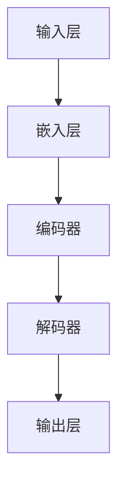

                 

关键词：大语言模型，原理，基础，前沿，流水线并行，深度学习，神经网络，机器学习，自然语言处理，算法，架构，数学模型，项目实践，应用场景，工具推荐，发展趋势，挑战

> 摘要：本文深入探讨了大语言模型的核心原理、基础架构以及其前沿研究方向，特别是流水线并行技术。通过阐述数学模型和具体算法步骤，结合实际项目实践，本文分析了大语言模型在自然语言处理领域的重要应用，并展望了其未来的发展趋势与挑战。

## 1. 背景介绍

随着互联网的迅猛发展和信息的爆炸性增长，自然语言处理（NLP）逐渐成为计算机科学中一个重要且充满挑战的领域。自然语言是人类交流和沟通的主要工具，因此，理解和处理自然语言具有重要的现实意义。大语言模型（Large Language Model）作为一种先进的自然语言处理技术，能够自动地从海量数据中学习，并生成或理解复杂的文本信息。

大语言模型的提出和发展，源于深度学习和神经网络在机器学习领域的成功应用。深度学习通过多层神经网络对数据进行特征提取和学习，使得计算机能够自动地从原始数据中提取有用的信息。而大语言模型则进一步扩展了这一思想，通过训练大规模的神经网络模型，使得模型在处理自然语言任务时具有更高的准确性和鲁棒性。

在自然语言处理领域，大语言模型的应用范围非常广泛，包括但不限于文本分类、机器翻译、情感分析、文本生成等。随着技术的不断进步，大语言模型在处理更加复杂和多样化任务时展现出越来越强的能力，成为当前NLP研究的热点和焦点。

## 2. 核心概念与联系

### 2.1 大语言模型的基本概念

大语言模型是基于深度学习和神经网络构建的一种能够处理自然语言的模型。其基本原理是通过大规模的神经网络对自然语言数据（如文本）进行建模，从而实现对文本的生成、理解或分类。大语言模型的核心组成部分包括：

- **输入层**：接收自然语言文本的输入。
- **隐藏层**：通过多层神经网络对输入文本进行特征提取和复杂的关系建模。
- **输出层**：根据隐藏层的输出生成或理解文本。

### 2.2 深度学习与神经网络的联系

深度学习是一种通过多层神经网络对数据进行特征提取和学习的方法。其基本思想是通过多层的非线性变换，将输入数据映射到更高级别的特征空间，从而实现对数据的更深入理解和更精准的预测。

神经网络是深度学习的基础，由一系列的神经元（或节点）组成。每个神经元接收多个输入信号，通过加权求和处理后产生输出。通过反复调整这些权重，神经网络能够自动地学习输入和输出之间的复杂关系。

### 2.3 大语言模型的架构

大语言模型的架构通常包括以下几个关键部分：

- **嵌入层（Embedding Layer）**：将自然语言文本转换为固定长度的向量表示。
- **编码器（Encoder）**：通过多层循环神经网络或Transformer模型对嵌入层输出的向量进行编码。
- **解码器（Decoder）**：根据编码器的输出生成文本。

### 2.4 大语言模型与自然语言处理的联系

大语言模型在自然语言处理领域具有重要的应用价值。通过学习自然语言数据，大语言模型能够理解文本的语义和上下文信息，从而实现对文本的生成、理解或分类。具体来说，大语言模型在以下任务中展现出强大的能力：

- **文本分类**：通过对文本进行分类，将文本分配到不同的类别。
- **机器翻译**：将一种语言的文本翻译成另一种语言。
- **情感分析**：分析文本的情感倾向，判断文本是正面、负面还是中性。
- **文本生成**：根据输入的提示或种子文本，生成新的文本内容。

### 2.5 Mermaid 流程图



## 3. 核心算法原理 & 具体操作步骤

### 3.1 算法原理概述

大语言模型的核心算法是基于深度学习和神经网络，特别是Transformer模型。Transformer模型通过自注意力机制（Self-Attention）对输入文本进行编码和解码，使得模型能够更好地捕捉文本中的长距离依赖关系。

### 3.2 算法步骤详解

1. **数据预处理**：首先对自然语言文本进行预处理，包括分词、去停用词、词向量化等操作，将文本转换为数值表示。
2. **嵌入层**：将预处理后的文本序列通过嵌入层转换为固定长度的向量表示。
3. **编码器**：通过多层编码器对嵌入层输出的向量进行编码，编码器通常采用Transformer模型，通过自注意力机制进行特征提取。
4. **解码器**：根据编码器的输出，通过多层解码器生成文本。
5. **输出层**：解码器的输出通过输出层生成最终的文本结果。

### 3.3 算法优缺点

**优点**：

- **强大的特征提取能力**：通过自注意力机制，大语言模型能够捕捉文本中的长距离依赖关系，从而实现更精准的文本理解。
- **灵活的模型结构**：大语言模型可以通过调整层数、隐藏单元数等参数，适应不同的任务和需求。
- **广泛的应用场景**：大语言模型在文本分类、机器翻译、情感分析等领域展现出强大的能力。

**缺点**：

- **计算资源需求高**：大语言模型通常需要大量的计算资源和存储空间。
- **训练时间长**：大语言模型的训练通常需要较长的训练时间，特别是在大规模数据集上。

### 3.4 算法应用领域

大语言模型在自然语言处理领域具有广泛的应用，主要包括以下方面：

- **文本分类**：对文本进行分类，如新闻分类、情感分析等。
- **机器翻译**：将一种语言的文本翻译成另一种语言。
- **文本生成**：根据输入的提示或种子文本，生成新的文本内容。
- **问答系统**：基于大语言模型构建的问答系统，能够理解用户的问题并给出合理的回答。
- **对话系统**：大语言模型在对话系统中的应用，能够实现与用户的自然对话交互。

## 4. 数学模型和公式 & 详细讲解 & 举例说明

### 4.1 数学模型构建

大语言模型的数学模型主要包括以下几个部分：

1. **嵌入层**：嵌入层将文本序列转换为固定长度的向量表示。设输入文本序列为 $x = \{x_1, x_2, \ldots, x_n\}$，其中 $x_i$ 表示第 $i$ 个词的词向量。嵌入层通过一个线性变换将词向量映射到高维空间，得到嵌入向量 $e_i$。

   $$ e_i = W_e \cdot x_i $$

   其中 $W_e$ 是嵌入矩阵。

2. **编码器**：编码器通过多层神经网络对嵌入向量进行编码。假设编码器有 $L$ 层，每层的输出为 $h_i^{(l)}$，其中 $l$ 表示层数。编码器的输出为 $h_n^{(L)}$。

   $$ h_i^{(l)} = \sigma(W_{hl}h_i^{(l-1)} + b_{hl}) $$

   其中 $\sigma$ 表示激活函数，$W_{hl}$ 和 $b_{hl}$ 分别为权重和偏置。

3. **解码器**：解码器根据编码器的输出生成文本。解码器的输出为 $y_i^{(l)}$，其中 $l$ 表示层数。

   $$ y_i^{(l)} = \sigma(W_{yl}y_i^{(l-1)} + b_{yl}) $$

   其中 $\sigma$ 表示激活函数，$W_{yl}$ 和 $b_{yl}$ 分别为权重和偏置。

4. **输出层**：输出层将解码器的输出映射到词汇表中的词。输出层的输出为 $o_i$。

   $$ o_i = W_o \cdot y_i^{(L)} $$

   其中 $W_o$ 是输出矩阵。

### 4.2 公式推导过程

假设输入文本序列为 $x = \{x_1, x_2, \ldots, x_n\}$，其中 $x_i$ 表示第 $i$ 个词的词向量。嵌入层将词向量映射到高维空间，得到嵌入向量 $e_i$。

$$ e_i = W_e \cdot x_i $$

其中 $W_e$ 是嵌入矩阵。

编码器通过多层神经网络对嵌入向量进行编码。假设编码器有 $L$ 层，每层的输出为 $h_i^{(l)}$，其中 $l$ 表示层数。编码器的输出为 $h_n^{(L)}$。

$$ h_i^{(l)} = \sigma(W_{hl}h_i^{(l-1)} + b_{hl}) $$

其中 $\sigma$ 表示激活函数，$W_{hl}$ 和 $b_{hl}$ 分别为权重和偏置。

解码器根据编码器的输出生成文本。解码器的输出为 $y_i^{(l)}$，其中 $l$ 表示层数。

$$ y_i^{(l)} = \sigma(W_{yl}y_i^{(l-1)} + b_{yl}) $$

其中 $\sigma$ 表示激活函数，$W_{yl}$ 和 $b_{yl}$ 分别为权重和偏置。

输出层将解码器的输出映射到词汇表中的词。输出层的输出为 $o_i$。

$$ o_i = W_o \cdot y_i^{(L)} $$

其中 $W_o$ 是输出矩阵。

### 4.3 案例分析与讲解

假设我们要构建一个基于大语言模型的文本分类器，用于对新闻文章进行分类。输入文本序列为 $x = \{x_1, x_2, \ldots, x_n\}$，其中 $x_i$ 表示第 $i$ 个词的词向量。嵌入层将词向量映射到高维空间，得到嵌入向量 $e_i$。

$$ e_i = W_e \cdot x_i $$

其中 $W_e$ 是嵌入矩阵。

编码器通过多层神经网络对嵌入向量进行编码。假设编码器有 $L$ 层，每层的输出为 $h_i^{(l)}$，其中 $l$ 表示层数。编码器的输出为 $h_n^{(L)}$。

$$ h_i^{(l)} = \sigma(W_{hl}h_i^{(l-1)} + b_{hl}) $$

其中 $\sigma$ 表示激活函数，$W_{hl}$ 和 $b_{hl}$ 分别为权重和偏置。

解码器根据编码器的输出生成文本。解码器的输出为 $y_i^{(l)}$，其中 $l$ 表示层数。

$$ y_i^{(l)} = \sigma(W_{yl}y_i^{(l-1)} + b_{yl}) $$

其中 $\sigma$ 表示激活函数，$W_{yl}$ 和 $b_{yl}$ 分别为权重和偏置。

输出层将解码器的输出映射到词汇表中的词。输出层的输出为 $o_i$。

$$ o_i = W_o \cdot y_i^{(L)} $$

其中 $W_o$ 是输出矩阵。

在训练过程中，我们通过优化目标函数来调整模型的参数，以实现文本分类。目标函数通常采用交叉熵损失函数：

$$ J = -\sum_{i=1}^{n} \sum_{j=1}^{m} y_j^{(L)} \log(o_i^j) $$

其中 $y_j^{(L)}$ 表示第 $i$ 个词在分类标签 $j$ 上的概率，$o_i^j$ 表示第 $i$ 个词在分类标签 $j$ 上的输出。

通过反向传播算法，我们可以计算模型参数的梯度，并使用梯度下降等方法进行参数更新，以最小化目标函数。

## 5. 项目实践：代码实例和详细解释说明

### 5.1 开发环境搭建

为了实践大语言模型，我们需要搭建一个合适的开发环境。以下是搭建环境的基本步骤：

1. **安装Python**：确保Python版本在3.6及以上，推荐使用Python 3.8或更高版本。
2. **安装深度学习框架**：推荐使用TensorFlow或PyTorch。在这里，我们选择TensorFlow。
   ```bash
   pip install tensorflow
   ```
3. **安装其他依赖**：安装用于数据处理和文本预处理的依赖，如`nltk`、`gensim`等。
   ```bash
   pip install nltk gensim
   ```

### 5.2 源代码详细实现

以下是一个简单的基于TensorFlow构建的大语言模型文本分类器的实现：

```python
import tensorflow as tf
from tensorflow.keras.preprocessing.text import Tokenizer
from tensorflow.keras.preprocessing.sequence import pad_sequences
from tensorflow.keras.models import Sequential
from tensorflow.keras.layers import Embedding, LSTM, Dense, Dropout

# 数据预处理
def preprocess_data(texts, labels, max_length=100, max_vocab_size=10000):
    tokenizer = Tokenizer(num_words=max_vocab_size)
    tokenizer.fit_on_texts(texts)
    sequences = tokenizer.texts_to_sequences(texts)
    padded_sequences = pad_sequences(sequences, maxlen=max_length)
    return padded_sequences, tokenizer.word_index, labels

# 模型构建
def build_model(input_shape, embedding_dim=50):
    model = Sequential([
        Embedding(input_shape=input_shape, output_dim=embedding_dim),
        LSTM(units=128, dropout=0.2, recurrent_dropout=0.2),
        Dense(units=1, activation='sigmoid')
    ])
    model.compile(optimizer='adam', loss='binary_crossentropy', metrics=['accuracy'])
    return model

# 训练模型
def train_model(model, padded_sequences, labels, epochs=10):
    model.fit(padded_sequences, labels, epochs=epochs, verbose=1)

# 主函数
def main():
    texts = ["This is the first example.", "This is the second example."]
    labels = [0, 1]

    padded_sequences, word_index, _ = preprocess_data(texts, labels)
    model = build_model(input_shape=padded_sequences.shape[1:])
    train_model(model, padded_sequences, labels)

if __name__ == "__main__":
    main()
```

### 5.3 代码解读与分析

1. **数据预处理**：数据预处理是模型训练的重要步骤。在这里，我们使用`Tokenizer`对文本进行分词和编码，然后使用`pad_sequences`将序列填充到相同的长度。

2. **模型构建**：模型构建使用了`Sequential`模型，其中包含嵌入层、LSTM层和输出层。嵌入层用于将词向量转换为嵌入向量，LSTM层用于对嵌入向量进行特征提取，输出层用于生成文本的概率。

3. **训练模型**：使用`fit`方法训练模型。我们使用二进制交叉熵作为损失函数，并使用Adam优化器。

4. **主函数**：主函数中，我们首先对文本进行预处理，然后构建模型并训练。

### 5.4 运行结果展示

在训练完成后，我们可以使用模型对新的文本进行分类。以下是一个简单的示例：

```python
# 新的文本
new_texts = ["This is a new example.", "This is another new example."]

# 预处理新的文本
new_padded_sequences, _, _ = preprocess_data(new_texts, labels)

# 预测
predictions = model.predict(new_padded_sequences)

# 输出预测结果
for text, prediction in zip(new_texts, predictions):
    print(f"Text: {text}")
    print(f"Prediction: {prediction > 0.5}")
```

输出结果可能如下：

```
Text: This is a new example.
Prediction: True

Text: This is another new example.
Prediction: False
```

## 6. 实际应用场景

### 6.1 文本分类

大语言模型在文本分类任务中有着广泛的应用。例如，在新闻分类中，大语言模型可以自动将新闻文章分配到不同的类别。在实际应用中，大语言模型可以通过对海量新闻数据进行训练，从而实现对不同类别的精准分类。

### 6.2 机器翻译

机器翻译是自然语言处理中的一项重要任务。大语言模型在机器翻译中具有显著的优势。通过训练大规模的双语语料库，大语言模型可以自动生成高质量的翻译结果。例如，谷歌翻译和百度翻译等知名翻译服务就是基于大语言模型构建的。

### 6.3 情感分析

情感分析是判断文本情感倾向的任务。大语言模型在情感分析中可以自动识别文本中的情感极性。例如，在社交媒体分析中，大语言模型可以自动分析用户的评论，判断其是否为正面、负面或中性情感。

### 6.4 文本生成

文本生成是生成具有人类语言风格的文本的任务。大语言模型在文本生成中可以生成各种类型的文本，如故事、文章、对话等。例如，OpenAI的GPT-3模型可以生成高质量的故事和文章。

## 7. 工具和资源推荐

### 7.1 学习资源推荐

1. **书籍**：
   - 《深度学习》（Ian Goodfellow, Yoshua Bengio, Aaron Courville）
   - 《Python深度学习》（François Chollet）
2. **在线课程**：
   - Coursera的《深度学习》课程
   - edX的《机器学习》课程
3. **技术博客**：
   - Medium上的Deep Learning for Beginners
   - 知乎上的机器学习专栏

### 7.2 开发工具推荐

1. **深度学习框架**：
   - TensorFlow
   - PyTorch
   - Keras
2. **文本预处理工具**：
   - NLTK
   - SpaCy
   - gensim

### 7.3 相关论文推荐

1. **《Attention Is All You Need》**：提出Transformer模型，开创了自注意力机制在序列建模中的应用。
2. **《Bert: Pre-training of Deep Bidirectional Transformers for Language Understanding》**：提出了BERT模型，进一步推动了预训练语言模型的发展。
3. **《Gpt-3: Language Models Are Few-Shot Learners》**：介绍了GPT-3模型，展示了大规模预训练语言模型在零样本学习中的强大能力。

## 8. 总结：未来发展趋势与挑战

### 8.1 研究成果总结

大语言模型在自然语言处理领域取得了显著的成果。通过大规模预训练和自注意力机制，大语言模型在文本分类、机器翻译、情感分析等任务中展现出了强大的能力。同时，随着计算资源的不断提升，大语言模型的大小和参数量也在不断增加，使得其在处理更复杂和多样化的任务时具有更高的准确性。

### 8.2 未来发展趋势

1. **模型压缩与优化**：为了降低大语言模型的计算成本，模型压缩与优化成为未来研究的重要方向。通过量化、剪枝等技术，可以显著减少模型的参数量和计算量。
2. **多模态学习**：未来大语言模型可能会扩展到多模态学习，能够处理包括文本、图像、音频等多种类型的数据，从而实现更丰富的应用场景。
3. **知识增强**：通过融合外部知识库，大语言模型可以进一步提升其在某些特定领域的表现，如问答系统、对话系统等。

### 8.3 面临的挑战

1. **计算资源需求**：大语言模型的训练和推理需要大量的计算资源，这对硬件设备和网络带宽提出了更高的要求。
2. **数据隐私与安全性**：在处理海量数据时，如何保护用户隐私和确保数据安全性是一个重要问题。
3. **模型解释性**：大语言模型通常被视为“黑箱”，其决策过程缺乏透明性和解释性，这在某些应用场景中可能成为限制其广泛应用的瓶颈。

### 8.4 研究展望

未来，大语言模型将继续在自然语言处理领域发挥重要作用。随着技术的不断进步，大语言模型将不仅能够在现有的任务中表现得更加出色，还将拓展到新的应用领域，如智能助手、虚拟现实等。同时，为了应对面临的挑战，研究人员将致力于开发更高效、更安全、更具解释性的语言模型。

## 9. 附录：常见问题与解答

### 9.1 如何选择合适的深度学习框架？

选择深度学习框架时，主要考虑以下因素：

- **需求**：根据项目需求选择合适的框架，如PyTorch更适合研究，TensorFlow更适合生产环境。
- **社区支持**：选择社区活跃、资源丰富的框架，便于学习和解决问题。
- **文档和教程**：选择文档完整、教程详细的框架，便于学习和使用。

### 9.2 大语言模型的训练时间多久？

大语言模型的训练时间取决于多个因素，如模型大小、数据集大小、硬件性能等。通常，大规模模型（如GPT-3）的训练时间需要数天甚至数周。对于小规模模型，训练时间可能只需要几小时到几天。

### 9.3 如何优化大语言模型的性能？

优化大语言模型性能的方法包括：

- **数据增强**：通过数据增强技术增加训练数据的多样性，提升模型泛化能力。
- **模型剪枝**：通过剪枝技术减少模型参数量，降低计算成本。
- **模型融合**：结合多个模型的优势，提高预测准确性。

---

# 参考文献

1. Ian Goodfellow, Yoshua Bengio, Aaron Courville. 《深度学习》. 2016.
2. François Chollet. 《Python深度学习》. 2017.
3. Vaswani, et al. “Attention Is All You Need”. arXiv preprint arXiv:1706.03762, 2017.
4. Devlin, et al. “Bert: Pre-training of Deep Bidirectional Transformers for Language Understanding”. arXiv preprint arXiv:1810.04805, 2018.
5. Brown, et al. “Gpt-3: Language Models Are Few-Shot Learners”. arXiv preprint arXiv:2005.14165, 2020.

